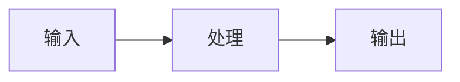

<div align="center">

# Latent Note

**一处存放笔记、想法与未完成答案的隐空间。**

[](https://github.com/AndingDrLin/AndingDrLin.github.io/actions/workflows/deploy.yml)
[](https://github.com/AndingDrLin/AndingDrLin.github.io/actions/workflows/check.yml)
[](https://nodejs.org/)
[](https://astro.build/)

记录 AI、3D 视觉、Agent 工具与科研过程里那些还没完全收束的判断。

[线上站点](https://andingdrlin.github.io/) · [博客](https://andingdrlin.github.io/blog/) · [笔记](https://andingdrlin.github.io/notes/) · [RSS](https://andingdrlin.github.io/rss.xml)

</div>

---

## 这是什么

Latent Note 是一个用 [Astro](https://astro.build/) 构建的个人知识站点，部署在 GitHub Pages。它不是教程平台，也不是文档站点——更像是一个公开的 research log：课程自学笔记、技术实验记录、阶段性判断和还没想清楚但值得留下的观察。

**它能做什么：**
- 📝 课程笔记按章节目录树组织，支持 LaTeX 数学公式和 Mermaid 图表
- 🔍 全文搜索（Pagefind），中英文分词，`Cmd+K` 快捷键
- 🌙 亮/暗主题切换，跟随系统偏好
- 📱 响应式布局，移动端适配
- ♿ 无障碍支持（skip-to-content、语义化 HTML、ARIA 标签）
- 📊 结构化数据（JSON-LD），SEO 友好
- 🧠 交互式测验系统（React），支持错题本和弱项分析

## 技术栈

| 层 | 技术 |
|---|---|
| 框架 | [Astro 6](https://astro.build/) + TypeScript strict |
| 内容 | Astro Content Collections (Markdown + MDX) |
| 数学 | KaTeX（`remark-math` + `rehype-katex`） |
| 图表 | Mermaid（客户端 CDN，按需加载） |
| 搜索 | [Pagefind](https://pagefind.app/)（`--force-language zh`） |
| 测验 | React 19（项目中唯一的客户端交互组件） |
| 测试 | [Vitest](https://vitest.dev/) |
| 部署 | GitHub Pages via GitHub Actions |

## 快速开始

```bash
# 前置要求：Node.js >= 22
git clone https://github.com/AndingDrLin/AndingDrLin.github.io.git
cd AndingDrLin.github.io
npm install
npm run dev          # 启动开发服务器 → http://localhost:4321
```

### 可用命令

| 命令 | 作用 |
|---|---|
| `npm run dev` | 启动开发服务器 |
| `npm run build` | 生产构建 + Pagefind 搜索索引 |
| `npm run preview` | 预览生产构建 |
| `npm run validate` | 校验所有内容的 frontmatter |
| `npm run validate:blog` | 只校验博客 |
| `npm run validate:notes` | 只校验笔记 |
| `npm run check` | Astro 类型检查 |
| `npm run test` | 运行 Vitest 测试 |
| `npm run publish:course <docGroup>` | 课程发布前的完整校验流程 |

## 项目结构

```
src/
├── pages/              # 路由入口
│   ├── index.astro     # 首页
│   ├── blog/           # 博客列表和文章页
│   ├── notes/          # 笔记首页、课程页、教程页、测验页
│   └── rss.xml.ts      # RSS 订阅
├── layouts/
│   ├── BaseLayout.astro   # 根布局（SEO、主题、Mermaid、a11y）
│   └── PostLayout.astro   # 文章布局（TOC、meta、JSON-LD）
├── components/
│   ├── Header.astro       # 导航栏
│   ├── Footer.astro       # 页脚
│   ├── PostCard.astro     # 文章卡片
│   ├── NoteDirectoryList.astro  # 目录列表
│   ├── Search.astro       # Pagefind 搜索对话框
│   ├── TOC.astro          # 文章目录
│   ├── ThemeToggle.astro  # 主题切换
│   ├── SEO.astro          # Meta + Open Graph + JSON-LD
│   └── quiz/              # React 测验系统
├── content/
│   ├── blog/           # 博客文章
│   └── notes/          # 课程笔记、教程、独立笔记
├── content.config.ts   # 集合 schema 定义
├── consts.ts           # 全站常量（课程、分类、文案）
├── utils/
│   ├── content.ts      # 内容获取与排序
│   ├── noteTree.ts     # 目录树逻辑
│   └── readingTime.ts  # 阅读时间估算
├── data/
│   └── question-banks/ # 测验题库
└── styles/
    └── global.css      # 纯 CSS，自定义属性，暗色模式

scripts/
├── validate-content.mjs  # Frontmatter 校验（动态读取 consts）
├── publish-course.mjs    # 课程发布自动化校验
└── notes-pipeline/       # 课程笔记生成 checklist 和 agent prompt

templates/              # 内容模板
.editorconfig           # 编辑器统一配置
.github/
├── workflows/
│   ├── deploy.yml      # 构建 + 部署
│   ├── check.yml       # PR 校验
│   └── links.yml       # 定期断链检查
├── CODEOWNERS          # 代码所有权
├── dependabot.yml      # 自动依赖更新
├── ISSUE_TEMPLATE/     # Issue 模板
└── PULL_REQUEST_TEMPLATE.md  # PR 模板
```

## 内容创作

### 内容类型

| 类型 | 目录 | 模板 | 说明 |
|---|---|---|---|
| 博客 | `src/content/blog/` | `templates/blog-template.md` | 完整的技术文章和实验记录 |
| 课程笔记 | `src/content/notes/<docGroup>/` | `templates/docs-template.md` | 按章节组织的课程笔记 |
| 教程 | `src/content/notes/<docGroup>/` | `templates/tutorial-template.md` | 分步骤的技术教程 |
| 独立笔记 | `src/content/notes/` | `templates/note-template.md` | 不属于特定课程的零散记录 |

### Frontmatter 参考

```yaml
---
title: "文章标题"              # 必填
description: "一句话描述"       # 必填，用于卡片和 SEO
date: 2026-06-15              # 必填
updated: 2026-06-16           # 可选
tags: [dsp, signal-processing] # 可选，默认 []
category: "课程学习"            # 必填，见下方允许值
docGroup: dsp-notes           # 仅笔记，映射到 NOTE_COURSES key
order: 1                      # 仅笔记，控制列表排序
draft: false                  # true 时在生产构建中隐藏
cover: /path/to/image.png     # 可选
source: https://example.com   # 可选，必须是 http(s) URL
---
```

**允许的分类：** `AI Tools` · `3D Vision` · `Agents` · `Research Notes` · `Essays` · `Tutorials` · `课程学习`

### 添加新课程

```bash
# 1. 在 src/consts.ts 的 NOTE_COURSES 中添加条目
# 2. 创建目录和文件
mkdir src/content/notes/my-course
cp templates/docs-template.md src/content/notes/my-course/README.md
# 3. 编辑 README.md，设置 order: -1 和正确的 docGroup
# 4. 添加章节文件
cp templates/docs-template.md src/content/notes/my-course/chapter1.md
# 5. 校验
npm run validate:notes
npm run build
# 6. 一键校验
npm run publish:course my-course
```

### LaTeX 数学

行内公式：`$E = mc^2$`

独立公式：
```latex
$$
\int_{-\infty}^{\infty} e^{-x^2} dx = \sqrt{\pi}
$$
```

### Mermaid 图表

````markdown

````

## 开发指南

### 测试

```bash
npm run test              # 运行所有测试
npm run test:watch        # 监听模式
```

测试覆盖核心工具函数（阅读时间计算、目录树逻辑、frontmatter 校验脚本）。

### CI/CD

| 工作流 | 触发条件 | 作用 |
|---|---|---|
| `deploy.yml` | push to `main`（内容/配置路径） | 构建 → 部署到 GitHub Pages |
| `check.yml` | PR + push to `main` | 校验 → 类型检查 → 构建检查 |
| `links.yml` | 每周一自动 / 手动 | lychee 断链检查 |
| Dependabot | 自动 | npm + GitHub Actions 依赖更新 |

### 代码质量

- TypeScript strict mode（`tsconfig.json`）
- Frontmatter 校验脚本（`npm run validate`），常量从 `src/consts.ts` 动态读取
- `.editorconfig` 统一编辑器配置
- Vitest 单元测试和集成测试

## 参与贡献

欢迎提交内容和改进！请阅读 [CONTRIBUTING.md](CONTRIBUTING.md) 了解完整流程。

### 快速通道

1. **Fork** 本仓库
2. **创建分支：** `git checkout -b feat/my-new-content`
3. **添加内容：** 使用 `templates/` 中的模板
4. **本地验证：** `npm run validate && npm run build`
5. **提交 PR：** 使用提供的 PR 模板

### 贡献类型

- 📝 **博客文章** — 技术文章、实验记录、研究反思
- 📚 **课程笔记** — 新课程或补充已有课程的缺失章节
- 🎓 **教程** — 分步骤的技术教程
- 🐛 **Bug 修复** — 内容错误、链接断裂、UI 问题
- ✨ **功能改进** — 新组件、性能优化、无障碍改善

### 写作规范

内容使用中文写作。核心原则：

1. **从具体问题出发** — 不要宏大叙事开头
2. **有明确判断** — 不只堆材料
3. **承认边界** — 标注不确定性
4. **实验思维** — 观察 → 条件 → 原因 → 验证
5. **写局限不写意义** — 说实话，不说空话

详细规范见 [CLAUDE.md](CLAUDE.md) 的"写作规范"部分。

## 关键设计决策

- **无 `base` 路径。** GitHub Pages 用户站点（`andingdrlin.github.io`），不是项目站点。
- **`docGroup` 桥接内容和路由。** `NOTE_COURSES` 的 dict key 不是 URL slug — `slug` 字段才是。
- **README 文件从列表中隐藏。** `readme.md`（不区分大小写）不显示在目录列表中，但其 `description` 用于课程着陆页。
- **纯 CSS。** 无组件库、无工具类框架、无预处理器。
- **源材料不入仓库。** 工作文档、提取文本、原始素材放在仓库外。`draft: true` 只用于真正未完成的内容。
- **React 仅用于测验。** 全站唯一的客户端交互组件。

## 许可证

内容采用 [CC BY-NC-SA 4.0](https://creativecommons.org/licenses/by-nc-sa/4.0/) 许可。

代码部分采用 [MIT License](LICENSE)。

---

<div align="center">

**[线上站点](https://andingdrlin.github.io/)** · **[RSS](https://andingdrlin.github.io/rss.xml)** · **[GitHub](https://github.com/AndingDrLin)**

</div>
