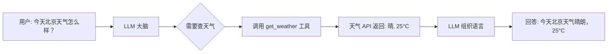

# 第 4 章：Tool Use — 让 LLM 调用外部工具

**学完本章，你将能够：**

- 理解 Function Calling 的工作原理
- 设计高质量的 Tool Schema（工具描述）
- 让 LLM 自主决定何时调用什么工具
- 处理多工具并行调用和错误恢复

---

## 4.1 从"会说话"到"能做事"

到目前为止，LLM 只能做一件事：**生成文本**。它可以写诗、翻译、回答问题，但它不能：

- 查询今天的天气
- 在数据库中搜索信息
- 执行代码计算
- 发送邮件

**Tool Use（工具调用）** 就是让 LLM 从"会说话"升级到"能做事"的关键技术。

用一个类比：

> LLM 就像一个聪明的大脑，Tool Use 就是给它装上了手和脚。大脑决定"我需要做什么"，手脚负责"具体去做"。



> **关键理解**：LLM 生成的是"调用意图"（JSON 描述），不是真的执行了函数。真正的执行在你的代码里。这也是为什么 Tool Use 是安全的——你可以控制 LLM 能调用哪些工具、带什么参数。

---

## 4.2 Function Calling 原理

### 它是怎么工作的？

Function Calling 不是魔法，本质上是精心设计的 Prompt：

1. **你告诉 LLM**：这里有一些工具可以用，每个工具的描述和参数如下
2. **LLM 分析用户问题**：判断是否需要调用工具，调用哪个工具，带什么参数
3. **LLM 输出一个特殊的 JSON**：表示"我想调用这个工具，参数是这些"
4. **你的代码执行工具**：把 JSON 解析出来，真正调用函数
5. **把结果返回给 LLM**：LLM 根据结果组织最终回答

> 完整代码见 [`code/04-tool-use/basic_function_calling.py`](./code/04-tool-use/basic_function_calling.py)。

```python
from openai import OpenAI
import json

client = OpenAI()

# 第 1 步：定义工具
tools = [
    {
        "type": "function",
        "function": {
            "name": "calculate",
            "description": "执行数学计算。当用户需要计算数学表达式时使用。",
            "parameters": {
                "type": "object",
                "properties": {
                    "expression": {
                        "type": "string",
                        "description": "数学表达式，如 '2 + 3 * 4'"
                    }
                },
                "required": ["expression"]
            }
        }
    }
]

# 第 2 步：定义工具的执行函数
def calculate(expression: str) -> str:
    """安全地执行数学计算"""
    try:
        # 只允许数学运算，不允许执行任意代码
        allowed_chars = set("0123456789+-*/(). ")
        if not all(c in allowed_chars for c in expression):
            return "错误：表达式包含不允许的字符"
        result = eval(expression)
        return str(result)
    except Exception as e:
        return f"计算错误: {e}"

# 第 3 步：调用 LLM，带上工具定义
response = client.chat.completions.create(
    model="gpt-4o",
    messages=[{"role": "user", "content": "帮我算一下 (15 + 27) * 3 等于多少"}],
    tools=tools,
    tool_choice="auto",
)

# 第 4 步：检查 LLM 是否要调用工具
message = response.choices[0].message
if message.tool_calls:
    tool_call = message.tool_calls[0]
    func_name = tool_call.function.name
    args = json.loads(tool_call.function.arguments)
    print(f"LLM 想调用: {func_name}({args})")

    # 第 5 步：执行工具并返回结果
    result = calculate(args["expression"])
    print(f"计算结果: {result}")
```

---

## 4.3 Tool Schema 设计

Tool Schema 是你告诉 LLM "这个工具能做什么、怎么用"的描述。**写得好不好直接决定了 LLM 能不能正确调用工具。**

### Schema 设计原则

```python
# 好的 description：具体、明确、包含使用场景
{
    "name": "search_documents",
    "description": "在知识库中搜索文档。当用户询问需要查找具体信息的问题时使用。不适用于闲聊或一般性问题。",
    "parameters": {
        "type": "object",
        "properties": {
            "query": {
                "type": "string",
                "description": "搜索关键词，应该简洁明确，如 'Python 列表推导式'"
            },
            "top_k": {
                "type": "integer",
                "description": "返回结果数量，默认 3",
                "default": 3
            }
        },
        "required": ["query"]
    }
}

# 差的 description：模糊、简短
{
    "name": "search",
    "description": "搜索",     # 搜索什么？什么时候用？
    "parameters": {...}
}
```

### 实战：设计多个工具

> 完整代码见 [`code/04-tool-use/multi_tool_agent.py`](./code/04-tool-use/multi_tool_agent.py)。

```python
tools = [
    {
        "type": "function",
        "function": {
            "name": "get_weather",
            "description": "查询指定城市的当前天气信息",
            "parameters": {
                "type": "object",
                "properties": {
                    "city": {"type": "string", "description": "城市名称，如 '北京'、'上海'"}
                },
                "required": ["city"]
            }
        }
    },
    {
        "type": "function",
        "function": {
            "name": "search_web",
            "description": "搜索互联网获取最新信息。当需要查找实时信息、新闻或用户不知道的知识时使用。",
            "parameters": {
                "type": "object",
                "properties": {
                    "query": {"type": "string", "description": "搜索查询词"}
                },
                "required": ["query"]
            }
        }
    },
    {
        "type": "function",
        "function": {
            "name": "calculate",
            "description": "执行数学计算",
            "parameters": {
                "type": "object",
                "properties": {
                    "expression": {"type": "string", "description": "数学表达式"}
                },
                "required": ["expression"]
            }
        }
    }
]
```

> **踩坑提醒**：如果 LLM 不调用你的工具，90% 的原因是 tool description 写得不够清楚。改进方法：在 description 中写明"什么时候应该用"和"什么时候不应该用"。

---

## 4.4 并行调用 + 错误处理

### 并行调用

有时一个问题需要同时调用多个工具。比如"比较北京和上海的天气"，需要同时调用两次 `get_weather`：

```python
response = client.chat.completions.create(
    model="gpt-4o",
    messages=[{"role": "user", "content": "比较北京和上海的天气"}],
    tools=tools,
)

message = response.choices[0].message
# GPT-4o 可能返回多个 tool_calls
if message.tool_calls:
    for tool_call in message.tool_calls:
        print(f"调用: {tool_call.function.name}({tool_call.function.arguments})")
```

### 错误处理

工具调用可能失败（网络超时、参数错误等）。关键是把错误信息返回给 LLM，让它决定如何处理：

> 完整代码见 [`code/04-tool-use/error_handling.py`](./code/04-tool-use/error_handling.py)。

```python
def run_conversation_with_tools(messages, tools, tool_functions):
    """带错误处理的工具调用循环"""
    for attempt in range(3):  # 最多重试 3 次
        response = client.chat.completions.create(
            model="gpt-4o",
            messages=messages,
            tools=tools,
        )
        message = response.choices[0].message

        if not message.tool_calls:
            return message.content  # 没有工具调用，返回文本

        # 执行所有工具调用
        messages.append(message)
        for tool_call in message.tool_calls:
            try:
                func = tool_functions[tool_call.function.name]
                args = json.loads(tool_call.function.arguments)
                result = func(**args)
            except Exception as e:
                result = f"工具调用失败: {e}"

            messages.append({
                "role": "tool",
                "tool_call_id": tool_call.id,
                "content": str(result),
            })

    return "达到最大重试次数"
```

---

## 动手练习

### 练习 1（基础）：让 LLM 调用计算器

> 定义一个 `calculate` 工具，让 LLM 能计算用户输入的数学表达式。
> 测试："(347 + 892) * 15 / 3 等于多少？"

### 练习 2（进阶）：构建能联网搜索 + 执行代码的 Agent

> 定义至少 3 个工具（搜索、计算、获取时间），让 LLM 自主选择调用哪个。
> 测试："现在几点了？另外帮我搜索一下最新的 AI 新闻。"

### 练习 3（挑战）：带错误恢复的工具链

> 实现一个场景：让 LLM 查天气，但故意让第一次调用失败（返回错误信息）。
> 观察 LLM 是否能自动处理错误（比如换个参数重试，或者向用户解释原因）。

---

## 常见踩坑 FAQ

### Q: LLM 不调用我的工具

1. 检查 `tool_choice` 参数。设为 `"auto"` 让模型自己判断，或设为 `"required"` 强制调用
2. 改进 `description`，写清楚工具的适用场景
3. 在用户消息中更明确地暗示需要工具（如"请帮我查询"而非"告诉我"）

### Q: LLM 调用了错误的工具或传了错误的参数

1. `description` 可能有歧义，修改描述消除歧义
2. `parameters` 中每个字段的 `description` 要足够详细
3. 用 `enum` 限制参数取值范围

### Q: 工具调用结果太长，超出上下文窗口

对工具返回结果做截断或摘要。比如搜索结果返回 Top 3 而不是 Top 10。

### Q: 如何防止 LLM 调用危险的工具？

1. 不要把危险操作暴露为工具（如删除文件、发送邮件）
2. 在工具执行函数中加入权限检查
3. 对敏感操作要求人工确认

---

下一章：[Agent 循环 — 思考-行动-观察](./05-agent-loop.md) — **全教程最关键的一章**。
