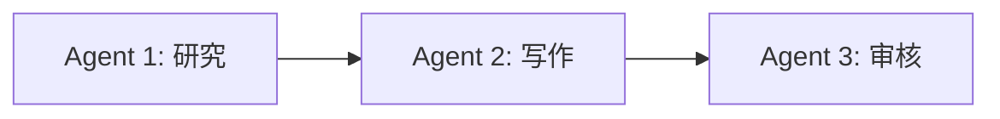
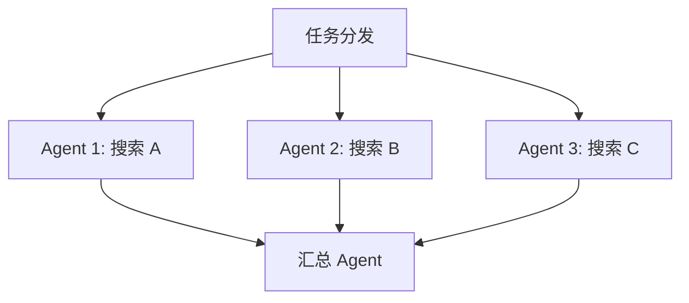
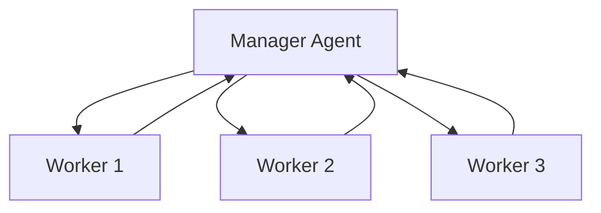
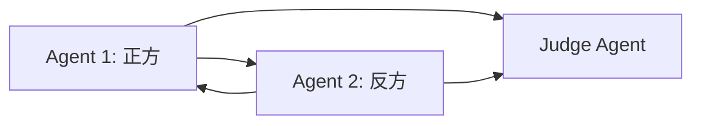

# 第 8 章：Multi-Agent 系统

**学完本章，你将能够：**

- 判断什么时候需要多个 Agent
- 设计 Agent 之间的通信模式
- 用 CrewAI 构建多角色协作系统
- 处理多 Agent 之间的冲突和协调

---

## 8.1 什么时候需要多个 Agent

一个 Agent 能做的事情已经很多了。那为什么还要多个 Agent？

### 单 Agent 的局限

| 问题 | 表现 |
|---|---|
| 角色冲突 | 让同一个 Agent 既当"开发者"又当"代码审查员"，它很难严格审查自己写的代码 |
| 上下文爆炸 | 一个 Agent 需要处理所有工具和信息，System Prompt 越来越长 |
| 缺乏制衡 | 没有其他 Agent 来质疑和纠正，错误容易被放大 |

### Multi-Agent 的适用场景

```python
# 场景：写一篇技术博客
# 单 Agent：一个人又要搜索、又要写作、又要校对
# 多 Agent：分工合作

# Agent 1: 研究员 - 负责搜索和整理资料
# Agent 2: 作家   - 负责撰写文章
# Agent 3: 编辑   - 负责审核和修改
```

> **判断标准**：如果任务可以自然地分解为**不同角色**的工作，或者需要**制衡和审核**，就应该考虑 Multi-Agent。

---

## 8.2 通信模式

多 Agent 之间如何传递信息？主要有四种模式：

### 模式 1：串行（流水线）



每个 Agent 完成后把结果传给下一个。最简单，但一个环节卡住就全部停了。

### 模式 2：并行（扇出-汇聚）



多个 Agent 同时处理不同子任务，最后汇总。适合可独立拆分的任务。

### 模式 3：层级（管理者-执行者）



一个 Manager Agent 负责任务分配和结果汇总，Worker Agents 负责执行。

### 模式 4：辩论（对抗式）



两个 Agent 从不同角度分析问题，最后由裁判 Agent 综合判断。适合需要多角度分析的决策。

---

## 8.3 CrewAI 实战

CrewAI 是一个专注于多 Agent 协作的框架，它用"角色"（Role）来定义每个 Agent。

> 完整代码见 [`code/08-multi-agent/crewai_example.py`](./code/08-multi-agent/crewai_example.py)。

### "产品经理→开发→测试"系统

```python
from crewai import Agent, Task, Crew

# 定义角色
product_manager = Agent(
    role="产品经理",
    goal="分析用户需求，写出清晰的产品需求文档",
    backstory="你是一位有 10 年经验的产品经理，擅长将模糊的需求转化为具体的功能规格。",
    llm="gpt-4o",
)

developer = Agent(
    role="高级开发者",
    goal="根据需求文档写出高质量的代码",
    backstory="你是一位全栈开发者，精通 Python，擅长写清晰、可维护的代码。",
    llm="gpt-4o",
)

qa_engineer = Agent(
    role="测试工程师",
    goal="审查代码质量，发现 bug 和潜在问题",
    backstory="你是一位严格的质量保障工程师，对代码质量和安全性有很高要求。",
    llm="gpt-4o",
)

# 定义任务
task_prd = Task(
    description="为一个'待办事项 Web 应用'写产品需求文档",
    expected_output="包含功能列表、用户故事、验收标准的需求文档",
    agent=product_manager,
)

task_code = Task(
    description="根据需求文档实现核心功能的 Python 代码",
    expected_output="完整的、可运行的 Python 代码",
    agent=developer,
)

task_review = Task(
    description="审查代码质量，检查 bug、安全问题和代码风格",
    expected_output="代码审查报告，包含发现的问题和改进建议",
    agent=qa_engineer,
)

# 组建团队
crew = Crew(
    agents=[product_manager, developer, qa_engineer],
    tasks=[task_prd, task_code, task_review],
    verbose=True,
)

# 启动协作
result = crew.kickoff()
print(result)
```

> **CrewAI 的核心概念**：
> - **Agent**：定义角色（Role）、目标（Goal）、背景（Backstory）
> - **Task**：定义具体任务，指定由哪个 Agent 执行
> - **Crew**：把 Agent 和 Task 组织在一起，自动协调执行

---

## 8.4 冲突解决

多 Agent 系统中，冲突不可避免。常见冲突和解决策略：

| 冲突类型 | 示例 | 解决策略 |
|---|---|---|
| 意见不一致 | 写作 Agent 写了一段，审核 Agent 认为不好 | 设定最大轮次，超过后由 Manager 裁决 |
| 资源竞争 | 两个 Agent 同时要写同一个文件 | 用锁机制或队列排队 |
| 信息不同步 | Agent A 的输出需要 Agent B 的输入 | 明确数据流向，用共享 State |
| 死循环 | A 让 B 改，B 改完 A 又不满意 | 设定最大迭代次数 |

> 完整代码见 [`code/08-multi-agent/debate_agents.py`](./code/08-multi-agent/debate_agents.py)，其中实现了辩论式 Multi-Agent 系统。

```python
def debate(topic: str, max_rounds: int = 3):
    """辩论式 Multi-Agent"""
    pro_arguments = []
    con_arguments = []

    for round_num in range(max_rounds):
        # 正方
        pro = argue(topic, "正方", con_arguments[-1] if con_arguments else "")
        pro_arguments.append(pro)

        # 反方
        con = argue(topic, "反方", pro_arguments[-1])
        con_arguments.append(con)

    # 裁判
    verdict = judge(topic, pro_arguments, con_arguments)
    return verdict
```

---

## 动手练习

### 练习 1（基础）：串行协作

> 实现两个 Agent 的串行协作：
> Agent 1（研究员）搜索某个话题的资料
> Agent 2（作家）根据资料写一段 200 字的文章

### 练习 2（进阶）：三角色协作系统

> 实现"产品经理→开发者→测试者"三角色系统：
> 1. 产品经理分析需求
> 2. 开发者写代码
> 3. 测试者审查代码
>
> 如果测试不通过，代码返回给开发者修改（最多 3 轮）。

### 练习 3（挑战）：辩论式决策

> 实现一个辩论系统，两个 Agent 分别从正反两面分析"是否应该学习 AI Agent"。
> 最后由裁判 Agent 综合双方观点给出结论。

---

## 常见踩坑 FAQ

### Q: CrewAI 安装报错

`pip install crewai` 需要 Python 3.10+。如果报版本冲突，在新虚拟环境中安装。

### Q: 多 Agent 之间信息丢失

每个 Agent 是独立的 LLM 调用，不会自动共享上下文。需要通过 Task 的 `context` 参数显式传递前序 Agent 的输出。

### Q: 多 Agent 调用成本高

每个 Agent 都会调用 LLM，成本是单 Agent 的 N 倍。优化方法：
1. 对非核心 Agent 用更便宜的模型（如 GPT-4o-mini）
2. 减少不必要的轮次
3. 缓存中间结果

---

下一章：[生产级 Agent 的关键问题](./09-production.md)。
