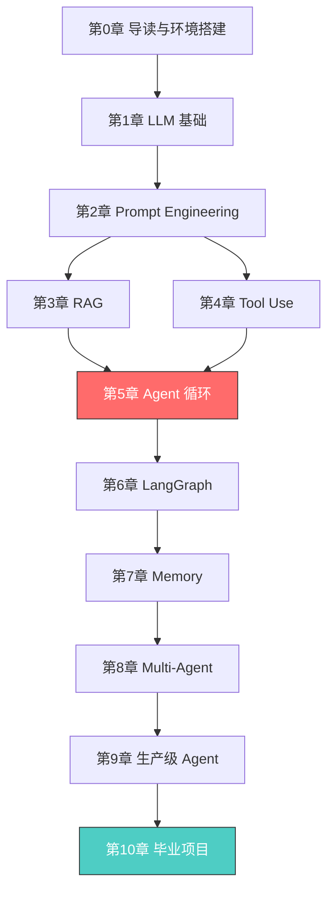

# AI Agent 从零到精通

> 从「调用 API」到「构建能自主思考和行动的 AI 系统」—— 这是一份面向纯新手的完整指南。

## 这个教程能让你做什么？

学完这个教程，你将能够：

- 理解 LLM 的工作原理，知道它能做什么、不能做什么
- 用 Prompt Engineering 让大模型高质量完成各类任务
- 搭建 RAG 系统，让 LLM 基于你的私有数据回答问题
- 让 LLM 调用外部工具（搜索、计算、API），从"会说话"升级到"能做事"
- **手写一个完整的 AI Agent**，理解 ReAct 循环的本质
- 使用 LangGraph 构建带分支和循环的复杂 Agent 工作流
- 设计记忆系统，让 Agent 拥有短期、长期和工作记忆
- 构建多 Agent 协作系统
- 掌握生产级 Agent 的评估、安全、成本控制和可观测性
- 独立完成一个完整的 Agent 项目，作为简历核心亮点

## 学习路线图



**第 5 章（Agent 循环）是全教程的核心**，建议反复阅读和练习。第 10 章（毕业项目）是最终成果，完成它意味着你已经具备独立开发 Agent 的能力。

### 各章预计学习时间

| 章节 | 内容 | 预计时间 |
|---|---|---|
| 第 0 章 | 导读与环境搭建 | 1 小时 |
| 第 1 章 | LLM 基础 | 3 小时 |
| 第 2 章 | Prompt Engineering | 3 小时 |
| 第 3 章 | RAG | 4 小时 |
| 第 4 章 | Tool Use | 3 小时 |
| 第 5 章 | Agent 循环 | 5 小时 |
| 第 6 章 | LangGraph | 4 小时 |
| 第 7 章 | Memory | 3 小时 |
| 第 8 章 | Multi-Agent | 4 小时 |
| 第 9 章 | 生产级 Agent | 4 小时 |
| 第 10 章 | 毕业项目 | 10+ 小时 |
| **合计** | | **约 44 小时** |

建议节奏：每周完成 1-2 章，大约 4-6 周学完整个教程。

## 前置要求

### 你需要知道的

- **Python 基础**：会写函数、用列表和字典、理解类和对象。如果会写 `for` 循环和读 API 文档，就够了。
- **深度学习入门**：知道什么是神经网络、训练和推理的区别。不需要会推导公式。

### 你需要准备的

1. **Python 3.10+**：推荐用 [Miniconda](https://docs.conda.io/en/latest/miniconda.html) 管理
2. **OpenAI API Key**：教程主要使用 OpenAI API。[点此申请](https://platform.openai.com/api-keys)
   - 备选：Anthropic API Key（[申请地址](https://console.anthropic.com/)），教程代码也支持 Claude 模型
3. **8GB+ 内存**：本地 Embedding 模型（第 3 章 RAG）需要一定内存

> **预算提示**：整个教程跑完大约花费 $5-10 的 API 费用。建议先在 OpenAI 后台设置用量上限（比如 $10），避免意外超支。

## 环境搭建

### 第 1 步：创建 Python 虚拟环境

```bash
# 创建项目目录（如果还没有的话）
mkdir agent-tutorial && cd agent-tutorial

# 创建虚拟环境
python -m venv .venv

# 激活虚拟环境
# macOS / Linux
source .venv/bin/activate
# Windows
# .venv\Scripts\activate
```

### 第 2 步：安装依赖

```bash
pip install -r requirements.txt
```

> 你可以按章节逐步安装。第 1-2 章只需要 `openai` 和 `tiktoken`，不需要一次性装完所有依赖。

### 第 3 步：配置 API Key

```bash
cp .env.example .env
```

然后用编辑器打开 `.env`，把你的 API Key 填进去：

```
OPENAI_API_KEY=sk-xxxxxxxxxxxxxxxxxxxxxxxx
```

> **安全提醒**：永远不要把 `.env` 文件提交到 Git。教程的 `.gitignore` 已经排除了它。

### 第 4 步：验证环境

创建一个 `test_env.py` 文件：

```python
import os
from dotenv import load_dotenv

load_dotenv()

api_key = os.getenv("OPENAI_API_KEY")
if api_key and api_key.startswith("sk-"):
    print("OpenAI API Key: OK")
else:
    print("WARNING: OpenAI API Key not found or invalid")

try:
    import tiktoken
    enc = tiktoken.encoding_for_model("gpt-4o")
    print(f"tiktoken: OK (vocab size {enc.n_vocab})")
except ImportError:
    print("WARNING: tiktoken not installed")
```

运行它：

```bash
python test_env.py
```

如果看到 `OK`，你已经准备好了。

## 代码文件说明

| 目录 | 用途 |
|---|---|
| `code/` | 每章的完整可运行代码示例 |
| `exercises/` | 练习模板（留空让你填写） |
| `solutions/` | 练习答案（先自己尝试，再看答案） |
| `assets/` | 图片和架构图 |

## 如何使用这个教程

1. **先通读**：快速浏览一遍章节，了解整体结构
2. **动手跑代码**：把每个代码示例都跑一遍，修改参数观察变化
3. **做练习**：每章末尾有 3 个练习，从基础到挑战，先自己写再看答案
4. **遇到问题**：看每章末尾的「常见踩坑 FAQ」，90% 的问题都能找到答案

> **学习建议**：不要只看不写。Agent 开发是一门实践性极强的技能，光看代码你觉得自己会了，但只有自己从零写一遍，才能真正理解每个设计决策的原因。

## 章节目录

1. [LLM 是什么，怎么工作的](./01-llm-basics.md)
2. [Prompt Engineering](./02-prompt-engineering.md)
3. [RAG — 让 LLM 拥有外部知识](./03-rag.md)
4. [Tool Use — 让 LLM 调用外部工具](./04-tool-use.md)
5. [Agent 循环 — 思考-行动-观察](./05-agent-loop.md) ⭐ **核心章节**
6. [LangGraph 框架实战](./06-langgraph.md)
7. [Memory — 让 Agent 拥有记忆](./07-memory.md)
8. [Multi-Agent 系统](./08-multi-agent.md)
9. [生产级 Agent 的关键问题](./09-production.md)
10. [毕业项目](./10-capstone.md) 🎓 **最终成果**
