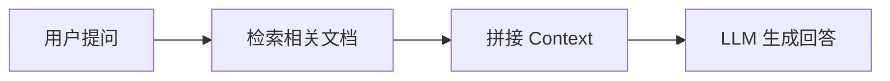

# Agent Tutorial 项目计划

## 一、定位与目标读者

- **定位**：面向纯新手的 AI Agent 从零到精通教程
- **目标读者**：有一点 Python 基础和深度学习入门知识，但没有 Agent 项目经验的学生
- **最终目标**：学完后能独立构建生产级 Agent 系统，达到大厂实习水平

---

## 二、技术选型

### 内容格式：Markdown + 独立代码文件

教程以 Markdown 文件为主体，代码以独立 `.py` 文件存放。Markdown 文件中用 fenced code block 内嵌关键代码片段用于讲解，完整可运行代码指向独立 `.py` 文件。

**为什么不用 Jupyter Notebook 承载整个教程**：

| 问题 | 具体表现 |
|---|---|
| 长文阅读体验差 | 不支持目录导航、章节跳转 |
| Git 协作困难 | 底层是 JSON，diff 极其难读 |
| 执行状态脆弱 | 必须按顺序执行，重启内核状态就乱 |
| 不利于传播 | 不能部署为网站，手机几乎没法看 |

### 兼容性要求（适配 Astro 个人网站）

教程内容最终会合并到 Astro 站点（`AndingDrLin.github.io`），该站点使用：
- **MDX 渲染**：Astro Content Collections
- **代码高亮**：Shiki（github-light / github-dark 双主题）
- **数学公式**：remark-math + rehype-katex

因此所有 Markdown 文件必须遵守以下规范：

| 规范 | 说明 |
|---|---|
| **Frontmatter** | 每个 `.md` 文件顶部必须有 YAML frontmatter（字段见下方模板） |
| **代码块** | 使用 triple backtick 并标注语言（`python`、`bash`、`json`、`text`） |
| **数学公式** | 行内公式用 `$...$`，块级公式用 `$$...$$`，标准 LaTeX 语法 |
| **图片引用** | 使用相对路径 `./assets/xxx.png`，迁移时替换为站点资源路径 |
| **内部链接** | 使用相对路径 `[链接](./02-prompt-engineering.md)`，迁移时替换为站点路由 |

**Frontmatter 模板**（与 Astro `notes` collection schema 对齐）：

```yaml
---
title: "章节标题"
description: "一句话描述本章内容"
date: 2026-06-13
tags: [agent, LLM, tutorial]
category: "Tutorials"
docGroup: "agent-tutorial"
order: 1
draft: false
---
```

字段说明：
- `category` 使用站点已有的 `"Tutorials"` 或 `"Agents"` 分类
- `docGroup` 统一为 `"agent-tutorial"`，迁移时在 `consts.ts` 的 `NOTE_COURSES` 中注册
- `order` 控制章节排序（1-10），README 用 `-1`

---

## 三、项目目录结构

```
Agent Tutorial/
├── plan.md                         # 本文件（项目计划）
├── README.md                       # 教程总导读（学习路线图、前置要求、环境配置）
├── requirements.txt                # 全局 Python 依赖
├── .env.example                    # API Key 配置示例
│
├── 00-introduction.md              # 导读：学习路线图 + 前置要求 + 环境搭建
│
├── 01-llm-basics.md                # 第 1 章：LLM 是什么，怎么工作的
├── 02-prompt-engineering.md        # 第 2 章：Prompt Engineering
├── 03-rag.md                       # 第 3 章：RAG
├── 04-tool-use.md                  # 第 4 章：Tool Use
├── 05-agent-loop.md                # 第 5 章：Agent 循环（全教程最关键）
├── 06-langgraph.md                 # 第 6 章：LangGraph 框架实战
├── 07-memory.md                    # 第 7 章：Memory 记忆系统
├── 08-multi-agent.md               # 第 8 章：Multi-Agent 系统
├── 09-production.md                # 第 9 章：生产级 Agent
├── 10-capstone.md                  # 第 10 章：毕业项目
│
├── code/                           # 可独立运行的代码文件
│   ├── 01-llm-basics/
│   │   ├── hello_llm.py
│   │   ├── attention_viz.py
│   │   ├── tokenization_demo.py
│   │   └── temperature_experiment.py
│   ├── 02-prompt-engineering/
│   │   ├── prompt_strategies.py
│   │   ├── cot_reasoning.py
│   │   └── text_classifier.py
│   ├── 03-rag/
│   │   ├── pdf_qa.py
│   │   ├── chunking_experiment.py
│   │   └── hybrid_search.py
│   ├── 04-tool-use/
│   │   ├── basic_function_calling.py
│   │   ├── multi_tool_agent.py
│   │   └── error_handling.py
│   ├── 05-agent-loop/
│   │   ├── react_from_scratch.py       # 核心：手写 ReAct Agent
│   │   └── plan_and_execute.py
│   ├── 06-langgraph/
│   │   ├── basic_agent.py
│   │   ├── complex_workflow.py
│   │   └── human_in_loop.py
│   ├── 07-memory/
│   │   ├── conversation_summary.py
│   │   ├── vector_memory.py
│   │   └── full_memory_system.py
│   ├── 08-multi-agent/
│   │   ├── crewai_example.py
│   │   └── debate_agents.py
│   ├── 09-production/
│   │   ├── eval_pipeline.py
│   │   ├── prompt_injection_demo.py
│   │   └── cost_monitoring.py
│   └── 10-capstone/
│       ├── research_assistant/     # 选题 A：研究助手
│       ├── code_qa/                # 选题 B：代码仓库问答
│       └── knowledge_base/         # 选题 C：个人知识库
│
├── exercises/                      # 练习模板（留空让学生填写）
│   ├── ex-01-api-basics.py
│   ├── ex-02-prompt-classifier.py
│   ├── ex-03-mini-rag.py
│   ├── ex-04-tool-calling.py
│   ├── ex-05-react-agent.py        # 核心练习：手写 Agent
│   ├── ex-06-langgraph-workflow.py
│   ├── ex-07-memory-system.py
│   ├── ex-08-multi-agent.py
│   └── ex-09-eval-and-security.py
│
├── solutions/                      # 练习答案
│   ├── sol-01-api-basics.py
│   ├── sol-02-prompt-classifier.py
│   ├── sol-03-mini-rag.py
│   ├── sol-04-tool-calling.py
│   ├── sol-05-react-agent.py
│   ├── sol-06-langgraph-workflow.py
│   ├── sol-07-memory-system.py
│   ├── sol-08-multi-agent.py
│   └── sol-09-eval-and-security.py
│
└── assets/                         # 图片、架构图
    ├── images/
    └── diagrams/
```

### 迁移到 Astro 站点的方式

将 Markdown 文件放入 `src/content/notes/agent-tutorial/`，文件名和 frontmatter 无需修改，只需：

1. 在 `src/consts.ts` 的 `NOTE_COURSES` 中添加：
   ```typescript
   'agent-tutorial': {
     slug: 'agent-tutorial',
     title: 'AI Agent 从零到精通',
     description: '面向纯新手的 Agent 开发教程，从 LLM 基础到生产级 Multi-Agent 系统。'
   }
   ```
2. 将 `assets/` 中的图片复制到站点的资源目录
3. 将 `code/`、`exercises/`、`solutions/` 放到一个独立 GitHub 仓库，在教程中链接引用
4. 调整内部链接路径（`./02-prompt-engineering.md` → `/notes/agent-tutorial/02-prompt-engineering/`）

---

## 四、每章写作规范

### "三明治"结构

```
┌──────────────────────────────────────┐
│  场景引入（为什么要学这个）            │  ← 300 字，用真实场景勾起兴趣
├──────────────────────────────────────┤
│  最小可运行代码                        │  ← 先看效果，建立直觉
├──────────────────────────────────────┤
│  核心理论（图文并茂）                  │  ← 控制在 2000 字以内
├──────────────────────────────────────┤
│  代码详解 + 扩展                      │  ← 逐行讲解，加入更多功能
├──────────────────────────────────────┤
│  动手练习（3 个递进式题目）            │  ← 基础 / 进阶 / 挑战
├──────────────────────────────────────┤
│  常见踩坑 FAQ（3-5 个）               │  ← 真实问题，简短回答
└──────────────────────────────────────┘
```

### 写作原则

1. **"先跑通，再理解"**：每个概念先给一个 10 行以内能跑通的代码，让读者看到效果，再讲原理
2. **"不要假设读者知道任何事"**：第一次出现的概念都要有比喻或类比
3. **"每章开头说清楚学完能做什么"**：让读者有明确预期
4. **"代码可独立运行"**：每个 `.py` 文件独立可执行，不依赖其他文件的执行顺序
5. **"练习有提示不给答案"**：答案放在 `solutions/` 目录

### 格式规范

**代码块**：所有代码必须标注语言，方便 Shiki 高亮

````markdown
```python
from openai import OpenAI
client = OpenAI()
response = client.chat.completions.create(
    model="gpt-4o",
    messages=[{"role": "user", "content": "你好"}]
)
print(response.choices[0].message.content)
```
````

**数学公式**：

```markdown
Self-Attention 的核心计算：

$$
\text{Attention}(Q, K, V) = \text{softmax}\left(\frac{QK^T}{\sqrt{d_k}}\right)V
$$

其中 $d_k$ 是 Key 向量的维度，$\sqrt{d_k}$ 用于缩放防止梯度消失。
```

**图表**：使用 ASCII 图或 Mermaid 语法（Astro 可通过插件支持）

```markdown

```

**提示框**：使用 blockquote 风格（Astro 站点可通过 CSS 样式化）

```markdown
> **关键理解**：LLM 生成的是"调用意图"（JSON），不是真的执行了函数。
> 真正的执行在你的代码里。这也是为什么 Tool Use 是安全的。

> **踩坑提醒**：如果 LLM 不调用你的工具，90% 的原因是 tool description 写得不够清楚。
```

**练习模板**：每章末尾统一格式

```markdown
## 动手练习

### 练习 1（基础）：标题
> 具体要求描述
> 提示：xxx

### 练习 2（进阶）：标题
> 具体要求描述

### 练习 3（挑战）：标题
> 具体要求描述
```

**完整代码引用**：当代码超过 30 行时，只在 Markdown 中放核心片段，指向独立文件

```markdown
完整代码见 [`code/05-agent-loop/react_from_scratch.py`](./code/05-agent-loop/react_from_scratch.py)。
下面是核心的 Agent 循环部分：

```python
def react_agent(query, tools, llm, max_steps=5):
    """ReAct Agent 核心循环"""
    history = [{"role": "user", "content": query}]
    for step in range(max_steps):
        response = llm.chat(history, tools=tools)
        if response.has_tool_call():
            result = execute_tool(response.tool_call)
            history.append({"role": "tool", "content": result})
        else:
            return response.content
    return "达到最大步数限制"
```
```

---

## 五、10 章内容详细规划

### 第 0 章：导读（`00-introduction.md`）

- 学习路线图（10 章总览 + 预计时间）
- 前置要求（Python 基础、API Key 申请）
- 环境搭建（Python 虚拟环境、依赖安装、`.env` 配置）
- 每章之间的依赖关系图

---

### 第 1 章：LLM 是什么，怎么工作的（`01-llm-basics.md`）

**本章目标**：理解 LLM 的工作原理，能用 API 调用大模型。

| 小节 | 内容 | 动手 |
|---|---|---|
| 1.1 一个直觉：LLM 是"超级自动补全" | 用生活例子解释自回归生成 | 5 行代码调用 API 观察输出 |
| 1.2 Transformer 核心原理 | 图解 Self-Attention，不推公式 | 用 bertviz 可视化 Attention 权重 |
| 1.3 Tokenization | LLM 眼中的文字长什么样 | 用 tiktoken 拆解句子，理解中文更费 token |
| 1.4 参数量、上下文窗口、Temperature | 关键参数的直觉理解 | 改变 temperature 观察输出变化 |
| 练习 | | 搭建最简单的聊天机器人 |

---

### 第 2 章：Prompt Engineering（`02-prompt-engineering.md`）

**本章目标**：用纯 Prompt 实现文本分类、推理等任务，不需要任何 ML 代码。

| 小节 | 内容 | 动手 |
|---|---|---|
| 2.1 为什么 Prompt 设计重要 | 同一问题不同 prompt 天差地别 | 对比实验 |
| 2.2 核心技巧 | 角色设定、Few-shot、输出格式约束 | 对比 5 种 prompt 策略效果 |
| 2.3 高级技巧 | Chain-of-Thought、Self-Consistency | 让模型解数学题，对比有/无 CoT |
| 2.4 System Prompt 设计 | 安全边界、人格一致性 | 设计"永不越界"的客服 Prompt |
| 练习 | | 用纯 Prompt 实现文本分类器 |

---

### 第 3 章：RAG — 让 LLM 拥有外部知识（`03-rag.md`）

**本章目标**：从零搭建一个文档问答系统。

| 小节 | 内容 | 动手 |
|---|---|---|
| 3.1 幻觉问题 | 为什么 LLM 会"胡说八道" | 演示幻觉案例 |
| 3.2 RAG 完整流程 | 文档→切分→Embedding→存储→检索→生成 | 图解全流程 |
| 3.3 动手：PDF 问答助手 | Chroma + OpenAI，50 行代码 | 实现完整 RAG 应用 |
| 3.4 Chunking 策略对比 | 固定大小 vs 语义切分 | 对比实验，看召回率差异 |
| 3.5 混合检索 | 向量 + BM25 | 实现混合检索并对比效果 |
| 练习 | | 给你的简历做一个问答助手 |

---

### 第 4 章：Tool Use — 让 LLM 调用外部工具（`04-tool-use.md`）

**本章目标**：设计工具并让 Agent 自主决定调用什么工具。

| 小节 | 内容 | 动手 |
|---|---|---|
| 4.1 从"会说话"到"能做事" | LLM 是大脑，Tool 是手脚 | 概念图解 |
| 4.2 Function Calling 原理 | LLM 生成 JSON 调用意图 | 让 LLM 调用计算器 API |
| 4.3 Tool Schema 设计 | description 写法决定调用质量 | 设计搜索、天气、数据库工具 |
| 4.4 并行调用 + 错误处理 | 多工具同时调用、失败重试 | 构建带错误恢复的工具链 |
| 练习 | | 构建能联网搜索 + 执行代码的 Agent |

---

### 第 5 章：Agent 循环 — 思考-行动-观察（`05-agent-loop.md`）

**本章目标**：不依赖任何框架手写一个完整 Agent。**全教程最关键的一章。**

| 小节 | 内容 | 动手 |
|---|---|---|
| 5.1 什么是 Agent | 和普通 LLM 调用的本质区别 | 对比图解 |
| 5.2 ReAct 范式 | Thought→Action→Observation 循环 | 图解完整执行过程 |
| 5.3 手写 ReAct Agent | 不用框架，100 行代码 | **从零实现，逐行讲解** |
| 5.4 Plan-and-Execute | 先规划再执行 vs 边想边做 | 实现 Plan-and-Execute 版本 |
| 练习 | | 手写 Agent，支持自定义工具 |

---

### 第 6 章：LangGraph 框架实战（`06-langgraph.md`）

**本章目标**：用 LangGraph 构建带分支和循环的复杂 Agent 工作流。

| 小节 | 内容 | 动手 |
|---|---|---|
| 6.1 为什么需要框架 | 手写 vs 框架的取舍 | 用 LangGraph 重写第 5 章 Agent |
| 6.2 核心概念 | State、Node、Edge、Conditional Edge | 逐个概念演示 |
| 6.3 复杂工作流 | 带分支和循环的 Agent | 带人工审核的文档处理流水线 |
| 6.4 其他框架简介 | CrewAI、AutoGen、MetaGPT | 各写一个最小 Demo |
| 练习 | | "研究→写作→审核"三步工作流 |

---

### 第 7 章：Memory — 让 Agent 拥有记忆（`07-memory.md`）

**本章目标**：给 Agent 设计完整的记忆系统。

| 小节 | 内容 | 动手 |
|---|---|---|
| 7.1 短期记忆 | 对话历史管理与压缩 | 实现对话摘要压缩 |
| 7.2 长期记忆 | 向量数据库持久化存储 | 跨会话记忆实现 |
| 7.3 工作记忆 | Agent 的"草稿纸" | 任务中间状态保存 |
| 练习 | | 给 Agent 添加完整记忆系统 |

---

### 第 8 章：Multi-Agent 系统（`08-multi-agent.md`）

**本章目标**：设计和实现多个 Agent 协作的系统。

| 小节 | 内容 | 动手 |
|---|---|---|
| 8.1 什么时候需要多个 Agent | 单 Agent 的能力边界 | 案例分析 |
| 8.2 通信模式 | 串行、并行、层级、辩论 | 图解四种模式 |
| 8.3 CrewAI 实战 | 多角色协作 | "产品经理→开发→测试"系统 |
| 8.4 冲突解决 | 任务分配与冲突处理策略 | 实现冲突解决机制 |
| 练习 | | 构建三角色协作系统 |

---

### 第 9 章：生产级 Agent 的关键问题（`09-production.md`）

**本章目标**：把 Agent 从"能用"提升到"能上线"。

| 小节 | 内容 | 动手 |
|---|---|---|
| 9.1 评估 | 怎么知道 Agent 做得好不好 | 搭建自动化评估 Pipeline |
| 9.2 安全 | Prompt Injection 攻防 | 实现攻击案例 + 防御方案 |
| 9.3 成本控制 | Token 优化、缓存、模型降级 | 实现 Token 监控 |
| 9.4 可观测性 | 日志、追踪、调试 | 接入 LangSmith 或自建追踪 |
| 练习 | | 给项目加上评估和安全防护 |

---

### 第 10 章：毕业项目（`10-capstone.md`）

**本章目标**：独立完成一个完整 Agent 产品，作为简历核心项目。

| 选题 | 描述 | 核心技术点 |
|---|---|---|
| A 智能研究助手 | 搜索 + 阅读 + 生成研究报告 | RAG + Tool Use + Multi-Step |
| B 代码仓库问答 | 能读懂 GitHub 项目并回答问题 | 代码理解 + RAG + AST |
| C 个人知识库 | 笔记检索 + 问答 + 推荐 | 长期记忆 + 混合检索 + 个性化 |

每个选题包含：需求分析 → 架构设计 → 分步实现 → 效果评估 → 简历包装建议

---

## 六、实施步骤

### Phase 1：搭建骨架
- [ ] 创建完整目录结构
- [ ] 写好 `00-introduction.md`（学习路线图、前置要求、环境搭建）
- [ ] 写好每章占位文件（frontmatter + 本章目标 + 小节标题）
- [ ] 创建 `requirements.txt` 和 `.env.example`

### Phase 2：核心章节优先
- [ ] 第 1 章：LLM 基础（含代码文件）
- [ ] 第 2 章：Prompt Engineering（含代码文件）
- [ ] 第 4 章：Tool Use（第 5 章的前置依赖）
- [ ] 第 5 章：Agent 循环（全教程最关键，含手写 Agent 代码）

### Phase 3：补齐其余章节
- [ ] 第 3 章：RAG
- [ ] 第 6 章：LangGraph
- [ ] 第 7 章：Memory
- [ ] 第 8 章：Multi-Agent
- [ ] 第 9 章：生产级 Agent
- [ ] 第 10 章：毕业项目

### Phase 4：打磨
- [ ] 统一代码风格，确保每个 `.py` 文件可独立运行
- [ ] 补充所有 exercises 和 solutions
- [ ] 添加图片和架构图到 `assets/`
- [ ] 检查所有 LaTeX 公式渲染
- [ ] 检查所有内部链接
- [ ] 验证方式：用任意 Markdown 预览器（如 VS Code）检查渲染效果

---

## 七、依赖与环境

```txt
# requirements.txt（按章节逐步引入）
openai>=1.0
anthropic>=0.20
langchain>=0.2
langchain-openai
langchain-community
langgraph
chromadb
tiktoken
faiss-cpu
sentence-transformers
crewai
bertviz
python-dotenv
```

### 环境要求
- Python 3.10+
- OpenAI API Key（或 Claude API Key）
- 8GB+ 内存（本地 Embedding 模型需要）
