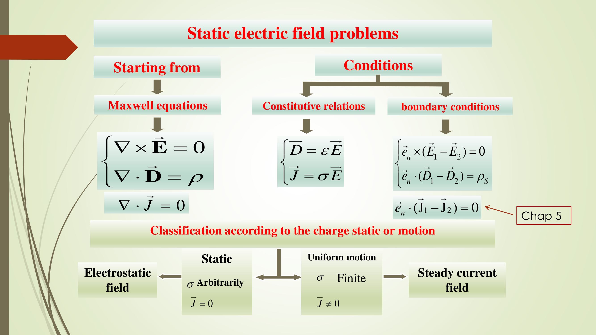
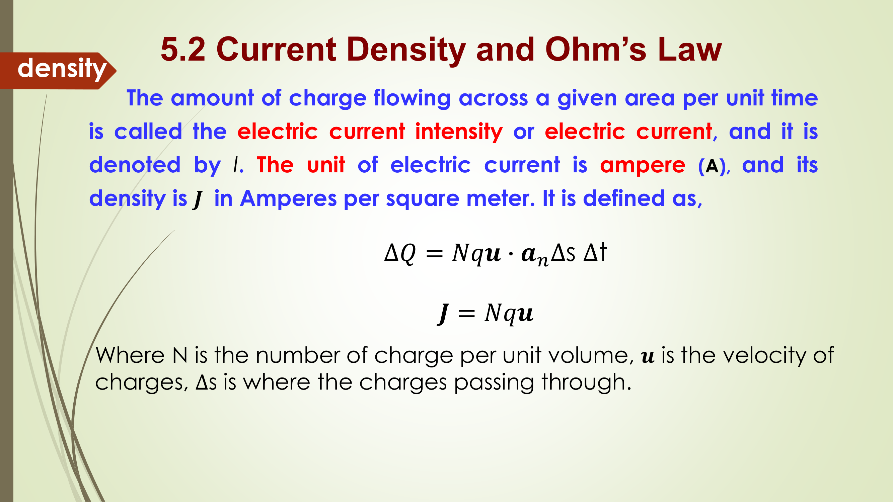
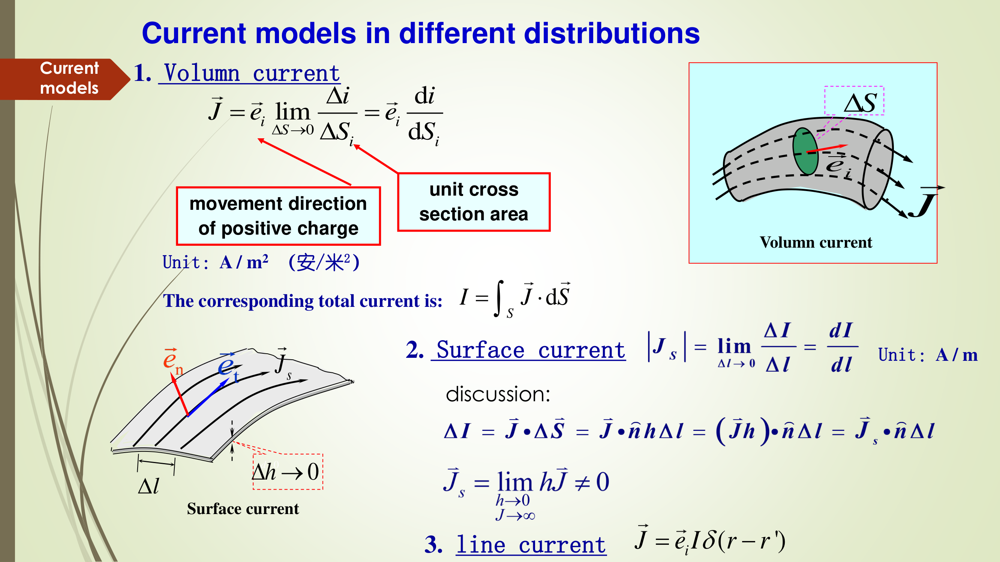
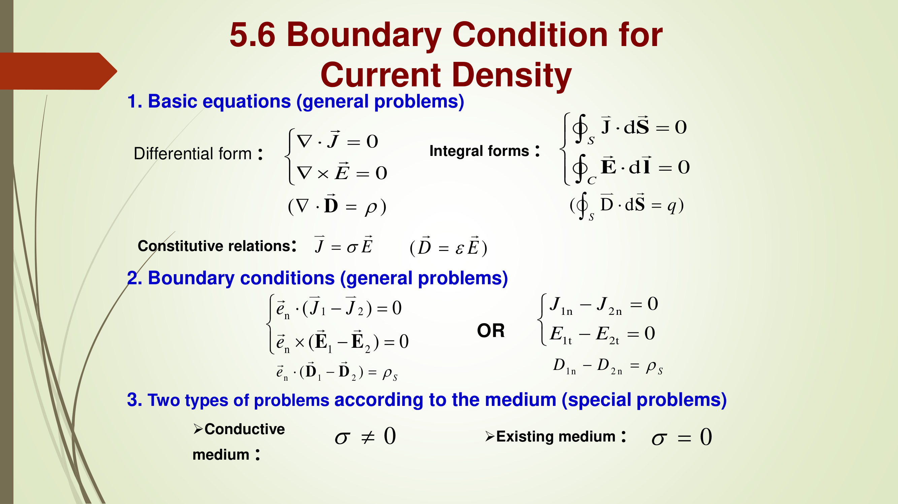
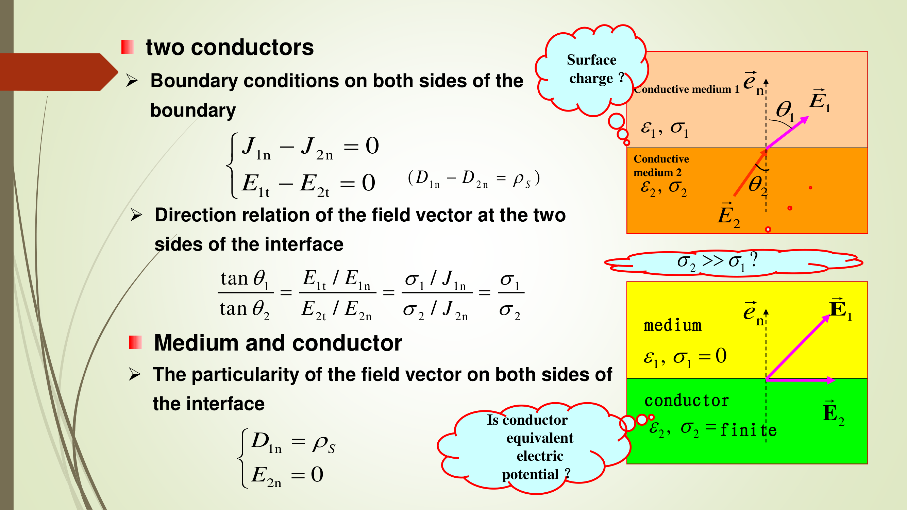
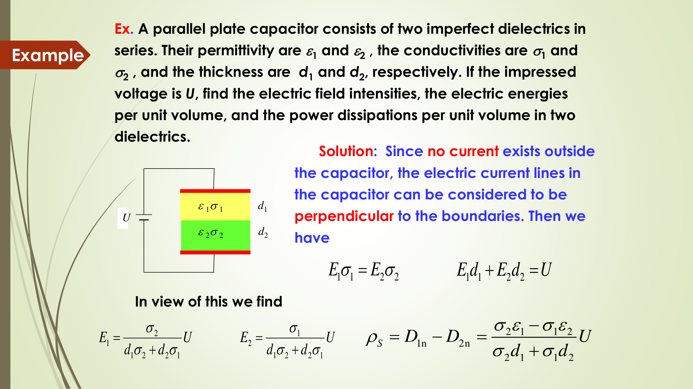
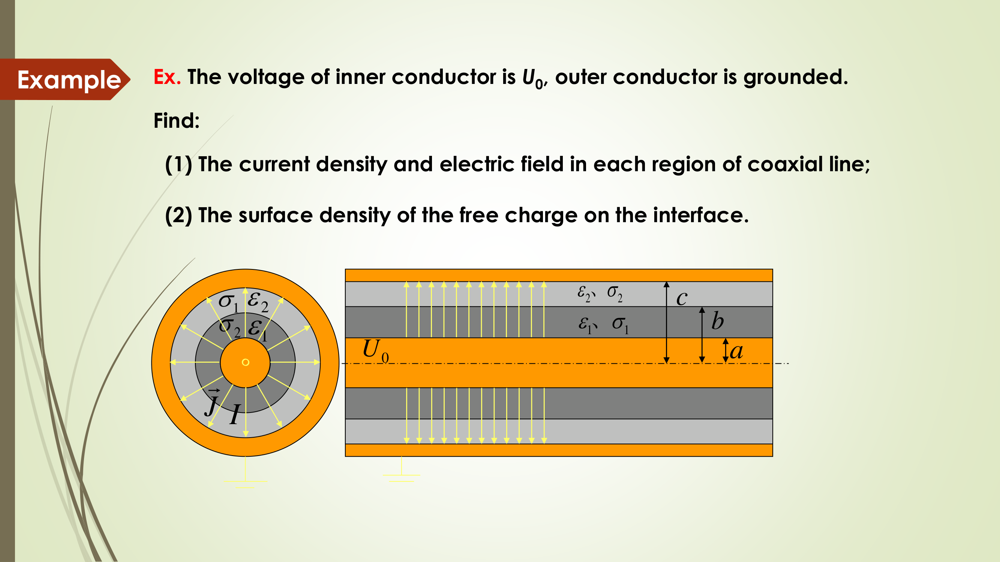

# 第5章：恒定电流

> 自学笔记 | 基于课程 Slides Chapter 5
> Steady Electric Currents

## 本章学习目标

学完本章后，你应该能够：

1. 区分三种电流类型（电解电流、运流电流、传导电流），并理解本章主要研究哪一种。
2. 默写并解释电流密度的定义式 $J = Nq\bm{u}$，以及体电流、面电流、线电流三种分布模型的表达式和单位。
3. 默写欧姆定律的微分形式 $J = \sigma E$，理解电导率 $\sigma$ 的物理含义（介质导电能力），能区分 PEC（$\sigma \to \infty$）和 PED（$\sigma \to 0$）。
4. 能写出电荷守恒的连续性方程 $\nabla \cdot J = -\frac{\partial \rho}{\partial t}$，并推导出恒定电流场的两个基本方程：$\nabla \cdot J = 0$（无散/无源）和 $\nabla \times E = 0$（无旋/保守）。
5. 理解 KCL（$\sum I_j = 0$）和 KVL（$\oint E \cdot dl = 0$）的物理含义及其与基本方程的关系。
6. 会计算恒定电流场中的功率耗散：$p = E \cdot J$（功率密度），$P = I^2 R$（焦耳定律）。
7. 能写出不同导电介质界面上的边界条件：$J_{1n} = J_{2n}$（法向连续），$E_{1t} = E_{2t}$（切向连续），以及电势形式的边界条件。
8. 能用边界条件推导电流线的折射关系 $\frac{\tan\theta_1}{\tan\theta_2} = \frac{\sigma_1}{\sigma_2}$，并理解良导体中电流近似垂直于界面的原因。
9. 掌握计算电阻/电导的三种方法：（1）设电流 $I$，求电压 $U$，得 $G = I/U$；（2）设电压 $U$，求电流 $I$，得 $G = I/U$；（3）静电比拟法 $G/C = \sigma/\varepsilon$。
10. 能独立计算典型结构的电阻（同轴线、扇形导电片、环形导电介质等）。
11. 能对比静电场与恒定电流场的异同，并用静电比拟法将已知电容公式转化为电导公式。

## 1. 先用人话理解本章在讲什么

### 1.1 本章要解决的问题

前两章（第3章：静电场、第4章：静电场问题的解法）讨论的是电荷完全静止时的静电场。本章进入一个新场景：**电荷在导体中做匀速、稳定的定向运动**，形成"恒定电流"。

"恒定"（steady）的意思是：虽然电荷在运动，但空间中每一点的电荷密度不随时间变化，电流的大小和方向也不随时间变化。也就是说——该流走多少电荷，就补进来多少，整体分布维持不变。

本章回答的核心问题是：

| 问题 | 回答工具 |
|---|---|
| 电流怎么定量描述？ | 电流密度 $J$（体/面/线三种模型） |
| 什么推动了电流？ | 电场 $E$，两者通过欧姆定律 $J = \sigma E$ 联系 |
| 电荷守恒怎么体现？ | 连续性方程，恒定条件下退化为 $\nabla \cdot J = 0$（KCL） |
| 恒定电流场中电场有什么性质？ | 仍是保守场 $\nabla \times E = 0$（KVL） |
| 不同导电介质交界面处场量怎么变？ | 边界条件：$J$ 法向连续，$E$ 切向连续 |
| 电流会产生多少热量？ | 焦耳定律 $P = I^2 R$ |
| 怎么算一段导电介质的电阻？ | 三种方法，特别是静电比拟法 |

### 1.2 本章在电磁场课程中的位置

```
第1章：电磁场的基本对象和方程概览
第2章：矢量分析与数学工具
第3章：静电场（电荷静止不动）
第4章：静电场问题的解法（泊松/拉普拉斯方程、镜像法、边值问题）
第5章：恒定电流（电荷匀速运动，但空间分布不随时间变化）  ← 本章
```

从"静止"到"匀速运动"，多了电流和能量耗散，但少了时变项（$\partial/\partial t = 0$），所以数学上仍然可以用第3章的泊松方程/拉普拉斯方程框架来处理。

### 1.3 和前两章的关系

第3章建立了静电场的基本物理图像（库仑定律、高斯定理、电势、导体行为等）。第4章在此基础上提供了求解静电场问题的数学方法（泊松/拉普拉斯方程 $\nabla^2\varphi = -\rho/\varepsilon$ 或 $\nabla^2\varphi = 0$，唯一性定理，镜像法，分离变量法）。

本章的恒定电流场在电源外部区域仍然满足拉普拉斯方程 $\nabla^2\varphi = 0$。这意味着**第4章学到的所有求解方法（镜像法、分离变量法等）在恒定电流场中可以原封不动地复用**——只需将边界条件中的 $\varepsilon$ 替换为 $\sigma$ 即可。

物理上的关键区别：第3章（静电场）中，导体内部电场 $E = 0$，电荷全部分布在表面。本章中，为了维持恒定电流，导体内部必须有电场来推动电荷运动（$E = J/\sigma$），因此导体内部电场一般不为零，导体也不一定是等势体。

### 1.4 5个新手容易踩的坑

1. **坑：以为导体内部电场永远为零。** 静电场中是零，恒定电流场中不是零！因为有电流就需要电场来"推"。
2. **坑：混淆传导电流和运流电流。** 传导电流服从欧姆定律 $J = \sigma E$，运流电流不服从（$J = \rho v$，方向可能和 $E$ 不同）。
3. **坑：忘记 $\nabla \cdot J = 0$ 只在恒定条件下成立。** 一般情况是 $\nabla \cdot J = -\partial\rho/\partial t$，只有恒定条件 $\partial\rho/\partial t = 0$ 时才是零。
4. **坑：电阻公式直接背，不理解推导路径。** 电阻计算的关键是从已知条件出发（设电流或设电压），然后利用 $J \to E \to U$ 或 $U \to E \to J \to I$ 的链条求解。
5. **坑：用静电比拟法时忘记对应关系。** $D \leftrightarrow J$，$\varepsilon \leftrightarrow \sigma$，$C \leftrightarrow G$，$q \leftrightarrow I$。但注意边界条件中 $D$ 和 $J$ 的法向行为不同（$D$ 在无自由面电荷时连续，$J$ 在恒定条件下总是连续）。

## 2. 核心概念

### 2.1 电流强度与电流密度

**一句话理解：** 电流强度 $I$ 告诉你"单位时间流过某个截面的总电荷量"，电流密度 $J$ 进一步告诉你"每单位面积上流过多少电流，以及流向哪个方向"——后者是矢量，信息量更大。

**正式定义：**

设在导体中，单位体积内有 $N$ 个带电粒子，每个带电量 $q$，以平均速度 $\bm{u}$ 运动。在 $\Delta t$ 时间内，穿过面积为 $\Delta s$ 的截面的电荷量为：

$$\Delta Q = N q \bm{u} \cdot \bm{a}_n \Delta s \Delta t$$

则电流密度矢量定义为：

$$\boxed{J = N q \bm{u}}$$

单位：$\text{A/m}^2$（安培每平方米）。

**直观例子：** 想象一条水管，$J$ 的大小好比"单位截面积上每秒流过的水量"，方向就是水流方向。$Nq$ 好比"单位体积内有多少水分子"，$\bm{u}$ 是它们的平均流速。

**容易混淆的点：** 电流 $I$ 是标量（但有正负，代表方向），电流密度 $J$ 是矢量。两者的关系是 $I = \int_S J \cdot dS$——电流是通过某个面的电流密度的通量。

---

### 2.2 三种电流分布模型

**一句话理解：** 就像电荷有体电荷、面电荷、线电荷三种分布，电流也有三种分布——体电流（在三维导体中流动）、面电流（在薄层中流动）、线电流（理想细导线）。

**正式定义：**

（1）**体电流（Volume current）**——在三维导电介质中流动：

$$J = \bm{e}_i \lim_{\Delta S \to 0} \frac{\Delta i}{\Delta S} = \bm{e}_i \frac{di}{dS_i}$$

其中 $\bm{e}_i$ 是正电荷运动方向的单位矢量，$dS_i$ 是垂直于流动方向的截面元。单位：$\text{A/m}^2$。

总电流：$I = \int_S J \cdot dS$

（2）**面电流（Surface current）**——在厚度趋于零的导电层中流动（例如金属表面镀层）：

当导电层厚度 $\Delta h \to 0$ 时，定义面电流密度 $J_s$（单位：$\text{A/m}$，注意和体电流不同！）。

（3）**线电流（Line current）**——理想细导线中的电流：

$$J = \bm{e}_i I \, \delta(r - r')$$

其中 $\delta$ 是狄拉克函数。这表示电流"集中在一条线上"。

**容易混淆的点：** 体电流密度 $J$ 的单位是 $\text{A/m}^2$，面电流密度 $J_s$ 的单位是 $\text{A/m}$，线电流就是 $I$，单位是 $\text{A}$。计算时别搞混单位。

---

### 2.3 欧姆定律（微分形式）

**一句话理解：** 在导体中，某点的电流密度 $J$ 和该点的电场强度 $E$ 成正比，比例系数是电导率 $\sigma$——电场越强，电流越大。

**正式定义：**

$$\boxed{J = \sigma E}$$

**直观例子：** 把导体想象成一根管子里面有黏稠的蜂蜜（电子），电场好比是"倾斜管子"的角度。倾斜越大（电场越强），蜂蜜流得越快（电流越大）。蜂蜜本身的黏度决定了同样的倾斜角能流多快——这就是电导率 $\sigma$ 的作用。黏度低的材料（铜，$\sigma$ 大）容易流，黏度高的材料（橡胶，$\sigma$ 小）几乎流不动。

**容易混淆的点：**
- 这个微分形式 $J = \sigma E$ 适用于线性各向同性介质。积分形式就是大家熟悉的 $U = IR$。
- 运流电流（$J = \rho v$）不服从欧姆定律！因为运流电流中电荷的速度不由电场直接决定（例如真空管中电子由热发射产生）。

---

### 2.4 电导率 $\sigma$ 与 PEC/PED

**一句话理解：** 电导率 $\sigma$ 衡量介质"导电的难易程度"——$\sigma$ 越大，同样电场下产生的电流越大。

**正式定义：**

- **PEC（Perfect Electric Conductor，理想导电体）：** $\sigma \to \infty$。在 PEC 中，不需要电场就能产生电流（零电阻）。在 PEC 中不存在恒定电场，否则会产生无穷大的电流和无穷大的能量。
- **PED（Perfect Electric Dielectric，理想电介质/绝缘体）：** $\sigma \to 0$。完全不导电。自然界不存在真正的 PEC 或 PED。

**常见材料的电导率（单位 S/m）：**

| 材料 | $\sigma$ (S/m) | 材料 | $\sigma$ (S/m) |
|---|---|---|---|
| 银 (Silver) | $6.17 \times 10^7$ | 海水 (Sea water) | $4$ |
| 铜 (Copper) | $5.80 \times 10^7$ | 纯水 (Pure water) | $10^{-3}$ |
| 金 (Gold) | $4.10 \times 10^7$ | 干土 (Dry soil) | $10^{-5}$ |
| 铝 (Aluminum) | $3.54 \times 10^7$ | 变压器油 (Transformer oil) | $10^{-11}$ |
| 黄铜 (Brass) | $1.57 \times 10^7$ | 玻璃 (Glass) | $10^{-12}$ |
| 铁 (Iron) | $10^7$ | 橡胶 (Rubber) | $10^{-15}$ |

**容易混淆的点：** 理想导体（PEC）在恒定电流场中内部 $E = 0$，这和静电场中导体内部 $E = 0$ 看起来一样，但原因是不同的——恒定电流场中 PEC 不需要电场就能导电，而普通导体（有限 $\sigma$）必须有电场才能导电。

---

### 2.5 电动势与基尔霍夫电压定律（KVL）

**一句话理解：** 电动势（EMF）好比"电路中的水泵"——它提供能量维持电流，而基尔霍夫电压定律说"绕闭合回路一圈，电压升降总和为零"。

**补充理解**（本小节内容在原始 slides 中被列为 5.3 节但在 PDF 中未找到独立页面，以下为根据课程知识体系的补充）：

电动势（electromotive force, emf）定义为：在电源内部，非静电力将单位正电荷从负极搬运到正极所做的功。维持恒定电流需要电源持续提供电动势。

恒定电流场中，由积累电荷产生的电场仍然是保守场，因此绕闭合回路的线积分为零：

$$\oint_l E \cdot dl = 0$$

这就是基尔霍夫电压定律（KVL）的场论形式。

在导电介质中，利用 $J = \sigma E$，对于均匀介质（$\sigma$ 为常数），有：

$$\oint_l \frac{J}{\sigma} \cdot dl = 0 \quad \Rightarrow \quad \oint_l J \cdot dl = 0$$

**微分形式：**

$$\boxed{\nabla \times E = 0}$$

对于均匀导电介质：$\nabla \times J = 0$，即恒定电流场在均匀导电介质中是**无旋的**（irrotational）。

> **需要人工确认：** 原始 slides PDF 中 Section 5.3（Electromotive Force and KVL）似乎缺少独立的幻灯片页面。以上内容为依据课程体系的标准补充。请核对课程实际讲授内容。

---

### 2.6 连续性方程与基尔霍夫电流定律（KCL）

**一句话理解：** 电荷不能凭空产生或消失——如果从一个闭合面流出了净电流，那么闭合面内的电荷必然在减少。恒定条件下，流进等于流出，净通量为零。

**正式定义：**

**（1）一般形式——电荷守恒原理：**

考虑体积 $V$，其内净电荷为 $Q = \int_V \rho \, dV$。如果流出闭合面 $S$ 的净电流为 $I$，则内部电荷按同样速率减少：

$$I = -\frac{dQ}{dt} = -\frac{d}{dt} \int_V \rho \, dV$$

同时，流出闭合面的电流等于电流密度矢量的向外通量：

$$I = \oint_S J \cdot dS$$

结合得：

$$\oint_S J \cdot dS = -\frac{\partial}{\partial t} \int_V \rho \, dV$$

利用散度定理（$\oint_S J \cdot dS = \int_V \nabla \cdot J \, dV$），得微分形式：

$$\boxed{\nabla \cdot J = -\frac{\partial \rho}{\partial t}}$$

这是**电流连续性原理**（principle of current continuity）的微分形式。

**（2）恒定电流场的特殊情况：**

恒定电流场中，电荷分布不随时间变化，即 $\frac{\partial \rho}{\partial t} = 0$，因此：

$$\boxed{\oint_S J \cdot dS = 0}$$

或等价于 **KCL**：$\sum_j I_j = 0$

微分形式：

$$\boxed{\nabla \cdot J = 0}$$

**物理意义：** 恒定电流场是**无散的/管量场**（solenoidal）——电流密度线没有起点也没有终点，形成闭合回路。

**直观例子：** 想象一个闭环水管系统——水流必须形成一个完整回路，每个节点的进水量等于出水量（KCL）。如果某处水不断增多（$\partial\rho/\partial t > 0$），那说明有"漏水口"（$\nabla \cdot J < 0$）。

**容易混淆的点：** $\nabla \cdot J = 0$ 和 $\nabla \cdot D = \rho$ 是两套独立的方程！前者描述电流的守恒，后者描述电场的有源性（电通量从正电荷出发、终止于负电荷）。在恒定电流场中，两者同时成立。

---

### 2.7 功率耗散与焦耳定律

**一句话理解：** 电流流经电阻时，电场对电荷做的功转化为热能——这就是为什么电线会发热。

**正式定义：**

电场 $E$ 将电荷 $q$ 移动距离 $\Delta l$ 所做的功为 $\Delta w = q E \cdot \Delta l$，对应的功率为：

$$p = \frac{dP}{dv} = E \cdot J$$

其中 $p$ 是**功率耗散密度**（单位：$\text{W/m}^3$）。

对整个体积 $V$ 积分，得总功率：

$$P = \int_V E \cdot J \, dV \quad (\text{W})$$

这就是**焦耳定律**（Joule's law）的场论形式。

对于恒定截面的导体（$dv = ds \, d\ell$，其中 $d\ell$ 沿 $J$ 方向）：

$$P = \int_L E \, d\ell \int_S J \, ds = VI$$

利用 $V = RI$，得到大家熟悉的：

$$\boxed{P = I^2 R \quad (\text{W})}$$

**容易混淆的点：**
- 功率密度 $p = E \cdot J = \sigma E^2 = J^2/\sigma$——各种形式等价，根据已知量选用。
- 用 $P = I^2 R$ 时注意是有效值还是直流值。恒定电流中用直流值即可。

---

### 2.8 边界条件

**一句话理解：** 电流密度 $J$ 穿过界面时，垂直于界面的分量必须连续（否则电荷会在界面上无限堆积），而电场的切向分量必须连续（来自保守场的性质）。

**正式定义：**

两种导电介质（$\sigma_1 \neq 0$，$\sigma_2 \neq 0$）界面上的边界条件：

（1）**$J$ 的法向分量连续**——由 $\nabla \cdot J = 0$（恒定条件）推出：

$$\boxed{J_{1n} = J_{2n}} \quad \text{或} \quad \bm{e}_n \cdot (J_1 - J_2) = 0$$

（2）**$E$ 的切向分量连续**——由 $\nabla \times E = 0$（保守场）推出：

$$\boxed{E_{1t} = E_{2t}} \quad \text{或} \quad \bm{e}_n \times (E_1 - E_2) = 0$$

（3）在导电介质界面上，两个方程同时成立，因此**同时存在 $D$ 的法向分量差**：

$$D_{1n} - D_{2n} = \rho_S$$

（4）**电势形式的边界条件：**

由 $E = -\nabla \varphi$ 和上述边界条件得：

$$\varphi_1 = \varphi_2$$

$$\sigma_1 \frac{\partial \varphi_1}{\partial n} = \sigma_2 \frac{\partial \varphi_2}{\partial n}$$

即在导电介质界面上，**电势连续**，且**电流密度的法向分量连续转化为电势的法向导数关系**。

---

### 2.9 电流线的折射

**一句话理解：** 电流从一种导电介质进入另一种导电介质时，方向会发生偏折——就像光从空气进入水中会折射一样。

**正式定义：**

$$\boxed{\frac{\tan\theta_1}{\tan\theta_2} = \frac{\sigma_1}{\sigma_2}}$$

**直观理解：** $\theta_1$ 和 $\theta_2$ 分别是介质 1 和介质 2 中电流密度 $J$（或电场 $E$）与界面法线的夹角。

- 如果 $\sigma_2 \gg \sigma_1$（介质 2 是良导体，介质 1 是不良导体），则 $\tan\theta_2 \ll \tan\theta_1$，即 $\theta_2 \to 0$。**电流进入良导体后几乎垂直于界面**。
- 实际上良导体中的场几乎垂直于界面——这和静电场中导体表面电场垂直于表面的结论一致。

---

### 2.10 介质-导体界面上的特殊情况

**正式定义：**

（1）**两种导电介质（$\sigma_1 \neq 0, \sigma_2 \neq 0$）：** 使用 2.8 和 2.9 中的一般边界条件。

（2）**介质（$\sigma_1 = 0$）与导体（$\sigma_2 \neq 0$）的界面：**

在介质一侧 $\sigma_1 = 0$，没有传导电流，$J_{1n} = 0$。由 $J_{1n} = J_{2n}$ 得 $J_{2n} = 0$——即导体中电流的法向分量为零，电流只能在导体表面切向流动。同时 $D_{1n} = \rho_S$（介质一侧存在法向电通量，对应面电荷）。导体一侧 $E_{2n} = 0$。

**问题：此时导体是否还是等势体？** 
- 如果导体是理想导体（$\sigma \to \infty$）：是等势体。
- 如果导体是有限电导率：一般不是等势体，因为内部有电场 $E = J/\sigma$。

---

## 3. 核心公式与推导

### 3.1 电流密度的定义推导

**这个公式在干什么：** 从"有多少电荷以多快速度穿过截面"这个基本图景推导出电流密度的表达式。

**推导：**

考虑导体中电荷以平均速度 $\bm{u}$ 运动。设单位体积内有 $N$ 个载流子，每个带电量 $q$。

在 $\Delta t$ 时间内，以速度 $\bm{u}$ 运动的电荷移动的距离为 $\bm{u} \Delta t$。这些电荷中，只有位于以截面 $\Delta s$ 为底、高为 $|\bm{u}|\Delta t$ 的斜柱体内的电荷能穿过截面。

该斜柱体的体积 = 底面积 × 高度在截面法向上的投影 = $\Delta s \cdot |\bm{u}|\Delta t \cdot \cos\alpha$，其中 $\alpha$ 是 $\bm{u}$ 与截面法向 $\bm{a}_n$ 的夹角。

用矢量点积表示为：体积 = $(\bm{u} \cdot \bm{a}_n) \Delta s \Delta t$

柱体内的总电荷量：
$$\Delta Q = Nq \times \text{体积} = Nq (\bm{u} \cdot \bm{a}_n) \Delta s \Delta t$$

电流密度矢量定义为：
$$J = Nq \bm{u}$$

验证：$J \cdot \bm{a}_n \Delta s \Delta t = Nq \bm{u} \cdot \bm{a}_n \Delta s \Delta t = \Delta Q$，单位时间内通过单位面积的电荷量。

**常见错误：** 忘记 $\bm{u} \cdot \bm{a}_n$ 中的点积——只有速度在截面法向上的分量才会让电荷"穿过"截面。平行于截面的运动不贡献电流。

---

### 3.2 连续性方程的推导

**这个公式在干什么：** 从"电荷守恒"这个基本原理出发，用散度定理将积分形式转化为微分形式。

**推导：**

**Step 1：** 写出电荷守恒的积分表述。

流出闭合面 $S$ 的净电流 = 体积 $V$ 内电荷减少的速率：

$$\oint_S J \cdot dS = -\frac{\partial}{\partial t} \int_V \rho \, dV$$

**Step 2：** 应用散度定理，将面积分转化为体积分：

$$\oint_S J \cdot dS = \int_V \nabla \cdot J \, dV$$

**Step 3：** 代入：

$$\int_V \nabla \cdot J \, dV = -\int_V \frac{\partial \rho}{\partial t} \, dV$$

**Step 4：** 由于这对任意体积 $V$ 都成立，被积函数必须相等：

$$\nabla \cdot J = -\frac{\partial \rho}{\partial t}$$

**推导过程中的关键：**
- 负号的来源：流出电流为正，导致内部电荷减少（负变化率）。
- 散度定理是连接积分形式和微分形式的桥梁。

**常见错误：** 有人写成 $\nabla \cdot J = \partial\rho/\partial t$（缺负号）或写成 $\nabla \cdot J = \rho$（和 $D$ 的高斯定理搞混）。

---

### 3.3 恒定电流场基本方程的推导

**这个公式在干什么：** 从一般连续性方程出发，施加"恒定"条件（时间导数为零），得到恒定电流场的两组基本方程。

**推导：**

由连续性方程 $\nabla \cdot J = -\frac{\partial \rho}{\partial t}$，在恒定条件下 $\frac{\partial \rho}{\partial t} = 0$，立即得：

$$\boxed{\nabla \cdot J = 0}$$

积分形式：$\boxed{\oint_S J \cdot dS = 0}$，等价于 $\boxed{\sum_j I_j = 0}$（KCL）

另一方面，恒定电流场中积累电荷（sustained charges）产生的电场仍然是保守场（电荷分布不随时间变化，因此电场也是静态的）：

$$\boxed{\nabla \times E = 0}$$

积分形式：$\boxed{\oint_l E \cdot dl = 0}$（KVL）

**在均匀导电介质中**（$\sigma$ 为常数），由 $J = \sigma E$ 和 $\nabla \times E = 0$：

$$\nabla \times J = \nabla \times (\sigma E) = \sigma (\nabla \times E) = 0$$

即 $\boxed{\nabla \times J = 0}$——恒定电流场在均匀介质中既是无散又是无旋的。

---

### 3.4 边界条件的推导

**这个公式在干什么：** 从恒定电流场的基本方程出发，利用高斯定理和斯托克斯定理，导出界面上的边界条件。

**推导 J 的法向边界条件：**

在界面上取一个扁圆柱形高斯面（上下底面平行于界面，侧面高度趋于零）。对 $\oint_S J \cdot dS = 0$ 应用此高斯面：

$$J_{1n} \Delta S - J_{2n} \Delta S = 0$$

（侧面贡献为零因为高度趋于零；注意法向的正负号）

得：$\boxed{J_{1n} = J_{2n}}$

**推导 E 的切向边界条件：**

在界面上取一个窄矩形回路（两长边在界面两侧且平行于界面，两短边高度趋于零）。对 $\oint_l E \cdot dl = 0$ 应用此回路：

$$E_{1t} \Delta l - E_{2t} \Delta l = 0$$

（短边贡献为零因为高度趋于零）

得：$\boxed{E_{1t} = E_{2t}}$

**推导折射关系：**

由 $J_{1n} = J_{2n}$ 和 $E_{1t} = E_{2t}$，以及 $J = \sigma E$：

$$\tan\theta_1 = \frac{E_{1t}}{E_{1n}} = \frac{E_{1t}}{J_{1n}/\sigma_1} = \frac{\sigma_1 E_{1t}}{J_{1n}}$$

$$\tan\theta_2 = \frac{E_{2t}}{E_{2n}} = \frac{E_{2t}}{J_{2n}/\sigma_2} = \frac{\sigma_2 E_{2t}}{J_{2n}}$$

两式相除，利用 $E_{1t} = E_{2t}$ 和 $J_{1n} = J_{2n}$，得：

$$\frac{\tan\theta_1}{\tan\theta_2} = \frac{\sigma_1}{\sigma_2}$$

---

### 3.5 静电比拟法的推导

**这个公式在干什么：** 比较无源区域（$\rho = 0$）中静电场和恒定电流场（电源外部）的方程，发现完全对应，从而可以用已知的电容公式直接"翻译"为电导公式。

**对比表（无源区域）：**

| 物理量/方程 | 静电场（$\rho = 0$） | 恒定电流场（电源外部） |
|---|---|---|
| 基本方程 | $\nabla \cdot D = 0$，$\nabla \times E = 0$ | $\nabla \cdot J = 0$，$\nabla \times E = 0$ |
| 本构关系 | $D = \varepsilon E$ | $J = \sigma E$ |
| 电势 | $E = -\nabla \varphi$，$\nabla^2 \varphi = 0$ | $E = -\nabla \varphi$，$\nabla^2 \varphi = 0$ |
| 边界条件 | $E_{1t} = E_{2t}$，$D_{1n} = D_{2n}$ | $E_{1t} = E_{2t}$，$J_{1n} = J_{2n}$ |
| 电势边界条件 | $\varphi_1 = \varphi_2$，$\varepsilon_1\frac{\partial\varphi_1}{\partial n} = \varepsilon_2\frac{\partial\varphi_2}{\partial n}$ | $\varphi_1 = \varphi_2$，$\sigma_1\frac{\partial\varphi_1}{\partial n} = \sigma_2\frac{\partial\varphi_2}{\partial n}$ |

**对应关系：**

| 静电场 | $E$ | $D$ | $\varphi$ | $q$ | $\varepsilon$ | $C$ |
|---|---|---|---|---|---|---|
| 恒定电流场 | $E$ | $J$ | $\varphi$ | $I$ | $\sigma$ | $G$ |

**关键结论：**

$$\boxed{\frac{G}{C} = \frac{\sigma}{\varepsilon}}$$

这意味着：如果已知某种电极结构的电容 $C$，只需将 $\varepsilon$ 替换为 $\sigma$，就能得到同样结构的电导 $G$。

---

### 3.6 电阻计算的三种方法

**方法一：设电流法**

1. 假设两电极间流过的电流为 $I$。
2. 由 $I \to J$（根据对称性写出 $J$ 的表达式）$\to E = J/\sigma$。
3. 计算两电极间的电压 $U = \int_1^2 E \cdot dl$。
4. 得电导 $G = I/U$，电阻 $R = U/I$。

**方法二：设电压法**

1. 假设两电极间的电位差为 $U$。
2. 求解 $\nabla^2 \varphi = 0$，得 $E = -\nabla \varphi$。
3. 计算 $J = \sigma E$，再求 $I = \int_S J \cdot dS$。
4. 得电导 $G = I/U$，电阻 $R = U/I$。

**方法三：静电比拟法**

如果已知相同电极结构的电容 $C$（由第3章或已有公式），直接用：

$$G = \frac{\sigma}{\varepsilon} C$$

**常见错误：** 方法一和方法二不能混用——设了电流就不能再设电压，否则过约束。选一种路径走到头即可。

---

## 4. 图像与直观理解

本节把本章涉及的所有图片集中展示，方便你一次性浏览建立直觉。部分图片在第二节已经出现，这里重新放一遍是为了让你不用来回翻页。



**图中应该看什么：**
- 上半部分是从麦克斯韦方程出发，静电场和恒定电流场的对比分类。
- 注意中间的分类标准：按 $\sigma$（电导率）和电荷状态（静态/匀速运动）划分。
- 静电场：$\sigma$ 任意，$J = 0$（无电流）。
- 恒定电流场：$\sigma$ 有限且 $\neq 0$，$J \neq 0$（有电流）。
- 注意基本方程、本构关系、边界条件的并列对比。



**图中应该看什么：**
- 带电粒子以速度 $\bm{u}$ 穿过截面 $\Delta s$。
- $\bm{a}_n$ 是截面的法向单位矢量。
- 只有 $\bm{u}$ 在 $\bm{a}_n$ 方向上的分量才贡献穿过截面的电流。
- 公式 $\Delta Q = Nq \bm{u} \cdot \bm{a}_n \Delta s \Delta t$ 中，点积 $\bm{u} \cdot \bm{a}_n$ 是关键。



**图中应该看什么：**
- 体电流在三维导体中均匀分布。
- 电流密度的方向由正电荷运动方向决定（$\bm{e}_i$ 方向）。
- $J$ 的大小 = 垂直于流动方向的单位截面积上流过的电流。
- 总电流 $I = \int_S J \cdot dS$ 是对截面的积分。



**图中应该看什么：**
- 左侧是基本方程（微分形式和积分形式），包括电流的散度方程和电场的旋度方程。
- 右侧是边界条件：$J_{1n} = J_{2n}$，$E_{1t} = E_{2t}$。
- 同时还标出了 $D$ 的边界条件（$D_{1n} - D_{2n} = \rho_S$），提醒你这两个独立条件同时存在。
- 底部区分为两种问题类型：导电介质（$\sigma \neq 0$）和存在介质（$\sigma = 0$）。



**图中应该看什么：**
- 两种导电介质（$\varepsilon_1, \sigma_1$ 和 $\varepsilon_2, \sigma_2$）界面上的电场矢量。
- $\theta_1$ 是 $E_1$ 与界面法线的夹角，$\theta_2$ 是 $E_2$ 与界面法线的夹角。
- 折射公式：$\frac{\tan\theta_1}{\tan\theta_2} = \frac{\sigma_1}{\sigma_2}$。
- 右下图：介质与导体的界面（$\sigma_1 = 0$ 的特殊情况），$D_{1n} = \rho_S$，$E_{2n} = 0$。



**图中应该看什么：**
- 两种介质串联在平行板电容器中，各有不同的 $\varepsilon$ 和 $\sigma$。
- 外加电压 $U$，因为外部无电流，内部电流线垂直于极板。
- 关键条件：$E_1\sigma_1 = E_2\sigma_2$（法向 $J$ 连续）和 $E_1 d_1 + E_2 d_2 = U$（电压叠加）。



**图中应该看什么：**
- 同轴电缆横截面：内导体半径 $a$，第一种介质外半径 $b$，第二种介质外半径 $c$。
- 电流从内导体径向流向外导体。
- 对称性：电流密度只有径向分量，且轴对称分布。
- $J = \bm{e}_\rho \frac{I_l}{2\pi\rho}$（单位长度电流为 $I_l$）。

---

## 5. 应用：为什么需要恒定电流场分析

### 5.1 实际工程背景

恒定电流场分析是电气工程中许多实际问题的基础：

1. **接地电阻计算：** 电力系统中接地电极的电阻决定了故障电流的泄放能力和人身安全。接地电阻的计算就是一个典型的恒定电流场电阻计算问题。

2. **绝缘材料的漏电流：** 任何实际绝缘材料都有微小的电导率（$\sigma > 0$），因此总是存在微小的漏电流。本章的模型可以用来分析电缆绝缘层、电容器介质等中的漏电流和功率损耗。

3. **半导体器件：** 半导体中同时存在传导电流和扩散电流，传导电流部分服从 $J = \sigma E$ 关系。

4. **电化学和生物电：** 人体组织、电解质溶液中的电流分析与本章模型密切相关。

### 5.2 静电场与恒定电流场的关键区别

| 特征 | 静电场 | 恒定电流场 |
|---|---|---|
| 电荷状态 | 完全静止 | 匀速运动 |
| $\partial/\partial t$ | $= 0$ | $= 0$（恒定） |
| $J$ | $= 0$（无电流） | $\neq 0$（有恒定电流） |
| 导体内部 $E$ | $= 0$ | $\neq 0$（一般情况） |
| 导体是否为等势体 | 是 | 一般不是（除非 PEC） |
| 能量形式 | 储存（$w_e = \frac{1}{2}\varepsilon E^2$） | 耗散（$p = \sigma E^2$） |

---

## 6. 本章重点难点总结

| 知识点 | 重要性 | 常见错误 | 怎么自查 |
|---|---|---|---|
| 电流密度 $J = Nq\bm{u}$ | ★★★ | 忘记点积，把 $\bm{u}$ 当标量 | 写出量纲检查：$J$ 应该是 $\text{A/m}^2$ |
| 欧姆定律 $J = \sigma E$ | ★★★ | 忘记运流电流不服从此定律 | 问自己：真空电子管中的电流能用 $J=\sigma E$ 吗？ |
| 连续性方程 $\nabla \cdot J = -\partial\rho/\partial t$ | ★★★ | 缺负号，写成等号右边为正 | 画图理解：流出为正 → 内部减少 → 变化率为负 |
| $\nabla \cdot J = 0$（恒定条件） | ★★★ | 和 $\nabla \cdot D = \rho$ 混淆 | 两者独立！一个说电流守恒，一个说电场有源 |
| KVL $\oint E \cdot dl = 0$ | ★★ | 忘记只适用于保守场 | 恒定电流场中积累电荷产生的场是保守场 |
| $J_{1n} = J_{2n}, E_{1t} = E_{2t}$ | ★★★ | 把 $J$ 和 $D$ 的边界条件搞混 | $D$ 的边界是 $D_{1n}-D_{2n}=\rho_S$，$J$ 是 $J_{1n}=J_{2n}$ |
| 折射公式 $\frac{\tan\theta_1}{\tan\theta_2} = \frac{\sigma_1}{\sigma_2}$ | ★★ | 记反分子分母 | $\sigma$ 在分子——$\sigma$ 越大偏折越接近法向 |
| 静电比拟法 $G/C = \sigma/\varepsilon$ | ★★★ | 忘记对应关系 | 检查：$D \leftrightarrow J$, $\varepsilon \leftrightarrow \sigma$, $C \leftrightarrow G$, $q \leftrightarrow I$ |
| 电阻计算三方法 | ★★★ | 设了电流又设电压，过约束 | 选一种方法走到底，不要混用 |
| 功率耗散 $P = I^2R$ | ★★ | 功率与电容储能混淆 | 静电场储存能量，恒定电流场耗散能量（发热） |

---

## 7. 配套例题

### 例1：含两种不完美介质的平行板电容器

**题目：** 一个平行板电容器由两种不完美介质（imperfect dielectrics）串联组成。介质1的介电常数为 $\varepsilon_1$，电导率为 $\sigma_1$，厚度为 $d_1$；介质2的介电常数为 $\varepsilon_2$，电导率为 $\sigma_2$，厚度为 $d_2$。外加电压为 $U$。求：（1）两种介质中的电场强度；（2）单位体积的电能和功率耗散；（3）介质界面上的自由面电荷密度。

**解题思路：**

这是一个"设电流法"的典型应用。因为外部没有电流，电容器内部电流线垂直于极板（看作一维问题）。利用两个条件：
- $J$ 的法向分量连续：$J_1 = J_2$，即 $\sigma_1 E_1 = \sigma_2 E_2$
- 电压叠加：$E_1 d_1 + E_2 d_2 = U$

两个方程解两个未知数 $E_1$ 和 $E_2$。

**解答：**

**Step 1：** 列出基本方程。

由 $J$ 法向连续：$J_{1n} = J_{2n}$，且电流垂直于极板，故 $J_1 = J_2$。由欧姆定律：
$$\sigma_1 E_1 = \sigma_2 E_2 \quad \text{(1)}$$

电压关系：
$$E_1 d_1 + E_2 d_2 = U \quad \text{(2)}$$

**Step 2：** 联立求解 $E_1$ 和 $E_2$。

由 (1) 式：$E_2 = \frac{\sigma_1}{\sigma_2} E_1$

代入 (2) 式：$E_1 d_1 + \frac{\sigma_1}{\sigma_2} E_1 d_2 = U$

$$E_1 \left(d_1 + \frac{\sigma_1}{\sigma_2} d_2\right) = U$$

$$E_1 = \frac{\sigma_2 U}{\sigma_2 d_1 + \sigma_1 d_2}$$

同理：

$$E_2 = \frac{\sigma_1 U}{\sigma_2 d_1 + \sigma_1 d_2}$$

$$\boxed{E_1 = \frac{\sigma_2}{\sigma_2 d_1 + \sigma_1 d_2} U, \quad E_2 = \frac{\sigma_1}{\sigma_2 d_1 + \sigma_1 d_2} U}$$

**Step 3：** 计算单位体积电能。

$$w_{e1} = \frac{1}{2} \varepsilon_1 E_1^2, \quad w_{e2} = \frac{1}{2} \varepsilon_2 E_2^2$$

**Step 4：** 计算单位体积功率耗散。

$$p_{l1} = \sigma_1 E_1^2, \quad p_{l2} = \sigma_2 E_2^2$$

**Step 5：** 计算界面自由面电荷密度。

$$\rho_S = D_{1n} - D_{2n} = \varepsilon_1 E_1 - \varepsilon_2 E_2$$

代入 $E_1$ 和 $E_2$：

$$\boxed{\rho_S = \frac{\sigma_2 \varepsilon_1 - \sigma_1 \varepsilon_2}{\sigma_2 d_1 + \sigma_1 d_2} U}$$

**Step 6：** 讨论两种特殊情况。

- 若 $\sigma_1 = 0$（介质1为理想绝缘体）：$E_1 = U/d_1$，$E_2 = 0$，$w_{e2} = 0$，$p_{l2} = 0$。——所有电压都加在绝缘体上。
- 若 $\sigma_2 = 0$（介质2为理想绝缘体）：$E_1 = 0$，$w_{e1} = 0$，$p_{l1} = 0$，$E_2 = U/d_2$。

**易错提醒：** 如果 $\sigma_1 = \sigma_2 = 0$ 呢？那就回到纯静电场情况，两个方程退化为 $E_1 d_1 + E_2 d_2 = U$ 和 $D_{1n} = D_{2n}$（即 $\varepsilon_1 E_1 = \varepsilon_2 E_2$），解法和结果不同！因为基本方程变了（从 $\nabla \cdot J = 0$ 变为 $\nabla \cdot D = \rho$）。

---

### 例2：含两种导电介质的同轴电缆

**题目：** 同轴电缆内导体半径为 $a$，电压为 $U_0$，外导体半径为 $c$，接地。内外导体之间填充两种导电介质：介质1（$\varepsilon_1, \sigma_1$）从 $a$ 到 $b$，介质2（$\varepsilon_2, \sigma_2$）从 $b$ 到 $c$。求：（1）各区域的电流密度和电场强度；（2）各界面上的自由面电荷密度。

**解题思路：**

这也是"设电流法"。电流从内导体径向流向外导体。由于轴对称性，电流密度只有径向分量 $J = J_\rho \bm{e}_\rho$，且 $J_\rho$ 只与 $\rho$ 有关。

设单位长度上径向流出的总电流为 $I_l$（A/m），则对半径为 $\rho$ 的圆柱面 $S$：
$$I = \oint_S J \cdot dS = J_\rho \cdot 2\pi\rho \cdot 1 = 2\pi\rho J_\rho$$

从而 $J_\rho = I_l/(2\pi\rho)$，进而 $E = J/\sigma$，电压 $U_0$ 是两段电场路径积分之和，由此解出 $I_l$。

**解答：**

**Step 1：** 写出电流密度。

设单位长度的径向电流为 $I_l$，由电流守恒：
$$\oint_S J \cdot dS = I_l \cdot 1 = J_\rho \cdot 2\pi\rho$$

$$\boxed{J = \bm{e}_\rho \frac{I_l}{2\pi\rho} \quad (a < \rho < c)}$$

**Step 2：** 写出各区域的电场。

介质1（$a < \rho < b$）：
$$E_1 = \frac{J}{\sigma_1} = \bm{e}_\rho \frac{I_l}{2\pi\sigma_1\rho}$$

介质2（$b < \rho < c$）：
$$E_2 = \frac{J}{\sigma_2} = \bm{e}_\rho \frac{I_l}{2\pi\sigma_2\rho}$$

**Step 3：** 用电压条件确定 $I_l$。

$$U_0 = \int_a^b E_1 \cdot d\rho + \int_b^c E_2 \cdot d\rho$$

$$= \int_a^b \frac{I_l}{2\pi\sigma_1\rho} d\rho + \int_b^c \frac{I_l}{2\pi\sigma_2\rho} d\rho$$

$$= \frac{I_l}{2\pi\sigma_1} \ln\frac{b}{a} + \frac{I_l}{2\pi\sigma_2} \ln\frac{c}{b}$$

解得：

$$\boxed{I_l = \frac{2\pi\sigma_1\sigma_2 U_0}{\sigma_2 \ln(b/a) + \sigma_1 \ln(c/b)}}$$

**Step 4：** 回代得到 $J$、$E_1$、$E_2$。

$$\boxed{J = \bm{e}_\rho \frac{\sigma_1\sigma_2 U_0}{\rho[\sigma_2 \ln(b/a) + \sigma_1 \ln(c/b)]} \quad (a < \rho < c)}$$

$$\boxed{E_1 = \bm{e}_\rho \frac{\sigma_2 U_0}{\rho[\sigma_2 \ln(b/a) + \sigma_1 \ln(c/b)]} \quad (a < \rho < b)}$$

$$\boxed{E_2 = \bm{e}_\rho \frac{\sigma_1 U_0}{\rho[\sigma_2 \ln(b/a) + \sigma_1 \ln(c/b)]} \quad (b < \rho < c)}$$

**Step 5：** 计算各界面上的面电荷密度。

内导体表面（$\rho = a$）：
$$\rho_{S1} = \varepsilon_1 \bm{e}_\rho \cdot E_1|_{\rho=a} = \frac{\varepsilon_1\sigma_2 U_0}{a[\sigma_2 \ln(b/a) + \sigma_1 \ln(c/b)]}$$

外导体表面（$\rho = c$）：
$$\rho_{S2} = -\varepsilon_2 \bm{e}_\rho \cdot E_2|_{\rho=c} = -\frac{\varepsilon_2\sigma_1 U_0}{c[\sigma_2 \ln(b/a) + \sigma_1 \ln(c/b)]}$$

两介质界面（$\rho = b$）：
$$\rho_{S12} = (\varepsilon_2 \bm{e}_\rho \cdot E_2 - \varepsilon_1 \bm{e}_\rho \cdot E_1)|_{\rho=b}$$

$$= \frac{(\varepsilon_2\sigma_1 - \varepsilon_1\sigma_2)U_0}{b[\sigma_2 \ln(b/a) + \sigma_1 \ln(c/b)]}$$

**易错提醒：**
- 外导体表面电荷的负号来自法向方向（$\bm{e}_n = -\bm{e}_\rho$，因为法向指向导体外部）。
- 两介质界面的面电荷密度一般不为零（除非 $\varepsilon_1\sigma_2 = \varepsilon_2\sigma_1$）。

---

### 例3：同轴电缆的电阻

**题目：** 同轴电缆内导体半径为 $a$，外导体半径为 $b$，长度为 $l$，填充介质的介电常数为 $\varepsilon$，电导率为 $\sigma$。求内外导体之间的电阻。

**解题思路：**

使用"设电流法"。设从内导体到外导体的径向总电流为 $I$，利用轴对称性写出 $J$，然后 $E = J/\sigma$，积分得电压，最后 $R = U/I$。

**解答：**

设径向总电流为 $I$，在半径 $\rho$ 处：
$$J = \frac{I}{2\pi\rho \, l}$$

（注意：总电流 $I$ 除以的是圆柱面积 $2\pi\rho \cdot l$）

$$E = \frac{J}{\sigma} = \frac{I}{2\pi\rho l \sigma}$$

电压：
$$U = \int_a^b E \cdot d\rho = \int_a^b \frac{I}{2\pi\rho l \sigma} d\rho = \frac{I}{2\pi\sigma l} \ln\frac{b}{a}$$

电导：
$$G = \frac{I}{U} = \frac{2\pi\sigma l}{\ln(b/a)}$$

电阻：
$$\boxed{R = \frac{1}{G} = \frac{1}{2\pi\sigma l} \ln\frac{b}{a}}$$

**易错提醒：** 注意 $l$ 的出现！电流在圆周方向均匀分布，圆锥面的面积是 $2\pi\rho \times l$（不是 $2\pi\rho$）。如果题目给的是"单位长度"的电流 $I_l$，则公式中 $I_l = I/l$，电阻公式变为 $R = \frac{1}{2\pi\sigma} \ln\frac{b}{a}$（单位长度电阻，单位 $\Omega \cdot \text{m}$）。

---

### 例4：扇形导电片的电阻

**题目：** 如图，一个四分之一圆的扁平导电垫圈，内半径 $a$，外半径 $b$，厚度 $t$，电导率 $\sigma$。两端面（$\phi = 0$ 和 $\phi = \pi/2$）加电压 $U$。求两端面之间的电阻。

（参见 slides 中"Ex. A quarter of a flat circular conducting washer"）

**解题思路：**

使用"设电压法"。由于结构在 $\phi$ 方向有均匀性，电势 $\varphi$ 只依赖于 $\phi$。解拉普拉斯方程 $\nabla^2 \varphi = 0$（柱坐标下 $\frac{1}{\rho^2}\frac{d^2\varphi}{d\phi^2} = 0$），用边界条件确定电势分布，然后 $E = -\nabla\varphi$，$J = \sigma E$，$I = \int J \cdot dS$，最后 $R = U/I$。

**解答：**

**Step 1：** 建立电势方程。

在柱坐标中，$\varphi = \varphi(\phi)$ 仅依赖于 $\phi$：
$$\nabla^2 \varphi = \frac{1}{\rho^2} \frac{d^2\varphi}{d\phi^2} = 0$$

即 $\frac{d^2\varphi}{d\phi^2} = 0$

**Step 2：** 求解。

通解：$\varphi = C_1 \phi + C_2$

边界条件：$\varphi(0) = 0$，$\varphi(\pi/2) = U$

代入得：$C_2 = 0$，$C_1 = 2U/\pi$

$$\boxed{\varphi = \frac{2U}{\pi} \phi}$$

**Step 3：** 求电场和电流密度。

$$E = -\nabla\varphi = -\bm{e}_\phi \frac{1}{\rho} \frac{\partial\varphi}{\partial\phi} = -\bm{e}_\phi \frac{2U}{\pi\rho}$$

$$J = \sigma E = -\bm{e}_\phi \frac{2\sigma U}{\pi\rho}$$

**Step 4：** 求总电流。

在 $\phi = \pi/2$ 面上，外法向为 $\bm{e}_\phi$，面积元 $dS = \bm{e}_\phi \, t \, d\rho$。

电流密度 $J = -\bm{e}_\phi \frac{2\sigma U}{\pi\rho}$（从高电压流向低电压，即 $-\bm{e}_\phi$ 方向）。

电流从 $\phi = \pi/2$ 电极流入washer，从 $\phi = 0$ 电极流出。取流入电流的大小：

$$|I| = \int_S |J \cdot dS| = \int_a^b \left|\left(-\bm{e}_\phi \frac{2\sigma U}{\pi\rho}\right) \cdot (\bm{e}_\phi \, t \, d\rho)\right|$$

$$= \frac{2\sigma U t}{\pi} \int_a^b \frac{d\rho}{\rho} = \frac{2\sigma U t}{\pi} \ln\frac{b}{a}$$

**Step 5：** 求电阻。

$$\boxed{R = \frac{U}{I} = \frac{\pi}{2\sigma t \ln(b/a)}}$$

**易错提醒：** 注意面积元的方向是外法向 $\bm{e}_\phi$（从washer指向外部电极），而电流密度 $J$ 在 $-\bm{e}_\phi$ 方向（从高电势流向低电势）。点积为负说明电流流入washer（正确），取绝对值后得总电流大小。计算电阻时只要保证 $R = U/|I|$ 即可，不用纠结符号。

---

### 例5：环形导电介质的电阻

**题目：** 环形导电介质厚度为 $h$，内外半径分别为 $r_1$ 和 $r_2$，张角为 $\phi_0$，电导率为 $\sigma$。求沿 $\phi$ 方向两电极之间的电阻。

**解题思路：**

这也是"设电压法"。电势 $\varphi$ 只依赖于 $\phi$，解法与例4类似，但边界条件不同（$\varphi(\phi=0) = U_0$，$\varphi(\phi=\phi_0) = 0$），积分上下限也不同。

**解答：**

**Step 1：** 拉普拉斯方程及其解。

$$\frac{1}{\rho^2} \frac{d^2\varphi}{d\phi^2} = 0 \quad \Rightarrow \quad \varphi = C_1 \phi + C_2$$

边界条件：$\varphi(0) = U_0$，$\varphi(\phi_0) = 0$

代入：$C_2 = U_0$，$C_1 = -U_0/\phi_0$

$$\boxed{\varphi = U_0 - \frac{U_0}{\phi_0} \phi}$$

**Step 2：** 电场和电流密度。

$$E = -\nabla\varphi = -\bm{e}_\phi \frac{1}{\rho} \frac{\partial\varphi}{\partial\phi} = \bm{e}_\phi \frac{U_0}{\rho \phi_0}$$

$$J = \sigma E = \bm{e}_\phi \frac{\sigma U_0}{\rho \phi_0}$$

**Step 3：** 求总电流。

$$I = \int_S J \cdot dS = \int_{r_1}^{r_2} \left(\bm{e}_\phi \frac{\sigma U_0}{\rho \phi_0}\right) \cdot (\bm{e}_\phi \, h \, d\rho)$$

$$= \frac{\sigma U_0 h}{\phi_0} \int_{r_1}^{r_2} \frac{d\rho}{\rho} = \frac{\sigma U_0 h}{\phi_0} \ln\frac{r_2}{r_1}$$

**Step 4：** 求电阻。

$$\boxed{R = \frac{U_0}{I} = \frac{\phi_0}{\sigma h \ln(r_2/r_1)} \quad (\Omega)}$$

**易错提醒：** 注意这个结果中 $U_0$ 实际上被消去了。但如果张角 $\phi_0$ 变大，电流路径变长，所以电阻增大；如果厚度 $h$ 增大，电流通道变宽，电阻减小——这和直觉一致。另外注意：如果 $\phi_0 = 2\pi$（完整圆环），公式变为 $R = \frac{2\pi}{\sigma h \ln(r_2/r_1)}$。

---

## 8. 自测题

**说明：** 在查看答案之前，请尽量独立完成所有题目。每道题都应该写出完整的推导步骤，不要只写最终答案。

### 题目

1. **电流密度定义**：铜导线中自由电子密度 $N = 8.5 \times 10^{28} \, \text{m}^{-3}$，电子电量 $e = -1.6 \times 10^{-19} \, \text{C}$，漂移速度 $u = 2 \times 10^{-4} \, \text{m/s}$。求电流密度的大小，并说明方向。

2. **总电流计算**：电流密度 $J = \bm{e}_z \, 10 \, \text{A/m}^2$ 均匀分布。求通过一个半径 $r = 0.5 \, \text{m}$、法向为 $\bm{e}_z$ 的圆形截面上的总电流。

3. **连续性方程判断**：某区域中 $\rho(x,t) = \rho_0 e^{-t/\tau}$，且 $J = \bm{e}_x \frac{\rho_0 x}{\tau} e^{-t/\tau}$。验证是否满足连续性方程 $\nabla \cdot J = -\partial\rho/\partial t$。

4. **恒定条件判断**：在第3题中，这个电流场是否满足恒定条件？如果是，还需要什么额外条件？

5. **欧姆定律应用**：某材料电导率 $\sigma = 5 \times 10^7 \, \text{S/m}$，其中存在电场 $E = 0.02 \, \text{V/m}$。求电流密度的大小和该材料中单位体积的功率耗散。

6. **KCL应用**：一根导线在节点处分叉为三根导线，已知流入节点的电流为 $12 \, \text{A}$，三根输出导线中两根的电流分别为 $3 \, \text{A}$ 和 $5 \, \text{A}$。求第三根输出导线的电流。

7. **边界条件**：两种导电介质界面上，已知介质1中 $E_1 = 10 \, \text{V/m}$，与法向夹角 $30^\circ$，$\sigma_1 = 10^6 \, \text{S/m}$，$\sigma_2 = 10^4 \, \text{S/m}$。求介质2中电场 $E_2$ 的大小及其与法向的夹角。

8. **折射关系**：电流从 $\sigma_1 = 10^7 \, \text{S/m}$ 的铜进入 $\sigma_2 = 4 \, \text{S/m}$ 的海水，入射角 $\theta_1 = 45^\circ$。求 $\theta_2$（折射角），并说明其物理含义。

9. **静电比拟法**：平行板电容器的电容为 $C = \varepsilon A/d$，其中 $A$ 为极板面积，$d$ 为间距。用静电比拟法求同样结构的电导 $G$（填充介质的介电常数为 $\varepsilon$，电导率为 $\sigma$）。

10. **电阻计算（设电流法）**：一根长度为 $L$、截面积为 $A$、电导率为 $\sigma$ 的均匀直导线。用设电流法推导其电阻 $R = L/(\sigma A)$。

11. **同轴电阻**：同轴电缆内半径 $a = 2 \, \text{mm}$，外半径 $b = 6 \, \text{mm}$，长度 $l = 10 \, \text{m}$，填充介质电导率 $\sigma = 10^{-12} \, \text{S/m}$（接近变压器油）。求绝缘电阻。

12. **功率耗散**：一根电阻 $R = 10 \, \Omega$ 的导线中流过恒定电流 $I = 2 \, \text{A}$。求导线消耗的功率。如果电流变为 $4 \, \text{A}$，功率变为多少倍？

---

### 自测题答案

**1. 电流密度定义**

公式：$J = Nq\bm{u}$

代入：$|J| = N|q||u| = 8.5 \times 10^{28} \times (1.6 \times 10^{-19}) \times (2 \times 10^{-4})$

$= 8.5 \times 1.6 \times 2 \times 10^{28-19-4} = 27.2 \times 10^5 = 2.72 \times 10^6 \, \text{A/m}^2$

答案为 $\boxed{2.72 \times 10^6 \, \text{A/m}^2}$。**方向：** 电子带负电，运动方向与电流方向相反。电流方向与 $\bm{u}$ 相反（即正电荷运动方向）。

---

**2. 总电流计算**

公式：$I = \int_S J \cdot dS$

由于 $J$ 均匀且与截面法向平行：$I = J \cdot S = J \cdot \pi r^2$

$= 10 \times \pi \times (0.5)^2 = 10 \times \pi \times 0.25 = 2.5\pi \, \text{A}$

答案为 $\boxed{I = 2.5\pi \approx 7.85 \, \text{A}}$

---

**3. 连续性方程验证**

计算 $\nabla \cdot J$：
$$J = \bm{e}_x \frac{\rho_0 x}{\tau} e^{-t/\tau}$$
$$\nabla \cdot J = \frac{\partial J_x}{\partial x} = \frac{\partial}{\partial x}\left(\frac{\rho_0 x}{\tau} e^{-t/\tau}\right) = \frac{\rho_0}{\tau} e^{-t/\tau}$$

计算 $-\partial\rho/\partial t$：
$$\rho(x,t) = \rho_0 e^{-t/\tau}$$
$$-\frac{\partial\rho}{\partial t} = -\left(-\frac{\rho_0}{\tau} e^{-t/\tau}\right) = \frac{\rho_0}{\tau} e^{-t/\tau}$$

两边相等：$\nabla \cdot J = -\partial\rho/\partial t$ 成立。答案为 $\boxed{\text{满足连续性方程}}$。

---

**4. 恒定条件判断**

恒定条件要求 $\partial\rho/\partial t = 0$，即电荷密度不随时间变化。

本题中 $\rho = \rho_0 e^{-t/\tau}$，显然随时间衰减，$\partial\rho/\partial t \neq 0$。因此 $\boxed{\text{不满足恒定条件}}$。只有当 $t \to \infty$ 时 $\rho \to 0$，但这也不是一个一般的恒定状态。要成为恒定电流场，需要外加电源（如电动势）来维持电荷分布不变。

---

**5. 欧姆定律应用**

电流密度：$J = \sigma E = 5 \times 10^7 \times 0.02 = 10^6 \, \text{A/m}^2$

答案为 $\boxed{J = 10^6 \, \text{A/m}^2}$

功率耗散密度：$p = E \cdot J = \sigma E^2 = 5 \times 10^7 \times (0.02)^2 = 5 \times 10^7 \times 4 \times 10^{-4} = 2 \times 10^4 \, \text{W/m}^3$

答案为 $\boxed{p = 2 \times 10^4 \, \text{W/m}^3}$

---

**6. KCL应用**

KCL：流入节点的电流总和 = 流出节点的电流总和。

设第三根输出导线的电流为 $I_3$：
$$12 = 3 + 5 + I_3$$
$$I_3 = 12 - 8 = 4 \, \text{A}$$

答案为 $\boxed{I_3 = 4 \, \text{A}}$。

---

**7. 边界条件**

已知介质1中 $E_1 = 10 \, \text{V/m}$，$\theta_1 = 30^\circ$（与法向夹角）。

（1）切向分量连续：$E_{2t} = E_{1t} = E_1 \sin 30^\circ = 10 \times 0.5 = 5 \, \text{V/m}$

（2）法向分量关系：$J_{2n} = J_{1n}$，即 $\sigma_2 E_{2n} = \sigma_1 E_{1n}$

$E_{1n} = E_1 \cos 30^\circ = 10 \times \frac{\sqrt{3}}{2} \approx 8.66 \, \text{V/m}$

$E_{2n} = \frac{\sigma_1}{\sigma_2} E_{1n} = \frac{10^6}{10^4} \times 8.66 = 866 \, \text{V/m}$

（3）合成 $E_2$：
$$E_2 = \sqrt{E_{2t}^2 + E_{2n}^2} = \sqrt{5^2 + 866^2} \approx \sqrt{25 + 749956} \approx 866.0 \, \text{V/m}$$

$$\tan\theta_2 = \frac{E_{2t}}{E_{2n}} = \frac{5}{866} \approx 0.00577$$

$$\theta_2 \approx 0.33^\circ$$

答案为：$\boxed{E_2 \approx 866 \, \text{V/m}, \; \theta_2 \approx 0.33^\circ}$。注意 $\sigma_1 \gg \sigma_2$ 时，电场进入低电导率介质后几乎沿法向方向（$\theta_2$ 很小是因为 $E_{2n}$ 被放大了 $100$ 倍）。

---

**8. 折射关系**

公式：$\frac{\tan\theta_1}{\tan\theta_2} = \frac{\sigma_1}{\sigma_2}$

$$\tan\theta_2 = \tan\theta_1 \cdot \frac{\sigma_2}{\sigma_1} = \tan 45^\circ \cdot \frac{4}{10^7} = 1 \times 4 \times 10^{-7} = 4 \times 10^{-7}$$

$$\theta_2 \approx 4 \times 10^{-7} \, \text{rad} \approx 2.3 \times 10^{-5} \text{ 度}$$

答案为 $\boxed{\theta_2 \approx 0}$。**物理含义：** 电流从良导体（铜）进入不良导体（海水）后，几乎完全垂直于界面。海水中的电流线近似沿法线方向。这与静电场中导体表面电场垂直于表面的结论一致——良导体近似为"等势体"。

---

**9. 静电比拟法**

静电比拟公式：$\frac{G}{C} = \frac{\sigma}{\varepsilon}$

已知 $C = \varepsilon A/d$，则：
$$G = \frac{\sigma}{\varepsilon} \cdot C = \frac{\sigma}{\varepsilon} \cdot \frac{\varepsilon A}{d} = \frac{\sigma A}{d}$$

答案为 $\boxed{G = \frac{\sigma A}{d}}$。验证：$R = 1/G = d/(\sigma A) = L/(\sigma A)$，与均匀直导线电阻公式一致。

---

**10. 电阻计算（设电流法）**

设电流 $I$ 沿导线轴向流动。

由于截面均匀，电流密度均匀分布：$J = \frac{I}{A}$

由欧姆定律：$E = \frac{J}{\sigma} = \frac{I}{\sigma A}$

电压：$U = \int_0^L E \cdot dl = \frac{I}{\sigma A} \cdot L$

电阻：$R = \frac{U}{I} = \frac{L}{\sigma A}$

答案为 $\boxed{R = \frac{L}{\sigma A}}$。这就是大家熟悉的均匀导线电阻公式。

---

**11. 同轴电阻**

使用例3的公式：$R = \frac{1}{2\pi\sigma l} \ln\frac{b}{a}$

代入：$\sigma = 10^{-12} \, \text{S/m}$，$l = 10 \, \text{m}$，$a = 2 \times 10^{-3} \, \text{m}$，$b = 6 \times 10^{-3} \, \text{m}$

$$\ln\frac{b}{a} = \ln\frac{6}{2} = \ln 3 \approx 1.099$$

$$R = \frac{1}{2\pi \times 10^{-12} \times 10} \times 1.099 = \frac{1.099}{2\pi \times 10^{-11}} \approx 1.75 \times 10^{10} \, \Omega$$

答案为 $\boxed{R \approx 1.75 \times 10^{10} \, \Omega = 17.5 \, \text{G}\Omega}$。这个值非常大，符合绝缘材料的预期——变压器油的 $\sigma$ 极小，绝缘电阻极高。

---

**12. 功率耗散**

公式：$P = I^2 R$

$P = 2^2 \times 10 = 40 \, \text{W}$

当电流变为 $4 \, \text{A}$ 时：$P' = 4^2 \times 10 = 160 \, \text{W}$

功率比：$\frac{P'}{P} = \frac{160}{40} = 4$

答案为 $\boxed{P = 40 \, \text{W}, \; P' = 160 \, \text{W}, \; \text{变为原来的 } 4 \text{ 倍}}$。注意功率与电流的平方成正比，电流加倍则功率变四倍。

---

## 9. 本章学习路线

### 建议学习顺序（预计总时间：3-4 小时）

1. **第1节"先用人话理解"**（15 分钟）：建立整体框架，理解本章解决什么问题、和静电场有什么区别。
2. **第2节"核心概念"**（45 分钟）：按 2.1-2.10 顺序学习，重点掌握电流密度定义、欧姆定律微分形式、连续性方程、边界条件。
3. **第3节"核心公式与推导"**（45 分钟）：逐条理解每个公式的推导过程，特别关注连续性方程到恒定条件方程的退化、边界条件的推导。
4. **第4节"图像与直观理解"**（15 分钟）：浏览所有图片，对照第2节的概念加深直觉。
5. **第5节"应用"**（15 分钟）：了解工程背景和静电场/恒定电流场对比表。
6. **第7节"配套例题"**（60 分钟）：独立尝试每题，再对照解答检查。例1到例5覆盖了所有核心计算类型。
7. **第8节"自测题"**（45 分钟）：独立完成全部12题，对照答案批改。

### 如果时间紧张，优先掌握：

1. 电流密度定义 $J = Nq\bm{u}$ 和欧姆定律 $J = \sigma E$
2. 连续性方程 $\nabla \cdot J = -\partial\rho/\partial t$ 和恒定条件 $\nabla \cdot J = 0$
3. 边界条件 $J_{1n} = J_{2n}$，$E_{1t} = E_{2t}$
4. 静电比拟法 $G/C = \sigma/\varepsilon$
5. 电阻计算的设电流法（方法一）
6. 例1（平行板电容器）和例3（同轴电阻）

---

## 10. 和后续章节的关系

本章从"静止电荷"（静电场）过渡到"匀速运动的电荷"（恒定电流场）。核心拓展在于：
- 引入了**电流密度** $J$ 这个新物理量及其守恒方程
- 建立了 $E$ 和 $J$ 之间的**欧姆定律**联系
- 证明了在导电介质中**拉普拉斯方程仍然适用**（$\nabla^2\varphi = 0$）——这为第3章的求解方法在本章的复用提供了理论基础

后续章节（如第6章静磁场等）将进一步引入"运动电荷产生磁场"的概念，届时电流 $J$ 将作为磁场的**源**出现——本章对电流密度的定义为后续理解安培定律和毕奥-萨伐尔定律奠定了基础。

> **需要人工确认：** 后续章节的具体编号和内容安排，请依据本课程实际大纲核实。

---

## 补充：典型现象对比总结

以下是静电场和恒定电流场中导体行为的关键对比（来自 slides 末尾的总结页）：

### 一、静电场（由静止电荷产生）
- 导体（$\sigma \neq 0$）内部电场为零
- 导体表面切向电场为零 $\to$ **导体是等势体**
- 导体内部净电荷为零
- 电荷只能分布在导体表面，尖端部分集中
- 应用：静电感应、静电屏蔽、避雷针……

### 二、恒定电流场（由运动电荷的直流电场产生）
- 导体（$\sigma \neq 0$, 有限值）内部可能有电场 $E = J/\sigma$
- 导体表面切向电场不一定为零 $\to$ **导体不一定是等势体**
- 导体内部可能有运动电荷，但净电荷为零
- 净电荷只能分布在导体表面
- **理想导体**（$\sigma = \infty$）内部电场和电流均为零
- 理想导体表面上电场**垂直于**表面 $\to$ 理想导体是等势体

### 延伸思考

slides 中提出一个问题：同一导体，在静电场条件和恒定电流条件下的行为有什么不同？

| 条件 | 导体内部 $E$ | 导体表面 $E_t$ | 等势体？ | 能量形式 |
|---|---|---|---|---|
| 静电场（无外源维持电流） | $= 0$ | $= 0$ | 是 | 储存电能 |
| 恒定电流（有外源维持电流） | $\neq 0$（PEC除外） | $\neq 0$（PEC除外） | 不一定 | 耗散为焦耳热 + 储存电能 |

---

> **本章笔记完成。** Slides 中 Section 5.3（Electromotive Force and KVL）的内容在 PDF 提取中未找到独立幻灯片，已根据课程标准知识补充。Homework 习题为 5-1, 5-6, 5-10, 5-15, 5-16, 5-22，请自行完成。
