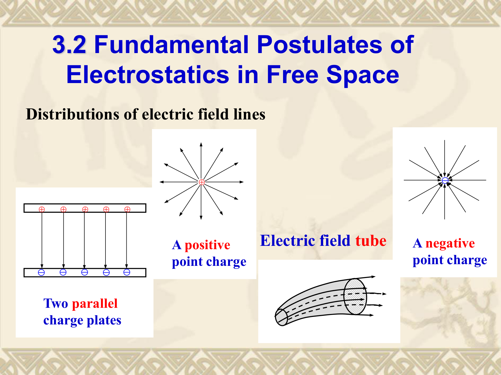
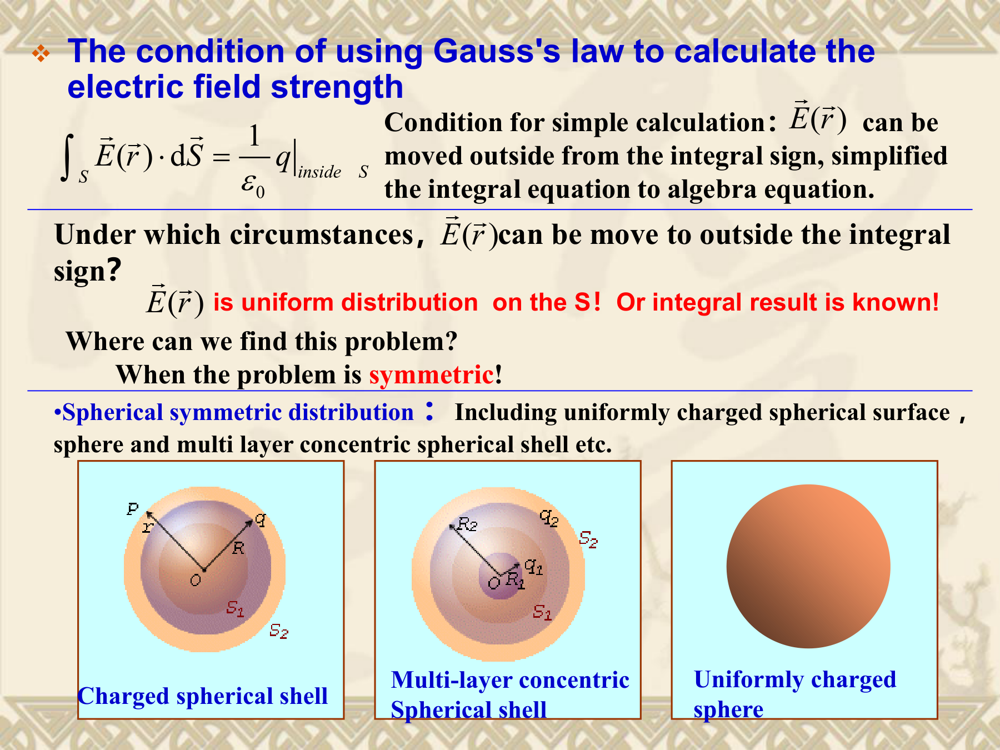
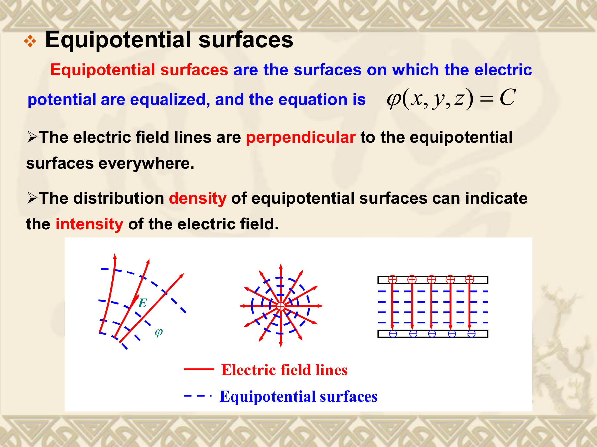
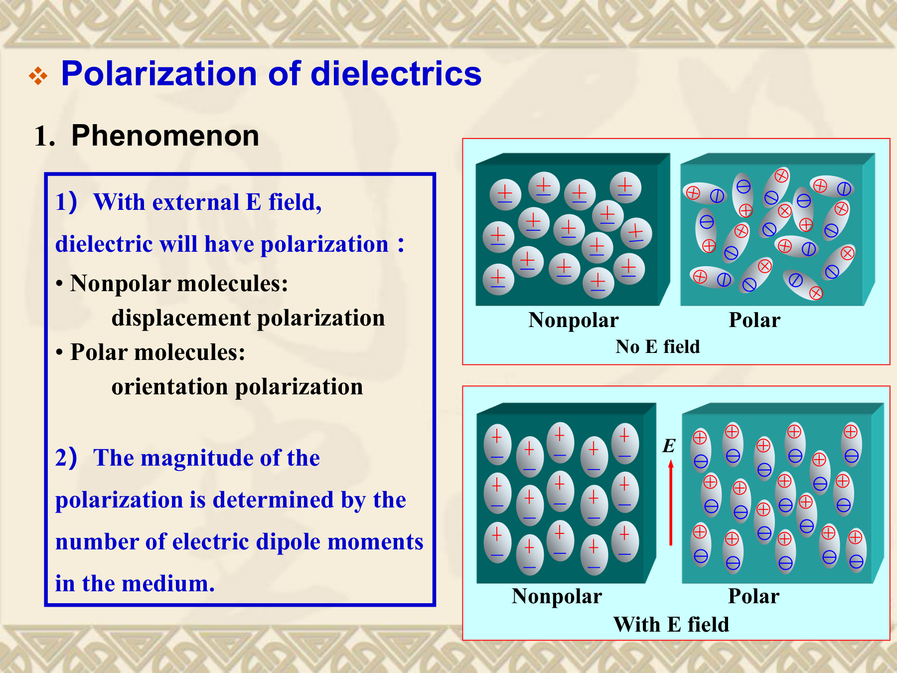
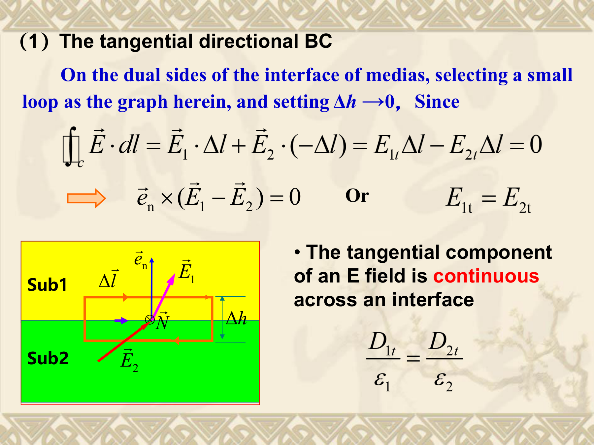
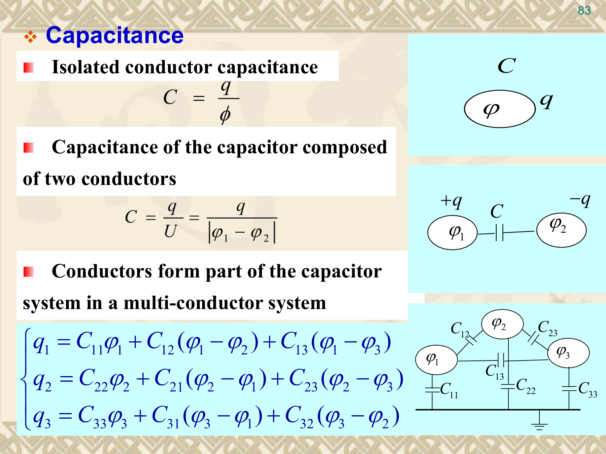
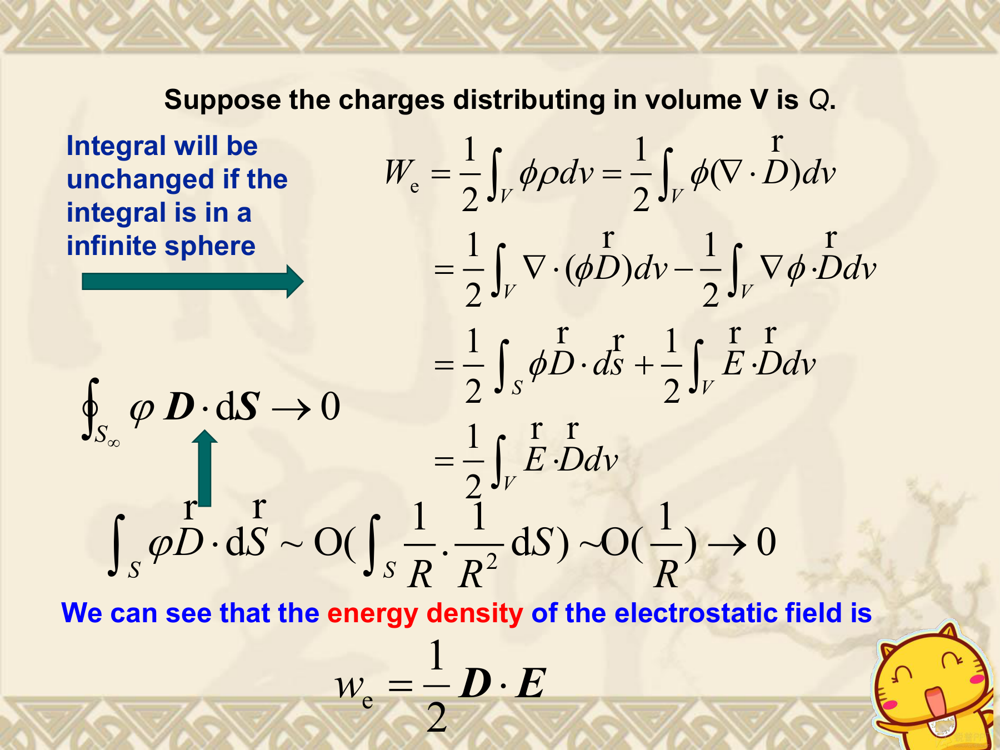

# 第3章：静电场 (Static Electric Fields)

本章研究静止电荷产生的电场。核心问题：已知电荷分布，求电场 $\vec E$ 和电势 $\varphi$。涉及真空、导体和介质三种环境，最终能计算电容和静电场能量。

---

## 1. 电荷与电场的基本规律

### 1.1 电荷分布

电荷是电场之源。按空间分布分为四种：

| 类型 | 密度符号 | 定义 | 单位 | 总电荷 |
|---|---|---|---|---|
| 体电荷 | $\rho$ (或 $\rho_v$) | $\rho = \lim_{\Delta V \to 0} \frac{\Delta q}{\Delta V}$ | $\text{C/m}^3$ | $q = \int_V \rho \, dV$ |
| 面电荷 | $\rho_s$ (或 $\sigma$) | $\rho_s = \lim_{\Delta S \to 0} \frac{\Delta q}{\Delta S}$ | $\text{C/m}^2$ | $q = \int_S \rho_s \, dS$ |
| 线电荷 | $\rho_l$ | $\rho_l = \lim_{\Delta l \to 0} \frac{\Delta q}{\Delta l}$ | $\text{C/m}$ | $q = \int_l \rho_l \, dl$ |
| 点电荷 | $q$ | 用 $\delta$ 函数: $\rho(\vec r) = q\,\delta(\vec r - \vec r')$ | C | -- |

**注意：** 面电荷是理想化模型，真实情况是薄层体电荷。在面电荷模型中，电场在表面处不连续（这是模型的数学性质，非物理悖论）。

### 1.2 库仑定律与叠加原理

**点电荷的电场：** 位于 $\vec r'$ 的点电荷 $Q$ 在场点 $\vec r$ 处产生的电场：

$$\vec E(\vec r) = \frac{Q}{4\pi\varepsilon_0 R^2} \vec e_R = \frac{Q(\vec r - \vec r')}{4\pi\varepsilon_0 |\vec r - \vec r'|^3}$$

其中 $\vec R = \vec r - \vec r'$，$R = |\vec R|$，$\varepsilon_0 \approx 8.854 \times 10^{-12} \text{ F/m}$。

**电场强度定义：** $\vec E = \lim_{q \to 0} \frac{\vec F}{q}$（单位正电荷受力），单位 $\text{V/m}$ 或 $\text{N/C}$。电荷 $q$ 在电场中受力 $\vec F = q\vec E$。

**叠加原理：** $n$ 个点电荷的总电场等于各自电场的矢量和：

$$\vec E(\vec r) = \frac{1}{4\pi\varepsilon_0} \sum_{k=1}^{n} \frac{q_k(\vec r - \vec r_k)}{|\vec r - \vec r_k|^3}$$

**连续分布电荷的电场**（库仑积分）：

$$\vec E(\vec r) = \frac{1}{4\pi\varepsilon_0} \int_{V'} \frac{\rho(\vec r')(\vec r - \vec r')}{|\vec r - \vec r'|^3} \, dV' \quad \text{（体电荷）}$$

面电荷和线电荷类似，将 $\rho\, dV'$ 换为 $\rho_s\, dS'$ 或 $\rho_l\, dl'$。

**直觉：** 正电荷的电场线向外发散（源），负电荷的电场线向内汇聚（汇）。平行板之间电场线基本均匀。

**常见错误：** 叠加是矢量叠加！各电荷到场点的方向矢量 $\vec r - \vec r_k$ 不同，不能直接用标量相加。

### 1.3 静电场的基本假设

真空中静电场的两条公理：

$$\nabla \cdot \vec E = \frac{\rho}{\varepsilon_0} \qquad \text{（有散场：电荷是源）}$$

$$\nabla \times \vec E = 0 \qquad \text{（无旋场：保守场）}$$

积分形式（分别由散度定理和 Stokes 定理推导）：

$$\oint_S \vec E \cdot d\vec S = \frac{Q_{\text{enclosed}}}{\varepsilon_0}$$

$$\oint_C \vec E \cdot d\vec l = 0$$

**物理含义：** 散度方程说明电场线起于正电荷、止于负电荷。旋度方程说明沿任意闭合回路走一圈，电场力净功为零——这是后面能定义标量电势 $\varphi$ 的前提（$\nabla \times \vec E = 0 \;\Rightarrow\; \vec E = -\nabla\varphi$）。

**两个方程缺一不可：** 散度定源的大小，旋度（为零）定场的保守性。

### 1.4 高斯定理

**积分形式：** $\displaystyle \oint_S \vec E \cdot d\vec S = \frac{Q_{\text{enclosed}}}{\varepsilon_0}$

穿过任意闭合曲面的总电通量只与曲面内的电荷有关。高斯面外的电荷对总通量贡献为零（进的等于出的），但它们在面上各点产生的电场不为零。

**何时能用高斯定理简化计算？** 只有在以下三种对称情况下，$\vec E$ 的大小在高斯面上处处相等、方向处处垂直于高斯面，才能提出积分号：

| 对称类型 | 电荷分布 | 高斯面 |
|---|---|---|
| 球对称 | 均匀带电球体/球面/同心球壳 | 同心球面 |
| 轴对称 | 无限长均匀带电直线/圆柱体/圆柱面 | 同轴圆柱面 |
| 面对称 | 无限大均匀带电平面 | 垂直穿过的药片盒形柱体 |

**典型结果：**

**(1) 均匀带电球体**（半径 $a$，体电荷密度 $\rho_0$）：

$$\vec E = \begin{cases} \dfrac{\rho_0 r}{3\varepsilon_0} \vec e_r, & r < a \\[10pt] \dfrac{\rho_0 a^3}{3\varepsilon_0 r^2} \vec e_r, & r \geq a \end{cases}$$

球内 $E \propto r$（线性增长），球外 $E \propto 1/r^2$（等同于球心处点电荷）。

**(2) 均匀带电球面**（半径 $R$，总电荷 $Q$）：

$$\vec E = \begin{cases} 0, & r < R \\[6pt] \dfrac{Q}{4\pi\varepsilon_0 r^2} \vec e_r, & r > R \end{cases}$$

球面内的电场为零（高斯面内无电荷）；**表面处 $\vec E$ 不连续**。

**(3) 无限长均匀带电圆柱体**（半径 $a$，体电荷密度 $\rho$，令 $\rho_l = \pi a^2 \rho$）：

$$\vec E = \begin{cases} \dfrac{\rho r}{2\varepsilon_0} \vec e_r, & r < a \\[10pt] \dfrac{\rho_l}{2\pi\varepsilon_0 r} \vec e_r, & r > a \end{cases}$$

**(4) 无限大均匀带电平面**（面电荷密度 $\sigma$）：

$$\vec E = \frac{\sigma}{2\varepsilon_0} \vec e_n \quad \text{（方向垂直于平面，正 $\sigma$ 指向背离平面）}$$

分母是 $2\varepsilon_0$ 而不是 $\varepsilon_0$ 的原因：电通量从两侧各穿出一次。

**(5) 平行板电容器**（两板分别带 $+\sigma$ 和 $-\sigma$）：内部 $\vec E = \dfrac{\sigma}{\varepsilon_0}$，外部 $\vec E = 0$。两板各自的场在内部同向叠加、外部反向抵消。

**常见错误：** (a) 对非对称分布乱用高斯定理求解（定理本身成立但 $\vec E$ 提不出积分号）；(b) 混淆均匀带电"球体"和"球面"——前者球内 $E \neq 0$，后者球内 $E=0$。

---

## 2. 电势

### 2.1 电势的定义

因为 $\nabla \times \vec E = 0$，根据第2章向量恒等式（无旋场必可写为梯度场），存在标量函数 $\varphi$ 使得：

$$\vec E = -\nabla\varphi$$

$\varphi$ 称为电势，单位为 V。负号表示电场指向电势降低最快的方向。

**电势的积分定义：**

$$\varphi(\vec r) = -\int_{\text{ref}}^{\vec r} \vec E \cdot d\vec l$$

物理意义：将单位正电荷从参考点移到 $\vec r$ 处，外力需做的功。

**电压（电势差）：** $U_{12} = \varphi_1 - \varphi_2 = \int_{P_1}^{P_2} \vec E \cdot d\vec l$

**不同源的电势表达式（无穷远为参考点）：**

$$\varphi = \frac{q}{4\pi\varepsilon_0 R} \quad \text{（点电荷）}$$

$$\varphi = \frac{1}{4\pi\varepsilon_0} \int_{V'} \frac{\rho \, dV'}{R} \quad \text{（体电荷）}$$

面电荷、线电荷类似。电势是标量叠加，比电场矢量叠加更易计算。

**参考点选择原则：** (1) 表达式不发散；(2) 尽可能简单；(3) 同一问题只有一个参考点。对有限分布选无穷远；对无限大分布（如无限长线电荷）不能选无穷远（积分发散），应选有限距离。

**等势面：** $\varphi = \text{常数}$ 的曲面。电场线处处垂直于等势面；等势面越密，电场越强。

**常见错误：** (a) 忘记 $\vec E = -\nabla\varphi$ 中的负号；(b) 电势可加任意常数而不影响电场（$\nabla(\text{常数}) = 0$）；(c) 电势的绝对值无物理意义，只有电势差有意义。

### 2.2 泊松方程与拉普拉斯方程

将 $\vec E = -\nabla\varphi$ 代入 $\nabla \cdot \vec E = \rho/\varepsilon$：

$$\nabla^2\varphi = -\frac{\rho}{\varepsilon} \qquad \text{（泊松方程）}$$

当区域中无电荷（$\rho = 0$）时：

$$\nabla^2\varphi = 0 \qquad \text{（拉普拉斯方程）}$$

这是求解复杂边界下电势分布的控制方程——给定边界条件后可唯一确定 $\varphi$。

**验证：** 点电荷电势 $\varphi = q/(4\pi\varepsilon R)$，代入 $\nabla^2(1/R) = -4\pi\delta(\vec R)$ 可得 $\nabla^2\varphi = -q\delta(\vec R)/\varepsilon = -\rho/\varepsilon$。

### 2.3 电偶极子

**定义：** 一对大小相等、符号相反的电荷 $+q$ 和 $-q$，相距 $l$（从负到正为正方向）。

**电偶极矩：** $\vec p = q\vec l$，单位 $\text{C}\cdot\text{m}$

**远场近似**（$r \gg l$）：

$$\varphi = \frac{p\cos\theta}{4\pi\varepsilon_0 r^2}$$

$$\vec E = \frac{p}{4\pi\varepsilon_0 r^3}(\vec e_r \, 2\cos\theta + \vec e_\theta \sin\theta)$$

**关键特征：** 偶极子电势按 $1/r^2$ 衰减，电场按 $1/r^3$ 衰减——比点电荷（$1/r$ 和 $1/r^2$）各快一阶。原因是正负电荷的电场在远场几乎抵消。

**偶极子是理解介质极化的基石：** 介质分子（尤其是极性分子）可视为微小偶极子，极化强度 $\vec P$ 正是单位体积内偶极矩的矢量和。

---

## 3. 导体与介质

### 3.1 导体在静电场中

导体含大量自由电子。置于外电场中时，电子重新分布直至内部总电场为零——静电平衡。

**静电平衡下导体的性质：**

1. **导体内部 $\vec E = 0$**（否则电子继续移动）
2. **净电荷全部分布在表面**（内部 $\rho = 0$）
3. **表面电场垂直于表面**（若存在切向分量，表面电荷会移动）
4. **导体是等势体**（内部 $\vec E = 0$ 意味着各点电势相等）
5. **表面曲率越大处电荷密度越大**（尖端效应）

**导体表面边界条件**（设导体为介质2，$\vec E_2 = 0$）：

$$E_{1t} = 0 \quad \Rightarrow \quad \vec E_1 \perp \text{表面}$$

$$D_{1n} = \rho_s \quad \text{或} \quad \varepsilon_1 E_{1n} = \rho_s$$

### 3.2 介质极化

介质（绝缘体）中的电荷被束缚在原子/分子中，不能自由移动。外加电场后正负电荷中心发生微观位移，称为极化。

**两种极化机制：**

| 机制 | 分子类型 | 无外场时 | 加外场后 |
|---|---|---|---|
| 位移极化 | 非极性分子 (如 $\text{CO}_2$, $\text{H}_2$, $\text{CH}_4$) | 无偶极矩 | 正负电荷中心被拉开，产生感应偶极矩 |
| 取向极化 | 极性分子 (如 $\text{H}_2\text{O}$, $\text{HCl}$) | 有永久偶极矩但方向随机，宏观为零 | 偶极子趋于沿外场方向排列 |

**极化强度 $\vec P$：** 单位体积内电偶极矩的矢量和

$$\vec P = \lim_{\Delta V \to 0} \frac{\sum \vec p_i}{\Delta V} \quad \text{单位：}\text{C/m}^2$$

对于线性各向同性介质：$\vec P = \varepsilon_0 \chi_e \vec E$，其中 $\chi_e$ 为电极化率（无量纲）。

**极化电荷密度：**

$$\rho_P = -\nabla \cdot \vec P \quad \text{（体电荷密度）}$$

$$\rho_{sP} = \vec P \cdot \vec e_n \quad \text{（面电荷密度，介质-真空界面）}$$

$$\rho_{sP} = \vec e_n \cdot (\vec P_1 - \vec P_2) \quad \text{（两种介质界面）}$$

**极化电荷守恒：** $\int_V \rho_P \, dV + \int_S \rho_{sP} \, dS = 0$（极化不创造净电荷，只重新分布）。

**重要区分：** 自由电荷是可宏观移动的电荷（如导体中的电子、电容极板上外加的电荷）；极化电荷是束缚电荷，被原子/分子束缚，只能微位移。

### 3.3 电位移矢量 $\vec D$

直接处理极化电荷很困难（$\rho_P$ 依赖于 $\vec P$，$\vec P$ 又依赖于总电场 $\vec E$）。引入 $\vec D$ 可规避极化电荷的循环依赖。

$$\vec D = \varepsilon_0 \vec E + \vec P$$

对线性各向同性介质：$\vec D = \varepsilon_0(1 + \chi_e)\vec E = \varepsilon_0\varepsilon_r\vec E = \varepsilon\vec E$

其中 $\varepsilon_r = 1 + \chi_e$（相对介电常数），$\varepsilon = \varepsilon_0\varepsilon_r$（介电常数）。

**含介质时的高斯定理（只含自由电荷！）：**

$$\oint_S \vec D \cdot d\vec S = Q_{\text{free}} \qquad \nabla \cdot \vec D = \rho_{\text{free}}$$

静电场的无旋性不变：$\nabla \times \vec E = 0$，$\oint \vec E \cdot d\vec l = 0$

**求解流程（已知自由电荷分布）：**
1. 用 $\nabla \cdot \vec D = \rho_{\text{free}}$ 求 $\vec D$
2. 用 $\vec D = \varepsilon \vec E$ 求 $\vec E$
3. 用 $\vec E = -\nabla\varphi$ 求 $\varphi$

**介质分类：**
- 线性/非线性：$\varepsilon$ 是否与 $|\vec E|$ 有关
- 各向同性/各向异性：$\vec D$ 与 $\vec E$ 是否同方向；各向异性时 $\varepsilon$ 为 $3\times3$ 张量
- 均匀/非均匀：$\varepsilon$ 是否随空间位置变化

---

## 4. 边界条件（考试重点）

微分方程在介质界面上失效（参数不连续），需用积分形式推导边界条件。

### 4.1 切向边界条件

用跨越界面的小矩形回路，令高度 $\Delta h \to 0$，由 $\oint \vec E \cdot d\vec l = 0$ 得：

$$\boxed{E_{1t} = E_{2t}} \qquad \text{即} \quad \vec e_n \times (\vec E_1 - \vec E_2) = 0$$

**$\vec E$ 的切向分量在界面两侧连续。**

### 4.2 法向边界条件

用药片盒形高斯面（扁圆柱），令高度 $\Delta h \to 0$，由 $\oint \vec D \cdot d\vec S = Q_{\text{free}}$ 得：

$$\boxed{D_{1n} - D_{2n} = \rho_s} \qquad \text{即} \quad \vec e_n \cdot (\vec D_1 - \vec D_2) = \rho_s$$

**$\vec D$ 的法向分量差等于自由面电荷密度。** 若无自由面电荷（$\rho_s = 0$），则 $D_{1n} = D_{2n}$。

### 4.3 特殊情况

**(A) 两种理想介质界面**（$\rho_s = 0$）：

$$E_{1t} = E_{2t}, \quad D_{1n} = D_{2n}$$

电场折射定律（$\alpha$ 为电场与法线的夹角）：

$$\boxed{\frac{\tan\alpha_1}{\tan\alpha_2} = \frac{\varepsilon_1}{\varepsilon_2}}$$

若 $\varepsilon_1 > \varepsilon_2$，则 $\alpha_1 > \alpha_2$：高 $\varepsilon$ 介质中电场更偏离法线；进入低 $\varepsilon$ 介质时电场向法线靠拢。

**(B) 理想导体表面**（导体为介质2，$\vec E_2 = 0$）：

$$E_{1t} = 0, \quad D_{1n} = \rho_s \quad \text{（电场垂直于导体表面）}$$

**电势的边界条件：** $\varphi$ 在任意界面上连续（$\varphi_1 = \varphi_2$）；导体表面 $\varphi$ 为常数。

### 4.4 边界条件速记表

| 场量 | 分量 | 边界条件 | 推导依据 |
|---|---|---|---|
| $\vec E$ | 切向 | $E_{1t} = E_{2t}$（连续） | $\oint \vec E \cdot d\vec l = 0$ |
| $\vec D$ | 法向 | $D_{1n} - D_{2n} = \rho_s$（跳跃） | $\oint \vec D \cdot d\vec S = Q_{\text{free}}$ |
| $\varphi$ | -- | $\varphi_1 = \varphi_2$（连续） | 电势差有限、界面厚度趋于零 |

**常见错误：** 记混谁切向连续谁法向跳跃。记忆口诀：**E 切（切向）连续，D 法（法向）跳跃。**

---

## 5. 电容与静电场能量

### 5.1 电容

**定义：** 电容衡量导体系统储存电荷的能力。

孤立导体：$C = \dfrac{Q}{\varphi}$

两导体电容器：$\boxed{C = \dfrac{Q}{U} = \dfrac{Q}{\varphi_1 - \varphi_2}}$

多导体系统需电容矩阵描述（含自电容 $C_{ii}$ 和互电容 $C_{ij}$）。

**电容只取决于几何形状、尺寸和介质**，与 $Q$、$U$ 无关（$C = \varepsilon \times \text{几何因子}$）。

**求解方法：**
- **设电荷法：** 假设 $\pm Q$ → 求 $\vec E$ → 积分得 $U$ → $C = Q/U$
- **设电压法：** 假设 $U$ → 求 $\vec E$（解拉普拉斯方程）→ 得 $\rho_s$ 和 $Q$ → $C = Q/U$

**典型电容公式：**

| 结构 | 电容 | 备注 |
|---|---|---|
| 平行板 | $C = \dfrac{\varepsilon S}{d}$ | $S$ 为板面积，$d$ 为间距 |
| 同心球 | $C = \dfrac{4\pi\varepsilon ab}{b-a}$ | $a$ 内径，$b$ 外径 |
| 孤立导体球 | $C = 4\pi\varepsilon a$ | $b\to\infty$ 的特例 |
| 同轴线（单位长） | $C = \dfrac{2\pi\varepsilon}{\ln(b/a)}$ | $a$ 内径，$b$ 外径 |
| 平行双导线（单位长） | $C = \dfrac{\pi\varepsilon}{\ln(D/a)}$ | $D \gg a$，$D$ 为间距，$a$ 为半径 |

**多层介质处理：** 电场串联则子电容串联，电场并联则子电容并联。

### 5.2 静电场能量

**两种等价的计算方式：**

**(1) 电荷-电势形式：**

$$W_e = \frac{1}{2} \int_V \rho \varphi \, dV \qquad \text{（体电荷）}$$

对 $n$ 个带电导体：$W_e = \dfrac{1}{2} \sum_{i=1}^n Q_i \Phi_i$

对电容器：$\boxed{W_e = \dfrac{1}{2}QU = \dfrac{1}{2}CU^2 = \dfrac{Q^2}{2C}}$

**(2) 场能量密度形式（更基本）：**

能量密度：$\boxed{w_e = \dfrac{1}{2}\vec D \cdot \vec E = \dfrac{1}{2}\varepsilon E^2}$

总能量：$\boxed{W_e = \dfrac{1}{2} \int_{V_{\text{all}}} \vec D \cdot \vec E \, dV}$

**推导思路：** 从 $W_e = \frac{1}{2}\int \rho\varphi\,dV$ 出发，用 $\rho = \nabla \cdot \vec D$ 代入，利用矢量恒等式 $\varphi(\nabla \cdot \vec D) = \nabla \cdot (\varphi\vec D) - \vec D \cdot \nabla\varphi$，散度项经散度定理变为面积分，扩展到全空间时面积分趋于零（$\varphi\sim1/R$, $D\sim1/R^2$），得到 $W_e = \frac{1}{2}\int \vec D \cdot \vec E\,dV$。

**能量不满足叠加原理！**

$$W_e \propto |\vec E|^2, \quad |\vec E_1 + \vec E_2|^2 = |\vec E_1|^2 + |\vec E_2|^2 + \underbrace{2\vec E_1 \cdot \vec E_2}_{\text{互能（交叉项）}}$$

交叉项代表互能 (mutual energy)，$|\vec E_1|^2$ 项代表自能 (self energy)。总能量不等于各自能量之和。

---

## 6. 典型例题

### 例题1：介质界面边界条件

**题目：** 两种理想介质 $(\varepsilon_1 = 3\varepsilon_0,\; \varepsilon_2 = \varepsilon_0)$ 构成平面界面，界面上无自由面电荷。介质1中电场 $\vec E_1$ 与界面法线夹角为 $30^\circ$，大小为 $100\text{ V/m}$。求介质2中 $\vec E_2$ 的大小和方向。

**解：**

由切向边界条件：$E_{1t} = E_{2t}$。$E_{1t} = E_1 \sin 30^\circ = 100 \times 0.5 = 50\text{ V/m}$，故 $E_{2t} = 50\text{ V/m}$。

由法向边界条件（$\rho_s = 0$）：$D_{1n} = D_{2n}$，即 $\varepsilon_1 E_{1n} = \varepsilon_2 E_{2n}$。

$E_{1n} = E_1 \cos 30^\circ = 100 \times \frac{\sqrt{3}}{2} \approx 86.6\text{ V/m}$

$E_{2n} = \frac{\varepsilon_1}{\varepsilon_2} E_{1n} = 3 \times 86.6 = 259.8\text{ V/m}$

$E_2 = \sqrt{E_{2t}^2 + E_{2n}^2} = \sqrt{50^2 + 259.8^2} \approx 264.6\text{ V/m}$

$\tan\alpha_2 = \frac{E_{2t}}{E_{2n}} = \frac{50}{259.8} \approx 0.192$，$\alpha_2 \approx 10.9^\circ$

或直接由折射公式：$\frac{\tan 30^\circ}{\tan\alpha_2} = \frac{\varepsilon_1}{\varepsilon_2} = 3$，$\tan\alpha_2 = \frac{1/\sqrt{3}}{3} \approx 0.192$。

**答案：** $E_2 \approx 265\text{ V/m}$，与法线夹角约 $10.9^\circ$。电场进入低 $\varepsilon$ 介质后向法线靠拢。

---

### 例题2：从电势求电场与电荷密度

**题目：** 已知某区域的电势分布 $\varphi(x,y,z) = 2x^2 - 3y^2 + z^2$（V）。求：(1) 电场强度 $\vec E$；(2) 空间电荷密度 $\rho$（设 $\varepsilon = \varepsilon_0$）。

**解：**

**(1)** $\vec E = -\nabla\varphi = -\left(\frac{\partial\varphi}{\partial x}\vec e_x + \frac{\partial\varphi}{\partial y}\vec e_y + \frac{\partial\varphi}{\partial z}\vec e_z\right)$

$\frac{\partial\varphi}{\partial x} = 4x,\; \frac{\partial\varphi}{\partial y} = -6y,\; \frac{\partial\varphi}{\partial z} = 2z$

$\boxed{\vec E = -4x\,\vec e_x + 6y\,\vec e_y - 2z\,\vec e_z} \quad \text{(V/m)}$

**(2)** 由泊松方程 $\nabla^2\varphi = -\rho/\varepsilon_0$：

$\nabla^2\varphi = \frac{\partial^2\varphi}{\partial x^2} + \frac{\partial^2\varphi}{\partial y^2} + \frac{\partial^2\varphi}{\partial z^2} = 4 + (-6) + 2 = 0$

$\rho = -\varepsilon_0 \nabla^2\varphi = 0$

**答案：** 该区域无体电荷分布。电场线从高电势指向低电势。

---

### 例题3：极化电荷密度

**题目：** 一块介质板（$\varepsilon_r = 3$，厚度 $d$）置于均匀电场 $\vec E_0 = E_0 \vec e_z$ 中（垂直于板面）。求：(1) 介质极化强度 $\vec P$；(2) 上下表面的极化面电荷密度；(3) 介质内部的极化体电荷密度。

**解：**

**(1)** 介质内部电场（由法向边界条件 $D_n$ 连续，真空一侧 $D = \varepsilon_0 E_0$，介质中 $D$ 相同）：

$\vec D = \varepsilon_0 E_0 \vec e_z = \varepsilon \vec E_{\text{in}} \;\Rightarrow\; \vec E_{\text{in}} = \frac{\varepsilon_0 E_0}{\varepsilon} \vec e_z = \frac{E_0}{\varepsilon_r} \vec e_z = \frac{E_0}{3} \vec e_z$

$\vec P = \varepsilon_0 \chi_e \vec E_{\text{in}} = \varepsilon_0(\varepsilon_r - 1)\cdot \frac{E_0}{3} \vec e_z = \varepsilon_0 \cdot 2 \cdot \frac{E_0}{3} \vec e_z = \frac{2}{3}\varepsilon_0 E_0 \vec e_z$

**(2)** 上表面（法线向外）：$\rho_{sP} = \vec P \cdot \vec e_n = \vec P \cdot (-\vec e_z) = -\frac{2}{3}\varepsilon_0 E_0$

下表面（法线向外）：$\rho_{sP} = \vec P \cdot \vec e_n = \vec P \cdot \vec e_z = \frac{2}{3}\varepsilon_0 E_0$

**(3)** $\rho_P = -\nabla \cdot \vec P = 0$（均匀极化无体极化电荷）

---

## 7. 自测题

**Q1.** 静电场散度方程 $\nabla \cdot \vec E = \rho/\varepsilon_0$ 的物理含义是什么？为什么说静电场是"有散场"？

**Q2.** 对于有限长均匀带电直线段，能否直接用高斯定理求电场？为什么？

**Q3.** 均匀带电球体和均匀带电球面的内部电场有何区别？

**Q4.** 电势参考点如何选择？改变参考点对电势和电场有何影响？

**Q5.** 偶极子电场按 $1/r^3$ 衰减而点电荷按 $1/r^2$ 衰减，原因是什么？

**Q6.** 写出静电场的两条边界条件，并说明各自的推导依据。

**Q7.** 两种介质界面无自由面电荷，$\varepsilon_1 > \varepsilon_2$。电场穿过界面时方向如何变化？

**Q8.** 一个平行板电容器，板面积 $S$，间距 $d$，介质 $\varepsilon$。写出电容公式和充电至电压 $U$ 时的储能。

**Q9.** 为什么静电场能量不满足叠加原理？证明这一点。

**Q10.** (计算) 半径为 $a = 0.1$ m 的孤立导体球，带电荷 $Q = 10^{-6}$ C。求：(a) 球表面电场；(b) 球电容；(c) 存储的静电场总能量。

---

### 自测题答案

**A1.** 散度方程说明电荷是电场的源：正电荷处 $\nabla \cdot \vec E > 0$（电场线发散），负电荷处 $\nabla \cdot \vec E < 0$（电场线汇聚）。静电场起于正电荷、止于负电荷，故为"有散场"。

**A2.** 不能。高斯定理本身成立，但有限长线段不具备足够的对称性——电场大小和方向在高斯面上不是常数（同时有 $\vec e_\rho$ 和 $\vec e_z$ 分量），无法将 $\vec E$ 提出积分号。需用库仑定律直接积分。

**A3.** 均匀带电球体内部 $E \propto r$（线性增长，原因是内部有体电荷）；均匀带电球面内部 $E = 0$（高斯面内无电荷）。

**A4.** 选使表达式不发散且尽可能简单的点。对有限分布选无穷远，对无限分布选有限距离。改变参考点使所有电势加减同一常数，电势差不变，$\vec E = -\nabla\varphi$ 不变（梯度消去常数）。

**A5.** 偶极子正负电荷总量为零，两电荷的电场在远场几乎互相抵消，仅因"哪个电荷离场点更近"残留微弱差异。点电荷有净电荷，电场遍布球面（$1/r^2$）。偶极子比点电荷多衰减一阶。

**A6.** 
- 切向：$E_{1t} = E_{2t}$，由 $\oint \vec E \cdot d\vec l = 0$ 推导（跨越界面的小矩形回路）
- 法向：$D_{1n} - D_{2n} = \rho_s$，由 $\oint \vec D \cdot d\vec S = Q_{\text{free}}$ 推导（跨越界面的药片盒形高斯面）

**A7.** 由折射定律 $\tan\alpha_1 / \tan\alpha_2 = \varepsilon_1/\varepsilon_2$，$\varepsilon_1 > \varepsilon_2$ 时 $\alpha_1 > \alpha_2$。电场从高 $\varepsilon$ 介质进入低 $\varepsilon$ 介质时向法线方向靠拢。直觉：低 $\varepsilon$ 介质中 $E_n = D_n/\varepsilon$ 更大，法向分量更强。

**A8.** $C = \varepsilon S / d$，$W_e = \frac{1}{2}CU^2 = \frac{\varepsilon S U^2}{2d}$

**A9.** 证明：设总电场 $\vec E = \vec E_1 + \vec E_2$，能量密度 $w_e = \frac{1}{2}\varepsilon|\vec E|^2 = \frac{1}{2}\varepsilon(|\vec E_1|^2 + |\vec E_2|^2 + 2\vec E_1\cdot\vec E_2) \neq w_{e1} + w_{e2}$。交叉项 $2\vec E_1 \cdot \vec E_2$ 是互能，除非两场处处正交，否则不能忽略。

**A10.**
(a) $E = \frac{Q}{4\pi\varepsilon_0 a^2} = \frac{10^{-6}}{4\pi \times 8.854\times 10^{-12} \times 0.01} \approx 9.0 \times 10^5\text{ V/m}$
(b) $C = 4\pi\varepsilon_0 a = 4\pi \times 8.854\times 10^{-12} \times 0.1 \approx 1.11 \times 10^{-11}\text{ F} = 11.1\text{ pF}$
(c) $W_e = \frac{Q^2}{2C} = \frac{10^{-12}}{2 \times 1.11 \times 10^{-11}} \approx 4.5 \times 10^{-2}\text{ J}$，或 $W_e = \frac{Q^2}{8\pi\varepsilon_0 a} \approx 4.5 \times 10^{-2}\text{ J}$
