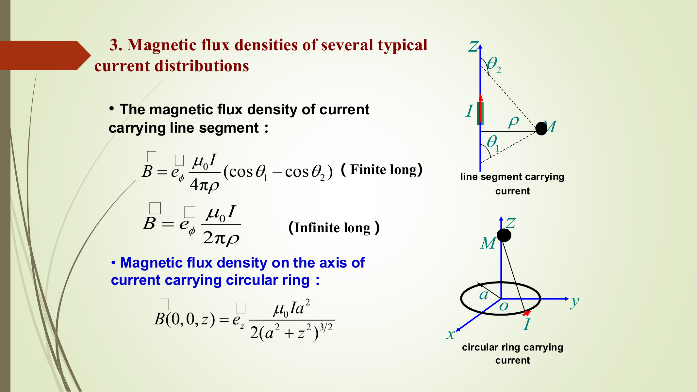
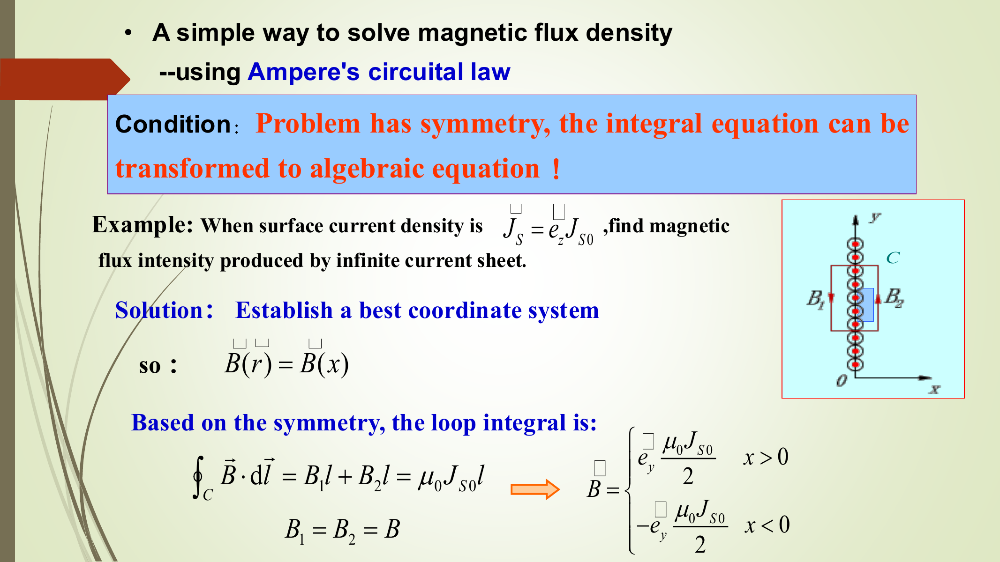
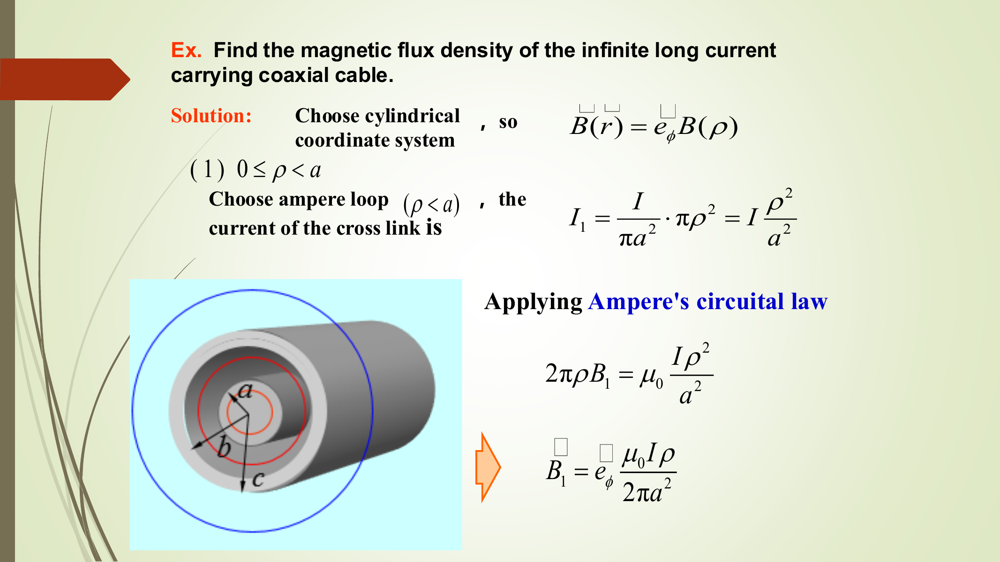
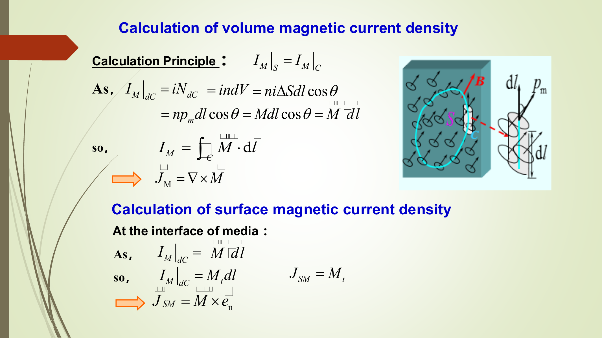
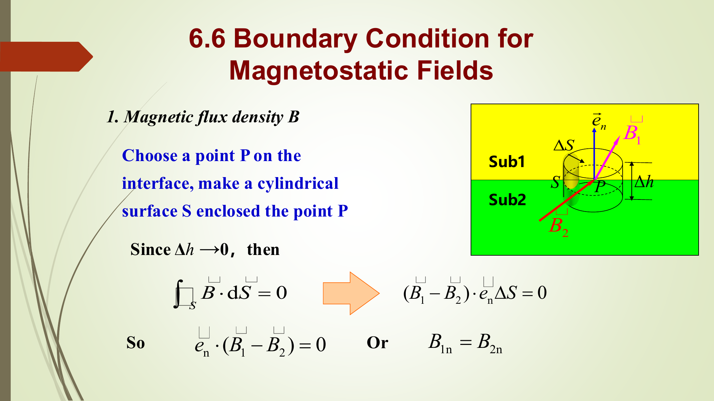
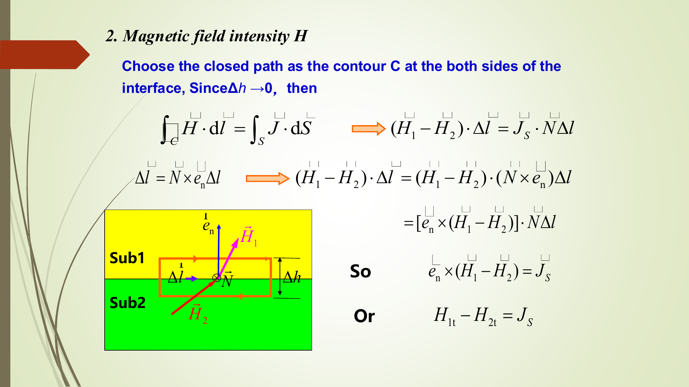
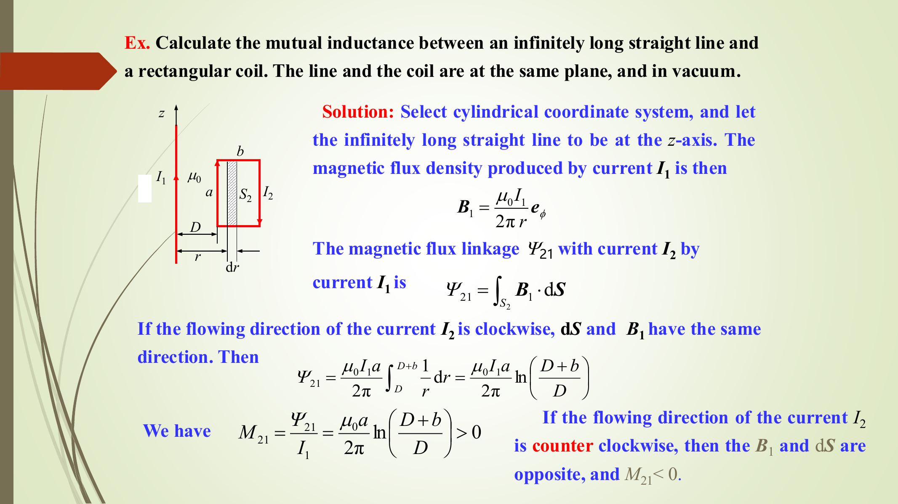

# 第6章：静磁场 (Static Magnetic Fields)

## 1. 本章主线

第5章讲恒定电流：$\nabla\cdot\bm J=0$，电流线闭合。本章接着问：**恒定电流会在空间中产生怎样的磁场？磁介质会怎样改变磁场？磁场能量和电感怎么计算？**

一句话理解：

- 电流是静磁场的“旋涡源”：$\nabla\times\bm B=\mu_0\bm J$（真空）或 $\nabla\times\bm H=\bm J$（介质宏观形式）。
- 磁感应强度 $\bm B$ 永远无散：$\nabla\cdot\bm B=0$，所以磁力线总是闭合，没有孤立磁荷。
- 计算磁场常用两条路：**对称性强用安培环路定律；一般电流分布用 Biot-Savart 定律。**
- 磁介质用磁化强度 $\bm M$、磁场强度 $\bm H$、磁导率 $\mu$ 描述。
- 电感 $L$ 本质是“单位电流产生多少磁链”，磁能可用场量或电感计算。

考试优先级：安培环路定律、Biot-Savart 典型结果、磁化电流、$\bm B/\bm H$ 边界条件、电感与磁能。

---

## 2. 符号表

| 符号 | 含义 | 单位 |
|---|---|---|
| $\bm B$ | 磁感应强度/磁通密度 | T |
| $\bm H$ | 磁场强度 | A/m |
| $\bm J$ | 自由体电流密度 | A/m$^2$ |
| $\bm J_s$ | 自由面电流密度 | A/m |
| $\bm A$ | 磁矢位，满足 $\bm B=\nabla\times\bm A$ | Wb/m |
| $\bm M$ | 磁化强度，单位体积磁偶极矩 | A/m |
| $\bm J_M$ | 体磁化电流密度 | A/m$^2$ |
| $\bm J_{sM}$ | 面磁化电流密度 | A/m |
| $\mu_0$ | 真空磁导率，$4\pi\times10^{-7}$ H/m | H/m |
| $\mu$ | 介质磁导率，$\bm B=\mu\bm H$ | H/m |
| $\mu_r$ | 相对磁导率，$\mu=\mu_0\mu_r$ | 1 |
| $\chi_m$ | 磁化率，$\bm M=\chi_m\bm H$ | 1 |
| $\Phi$ | 磁通，$\Phi=\int_S\bm B\cdot d\bm S$ | Wb |
| $\Psi$ | 磁链 | Wb |
| $L$ | 自感 | H |
| $M$ | 互感 | H |
| $w_m,W_m$ | 磁能密度、总磁能 | J/m$^3$, J |
| $\bm e_n$ | 从介质2指向介质1的界面单位法向量（本章边界条件按 slides 图示） | 1 |

---

## 3. 静磁场基本方程

### 3.1 真空中的两个基本假设

$$\boxed{\nabla\times\bm B=\mu_0\bm J},\qquad \boxed{\nabla\cdot\bm B=0}$$

积分形式：

$$\boxed{\oint_C \bm B\cdot d\bm l=\mu_0 I_{\text{enc}}},\qquad
\boxed{\oint_S \bm B\cdot d\bm S=0}$$

其中 $I_{\text{enc}}=\int_S\bm J\cdot d\bm S$ 是闭合曲线 $C$ 所围曲面穿过的总电流。

**物理意义：**

| 方程 | 人话理解 | 常见考法 |
|---|---|---|
| $\nabla\times\bm B=\mu_0\bm J$ | 电流使磁场“绕起来” | 用安培环路定律求 $\bm B$ |
| $\nabla\cdot\bm B=0$ | 磁力线没有起点和终点，闭合 | 边界条件 $B_{1n}=B_{2n}$ |

因为任意旋度的散度恒为零，

$$\nabla\cdot(\nabla\times\bm B)\equiv0
$$

代入 $\nabla\times\bm B=\mu_0\bm J$ 得

$$
\mu_0\nabla\cdot\bm J=0 \Rightarrow \boxed{\nabla\cdot\bm J=0}
$$

这与第5章恒定电流连续性方程一致。

**易错点：**静电场中 $\nabla\times\bm E=0$，所以 $\bm E$ 是保守场；静磁场中 $\nabla\times\bm B\ne0$，所以一般不是保守场，不能像电势那样直接写 $\bm B=-\nabla\varphi$。

### 3.2 安培环路定律的使用条件

安培环路定律总是成立，但只有对称性足够强时才容易算：

1. 先判断磁场方向：长直电流通常为 $\bm e_\phi$ 方向。
2. 选安培回路：让 $\bm B$ 在回路上大小恒定，且与 $d\bm l$ 平行或垂直。
3. 写左边：$\oint_C\bm B\cdot d\bm l=B(2\pi\rho)$ 等。
4. 写右边：只算穿过回路面的包围电流 $I_{\text{enc}}$。
5. 解出 $\bm B$ 或 $\bm H$，最后补方向。

---

## 4. 磁矢位 $\bm A$

由于

$$
\nabla\cdot\bm B=0
$$

所以 $\bm B$ 可以写成某个矢量场的旋度：

$$\boxed{\bm B=\nabla\times\bm A}$$

$\bm A$ 称为磁矢位。因为 $\nabla\cdot(\nabla\times\bm A)\equiv0$，这个定义自动满足 $\nabla\cdot\bm B=0$。

### 4.1 Coulomb 规范

矢量场只给旋度还不唯一，slides 采用静磁场常用的 Coulomb gauge：

$$\boxed{\nabla\cdot\bm A=0}$$

### 4.2 磁矢位方程

由 $\bm B=\nabla\times\bm A$ 和 $\nabla\times\bm B=\mu_0\bm J$：

$$\nabla\times(\nabla\times\bm A)=\mu_0\bm J
$$

用矢量恒等式

$$\nabla\times(\nabla\times\bm A)=\nabla(\nabla\cdot\bm A)-\nabla^2\bm A
$$

又因 $\nabla\cdot\bm A=0$，得到

$$
-\nabla^2\bm A=\mu_0\bm J
$$

所以

$$\boxed{\nabla^2\bm A=-\mu_0\bm J}$$

无源区 $\bm J=0$：

$$\boxed{\nabla^2\bm A=0}$$

### 4.3 无限均匀介质中的积分解

类比静电势

$$
\varphi(\bm r)=\frac{1}{4\pi\varepsilon}\int_{V'}\frac{\rho(\bm r')}{R}\,dV'
$$

磁矢位为

$$\boxed{\bm A(\bm r)=\frac{\mu_0}{4\pi}\int_{V'}\frac{\bm J(\bm r')}{R}\,dV'}$$

其中 $R=|\bm r-\bm r'|$，$\bm r$ 是场点，$\bm r'$ 是源点。

slides 还把 $\bm A$ 和 $\bm J$ 分量展开为

$$
\bm A=A_x\bm e_x+A_y\bm e_y+A_z\bm e_z,
\qquad
\bm J=J_x\bm e_x+J_y\bm e_y+J_z\bm e_z
$$

于是矢量泊松方程等价于三个标量泊松方程：

$$
\nabla^2A_x=-\mu_0J_x,
\qquad
\nabla^2A_y=-\mu_0J_y,
\qquad
\nabla^2A_z=-\mu_0J_z
$$

弱基础记忆：如果电流只沿 $z$ 方向，例如长直线电流，通常只需要求 $A_z$。

对线电流：

$$\boxed{\bm A(\bm r)=\frac{\mu_0 I}{4\pi}\oint_C\frac{d\bm l'}{R}}$$

slides 例题给出无限长直线电流的磁矢位形式可写成

$$\bm A=A_z(\rho)\bm e_z,\qquad A_z=\frac{\mu_0 I}{2\pi}\ln\frac{2L}{\rho}+C\quad(L\to\infty)
$$

这里 $C$ 可随规范选择变化；$L\to\infty$ 时 $\ln(2L/\rho)$ 的常数部分也会发散。因此对无限长导线，不能把 $A_z$ 的绝对零点当成物理量。真正可测的是

$$
\bm B=\nabla\times\bm A
$$

例如若 $\bm A=A_z(\rho)\bm e_z$，柱坐标中

$$
B_\phi=-\frac{\partial A_z}{\partial \rho}
$$

代入 $A_z=(\mu_0I/2\pi)\ln(2L/\rho)+C$，得

$$
B_\phi=-\left(-\frac{\mu_0I}{2\pi\rho}\right)=\frac{\mu_0I}{2\pi\rho}
$$

常数项和发散项求导后消失，所以不影响磁场。

---

## 5. Biot-Savart 定律与典型磁场

### 5.1 从安培力到 Biot-Savart 定律

slides 先给出安培力定律：两个载流回路之间会相互作用。若回路 $C_1$ 中电流为 $I_1$，回路 $C_2$ 中电流为 $I_2$，从 $C_1$ 上电流元指向 $C_2$ 上电流元的矢量为 $\bm R_{12}$，则 $C_1$ 对 $C_2$ 的力可写成

$$
\bm F_{12}=\frac{\mu_0}{4\pi}\oint_{C_2}\oint_{C_1}\frac{I_2d\bm l_2\times(I_1d\bm l_1\times\bm R_{12})}{R_{12}^3}
$$

这个公式考试一般不要求完整推导，但它说明了为什么要定义磁场：把括号中“由 $I_1$ 产生、作用在 $I_2$ 上”的部分单独记为 $\bm B_1$，就得到

$$
\bm F_{12}=\oint_{C_2}I_2d\bm l_2\times\bm B_1
$$

因此 Biot-Savart 定律是在回答：**已知电流分布，怎样求它产生的 $\bm B$？**

**补充的基础解释：为了帮助理解而添加。** 静电学中“电荷 $\to \bm E \to$ 作用力”；静磁场中对应为“电流 $\to \bm B \to$ 对其他电流产生安培力”。所以本章计算 $\bm B$，不是为了单独看一个抽象矢量，而是为了后续算磁力、磁能和电感。

### 5.2 Biot-Savart 定律

对任意线电流回路 $C$：

$$\boxed{d\bm B(\bm r)=\frac{\mu_0 I}{4\pi}\frac{d\bm l'\times\bm R}{R^3}}$$

$$\boxed{\bm B(\bm r)=\frac{\mu_0 I}{4\pi}\oint_C\frac{d\bm l'\times\bm R}{R^3}}$$

其中：

- $d\bm l'$：源点处电流元方向；
- $\bm R=\bm r-\bm r'$：从源点指向场点的矢量；
- $R=|\bm R|$。

其他电流模型：

| 电流模型 | 公式 |
|---|---|
| 面电流 $\bm J_s$ | $\bm B=\frac{\mu_0}{4\pi}\int_S\frac{\bm J_s(\bm r')\times\bm R}{R^3}\,dS'$ |
| 体电流 $\bm J$ | $\bm B=\frac{\mu_0}{4\pi}\int_V\frac{\bm J(\bm r')\times\bm R}{R^3}\,dV'$ |
| 运流电流 $\rho\bm v$ | $\bm B=\frac{\mu_0}{4\pi}\int_V\frac{\rho(\bm r')\bm v\times\bm R}{R^3}\,dV'$ |

**常见错误：**叉乘顺序是“电流元 $\times$ 指向场点的 $\bm R$”，不是 $\bm R\times d\bm l'$。顺序反了方向就反。

### 5.3 有限长直导线

距导线垂直距离为 $\rho$ 的点：

$$\boxed{\bm B=\bm e_\phi\frac{\mu_0 I}{4\pi\rho}(\cos\theta_1-\cos\theta_2)}$$

其中 $\theta_1,\theta_2$ 按 slides 图示从导线方向（$+z$ 方向）量到“源点到场点连线”的方向：图中下端对应 $\theta_1$，上端对应 $\theta_2$，所以 slides 写成 $\cos\theta_1-\cos\theta_2$。

**角度约定警告：**不同教材也常把角度定义为“连线与垂线的夹角”，这时公式会写成 $\sin\alpha_1+\sin\alpha_2$。两种写法不矛盾，因为角度互余。考试时不要只背符号，要先看图中角度从哪条线量起。

无限长直导线：

$$\boxed{\bm B=\bm e_\phi\frac{\mu_0 I}{2\pi\rho}}$$

### 5.4 圆形电流环轴线上磁场

半径 $a$、电流 $I$ 的圆环，在轴线上点 $(0,0,z)$：

$$\boxed{\bm B(z)=\bm e_z\frac{\mu_0 I a^2}{2(a^2+z^2)^{3/2}}}$$

中心处 $z=0$：

$$\boxed{\bm B(0)=\bm e_z\frac{\mu_0 I}{2a}}$$

远场 $z\gg a$：

$$\boxed{\bm B(z)\approx \bm e_z\frac{\mu_0 I a^2}{2z^3}}$$

**图中看什么：**
- 场点 $P$ 在圆环轴线上，源点绕圆环积分。
- 横向分量成对抵消，只剩 $z$ 分量。
- 分母 $(a^2+z^2)^{3/2}$ 来自 $R^3$。

### 5.5 圆环轴线公式推导模板

设圆环位于 $xy$ 平面，场点 $\bm r=z\bm e_z$，源点 $\bm r'=a\bm e_\rho$，电流元

$$d\bm l'=a\,d\phi'\bm e_\phi$$

则

$$\bm R=\bm r-\bm r'=z\bm e_z-a\bm e_\rho,\qquad R=(z^2+a^2)^{1/2}$$

叉乘：

$$
d\bm l'\times\bm R=a\,d\phi'\bm e_\phi\times(z\bm e_z-a\bm e_\rho)
$$

用柱坐标单位矢量关系 $\bm e_\phi\times\bm e_z=\bm e_\rho$，$\bm e_\phi\times\bm e_\rho=-\bm e_z$：

$$
d\bm l'\times\bm R=az\,d\phi'\bm e_\rho+a^2\,d\phi'\bm e_z
$$

代入 Biot-Savart：

$$
\bm B=\frac{\mu_0 I}{4\pi}\int_0^{2\pi}\frac{az\bm e_\rho+a^2\bm e_z}{(a^2+z^2)^{3/2}}d\phi'
$$

由于

$$
\int_0^{2\pi}\bm e_\rho d\phi'=\int_0^{2\pi}(\bm e_x\cos\phi'+\bm e_y\sin\phi')d\phi'=0
$$

所以只剩

$$
\bm B=\frac{\mu_0 I}{4\pi}\frac{a^2}{(a^2+z^2)^{3/2}}\int_0^{2\pi}\bm e_z d\phi'
=\bm e_z\frac{\mu_0 I a^2}{2(a^2+z^2)^{3/2}}
$$

---

## 6. 用安培环路定律求磁场

### 6.1 无限长实心圆柱导体

半径 $a$，总电流 $I$ 均匀分布，电流沿 $+z$。由对称性 $\bm B=\bm e_\phi B(\rho)$。

内部 $0\le\rho<a$：

$$I_{\text{enc}}=I\frac{\pi\rho^2}{\pi a^2}=I\frac{\rho^2}{a^2}$$

$$B(2\pi\rho)=\mu_0I\frac{\rho^2}{a^2}$$

$$\boxed{\bm B=\bm e_\phi\frac{\mu_0 I\rho}{2\pi a^2},\quad 0\le\rho<a}$$

外部 $\rho\ge a$：

$$B(2\pi\rho)=\mu_0I$$

$$\boxed{\bm B=\bm e_\phi\frac{\mu_0 I}{2\pi\rho},\quad \rho\ge a}$$

如果是很薄的圆筒面电流，筒内无包围电流，筒外等效为长直导线。

### 6.2 无限大面电流

面电流 $\bm J_s=\bm e_z J_{s0}$，面位于 $x=0$。由对称性两侧磁场大小相等方向相反。

选跨过电流面的矩形安培回路：

$$B l+B l=\mu_0J_{s0}l$$

所以

$$B=\frac{\mu_0J_{s0}}{2}$$

方向由右手定则确定：

$$\boxed{\bm B=\begin{cases}
\bm e_y\frac{\mu_0J_{s0}}{2}, & x>0\\[4pt]
-\bm e_y\frac{\mu_0J_{s0}}{2}, & x<0
\end{cases}}$$

**图中看什么：**
- 回路上下两条边与 $\bm B$ 平行，贡献为 $Bl+Bl$。
- 两侧磁场大小相等、方向相反。
- 只有穿过回路面的面电流 $J_{s0}l$ 进入右边。

### 6.3 同轴电缆磁场

内导体半径 $a$，外导体内半径 $b$、外半径 $c$。内导体电流 $+I$，外导体均匀回流 $-I$。slides 给出的结果为：

$$\boxed{\bm B=\bm e_\phi\begin{cases}
\frac{\mu_0 I\rho}{2\pi a^2}, & 0\le\rho<a\\[4pt]
\frac{\mu_0 I}{2\pi\rho}, & a\le\rho<b\\[4pt]
\frac{\mu_0 I(c^2-\rho^2)}{2\pi\rho(c^2-b^2)}, & b\le\rho<c\\[4pt]
0, & \rho\ge c
\end{cases}}$$

**图中看什么：**
- 必须按 $0<a<b<c$ 四个区域分段。
- $b<\rho<c$ 时只包围了外导体回流的一部分。
- $\rho\ge c$ 包围总电流 $I+(-I)=0$，所以外部磁场为零。

---

## 7. 磁化、磁化电流与 $\bm H$

### 7.1 磁偶极矩与磁化强度

小电流环的磁偶极矩：

$$\boxed{\bm p_m=i\Delta\bm S}$$

其中 $i$ 是分子环流，$\Delta\bm S$ 是面积矢量。

磁化强度定义为单位体积内磁偶极矩之和：

$$\boxed{\bm M=\lim_{\Delta v\to0}\frac{\sum_i \bm p_{mi}}{\Delta v}}$$

单位 A/m。

- 无外磁场：分子磁矩方向杂乱，$\sum_i\bm p_{mi}=0$，所以 $\bm M=0$。
- 有外磁场：磁矩趋向排列，若单位体积有 $n$ 个相同磁矩，则 $\bm M=n\bm p_m$。

线性各向同性介质：

$$\boxed{\bm M=\chi_m\bm H}$$

### 7.2 磁化电流

磁介质被磁化后，宏观上等效出现电流：

$$\boxed{\bm J_M=\nabla\times\bm M}$$

$$\boxed{\bm J_{sM}=\bm M\times\bm e_n}$$

其中 $\bm e_n$ 是从磁介质指向外部的单位法向量（用于表面磁化电流公式时按具体界面取外法向）。

slides 的推导思路是：在介质内部取一条闭合线 $C$，磁化电流满足

$$
I_M=\oint_C\bm M\cdot d\bm l
$$

再由 Stokes 定理

$$
I_M=\int_S(\nabla\times\bm M)\cdot d\bm S
$$

所以体磁化电流密度为 $\bm J_M=\nabla\times\bm M$。在介质表面，相邻分子环流无法完全抵消，剩下的面电流大小等于 $M$ 的切向分量，方向由 $\bm M\times\bm e_n$ 给出。

**图中看什么：**
- 内部分子环流相邻部分互相抵消。
- 介质表面未被抵消的环流表现为面磁化电流。
- 若 $\bm M$ 空间变化，还会出现体磁化电流 $\nabla\times\bm M$。

### 7.3 引入磁场强度 $\bm H$

考虑磁化电流后：

$$
\nabla\times\bm B=\mu_0(\bm J+\bm J_M)=\mu_0(\bm J+\nabla\times\bm M)
$$

移项：

$$
\nabla\times\left(\frac{\bm B}{\mu_0}-\bm M\right)=\bm J
$$

定义

$$\boxed{\bm H=\frac{\bm B}{\mu_0}-\bm M}$$

于是

$$\boxed{\nabla\times\bm H=\bm J}$$

积分形式：

$$\boxed{\oint_C\bm H\cdot d\bm l=I_{\text{free,enc}}}$$

注意右边是**自由电流**，不是磁化电流。磁化影响已被吸收到 $\bm H$ 与 $\bm B$ 的关系中。

**三种电流不要混：**

| 名称 | 符号 | 来源 | 放进哪条方程 |
|---|---|---|---|
| 自由电流 | $\bm J$、$\bm J_s$ | 外接电源驱动的导体电流 | $\nabla\times\bm H=\bm J$ |
| 体磁化电流 | $\bm J_M=\nabla\times\bm M$ | 磁介质内部分子环流等效 | 已包含在 $\bm H=\bm B/\mu_0-\bm M$ 中 |
| 面磁化电流 | $\bm J_{sM}=\bm M\times\bm e_n$ | 磁介质表面未抵消分子环流 | 不是边界条件中的自由 $\bm J_s$ |

边界条件 $\bm e_n\times(\bm H_1-\bm H_2)=\bm J_s$ 中的 $\bm J_s$ 指**自由面电流**。如果题目说“无自由面电流”，即使介质被磁化，也要令右边为 0。

### 7.4 磁介质本构关系与分类

由

$$\bm H=\frac{\bm B}{\mu_0}-\bm M,\qquad \bm M=\chi_m\bm H$$

得

$$\bm B=\mu_0(\bm H+\bm M)=\mu_0(1+\chi_m)\bm H$$

定义

$$\boxed{\mu_r=1+\chi_m},\qquad \boxed{\mu=\mu_0\mu_r}$$

所以

$$\boxed{\bm B=\mu\bm H}$$

| 介质类型 | $\mu_r$ | 例子 | 说明 |
|---|---:|---|---|
| 抗磁质 | $<1$ | 水约 $0.99999$ | 磁化略微削弱外场 |
| 顺磁质 | $>1$ 且接近 1 | 空气约 $1.0000004$ | 磁化略微增强外场 |
| 铁磁质 | $\gg1$ | 铁约 $4000$ | 强烈增强磁场，常非线性 |

### 7.5 例：磁性圆柱内有轴线电流

半径 $a$、磁导率 $\mu$ 的无限圆柱，轴线上有线电流 $I$，外部为空气 $\mu_0$。

由 $\oint\bm H\cdot d\bm l=I$：

$$\boxed{\bm H=\bm e_\phi\frac{I}{2\pi\rho},\quad 0<\rho<\infty}$$

磁感应强度：

$$\boxed{\bm B=\begin{cases}
\bm e_\phi\frac{\mu I}{2\pi\rho}, & 0<\rho<a\\[4pt]
\bm e_\phi\frac{\mu_0 I}{2\pi\rho}, & \rho>a
\end{cases}}$$

磁化强度：

$$\boxed{\bm M=\frac{\bm B}{\mu_0}-\bm H=\begin{cases}
\bm e_\phi\frac{(\mu-\mu_0)I}{\mu_0 2\pi\rho}, & 0<\rho<a\\[4pt]
0, & \rho>a
\end{cases}}$$

**易错点：**$\bm H$ 由自由电流决定，内外形式相同；$\bm B$ 要乘各区域的 $\mu$，所以内外不同。

---

## 8. 静磁场边界条件

本节统一采用 slides 图示约定：$\bm e_n$ 从介质2指向介质1。因此公式都写成“1 减 2”：

$$
\bm e_n\cdot(\bm B_1-\bm B_2)=0,
\qquad
\bm e_n\times(\bm H_1-\bm H_2)=\bm J_s
$$

如果你自己把法向反过来，叉乘边界条件的符号也会反过来；物理结果不变，但考试解答必须先声明法向。

### 8.1 $\bm B$ 法向连续

由 $\nabla\cdot\bm B=0$，取跨界面的薄高斯柱：

$$\boxed{\bm e_n\cdot(\bm B_1-\bm B_2)=0}$$

即

$$\boxed{B_{1n}=B_{2n}}$$

**图中看什么：**
- 薄柱高度 $\Delta h\to0$ 后侧面积通量可忽略。
- 只剩上下两个底面的通量。
- 结论是法向 $\bm B$ 不跳变。

### 8.2 $\bm H$ 切向跳变

由 $\nabla\times\bm H=\bm J$，取跨界面的窄矩形回路：

$$\boxed{\bm e_n\times(\bm H_1-\bm H_2)=\bm J_s}$$

等价地，若只看 slides 图中由 $\Delta\bm l=\bm N\times\bm e_n\Delta l$ 定义的切向方向分量：

$$\boxed{H_{1t}-H_{2t}=J_s}$$

这里的标量 $J_s$ 是 $\bm J_s$ 沿 $\bm N$ 方向的分量。若换了切向正方向，标量式会变号；矢量式最安全。

当界面无自由面电流 $\bm J_s=0$：

$$\boxed{H_{1t}=H_{2t}}$$

**图中看什么：**
- 矩形高度趋近 0 后，短边积分消失。
- 若界面有自由面电流，$\bm H$ 的切向分量会跳变。
- 注意是 $\bm H$ 的切向条件，不是 $\bm B$ 的切向条件。

### 8.3 和电场边界条件对照

| 场 | 法向条件 | 切向条件 |
|---|---|---|
| 静电场/电介质 | $\bm e_n\cdot(\bm D_1-\bm D_2)=\rho_s$ | $\bm e_n\times(\bm E_1-\bm E_2)=0$ |
| 静磁场/磁介质 | $\bm e_n\cdot(\bm B_1-\bm B_2)=0$ | $\bm e_n\times(\bm H_1-\bm H_2)=\bm J_s$ |

对两种理想介质、无自由面电荷/面电流：

$$D_{1n}=D_{2n},\quad B_{1n}=B_{2n},\quad E_{1t}=E_{2t},\quad H_{1t}=H_{2t}$$

对理想导体表面，slides 列出：

$$\bm e_n\cdot\bm D=\rho_s,\quad \bm e_n\cdot\bm B=0,\quad \bm e_n\times\bm E=0,\quad \bm e_n\times\bm H=\bm J_s$$

### 8.4 磁矢位边界条件

slides 给出磁矢位边界条件。严格说，物理上最直接的是 $\bm B$、$\bm H$ 的边界条件；在采用同一规范并要求 $\bm A$ 不出现不必要奇异跳变时，课件写为

$$\boxed{\bm A_1=\bm A_2}$$

以及

$$
\boxed{\bm e_n\times\left(\frac{1}{\mu_1}\nabla\times\bm A_1-\frac{1}{\mu_2}\nabla\times\bm A_2\right)=\bm J_s}
$$

因为 $\bm H=(\nabla\times\bm A)/\mu$。

### 8.5 slides 中的时变场过渡例题

slides 在边界条件后给了一个平行导体板间时变电场例题：已知

$$
\bm E=\bm e_yE_0\sin\left(\frac{\pi z}{d}\right)\cos(\omega t-k_xx)
$$

用 Faraday 定律

$$
\nabla\times\bm E=-\mu_0\frac{\partial\bm H}{\partial t}
$$

求 $\bm H$，再用理想导体表面边界条件求面电流 $\bm J_s$。这道题严格属于第7章时变场内容，本章只需要知道它用到了本章边界条件：

$$
\bm J_s=\bm e_n\times\bm H_{\text{surface}}
$$

其中导体表面的外法向要分别取 $z=0$ 面的 $\bm e_z$ 和 $z=d$ 面的 $-\bm e_z$。若考试在第6章出现这页，重点通常是检查边界法向和叉乘方向。

---

## 9. 电感与互感

### 9.1 磁通与磁链

磁通：

$$\boxed{\Phi=\int_S\bm B\cdot d\bm S}$$

由 Stokes 定理和 $\bm B=\nabla\times\bm A$：

$$\boxed{\Phi=\int_S\nabla\times\bm A\cdot d\bm S=\oint_C\bm A\cdot d\bm l}$$

磁链 $\Psi$ 是与电流回路“铰链”的总磁通。常见情况：

| 回路 | 磁链 |
|---|---|
| 单匝细线圈 | $\Psi=\Phi$ |
| 多匝线圈 | $\Psi=n\Phi$ |
| 粗导线回路 | $\Psi=\Psi_o+\Psi_i$，外磁链 + 内磁链 |

### 9.2 自感

$$\boxed{L=\frac{\Psi}{I}}$$

其中 $\Psi$ 是电流 $I$ 自己产生并与自身回路交链的磁链。

粗导体回路：

$$\boxed{L=L_i+L_o}$$

$L_i$ 是内自感，$L_o$ 是外自感。

**重要结论：**线性介质中，自感只由几何尺寸和周围磁介质决定，与电流大小无关。

### 9.3 互感

电流 $I_1$ 在回路 $C_2$ 中产生磁链 $\Psi_{21}$：

$$\boxed{M_{21}=\frac{\Psi_{21}}{I_1}}$$

电流 $I_2$ 在回路 $C_1$ 中产生磁链 $\Psi_{12}$：

$$\boxed{M_{12}=\frac{\Psi_{12}}{I_2}}$$

线性互易条件下：

$$\boxed{M_{12}=M_{21}=M}$$

Neumann 公式：

$$\boxed{M=\frac{\mu_0}{4\pi}\oint_{C_1}\oint_{C_2}\frac{d\bm l_1\cdot d\bm l_2}{R}}$$

其中 $R$ 是两个电流元之间距离。

### 9.4 同轴线单位长度自感

内导体半径 $a$，外导体内半径 $b$，若只考虑内导体内部和两导体之间的磁链（slides 例题 6.7）：

内自感（内导体）：

$$\boxed{L_i=\frac{\mu_0}{8\pi}}$$

外自感（$a<\rho<b$）：

$$\boxed{L_o=\frac{\mu_0}{2\pi}\ln\frac{b}{a}}$$

总单位长度自感：

$$\boxed{L'=L_i+L_o=\frac{\mu_0}{8\pi}+\frac{\mu_0}{2\pi}\ln\frac{b}{a}}$$

若外导体也有有限厚度并考虑其内部磁链，要再加外导体内自感项；slides 在磁能例题中给出更完整表达式。

### 9.5 双线传输线单位长度自感（$D\gg a$）

两根半径 $a$ 的平行导线，中心距 $D$，电流等大反向。

外自感：

$$\boxed{L_o\approx\frac{\mu_0}{\pi}\ln\frac{D}{a}}$$

两根导线内自感：

$$\boxed{L_i=2\times\frac{\mu_0}{8\pi}=\frac{\mu_0}{4\pi}}$$

总单位长度自感：

$$\boxed{L'=\frac{\mu_0}{4\pi}+\frac{\mu_0}{\pi}\ln\frac{D}{a}}$$

### 9.6 长直导线与矩形线圈的互感

长直导线与矩形线圈共面，矩形高度为 $a$，宽度为 $b$，近边距离长直导线 $D$。

长直导线产生

$$B_1(r)=\frac{\mu_0 I_1}{2\pi r}$$

磁链

$$
\Psi_{21}=\int_D^{D+b}\frac{\mu_0 I_1}{2\pi r}a\,dr
=\frac{\mu_0 I_1 a}{2\pi}\ln\frac{D+b}{D}
$$

所以

$$\boxed{M_{21}=\frac{\Psi_{21}}{I_1}=\frac{\mu_0 a}{2\pi}\ln\frac{D+b}{D}}$$

若线圈电流方向导致面积矢量与 $\bm B$ 相反，互感取负号。

**图中看什么：**
- 距离变量 $r$ 从 $D$ 积到 $D+b$。
- 面积元是 $dS=a\,dr$。
- 互感符号由面积矢量方向决定。

---

## 10. 磁能

slides 用安培力

$$
\bm F=\oint_C I d\bm l\times\bm B
$$

说明磁场能对电流做功，因此磁场所在空间具有能量。考试中通常不要求从力做功完整推导磁能公式，但要会在“场分布、电感、磁矢位”三种表达之间切换。

### 10.1 用场分布计算

磁能密度：

$$\boxed{w_m=\frac{1}{2}\bm B\cdot\bm H}$$

总磁能：

$$\boxed{W_m=\frac{1}{2}\int_V\bm B\cdot\bm H\,dV}$$

线性各向同性介质 $\bm B=\mu\bm H$：

$$\boxed{w_m=\frac{1}{2}\mu H^2=\frac{B^2}{2\mu}}$$

### 10.2 用磁矢位计算

体电流：

$$\boxed{W_m=\frac{1}{2}\int_V \bm J\cdot\bm A\,dV}$$

面电流：

$$\boxed{W_m=\frac{1}{2}\int_S \bm J_s\cdot\bm A\,dS}$$

线电流回路：

$$\boxed{W_m=\frac{I}{2}\oint_C\bm A\cdot d\bm l=\frac{1}{2}I\Psi_{\text{total}}}$$

### 10.3 用电感计算

单个回路：

$$\boxed{W_m=\frac{1}{2}LI^2}$$

多个回路：

$$\boxed{W_m=\frac{1}{2}\sum_{j=1}^N I_j\Psi_{j,\text{total}}=\frac{1}{2}\sum_{j=1}^N\sum_{k=1}^N I_j I_k M_{jk}}$$

两个回路：

$$\boxed{W_m=\frac{1}{2}L_1I_1^2+\frac{1}{2}L_2I_2^2+MI_1I_2}$$

注意第一项必须是 $I_1^2$。slides 页面中排版容易把平方位置看混，正确量纲也要求 $L_1I_1^2$ 才是能量。

**符号提醒：**$M$ 可正可负，取决于两个回路参考方向和磁链方向。实际能量整体必须非负。

### 10.4 同轴线磁能例题框架

同轴线分区磁场强度（单位长度）：

$$\bm H=\bm e_\phi\begin{cases}
\frac{I\rho}{2\pi a^2}, & 0<\rho<a\\[4pt]
\frac{I}{2\pi\rho}, & a<\rho<b\\[4pt]
\frac{I(c^2-\rho^2)}{2\pi\rho(c^2-b^2)}, & b<\rho<c\\[4pt]
0, & \rho>c
\end{cases}$$

用

$$W_m'=\frac{1}{2}\mu_0\int H^2\,dS$$

分三段积分：内导体、两导体之间、外导体内部。slides 给出：

$$W_{m1}'=\frac{\mu_0I^2}{16\pi}$$

$$W_{m2}'=\frac{\mu_0I^2}{4\pi}\ln\frac{b}{a}$$

$$
W_{m3}'=\frac{\mu_0I^2}{4\pi}\left[\frac{c^4}{(c^2-b^2)^2}\ln\frac{c}{b}-\frac{3c^2-b^2}{4(c^2-b^2)}\right]
$$

总自感单位长度由

$$\boxed{L'=\frac{2W_m'}{I^2}}$$

得到。若题目忽略导体内部磁场，则只保留中间区域项。

---

## 11. 典型例题

### 例1：实心长直导体内外磁场

**题目：**半径 $a=2\,\text{cm}$ 的无限长实心导体通有均匀电流 $I=10\,\text{A}$。求 $\rho=1\,\text{cm}$ 和 $\rho=5\,\text{cm}$ 处的 $B$ 大小。

**解题思路：**长直圆柱对称，用安培环路定律。内点按面积比例取包围电流，外点包围全部电流。

**解答：**

内点 $\rho=0.01\,\text{m}<a=0.02\,\text{m}$：

$$B=\frac{\mu_0I\rho}{2\pi a^2}$$

代入：

$$B=\frac{(4\pi\times10^{-7})\times10\times0.01}{2\pi\times(0.02)^2}$$

$$B=\frac{4\pi\times10^{-8}}{8\pi\times10^{-4}}=5.0\times10^{-5}\,\text{T}$$

外点 $\rho=0.05\,\text{m}>a$：

$$B=\frac{\mu_0I}{2\pi\rho}=\frac{4\pi\times10^{-7}\times10}{2\pi\times0.05}=4.0\times10^{-5}\,\text{T}$$

**答案：**

$$\boxed{B(1\,\text{cm})=5.0\times10^{-5}\,\text{T},\quad B(5\,\text{cm})=4.0\times10^{-5}\,\text{T}}$$

**易错提醒：**导体内部不是 $1/\rho$，而是正比于 $\rho$。

### 例2：圆环中心磁场

**题目：**半径 $a=0.10\,\text{m}$ 的圆形线圈通电 $I=2\,\text{A}$，求圆心处磁感应强度大小。

**解答：**

圆环中心公式：

$$B(0)=\frac{\mu_0I}{2a}$$

代入：

$$B=\frac{4\pi\times10^{-7}\times2}{2\times0.10}=4\pi\times10^{-6}\,\text{T}$$

$$B\approx1.26\times10^{-5}\,\text{T}$$

**答案：**

$$\boxed{B=1.26\times10^{-5}\,\text{T}}$$

**易错提醒：**圆环中心公式是 $\mu_0I/(2a)$，不是长直导线的 $\mu_0I/(2\pi a)$。

### 例3：两磁介质界面边界条件

**题目：**两磁介质界面无自由面电流。介质1中 $\mu_1=2\mu_0$，$\bm H_1=3\bm e_t+4\bm e_n\,\text{A/m}$。求介质2中 $H_{2t}$ 与 $H_{2n}$，其中 $\mu_2=5\mu_0$。

**解题思路：**无自由面电流时 $H_t$ 连续；$B_n$ 连续，所以 $\mu_1H_{1n}=\mu_2H_{2n}$。

**解答：**

切向：

$$H_{2t}=H_{1t}=3\,\text{A/m}$$

法向：

$$B_{1n}=B_{2n}$$

$$\mu_1H_{1n}=\mu_2H_{2n}$$

$$H_{2n}=\frac{\mu_1}{\mu_2}H_{1n}=\frac{2\mu_0}{5\mu_0}\times4=1.6\,\text{A/m}$$

**答案：**

$$\boxed{H_{2t}=3\,\text{A/m},\quad H_{2n}=1.6\,\text{A/m}}$$

**易错提醒：**法向连续的是 $B_n$，不是 $H_n$。

### 例4：同轴线单位长度自感

**题目：**空气同轴线内导体半径 $a=1\,\text{mm}$，外导体内半径 $b=10\,\text{mm}$。忽略外导体内部磁链，求单位长度自感。

**解答：**

公式：

$$L'=\frac{\mu_0}{8\pi}+\frac{\mu_0}{2\pi}\ln\frac{b}{a}$$

代入 $b/a=10$：

$$\frac{\mu_0}{8\pi}=\frac{4\pi\times10^{-7}}{8\pi}=0.5\times10^{-7}=5.0\times10^{-8}\,\text{H/m}$$

$$\frac{\mu_0}{2\pi}\ln10=\frac{4\pi\times10^{-7}}{2\pi}\times2.3026=2\times10^{-7}\times2.3026=4.6052\times10^{-7}\,\text{H/m}$$

$$L'=5.1052\times10^{-7}\,\text{H/m}$$

**答案：**

$$\boxed{L'\approx5.11\times10^{-7}\,\text{H/m}}$$

**易错提醒：**$\ln$ 是自然对数，不是 $\log_{10}$。

### 例5：长直导线与矩形线圈互感

**题目：**长直导线旁有矩形线圈，高 $a=0.20\,\text{m}$，宽 $b=0.10\,\text{m}$，近边距导线 $D=0.05\,\text{m}$。求互感大小。

**解答：**

$$M=\frac{\mu_0a}{2\pi}\ln\frac{D+b}{D}$$

代入：

$$M=\frac{4\pi\times10^{-7}\times0.20}{2\pi}\ln\frac{0.05+0.10}{0.05}$$

$$M=4.0\times10^{-8}\ln3$$

$$M=4.0\times10^{-8}\times1.0986=4.39\times10^{-8}\,\text{H}$$

**答案：**

$$\boxed{|M|=4.39\times10^{-8}\,\text{H}}$$

**易错提醒：**互感正负取决于线圈参考方向；若只问大小，取绝对值。

---

## 12. 常见错误总结

| 易错点 | 错误写法 | 正确理解 |
|---|---|---|
| 把静磁场当保守场 | $\bm B=-\nabla\varphi$ | 一般 $\nabla\times\bm B\ne0$ |
| 安培定律乱用 | 无对称也直接 $B2\pi r=\mu I$ | 只有 $B$ 在回路上恒定时才可代数化 |
| 包围电流算错 | 同轴线外部仍写 $\mu_0I$ | 外部包围 $I+(-I)=0$ |
| 叉乘顺序反 | $\bm R\times d\bm l'$ | Biot-Savart 是 $d\bm l'\times\bm R$ |
| 有限长导线角度乱背 | 不看图直接套 $\cos\theta_1-\cos\theta_2$ | slides 的角度从导线方向量起；若从垂线量起常写 $\sin\alpha_1+\sin\alpha_2$ |
| 边界条件混淆 | $H_n$ 连续、$B_t$ 连续 | $B_n$ 连续；$H_t$ 按自由面电流跳变 |
| 忘记介质 | $\bm B=\mu_0\bm H$ 永远成立 | 介质中 $\bm B=\mu\bm H$ |
| 把磁化电流当自由电流 | $\oint\bm H\cdot d\bm l=I_{\text{free}}+I_M$ | $\bm H$ 方程右边只放自由电流 |
| 磁矢位常数当物理量 | 认为无限长导线 $A_z$ 的绝对值可测 | 只有 $\nabla\times\bm A=\bm B$ 可测，常数/规范可变 |
| 电感符号 | 互感一定为正 | 互感符号与参考方向有关 |
| 磁能公式 | $W=LI^2$ | 正确是 $W=\frac12LI^2$ |
| 对数底数 | 用 $\log_{10}$ | 电磁积分自然出现 $\ln$ |

---

## 13. 自测题

### 题目

1. 写出真空中静磁场两个基本微分方程，并说明物理意义。
2. 半径 $a$ 的实心长直导体均匀通电 $I$，写出内外 $\bm B$。
3. 为什么 $\nabla\cdot\bm B=0$ 能推出可定义 $\bm A$ 使 $\bm B=\nabla\times\bm A$？
4. 写出 Biot-Savart 定律，并说明 $\bm R$ 的方向。
5. 半径 $a$ 圆环电流 $I$，写出轴线上 $B(z)$ 与中心 $B(0)$。
6. 无限大面电流 $\bm J_s=\bm e_zJ_{s0}$ 位于 $x=0$，写出两侧 $\bm B$。
7. 写出 $\bm M$、$\bm J_M$、$\bm J_{sM}$ 的定义。
8. 线性磁介质中 $\bm B,\bm H,\bm M$ 的关系是什么？
9. 两磁介质界面无自由面电流时，哪些分量连续？
10. 同轴线 $a<\rho<b$ 区域的 $\bm H$、$\bm B$ 是什么？
11. 写出自感和互感定义。
12. 写出安培力密度的线电流形式，并说明如何判断方向。
13. 用磁能密度求磁能的公式是什么？线性介质中可化成什么？
14. 空气同轴线 $a=2\,\text{mm}, b=8\,\text{mm}$，忽略外导体内部磁链，求单位长度外自感 $L_o$。
15. 长直导线旁矩形线圈 $a=0.1\,\text{m}, b=0.2\,\text{m}, D=0.1\,\text{m}$，求互感大小。
16. 为什么同轴电缆 $\rho>c$ 外部磁场为零？

### 自测题答案

1. 微分方程：
   $$
   \nabla\times\bm B=\mu_0\bm J,\qquad \nabla\cdot\bm B=0
   $$
   第一式表示电流是磁场的旋涡源；第二式表示磁力线闭合、无磁单极子。

2. 由安培环路定律：
   $$
   \bm B=\bm e_\phi\begin{cases}
   \frac{\mu_0I\rho}{2\pi a^2}, & 0\le\rho<a\\[4pt]
   \frac{\mu_0I}{2\pi\rho}, & \rho\ge a
   \end{cases}
   $$
   内部包围电流为 $I\rho^2/a^2$，外部包围全部 $I$。

3. 矢量恒等式说明任何旋度都无散：$\nabla\cdot(\nabla\times\bm A)=0$。反过来，对无散场 $\bm B$，可以引入矢量势 $\bm A$ 使 $\bm B=\nabla\times\bm A$。这保证 $\nabla\cdot\bm B=0$ 自动满足。

4. Biot-Savart 定律：
   $$
   d\bm B=\frac{\mu_0I}{4\pi}\frac{d\bm l'\times\bm R}{R^3}
   $$
   $\bm R=\bm r-\bm r'$，方向从源点电流元指向场点。叉乘顺序不能反。

5. 圆环轴线：
   $$
   \bm B(z)=\bm e_z\frac{\mu_0Ia^2}{2(a^2+z^2)^{3/2}}
   $$
   中心 $z=0$：
   $$
   \bm B(0)=\bm e_z\frac{\mu_0I}{2a}
   $$

6. 由安培环路定律：
   $$
   \bm B=\begin{cases}
   \bm e_y\frac{\mu_0J_{s0}}{2}, & x>0\\[4pt]
   -\bm e_y\frac{\mu_0J_{s0}}{2}, & x<0
   \end{cases}
   $$
   两侧大小相等，方向由右手定则决定。

7. 磁化强度：
   $$
   \bm M=\lim_{\Delta v\to0}\frac{\sum_i\bm p_{mi}}{\Delta v}
   $$
   体磁化电流：
   $$
   \bm J_M=\nabla\times\bm M
   $$
   面磁化电流：
   $$
   \bm J_{sM}=\bm M\times\bm e_n
   $$

8. 线性各向同性介质：
   $$
   \bm M=\chi_m\bm H,\qquad \bm H=\frac{\bm B}{\mu_0}-\bm M
   $$
   因此
   $$
   \bm B=\mu_0(1+\chi_m)\bm H=\mu_0\mu_r\bm H=\mu\bm H
   $$

9. 无自由面电流 $\bm J_s=0$：
   $$
   B_{1n}=B_{2n},\qquad H_{1t}=H_{2t}
   $$
   即法向 $\bm B$ 连续、切向 $\bm H$ 连续。若 $\mu$ 不同，$H_n$ 和 $B_t$ 一般不连续。

10. 对空气/非磁介质同轴线，在 $a<\rho<b$ 包围电流为 $I$：
    $$
    \bm H=\bm e_\phi\frac{I}{2\pi\rho}
    $$
    $$
    \bm B=\mu_0\bm H=\bm e_\phi\frac{\mu_0I}{2\pi\rho}
    $$

11. 自感：
    $$
    L=\frac{\Psi}{I}
    $$
    互感：
    $$
    M_{21}=\frac{\Psi_{21}}{I_1},\qquad M_{12}=\frac{\Psi_{12}}{I_2}
    $$
    线性互易时 $M_{12}=M_{21}$。

12. 线电流元在磁场中受安培力：
    $$
    d\bm F=Id\bm l\times\bm B
    $$
    对整个回路：
    $$
    \bm F=\oint_C Id\bm l\times\bm B
    $$
    方向用右手定则判断：四指从 $d\bm l$ 转向 $\bm B$，拇指为 $d\bm F$ 方向。

13. 磁能：
    $$
    W_m=\frac12\int_V\bm B\cdot\bm H\,dV
    $$
    线性各向同性介质：
    $$
    w_m=\frac12\mu H^2=\frac{B^2}{2\mu}
    $$

14. 外自感：
    $$
    L_o=\frac{\mu_0}{2\pi}\ln\frac{b}{a}
    $$
    代入 $b/a=8/2=4$：
    $$
    L_o=2\times10^{-7}\ln4=2\times10^{-7}\times1.3863
    $$
    $$
    \boxed{L_o=2.77\times10^{-7}\,\text{H/m}}
    $$

15. 互感大小：
    $$
    |M|=\frac{\mu_0a}{2\pi}\ln\frac{D+b}{D}
    $$
    代入：
    $$
    |M|=\frac{4\pi\times10^{-7}\times0.1}{2\pi}\ln\frac{0.1+0.2}{0.1}
    $$
    $$
    |M|=2\times10^{-8}\ln3=2\times10^{-8}\times1.0986
    $$
    $$
    \boxed{|M|=2.20\times10^{-8}\,\text{H}}
    $$

16. 同轴电缆外部 $\rho>c$ 的安培回路包围内导体电流 $+I$ 和外导体回流 $-I$，总包围电流为
    $$
    I_{\text{enc}}=I-I=0
    $$
    所以
    $$
    B(2\pi\rho)=\mu_0I_{\text{enc}}=0
    $$
    得 $\boxed{B=0}$。这不是因为每根导线不产生磁场，而是两者在外部相互抵消。

---

## 14. 本章学习路线

1. 先背基本方程：$\nabla\times\bm H=\bm J$，$\nabla\cdot\bm B=0$，$\bm B=\mu\bm H$。
2. 练安培环路定律：长直导线、实心圆柱、面电流、同轴线。
3. 练 Biot-Savart：有限长导线、圆环轴线，重点会写叉乘和积分变量。
4. 背边界条件：$B_n$ 连续，$H_t$ 按 $\bm J_s$ 跳变。
5. 掌握磁化：$\bm M$、$\bm J_M=\nabla\times\bm M$、$\bm J_{sM}=\bm M\times\bm e_n$。
6. 会用安培力方向判断简单磁力：$d\bm F=Id\bm l\times\bm B$。
7. 最后做电感和磁能：$\Psi=LI$，$W_m=\frac12LI^2=\frac12\int\bm B\cdot\bm H dV$。

如果时间紧张，优先掌握：

- 安培环路定律四类分段题；
- $B_n/H_t$ 边界条件；
- 同轴线自感和长直导线-矩形线圈互感；
- 磁能密度与 $\frac12LI^2$。

---

## 15. 和前后章节的关系

- 第5章恒定电流提供 $\nabla\cdot\bm J=0$ 和电流分布概念；第6章说明这些恒定电流如何产生静磁场。
- 第6章的 $\nabla\times\bm H=\bm J$ 是第7章 Maxwell 方程的静态版本。第7章加入时变项后，会出现 Faraday 定律和位移电流。
- 第6章边界条件中的 $B_n$ 连续、$H_t$ 跳变，会在第7章推广到时变电磁场边界条件。
- 第6章的电感和磁能是理解线圈、变压器、电磁炮/电磁弹射等应用的基础。slides 末尾还给出磁悬浮列车机制作业参考。

---

## 16. Homework references from slides

slides 最后一页给出：

- 观看链接并解释磁悬浮列车机制：`https://www.bilibili.com/video/BV1sP4y1X7gX/`
- 习题：6-4, 6-6, 6-10, 6-15, 6-22, 6-27, 6-36, 6-41

题目原文不在 slides 中，具体题干需要结合教材或作业册确认。
