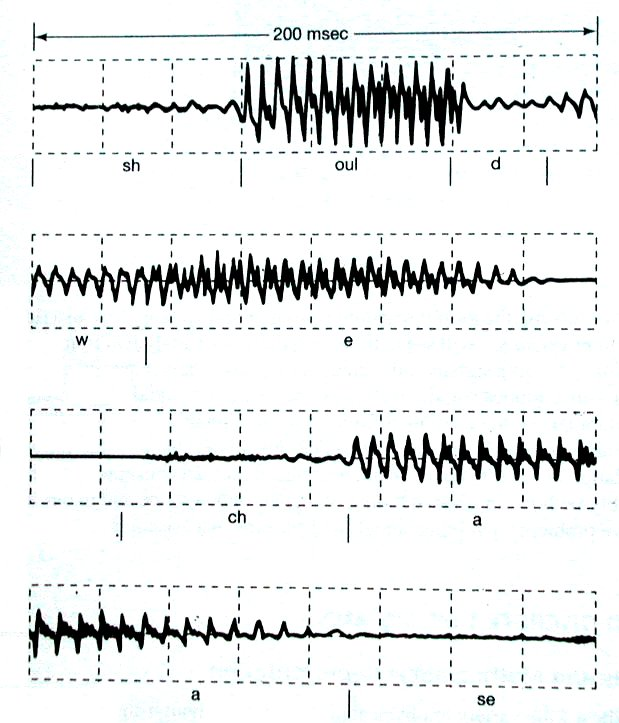
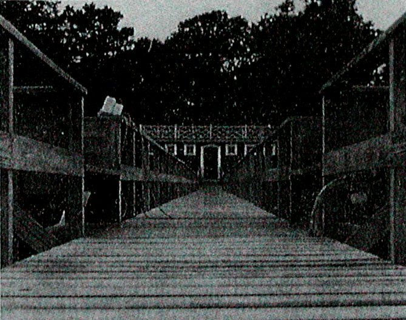
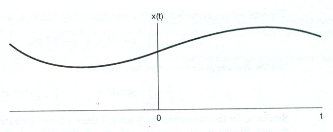
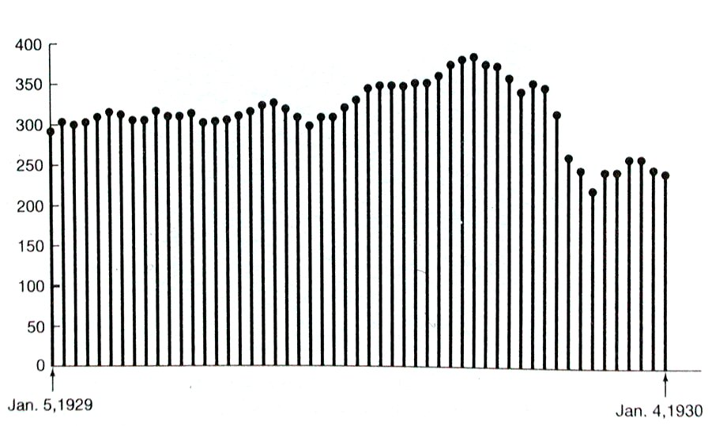
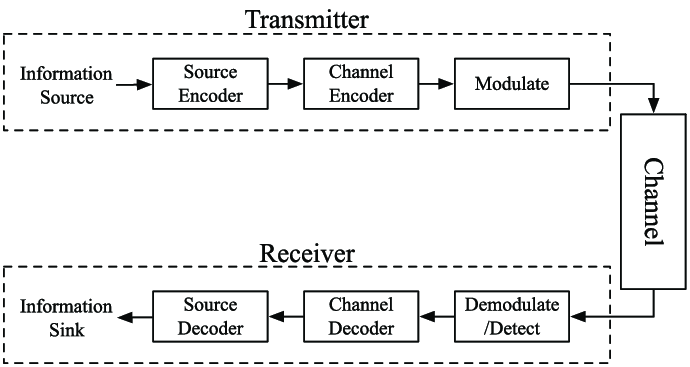
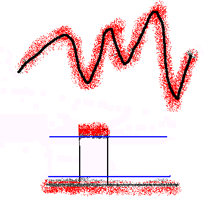
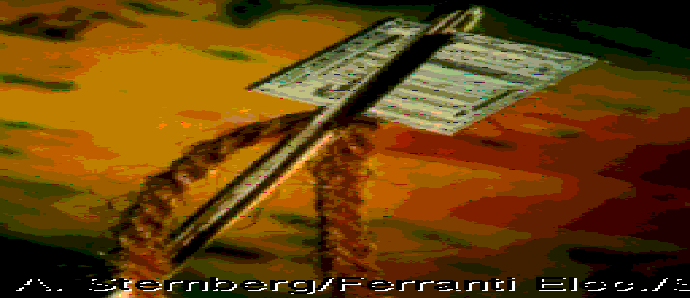
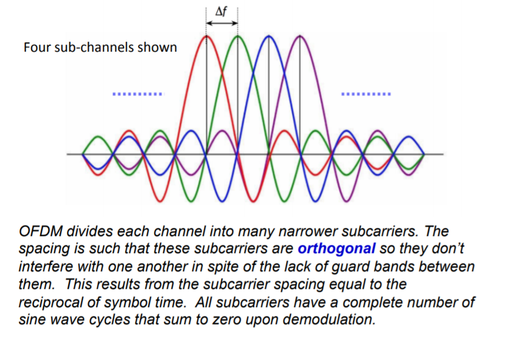
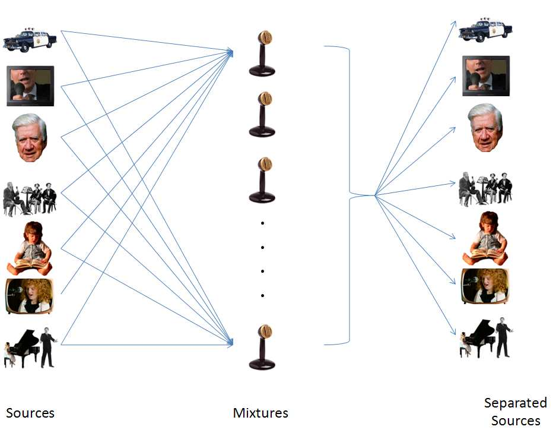

## 0. 学习目标

学完本章后，你应该能够：

1. 用自己的话解释什么是信号（signal）。
2. 区分一维信号、二维信号，并能理解视频信号可以看成更高维信号。
3. 区分连续时间信号（continuous-time signal）和离散时间信号（discrete-time signal）。
4. 区分模拟信号（analog signal）和数字信号（digital signal）。
5. 理解量化（quantization）、截断（truncation）、舍入（rounding）和有限字长效应（finite wordlength effects）的基本含义。
6. 说明信号处理（signal processing）通常可以看成一个“系统”：输入信号进入系统，输出响应信号。
7. 说明 DSP（Digital Signal Processing，数字信号处理）和 ASP（Analog Signal Processing，模拟信号处理）的区别。
8. 画出“用数字系统处理模拟信号”的基本流程。
9. 说出 DSP 的主要优点，以及为什么现实中仍然需要模拟处理。
10. 了解 DSP 的典型应用：通信、图像处理、语音处理、北斗/GPS、雷达、OFDM 等。

---

## 1. 概述

这一章不是一上来教复杂公式，而是在回答三个最基础的问题：

1. **什么是信号？**  
   信号就是“带着信息的量”。例如一段语音、一张图片、一个雷达回波、电压随时间变化的波形，都可以叫信号。

2. **什么是信号处理？**  
   信号处理就是对信号做某种操作，让我们能：
   - 提取有用信息，例如从语音中提取说话内容；
   - 改变信号以满足目的，例如滤除噪声、增强边缘、压缩数据。

3. **为什么要 DSP？**  
   现实中的很多信号本来是模拟的，比如声音、光、电磁波。但数字计算机、芯片和软件更擅长处理二进制数据。因此常见做法是：
   
   **模拟信号 → 转成数字信号 → 用数字处理器处理 → 必要时再转回模拟信号。**

初学者最容易卡住的地方有三个：

- 把“离散时间信号”和“数字信号”完全混为一谈；
- 不理解“量化”为什么会带来误差；
- 只看到 DSP 的优点，却忘了很多真实世界信号仍然需要模拟前端处理。

本章的作用是给后续 DSP 学习建立语言基础。后面学采样、DFT、滤波器、频谱分析时，都会反复用到这里的概念。

---

## 2. 基本概念

### 2.1 信号（Signal）

**一句话理解：**  
信号就是用数学函数表示的、携带信息的对象。

**正式定义：**  
PPT 中给出的含义是：信号是一个或多个自变量的函数的数学表示（the mathematical representation functions of one or more independent variables），它可以由自然方式或技术方式产生，并携带信息。

**直观例子：**

- 语音信号：麦克风记录到的声音随时间变化，可以写成 $x(t)$。
- 图像信号：一张图片中每个位置的亮度或颜色，可以写成 $x(m,n)$ 或 $I(x,y)$。
- 雷达信号：发射波遇到目标后反射回来，回波中包含目标距离和速度信息。

**容易混淆的点：**

- 信号不一定是“声音”。图像、电压、电流、电磁波、传感器数据都可以是信号。
- 信号不一定只有一个自变量。语音通常主要随时间变化，是一维信号；图像随空间位置变化，是二维信号。

---

### 2.2 一维信号、二维信号和视频信号

**一句话理解：**  
信号有几个独立变量，就可以粗略看成几维信号。

**正式定义：**

- 一维信号：通常只依赖一个自变量，例如时间 $t$。
- 二维信号：依赖两个自变量，例如图像的横向位置和纵向位置。
- 视频信号：可以看成随空间位置和时间共同变化的信号。

**直观例子：**

**图中应该看什么：**
- 这是 PPT 中的一维语音信号示例。
- 横轴通常可以理解为时间，纵轴表示声音幅度。
- 语音波形起伏越明显，表示某些时刻声音变化越强。

**图中应该看什么：**
- 这是 PPT 中的二维图像信号示例。
- 图像的每个像素位置都有亮度或颜色值。
- 图像处理本质上也是信号处理，只是自变量从“时间”变成了“空间位置”。

**补充理解：视频如何表示为函数？**  
PPT 提出讨论：Represent a video as a function。可以这样理解：

$$
I(x,y,t)
$$

其中：
- $x,y$ 表示图像中的空间位置；
- $t$ 表示时间或帧编号；
- $I(x,y,t)$ 表示在位置 $(x,y)$、时刻 $t$ 的亮度或颜色。

这个公式是补充理解，用来帮助回答 PPT 的讨论题。

**容易混淆的点：**

- “二维信号”不是说它一定画在二维平面上，而是说它有两个独立变量。
- 视频不仅仅是一堆图片，也可以看成三维或更高维信号：横向位置、纵向位置、时间，有时还包括颜色通道。

---

### 2.3 连续时间信号（Continuous-time Signal）

**一句话理解：**  
如果信号在连续的时间点上都有定义，它就是连续时间信号。

**正式定义：**  
PPT 中给出的定义是：连续时间信号具有连续的自变量（continuous independent variables）。

**典型写法：**

$$
x(t)
$$

其中：
- $t$ 表示连续时间变量；
- $x(t)$ 表示时间 $t$ 处的信号值。

**图中应该看什么：**
- 曲线在时间轴上是连续延伸的。
- 理想情况下，每一个时间点都有对应的信号值。
- 现实中的模拟电压、声音压力变化常常先被建模为连续时间信号。

**直观例子：**  
麦克风前空气压力随时间连续变化，可以抽象成 $x(t)$。

**容易混淆的点：**

- “连续时间”说的是自变量连续，不是说幅度一定连续。
- 写 $x(t)$ 时，通常表示连续时间信号；写 $x[n]$ 时，通常表示离散时间信号。

---

### 2.4 离散时间信号（Discrete-time Signal）

**一句话理解：**  
如果信号只在一个个分开的时间点上有值，它就是离散时间信号。

**正式定义：**  
PPT 中给出的定义是：离散时间信号具有离散的自变量（discrete independent variables）。

**典型写法：**

$$
x[n]
$$

其中：
- $n$ 是整数序号，例如 $n=0,1,2,3,\dots$；
- $x[n]$ 表示第 $n$ 个采样点的信号值。

**图中应该看什么：**
- 信号只在离散位置上出现，常用竖线或点表示。
- 相邻样本之间没有直接给出信号值。
- 它适合用计算机数组存储和处理。

**直观例子：**  
每隔 $0.001$ 秒记录一次温度，得到一串数字：

$$
x[0],x[1],x[2],\dots
$$

这就是离散时间信号。

**容易混淆的点：**

- 离散时间信号的幅度可以仍然是任意实数；它不一定已经被量化成有限个数字等级。
- 数字信号通常既离散时间，又离散幅度。

---

### 2.5 模拟信号（Analog Signal）与数字信号（Digital Signal）

**一句话理解：**  
模拟信号通常时间和幅度都连续；数字信号通常时间离散、幅度也被量化成离散值。

**PPT 中的定义整理：**

| 类型 | 时间/自变量 | 幅度 | 常见写法 |
|---|---|---|---|
| 连续时间信号 | 连续 | 不一定离散 | $x(t)$ |
| 离散时间信号 | 离散 | 可以是实数 | $x[n]$ |
| 模拟信号 | 连续时间 | 连续幅度 | 常用 $x(t)$ |
| 数字信号 | 离散时间 | 离散幅度，即量化后的值 | 常用 $x[n]$ 或二进制表示 |

PPT 还说明：在无限字长（Infinite Wordlength）的理想情况下，可以把数字信号看作与离散时间信号相同。这句话要小心理解。

**补充理解：用"秤"的比喻理解无限字长 vs 有限字长**

想象你有一台电子秤：
- **无限字长**：秤的显示屏有无限多位小数，3.78kg 就显示 3.78，没有任何舍入——此时你记录的数字和真实重量完全一致。这类似于理论推导中我们假设 $x[n]$ 可以是任意实数。
- **有限字长（现实）**：秤只能显示两位小数。3.786kg 要么显示 3.78，要么显示 3.79——记录值和真实值之间总有微小差距。这就是量化误差的来源。

在理论推导中，我们经常先假设 $x[n]$ 可以取任意实数（无限字长假设），这样计算方便；但真实计算机只能用有限位二进制数表示幅度（比如 16 位），所以会有有限字长误差。先学理论再学实现，是 DSP 学习的标准路径。

**容易混淆的点：**

- “离散时间”只说明横轴是离散的。
- “数字”还强调幅度被量化并用有限位数表示。
- 在很多 DSP 理论课中，为了简化分析，会暂时忽略有限字长影响，把离散时间信号当作数字信号来处理。

---

### 2.6 量化（Quantization）、截断（Truncation）与舍入（Rounding）

**一句话理解：**  
量化就是把连续幅度的实数值，压到有限个可表示的数字等级上。

**PPT 中的内容整理：**

PPT 提出问题：How can we quantize the values of signal? 即如何量化信号幅度的实数值。PPT 中举了量化步长为 $1$ 和 $0.01$ 的情况，并比较了截断和舍入。

**PPT 中的完整定义（两张幻灯片分别举例）：**

PPT 首先以量化步长 **1** 为例，用截断和舍入处理小数：
- 例如 3.78 → 截断得 3，舍入得 4

然后 PPT 又以量化步长 **0.01** 为例：
- 此时能表示到小数点后两位
- 例如 3.786 → 截断得 3.78，舍入得 3.79

**补充理解：两步对比教会我们什么？**
量化步长大（=1）→ 只能表示整数，精度低但数据量小
量化步长小（=0.01）→ 能表示两位小数，精度高但需要更多存储位

这是工程中的经典权衡：精度 vs 存储/传输代价。

**截断：**  
直接舍掉后面的部分。例如量化到整数时，$3.78$ 截断后可能变成 $3$。

**舍入：**  
选择最近的量化等级。例如量化到整数时，$3.78$ 舍入后变成 $4$。

**直观例子：**

| 原始数值 | 量化步长 | 截断结果 | 舍入结果 |
|---:|---:|---:|---:|
| 3.78 | 1 | 3 | 4 |
| 3.78 | 0.01 | 3.78 | 3.78 |
| 3.786 | 0.01 | 3.78 | 3.79 |

**容易混淆的点：**

- 量化步长越小，表示越精细，但需要更多位数存储。
- 截断和舍入都会带来误差，只是误差特点不同。
- PPT 中提到有限字长效应（Finite Wordlength Effects），意思是实际数字系统的位数有限，会导致表示误差和计算误差。

---

### 2.7 信号处理（Signal Processing）

**一句话理解：**  
信号处理就是让信号通过一个系统，从输入变成我们想要的输出。

**正式定义整理：**  
PPT 中说明信号处理的目的包括：

- 提取有用信息（to extract useful information）；
- 为了期望目的改变信号（to change signals for desired purpose）；
- 通常作为一个系统工作（normally work as a system）。

**系统观点：**

$$
\text{输入信号} \rightarrow \text{系统} \rightarrow \text{输出信号}
$$

PPT 中把输入信号称为 Exciting/Input signal，把输出信号称为 Response/Output signal。

**直观例子：**

- 通信系统：输入是语音、文字、音频、视频；中间可能变成电压、电流或电磁波；输出是接收端恢复出的信号。
- 图像边缘检测：输入是原始图像，输出是边缘图（edge map）。

**图中应该看什么：**
- 左边是要传输的输入信息，例如 speech、text、audio、video。
- 中间信号可能变成电压、电流、电磁波等形式。
- 右边是接收端得到的输出信号。
- 这说明信号处理不只是“算公式”，还服务于真实通信过程。

**容易混淆的点：**

- 系统不一定是实体机器，也可以是算法。
- 输出信号不一定和输入信号形式完全相同，例如图像边缘检测的输出是边缘图，而不是原图。

---

### 2.8 DSP 与 ASP

**一句话理解：**  
DSP 是用数字形式处理信号，ASP 是用模拟形式处理信号。

**PPT 中的定义：**

- DSP（Digital Signal Processing）：Processing signals in digital form，即以数字形式处理信号。
- ASP（Analog Signal Processing）：Processing signals in analog form，即以模拟形式处理信号。

**补充理解：常见 DSP 流程**

PPT 说明 DSP 通常用于对模拟信号进行数字处理。基本流程可以理解为：

$$
\text{模拟信号}
\rightarrow \text{采样保持 S/H}
\rightarrow \text{A/D 转换}
\rightarrow \text{数字处理器}
\rightarrow \text{D/A 转换}
\rightarrow \text{模拟输出}
$$

其中：
- S/H 是 Sample-and-Hold，采样保持；
- A/D 是 Analog-to-Digital Converter，模数转换器；
- D/A 是 Digital-to-Analog Converter，数模转换器；
- 数字处理器可以由硬件 VLSI 或软件实现。

**这个流程在解决什么问题：**  
现实世界给我们的通常是模拟信号，但计算机只能处理数字数据。因此必须先把模拟信号变成数字形式，处理完后如果要驱动扬声器、天线等模拟设备，可能还要再变回模拟信号。

**容易混淆的点：**

- DSP 不等于“信号本来就是数字的”。很多 DSP 系统处理的是先由模拟信号转换来的数字信号。
- A/D、D/A 不是可有可无的细节，它们决定数字系统能否和真实世界连接。

---

## 3. 核心公式与推导

本章以概念为主，PPT 没有给出复杂数学公式。下面整理的是为了帮助自学而需要掌握的基础表示方式，其中属于补充理解的部分会明确标注。

### 3.1 连续时间信号表示

$$
x(t)
$$

其中：
- $x$ 表示信号名称；
- $t$ 表示连续时间变量；
- $x(t)$ 表示时间 $t$ 处的信号值。

**这个公式在干什么：**  
它用函数形式描述一个随连续时间变化的信号。

**怎么用：**
1. 如果信号在每个时间点都有定义，优先用 $x(t)$ 表示。
2. 分析模拟声音、电压、电流时，常先用 $x(t)$ 建模。

**常见错误：**
- 不要把 $t$ 写成只取整数的序号。
- 不要把 $x(t)$ 和 $x[n]$ 混用。

---

### 3.2 离散时间信号表示

$$
x[n]
$$

其中：
- $x$ 表示信号名称；
- $n$ 是整数序号；
- $x[n]$ 表示第 $n$ 个样本值。

**这个公式在干什么：**  
它表示只在离散点上取值的一串信号样本。

**怎么用：**
1. 如果信号由一串样本构成，用 $x[n]$。
2. 在程序里，$x[n]$ 通常对应数组中的第 $n$ 个元素。

**常见错误：**
- $n$ 通常是整数，不是连续时间。
- $x[n]$ 的幅度不一定是整数，它可以是实数；只有经过量化后才是离散幅度。

---

### 3.3 视频信号的函数表示（补充理解）

$$
I(x,y,t)
$$

其中：
- $x,y$ 表示图像平面上的位置；
- $t$ 表示时间或帧编号；
- $I(x,y,t)$ 表示该位置、该时刻的亮度或颜色。

**这个公式在干什么：**  
它把视频看成“随位置和时间变化的信号”。

**怎么用：**
1. 固定 $t$，得到一帧图像 $I(x,y,t_0)$。
2. 固定 $(x,y)$，观察某个像素随时间的变化。

**常见错误：**
- 不要把视频只理解成一维时间信号；它还包含空间维度。
- 如果考虑 RGB 彩色图像，还可能多一个颜色通道变量。

---

### 3.4 量化误差的简单表达（补充理解）

$$
e = x - Q(x)
$$

其中：
- $x$ 表示原始连续幅度值；
- $Q(x)$ 表示量化后的值；
- $e$ 表示量化误差。

**这个公式在干什么：**  
它描述量化前后的差异。

**怎么用：**
1. 先确定量化步长，例如 $1$ 或 $0.01$。
2. 选择量化方式，例如截断或舍入。
3. 得到量化值 $Q(x)$。
4. 用 $e=x-Q(x)$ 计算误差。

**常见错误：**
- 量化误差不是噪声的全部来源，只是数字化过程中的一种误差。
- 截断和舍入得到的 $Q(x)$ 可能不同，所以误差也不同。

---

### 3.5 系统的输入输出表示（补充理解）

$$
y = T\{x\}
$$

其中：
- $x$ 表示输入信号；
- $T\{\cdot\}$ 表示系统或处理过程；
- $y$ 表示输出信号。

**这个公式在干什么：**  
它把“信号处理”抽象成一个系统对输入信号的作用。

**怎么用：**
1. 找到输入是什么。
2. 找到系统做了什么处理。
3. 找到输出是什么。

**常见错误：**
- 系统可以是硬件，也可以是软件算法。
- 输出不一定只是输入的放大版，也可能是完全不同形式的结果，例如边缘图。

---

## 4. 图示说明

> 本节把本章涉及的所有图片集中展示，方便你一次性浏览建立直觉。部分图片在第 2 节已经出现，这里重新放一遍是为了让你不用来回翻页；每张图的解释也比前面的更精炼。

### 4.1 一维语音信号

**图中应该看什么：**
- 语音可以看成随时间变化的一维信号。
- 波形的起伏反映声音压力或电信号幅度的变化。
- 后续语音处理会围绕去噪、识别、分离、压缩等任务展开。

### 4.2 连续时间与离散时间

**图中应该看什么：**
- 连续时间信号在横轴上连续变化。
- 理论上任意时刻都可以取值。

**图中应该看什么：**
- 离散时间信号只在若干离散时刻有样本值。
- 这类信号更适合计算机存储和处理。

### 4.3 DSP 的抗噪声优势

**图中应该看什么：**
- PPT 用该图说明 DSP 的一个优点：抗噪声能力较强。
- 数字信号常以二进制状态表示，只要噪声没有大到把 0 判成 1 或把 1 判成 0，就可能恢复原来的信息。
- 这不是说数字系统没有噪声，而是说数字表示更容易做判决、恢复和纠错。

### 4.4 VLSI 与数字处理器

**图中应该看什么：**
- VLSI 是 Very Large Scale Integrated circuit，超大规模集成电路。
- DSP 可以通过专用芯片、通用处理器或软件算法实现。
- VLSI 使得复杂数字处理可以集成到小型设备中。

### 4.5 OFDM 无线通信应用

**图中应该看什么：**
- PPT 提到 OFDM 是 4G、5G、Wi-Fi 中的关键技术之一。
- OFDM 全称是 Orthogonal Frequency-Division Multiplexing，中文常译为正交频分复用。
- 这里不要求掌握 OFDM 原理，只要知道它是 DSP 在无线通信中的重要应用。

### 4.6 Cocktail Party Problem 鸡尾酒会问题

**图中应该看什么：**
- PPT 用鸡尾酒会问题说明语音处理应用。
- 直观任务是：在多人同时说话的混合声音中，分离或增强某个说话人的声音。
- 这类问题体现了 DSP 对真实复杂信号的处理能力。

---

## 5. DSP 的优势

PPT 在 1.3.2 中列出了为什么使用 DSP 的多个原因。

| 优势 | 模拟系统中的情况 | 数字系统中的情况 | 初学者要记住什么 |
|---|---|---|---|
| 可编程性 Programmability | 修改硬件设计 | 修改软件 | 数字系统更容易升级和改变功能 |
| 精度 Precision | 电阻可能有 5% 容差，电容可能 20% 或更差 | 由 ADC 位数、CPU 字长和算法决定 | 数字精度更可控，但不是无限精确 |
| 稳定性 Stability | 电阻、电容、运放特性会随温度、湿度变化 | 在保证工作范围内变化较小 | 数字系统更不容易受环境漂移影响 |
| 抗噪声 Anti-noise | 噪声会连续叠加在信号上 | 二进制判决和纠错更方便 | 数字系统有较强抗干扰能力 |
| 可重复性 Repeatability | 不同模拟电路可能存在器件差异 | 同样程序通常得到一致结果 | 数字处理结果更容易复现 |
| VLSI | 复杂模拟系统集成难度较高 | 可用超大规模集成电路实现复杂处理 | DSP 适合芯片化和小型化 |
| 纠错编码 Error Correcting Codes | 模拟信号纠错较困难 | 可加入冗余比特检测错误 | 数字通信可设计纠错机制 |
| 传输与存储 Data Transmission and Storage | 长距离传输和复制可能损伤质量 | 数字文本、音频、视频更容易高质量存储和传输 | CD、DVD、互联网都体现数字媒介优势 |

**重点提醒：**  
“数字系统更好”不是绝对命题。它在可编程性、精度控制、稳定性、抗噪声、存储传输方面有明显优势，但真实世界入口和出口往往还是模拟的。

---

## 6. 模拟处理的必要性

PPT 明确指出：We still need analog processing。原因主要有三个。

### 6.1 实时处理（Real-Time Processing）

**PPT 内容整理：**

- 模拟系统：除了电路本身引入的延迟，处理是实时的。
- 数字系统：实时性由处理器速度决定。

**补充理解：**  
数字系统要经历采样、A/D 转换、计算、D/A 转换等步骤，这些步骤都可能带来延迟。如果处理器不够快，就无法满足实时要求。

### 6.2 处理很高频率的信号

**PPT 内容整理：**

- 模拟系统可以处理微波、毫米波，甚至光波信号。
- 数字系统受 Nyquist Rule（奈奎斯特规则）限制，处理速度受 S/H、A/D 和处理器速度限制。

**补充理解：**  
奈奎斯特规则的基本思想是：要数字化一个频率很高的信号，采样速度必须足够快。信号频率越高，对采样保持电路、模数转换器和处理器速度要求越高。

### 6.3 现实世界大多数信号是模拟的

**PPT 内容整理：**  
现实世界中的大多数信号是模拟信号。如果想用数字信号处理系统处理这些模拟信号，必须先通过混合信号处理（mixed signal processing）把它们变成数字形式。

**补充理解：**  
例如声音先通过麦克风变成模拟电压，再经过 A/D 转换变成数字样本，之后才能由 DSP 算法处理。

---

## 7. DSP 的应用

PPT 在 1.3.3 中列出了多个 DSP 应用方向。

### 7.1 北斗/GPS 与 RADAR

**一句话理解：**  
定位、导航和雷达都需要从复杂电磁信号中提取距离、速度、位置等信息。

**学习提醒：**  
本章只要求知道这些是 DSP 的重要应用，不要求掌握具体算法。

### 7.2 无线通信：OFDM

PPT 提到：OFDM（Orthogonal Frequency-Division Multiplexing，正交频分复用）是 4G、5G、Wi-Fi 等系统的关键技术之一。

**补充理解：**  
OFDM 会把高速数据分散到多个相互正交的子载波上传输。它涉及频域分析、DFT/FFT 等内容，后续学习频谱和离散傅里叶变换时会更容易理解。

### 7.3 图像处理

PPT 给出的图像处理应用包括：

- 边缘检测：从原图得到 Edge Map；
- Nonnegative Blind Source Separation：从多个混合观测图像中恢复源图像；
- Image Deblurring：图像去模糊；
- Image Inpainting：图像修复。

**补充理解：**  
这些任务本质上都是从图像信号中提取、恢复或增强信息。

### 7.4 语音处理

PPT 提到 Cocktail Party Problem。它可以理解为：在嘈杂环境中或多人同时说话时，如何分离、增强或识别目标语音。

---

## 8. 重点与难点

| 知识点 | 要记住什么 | 常见错误 |
|---|---|---|
| 信号 | 信号是携带信息的函数表示 | 以为只有声音才是信号 |
| 一维信号 | 依赖一个自变量，例如语音随时间变化 | 忽略信号可以是图像、视频等多维对象 |
| 二维信号 | 图像可看成依赖两个空间变量的信号 | 把图像处理和信号处理割裂开 |
| 连续时间信号 | 自变量连续，常写 $x(t)$ | 把 $t$ 当成整数序号 |
| 离散时间信号 | 自变量离散，常写 $x[n]$ | 以为 $x[n]$ 的幅度一定是整数 |
| 模拟信号 | 连续时间、连续幅度 | 只看时间连续，忽略幅度连续 |
| 数字信号 | 离散时间、离散幅度，通常二进制表示 | 和离散时间信号完全混同 |
| 量化 | 把连续幅度压到有限等级 | 以为量化没有误差 |
| 截断与舍入 | 两种常见量化方式 | 以为它们结果总相同 |
| DSP | 以数字形式处理信号 | 以为 DSP 不需要模拟前端 |
| ASP | 以模拟形式处理信号 | 以为模拟处理已经不重要 |
| Nyquist Rule | 数字化高频信号需要足够快的采样和处理速度 | 以为任何高频信号都能轻松数字化 |

---

## 9. 例题

### 例题 1：判断信号类型

**题目：**  
判断下列信号更适合看成连续时间信号还是离散时间信号：

1. 麦克风前空气压力随时间的变化；
2. 每隔 1 秒记录一次室温得到的数据序列；
3. 计算机中存储的一段音频样本。

**解题思路：**  
先看自变量是不是连续。如果每个时间点都可定义，偏连续时间；如果只在采样点上有值，偏离散时间。

**解答：**

1. 空气压力随时间连续变化，适合看成连续时间信号 $x(t)$。
2. 每隔 1 秒记录一次，只在离散时刻有值，适合看成离散时间信号 $x[n]$。
3. 计算机中存储的是一串样本，适合看成离散时间信号；如果幅度也已经量化成有限位数，则也是数字信号。

**答案：**  
1 连续时间信号；2 离散时间信号；3 离散时间信号，通常也是数字信号。

**易错提醒：**  
不要因为信号来自真实世界就一定叫模拟信号。存进计算机以后，它通常已经变成数字形式。

---

### 例题 2：区分离散时间信号和数字信号

**题目：**  
一个序列写作：

$$
x[n] = 0.1n, \quad n=0,1,2,3,\dots
$$

它一定是数字信号吗？

**解题思路：**  
看 $n$ 和 $x[n]$ 分别表示什么。$n$ 是离散的，但幅度 $0.1n$ 可以是理论实数值。

**解答：**  
这个信号的自变量 $n$ 是整数，所以它是离散时间信号。但如果没有说明幅度被量化成有限个等级，也没有说明用有限位二进制表示，就不能严格说它一定是数字信号。

**答案：**  
它一定是离散时间信号，但不一定严格是数字信号。

**易错提醒：**  
离散时间强调“横轴离散”；数字信号还强调“幅度离散/量化”。

---

### 例题 3：量化、截断和舍入

**题目：**  
将数值 $x=5.678$ 量化到小数点后两位。分别使用截断和舍入，结果是多少？量化误差是多少？

**解题思路：**  
量化到小数点后两位，相当于量化步长为 $0.01$。截断直接舍掉第三位及以后；舍入看第三位。

**解答：**

1. 截断：

$$
Q_{\text{trunc}}(5.678)=5.67
$$

量化误差：

$$
e_{\text{trunc}}=5.678-5.67=0.008
$$

2. 舍入：第三位小数是 8，因此进位：

$$
Q_{\text{round}}(5.678)=5.68
$$

量化误差：

$$
e_{\text{round}}=5.678-5.68=-0.002
$$

**答案：**  
截断结果为 $5.67$，误差 $0.008$；舍入结果为 $5.68$，误差 $-0.002$。

**易错提醒：**  
误差 $e=x-Q(x)$ 可能为正，也可能为负，取决于量化后的值比原值大还是小。

---

### 例题 4：通信系统中的输入、系统和输出

**题目：**  
在语音通话中，发送者说话，接收者听到声音。请用“输入信号—系统—输出信号”的观点描述这个过程。

**解题思路：**  
把说话内容看作输入，把通信链路和处理算法看作系统，把接收端恢复出的声音看作输出。

**解答：**

- 输入信号：发送者的语音信号；
- 系统：麦克风、编码、调制、信道传输、接收、解调、解码等整体处理过程；
- 输出信号：接收端播放出的语音。

**答案：**  
语音通话可以看成：语音输入 $\rightarrow$ 通信处理系统 $\rightarrow$ 接收语音输出。

**易错提醒：**  
中间信号可能不是声音，而可能是电压、电流或电磁波。

---

### 例题 5：为什么 DSP 仍然离不开模拟处理？

**题目：**  
既然 DSP 有可编程、稳定、抗噪声等优点，为什么现实系统仍然需要模拟处理？至少写出两个原因。

**解题思路：**  
回忆 PPT 中“We still need analog processing”的三类原因。

**解答：**

原因 1：现实世界中大多数原始信号是模拟的，例如声音、光、电磁波。要进入数字系统，必须先通过模拟前端和 A/D 转换。

原因 2：对于非常高频的信号，数字系统受采样保持电路、A/D 转换器和处理器速度限制，不一定能直接处理。

原因 3：某些模拟系统可以几乎实时处理，而数字系统的实时性取决于处理器速度和转换延迟。

**答案：**  
至少包括：现实信号多为模拟信号；高频信号数字化受 Nyquist Rule 和硬件速度限制；数字处理存在转换和计算延迟。

**易错提醒：**  
不要把“DSP 优势明显”理解成“ASP 没有价值”。

---

## 10. 自测题

### 8. 自测题

1. 什么是信号？请用一句话说明。
2. 语音信号为什么通常可看成一维信号？
3. 图像信号为什么通常可看成二维信号？
4. $x(t)$ 和 $x[n]$ 的区别是什么？
5. 离散时间信号一定是数字信号吗？为什么？
6. 什么是量化步长？量化步长变小通常有什么影响？
7. 截断和舍入有什么区别？
8. 信号处理的两个主要目的是什么？
9. DSP 相比 ASP 有哪些优点？至少写出三个。
10. 为什么现实中仍然需要模拟处理？至少写出两个原因。

### 8. 自测题答案

1. 信号是用函数形式表示的、携带信息的对象。
2. 因为语音主要随时间这一个自变量变化，所以可看成一维信号。
3. 因为图像的亮度或颜色依赖横向和纵向两个空间位置变量。
4. $x(t)$ 表示连续时间信号，$t$ 连续；$x[n]$ 表示离散时间信号，$n$ 通常是整数序号。
5. 不一定。离散时间只说明自变量离散；数字信号还要求幅度被量化为离散值并通常用有限位二进制表示。**例**：$x[n] = 0.1n$（n=0,1,2,...）是离散时间信号，因为自变量 n 是整数；但幅度 0, 0.1, 0.2, 0.3... 可以是任意实数，没有量化，所以不一定是数字信号。只有当我们用有限位二进制（比如 16 位）去存储这些值时，它才变成数字信号。
6. 量化步长是可表示幅度等级之间的间隔。步长越小，表示越精细，误差通常越小，但需要更多位数。
7. 截断是直接舍掉多余部分；舍入是选择最接近的量化等级。
8. 提取有用信息；为了期望目的改变信号。
9. 可编程性、精度更可控、稳定性更好、抗噪声能力强、可重复性好、便于 VLSI 实现、便于纠错编码、便于传输和存储。
10. 现实大多数信号是模拟的；高频信号数字化受采样和处理速度限制；数字系统存在转换和计算延迟。

---

## 11. 学习路线

建议按下面顺序学习：

1. 先读第 1 节，理解本章是在建立 DSP 的基本语言。
2. 再学第 2 节，重点分清信号、连续时间、离散时间、模拟、数字这些概念。
3. 学第 3 节时，不要死背公式，重点记住 $x(t)$ 和 $x[n]$ 的区别。
4. 看第 4 节图片，把语音、图像、通信、抗噪声这些例子和概念联系起来。
5. 学第 5、6 节时，用对比法记忆：DSP 有什么优势，ASP 为什么仍然不可替代。
6. 最后做例题和自测题。如果第 5 题和第 10 题答不好，说明“离散/数字”和“DSP/ASP”的边界还没有分清。

---

## 12. 与前后章的关系

本章是 DSP 的入口章节。后续学习通常会继续展开：

- 如何把连续时间信号采样成离散时间信号；
- 采样频率、奈奎斯特规则和混叠问题；
- 离散时间系统如何描述输入输出关系；
- 如何在频域分析信号；
- DFT/FFT 和数字滤波器如何实现实际 DSP 应用。

因此，本章最重要的不是记住很多公式，而是把几个基本对象分清楚：

$$
x(t),\quad x[n],\quad \text{analog signal},\quad \text{digital signal},\quad \text{DSP},\quad \text{ASP}
$$

如果这些概念混在一起，后面学采样、频谱和滤波器时会非常容易出错。
