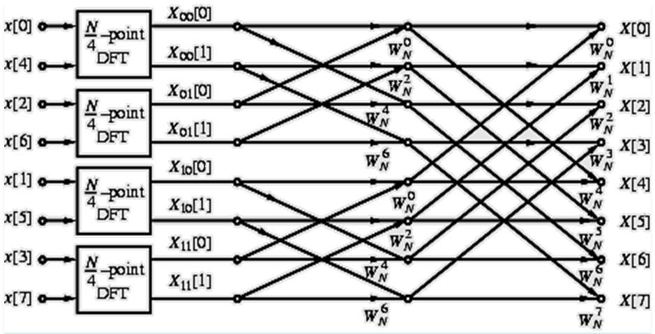
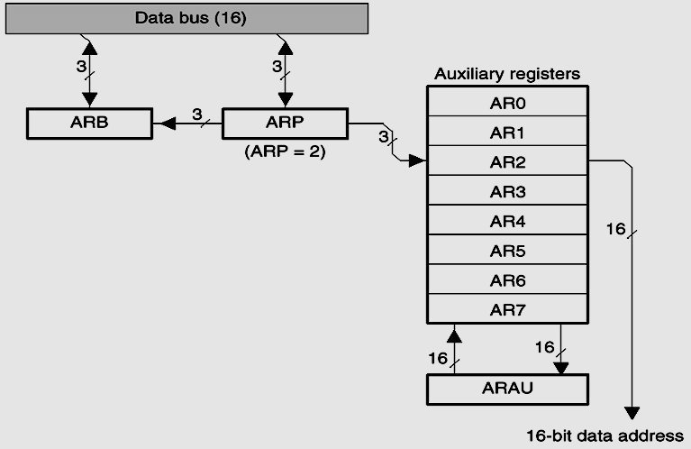
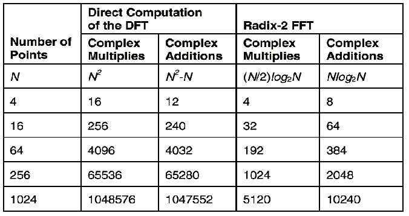
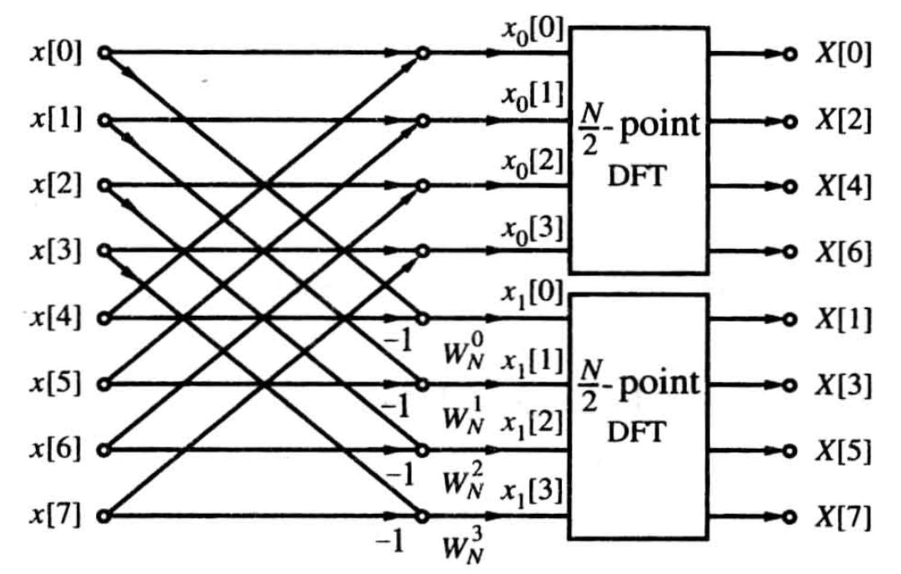

## 0. 学习目标

学完本章后，你应该能够：

- 理解为什么直接计算 DFT 太慢，以及 FFT 如何解决这个问题
- 掌握旋转因子（twiddle factor）的三大性质：对称性、周期性、可约性
- 理解按时间抽取（DIT）FFT 的分解思路，能手动画出 8 点 DIT FFT 流图
- 理解按频率抽取（DIF）FFT 的分解思路，能对比 DIT 和 DIF 的区别
- 能计算 FFT 的复数乘法和加法次数，并与直接 DFT 对比
- 理解原位计算（in-place computation）和比特反转（bit-reversal）的含义
- 知道如何用 FFT 来计算 IDFT

## 1. 概述

### 1.1 问题背景

假设你需要用计算机算一个 1024 点的 DFT。按照定义公式，直接算需要大约 1024 x 1024 = 1,048,576 次复数乘法。在 1960 年代，这个计算量足以让当时的计算机跑很久。

**FFT 要解决的问题就是：能不能算得更快？**

答案是能。FFT（Fast Fourier Transform，快速傅里叶变换）不是一个"新的变换"，它只是计算 DFT 的一种**快速算法**。FFT 能把复数乘法次数从 $N^2$ 降到约 $\frac{N}{2}\log_2 N$。当 $N = 1024$ 时，这大约是从 100 万次降到 5000 次——快了约 200 倍。

### 1.2 核心思想

FFT 的核心思想非常朴素：**分而治之**。

一个大的 N 点 DFT 不好算，那我们就把它拆成两个 N/2 点的小 DFT，再拆成四个 N/4 点的更小 DFT……一直拆到 2 点 DFT（2 点 DFT 算起来特别简单）。这就是 FFT 的"魔法"。

### 1.3 常见误区

- 不理解旋转因子 $W_N$ 为什么有那些奇怪的性质——其实这些性质就是复平面上单位圆的简单几何关系
- 流图（flow graph）看起来很乱——实际上它非常有规律，盯住一个蝶形单元看懂就全通了
- 搞混 DIT 和 DIF——记住：DIT 是输入乱序输出顺序，DIF 是输入顺序输出乱序
- 比特反转——就是把二进制序号倒过来写，不要想得太复杂

## 2. 为什么需要 FFT：直接计算 DFT 的代价

### 2.1 DFT 和 IDFT 的定义回顾

N 点序列 $x[n]$ 的 DFT 为：

$$
X[k] = \sum_{n=0}^{N-1} x[n] \cdot W_N^{kn}, \quad k = 0, 1, \dots, N-1
$$

IDFT 为：

$$
x[n] = \frac{1}{N} \sum_{k=0}^{N-1} X[k] \cdot W_N^{-kn}, \quad n = 0, 1, \dots, N-1
$$

其中旋转因子（twiddle factor）定义为：

$$
W_N = e^{-j\frac{2\pi}{N}}
$$

> **补充理解：旋转因子是什么？**
> $W_N$ 是复平面单位圆上的一个点。$W_N^k$ 表示从角度 0 开始，沿顺时针方向走 $k$ 步，每步转过 $2\pi/N$ 弧度。$W_N^k$ 的各种性质都来自"在圆上转圈"这个几何直觉。

### 2.2 直接计算的代价有多大

对于 N 点 DFT，每算一个 $X[k]$ 需要：
- N 次复数乘法（$x[n] \times W_N^{kn}$）
- N-1 次复数加法（把 N 个乘积加起来）

算全部 N 个 $X[k]$ 需要：
- **复数乘法**：$N \times N = N^2$ 次
- **复数加法**：$N \times (N-1) \approx N^2$ 次

计算复杂度是 $O(N^2)$。当 $N$ 很大时（比如 1024 或更高），这个代价难以接受。

## 3. 旋转因子 $W_N$ 的性质 —— FFT 能加速的数学基础

FFT 之所以能把 $N^2$ 降到 $N\log_2 N$，根本原因在于旋转因子 $W_N$ 有三个关键性质。这些性质让我们在分解 DFT 时可以**重用**已经算好的结果，避免重复计算。

### 3.1 对称性（Symmetry）

$$
(W_N^{nk})^* = W_N^{-nk}
$$

共轭对称性。在流图中最常用的推论是：

$$
W_N^{k + N/2} = -W_N^{k}
$$

**几何理解**：在单位圆上多转半圈（180度），等价于取相反数。这个性质让很多乘法的结果可以直接通过加负号得到，不用重新算。

### 3.2 周期性（Periodicity）

$$
W_N^{nk} = W_N^{(n+N)k} = W_N^{n(k+N)}
$$

**几何理解**：在单位圆上转够一整圈（N 步），就回到原点。所以 $W_N^N = 1$，指数上的 N 可以随便加减。

这个性质在 DIT FFT 推导后半段结果时直接使用：$X_0[k + N/2] = X_0[k]$。

### 3.3 可约性（Reduction）

$$
W_N^{nk} = W_{mN}^{mnk}, \quad W_N^{nk} = W_{N/m}^{nk/m}
$$

**最重要的推论**：

$$
W_N^{2rk} = W_{N/2}^{rk}
$$

**什么意思？** 当你把序列的索引翻倍（比如抽取偶数项后步长变了），N 点 DFT 的旋转因子可以"缩小"成 N/2 点的旋转因子。这就是为什么 N 点 DFT 能拆成两个 N/2 点 DFT。

### 3.4 额外两个实用推论

课件中还列出了两个在流图中反复出现的恒等式：

$$
W_N^{N/2} = -1, \quad W_N^0 = 1
$$

- $W_N^0 = 1$：在单位圆上一步都没走，自然是 1。流图中标 "1" 的连线就表示乘以 1（实际不需要做乘法）。
- $W_N^{N/2} = -1$：走了半圈，正好是 -1。流图中标 "-1" 的连线表示只需取反。

## 4. 按时间抽取（DIT）FFT

"DIT" 是 Decimation-In-Time 的缩写，即"在时间域上抽取"。这个名字描述了它的核心操作：**先把输入序列按奇偶索引拆开，再分别做 DFT**。

### 4.1 基本假设

输入序列 $x[n]$ 的长度为 $N = 2^\nu$（$\nu$ 是正整数，即 N 是 2 的幂）。不是 2 的幂怎么办？实际中补零凑到 2 的幂即可。

### 4.2 分解的数学推导（最重要的一步）

把 $x[n]$ 按 n 的奇偶拆成两个子序列：

$$
\begin{aligned}
x_0[r] &= x[2r] \\
x_1[r] &= x[2r + 1]
\end{aligned}
\quad r = 0, 1, \dots, \frac{N}{2} - 1
$$

把 DFT 定义式中的求和也按奇偶拆开：

$$
\begin{aligned}
X[k] &= \sum_{n=0}^{N-1} x[n] W_N^{nk} \\
     &= \underbrace{\sum_{r=0}^{N/2-1} x[2r] W_N^{2rk}}_{\text{偶数项 } n=2r} + \underbrace{\sum_{r=0}^{N/2-1} x[2r+1] W_N^{(2r+1)k}}_{\text{奇数项 } n=2r+1} \\
     &= \sum_{r=0}^{N/2-1} x_0[r] W_N^{2rk} + \sum_{r=0}^{N/2-1} x_1[r] \cdot W_N^{2rk} \cdot W_N^k \quad \text{（因为 } W_N^{(2r+1)k} = W_N^{2rk} \cdot W_N^k\text{）}\\
     &= \sum_{r=0}^{N/2-1} x_0[r] W_N^{2rk} + W_N^k \underbrace{\sum_{r=0}^{N/2-1} x_1[r] W_N^{2rk}}_{\text{提出 } W_N^k}
\end{aligned}
$$

利用可约性 $W_N^{2rk} = W_{N/2}^{rk}$：

$$
X[k] = \underbrace{\sum_{r=0}^{N/2-1} x_0[r] W_{N/2}^{rk}}_{X_0[k]} + W_N^k \cdot \underbrace{\sum_{r=0}^{N/2-1} x_1[r] W_{N/2}^{rk}}_{X_1[k]}
$$

你会发现 $X_0[k]$ 恰好就是子序列 $x_0[r]$ 的 N/2 点 DFT，$X_1[k]$ 是 $x_1[r]$ 的 N/2 点 DFT。

于是我们得到一个极其简洁的关系式：

$$
\boxed{X[k] = X_0[k] + W_N^k \cdot X_1[k]}, \quad k = 0, 1, \dots, \frac{N}{2} - 1
$$

**但是**——$X_0[k]$ 和 $X_1[k]$ 都是 N/2 点 DFT，它们只对 $k = 0, 1, \dots, N/2-1$ 有定义。所以上面的公式只给出了 X[k] 的前一半！后一半怎么办？

### 4.3 后一半结果的推导

对于 $k = N/2, N/2+1, \dots, N-1$，我们需要另外想办法。

利用 $X_0[k]$ 和 $X_1[k]$ 的**周期性**（它们是 N/2 点 DFT，所以每 N/2 个点循环）：

$$
X_0\left[k + \frac{N}{2}\right] = X_0[k], \quad X_1\left[k + \frac{N}{2}\right] = X_1[k]
$$

再结合旋转因子的性质 $W_N^{k + N/2} = -W_N^k$：

$$
\begin{aligned}
X\left[k + \frac{N}{2}\right] &= X_0\left[k + \frac{N}{2}\right] + W_N^{k+N/2} \cdot X_1\left[k + \frac{N}{2}\right] \\
&= X_0[k] + (-W_N^k) \cdot X_1[k] \\
&= X_0[k] - W_N^k \cdot X_1[k]
\end{aligned}
$$

于是我们得到 DIT FFT 的**完整蝶形公式**：

$$
\boxed{
\begin{aligned}
X[k] &= X_0[k] + W_N^k \cdot X_1[k] \\
X\left[k + \frac{N}{2}\right] &= X_0[k] - W_N^k \cdot X_1[k]
\end{aligned}
\quad k = 0, 1, \dots, \frac{N}{2} - 1
}
$$

> **这个人话版的理解：**
> 原来直接算 N 点 DFT 需要 $N^2$ 次乘法。现在把一个 N 点 DFT 拆成两个 N/2 点 DFT（各需 $(N/2)^2$ 次乘法），再加上 N/2 次乘 $W_N^k$ 的操作。总乘法数从 $N^2$ 降到 $2 \times (N/2)^2 + N/2 \approx N^2/2 + N/2$，大致减半。

### 4.4 蝶形运算（Butterfly Computation）

上面的公式在流图中用一个"蝶形"来表示，因为它形状像蝴蝶：

```
   X_0[k] ────┬──── (+) ──── X[k]
               │
               │    W_N^k
               │
   X_1[k] ────┼──── (X) ────┬──── (+) ──── X[k + N/2]
               │             │
               └─── (-1) ────┘
```

**基本蝶形单元**有两个输入（$X_0[k]$ 和 $X_1[k]$），两个输出（$X[k]$ 和 $X[k+N/2]$）。
- 上支路：$X[k] = X_0[k] + W_N^k \cdot X_1[k]$
- 下支路：$X[k+N/2] = X_0[k] - W_N^k \cdot X_1[k]$

一个蝶形包含：1 次复数乘法（$W_N^k \times X_1[k]$）、1 次复数加法和 1 次复数减法。

### 4.5 持续分解

刚才我们把 N 点 DFT 变成了两个 N/2 点 DFT。但每个 N/2 点 DFT 仍然可以继续分解——把 $x_0[r]$ 再按奇偶拆成 $x_{00}$ 和 $x_{01}$，$x_1[r]$ 拆成 $x_{10}$ 和 $x_{11}$，得到四个 N/4 点 DFT。

一直拆下去，拆到什么时候停？拆到只剩 2 点 DFT。

**2 点 DFT 有多简单？** 直接代公式：

$$
\begin{aligned}
X[0] &= x[0] + x[1] \\
X[1] &= x[0] - x[1]
\end{aligned}
$$

不需要乘法！$W_2^0 = 1$，$W_2^1 = -1$。

### 4.6 8 点 DIT FFT 的完整分解过程

以 N = 8 为例：

**第一层**：8 点序列 → 两个 4 点序列
```
原始序列: x[0] x[1] x[2] x[3] x[4] x[5] x[6] x[7]
偶数项:   x[0] x[2] x[4] x[6]  (x₀[r])
奇数项:   x[1] x[3] x[5] x[7]  (x₁[r])
```

**第二层**：每个 4 点序列 → 两个 2 点序列
```
x₀[r] 的偶数项: x[0] x[4]  (x₀₀[n])
x₀[r] 的奇数项: x[2] x[6]  (x₀₁[n])
x₁[r] 的偶数项: x[1] x[5]  (x₁₀[n])
x₁[r] 的奇数项: x[3] x[7]  (x₁₁[n])
```

**第三层**：2 点 DFT 直接算出结果。

经过逐层合并，最底层是四个 2 点 DFT，然后合成两个 4 点 DFT，最后合成一个 8 点 DFT。

### 4.7 DIT FFT 流图



**图中应该看什么：**
- 这是一张 8 点 DIT FFT 的完整流图
- 左边是输入 $x[0], x[4], x[2], x[6], x[1], x[5], x[3], x[7]$（**比特反转顺序**）
- 右边是输出 $X[0], X[1], X[2], \dots, X[7]$（**正常顺序**）
- 中间有三列蝶形（因为 $\log_2 8 = 3$ 级）
- 每个蝶形标有对应的旋转因子 $W_N^k$
- 第 1 级蝶形的"跨距"为 1，第 2 级为 2，第 3 级为 4


**图中应该看什么：**
- 这是另一种展示方式，更清晰地标出了每个蝶形的结构
- 注意 $W_N^0 = 1$ 的支路（不需要乘法）在流图中通常简化为直接连线
- 注意 $W_8^2 = W_4^1 = -j$（因为 $W_8^2 = e^{-j2\pi \cdot 2/8} = e^{-j\pi/2} = -j$）

### 4.8 计算量分析

对于 $N = 2^\nu$ 点的 DIT FFT：

- 共有 $\nu = \log_2 N$ 级（stage）
- 每级有 $N/2$ 个蝶形
- 每个蝶形需要 1 次复数乘法和 2 次复数加法
- **总复数乘法**：$\frac{N}{2} \cdot \log_2 N$
- **总复数加法**：$N \cdot \log_2 N$

对比直接 DFT：

| 方法 | 复数乘法 | 复数加法 |
|------|---------|---------|
| 直接 DFT | $N^2$ | $N(N-1) \approx N^2$ |
| DIT FFT | $\frac{N}{2}\log_2 N$ | $N\log_2 N$ |

以 N = 1024 为例：
- 直接 DFT：约 1,048,576 次乘法
- FFT：约 5,120 次乘法
- **加速比**：约 205 倍

> **课件备注**：上面的计算量统计中，课件把所有乘法（包括乘以 $W_N^0=1$ 和 $W_N^{N/2}=-1$）都算作复数乘法。实际实现中可以进一步利用对称性减少乘 $W_N^{k+N/2} = -W_N^k$ 这类运算（把一次乘法变成一次取反加一次已算好的乘法），所以实际运行比理论值更快一些。

### 4.9 原位计算（In-place Computation）

FFT 的一个巨大工程优势：**输出可以覆盖存储输入的内存**。

每一级蝶形运算后，输出数据可以存回输入数据原来的内存位置。因为一旦某个蝶形完成了，它的输入数据就不再需要了。

这被称为"原位计算"（in-place computation），意味着 FFT 的额外内存开销几乎为零——只需要存输入序列那么大的空间就够了。

### 4.10 比特反转（Bit-reversed Order）

仔细看 DIT FFT 流图的输入顺序：$x[0], x[4], x[2], x[6], x[1], x[5], x[3], x[7]$。这个顺序是怎么来的？

**规律**：把正常顺序的索引用二进制表示，然后把二进制位倒过来写。

以 N = 8（3 位二进制）为例：

| 正常索引 n | 二进制 | 比特反转 | 反转后索引 |
|:---------:|:------:|:-------:|:---------:|
| 0 | 000 | 000 | 0 |
| 1 | 001 | 100 | 4 |
| 2 | 010 | 010 | 2 |
| 3 | 011 | 110 | 6 |
| 4 | 100 | 001 | 1 |
| 5 | 101 | 101 | 5 |
| 6 | 110 | 011 | 3 |
| 7 | 111 | 111 | 7 |

所以 DIT FFT 的输入序列需要先按比特反转重排，输出才是正常顺序。一句话记住：**DIT FFT = 输入乱序，输出顺序**。



**图中应该看什么：**
- 这张图展示了 DSP 芯片中硬件级的比特反转寻址
- 正常地址总线上是二进制地址，经过比特反转逻辑后产生反转的地址
- 现代 DSP 芯片在硬件层面支持比特反转寻址，让 FFT 的输入重排几乎是零开销
- 这对理解"为什么实际 FFT 可以这么快"很重要



**图中应该看什么：**
- 展示了从 8 点 → 两个 4 点 → 四个 2 点的分层分解过程
- 可以看出蝶形计算的跨距（span）逐级翻倍：第一级隔 1，第二级隔 2，第三级隔 4
- 这是一个"从细到粗"的过程

## 5. 按频率抽取（DIF）FFT

"DIF" 是 Decimation-In-Frequency 的缩写，即"在频率域上抽取"。与 DIT 把输入按奇偶拆开不同，DIF 的做法是**把输入按前后两半分段**，输出的奇偶序号分别来自不同的组合。

### 5.1 分解思路

把 N 点 DFT 求和分成前一半（$n=0$ 到 $N/2-1$）和后一半（$n=N/2$ 到 $N-1$）：

$$
\begin{aligned}
X[k] &= \sum_{n=0}^{N-1} x[n] W_N^{nk} \\
     &= \sum_{n=0}^{N/2-1} x[n] W_N^{nk} + \sum_{n=N/2}^{N-1} x[n] W_N^{nk} \\
     &= \sum_{n=0}^{N/2-1} x[n] W_N^{nk} + \sum_{n=0}^{N/2-1} x\left[n + \frac{N}{2}\right] W_N^{(n+N/2)k}
\end{aligned}
$$

注意到 $W_N^{(n+N/2)k} = W_N^{nk} \cdot W_N^{Nk/2} = W_N^{nk} \cdot (-1)^k$：

$$
X[k] = \sum_{n=0}^{N/2-1} \left[ x[n] + (-1)^k \cdot x\left[n + \frac{N}{2}\right] \right] W_N^{nk}
$$

现在分别考虑 k 为偶数和 k 为奇数：

**当 k 为偶数（$k = 2r$）**，$(-1)^k = 1$：

$$
X[2r] = \sum_{n=0}^{N/2-1} \underbrace{\left[ x[n] + x\left[n + \frac{N}{2}\right] \right]}_{g[n]} \cdot W_N^{2rn} = \sum_{n=0}^{N/2-1} g[n] \cdot W_{N/2}^{rn}
$$

**这就是 $g[n]$ 的 N/2 点 DFT！**

**当 k 为奇数（$k = 2r+1$）**，$(-1)^k = -1$：

$$
X[2r+1] = \sum_{n=0}^{N/2-1} \underbrace{\left[ x[n] - x\left[n + \frac{N}{2}\right] \right] \cdot W_N^n}_{h[n]} \cdot W_N^{2rn} = \sum_{n=0}^{N/2-1} h[n] \cdot W_{N/2}^{rn}
$$

**这就是 $h[n] \cdot W_N^n$ 的 N/2 点 DFT！**

### 5.2 DIF FFT 蝶形公式

$$
\boxed{
\begin{aligned}
X[2r] &= \text{DFT}_{N/2}\left\{ x[n] + x\left[n + \frac{N}{2}\right] \right\} \\
X[2r+1] &= \text{DFT}_{N/2}\left\{ \left(x[n] - x\left[n + \frac{N}{2}\right]\right) \cdot W_N^n \right\}
\end{aligned}
\quad r = 0, 1, \dots, \frac{N}{2} - 1
}
$$

### 5.3 DIT 与 DIF 的关键对比

| 特性 | DIT FFT | DIF FFT |
|------|---------|---------|
| 分解方式 | 输入按奇偶拆 | 输入按前后两半拆 |
| 输入顺序 | 比特反转（乱序） | 正常顺序 |
| 输出顺序 | 正常顺序 | 比特反转（乱序） |
| 旋转因子乘法 | 在蝶形的"前面" | 在蝶形的"后面" |
| 计算量 | $\frac{N}{2}\log_2 N$ 乘, $N\log_2 N$ 加 | 完全相同 |
| 流图关系 | DIF 流图是 DIT 流图的转置 | 反之亦然 |

**记忆口诀**：DIT 先乱后顺，DIF 先顺后乱。

### 5.4 DIF FFT 流图



**图中应该看什么：**
- 左边输入是正常顺序 $x[0], x[1], \dots, x[7]$
- 右边输出是比特反转顺序 $X[0], X[4], X[2], X[6], X[1], X[5], X[3], X[7]$
- 与 DIT 相比最明显的区别：**旋转因子 $W_N^k$ 出现在蝶形的输出侧，而非输入侧**
- 蝶形结构：先加减，再乘旋转因子（与 DIT 先乘再加相反）


**图中应该看什么：**
- 同样有 $\log_2 8 = 3$ 级
- 第 1 级蝶形的跨距为 4，第 2 级为 2，第 3 级为 1（与 DIT 正好相反——从粗到细）
- 所有蝶形的旋转因子都放在输出侧

## 6. 用 FFT 计算 IDFT

IDFT 的公式和 DFT 几乎一样（只是指数上多了个负号，前面多了个 $1/N$），所以 FFT 也可以反过来用于快速计算 IDFT。

### 6.1 方法：取共轭 + FFT + 取共轭 + 除以 N

从 IDFT 定义出发：

$$
x[n] = \frac{1}{N} \sum_{k=0}^{N-1} X[k] W_N^{-nk}
$$

两边取共轭：

$$
x^*[n] = \frac{1}{N} \sum_{k=0}^{N-1} X^*[k] W_N^{nk}
$$

两边乘以 N：

$$
N \cdot x^*[n] = \sum_{k=0}^{N-1} X^*[k] W_N^{nk}
$$

**等号右边恰好就是序列 $X^*[k]$ 的 N 点 DFT！**

所以计算 IDFT 的步骤是：

1. 取 $X[k]$ 的共轭，得到 $X^*[k]$
2. 用 FFT 计算 $X^*[k]$ 的 N 点 DFT，得到 $N \cdot x^*[n]$
3. 对结果取共轭，再除以 N，得到 $x[n]$

**流程总结：$x[n] = \frac{1}{N} \cdot \left[ \text{FFT}\left(X^*[k]\right) \right]^*$**

### 6.2 IDFT 计算框图

课本给出的 IDFT 计算框图如下：

```
Re{X[k]} ──┐
            ├── N点 DFT ──┬── Re{x[n]}
Im{X[k]} ──┘             │
                          ├── Im{x[n]}
                    -1 ───┘   (乘以 -1/N 得到虚部)
```

**核心要点**：
- 把 $X[k]$ 的虚部取反（取共轭）
- 送入 FFT 模块计算
- 输出再取共轭并除以 N
- FFT 程序完全不需要修改

## 7. MATLAB 实现（概述）

课件中提到了几个 MATLAB 程序用于结构仿真和 FFT 应用：

- **`direct2.m`**, **`11_1.m`** ~ **`11_7.m`**：DSP 结构的 MATLAB 仿真验证
- **`11_10.m`**：用 FFT 做频谱分析（Spectral Analysis）
- **`11_11.m`**：用 FFT 做线性卷积（Linear Convolution）

> **补充理解**：用 FFT 做线性卷积是一个非常有用的技巧。时域卷积 = 频域相乘，所以 `conv(a, b)` 可以等效为 `ifft(fft(a) .* fft(b))`。当序列很长时，基于 FFT 的方法比直接卷积快得多。

## 8. 数的表示（Number Representation）

课件最后一页提到了"Number Representation"（数的表示），但没有展开详细内容。这通常涉及 DSP 实现中的：

- **定点数（fixed-point）vs 浮点数（floating-point）**：定点数运算快但精度和动态范围受限，浮点数精度高但硬件代价大
- **量化误差**：把连续幅度离散化为有限比特的二进制数时引入的误差
- **溢出（overflow）和饱和（saturation）**：定点运算中结果超出表示范围时的处理

实际 DSP 芯片的 FFT 实现需要仔细选择数的表示方式和字长，以在精度和速度之间取得平衡。

## 9. 重点与难点

| 知识点 | 要记住什么 | 常见错误 |
|--------|-----------|---------|
| FFT 的本质 | FFT 是 DFT 的快速算法，不是新变换 | 把 FFT 当成一种独立的变换 |
| 旋转因子性质 | 对称性、周期性、可约性是 FFT 加速的数学基础 | 不理解 $W_N^{N/2} = -1$ 的几何意义 |
| DIT 分解 | 输入按奇偶索引拆分，蝶形先乘后加 | 搞混 X₀[k] 和 X₁[k] 对应奇数还是偶数 |
| DIT 蝶形 | $X[k] = X_0[k] + W_N^k X_1[k]$，$X[k+N/2] = X_0[k] - W_N^k X_1[k]$ | 忘记后一半公式中的减号 |
| DIF 分解 | 输入按前后两半分，蝶形先加减后乘 | 和 DIT 搞混 |
| 计算复杂度 | $\frac{N}{2}\log_2 N$ 乘, $N\log_2 N$ 加 | 把 N 和 log₂N 的基数搞混 |
| 比特反转 | DIT 输入乱序输出顺序，DIF 输入顺序输出乱序 | 不知道为什么要比特反转 |
| 原位计算 | 输出覆盖输入的内存，省内存 | 以为需要两倍内存 |
| IDFT via FFT | 取共轭→FFT→取共轭→除以 N | 忘了最后除 N |

## 10. 例题

### 例题 1：计算量比较

**题目**：分别计算 N = 256 时，直接 DFT 和基 2 DIT-FFT 所需的复数乘法次数。

**解题思路**：直接 DFT 是 $N^2$，FFT 是 $\frac{N}{2}\log_2 N$。代入 N = 256。

**解答**：
- 直接 DFT：$N^2 = 256^2 = 65,\!536$ 次
- FFT：$\frac{256}{2} \times \log_2 256 = 128 \times 8 = 1,\!024$ 次

**答案**：直接 DFT 需 65,536 次，FFT 需 1,024 次，加速 64 倍。

**易错提醒**：注意 $\log_2 256 = 8$（因为 $2^8 = 256$），不要算成 7 或 9。

---

### 例题 2：DIT FFT 蝶形计算

**题目**：在 N = 8 的 DIT FFT 中，已知 $X_0[1] = 2 + j$，$X_1[1] = 1 - j$，$W_8^1 = \frac{\sqrt{2}}{2} - j\frac{\sqrt{2}}{2}$。求 $X[1]$ 和 $X[5]$。

**解题思路**：直接用蝶形公式。

**解答**：

先算 $W_8^1 \cdot X_1[1]$：
$$
\begin{aligned}
W_8^1 \cdot X_1[1] &= \left(\frac{\sqrt{2}}{2} - j\frac{\sqrt{2}}{2}\right) \cdot (1 - j) \\
&= \frac{\sqrt{2}}{2} \cdot 1 - \frac{\sqrt{2}}{2} \cdot (-j) - j\frac{\sqrt{2}}{2} \cdot 1 + j\frac{\sqrt{2}}{2} \cdot j \\
&= \frac{\sqrt{2}}{2} + j\frac{\sqrt{2}}{2} - j\frac{\sqrt{2}}{2} - \frac{\sqrt{2}}{2} \quad (\text{因为 } j \cdot j = -1) \\
&= 0
\end{aligned}
$$

再算 $X[1]$：
$$
X[1] = X_0[1] + W_8^1 \cdot X_1[1] = (2 + j) + 0 = 2 + j
$$

再算 $X[5] = X[1 + 4]$（因为 N/2 = 4）：
$$
X[5] = X_0[1] - W_8^1 \cdot X_1[1] = (2 + j) - 0 = 2 + j
$$

**答案**：$X[1] = 2 + j$，$X[5] = 2 + j$。

**易错提醒**：注意 $X[5]$ 是对应 $k=1$ 的后一半，即 $k+N/2 = 1+4 = 5$，不要直接当成 $k=5$ 代入前一半公式。

---

### 例题 3：比特反转

**题目**：N = 16 的 DIT FFT。将索引 n = 6（十进制）转换为比特反转后的索引。

**解题思路**：N = 16 需要 4 位二进制（因为 $2^4 = 16$）。把十进制转二进制，反转，再转回十进制。

**解答**：
- n = 6 → 二进制：0110（4 位）
- 比特反转：0110 → 0110（倒过来还是 0110）
- 转十进制：0110₂ = 6₁₀

**答案**：比特反转后索引仍为 6。

**检验**：不是所有数都如此。试试 n = 3 → 0011 → 反转 1100 → 12。n = 1 → 0001 → 反转 1000 → 8。

**易错提醒**：补足 4 位（高位补零）再反转！如果把 6 写成 110 而不是 0110 去反转，得到 011 = 3，那就完全错了。

---

### 例题 4：DIT 与 DIF 辨别

**题目**：以下关于 DIT FFT 和 DIF FFT 的描述哪项正确？
A) DIT 是频域抽取，DIF 是时域抽取
B) DIT 输入比特反转，输出正常顺序
C) DIF 的蝶形先乘旋转因子，再加减
D) DIT 的计算量比 DIF 小

**解题思路**：逐一对照两者的特性。

**解答**：
- A 错误。DIT = Decimation-In-**Time**（时域抽取），不是频域。
- B 正确。DIT 输入是 x[0], x[4], x[2], x[6], ...（比特反转），输出是 X[0], X[1], X[2], ...（正常序）。
- C 错误。DIF 是先加减再乘，DIT 才是先乘后加。
- D 错误。两者的理论计算量完全相同。

**答案**：B

**易错提醒**：不要被缩写误导——DIT 是"在时间上抽取"，DIF 是"在频率上抽取"（把频率索引按奇偶分开）。

---

### 例题 5：2 点 DFT 基本蝶形

**题目**：直接用 DFT 定义证明，对于序列 $x[0], x[1]$ 的 2 点 DFT：$X[0] = x[0] + x[1]$，$X[1] = x[0] - x[1]$。

**解题思路**：代入 DFT 定义，利用 $W_2^0 = 1$，$W_2^1 = -1$。

**解答**：
$$
\begin{aligned}
X[0] &= \sum_{n=0}^{1} x[n] \cdot W_2^{0 \cdot n} = x[0] \cdot W_2^0 + x[1] \cdot W_2^0 = x[0] \cdot 1 + x[1] \cdot 1 = x[0] + x[1] \\[8pt]
X[1] &= \sum_{n=0}^{1} x[n] \cdot W_2^{1 \cdot n} = x[0] \cdot W_2^0 + x[1] \cdot W_2^1 = x[0] \cdot 1 + x[1] \cdot (-1) = x[0] - x[1]
\end{aligned}
$$

**易错提醒**：注意 $W_N^{kn}$ 中的指数是 k 乘 n，不是 k 加 n。$W_2^{1 \cdot 0} = W_2^0 = 1$，$W_2^{1 \cdot 1} = W_2^1 = -1$。

---

### 例题 6：利用旋转因子性质化简

**题目**：利用旋转因子的性质，计算 $W_8^6$ 的值。

**解题思路**：使用可约性或对称性。

**解答（方法一：可约性）**：
$$
W_8^6 = W_{8/2}^{6/2} = W_4^3
$$
而 $W_4 = e^{-j2\pi/4} = e^{-j\pi/2} = -j$，所以 $W_4^3 = (-j)^3 = -j \cdot -j \cdot -j = j \cdot -j = -(-1)j = j$

等等，让我重新算。$W_4 = e^{-j\pi/2} = \cos(\pi/2) - j\sin(\pi/2) = 0 - j = -j$。
$W_4^3 = (-j)^3 = (-j)(-j)(-j) = (-1 \cdot j)(-j) = j$（因为 $j^3 = -j$，加上两个负号得 $+j$）

实际上：$W_4^3 = W_4^{-1} = (W_4)^* = (-j)^* = j$。

**方法二（对称性）**：
$$
W_8^6 = W_8^{-2} = (W_8^2)^*
$$
$W_8^2 = e^{-j2\pi\cdot 2/8} = e^{-j\pi/2} = -j$，其共轭为 $j$。

**答案**：$W_8^6 = j$

**易错提醒**：$W_N^k = e^{-j2\pi k/N}$，注意指数前的负号！如果忘了负号，$W_8^2 = e^{+j\pi/2} = j$，结果就全反了。

---

### 例题 7：IDFT 用 FFT 计算的步骤

**题目**：已知 4 点序列 $X[k] = \{4, 0, 0, 0\}$（$k = 0, 1, 2, 3$），用 FFT 方法求 $x[n]$。

**解题思路**：用 $x[n] = \frac{1}{N} \cdot \left[ \text{FFT}\left(X^*[k]\right) \right]^*$。

**解答**：
1. $X[k] = \{4, 0, 0, 0\}$，对每个 k 取共轭（全部是实数，所以 $X^*[k] = X[k] = \{4, 0, 0, 0\}$）
2. 对 $X^*[k]$ 做 4 点 DFT（手动用定义算即可，N=4）：
   $$
   \begin{aligned}
   Y[0] &= 4 \cdot W_4^0 + 0 + 0 + 0 = 4 \\
   Y[1] &= 4 \cdot W_4^0 + 0 + 0 + 0 = 4 \\
   Y[2] &= 4 \cdot W_4^0 + 0 + 0 + 0 = 4 \\
   Y[3] &= 4 \cdot W_4^0 + 0 + 0 + 0 = 4
   \end{aligned}
   $$
   所以 $Y = \{4, 4, 4, 4\} = N \cdot x^*[n]$
3. $x^*[n] = \{1, 1, 1, 1\}$，取共轭（实数不变）：$x[n] = \{1, 1, 1, 1\}$

**答案**：$x[n] = 1$（$n = 0, 1, 2, 3$），即直流信号。

**验证**：$x[n] = 1$ 的 DFT 确实只有 $X[0] \neq 0$，与已知相符。

**易错提醒**：最后一定要除以 N！忘了这一步，算出来是 $\{4, 4, 4, 4\}$ 就错了。

## 11. 自测题

### 8. 自测题题目

1. FFT 是一种新的变换吗？请用一句话解释 FFT 是什么。
2. 写出旋转因子 $W_N$ 的数学定义。
3. $W_8^4$ 的值是多少？
4. 在 DIT FFT 中，N = 8 时共有几级蝶形运算？
5. DIT FFT 流图中，输入序列的排列顺序有什么规律？
6. N = 32 时，直接 DFT 和基 2 FFT 的复数乘法次数分别是多少？
7. 在 DIT FFT 的基本蝶形中，已知 $X_0[k] = 3$，$X_1[k] = 2$，$W_N^k = j$。求蝶形的两个输出。
8. "原位计算"是什么意思？为什么 FFT 能做到原位计算？
9. DIF FFT 与 DIT FFT 的计算量是否相同？流图有什么关系？
10. 用一句话说明如何利用 FFT 程序来计算 IDFT。

### 8. 自测题答案

1. **不是**。FFT 只是计算 DFT 的一种快速算法，本质上算的还是 DFT。
2. $W_N = e^{-j\frac{2\pi}{N}}$，它是复平面单位圆上角度为 $-2\pi/N$ 的点。
3. $W_8^4 = -1$。因为 $W_8^4 = e^{-j2\pi \cdot 4/8} = e^{-j\pi} = -1$。或者用性质 $W_N^{N/2} = -1$，这里 N=8, N/2=4。
4. **3 级**。级数 = $\log_2 N = \log_2 8 = 3$。
5. 输入按**比特反转顺序**排列。将 0~7 的二进制表示反转，得到顺序 0, 4, 2, 6, 1, 5, 3, 7。
6. 直接 DFT：$32^2 = 1024$ 次乘法。FFT：$\frac{32}{2} \times \log_2 32 = 16 \times 5 = 80$ 次。
7. $X[k] = 3 + j \cdot 2 = 3 + 2j$；$X[k + N/2] = 3 - j \cdot 2 = 3 - 2j$。
8. 原位计算指**输出直接覆盖输入的内存空间**。因为每一级蝶形运算后，该蝶形的输入数据不再被需要，所以输出可以写回同一位置。
9. 计算量相同（都是 $\frac{N}{2}\log_2 N$ 次乘法和 $N\log_2 N$ 次加法）。DIF FFT 的流图是 DIT FFT 流图的**转置**（transpose）。
10. 对 $X[k]$ 取共轭，送入 FFT，输出取共轭并除以 N。

## 12. 学习路线

如果你是零基础自学，建议按以下顺序学习：

1. **先复习 DFT 定义**（第 3 节）。确保你能写出 DFT 和 IDFT 的求和公式，知道 $W_N$ 是什么。
2. **理解为什么需要 FFT**（第 3.2 节）。算一下 N=8 时直接 DFT 需要多少次乘法，感受一下 $N^2$ 的增长速度。
3. **搞懂 $W_N$ 的三个性质**（第 4 节）。这一步是关键——后面的全部推导都基于这三个性质。在纸上画一个单位圆，标出 $W_8^0, W_8^1, W_8^2, \dots$，用几何直觉理解每个性质。
4. **死磕 DIT FFT 的第一次分解**（第 5.2-5.3 节）。从 DFT 定义出发，手动把奇偶项拆开，推到蝶形公式。一次看不懂就多看几遍——一旦过了这个坎，后面就顺了。
5. **找一个 8 点 DIT FFT 流图**（第 5.7 节），用手跟着走一遍数据流：从左边 8 个输入开始，经过第一级 4 个蝶形、第二级 4 个蝶形、第三级 4 个蝶形，最后到右边 8 个输出。这会让你真正理解 FFT 在做什么。
6. **算一算计算量**（第 5.8 节），和直接 DFT 对比，体会 FFT 的优势。
7. **搞懂比特反转**（第 5.10 节）。把 0-7 的二进制写出来，反转，就明白了。
8. **学 DIF FFT**（第 6 节）。有了 DIT 的基础，DIF 本质上只是"换个方向拆"。重点对比两者的区别（6.3 节的表格）。
9. **做例题**（第 11 节）。至少把例题 1、2、3、4 做一遍。

## 13. 与前后章的关系

- **前置章节**：本章直接建立在前几章 DFT 定义的基础上。你必须已经知道 DFT 公式 $X[k] = \sum x[n]W_N^{nk}$ 才能学 FFT。
- **后续应用**：FFT 是 DSP 中几乎所有频谱分析、滤波器设计、卷积计算的核心工具。后续章节中但凡涉及"频谱"、"频域分析"、"快速卷积"，底层都在用 FFT。
- **实际意义**：在实际工程中，你说"做一个傅里叶变换"，几乎总是指"调用一个 FFT 库"。FFT 的出现让频域分析从不可行变成可行，是现代数字信号处理的基石算法之一。IEEE 信号处理领域将 FFT 评选为 20 世纪最重要的算法之一。
