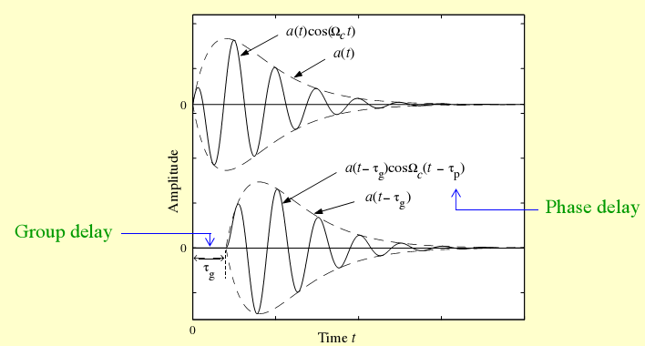
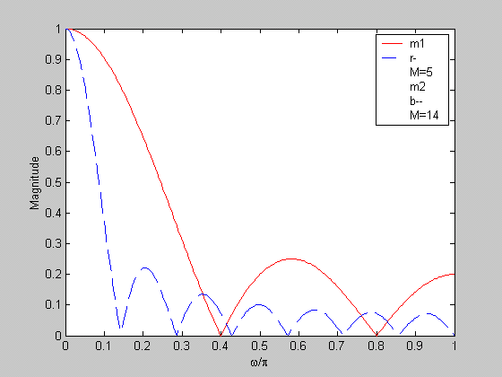
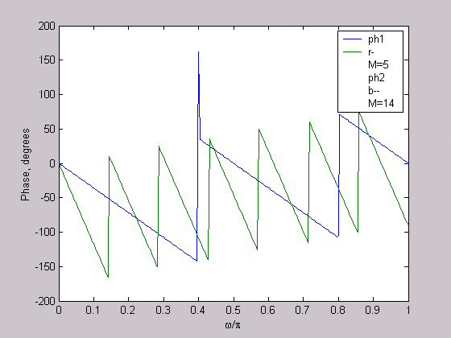
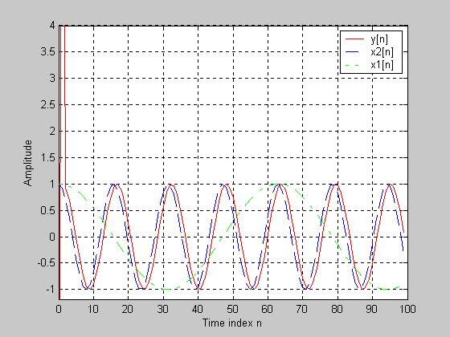
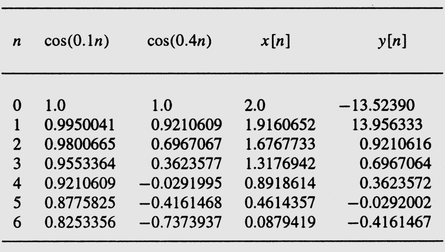

## 0. 本章学习目标

学完本章后，你应该能够：

- 理解什么是离散时间系统，并能举出常见例子（累加器、滑动平均滤波器、中值滤波器）
- 判断一个离散时间系统是否线性、是否移不变、是否因果、是否稳定（BIBO）
- 理解单位脉冲响应 $h[n]$ 和单位阶跃响应 $s[n]$ 的含义
- 会用卷积和（convolution sum）计算 LTI 系统的输出 $y[n] = x[n] * h[n]$
- 理解 FIR 和 IIR 系统的区别
- 理解频率响应 $H(e^{j\omega})$ 的含义：它是 $h[n]$ 的 DTFT
- 能用频率响应分析系统对不同频率成分的放大/衰减作用（滤波概念）
- 理解幅度响应、相位响应、相位延迟和群延迟的区别
- 能用特征值方法求解简单差分方程的完全响应

---

## 1. 先用人话理解本章在讲什么

前几章我们一直在讨论**信号本身**：信号怎么表示、怎么采样、怎么在频域分析。但从这一章开始，我们要讨论一个更实际的问题：**如果有一个信号 $x[n]$ 输入到一个"黑盒子"，这个黑盒子会输出什么信号 $y[n]$？**

这个"黑盒子"就是**离散时间系统**（discrete-time system）。

举一个生活中的例子：你对着微信发语音消息，手机会把你的声音信号 $x[n]$ 进行一系列处理（降噪、压缩等），最终对方听到 $y[n]$。这个"处理过程"就是系统。

再比如：你把一张模糊的照片输入美图秀秀，软件通过某种算法让照片变清晰。这个算法也是一个系统。

本章的核心问题是：
1. **怎么描述一个系统？**（用差分方程、用脉冲响应 $h[n]$、用频率响应 $H(e^{j\omega})$）
2. **系统有哪些类别？**（线性/非线性、移不变/移变、因果/非因果、稳定/不稳定）
3. **给定输入和系统，怎么求输出？**（时域做卷积，频域做乘法）

**初学者最容易卡在哪里？**
- 卷积和不理解"翻转、平移、相乘、求和"四个步骤
- 把模拟角频率 $\Omega$ 和数字角频率 $\omega$ 混在一起
- 不理解为什么 $H(e^{j\omega})$ 既是频率响应，又正好是 $h[n]$ 的 DTFT
- 差分方程求解时，忘记考虑初始条件

---

## 2. 核心概念

### 2.1 什么是离散时间系统

**一句话理解：**
离散时间系统就是一个数学规则，输入一个序列 $x[n]$，按照规则输出一个序列 $y[n]$。

**正式定义：**
离散时间系统处理给定的输入序列 $x[n]$，生成一个具有所需特性的输出序列 $y[n]$。大多数应用中，系统是单输入、单输出的：

```
x[n] (输入序列)  -->  [离散时间系统]  -->  y[n] = H{x[n]} (输出序列)
```

**直观例子：**
- $y[n] = 2x[n]$：输出是输入的 2 倍。这是最简单的系统。
- $y[n] = x[n] + x[n-1]$：输出是当前输入和前一个输入的相加。
- $y[n] = \max(x[n], x[n-1], x[n-2])$：输出是最近三个输入的最大值。

**容易混淆的点：**
系统处理的是**整个序列**，不是某一个单独的数值。当我们写 $y[n] = x[n] + x[n-1]$，这意味着对**每一个** n，输出都按照这个规则计算。

---

### 2.2 常见离散时间系统举例

#### (a) 累加器 (Accumulator)

**一句话理解：**
累加器把过去的所有输入加在一起，输出一个"累计值"。

**公式：**
$$
y[n] = \sum_{l=-\infty}^{n} x[l]
$$

另一种等价的递归写法：
$$
y[n] = y[n-1] + x[n]
$$

**直观例子：**
输入 $x[n] = \{1, 2, 3, 4, \ldots\}$（从 n=0 开始）
累加器输出 $y[n] = \{1, 3, 6, 10, \ldots\}$（第 n 项是前 n+1 个输入的和）

第三种形式（显式写出初始条件 $y[-1]$）：
$$
y[n] = \sum_{l=-\infty}^{-1} x[l] + \sum_{l=0}^{n} x[l] = y[-1] + \sum_{l=0}^{n} x[l], \quad n \geq 0
$$

**补充理解：** 递归形式 $y[n] = y[n-1] + x[n]$ 特别重要，因为它展现了**反馈**的思想：当前的输出依赖于上一个输出和当前输入。这是 IIR 系统的基础。第三种形式显式展示了初始条件 $y[-1]$ 的作用——它"浓缩"了 n < 0 之前所有输入的历史效应。

#### (b) 滑动平均滤波器 (Moving-Average Filter)

**一句话理解：**
每次取最近的 M 个输入样本，计算它们的平均值作为输出。这样可以平滑信号中的快速波动。

**公式：**
$$
y[n] = \frac{1}{M} \sum_{l=0}^{M-1} x[n-l]
$$

**直观例子：**
设 $M=3$，输入 $x[n] = \{1, 5, 3, 7, 2\}$（从 n=0 开始）
- $y[2] = (1+5+3)/3 = 3$
- $y[3] = (5+3+7)/3 = 5$
- $y[4] = (3+7+2)/3 = 4$

可以看到，原来剧烈波动的输入被"平滑"了。

#### (c) 指数加权滑动平均滤波器 (Exponentially Weighted Running Average)

**公式：**
$$
y[n] = \alpha y[n-1] + x[n], \quad 0 < \alpha < 1
$$

**直观例子：**
这类似于"记忆衰减"：最近的输入影响最大，越早的输入影响越小（以 $\alpha^k$ 的速度衰减）。天气预报中的"移动平均温度"就可以用这种思路。

#### (d) 线性插值器 (Linear Interpolator)

**一句话理解：**
根据相邻样本的值来估算中间缺失的样本值，常用于信号的上采样（增加采样率）。

**公式：**
$$
y[n] = x_u[n] + \frac{1}{2}\big(x_u[n-1] + x_u[n+1]\big)
$$

其中 $x_u[n]$ 是上采样后的序列（原样本之间插入了零值）。

**直观例子：**
假设原始序列为 $\{1, 3\}$，上采样（2 倍）后变为 $\{1, 0, 3, 0\}$。线性插值器的输出约为 $\{1, 2, 3, 1.5\}$（中间值被"补全"了）。

**补充理解：** 插值器在实际系统中广泛应用，比如图像缩放、音频重采样等。这里的线性插值是最简单的一种——在两个已知点之间画一条直线，取直线上对应位置的值。

#### (e) 中值滤波器 (Median Filter)

**一句话理解：**
在一个滑动窗口内取所有样本的中位数作为输出。它对"椒盐噪声"（偶发的极端值）特别有效。

**公式：**
$$
y[n] = \text{med}\{x[n-K], \ldots, x[n], \ldots, x[n+K]\}
$$

**直观例子：**
$\text{med}\{2, -3, 10, 5, -1\} = 2$

排序后为 $\{-3, -1, 2, 5, 10\}$，中间值（第 3 个）是 2。

---

### 2.3 系统的分类

#### 2.3.1 线性系统 (Linear System)

**一句话理解：**
系统满足"叠加原理"：两个信号分别输入后输出的和 = 两个信号先相加再输入得到的输出。再乘以常数也不影响。

**正式定义：**
对于任意常数 $\alpha$ 和 $\beta$，以及任意输入 $x_1[n]$ 和 $x_2[n]$，如果：
$$
x[n] = \alpha x_1[n] + \beta x_2[n] \quad \Rightarrow \quad y[n] = \alpha y_1[n] + \beta y_2[n]
$$
则系统是**线性**的。

**直观例子：**
- $y[n] = 3x[n]$ 是线性的（乘常数）。
- $y[n] = x^2[n]$ **不是**线性的（因为 $(a+b)^2 \neq a^2 + b^2$）。

**容易混淆的点：**
$y[n] = ax[n] + b$（$b \neq 0$）不是线性系统！因为常数项 $b$ 破坏了叠加原理。数学上这叫做**仿射系统**（affine system），不是线性系统。

#### 2.3.2 移不变系统 (Shift-Invariant System)

**一句话理解：**
如果把输入信号延后 $n_0$ 个样本，输出信号也恰好延后 $n_0$ 个样本，形状完全不变。系统对时间平移"无感"。

**正式定义：**
如果 $x_1[n] \Rightarrow y_1[n]$，且对于任意 $n_0$，有：
$$
x[n] = x_1[n - n_0] \quad \Rightarrow \quad y[n] = y_1[n - n_0]
$$
则系统是**移不变**的。

**直观例子：**
- $y[n] = x[n] + x[n-1]$ 是移不变的（规则里没有显式依赖 n）。
- $y[n] = n \cdot x[n]$ **不是**移不变的（因为规则里显式出现了 n）。

**容易混淆的点：**
判断移不变性的关键是看系统规则里有没有**显式地**出现 $n$。如果出现 $n$（不通过 $x[n]$ 间接出现），那大概率是移变系统。

**补充理解：** 移不变有时也叫"时不变"(time-invariant)。在 DSP 语境下两者等价。同时满足**线性 + 移不变**的系统称为 **LTI 系统**（Linear Time-Invariant System），这是本章乃至整个 DSP 课程最重要的系统类型。

#### 2.3.3 因果系统 (Causal System)

**一句话理解：**
系统"不能预知未来"：输出 $y[n_0]$ 只依赖于当前和过去的输入 $x[n]$（$n \leq n_0$），不依赖于未来的输入。

**正式定义：**
如果 $u_1[n] = u_2[n]$ 对于 $n < N$，则 $y_1[n] = y_2[n]$ 对于 $n < N$。

更直观的等价条件：第 $n_0$ 个输出样本 $y[n_0]$ 只依赖于输入样本 $x[n]$（$n \leq n_0$），不依赖 $n > n_0$ 的输入。

**直观例子：**
- $y[n] = x[n] + x[n-1]$ 是因果的（只用当前和过去）。
- $y[n] = x[n+1] - x[n]$ **不是**因果的（用到了"未来"的 $x[n+1]$）。

**容易混淆的点：**
因果性只适用于**输入输出采样率相同**的系统。如果系统做了降采样，情况更复杂。

#### 2.3.4 稳定系统 (BIBO Stable System)

**一句话理解：**
有界的输入一定产生有界的输出。"你给它有限的信号，它不会输出无穷大。"

**正式定义（BIBO 稳定性）：**
存在有限常数 $B_x$ 和 $B_y$，使得：
$$
|x[n]| < B_x \text{（对所有 n）} \quad \Rightarrow \quad |y[n]| < B_y \text{（对所有 n）}
$$

**对 LTI 系统的等价条件（非常重要！）：**
$$
S = \sum_{n=-\infty}^{\infty} |h[n]| < \infty
$$
即脉冲响应的绝对值求和必须有限。

**直观例子：**
- $y[n] = 0.5x[n] + 0.3x[n-1]$ 是稳定的（系数小，输出不会发散）。
- $y[n] = y[n-1] + x[n]$（累加器，无衰减）输入一个阶跃信号，输出会无限增长。对于**有界输入**（阶跃），输出**无界**，所以累加器**不稳定**。

**容易混淆的点：**
BIBO 稳定性说"有界输入 => 有界输出"，不是说输出一定要比输入小。累加器对阶跃输入输出无限大，所以不稳定；但如果输入是有限长度的，输出当然也是有限的——BIBO 稳定性考虑的是**所有可能的有界输入**。

#### 2.3.5 无源与无损系统 (Passive and Lossless Systems)

**一句话理解：**
无源系统：输出能量不超过输入能量（系统不产生能量，只能消耗或保持不变）。
无损系统：输出能量恰好等于输入能量（系统不消耗能量，像一面完美的镜子）。

**正式定义：**
对于所有有限能量的输入序列 $x[n]$：
$$
\sum_{n=-\infty}^{\infty} |y[n]|^2 \leq \sum_{n=-\infty}^{\infty} |x[n]|^2 < \infty \quad \text{（无源）}
$$
取等号时即为**无损**。

**直观例子：**
- 一个理想的单位延迟 $y[n] = x[n-1]$ 是无损的（能量只是被延迟，总量不变）。
- 一个衰减器 $y[n] = 0.5x[n]$ 是严格无源的（输出能量是输入的 1/4）。

**补充理解：** 无源和无损特性在设计对滤波器系数变化不敏感的系统时非常关键。

---

### 2.4 脉冲响应与阶跃响应 (Impulse and Step Responses)

**一句话理解：**
脉冲响应 $h[n]$ 就是：系统在"被戳了一下"（输入单位脉冲 $\delta[n]$）后的反应。这就像敲一下钟，听它发出的声音——这个声音完全描述了钟的特性。

**正式定义：**
- **单位脉冲响应** $h[n]$：输入 $\delta[n]$ 时系统的输出。
- **单位阶跃响应** $s[n]$：输入 $\mu[n]$（单位阶跃）时系统的输出。

**为什么脉冲响应这么重要？**
因为对于 LTI 系统，知道了 $h[n]$，你就知道了系统的**一切**。任何输入 $x[n]$ 都可以写成：
$$
x[n] = \sum_{k=-\infty}^{\infty} x[k] \delta[n-k]
$$
这是一个"用无数个脉冲表示任意信号"的分解。由于 LTI 系统满足线性和移不变性，对每个 $x[k]\delta[n-k]$ 的响应是 $x[k]h[n-k]$，总的输出就是所有这些响应的叠加。

---

### 2.5 LTI 系统的时域表征 --- 卷积和 (Convolution Sum)

**一句话理解：**
卷积和是计算"任意输入经过已知 LTI 系统后输出是什么"的标准方法。它把输入 $x[n]$ 和脉冲响应 $h[n]$ 通过"翻转、平移、相乘、求和"组合起来。

**正式定义：**
$$
y[n] = x[n] * h[n] = \sum_{k=-\infty}^{\infty} x[k] h[n-k] = \sum_{k=-\infty}^{\infty} x[n-k] h[k]
$$

**卷积计算的"四步法"：**
1. **翻转 (Flip):** 把 $h[k]$ 翻转为 $h[-k]$
2. **平移 (Shift):** 把 $h[-k]$ 平移 $n$ 得到 $h[n-k]$
3. **相乘 (Multiply):** 逐点相乘 $x[k] \cdot h[n-k]$
4. **求和 (Sum):** 把所有乘积加起来，得到 $y[n]$

重复以上步骤，对每一个 n 算一遍。

**直观例子（课件例题）：**
$x[n] = h[n] = \delta[n] + \delta[n-1] + \delta[n-2]$

即 $x[n] = \{1, 1, 1\}$（从 n=0 开始），$h[n] = \{1, 1, 1\}$

计算结果：
$$
y[n] = \delta[n] + 2\delta[n-1] + 3\delta[n-2] + 2\delta[n-3] + \delta[n-4]
$$

即 $y[n] = \{1, 2, 3, 2, 1\}$（从 n=0 开始，共 5 个点）

**补充理解：** 注意两个长度为 3 的序列卷积，结果长度是 $3+3-1=5$。一般规律：长度 $L_1$ 和 $L_2$ 的序列卷积，结果长度不超过 $L_1+L_2-1$。

**另一种理解（"多项式乘法"）：**
如果你把序列看作多项式的系数：
- $x$ 对应 $1 + z^{-1} + z^{-2}$
- $h$ 对应 $1 + z^{-1} + z^{-2}$
- 乘积：$(1+z^{-1}+z^{-2})^2 = 1 + 2z^{-1} + 3z^{-2} + 2z^{-3} + z^{-4}$

系数的排列就是卷积结果！这就是为什么卷积又叫"多项式乘法"。

---

### 2.6 有限维 LTI 离散时间系统（差分方程）

**一句话理解：**
很多实际的 LTI 系统可以通过一个**线性常系数差分方程**来描述，这个方程把输入 $x[n]$ 和输出 $y[n]$ 联系起来。

**正式定义（一般形式）：**
$$
\sum_{k=0}^{N} d_k y[n-k] = \sum_{k=0}^{M} p_k x[n-k]
$$

其中 $d_k$ 和 $p_k$ 是常数，系统的阶数为 $\max(N, M)$。

如果系统是因果的且 $d_0 \neq 0$，可以改写为：
$$
y[n] = -\sum_{k=1}^{N} \frac{d_k}{d_0} y[n-k] + \sum_{k=0}^{M} \frac{p_k}{d_0} x[n-k]
$$

**直观例子：**
最简单的差分方程：$y[n] = 0.5y[n-1] + x[n]$
- 这表示当前输出 = 上一个输出的一半 + 当前输入
- 可以看出这是一种"带记忆"的系统

---

### 2.7 完全响应的分解

对于一个差分方程，完全响应 $y[n]$ 有两种分解方式：

**方式一：互补解 + 特解**
$$
y[n] = y_c[n] + y_p[n]
$$
- $y_c[n]$：互补解（complementary solution），输入为零时差分方程的解（反映系统自身的特性）
- $y_p[n]$：特解（particular solution），由输入信号决定的那部分解

**方式二：零输入响应 + 零状态响应**
$$
y[n] = y_{zi}[n] + y_{zs}[n]
$$
- $y_{zi}[n]$：零输入响应（zero-input response），输入为零、仅由初始条件决定的响应
- $y_{zs}[n]$：零状态响应（zero-state response），初始条件全为零、仅由输入决定的响应

**为什么有两种分解方式？**
- $y_c + y_p$：侧重于数学求解（找特征根 + 猜特解的形式）
- $y_{zi} + y_{zs}$：侧重于物理概念（系统的"惯性" vs 输入的"驱动"）

对于 LTI 系统，**零状态响应 $y_{zs}[n]$ 恰好等于 $x[n] * h[n]$**。

---

### 2.8 FIR 与 IIR 系统

**一句话理解：**
- **FIR** (Finite Impulse Response，有限脉冲响应)：$h[n]$ 只有有限个非零值。敲一下系统，它响一会儿就停了。
- **IIR** (Infinite Impulse Response，无限脉冲响应)：$h[n]$ 有无穷多个非零值（理论上永远不会完全停止）。

**正式定义：**
- $h[n]$ 长度为有限 => FIR
- $h[n]$ 长度为无限 => IIR

**另一种分类：**
- **非递归系统 (Nonrecursive):** 输出只由当前和过去的输入决定，不需要过去输出的反馈。通常是 FIR。
- **递归系统 (Recursive):** 输出依赖于过去的输出（有反馈）。通常是 IIR。

**注意：** FIR 通常是非递归的，IIR 通常是递归的，但不绝对。某些 FIR 系统也可以用递归结构实现。

**直观例子：**
- $y[n] = x[n] + x[n-1] + x[n-2]$：FIR，长度 3
- $y[n] = 0.5y[n-1] + x[n]$：IIR，脉冲响应无限长（$h[n] = 0.5^n \mu[n]$）

---

### 2.9 频率响应 (Frequency Response)

**一句话理解：**
频率响应 $H(e^{j\omega})$ 告诉你：系统对"不同频率的正弦波"分别会产生多大的放大/衰减和相位移动。它是从频域理解系统的核心工具。

**为什么要引入频率响应？**
大部分实际信号可以表示为不同频率的正弦波的叠加。如果我们知道系统对每个单独正弦波的反应（频率响应），就可以利用叠加原理知道系统对任意信号的响应。

**最重要的推导过程：**

输入一个复指数信号 $x[n] = e^{j\omega n}$（这是 LTI 系统的**特征函数**），则输出为：
$$
y[n] = \sum_{k=-\infty}^{\infty} h[k] e^{j\omega(n-k)}
= \left( \sum_{k=-\infty}^{\infty} h[k] e^{-j\omega k} \right) e^{j\omega n}
= H(e^{j\omega}) e^{j\omega n}
$$

其中：
$$
H(e^{j\omega}) = \sum_{k=-\infty}^{\infty} h[k] e^{-j\omega k}
$$

**这个公式告诉了我们三件重要的事：**
1. 当输入是 $e^{j\omega n}$ 时，输出就是 $H(e^{j\omega}) \cdot e^{j\omega n}$（输入乘以一个复数常数）
2. $e^{j\omega n}$ 是 LTI 系统的**特征函数**（eigen function），$H(e^{j\omega})$ 就是对应的**特征值**（eigen value）。用大白话说：**特征函数的意思是，输入这种信号时，输出只是把它缩放一下，形状完全不变**——就像一面哈哈镜，只有特定角度照出来不变形
3. $H(e^{j\omega})$ 恰好是脉冲响应 $h[n]$ 的**DTFT**（离散时间傅里叶变换）！

**频率响应的两种表示形式：**
$$
H(e^{j\omega}) = H_{re}(e^{j\omega}) + j H_{im}(e^{j\omega}) = |H(e^{j\omega})| e^{j\theta(\omega)}
$$

- $|H(e^{j\omega})|$：幅度响应（magnitude response）---- 系统对频率 $\omega$ 成分放大了多少倍
- $\theta(\omega) = \arg\{H(e^{j\omega})\}$：相位响应（phase response）---- 系统对频率 $\omega$ 成分移动了多少相位

**增益函数和衰减函数：**
- 增益函数：$G(\omega) = 20 \log_{10} |H(e^{j\omega})|$ （单位：dB）
- 衰减函数：$a(\omega) = -G(\omega) = 20 \log_{10} \frac{1}{|H(e^{j\omega})|}$ （单位：dB）

**工程上常用的另一种形式（相对增益）：**
$$
G(\omega) = 20 \log_{10} \frac{|H(e^{j\omega})|}{|H(e^{j\omega_0})|} \quad \text{(单位：dBC)}
$$

**对实系统的重要性质：**
当 $h[n]$ 是实数序列时：
1. $|H(e^{j\omega})|$ 是偶函数：$|H(e^{j\omega})| = |H(e^{-j\omega})|$
2. $\theta(\omega)$ 是奇函数：$\theta(-\omega) = -\theta(\omega)$

---

### 2.10 滤波的概念 (Concept of Filtering)

**一句话理解：**
滤波就是"选择性地放行某些频率成分，挡住另一些频率成分"。就像一扇门，只让特定频率的信号通过。

**核心原理：**
任意输入信号可以写为：
$$
x[n] = \frac{1}{2\pi} \int_{-\pi}^{\pi} X(e^{j\omega}) e^{j\omega n} d\omega
$$
即 $x[n]$ 是无数个不同频率的复指数信号的加权叠加。

经过 LTI 系统后：
$$
Y(e^{j\omega}) = H(e^{j\omega}) X(e^{j\omega})
$$
输出的 DTFT = 输入的 DTFT 乘以频率响应。

通过合理设计 $|H(e^{j\omega})|$ 在不同频率的值，我们可以：
- 让某些频率成分几乎不变地通过（$|H(e^{j\omega})| \approx 1$）
- 让另一些频率成分被大幅衰减（$|H(e^{j\omega})| \approx 0$）

---

### 2.11 稳态响应与瞬态响应 (Steady-State and Transient Responses)

**一句话理解：**
当输入是一个长期持续的周期信号时：
- **稳态响应**（steady-state response）：系统稳定之后的输出部分，与输入同频率
- **瞬态响应**（transient response）：系统刚启动时的"过渡"输出，会随时间衰减消失

**数学表示：**
对于因果指数输入 $x[n] = e^{j\omega n} \mu[n]$，输出可分解为：
$$
y[n] = \underbrace{H(e^{j\omega}) e^{j\omega n}}_{\text{稳态响应 } y_{sr}[n]} - \underbrace{\left(\sum_{k=n+1}^{\infty} h[k] e^{-j\omega k}\right) e^{j\omega n}}_{\text{瞬态响应 } y_{tr}[n]}
$$

对于 FIR 系统（$h[n]$ 长度为 $L$），瞬态响应在 $n \geq L-1$ 后完全消失。所以说"FIR 系统能达到精确的稳态"。

---

### 2.12 相位延迟与群延迟 (Phase and Group Delays)

**一句话理解：**
- **相位延迟** $\tau_p$：一个单一频率的正弦波经过系统后被延迟了多少时间
- **群延迟** $\tau_g$：一个"波包"（由相近频率组成的包络）经过系统后被延迟了多少时间

**正式定义：**

对于输入 $x[n] = A \cos(\omega_0 n + \phi)$，输出为：
$$
y[n] = A |H(e^{j\omega_0})| \cos(\omega_0 n + \theta(\omega_0) + \phi)
$$

接下来是关键一步——把相位 $\theta(\omega_0)$ 解释为"时间延迟"：

$$
\begin{aligned}
y[n] &= A |H(e^{j\omega_0})| \cos(\omega_0 n + \theta(\omega_0) + \phi) \\
     &= A |H(e^{j\omega_0})| \cos\!\big(\omega_0 n + \omega_0 \cdot \frac{\theta(\omega_0)}{\omega_0} + \phi\big) \\
     &= A |H(e^{j\omega_0})| \cos\!\big(\omega_0 \left(n + \frac{\theta(\omega_0)}{\omega_0}\right) + \phi\big) \\
     &= A |H(e^{j\omega_0})| \cos\!\big(\omega_0 \left(n - \left(-\frac{\theta(\omega_0)}{\omega_0}\right)\right) + \phi\big)
\end{aligned}
$$

所以输出 = 输入被放大 $|H(e^{j\omega_0})|$ 倍，然后被延迟了 $-\frac{\theta(\omega_0)}{\omega_0}$ 个样本。

因此**相位延迟**的定义就是：
$$
\tau_p(\omega_0) = -\frac{\theta(\omega_0)}{\omega_0}
$$

**单位：** $\tau_p$ 的单位是**采样周期数**（samples），不是秒。如果想换算成秒，乘以采样间隔 $T$ 即可。

**群延迟**（或包络延迟）：
$$
\tau_g(\omega) = -\frac{d\theta(\omega)}{d\omega}
$$

**直观理解（重要！）：**
想象一个调幅（AM）信号：高频的载波被低频的包络调制。
- 载波（carrier）经历的延迟是**相位延迟** $\tau_p$
- 包络（envelope）经历的延迟是**群延迟** $\tau_g$



**图中应该看什么：**
- 注意"envelope"（包络，低频的轮廓）和"carrier"（载波，高频的振荡）是两种不同的时间尺度
- 包络被延迟了 $\tau_g$（群延迟），载波被延迟了 $\tau_p$（相位延迟）
- 如果 $\tau_g$ 不是常数（随频率变化），包络的不同频率成分会被不同程度地延迟，导致信号失真

**补充理解：** 为什么叫"群"延迟？因为它描述的是一群相近频率的整体延迟行为。当群延迟在信号带宽内不是常数时，会发生**色散**（dispersion），导致信号失真。这就是为什么在通信系统设计中，常常要加**延迟均衡器**（delay equalizer）。

---

### 2.13 卷积运算的性质

1. **交换律 (Commutative):** $x[n] * h[n] = h[n] * x[n]$
2. **结合律 (Associative):** $x[n] * (h_1[n] * h_2[n]) = (x[n] * h_1[n]) * h_2[n]$
3. **分配律 (Distributive):** $x[n] * (h_1[n] + h_2[n]) = x[n] * h_1[n] + x[n] * h_2[n]$

这些性质在系统互联时非常有用。

---

### 2.14 系统的互联方式

**级联 (Cascade Connection):**
两个系统首尾相连。总脉冲响应：
$$
h[n] = h_1[n] * h_2[n]
$$

**并联 (Parallel Connection):**
两个系统的输出相加。总脉冲响应：
$$
h[n] = h_1[n] + h_2[n]
$$

**补充理解：** 结合律告诉我们，级联系统的顺序可以交换（对于 LTI 系统而言）。这在实际实现中很灵活。

---

### 2.15 LTI 系统的稳定性和因果性条件（时域）

**稳定性条件：**
一个 LTI 离散时间系统是 BIBO 稳定的，当且仅当：
$$
\sum_{n=-\infty}^{\infty} |h[n]| < \infty
$$

**因果性条件：**
一个 LTI 离散时间系统是因果的，当且仅当：
$$
h[n] = 0, \quad \text{对于 } n < 0
$$

**同时满足稳定性和因果性：**
$$
h[n] = h[n]\mu[n], \quad \sum_{n=0}^{\infty} |h[n]| < \infty
$$

---

## 3. 核心公式与推导

### 3.1 卷积和公式

$$
y[n] = x[n] * h[n] = \sum_{k=-\infty}^{\infty} x[k] h[n-k]
$$

其中：
- $y[n]$：输出序列
- $x[n]$：输入序列
- $h[n]$：系统的脉冲响应
- $k$：求和哑变量

**这个公式在干什么：**
计算任意已知脉冲响应的 LTI 系统对任意输入的输出。是时域分析的基石。

**怎么用：**
1. 写出 $x[k]$ 和 $h[n-k]$ 的表达式
2. 确定非零重叠区间（非零值对应的 k 的范围）
3. 对重叠区间内的 k 求和

**常见错误：**
- 忘记先翻转 $h[k]$ 得到 $h[-k]$ 再平移
- 求和上下界搞错（注意非零区间的正确范围）
- 把 $x$ 和 $h$ 的索引搞混

---

### 3.2 卷积输出长度公式

设 $x[n]$ 的非零区间为 $[N_1, N_2]$（长度 $N_2-N_1+1$），$h[n]$ 的非零区间为 $[N_3, N_4]$（长度 $N_4-N_3+1$），则 $y[n] = x[n] * h[n]$ 的非零区间为：

$$
y[n] \neq 0, \quad N_1+N_3 \leq n \leq N_2+N_4
$$

输出长度为：$(N_2+N_4) - (N_1+N_3) + 1$

**怎么用：**
快速判定卷积结果从哪开始、到哪结束。

**常见错误：**
忘记 $N_1 < N_2$ 和 $N_3 < N_4$ 的前提条件。

---

### 3.3 频率响应公式

$$
H(e^{j\omega}) = \sum_{n=-\infty}^{\infty} h[n] e^{-j\omega n}
$$

其中：
- $H(e^{j\omega})$：系统的频率响应（是一个复数值函数，周期为 $2\pi$）
- $\omega$：数字角频率（范围通常取 $[-\pi, \pi]$ 或 $[0, 2\pi]$）
- $h[n]$：脉冲响应

**这个公式在干什么：**
这是 $h[n]$ 的 DTFT。它把时域的脉冲响应变换到频域，告诉我们系统对不同频率的响应。

**怎么用：**
1. 写出 $h[n]$ 的表达式
2. 代入 DTFT 求和公式
3. 化简（利用等比数列求和等技巧）

**FIR 系统的频率响应：**
$$
H(e^{j\omega}) = \sum_{k=N_1}^{N_2} h[k] e^{-j\omega k}
$$

**IIR 系统的频率响应：**
如果系统由差分方程 $\sum_{k=0}^N d_k y[n-k] = \sum_{k=0}^M p_k x[n-k]$ 描述，则：
$$
H(e^{j\omega}) = \frac{\sum_{k=0}^{M} p_k e^{-j\omega k}}{\sum_{k=0}^{N} d_k e^{-j\omega k}}
$$

**常见错误：**
- 混淆模拟频率 $\Omega$ 和数字频率 $\omega$
- 忘记 $H(e^{j\omega})$ 的周期为 $2\pi$（在频域重复）

---

### 3.4 频域输入输出关系

$$
Y(e^{j\omega}) = H(e^{j\omega}) X(e^{j\omega})
$$

其中：
- $Y(e^{j\omega})$：输出 $y[n]$ 的 DTFT
- $X(e^{j\omega})$：输入 $x[n]$ 的 DTFT
- $H(e^{j\omega})$：频率响应

**这个公式在干什么：**
时域的卷积 等于 频域的乘积。这是 DSP 中最重要的对偶关系之一。

**补充理解：** 在时域做卷积很麻烦（要翻转、平移、相乘、求和），但在频域只需要做乘法。这就是为什么很多时候我们先转到频域处理，再转回时域。

---

### 3.5 相位延迟公式

$$
\tau_p(\omega) = -\frac{\theta(\omega)}{\omega}
$$

其中：
- $\tau_p(\omega)$：在频率 $\omega$ 处的相位延迟（以采样周期为单位）
- $\theta(\omega)$：相位响应（以弧度为单位）
- $\omega$：数字角频率

**怎么用：**
如果输入是 $A\cos(\omega n + \phi)$，输出为 $A|H(e^{j\omega})| \cos(\omega(n - \tau_p) + \phi)$。

**常见错误：**
- 单位问题：$\tau_p$ 的单位是**采样周期数**（sample periods），不是秒
- 负号容易忘记

---

### 3.6 群延迟公式

$$
\tau_g(\omega) = -\frac{d\theta(\omega)}{d\omega}
$$

其中：
- $\tau_g(\omega)$：群延迟（对频率 $\omega$ 求导数）

**这个公式在干什么：**
描述一个窄带信号包络的延迟。如果 $\tau_g(\omega)$ 在信号带宽内是常数，包络不会失真。

**怎么用和常见错误：**
- 先写出 $\theta(\omega)$，再对 $\omega$ 求导数
- 如果相位响应是线性的（$\theta(\omega) = -k\omega$），则群延迟为常数 $k$，这是理想情况
- 负数号是最容易忘的

---

### 3.7 滑动平均滤波器的频率响应（重要推导！）

对于 $h[n] = \frac{1}{M}$，$n=0,1,\ldots,M-1$（长度为 M 的滑动平均滤波器）：

$$
H(e^{j\omega}) = \frac{1}{M} \frac{1 - e^{-jM\omega}}{1 - e^{-j\omega}}
= \frac{1}{M} \frac{\sin(M\omega/2)}{\sin(\omega/2)} e^{-j(M-1)\omega/2}
$$

幅度响应：
$$
|H(e^{j\omega})| = \frac{1}{M} \left|\frac{\sin(M\omega/2)}{\sin(\omega/2)}\right|
$$

相位响应：
$$
\theta(\omega) = -\frac{(M-1)\omega}{2} + \pi \sum_{k=1}^{\lfloor M/2 \rfloor} \mu\left(\omega - \frac{2\pi k}{M}\right)
$$

其中 $\mu(\cdot)$ 是单位阶跃函数，用于处理幅度响应过零点时的相位跳变。

**这个公式告诉了我们什么：**
- 滑动平均滤波器是一个**低通滤波器**：低频成分能通过，高频成分被抑制
- 当 $\omega=0$ 时，$|H(e^{j0})| = 1$（直流成分完全通过）
- 当 $\omega = \frac{2\pi k}{M}$（$k=1,2,\ldots,\lfloor M/2\rfloor$）时，$|H(e^{j\omega})| = 0$（这些频率成分被完全阻挡）
- M 越大，主瓣越窄，阻带的零点越密集，滤波效果越"陡峭"



**图中应该看什么：**
- 横轴是数字频率 $\omega/\pi$，范围 0 到 1（对应 $\omega$ 从 0 到 $\pi$）
- 纵轴是幅度响应 $|H(e^{j\omega})|$
- 两条曲线分别对应 M=5（虚线）和 M=14（实线）
- M=14 的曲线有更多的零点，过渡带更窄，说明滤波效果更好
- 零点位置：$2\pi k/M$



**图中应该看什么：**
- 注意相位响应中有很多跳变（由幅度响应的过零点引起）
- M=14 的相位跳变更密集（零点更多）
- 在 MATLAB 中，可以用 `unwrap` 函数消除 $2\pi$ 跳变，获得连续的相位曲线
- 对于线性相位部分，相位响应是 $-(M-1)\omega/2$，表明滤波器引入了 $(M-1)/2$ 个样本的延迟

---

### 3.8 差分方程求解流程（特征值法）

以课件例题 4.22 为例，方程：
$$
y[n] + y[n-1] - 6y[n-2] = x[n]
$$
输入 $x[n] = 8\mu[n]$，初始条件 $y[-1]=1$，$y[-2]=-1$。

**第一步：求特征值（eigen values）**

令 $x[n]=0$，设 $y[n] = \lambda^n$ 代入齐次方程：
$$
\lambda^n + \lambda^{n-1} - 6\lambda^{n-2} = \lambda^{n-2}(\lambda^2 + \lambda - 6) = \lambda^{n-2}(\lambda+3)(\lambda-2) = 0
$$

特征值：$\lambda_1 = -3$，$\lambda_2 = 2$

**第二步：写互补解**
$$
y_c[n] = \alpha_1 (-3)^n + \alpha_2 (2)^n
$$

**第三步：求特解**

对于阶跃输入，猜特解形式为 $y_p[n] = \beta$（常数），代入原方程：
$$
\beta + \beta - 6\beta = 8 \quad \Rightarrow \quad -4\beta = 8 \quad \Rightarrow \quad \beta = -2, \; n \geq 0
$$

**第四步：结合初始条件求系数**

完全响应：$y[n] = \alpha_1 (-3)^n + \alpha_2 (2)^n - 2$（$n \geq 0$）

利用 $y[-1]=1$，$y[-2]=-1$ 代入：
$$
\begin{cases}
\alpha_1 (-3)^{-2} + \alpha_2 (2)^{-2} - 2 = -1 \\
\alpha_1 (-3)^{-1} + \alpha_2 (2)^{-1} - 2 = 1
\end{cases}
$$

解得 $\alpha_1 = -1.8$，$\alpha_2 = 4.8$

最终：
$$
y[n] = -1.8(-3)^n + 4.8(2)^n - 2, \quad n \geq 0
$$

---

### 3.9 从差分方程求脉冲响应

同一个差分方程 $y[n] + y[n-1] - 6y[n-2] = x[n]$，求 $h[n]$。

**方法：** 设 $x[n] = \delta[n]$，$h[n]$ 的形式与 $y_c[n]$ 相同：
$$
h[n] = \alpha_1 (-3)^n + \alpha_2 (2)^n, \quad n \geq 0
$$

利用定义 $h[0]$ 和 $h[1]$：
- $n=0$ 时：$h[0] + h[-1] - 6h[-2] = \delta[0] = 1 \Rightarrow h[0] = 1$（因果系统，$h[-1]=h[-2]=0$）
- 所以 $\alpha_1 + \alpha_2 = 1$

- $n=1$ 时：$h[1] + h[0] - 6h[-1] = \delta[1] = 0 \Rightarrow h[1] = -h[0] = -1$
- 所以 $-3\alpha_1 + 2\alpha_2 = -1$（因为 $h[1] = \alpha_1(-3)^1 + \alpha_2(2)^1$）

解得 $\alpha_1 = 0.6$，$\alpha_2 = 0.4$

$$
h[n] = 0.6(-3)^n + 0.4(2)^n, \quad n \geq 0
$$

对于任何输入 $x[n]$，总响应 $y[n] = x[n] * h[n]$。

---

### 3.10 重要 MATLAB 函数速查

本章课件涉及多个 MATLAB 函数，这里集中整理：

| 函数 | 用途 | 基本用法 |
|---|---|---|
| `impz(p,d,N)` | 计算系统的脉冲响应 $h[n]$ | `[h,n] = impz(p,d,N);` 其中 p 是分子系数，d 是分母系数，N 是点数 |
| `stepz(p,d,N)` | 计算系统的阶跃响应 $s[n]$ | `[s,n] = stepz(p,d,N);` 参数同 impz |
| `freqz(h,1,w)` | 计算频率响应 $H(e^{j\omega})$ | `H = freqz(h,1,w);` 其中 h 是脉冲响应，w 是频率点向量 |
| `abs(H)` | 提取幅度响应 $|H(e^{j\omega})|$ | `mag = abs(H);` |
| `angle(H)` | 提取相位响应 $\theta(\omega)$ | `phase = angle(H);` 返回弧度值 |
| `unwrap(phase)` | 消除相位中的 $2\pi$ 跳变 | `phase_uw = unwrap(phase);` 获得连续相位曲线 |
| `real(H)` / `imag(H)` | 提取实部 / 虚部 | `H_re = real(H); H_im = imag(H);` |
| `phasedelay(h,1,w)` | 计算相位延迟 $\tau_p(\omega)$ | `tau_p = phasedelay(h,1,w);` |
| `grpdelay(h,1,w)` | 计算群延迟 $\tau_g(\omega)$ | `tau_g = grpdelay(h,1,w);` |

**示例代码片段（计算脉冲和阶跃响应）：**
```matlab
p = [0.8  -0.44  0.36  0.02];   % 分子系数
d = [1     0.7  -0.45  -0.6];   % 分母系数
[h, m] = impz(p, d, 41);        % 计算前 41 点的脉冲响应
[s, m] = stepz(p, d, 41);       % 计算前 41 点的阶跃响应
```

**补充理解：**
- 对于 FIR 系统，分母系数 `d = 1`（只有 $d_0=1$）
- `freqz` 的第二个参数设为 1，表示分母为纯 1（FIR 的情况）
- 参考课件中的 `Program 4_3.m`（滑动平均滤波器的幅度和相位响应）和 `Program 4_4.m`（滤波实例验证）

---

---

## 4. 图像与直观理解

### 4.1 滑动平均滤波器的频率响应图


**图中应该看什么：**
- 横轴：归一化频率 $\omega/\pi$（0 表示直流，1 表示最高频率 $\pi$）
- 纵轴：幅度（线性尺度，不是 dB）
- M=5（虚线）：第一个零点在 $\omega = 2\pi/5 = 0.4\pi$
- M=14（实线）：第一个零点在 $\omega = 2\pi/14 \approx 0.14\pi$，有更多零点
- M 越大，抑制高频的能力越强，但同时延迟也越大（$(M-1)/2$ 个样本）


**图中应该看什么：**
- 跳变发生在幅度的零点处（符号翻转导致相位突跳 $\pi$）
- MATLAB 的 `unwrap` 函数可以消除 $2\pi$ 跳变，但不能消除零点的 $\pi$ 跳变
- 线性相位特性：$\theta(\omega) = -(M-1)\omega/2$

### 4.2 滤波示例图



**图中应该看什么：**
- 输入 $x[n] = \cos(0.1n) + \cos(0.4n)$ 包含两个频率成分：低频（0.1）和高频（0.4）
- 设计的滤波器长度为 3，目的是**通过高频、阻挡低频**
- 滤波器系数：$h[0]=h[2]=-6.76195$，$h[1]=13.456335$



**图中应该看什么：**
- 前两行（n=0,1）是瞬态输出
- 从 n=2 开始，输出约为 $\cos(0.4(n-1))$（只保留了高频成分，延迟 1 个样本）
- 验证了滤波器实现了"滤除低频（0.1）、保留高频（0.4）"的设计目标
- 稳态在 $n=2$ 处达到（因为 $h[n]$ 长度 = 3）

---

## 5. 本章重点总结

| 知识点 | 要记住什么 | 常见错误 |
|---|---|---|
| 系统的定义 | 系统是输入序列到输出序列的映射规则 | 以为系统是处理单个数值 |
| 线性系统 | 满足叠加原理：$\alpha x_1+\beta x_2 \to \alpha y_1+\beta y_2$ | 把 $y=ax+b$ 当线性系统（$b \neq 0$ 时不是） |
| 移不变系统 | 输入延迟 $n_0$ 样本，输出也精确延迟 $n_0$ 样本 | 只检查"看起来差不多"，不严格验证 |
| 因果系统 | 输出不依赖未来输入，只依赖当前和过去 | 判断时忘记检查 n 的符号 |
| BIBO 稳定 | 有界输入必产生有界输出 | 以为系统只要不显式发散就稳定 |
| 脉冲响应 $h[n]$ | 输入 $\delta[n]$ 时的输出，完全描述 LTI 系统 | 误以为任何系统都有明确的 $h[n]$ |
| 卷积和 | $y[n]=\sum_k x[k]h[n-k]$，四步法计算 | 下标搞错，求和范围搞错 |
| 卷积输出长度 | 长度 L1+L2-1 | 忘记-1 |
| 差分方程 | 描述输入输出关系的线性常系数方程 | 初始条件代入时符号或下标错误 |
| 完全响应 | $y=y_c+y_p=y_{zi}+y_{zs}$ | 混淆两种分解方式 |
| FIR vs IIR | FIR 脉冲响应有限长，IIR 无限长 | 以为 FIR 一定非递归（不绝对） |
| 频率响应 $H(e^{j\omega})$ | $h[n]$ 的 DTFT，描述系统频域特性 | 忘记它是 $h[n]$ 的 DTFT |
| 特征函数 | $e^{j\omega n}$ 输入产生 $H(e^{j\omega})e^{j\omega n}$ 输出 | 不理解"特征函数"的含义 |
| 频域关系 | $Y(e^{j\omega})=H(e^{j\omega})X(e^{j\omega})$ | 忘记这是频域乘法，时域是卷积 |
| 滤波 | 选择性通过/阻挡频率成分 | 忘记理想滤波器的相频特性也很重要 |
| 相位延迟 | $\tau_p=-\theta(\omega)/\omega$ | 符号搞反，单位混淆 |
| 群延迟 | $\tau_g=-d\theta/d\omega$ | 忘记求导，与相位延迟混淆 |
| 幅度响应的对称性 | 实系统：幅度偶函数，相位奇函数 | 推不出这个结论 |
| MATLAB unwrap | 消除相位中的 $2\pi$ 跳变 | 把零点引起的 $\pi$ 跳变也当 $2\pi$ 跳变 |

---

## 6. 配套例题

### 例题 1：判断系统线性、移不变性

**题目：**
判断系统 $y[n] = n x[n]$ 是否满足线性和移不变性。

**解题思路：**
分别用定义检验：线性性检验叠加原理是否成立；移不变性检验输入移 $n_0$ 后输出是否精确移 $n_0$。

**解答：**

**线性性检验：**
设 $x_1[n] \to y_1[n] = n x_1[n]$，$x_2[n] \to y_2[n] = n x_2[n]$

对于 $x_3[n] = \alpha x_1[n] + \beta x_2[n]$：
$$
y_3[n] = n(\alpha x_1[n] + \beta x_2[n]) = \alpha \cdot n x_1[n] + \beta \cdot n x_2[n] = \alpha y_1[n] + \beta y_2[n]
$$

叠加原理成立，**是线性系统**。

**移不变性检验：**
设 $x_1[n] \to y_1[n] = n x_1[n]$

令 $x_2[n] = x_1[n - n_0]$，则：
$$
y_2[n] = n x_2[n] = n x_1[n - n_0]
$$

而 $y_1[n - n_0] = (n - n_0) x_1[n - n_0]$

因为 $n \neq n - n_0$（除非 $n_0 = 0$），$y_2[n] \neq y_1[n - n_0]$，**不是移不变系统**。

**答案：** 线性但移变。

**易错提醒：** 这个系统虽然是线性的，但因为输出规则里显式乘了 $n$，所以只要输入平移，输出不仅会平移，乘数 $n$ 也会改变结果。判断移不变性时，关键看输出规则里有没有显式的 $n$。

---

### 例题 2：简单卷积计算

**题目：**
已知 $x[n] = \{2, 1, 3\}$（$n=0,1,2$），$h[n] = \{1, 1\}$（$n=0,1$），求 $y[n] = x[n] * h[n]$。

**解题思路：**
使用四步法，或者用"多项式乘法"快速计算。逐个 n 计算 $y[n]$ 的值。

**解答：**

用"不进位乘法"（多项式乘法）：

```
    2   1   3   ← x[n] 的系数
×       1   1   ← h[n] 的系数
---------------
    2   1   3   ← 乘1（不移位）
2   1   3       ← 乘1（左移一位）
---------------
2   3   4   3   ← 相加
```

所以 $y[n] = \{2, 3, 4, 3\}$（从 n=0 开始，到 n=3）

验证长度：$x$ 长度 3，$h$ 长度 2，$y$ 长度 $3+2-1=4$。正确。

**也可以用定义逐一验证：**
- $y[0] = x[0]h[0] = 2 \cdot 1 = 2$
- $y[1] = x[0]h[1] + x[1]h[0] = 2 \cdot 1 + 1 \cdot 1 = 3$
- $y[2] = x[1]h[1] + x[2]h[0] = 1 \cdot 1 + 3 \cdot 1 = 4$
- $y[3] = x[2]h[1] = 3 \cdot 1 = 3$

**答案：** $y[n] = 2\delta[n] + 3\delta[n-1] + 4\delta[n-2] + 3\delta[n-3]$

**易错提醒：** n=0 对应卷积结果的第一个值，n=3 对应最后一个。注意 $h[n]$ 的非零范围是 $n \in [0,1]$，$x[n]$ 是 $n \in [0,2]$，结果 $y[n]$ 非零范围是 $n \in [0+0, 2+1] = [0,3]$。

---

### 例题 3：LTI 系统稳定性判断

**题目：**
某 LTI 系统的脉冲响应为 $h[n] = (0.8)^n \mu[n]$。判断该系统是否 BIBO 稳定。

**解题思路：**
BIBO 稳定的等价条件是 $\sum_{n=-\infty}^{\infty} |h[n]| < \infty$。验证这个无穷级数是否收敛。

**解答：**
$$
\sum_{n=-\infty}^{\infty} |h[n]| = \sum_{n=0}^{\infty} |(0.8)^n| = \sum_{n=0}^{\infty} (0.8)^n
$$

这是公比 $r = 0.8 < 1$ 的等比级数：
$$
\sum_{n=0}^{\infty} (0.8)^n = \frac{1}{1 - 0.8} = \frac{1}{0.2} = 5 < \infty
$$

**答案：** 系统是 BIBO 稳定的。

**易错提醒：**
- 如果 $h[n] = (1.2)^n \mu[n]$，公比 $>1$，级数发散，系统不稳定
- 如果 $h[n] = (-0.8)^n \mu[n]$，先取绝对值 $|(-0.8)^n| = (0.8)^n$，再求和，仍然稳定
- 如果 $h[n] = 1$ 对所有 n（非因果无限长），$\sum |h[n]| = \infty$，不稳定

---

### 例题 4：差分方程求解

**题目：**
已知差分方程 $y[n] - 0.5 y[n-1] = x[n]$，输入 $x[n] = \mu[n]$，初始条件 $y[-1] = 2$，求 $y[n]$（$n \geq 0$）。

**解题思路：**
先求互补解（$x[n]=0$），再求特解（常数输入对应常数输出），最后用初始条件定系数。

**解答：**

**(1) 互补解：**

设 $x[n]=0$，令 $y[n] = \lambda^n$，代入：
$$
\lambda^n - 0.5\lambda^{n-1} = \lambda^{n-1}(\lambda - 0.5) = 0
$$

特征值 $\lambda = 0.5$。互补解：$y_c[n] = A(0.5)^n$

**(2) 特解：**

对于阶跃输入 $x[n] = \mu[n] = 1$（$n \geq 0$），猜 $y_p[n] = B$（常数）。

代入：$B - 0.5B = 1 \Rightarrow 0.5B = 1 \Rightarrow B = 2$

完全响应：$y[n] = A(0.5)^n + 2$（$n \geq 0$）

**(3) 用初始条件定 A：**

已知 $y[-1] = 2$，但我们也可以从差分方程本身推算 $y[0]$：

$n=0$ 时：$y[0] - 0.5y[-1] = x[0] = 1 \Rightarrow y[0] - 0.5(2) = 1 \Rightarrow y[0] = 2$

另一方面从通解：$y[0] = A(0.5)^0 + 2 = A + 2$

所以 $A+2=2 \Rightarrow A=0$

**答案：** $y[n] = 2$（$n \geq 0$）

**易错提醒：**
- 验证一下：$n=0$，$y[0]=2$，$y[0]-0.5y[-1]=2-0.5 \times 2=1=x[0]$，正确
- $n=1$，$y[1]=2$，$y[1]-0.5y[0]=2-1=1=x[1]$，也正确
- 当 $A=0$ 时，$y[n]$ 从一开始就达到了稳态值 2

---

### 例题 5：FIR 滤波器设计

**题目：**
设计一个长度为 3 的 FIR 滤波器 $h[n] = \{h[0], h[1], h[2]\}$（对称的，即 $h[0]=h[2]$），使得它能让频率 $\omega=0$（直流）完全通过（增益为 1），同时完全阻挡 $\omega = \pi/2$ 的成分。

**解题思路：**
设 $h[0]=h[2]=\alpha$，$h[1]=\beta$，写出频率响应 $H(e^{j\omega})$，根据两个条件列方程解 $\alpha$ 和 $\beta$。

**解答：**

频率响应（利用对称性 $h[0]=h[2]=\alpha$）：
$$
H(e^{j\omega}) = \alpha + \beta e^{-j\omega} + \alpha e^{-j2\omega} = e^{-j\omega}(\alpha e^{j\omega} + \beta + \alpha e^{-j\omega}) = e^{-j\omega}(2\alpha\cos\omega + \beta)
$$

幅度响应：$|H(e^{j\omega})| = |2\alpha\cos\omega + \beta|$

条件 1：$\omega = 0$ 时增益为 1
$$
2\alpha\cos(0) + \beta = 1 \Rightarrow 2\alpha + \beta = 1
$$

条件 2：$\omega = \pi/2$ 时完全阻挡
$$
2\alpha\cos(\pi/2) + \beta = 0 \Rightarrow 0 + \beta = 0 \Rightarrow \beta = 0
$$

回代：$2\alpha + 0 = 1 \Rightarrow \alpha = 0.5$

**答案：** $h[0]=h[2]=0.5$，$h[1]=0$，即 $h[n] = \{0.5, 0, 0.5\}$

验证：输入一个 $\omega = \pi/2$ 的信号 $x[n] = \cos(\pi n/2) = \{1, 0, -1, 0, 1, \ldots\}$
- $y[n] = 0.5x[n] + 0.5x[n-2]$
- $y[2] = 0.5(-1) + 0.5(1) = 0$，确实被阻挡了

**易错提醒：** 相位响应 $\theta(\omega) = -\omega$（因为 $H(e^{j\omega}) = e^{-j\omega}(2\alpha\cos\omega+\beta)$），这是线性相位，群延迟为常数 1 个样本。

---

### 例题 6：频域分析

**题目：**
某 LTI 系统的脉冲响应 $h[n] = \delta[n] + 0.5\delta[n-1]$。输入 $x[n] = \cos(0.2\pi n) + 2\cos(0.6\pi n)$。求稳态输出 $y[n]$。

**解题思路：**
先求 $H(e^{j\omega})$，然后对每个频率成分分别计算幅度和相位的变化，最后叠加。

**解答：**

**(1) 求频率响应：**
$$
H(e^{j\omega}) = 1 + 0.5 e^{-j\omega}
$$

**(2) 计算各频率处的幅度和相位：**

对于 $\omega_1 = 0.2\pi$：
$$
\begin{aligned}
H(e^{j0.2\pi}) &= 1 + 0.5 e^{-j0.2\pi} \\
&= 1 + 0.5(\cos(0.2\pi) - j\sin(0.2\pi)) \\
&= 1 + 0.5(0.8090 - j0.5878) \\
&= 1.4045 - j0.2939
\end{aligned}
$$

$$
|H(e^{j0.2\pi})| = \sqrt{1.4045^2 + 0.2939^2} \approx 1.434
$$
$$
\theta(0.2\pi) = \arctan(-0.2939/1.4045) \approx -0.206 \text{ rad}
$$

对于 $\omega_2 = 0.6\pi$：
$$
\begin{aligned}
H(e^{j0.6\pi}) &= 1 + 0.5 e^{-j0.6\pi} \\
&= 1 + 0.5(\cos(0.6\pi) - j\sin(0.6\pi)) \\
&= 1 + 0.5(-0.3090 - j0.9511) \\
&= 0.8455 - j0.4755
\end{aligned}
$$

$$
|H(e^{j0.6\pi})| = \sqrt{0.8455^2 + 0.4755^2} \approx 0.970
$$
$$
\theta(0.6\pi) = \arctan(-0.4755/0.8455) \approx -0.512 \text{ rad}
$$

**(3) 稳态输出：**

$$
y[n] = 1 \cdot 1.434 \cos(0.2\pi n - 0.206) + 2 \cdot 0.970 \cos(0.6\pi n - 0.512)
$$
$$
y[n] \approx 1.434 \cos(0.2\pi n - 0.206) + 1.940 \cos(0.6\pi n - 0.512)
$$

**答案：** 见上式。

**易错提醒：**
- 稳态响应是针对每个频率成分分别计算，然后叠加
- 相位延迟 $\tau_p = -\theta(\omega)/\omega$ 可以用来把结果写成延迟形式
- 对于 $\omega_1=0.2\pi$：$\tau_p = 0.206/0.2\pi \approx 0.328$ 个样本

---

### 例题 7：群延迟与相位延迟计算

**题目：**
某系统的频率响应为 $H(e^{j\omega}) = e^{-j3\omega} \cdot (1 + 0.5e^{-j\omega})$。

(1) 求相位响应 $\theta(\omega)$
(2) 求在 $\omega=0.2\pi$ 处的相位延迟 $\tau_p$ 和群延迟 $\tau_g$

**解题思路：**
先拆分相位，再分别计算。$1 + 0.5e^{-j\omega}$ 的相位需要计算。

**解答：**

**(1) 相位响应：**

$H(e^{j\omega}) = e^{-j3\omega} \cdot H_1(e^{j\omega})$，其中 $H_1(e^{j\omega}) = 1 + 0.5e^{-j\omega}$

$$
\theta(\omega) = -3\omega + \arg\{1 + 0.5e^{-j\omega}\}
$$

令 $H_1(e^{j\omega}) = 1 + 0.5\cos\omega - j0.5\sin\omega$

$$
\theta_1(\omega) = \arg\{H_1(e^{j\omega})\} = \arctan\left(\frac{-0.5\sin\omega}{1+0.5\cos\omega}\right)
$$

所以 $\theta(\omega) = -3\omega + \theta_1(\omega)$

**(2) 在 $\omega = 0.2\pi$ 处：**

$\cos(0.2\pi) = 0.8090$，$\sin(0.2\pi) = 0.5878$

$$
1 + 0.5\cos(0.2\pi) = 1.4045, \quad -0.5\sin(0.2\pi) = -0.2939
$$
$$
\theta_1(0.2\pi) = \arctan\left(\frac{-0.2939}{1.4045}\right) = \arctan(-0.2092) \approx -0.206
$$

$$
\theta(0.2\pi) = -3 \cdot 0.2\pi + (-0.206) = -0.6\pi - 0.206 \approx -2.091
$$

相位延迟：
$$
\tau_p(0.2\pi) = -\frac{\theta(0.2\pi)}{0.2\pi} = \frac{2.091}{0.2\pi} \approx 3.33 \text{ 个样本}
$$

群延迟：
$$
\tau_g(\omega) = -\frac{d\theta}{d\omega} = 3 - \frac{d\theta_1}{d\omega}
$$

（$\theta_1$ 的导数需要更仔细的计算，这里主要关注概念。$e^{-j3\omega}$ 贡献了 3 个样本的常数群延迟。）

**答案：**
$\tau_p(0.2\pi) \approx 3.33$ 个样本，$\tau_g$ 中 $e^{-j3\omega}$ 贡献 3 个样本。

**易错提醒：**
- 纯延迟 $e^{-j\omega D}$ 对应的相位响应是 $-D\omega$，相位延迟和群延迟都是 $D$ 个样本
- 只有当 $\theta(\omega)$ 是 $\omega$ 的线性函数时，$\tau_p = \tau_g$ 才是常数

---

### 例题 8：卷积输出范围判断

**题目：**
已知 $x[n]$ 的非零区间为 $n \in [-2, 5]$，$h[n]$ 的非零区间为 $n \in [1, 4]$。求 $y[n] = x[n] * h[n]$ 的非零区间和长度。

**解题思路：**
使用卷积输出范围公式。

**解答：**
$$
\begin{aligned}
N_1 = -2, &\quad N_2 = 5 \quad \text{（x[n] 的范围）} \\
N_3 = 1, &\quad N_4 = 4 \quad \text{（h[n] 的范围）}
\end{aligned}
$$

$$
\text{非零区间：} n \in [N_1+N_3, \; N_2+N_4] = [-2+1, \; 5+4] = [-1, \; 9]
$$

$$
\text{长度：} (N_2+N_4) - (N_1+N_3) + 1 = 9 - (-1) + 1 = 11
$$

也可以分开算：$x$ 长度 = $5-(-2)+1=8$，$h$ 长度 = $4-1+1=4$，输出长度 = $8+4-1=11$。

**答案：** 非零区间 $n \in [-1, 9]$，长度 11。

**易错提醒：** 区间是闭区间，所以要用 +1。如果出现 $N_1 > N_2$ 的情况，说明题目给错了。

---

## 7. 自测题

### 自测题

1. 判断系统 $y[n] = x[n] + x[-n]$ 是否满足因果性。为什么？

2. 系统 $y[n] = (x[n])^2$ 是不是线性系统？为什么？

3. 已知 $x[n] = \{1, 2\}$（n=0,1），$h[n] = \{1, -1\}$（n=0,1），求 $y[n] = x[n] * h[n]$。

4. 一个 LTI 系统的脉冲响应 $h[n] = \delta[n] + 2\delta[n-1] + \delta[n-2]$。该系统是 FIR 还是 IIR？长度是多少？

5. 某系统 $y[n] = 0.2y[n-1] + x[n]$，输入 $x[n] = \delta[n]$。写出 $h[0], h[1], h[2]$ 的值。

6. 对于 $h[n] = \delta[n] + 0.8\delta[n-1]$，求 $H(e^{j\omega})$ 的幅度响应 $|H(e^{j\omega})|$。

7. 一个系统的相位响应为 $\theta(\omega) = -2\omega$。求相位延迟 $\tau_p(\omega)$ 和群延迟 $\tau_g(\omega)$。

8. 判断 $h[n] = \mu[n]$（单位阶跃序列）的系统是否 BIBO 稳定。

9. 滑动平均滤波器 $y[n] = \frac{1}{3}(x[n] + x[n-1] + x[n-2])$。在 $\omega = 2\pi/3$ 处，幅度响应是多少？

10. 什么是"特征函数"？$x[n] = e^{j\omega n}$ 为什么是 LTI 系统的特征函数？

### 自测题答案

1. **不是因果的。** 因为计算 $y[n]$ 时需要用 $x[-n]$。当 $n < 0$ 时，$-n > 0 > n$，这意味着需要用到"未来"的输入。例如 n=-1 时，$y[-1] = x[-1] + x[1]$，$x[1]$ 比 n=-1 大，是"未来"的值。

2. **不是线性的。** 验证叠加原理：设 $x_1 \to y_1 = x_1^2$，$x_2 \to y_2 = x_2^2$。对于 $x_3 = x_1 + x_2$，$y_3 = (x_1+x_2)^2 = x_1^2 + 2x_1x_2 + x_2^2 \neq y_1 + y_2 = x_1^2 + x_2^2$。多出了交叉项 $2x_1x_2$。

3. $y[n] = \{1, 1, -2\}$（n=0,1,2）。计算：$y[0]=1 \cdot 1=1$；$y[1]=1 \cdot (-1)+2 \cdot 1=1$；$y[2]=2 \cdot (-1)=-2$。

4. **FIR 系统**，长度 3（n=0,1,2）。因为非零值个数有限（3 个）。

5. $h[0] = \delta[0] = 1$（n=0 时 y[-1]=0）。$h[1] = 0.2h[0] + \delta[1] = 0.2$。$h[2] = 0.2h[1] + \delta[2] = 0.2 \cdot 0.2 = 0.04$。所以 $h[n] = (0.2)^n \mu[n]$。

6. $H(e^{j\omega}) = 1 + 0.8e^{-j\omega}$。$|H(e^{j\omega})| = \sqrt{(1+0.8\cos\omega)^2 + (0.8\sin\omega)^2} = \sqrt{1 + 1.6\cos\omega + 0.64}$。

7. $\tau_p(\omega) = -\frac{-2\omega}{\omega} = 2$ 个样本。$\tau_g(\omega) = -\frac{d}{d\omega}(-2\omega) = 2$ 个样本。线性相位时，两者相等，都是常数。

8. **不稳定。** $\sum_{n=-\infty}^{\infty} |h[n]| = \sum_{n=0}^{\infty} 1 = \infty$，不满足 BIBO 稳定条件。

9. $M=3$，$\omega = 2\pi/3$。$|H(e^{j\omega})| = \frac{1}{3}\left|\frac{\sin(3\cdot 2\pi/3 \cdot 1/2)}{\sin(2\pi/3 \cdot 1/2)}\right| = \frac{1}{3}\left|\frac{\sin(\pi)}{\sin(\pi/3)}\right| = 0$。所以 $\omega = 2\pi/3$ 被完全阻挡。

10. 特征函数是指：输入该函数后，输出等于该函数乘以一个复常数。$x[n] = e^{j\omega n}$ 输入 LTI 系统后，输出为 $H(e^{j\omega}) e^{j\omega n}$，输出是输入的 $H(e^{j\omega})$ 倍（频率不变，仅幅度和相位改变）。这个性质使得 $e^{j\omega n}$ 成为分析 LTI 系统的最自然"基函数"。

---

## 8. 本章学习路线

如果你是基础较弱的学生，建议按以下顺序学习：

1. **先看第 1 节"先用人话理解本章在讲什么"**。弄清本章的核心问题：给定系统和输入，怎么求输出。

2. **看第 2.1-2.2 节**。弄懂什么是离散时间系统，记住几个例子（累加器、滑动平均）。这些例子后面反复出现。

3. **看第 2.3 节"系统分类"**。重点是线性、移不变、因果、BIBO 稳定。这四个概念会贯穿整个 DSP 课程。每学一个就用自己的话造句："xxx 系统是/不是 xxx，因为..."

4. **看第 2.4-2.5 节**。理解脉冲响应 $h[n]$ 和卷积和。这是本章最核心的计算工具。配合例题 1 和 2 做练习。

5. **看第 2.6-2.7 节**。差分方程和完全响应的两种分解。配合例题 4 练习求解。

6. **看第 2.8 节 FIR 与 IIR**。理解两种基本系统类型。

7. **看第 2.9-2.10 节频率响应和滤波**。这是本章最抽象但最重要的部分。不要在第一次学习时就试图完全理解——先记住 $H(e^{j\omega})$ 是 $h[n]$ 的 DTFT，以及时域卷积 = 频域乘法的关系。配合例题 5 和 6。

8. **看第 2.11-2.12 节**。相位延迟和群延迟。先记住定义和区别，具体计算可以在 MATLAB 中练习。

9. **做自测题**。全部做完，检查答案。错题回顾对应概念。

10. **如果还有余力**，用 MATLAB 运行课件中的 `Program 4_3.m` 和 `Program 4_4.m`，亲眼看看频率响应图和滤波效果。

---

## 9. 和下一章的关系

本章建立了离散时间系统的完整框架：时域分析（卷积、差分方程）和频域分析（频率响应、滤波）。这些是 DSP 的核心工具。

在后续章节中：
- 你将继续使用本章的**频率响应**和**滤波**概念来设计不同类型的数字滤波器
- **Z 变换**（通常在后续章节引入）将提供一种更强大的工具来分析差分方程和频率响应，特别是处理收敛域和稳定性判断
- 本章的脉冲响应和卷积基是理解 DFT 和 FFT 实战应用的必备前提

特别是：本章中提到的 FIR 和 IIR 分类、线性相位特性、群延迟概念，将在数字滤波器设计章节中反复出现。如果有不理解的地方，建议在做例题时多加练习，而不要试图一次就记住所有公式。

---

*本章笔记基于课件 Chapter 4: Discrete-time Systems 整理。建议配合教材 p277-319 阅读。*
