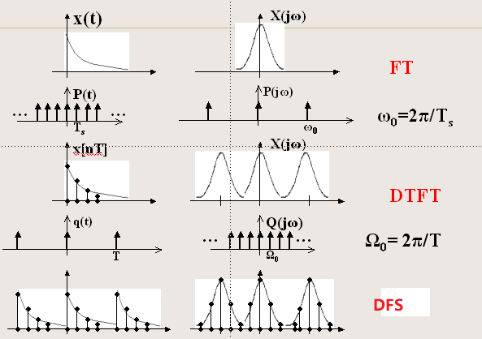
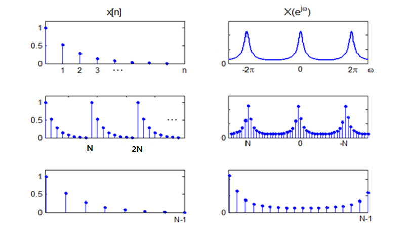
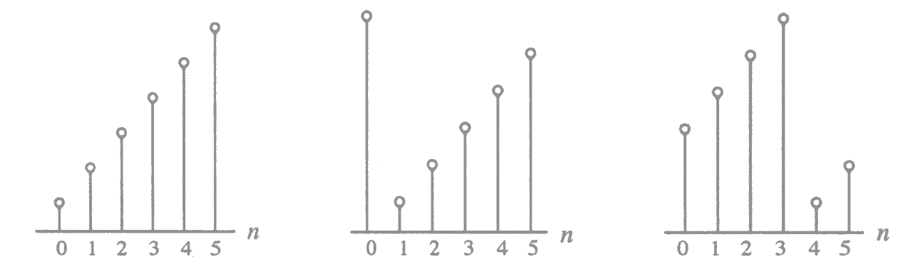
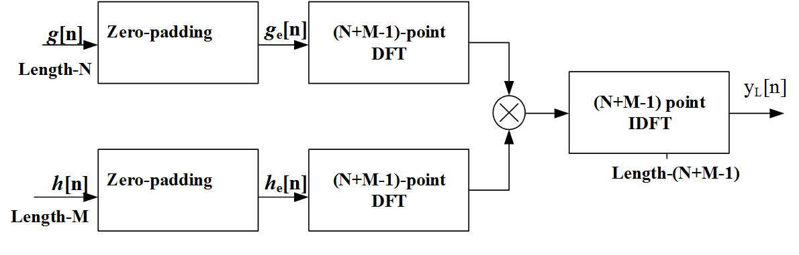
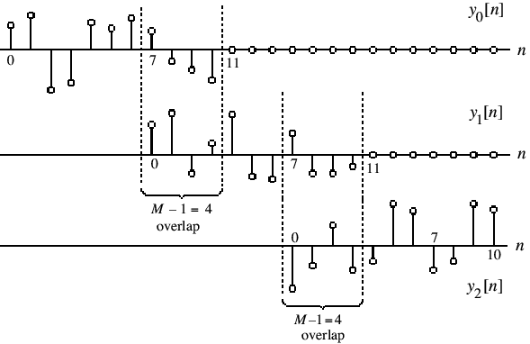
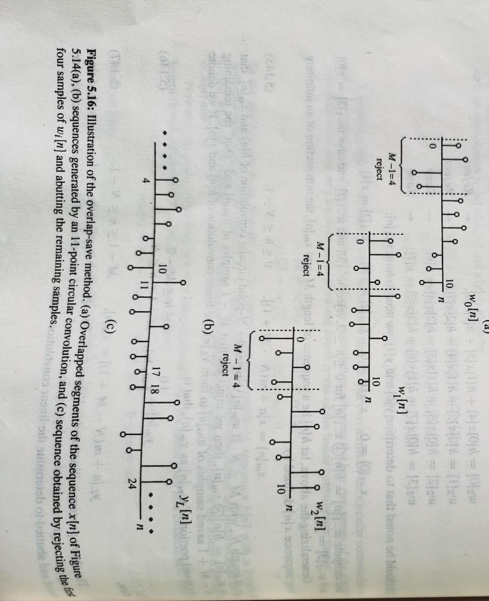

# 第 5 章：离散傅里叶变换 (Discrete Fourier Transform, DFT)

## 0. 本章学习目标

学完本章后，你应该能够：

- 理解正交变换的一般框架，知道 DFT 是正交变换的一种
- 写出 DFT 正变换和逆变换的完整定义公式，正确使用 $W_N$ 符号
- 理解 DFT 与 DTFT 的关系：DFT 就是对 DTFT 在单位圆上等间隔取 $N$ 个采样点
- 理解频域采样导致的时域混叠效应：$y[n] = \sum_{m=-\infty}^{\infty} x[n + mN]$
- 熟练使用循环移位、循环反转和循环卷积的定义进行计算
- 掌握 DFT 的七大定理：线性、循环移位、频移、对偶、循环卷积、时域相乘、Parseval
- 知道如何用一次 $N$ 点 DFT 同时计算两个实序列的 DFT
- 掌握用 DFT 实现线性卷积的补零法（$L = N+M-1$）
- 理解重叠相加法和重叠保留法的核心思想和工作流程
- 知道有限长序列的四种几何对称类型及其与 FIR 线性相位的关系
- 了解循环前缀在 OFDM 通信中的应用背景

---

## 1. 先用人话理解本章在讲什么

### 这个知识点为什么会出现？

回顾一下你前面学过的三个变换：

- **CTFT（连续时间傅里叶变换）**：时域连续，频域连续。两个都是连续的函数，计算机没法直接算。
- **DTFT（离散时间傅里叶变换）**：时域离散了（$x[n]$ 是一串数字），但频域仍然是连续的（$X(e^{j\omega})$ 是 $\omega$ 的连续函数）。计算机还是没法完全算——你只能取几个 $\omega$ 值代进去求，但不可能取完所有 $\omega$。
- **DFS（离散傅里叶级数）**：时域离散且周期，频域也是离散且周期。两边都是有限个数字，计算机可以算。但问题在于——实际信号多数不是周期的。

DFT 就是为了填上这个坑：**它是 DFS 的"实用版本"**。你把一段有限长的信号 $x[n]$ 看作某个周期序列的一个周期，然后对它做 DFS，只取一个周期的结果，这就是 DFT。

**一句话总结：DFT 让你能用计算机完整计算一段数字信号的频谱，输入 $N$ 个数，输出 $N$ 个数，全部是离散的。**

### 它要解决什么问题？

1. **频谱的数字化表示**：不再用一条连续曲线描述频率分布，而是用 $N$ 个点的数值。计算机存储、传输、处理都很方便。
2. **快速计算的可能性**：因为 DFT 的结构特别规整（旋转因子的周期性、对称性），后来人们发明了 FFT 算法，把计算量从 $O(N^2)$ 降到了 $O(N\log_2 N)$。这是二十世纪最重要的算法之一。
3. **频域滤波的工程基础**：在频域直接操作信号分量（比如去噪、均衡），比在时域做卷积更直观，有时也更高效。

### 它和前后章节有什么关系？

- **前面**：第 3-4 章讲了 DTFT（频域连续），本章 DFT 就是 DTFT 的采样。你从前几章带来的关键工具是：复数运算、欧拉公式 $e^{j\theta} = \cos\theta + j\sin\theta$、以及离散序列的表示 $x[n]$。
- **后面**：下一章通常讲 FFT 的快速算法实现（蝶形运算），之后进入 FIR/IIR 滤波器设计。DFT 是整个频域处理的基石。

### 初学者最容易卡在哪里？

1. **"循环"这个概念从哪里冒出来的？** 因为 DFT 隐含地把 $N$ 点序列当作 $N$ 周期序列的一个周期。这导致移位、反转、卷积都要"模 $N$"进行。不是人为加难度，是数学定义自带的。
2. **DFT 和 DTFT 老是分不清。** 记住：DTFT 是连续的频率曲线，DFT 是上面打的 $N$ 个点。$N$ 越大，点越密，DFT 就越像 DTFT。
3. **"$N$ 点 DFT"是什么意思？** $N$ 是你要计算的频率点的个数，也是你告诉算法"把这个序列当作周期为 $N$ 的信号"的声明。它可以和序列的实际长度不一样。
4. **对称性公式太多。** 不用全背。核心就一条：实序列满足 $X[k] = X^*[\langle -k \rangle_N]$，其他的都可以推出来。

---

## 2. 核心概念

### 2.1 正交变换：DFT 的数学"族谱"

**一句话理解：**
正交变换就是把信号投影到一组互相垂直的基函数上，用投影系数作为信号的另一种表示。DFT 只是其中一种——它的基函数是不同频率的复指数信号。

**正式定义：**

正交变换对的一般形式为：

$$
X[k] = \sum_{n=0}^{N-1} x[n] \psi^*[k, n], \quad 0 \leq k \leq N-1 \quad \text{(分析方程)}
$$

$$
x[n] = \frac{1}{N} \sum_{k=0}^{N-1} X[k] \psi[k, n], \quad 0 \leq n \leq N-1 \quad \text{(综合方程)}
$$

其中 $\psi[k, n]$ 是基序列（basis sequences），满足正交条件：

$$
\frac{1}{N} \sum_{n=0}^{N-1} \psi[k, n] \psi^*[l, n] = \begin{cases} 1, & l = k \\ 0, & l \neq k \end{cases}
$$

**直观例子：**
把 $N$ 点序列想象成 $N$ 维空间中的一个向量。正交变换就是换一个坐标系——新坐标系的每个坐标轴互相垂直。在新坐标系下，信号在每个坐标轴上的坐标值就是 $X[k]$。因为坐标轴互相垂直，这种分解是唯一的、没有信息冗余的。

**补充理解——为什么要关心正交变换这个框架：**
DFT 不是天上掉下来的。同一套"正交变换"框架，换不同的基函数就得到不同名字的变换：

| 变换名称 | 基函数 | 典型用途 |
|---|---|---|
| DFT | 复指数 $e^{-j2\pi kn/N}$ | 频谱分析 |
| DCT | 余弦函数 | 图像压缩 (JPEG) |
| Haar 变换 | 矩形波 | 快速小波分析 |
| Walsh-Hadamard | 方波(+1/-1) | 通信编码 |

理解了正交变换框架，学任何新变换就能抓住"分析方程 + 综合方程 + 基函数"这条主线。

**容易混淆的点：**
- 正交变换是一个大的数学框架，DFT 只是其中一种实例
- 不同变换的正交条件可能写法略有不同，但核心思想一样——基函数之间在定义域上积分或求和为零（"正交"）

---

### 2.2 离散傅里叶级数 (DFS)：DFT 的"前世"

**一句话理解：**
DFS 是对"周期离散序列"的傅里叶级数展开。DFT 就是取 DFS 的一个周期，把波浪号 $\sim$ 去掉。

**正式定义：**

对于一个周期为 $N$ 的序列 $\tilde{x}[n] = \tilde{x}[n + rN]$（$r$ 为任意整数），它的傅里叶级数展开使用基函数：

$$
\left\{ \psi[k, n] = e^{j\left(\frac{2\pi}{N}\right)kn} \right\}, \quad k = 0, 1, 2, \ldots, N-1
$$

DFS 分析方程（从时域到频域）：

$$
\tilde{X}[k] = \sum_{n=0}^{N-1} \tilde{x}[n] e^{-j\frac{2\pi}{N}kn} = \sum_{n=0}^{N-1} \tilde{x}[n] W_N^{kn} \quad \cdots (B)
$$

DFS 综合方程（从频域回到时域）：

$$
\tilde{x}[n] = \frac{1}{N} \sum_{k=0}^{N-1} \tilde{X}[k] e^{j\frac{2\pi}{N}kn} = \frac{1}{N} \sum_{k=0}^{N-1} \tilde{X}[k] W_N^{-kn} \quad \cdots (A)
$$

其中 **$W_N = e^{-j 2\pi / N}$** 是核函数（kernel），俗称"旋转因子"（twiddle factor）。

记作：$\tilde{x}[n] \xleftrightarrow{DFS} \tilde{X}[k]$，或 $\tilde{X}[k] = DFS\{\tilde{x}[n]\}$，$\tilde{x}[n] = IDFS\{\tilde{X}[k]\}$。

**符号详解：**
- $\tilde{x}[n]$：时域周期序列，波浪号明确表示周期性。周期为 $N$。
- $\tilde{X}[k]$：频域周期序列，同样周期为 $N$。
- $k$：频率索引（谐波次数）。$k=0$ 是直流分量（DC），$k=1$ 是基波（fundamental），$k>1$ 是各次谐波（harmonics）。
- 求和只做 $0$ 到 $N-1$：因为信号是周期的，一个周期的信息就包含了全部。

**三个必须理解的性质：**

1. **基函数的物理含义**：$\psi[0, n] = 1$ 就是直流分量（不随时间变化）；$\psi[1, n] = e^{j2\pi n/N}$ 是基波（频率最低的交流分量）；$\psi[k, n]$ 是第 $k$ 次谐波，频率是基波的 $k$ 倍。

2. **正交性验证**：不同频率的基函数在一个周期内求和为零：
   $$
   \sum_{n=0}^{N-1} \psi[k, n] \psi^*[l, n] = \sum_{n=0}^{N-1} e^{j\frac{2\pi}{N}(k-l)n} = \begin{cases} N, & l = k + rN \\ 0, & \text{否则} \end{cases}
   $$
   这是 DFS（以及后续 DFT）所有性质的数学根基。

3. **基函数的周期性**：$\psi[k+N, n] = e^{j\frac{2\pi}{N}(k+N)n} = e^{j\frac{2\pi}{N}kn} \cdot e^{j2\pi n} = e^{j\frac{2\pi}{N}kn} = \psi[k, n]$。基函数本身也是周期的，这导致频域也只能有 $N$ 个独立的值。

---

### 2.3 让现实信号"适配"DFS：采样 + 周期延拓

**一句话理解：**
现实中的信号大多是连续的、非周期的。要能用 DFS（进而用 DFT）处理，必须先采样让它离散，再周期延拓让它"看起来"是周期的。

**图中应该看什么：**
- 最左边：原始的连续时间信号（模拟信号，无限长，非周期）
- 中间：采样后得到离散信号（一串数字，仍非周期）
- 最右边：周期延拓后得到周期离散信号（DFS 可以处理了）

**三种实际情形：**

- **情形一**：$x[n]$ 本身恰好是长度为 $N$ 的有限长序列。最简单，直接把它看成一个周期。
- **情形二**：$x[n]$ 是无限长序列。必须先截断（加窗，windowing），取前 $N$ 个点，再进行周期延拓。截断会引入频谱泄漏（spectral leakage）和失真。
- **情形三**：$x[n]$ 是有限长但长度大于 $N$。按 $N$ 点做 DFT 就会产生时域混叠。

---

### 2.4 时域--频域对偶关系总表（傅里叶家族族谱）

在深入 DFT 之前，先用一张表把整个"傅里叶变换家族"的关系理清：

| 时域 | 变换名称 | 频域 |
|---|---|---|
| 连续、非周期 | CTFT（连续时间傅里叶变换） | 连续、非周期 |
| 连续、周期 | FS（傅里叶级数） | 非周期、离散 |
| 离散、非周期 | DTFT（离散时间傅里叶变换） | 周期、连续 |
| **离散、周期** | **DFS / DFT** | **周期、离散** |

规律：**时域和频域总是"反着来的"**。时域连续，频域就非周期；时域离散，频域就周期。DFT 位于最下面一行：时域既离散又周期，频域也既离散又周期——这才是计算机最喜欢的"两端都是有限个数字"的理想情形。

**图中应该看什么：**
- 顶层：连续非周期信号的 CTFT，两端都是连续函数（计算机无法处理）
- 向下走：时域采样 $\to$ 时域离散，频域变周期 $\to$ DTFT（频域仍是连续的）
- 继续走：时域周期延拓 $\to$ 时域也变周期，频域也随之离散 $\to$ DFS
- DFT 就是 DFS 取一个周期：$X[k] = \tilde{X}[k]$ for $0 \leq k \leq N-1$

---

### 2.5 DFT 的正定义：本章的"宪法第一条"

**一句话理解：**
DFT 就是 DFS 去掉波浪号——只定义在 $n=0,1,\ldots,N-1$ 和 $k=0,1,\ldots,N-1$ 的有限区间上。

**DFT 正变换（分析方程）：**

$$
X[k] = \sum_{n=0}^{N-1} x[n] W_N^{kn}, \quad 0 \leq k \leq N-1
$$

**DFT 逆变换（综合方程，IDFT）：**

$$
x[n] = \frac{1}{N} \sum_{k=0}^{N-1} X[k] W_N^{-kn}, \quad 0 \leq n \leq N-1
$$

其中 **$W_N = e^{-j 2\pi / N}$** 是旋转因子。

记作 $x[n] \xleftrightarrow{DFT} X[k]$。

**每个符号逐个讲清楚：**

| 符号 | 含义 | 范围 |
|---|---|---|
| $n$ | 时域索引（第几个样本） | $0, 1, \ldots, N-1$ |
| $k$ | 频域索引（第几个频率分量） | $0, 1, \ldots, N-1$ |
| $x[n]$ | 第 $n$ 个时域样本值（可以是复数） | — |
| $X[k]$ | 第 $k$ 个频域分量值（一般是复数） | — |
| $W_N$ | $e^{-j2\pi/N}$，旋转因子。复平面单位圆上角度 $-2\pi/N$ 的点 | — |
| $W_N^{kn}$ | $e^{-j2\pi kn/N}$，把 $W_N$ 乘幂 $kn$ 次 | — |
| $N$ | DFT 的点数 | 正整数 |

**这个公式在干什么：**
对每个 $k$（每个频率），把信号 $x[n]$ 的 $N$ 个样本分别乘以对应的复指数权重 $W_N^{kn}$，然后全部加起来。$W_N^{kn} = e^{-j 2\pi kn/N}$ 可以看作一个"频率探针"——它和信号中同频率的成分产生共振（内积大），和不同频率的成分抵消（内积趋于零）。

**DFT 定义的自洽性验证（建议跟着推一遍）：**

把 IDFT 代回 DFT 的右边：
$$
\sum_{n=0}^{N-1} x[n] W_N^{kn} = \sum_{n=0}^{N-1} \left( \frac{1}{N} \sum_{l=0}^{N-1} X[l] W_N^{-ln} \right) W_N^{kn} = \frac{1}{N} \sum_{l=0}^{N-1} X[l] \left( \sum_{n=0}^{N-1} W_N^{(k-l)n} \right)
$$

由正交性恒等式 $\sum_{n=0}^{N-1} W_N^{(k-l)n} = N$（当 $k=l$），否则为 $0$，所以括号内非零只当 $l=k$，最终恰好等于 $X[k]$。推导自洽——定义没有内在矛盾。

**最容易犯的三个错误：**

1. **正负号混淆**：正变换是 $X[k] = \sum x[n] W_N^{kn}$，$W_N$ 本身是 $e^{-j2\pi/N}$，所以指数 $kn$ 前是正号但实际效果等价于 $e^{-j2\pi kn/N}$。逆变换指数是 $-kn$，不要反过来写。
2. **忘记 $1/N$**：正变换不加系数，逆变换有 $1/N$。考试常在这个地方扣分。
3. **求和范围**：一定是从 0 到 $N-1$，不是从 1 到 $N$。

---

### 2.6 两道入门例题——先感觉一下 DFT 长什么样

**例题 A：单位冲激的 DFT**
$$
x[n] = \begin{cases} 1, & n = 0 \\ 0, & 1 \leq n \leq N-1 \end{cases}
$$

算它的 DFT：只有 $n=0$ 处非零，
$$
X[k] = \sum_{n=0}^{N-1} x[n] W_N^{kn} = 1 \cdot W_N^0 = 1, \quad 0 \leq k \leq N-1
$$

所有频率分量都是 1。物理含义：一个理想的瞬间脉冲，包含了所有频率的成分且幅度相等。这是时频对偶的极端体现——时域最"窄"的信号，频域最"宽"。

**例题 B：余弦序列的 DFT**
$$
g[n] = \cos(2\pi r n / N), \quad 0 \leq n \leq N-1, \quad 0 \leq r \leq N-1
$$

用欧拉公式拆开：
$$
g[n] = \frac{1}{2}\left(e^{j2\pi rn/N} + e^{-j2\pi rn/N}\right) = \frac{1}{2}\left(W_N^{-rn} + W_N^{rn}\right)
$$

代入 DFT 定义：
$$
G[k] = \frac{1}{2}\sum_{n=0}^{N-1} W_N^{-(r-k)n} + \frac{1}{2}\sum_{n=0}^{N-1} W_N^{(r+k)n}
$$

利用正交恒等式，第一项只在 $k=r$ 时为 $N$，第二项只在 $k=N-r$ 时为 $N$。所以：
$$
G[k] = \begin{cases} N/2, & k = r \\ N/2, & k = N-r \\ 0, & \text{其他} \end{cases}
$$

当 $N=16, r=3$ 时：$G[3] = G[13] = 8$，其余都是 0。

**关键理解：** 一个实余弦信号在 DFT 中产生两个对称的峰——这就是实序列共轭对称性的直观体现。两个峰的位置一个在 $k=r$，一个在 $k=N-r$，幅度相等。

---

### 2.7 DFT 的矩阵形式：另一种视角

**一句话理解：**
DFT 可以写成矩阵乘法 $X = D_N x$，其中 $D_N$ 是一个 $N\times N$ 的矩阵（元素是 $W_N$ 的幂）。这样既好理解，又方便编程实现。

**$N \times N$ DFT 矩阵** $D_N$，其第 $k$ 行第 $n$ 列的元素为 $[D_N]_{k,n} = W_N^{kn}$（$k, n$ 从 $0$ 开始）：

$$
D_N = \begin{bmatrix}
1 & 1 & 1 & \cdots & 1 \\
1 & W_N^1 & W_N^2 & \cdots & W_N^{N-1} \\
1 & W_N^2 & W_N^4 & \cdots & W_N^{2(N-1)} \\
\vdots & \vdots & \vdots & \ddots & \vdots \\
1 & W_N^{N-1} & W_N^{2(N-1)} & \cdots & W_N^{(N-1)^2}
\end{bmatrix}
$$

**IDFT 矩阵**：$D_N^{-1} = \frac{1}{N} D_N^*$（IDFT 矩阵 = 共轭再除以 $N$）。

$N=4$ 时的具体例子：
$$
D_4 = \begin{bmatrix}
1 & 1 & 1 & 1 \\
1 & -j & -1 & j \\
1 & -1 & 1 & -1 \\
1 & j & -1 & -j
\end{bmatrix}, \quad
D_4^{-1} = \frac{1}{4}\begin{bmatrix}
1 & 1 & 1 & 1 \\
1 & j & -1 & -j \\
1 & -1 & 1 & -1 \\
1 & -j & -1 & j
\end{bmatrix}
$$

注意 $W_4 = e^{-j2\pi/4} = e^{-j\pi/2} = -j$，所以 $W_4^1 = -j$，$W_4^2 = (-j)^2 = -1$，$W_4^3 = (-j)^3 = j$。

---

### 2.8 DFT 和 DTFT 的关系：本章最重要的一节

**一句话理解：**
DFT 就是对 DTFT 在单位圆上从 $k=0$ 开始，等间隔取 $N$ 个点。

**正式推导：**

对于长度为 $N$（或补零到 $N$）的序列 $x[n]$，它的 DTFT 是：
$$
X(e^{j\omega}) = \sum_{n=0}^{N-1} x[n] e^{-j\omega n}
$$

现在在 $\omega_k = 2\pi k/N$ 的位置采样：
$$
X(e^{j\omega_k}) = \sum_{n=0}^{N-1} x[n] e^{-j(2\pi k/N)n} = \sum_{n=0}^{N-1} x[n] W_N^{kn} = X[k]
$$

恰好就是 DFT！所以：
$$
X[k] = X(e^{j\omega}) \big|_{\omega = 2\pi k/N}, \quad 0 \leq k \leq N-1
$$

**在复平面的直观理解：**
单位圆上一共有 $N$ 个等分点，角度分别为 $0, 2\pi/N, 4\pi/N, \ldots, 2\pi(N-1)/N$。DFT 就是在这些角度上计算 DTFT 的值。$k=0$ 对应角度 0（实轴正方向，直流），$k=N/2$ 对应角度 $\pi$（实轴负方向，Nyquist 频率）。

---

### 2.9 从 DFT 恢复 DTFT：频域插值

**一句话理解：**
知道了 $N$ 个离散的 $X[k]$，能不能还原出连续的 $X(e^{j\omega})$？可以，用插值公式。

**推导思路：**

从 IDFT 出发：
$$
x[n] = \frac{1}{N} \sum_{k=0}^{N-1} X[k] W_N^{-kn}
$$

代入 DTFT 定义：
$$
X(e^{j\omega}) = \sum_{n=0}^{N-1} x[n] e^{-j\omega n} = \sum_{n=0}^{N-1} \left( \frac{1}{N} \sum_{k=0}^{N-1} X[k] W_N^{-kn} \right) e^{-j\omega n}
$$

交换求和顺序并整理：
$$
X(e^{j\omega}) = \sum_{k=0}^{N-1} X[k] \cdot \underbrace{\left( \frac{1}{N} \sum_{n=0}^{N-1} e^{-j(\omega - 2\pi k/N)n} \right)}_{\Phi_k(\omega)}
$$

插值函数 $\Phi_k(\omega)$ 是一个类 sinc 函数：
$$
\Phi_k(\omega) = \frac{1}{N} \cdot \frac{\sin\left(\frac{\omega N - 2\pi k}{2}\right)}{\sin\left(\frac{\omega N - 2\pi k}{2N}\right)} \cdot e^{-j(\omega - 2\pi k/N)\frac{N-1}{2}}
$$

它的关键性质：在 $\omega = 2\pi k/N$ 处 $\Phi_k(\omega) = 1$，在其他采样点 $\omega = 2\pi l/N$ ($l \neq k$) 处 $\Phi_k(\omega) = 0$。这就是插值的标准行为——每个采样点"支配"自己的频率位置，不影响其他采样点。

**不必背这个公式，但要知道结论：DFT 和 DTFT 是等价的信息表示——知道 DFT 就等于知道 DTFT 的全部。**

---

### 2.10 用 DFT 计算 DTFT 的近似值：补零法

实际中常需要看 DTFT 的"样子"（大体形状），但不想用连续的公式画。做法很简单：

1. 把长度 $N$ 的序列补零到 $M$（$M \gg N$）
2. 做 $M$ 点 DFT
3. 得到 $M$ 个频率点的值，间隔为 $2\pi/M$（远小于 $2\pi/N$）

这些点上的 DFT 值近似 DTFT 的取值。$M$ 越大，采样越密，看起来越像连续曲线。

**重要概念澄清：补零不增加频率分辨率。**
补零只是让你看到更多的频率点（插值效果），让曲线看起来更光滑。真正的频率分辨率由原始数据的实际长度 $N$ 决定——$N$ 越大，才能分辨越接近的两个频率。MATLAB 函数 `freqz` 就是用这个思路工作的。

---

### 2.11 对 DTFT 采样与混叠：一个容易犯错的坑

**问题：** 如果对任意序列（不限长度 $N$）的 DTFT 在 $N$ 个等分点上采样，再做 $N$ 点 IDFT，得到的序列 $y[n]$ 和原序列 $x[n]$ 是什么关系？

**推导：**

采样后的频率序列为 $Y[k] = X(e^{j2\pi k/N})$。由 DTFT 定义：
$$
Y[k] = \sum_{l=-\infty}^{\infty} x[l] e^{-j2\pi kl/N} = \sum_{l=-\infty}^{\infty} x[l] W_N^{kl}
$$

做 $N$ 点 IDFT：
$$
y[n] = \frac{1}{N} \sum_{k=0}^{N-1} Y[k] W_N^{-kn} = \sum_{l=-\infty}^{\infty} x[l] \underbrace{\left( \frac{1}{N} \sum_{k=0}^{N-1} W_N^{-k(n-l)} \right)}_{=\delta[n-l+mN],\; m \in \mathbb{Z}}
$$

**最终结论：**
$$
y[n] = \sum_{m=-\infty}^{\infty} x[n + mN], \quad 0 \leq n \leq N-1
$$

这就是**时域混叠**（time-domain aliasing）公式——频域采样相当于把时域信号以 $N$ 为周期折叠叠加。

**两种情形：**
- 原序列长 $M \leq N$：没有混叠，$y[n] = x[n]$（$0 \leq n \leq N-1$），可以完全恢复。
- 原序列长 $M > N$：产生混叠，$y[n] \neq x[n]$，原序列无法恢复。

**具体例子：**
$x[n] = \{0, 1, 2, 3, 4, 5\}$（长度 6），$N = 4$：
$$
y[0] = x[0] + x[4] = 0 + 4 = 4
$$
$$
y[1] = x[1] + x[5] = 1 + 5 = 6
$$
$$
y[2] = x[2] = 2
$$
$$
y[3] = x[3] = 3
$$

结果 $\{y[n]\} = \{4, 6, 2, 3\}$，原序列 $\{0, 1, 2, 3, 4, 5\}$ 已经丢了。

---

### 2.12 循环移位 (Circular Shift)：转圈圈地移动

**一句话理解：**
想象把序列放在一个圆环上，移位就是沿圆环转。从一头移出去的元素从另一头绕回来。

**正式定义：**
$$
x[\langle n - n_0 \rangle_N] = \begin{cases}
x[n - n_0], & n_0 \leq n \leq N-1 \\
x[N - n_0 + n], & 0 \leq n < n_0
\end{cases}
$$

其中 $\langle \cdot \rangle_N$ 是模 $N$ 运算。例如 $\langle -1 \rangle_6 = 5$，$\langle 7 \rangle_6 = 1$。

**图中应该看什么：**
- 最上行：原始序列 $x[n]$，$N=6$
- 中间行：循环左移 1 位 $x[\langle n-1 \rangle_6]$，最左边元素跑到最右边
- 最下行：循环左移 4 位 $x[\langle n-4 \rangle_6]$（等价于循环右移 2 位）

**普通移位 vs 循环移位对比：**

| | 普通移位（线性移位） | 循环移位 |
|---|---|---|
| 移出边界的元素 | 丢弃，没了 | 绕回来，从另一端出现 |
| 空出的位置 | 补零 | 由绕回的元素填充 |
| 结果序列长度 | 可能变长 | 始终保持 $N$ |
| 与 DFT 的关系 | 没有简单的 DFT 对应关系 | 有定理：$x[\langle n-n_0\rangle_N] \leftrightarrow W_N^{kn_0}X[k]$ |

**为什么 DFT 中移位是循环的：**
因为 DFT 在数学上定义在 $0$ 到 $N-1$ 的闭区间上，且隐含周期性。$n<0$ 或 $n \geq N$ 的位置在数学上等价于 $n+N$ 或 $n-N$（通过周期性），所以移位必然"循环"。

---

### 2.13 循环反转 (Circular Reversal)：转圈圈地倒序

**一句话理解：**
在圆环上把序列反序：$n=0$ 原地不动，$n=1$ 和 $n=N-1$ 互换，$n=2$ 和 $n=N-2$ 互换，以此类推。

**正式定义：**
$$
x[\langle -n \rangle_N] = \begin{cases}
x[0], & n = 0 \\
x[N - n], & 1 \leq n \leq N-1
\end{cases}
$$

**具体例子：**
$x[n] = \{a, b, c, d\}$（$N=4$），则：
- $x[\langle -0 \rangle_4] = x[0] = a$
- $x[\langle -1 \rangle_4] = x[3] = d$
- $x[\langle -2 \rangle_4] = x[2] = c$
- $x[\langle -3 \rangle_4] = x[1] = b$

循环反转结果：$\{a, d, c, b\}$。

---

### 2.14 循环卷积 (Circular Convolution)：在圆环上做卷积

**一句话理解：**
用循环移位代替普通移位的卷积运算。两个 $N$ 点序列的循环卷积结果也是 $N$ 点。

**正式定义：**
$$
y_C[n] = \sum_{m=0}^{N-1} g[m] h[\langle n - m \rangle_N], \quad 0 \leq n \leq N-1
$$

记作 $y_C[n] = g[n] \circledast_N h[n]$。

**循环卷积的矩阵形式（重要！）：**

$$
\begin{bmatrix} y_C[0] \\ y_C[1] \\ y_C[2] \\ \vdots \\ y_C[N-1] \end{bmatrix} =
\begin{bmatrix}
h[0] & h[N-1] & h[N-2] & \cdots & h[1] \\
h[1] & h[0] & h[N-1] & \cdots & h[2] \\
h[2] & h[1] & h[0] & \cdots & h[3] \\
\vdots & \vdots & \vdots & \ddots & \vdots \\
h[N-1] & h[N-2] & h[N-3] & \cdots & h[0]
\end{bmatrix}
\begin{bmatrix} g[0] \\ g[1] \\ g[2] \\ \vdots \\ g[N-1] \end{bmatrix}
$$

这个矩阵叫**循环矩阵**（circulant matrix）——每一行是上一行循环右移一位。

**循环卷积 vs 线性卷积对比：**

| | 线性卷积 $y_L[n]$ | $N$ 点循环卷积 $y_C[n]$ |
|---|---|---|
| 定义 | $\sum_m g[m] h[n-m]$ | $\sum_m g[m] h[\langle n-m \rangle_N]$ |
| 结果长度 | $N+M-1$ | $N$ |
| 移位方式 | 普通移位 | 模 $N$ 的循环移位 |
| DFT 关系 | 无直接对应 | **$Y_C[k] = G[k] \cdot H[k]$** |

**循环卷积定理是 DFT 最重要的定理：时域做循环卷积 = 频域逐点相乘。**

---

### 2.15 循环卷积的表格计算法（Tabular Method）

对于较短序列，可以用表格快速计算循环卷积。以例题 4 的 $g[n]=\{1,2,0,1\}$、$h[n]=\{2,2,1,1\}$ 的 4 点循环卷积为例：

把 $g$ 写在第一行，$h$ 写在第二行。然后在第三行开始，计算各 $n$ 下的贡献值：

| $n$ | 0 | 1 | 2 | 3 | 4 | 5 |
|---|---|---|---|---|---|---|
| $g[n]$ | 1 | 2 | 0 | 1 | — | — |
| $h[n]$ | 2 | 2 | 1 | 1 | — | — |
| $g[m]h[\langle 0-m \rangle]$ | $1\cdot2$ | $2\cdot1$ | $0\cdot1$ | $1\cdot2$ | | |
| $g[m]h[\langle 1-m \rangle]$ | $1\cdot2$ | $2\cdot2$ | $0\cdot1$ | $1\cdot1$ | | |
| $g[m]h[\langle 2-m \rangle]$ | $1\cdot1$ | $2\cdot2$ | $0\cdot2$ | $1\cdot1$ | | |
| $g[m]h[\langle 3-m \rangle]$ | $1\cdot1$ | $2\cdot1$ | $0\cdot2$ | $1\cdot2$ | | |
| **$y_C[n]$** | **6** | **7** | **6** | **5** | | |

每行加起来就是对应的 $y_C[n]$。

---

### 2.16 有限长序列的共轭对称分类

**一句话理解：**
和普通信号的奇偶对称类似，但对称操作使用循环反转（因为 DFT 隐含周期性）。

**(1) 循环共轭对称序列：**
$$
x[n] = x^*[\langle -n \rangle_N] = x^*[\langle N-n \rangle_N], \quad 0 \leq n \leq N-1
$$

**(2) 循环共轭反对称序列：**
$$
x[n] = -x^*[\langle -n \rangle_N] = -x^*[\langle N-n \rangle_N], \quad 0 \leq n \leq N-1
$$

**任意复序列的分解：**
$$
x[n] = x_{cs}[n] + x_{ca}[n], \quad 0 \leq n \leq N-1
$$

其中：
$$
x_{cs}[n] = \frac{1}{2}\left(x[n] + x^*[\langle -n \rangle_N]\right) \quad \text{(循环共轭对称部分)}
$$

$$
x_{ca}[n] = \frac{1}{2}\left(x[n] - x^*[\langle -n \rangle_N]\right) \quad \text{(循环共轭反对称部分)}
$$

**对于实序列的退化形式：**
$$
x_{ev}[n] = \frac{1}{2}\left(x[n] + x[\langle -n \rangle_N]\right) \quad \text{(循环偶部)}
$$
$$
x_{od}[n] = \frac{1}{2}\left(x[n] - x[\langle -n \rangle_N]\right) \quad \text{(循环奇部)}
$$

---

### 2.17 几何对称与 FIR 滤波器的四种类型

**一句话理解：**
序列关于几何中点 $(N-1)/2$ 的对称性或反对称性，决定了 FIR 滤波器的相位类型。这种对称保证了线性相位（所有频率分量延迟相同），从而波形不失真。

**两种基本对称类型：**

- **对称序列（Symmetric）**：$x[n] = x[N - 1 - n]$
- **反对称序列（Antisymmetric）**：$x[n] = -x[N - 1 - n]$

配合长度 $N$ 的奇偶性，形成四种组合：

| 类型 | 对称性 | 长度 $N$ | 相位函数 | 群延迟 |
|---|---|---|---|---|
| Type 1 | 对称 $x[n]=x[N-1-n]$ | 奇数 | $\theta(\omega) = -\frac{N-1}{2}\omega + \beta$ | $\frac{N-1}{2}$ |
| Type 2 | 对称 | 偶数 | $\theta(\omega) = -\frac{N-1}{2}\omega + \beta$ | $\frac{N-1}{2}$ |
| Type 3 | 反对称 $x[n]=-x[N-1-n]$ | 奇数 | $\theta(\omega) = -\frac{N-1}{2}\omega + \frac{\pi}{2} + \beta$ | $\frac{N-1}{2}$ |
| Type 4 | 反对称 | 偶数 | $\theta(\omega) = -\frac{N-1}{2}\omega + \frac{\pi}{2} + \beta$ | $\frac{N-1}{2}$ |

**其中的物理含义：**
- $-\frac{N-1}{2}\omega$ 是线性相位项，意味着所有频率延迟相同的群延迟 $\tau_g = \frac{N-1}{2}$ 个样本，这是"线性相位"的核心。
- Type 3/4 比 Type 1/2 多一个 $\frac{\pi}{2}$（90度）的固定相移。这意味着输出信号有一个整体的 90 度相位旋转。

**为什么这四种类型重要：**
设计 FIR 滤波器时，选定一个类型后，只需设计一半的系数（另一半由对称性自动确定），设计自由度减半。这四种类型覆盖了所有能实现线性相位的 FIR 滤波器结构。

---

### 2.18 DFT 的对称关系（课件表 5.1 和 5.2 精讲）

**表 5.1：一般（复）序列的 DFT 对称关系**

| 时域 $x[n]$（长度 $N$） | 频域 $X[k]$（$N$ 点 DFT） |
|---|---|
| $x[n]$ | $X[k]$ |
| $x^*[n]$ | $X^*[\langle -k \rangle_N]$ |
| $x^*[\langle -n \rangle_N]$ | $X^*[k]$ |
| $\text{Re}\{x[n]\}$ | $X_{cs}[k] = \frac{1}{2}(X[k] + X^*[\langle -k \rangle_N])$ |
| $j\,\text{Im}\{x[n]\}$ | $X_{ca}[k] = \frac{1}{2}(X[k] - X^*[\langle -k \rangle_N])$ |
| $x_{cs}[n]$（共轭对称部分） | $\text{Re}\{X[k]\}$ |
| $x_{ca}[n]$（共轭反对称部分） | $j\,\text{Im}\{X[k]\}$ |

**记忆规律：** 时域和频域的关系高度"对偶"——时域取共轭对应频域反转后取共轭；时域实部映射到频域的共轭对称部分；时域的共轭对称部分映射到频域的实部。

**表 5.2：实序列的 DFT 特殊关系（最常用！）**

若 $x[n]$ 为实序列：

| 时域 | 频域 |
|---|---|
| 实 $x[n]$ | $X[k] = X^*[\langle -k \rangle_N]$ |
| $x_{ev}[n]$（循环偶部） | $\text{Re}\{X[k]\}$ |
| $x_{od}[n]$（循环奇部） | $j\,\text{Im}\{X[k]\}$ |

**从 $X[k] = X^*[\langle -k \rangle_N]$ 可以推导出：**
- 幅度偶对称：$|X[k]| = |X[\langle -k \rangle_N]|$
- 相位奇对称：$\arg X[k] = -\arg X[\langle -k \rangle_N]$
- 实部偶对称：$\text{Re}X[k] = \text{Re}X[\langle -k \rangle_N]$
- 虚部奇对称：$\text{Im}X[k] = -\text{Im}X[\langle -k \rangle_N]$

**实际应用例子：**
已知 $N=14$ 实序列，$X[2] = -1 + j3$，求 $X[12]$：
$$
X[12] = X^*[\langle -12 \rangle_{14}] = X^*[2] = -1 - j3
$$
验证：$|X[12]| = |X[2]| = \sqrt{10}$，幅度对称。

---

### 2.19 DFT 的七大定理（课件表 5.3 精讲）

| 编号 | 定理 | 时域 | $N$ 点 DFT |
|---|---|---|---|
| 1 | **线性（Linearity）** | $a g[n] + b h[n]$ | $a G[k] + b H[k]$ |
| 2 | **循环移位（Circular Time-shift）** | $g[\langle n-n_0 \rangle_N]$ | $W_N^{k n_0} G[k]$ |
| 3 | **频移（Frequency-shift / Modulation）** | $W_N^{-k_0 n} g[n]$ | $G[\langle k-k_0 \rangle_N]$ |
| 4 | **对偶性（Duality）** | $G[n]$ | $N g[\langle -k \rangle_N]$ |
| 5 | **循环卷积（Circular Convolution）** | $\sum_m g[m] h[\langle n-m \rangle_N]$ | $G[k] \cdot H[k]$ |
| 6 | **时域相乘（Modulation / Windowing）** | $g[n] h[n]$ | $\frac{1}{N}\sum_m G[m] H[\langle k-m \rangle_N]$ |
| 7 | **Parseval 关系（能量守恒）** | $\sum_{n=0}^{N-1} |x[n]|^2$ | $\frac{1}{N}\sum_{k=0}^{N-1} |X[k]|^2$ |

**逐条解释要点：**

**定理 1 -- 线性**：DFT 是线性运算，加减乘常数都可以"穿进去"。

**定理 2 -- 循环移位定理**：时域循环移位 $n_0$ 步，频域只是乘一个相位因子 $W_N^{kn_0}$。幅度谱 $|X[k]|$ 不变（移位不改变频率成分的强度）。

**定理 3 -- 频移定理（调制）**：时域乘复指数 $W_N^{-k_0n} = e^{j2\pi k_0 n/N}$，频域循环移位 $k_0$ 步。这就是数字通信中"频谱搬移"的数学基础。

**定理 4 -- 对偶性**：如果 $g[n]$ 的 DFT 是 $G[k]$，那么把 $G[n]$（在 $n$ 位置填入原来的频域值）再做 DFT，结果就是 $N g[\langle -k \rangle_N]$（除了乘 $N$ 和反转）。这表明 DFT 在数学上非常"对称"。

**定理 5 -- 循环卷积定理**（最重要！）：时域做循环卷积 = 频域逐点相乘。这是用 DFT 做卷积计算的理论基础。

**定理 6 -- 调制定理（频域卷积）**：定理 5 的对偶形式。时域逐点相乘 = 频域做循环卷积再除以 $N$。窗函数（加窗）的频谱效应由此定理解释。

**定理 7 -- Parseval 定理**：信号在时域的总能量 = 频域总能量除以 $N$。能量在变换过程中守恒。

---

### 2.20 频域滤波 (Fourier-Domain Filtering)

**一句话理解：**
直接用 DFT 把信号变到频域，把不想要的频率分量对应的 $X[k]$ 设为 0，再 IDFT 回来——这就是频域滤波。

**操作步骤：**
1. 计算 $x[n]$ 的 $N$ 点 DFT：$X[k]$
2. 在频域乘一个掩码 $H[k]$（想保留的频率 $k$ 处 $H[k]=1$，想去掉的频率处 $H[k]=0$）
3. $Y[k] = X[k] \cdot H[k]$
4. IDFT 得到滤波后信号 $y[n]$

**需要注意的两个实际效应：**

1. **吉布斯波纹（Gibbs ripple）**：频域突变（从 1 突变成 0）对应时域 sinc 函数的振荡，导致滤波后信号出现不需要的波纹。实际中用渐变（tapered）过渡带而非硬截断。

2. **实信号的虚部**：对于实输入信号，理论上 IDFT 结果应该是纯实数。但由于频域掩码可能破坏共轭对称性，以及计算精度的原因，结果可能带很小的虚部。实际操作中直接取实部 $\text{Re}\{y[n]\}$ 即可。

---

### 2.21 实序列 DFT 的计算技巧

大部分实际信号都是实的（声音、电压、图像等）。利用 DFT 的对称性，可以"一次 DFT 算两份"。

**技巧一：用一次 $N$ 点 DFT 计算两个实序列的 DFT**

设 $g[n]$ 和 $h[n]$ 是两个长度为 $N$ 的实序列。构造复序列：
$$
x[n] = g[n] + j h[n]
$$

计算 $x[n]$ 的 $N$ 点 DFT $X[k]$。然后分离：
$$
G[k] = \frac{1}{2}\left(X[k] + X^*[\langle -k \rangle_N]\right)
$$
$$
H[k] = \frac{1}{2j}\left(X[k] - X^*[\langle -k \rangle_N]\right)
$$

这就是利用"实部 $\to$ 共轭对称部分"的对称关系反推出来的。

**技巧二：用 $N$ 点 DFT 计算长度 $2N$ 的实序列的 DFT**

设 $v[n]$ 是长 $2N$ 的实序列。定义两个长 $N$ 的序列：
$$
g[n] = v[2n], \quad h[n] = v[2n+1], \quad 0 \leq n \leq N-1
$$

按技巧一求出 $G[k]$ 和 $H[k]$，则：
$$
V[k] = G[\langle k \rangle_N] + W_{2N}^k H[\langle k \rangle_N], \quad 0 \leq k \leq 2N-1
$$

这个公式是"按时间抽取"（DIT）FFT 算法的雏形。

---

### 2.22 用 DFT 实现线性卷积：补零法

**核心问题：** 线性卷积的结果长度是 $N+M-1$，但 $N$ 点循环卷积的结果只有 $N$ 点。怎么用 DFT（频域相乘）算出正确的线性卷积？

**答案：** 补零到够长。

设 $g[n]$ 长 $N$，$h[n]$ 长 $M$，线性卷积 $y_L[n]$ 长 $L = N+M-1$。定义两个长 $L$ 的补零序列：
$$
g_e[n] = \begin{cases} g[n], & 0 \leq n \leq N-1 \\ 0, & N \leq n \leq L-1 \end{cases}
$$

$$
h_e[n] = \begin{cases} h[n], & 0 \leq n \leq M-1 \\ 0, & M \leq n \leq L-1 \end{cases}
$$

则：
$$
y_L[n] = g[n] * h[n] = g_e[n] \circledast_L h_e[n]
$$

**图中应该看什么：** 两条支路分别补零到 $L$ $\to$ 分别做 $L$ 点 DFT $\to$ 频域逐点相乘 $\to$ $L$ 点 IDFT $\to$ 输出就是正确的线性卷积结果。

**为什么要绕这么大一圈？** 因为直接计算线性卷积是 $O(NM)$。当 $N$ 和 $M$ 都很大时，FFT 的计算量 $O(L\log_2 L)$ 远小于直接卷积。这是 DFT 在工程上的核心价值之一。

---

### 2.23 循环前缀 (Cyclic Prefix)：DFT 在通信中的应用

**背景：** 在 OFDM（正交频分复用，用于 WiFi、4G/5G）系统中，每个数据块通过 IDFT 生成时域信号。信号经过无线信道时，多径传播造成符号间干扰。

**做法：** 在每个数据块前面，复制末尾几个样本作为"循环前缀"（Cyclic Prefix）。这样，信道带来的线性卷积效应在接收端**转化为循环卷积**。

**好处：** 循环卷积对应频域的逐点相乘（DFT 定理 5），所以接收端只需要在频域每个子载波上做一个**单抽头的乘法**（除以信道频率响应的值），就能完成均衡，而不是做复杂的时域解卷积。这是 DFT 理论在通信系统中的"杀手级"应用。

---

### 2.24 重叠相加法 (Overlap-Add Method)

**一句话理解：**
处理"短滤波器 $h[n]$ + 长信号 $x[n]$"的卷积时，把长信号切成不重叠的小段，每段和 $h[n]$ 做线性卷积（用 DFT），相邻段的结果有重叠部分，把它们**加起来**。

**图中应该看什么：**
- $x[n]$ 被切成 $x_0[n], x_1[n], x_2[n], \ldots$，每段长 $N$
- 每段和 $h[n]$ 的线性卷积 $y_m[n]$ 长 $N+M-1$
- 相邻的 $y_m[n]$ 之间有 $M-1$ 个样本重叠
- 重叠部分直接相加

**算法参数：** 每段输入长 $N$，滤波器长 $M$，每段输出长 $N+M-1$，重叠 $M-1$ 个样本。

**MATLAB：** `fftfilt(h, x)` 或 `fftfilt(h, x, N)` 可实现。

---

### 2.25 重叠保留法 (Overlap-Save Method)

**一句话理解：**
另一种思路——输入分段时故意让相邻段之间**有重叠**，每段直接和 $h[n]$ 做**循环卷积**（不做补零的线性卷积），把结果中受循环效应破坏的前 $M-1$ 个点扔掉，保留后面正确的点，直接拼接起来。

**图中应该看什么：** 输入段 $x_m[n]$ 与前一段有 $M-1$ 个点重叠。每段与 $h[n]$ 做 $N$ 点循环卷积后，结果的前 $M-1$ 点是"脏"的（包含循环混叠效应），丢弃；后 $N-M+1$ 个点是正确的线性卷积结果。所有段保留的正确部分拼接起来就是整个 $y[n]$。

> **为什么前 $M-1$ 点是"脏"的？** 循环卷积把序列末尾的样本绕回来参与开头位置的计算——这就是"循环混叠"。滤波器 $h[n]$ 有 $M$ 个点，所以开头 $M-1$ 个输出位置会受到"绕回"的影响。$N$ 点循环卷积中，只有位置 $M-1, M, \ldots, N-1$ 的计算结果才和线性卷积一致（因为这些位置不会和"绕回"的样本重叠）。

**两种方法的对比：**

| | Overlap-Add | Overlap-Save |
|---|---|---|
| 输入分段 | 各段不重叠 | 相邻段重叠 $M-1$ 点 |
| 每段卷积方式 | 线性卷积（补零 DFT） | 直接循环卷积（不补零） |
| 输出处理 | 重叠区相加 | 丢弃前 $M-1$ 点 |
| 每段有效输出 | $N+M-1$ 点 | $N-M+1$ 点 |
| 计算量 | 每段做 $N+M-1$ 点 FFT | 每段做 $N$ 点 FFT |

选择建议：当 $M$ 较小时 Overlap-Save 可能更高效（FFT 点数小）；两种方法结果在数学上等价，选哪个看具体实现方便。

---

### 2.26 其他变换（课件简要提及）

课件的 5.11、5.12、5.13 节简略提到三种其他变换：

- **STFT（短时傅里叶变换）**：加窗分段做 DFT，得到"频谱随时间变化"的图像（语谱图）。用于语音、音乐分析。
- **DCT（离散余弦变换）**：类似 DFT 但只用余弦基函数。能量集中在少数系数上，压缩性能更优。JPEG、MP3 等标准的核心工具。
- **Haar 变换**：最简单的正交小波变换，基函数是矩形阶梯波。计算极快，适合边缘检测和快速预处理。

这三者在课件中只占一页，但概念上都是"正交变换"的不同实例（回忆 2.1 节），了解即可。

---

## 3. 核心公式汇总

### 3.1 DFT 正变换
$$
X[k] = \sum_{n=0}^{N-1} x[n] W_N^{kn}, \quad 0 \leq k \leq N-1
$$
其中 $W_N = e^{-j 2\pi / N}$。

**用途：** 从时域 $N$ 点求频域 $N$ 点。$|X[k]|$ 是幅度谱，$\angle X[k]$ 是相位谱。

### 3.2 DFT 逆变换 (IDFT)
$$
x[n] = \frac{1}{N} \sum_{k=0}^{N-1} X[k] W_N^{-kn}, \quad 0 \leq n \leq N-1
$$

**与正变换的三个差异：** (1) 指数是 $-kn$，(2) 前面有 $1/N$，(3) 求和变量是 $k$。

### 3.3 正交性恒等式（本章所有推导的基石）
$$
\sum_{n=0}^{N-1} W_N^{(k-l)n} = \begin{cases} N, & k - l = mN \;(m \in \mathbb{Z}) \\ 0, & \text{否则} \end{cases}
$$

### 3.4 循环移位定理
$$
x[\langle n - n_0 \rangle_N] \xleftrightarrow{DFT} W_N^{k n_0} X[k]
$$
时域循环移位 $\to$ 频域乘相位因子。幅度谱不变。

### 3.5 循环卷积定理
$$
g[n] \circledast_N h[n] \xleftrightarrow{DFT} G[k] \cdot H[k]
$$

### 3.6 实序列对称性
$$
X[k] = X^*[\langle -k \rangle_N]
$$

**推论：** 实序列的 $N$ 点 DFT 只需要计算前 $N/2+1$ 个 $X[k]$ 的值，后面的可由对称性推出。

### 3.7 Parseval 定理
$$
\sum_{n=0}^{N-1} |x[n]|^2 = \frac{1}{N} \sum_{k=0}^{N-1} |X[k]|^2
$$

### 3.8 线性卷积用 DFT 的实现公式
令 $L = N+M-1$：
$$
y_L[n] = \text{IDFT}_L \left\{ \text{DFT}_L\{g_e[n]\} \cdot \text{DFT}_L\{h_e[n]\} \right\}
$$

### 3.9 频域混叠公式
对任意序列的 DTFT 作 $N$ 点采样后做 IDFT：
$$
y[n] = \sum_{m=-\infty}^{\infty} x[n + mN], \quad 0 \leq n \leq N-1
$$

### 3.10 两个实序列一次 DFT
$$
G[k] = \frac{1}{2}\left(X[k] + X^*[\langle -k \rangle_N]\right), \quad H[k] = \frac{1}{2j}\left(X[k] - X^*[\langle -k \rangle_N]\right)
$$

### 3.11 $2N$ 点实序列用 $N$ 点 DFT
$$
V[k] = G[\langle k \rangle_N] + W_{2N}^k H[\langle k \rangle_N]
$$

---

## 4. 图像与直观理解

本章六张核心图帮助建立直觉：

- **图 1（信号离散化和周期化流程）**：展示从连续世界信号到 DFS/DFT 可处理信号的完整路径。理解为什么需要"采样"和"周期延拓"两步走。
- **图 2（DTFT/DFS/DFT 关系图谱）**：本章最重要的"导航图"。DFT 位于最下层——时域离散+周期，频域离散+周期。DFT 限定了 DFS 的一个周期，又是 DTFT 的 $N$ 点采样。
- **图 3（循环移位效果）**：直观展示 $N=6$ 序列循环左移 1 位和 4 位后序列的形态。理解"圆环"思维的关键图。
- **图 4（DFT 实现线性卷积的框图）**：补零 $\to$ DFT $\to$ 频域相乘 $\to$ IDFT，信号流程图一目了然。
- **图 5（重叠相加法示意图）**：分段输入、分段卷积、重叠区相加。理解 Overlap-Add 必须看懂这张图。
- **图 6（重叠保留法示意图）**：输入有重叠、循环卷积、丢掉坏点、拼接有效区。与图 5 对照看，理解两种方法的本质差异。

---

## 5. 本章重点总结

| 知识点 | 要记住什么 | 常见错误 |
|---|---|---|
| 正交变换框架 | DFT 是基函数为复指数的正交变换 | 以为正交变换只有 DFT 一种 |
| DFS | $\tilde{x}[n] \leftrightarrow \tilde{X}[k]$，两端周期 | 混淆 DFS 和 DFT 的波浪号 |
| DFT 定义 | $X[k] = \sum x[n] W_N^{kn}$，$W_N=e^{-j2\pi/N}$ | 正负号搞反，忘记 IDFT 的 $1/N$ |
| DFT vs DTFT | DFT = DTFT 单位圆上等间隔 $N$ 采样 | 以为两者完全无关 |
| 频域采样混叠 | $y[n] = \sum_m x[n+mN]$，短序列可恢复 | 序列比 $N$ 长时不补零就做 IDFT |
| 循环移位 | $x[\langle n-n_0 \rangle_N]$，移出绕回 | 用普通移位代替循环移位 |
| 循环卷积 | $y_C[n] = \sum g[m] h[\langle n-m \rangle_N]$ | 和线性卷积混淆 |
| 循环卷积定理 | 时域 $\circledast_N$ = 频域逐点乘 | 不补零就想用它算线性卷积 |
| 实序列对称性 | $X[k] = X^*[\langle -k \rangle_N]$ | 写成 $X[N-k]$（$k=0$ 时出错） |
| 补零法做线性卷积 | 补到 $L = N+M-1$，再 DFT+相乘+IDFT | 补零不够（$L < N+M-1$） |
| Overlap-Add | 输入不重叠，输出重叠 $M-1$ 点相加 | 忘记重叠点数 = $M-1$ |
| Overlap-Save | 输入重叠 $M-1$，丢掉输出前 $M-1$ 点 | 不知道丢哪些点（前 $M-1$） |
| FIR 四类型 | 对称/反对称 × 奇/偶长 = 4 种 | 混淆类型编号 |
| Parseval 定理 | $\sum\|x\|^2 = \frac{1}{N}\sum\|X\|^2$ | 忘记 $1/N$ |

---

## 6. 配套例题

### 例题 1：单位冲激的 DFT（基础概念）

**题目：**
求 $x[n] = \begin{cases} 1, & n = 0 \\ 0, & 1 \leq n \leq N-1 \end{cases}$ 的 $N$ 点 DFT。

**解题思路：**
直接代入 DFT 定义式，只有 $n=0$ 处 $x[0]=1$，其余 $x[n]$ 都是 0，所以求和只有一项。

**解答：**
$$
X[k] = \sum_{n=0}^{N-1} x[n] W_N^{kn} = x[0] \cdot W_N^0 = 1 \cdot 1 = 1
$$
$$
X[k] = 1, \quad 0 \leq k \leq N-1
$$

**答案：** $X[k] = 1$ 对所有 $k$。

**物理含义：** 时域最"窄"的脉冲（只有一个非零点），在频域是最"宽"的（所有频率分量幅度都相等）。这是 DF 对偶性的极端体现。

**易错提醒：** $X[0]=1$ 恰好是信号的全部样本和（直流分量），不要以为 $X[0]$ 应该是 0。

---

### 例题 2：余弦序列的 DFT（频谱定位）

**题目：**
$N=16$，$x[n] = \cos(6\pi n/16)$，$0 \leq n \leq 15$。求 $x[n]$ 的 16 点 DFT。

**解题思路：**
识别出 $\cos(6\pi n/16) = \cos(2\pi \cdot 3 \cdot n/16)$，即 $r=3$。直接使用余弦 DFT 的结论公式。

**解答：**
根据 2.6 节的结论，$r=3$，$N=16$：
$$
X[k] = \begin{cases}
N/2 = 8, & k = r = 3 \\
N/2 = 8, & k = N-r = 13 \\
0, & \text{其他 } k
\end{cases}
$$

**答案：** $X[3] = 8$，$X[13] = 8$，其余 $X[k] = 0$。

**验证：** $k=3$ 对应的数字频率为 $\omega_3 = 2\pi \cdot 3/16 = 6\pi/16$，恰好和余弦信号的频率匹配。$k=13$ 对应 $\omega_{13} = 2\pi \cdot 13/16 = 26\pi/16 = 2\pi - 6\pi/16$，是负频率的镜像。

**易错提醒：** 两个峰都在 $k=3$ 和 $k=13$，幅度都是 8。不要只写 $k=3$ 忘了 $k=13$。

---

### 例题 3：循环移位定理应用（定理计算）

**题目：**
已知 $x[n] = \{1, 0, 0, 0\}$（$N=4$，$n=0,1,2,3$），$y[n] = x[\langle n - 2 \rangle_4]$。用 DFT 定理求 $Y[k]$，并用 IDFT 验证 $y[n]$。

**解题思路：**
先求出 $X[k]$（冲激的 DFT 恒为 1），再用循环移位定理 $Y[k] = W_4^{2k} X[k]$。

**解答：**

(1) $X[k] = 1$（例题 1，$N=4$）。

(2) 由循环移位定理，$n_0 = 2$：
$$
Y[k] = W_4^{2k} \cdot 1 = W_4^{2k}
$$

$W_4 = e^{-j2\pi/4} = e^{-j\pi/2} = -j$，所以：
$$
W_4^{2k} = (e^{-j\pi/2})^{2k} = e^{-j\pi k} = (-1)^k
$$

$$
Y[k] = \{1, -1, 1, -1\} \quad (k = 0, 1, 2, 3)
$$

(3) 直接看时域：$x[n] = \{1, 0, 0, 0\}$，循环左移 2 位：
$x[\langle 0-2 \rangle_4] = x[2] = 0$，$x[\langle 1-2 \rangle_4] = x[3] = 0$，
$x[\langle 2-2 \rangle_4] = x[0] = 1$，$x[\langle 3-2 \rangle_4] = x[1] = 0$。
即 $y[n] = \{0, 0, 1, 0\}$，脉冲在 $n=2$ 处。这和 $Y[k] = (-1)^k$ 应该是一对 DFT 对。验证：$IDFT\{(-1)^k\}$ 在 4 点下确实得到 $\{0,0,1,0\}$。

**答案：** $Y[k] = \{1, -1, 1, -1\}$，$y[n] = \{0, 0, 1, 0\}$。

---

### 例题 4：循环卷积的手工计算（核心技能）

**题目：**
计算 $g[n] = \{1, 2, 0, 1\}$ 和 $h[n] = \{2, 2, 1, 1\}$（均从 $n=0$ 开始）的 4 点循环卷积 $y_C[n]$。

**解题思路：**
使用定义式 $y_C[n] = \sum_{m=0}^{3} g[m] h[\langle n-m \rangle_4]$，对 $n=0,1,2,3$ 分别计算。

**解答：**

$n=0$：
$$
y_C[0] = g[0]h[0] + g[1]h[3] + g[2]h[2] + g[3]h[1]
= 1\cdot 2 + 2\cdot 1 + 0\cdot 1 + 1\cdot 2 = 6
$$

$n=1$：
$$
y_C[1] = g[0]h[1] + g[1]h[0] + g[2]h[3] + g[3]h[2]
= 1\cdot 2 + 2\cdot 2 + 0\cdot 1 + 1\cdot 1 = 7
$$

$n=2$：
$$
y_C[2] = g[0]h[2] + g[1]h[1] + g[2]h[0] + g[3]h[3]
= 1\cdot 1 + 2\cdot 2 + 0\cdot 2 + 1\cdot 1 = 6
$$

$n=3$：
$$
y_C[3] = g[0]h[3] + g[1]h[2] + g[2]h[1] + g[3]h[0]
= 1\cdot 1 + 2\cdot 1 + 0\cdot 2 + 1\cdot 2 = 5
$$

**答案：** $y_C[n] = \{6, 7, 6, 5\}$（$n=0,1,2,3$）。

**易错提醒：** $h[\langle n-m \rangle_4]$ 中索引的计算一定要模 4。比如 $n=0, m=1$ 时 $\langle 0-1 \rangle_4 = \langle -1 \rangle_4 = 3$，所以取 $h[3]$。

---

### 例题 5：用 DFT 验证循环卷积定理（频域法）

**题目：**
对例题 4 的序列，用 DFT 方法（频域相乘再 IDFT）重新计算，验证循环卷积定理。

**解题思路：**
分别计算 $G[k]$ 和 $H[k]$（4 点 DFT），逐点相乘得 $Y_C[k]$，再做 4 点 IDFT，应与例题 4 结果一致。

**解答：**

使用 $D_4$ 矩阵（$W_4 = -j$）：

$$
G[k] = D_4 \begin{bmatrix} 1 \\ 2 \\ 0 \\ 1 \end{bmatrix} = \begin{bmatrix}
1\cdot 1 + 1\cdot 2 + 1\cdot 0 + 1\cdot 1 \\
1\cdot 1 + (-j)\cdot 2 + (-1)\cdot 0 + j\cdot 1 \\
1\cdot 1 + (-1)\cdot 2 + 1\cdot 0 + (-1)\cdot 1 \\
1\cdot 1 + j\cdot 2 + (-1)\cdot 0 + (-j)\cdot 1
\end{bmatrix} = \begin{bmatrix} 4 \\ 1-j \\ -2 \\ 1+j \end{bmatrix}
$$

$$
H[k] = D_4 \begin{bmatrix} 2 \\ 2 \\ 1 \\ 1 \end{bmatrix} = \begin{bmatrix}
2+2+1+1 \\
2 + (-j)\cdot 2 + (-1)\cdot 1 + j\cdot 1 \\
2 + (-1)\cdot 2 + 1\cdot 1 + (-1)\cdot 1 \\
2 + j\cdot 2 + (-1)\cdot 1 + (-j)\cdot 1
\end{bmatrix} = \begin{bmatrix} 6 \\ 1-j \\ 0 \\ 1+j \end{bmatrix}
$$

逐点相乘：
$$
Y_C[k] = G[k] \cdot H[k] = \begin{bmatrix} 4\cdot 6 \\ (1-j)(1-j) \\ (-2)\cdot 0 \\ (1+j)(1+j) \end{bmatrix} = \begin{bmatrix} 24 \\ -j2 \\ 0 \\ j2 \end{bmatrix}
$$

（注意：$(1-j)^2 = 1 - 2j + j^2 = 1 - 2j - 1 = -2j$，$(1+j)^2 = 1 + 2j + j^2 = 1 + 2j - 1 = 2j$）

4 点 IDFT（使用 $D_4^{-1} = \frac{1}{4}D_4^*$）：
$$
y_C[n] = \frac{1}{4} D_4^* \begin{bmatrix} 24 \\ -j2 \\ 0 \\ j2 \end{bmatrix}
$$

- $y_C[0] = \frac{1}{4}(24 - j2 + 0 + j2) = 6$
- $y_C[1] = \frac{1}{4}(24 + j(-j2) + 0 + (-j)(j2)) = \frac{1}{4}(24 + 2 + 2) = 7$
- $y_C[2] = \frac{1}{4}(24 + (-1)(-j2) + 0 + (-1)(j2)) = \frac{1}{4}(24 + j2 - j2) = 6$
- $y_C[3] = \frac{1}{4}(24 + (-j)(-j2) + 0 + j(j2)) = \frac{1}{4}(24 - 2 - 2) = 5$

**答案：** $y_C[n] = \{6, 7, 6, 5\}$，与例题 4 完全一致。循环卷积定理验证通过。

---

### 例题 6：线性卷积 vs 循环卷积（概念辨析）

**题目：**
对例题 4 的序列：(1) 计算线性卷积 $y_L[n]$；(2) 解释为什么 4 点循环卷积和线性卷积不等；(3) 如果想用 DFT 精确得到线性卷积，需要做什么？

**解题思路：**
线性卷积用"翻转+滑窗"法逐个 $n$ 算；然后用混叠公式理解差异；再提出补零方案。

**解答：**

(1) 线性卷积 $y_L[n] = g[n] * h[n]$，长度 $4+4-1=7$：
- $y_L[0] = g[0]h[0] = 1\cdot 2 = 2$
- $y_L[1] = g[0]h[1] + g[1]h[0] = 1\cdot 2 + 2\cdot 2 = 6$
- $y_L[2] = g[0]h[2] + g[1]h[1] + g[2]h[0] = 1\cdot 1 + 2\cdot 2 + 0\cdot 2 = 5$
- $y_L[3] = g[0]h[3] + g[1]h[2] + g[2]h[1] + g[3]h[0] = 1\cdot 1 + 2\cdot 1 + 0\cdot 2 + 1\cdot 2 = 5$
- $y_L[4] = g[1]h[3] + g[2]h[2] + g[3]h[1] = 2\cdot 1 + 0\cdot 1 + 1\cdot 2 = 4$
- $y_L[5] = g[2]h[3] + g[3]h[2] = 0\cdot 1 + 1\cdot 1 = 1$
- $y_L[6] = g[3]h[3] = 1\cdot 1 = 1$

$y_L[n] = \{2, 6, 5, 5, 4, 1, 1\}$（长 7）

(2) 4 点循环卷积 $y_C[n] = \{6, 7, 6, 5\}$（长 4）。差异源于时域混叠：
$y_C[n] = y_L[n] + y_L[n+4]$（对于 $n=0,1,2,3$）：
- $y_C[0] = 2 + 4 = 6$
- $y_C[1] = 6 + 1 = 7$
- $y_C[2] = 5 + 1 = 6$
- $y_C[3] = 5 + 0 = 5$

(3) 补零到 $L = 4+4-1 = 7$ 点，$g_e = \{1,2,0,1,0,0,0\}$，$h_e = \{2,2,1,1,0,0,0\}$，做 7 点 DFT+相乘+IDFT 就得到正确的线性卷积。

**答案：** $y_L[n] = \{2,6,5,5,4,1,1\}$。两者不等因为 4 点循环卷积产生了时域混叠（4 < 7）。补零到 7 点可解决。

---

### 例题 7：实序列 DFT 对称性（实用技巧）

**题目：**
长度 14 的实序列 $x[n]$，其 14 点 DFT 中 $X[2] = -1 + j3$。求：(1) $X[12]$；(2) $|X[2]|$ 和 $|X[12]|$；(3) 如果用这个性质，实际需要计算多少个 $X[k]$ 就能得到完整的 14 点 DFT？

**解题思路：**
利用实序列对称性 $X[k] = X^*[\langle -k \rangle_N]$。

**解答：**

(1) $\langle -12 \rangle_{14} = 14 - 12 = 2$，所以：
$$
X[12] = X^*[\langle -12 \rangle_{14}] = X^*[2] = (-1 + j3)^* = -1 - j3
$$

(2) $|X[2]| = \sqrt{(-1)^2 + 3^2} = \sqrt{10}$
$|X[12]| = \sqrt{(-1)^2 + (-3)^2} = \sqrt{10}$，幅度相等，验证了偶对称。

(3) 对于 $N=14$（偶数），需要计算 $k=0,1,\ldots,7$ 共 8 个值。$k=8,9,\ldots,13$ 的值可通过对称性得到：
- $X[8] = X^*[6]$，$X[9] = X^*[5]$，$X[10] = X^*[4]$，$X[11] = X^*[3]$，$X[12] = X^*[2]$，$X[13] = X^*[1]$
- $k=0$ 和 $k=7$（$N/2$）是特殊的，它们自己等于自己的共轭（所以是纯实数）。

**答案：** (1) $X[12] = -1 - j3$；(2) $|X[2]| = |X[12]| = \sqrt{10}$；(3) 只需计算 8 个 $X[k]$。

---

### 例题 8：补零法实现线性卷积（综合应用）

**题目：**
用 DFT 方法计算 $g[n] = \{1, 2\}$ 和 $h[n] = \{3, 4, 5\}$ 的线性卷积。

**解题思路：**
$g$ 长 2，$h$ 长 3，线性卷积长 $L=4$。补零到 4 点，用 4 点 DFT 计算。

**解答：**
$$
g_e = \{1, 2, 0, 0\}, \quad h_e = \{3, 4, 5, 0\}
$$

4 点 DFT（$W_4 = -j$）：
$$
G[k] = D_4 \begin{bmatrix} 1 \\ 2 \\ 0 \\ 0 \end{bmatrix} = \begin{bmatrix}
1+2+0+0 \\
1 + (-j)\cdot 2 + 0 + 0 \\
1 + (-1)\cdot 2 + 0 + 0 \\
1 + j\cdot 2 + 0 + 0
\end{bmatrix} = \begin{bmatrix} 3 \\ 1-2j \\ -1 \\ 1+2j \end{bmatrix}
$$

$$
H[k] = D_4 \begin{bmatrix} 3 \\ 4 \\ 5 \\ 0 \end{bmatrix} = \begin{bmatrix}
3+4+5+0 \\
3 + (-j)\cdot 4 + (-1)\cdot 5 + 0 \\
3 + (-1)\cdot 4 + 1\cdot 5 + 0 \\
3 + j\cdot 4 + (-1)\cdot 5 + 0
\end{bmatrix} = \begin{bmatrix} 12 \\ -2-4j \\ 4 \\ -2+4j \end{bmatrix}
$$

频域相乘：
$$
Y_C[k] = G[k] \cdot H[k] = \begin{bmatrix}
3 \cdot 12 = 36 \\
(1-2j)(-2-4j) = -2-4j+4j+8j^2 = -10 \\
(-1)\cdot 4 = -4 \\
(1+2j)(-2+4j) = -2+4j-4j+8j^2 = -10
\end{bmatrix}
$$

4 点 IDFT:
- $y[0] = \frac{1}{4}(36 - 10 - 4 - 10) = \frac{12}{4} = 3$
- $y[1] = \frac{1}{4}(36 - 10j + 4 + 10j) = \frac{40}{4} = 10$
- $y[2] = \frac{1}{4}(36 + 10 - 4 + 10) = \frac{52}{4} = 13$
- $y[3] = \frac{1}{4}(36 + 10j + 4 - 10j) = \frac{40}{4} = 10$

**直接验证：** $g*h = \{1\cdot 3,\; 1\cdot 4+2\cdot 3,\; 1\cdot 5+2\cdot 4,\; 2\cdot 5\} = \{3, 10, 13, 10\}$。

**答案：** $y_L[n] = \{3, 10, 13, 10\}$。补零到 4 点，DFT 方法精确得到了线性卷积。

---

### 例题 9：Parseval 定理的应用

**题目：**
序列 $x[n] = \{1, 2, 0, 1\}$（$N=4$）。分别从时域和频域计算信号的能量，验证 Parseval 定理。

**解题思路：**
时域直接求平方和；频域先求 DFT 再求平方和（除以 $N$），两者应相等。

**解答：**

时域能量：
$$
E_t = \sum_{n=0}^{3} |x[n]|^2 = 1^2 + 2^2 + 0^2 + 1^2 = 1 + 4 + 0 + 1 = 6
$$

频域（例题 5 中已算出 $X[k] = \{4, 1-j, -2, 1+j\}$）：
$$
E_f = \frac{1}{4} \sum_{k=0}^{3} |X[k]|^2
= \frac{1}{4}\left(4^2 + |1-j|^2 + (-2)^2 + |1+j|^2\right)
= \frac{1}{4}\left(16 + 2 + 4 + 2\right) = \frac{24}{4} = 6
$$

$E_t = E_f = 6$，Parseval 定理验证成立。

**答案：** 时域能量 = 频域能量（除以 $N$）= 6。

---

### 例题 10：Overlap-Add 参数计算

**题目：**
滤波器 $h[n]$ 长 $M=10$，输入信号分段取 $N=64$ 点。用 Overlap-Add 方法：(1) 每段做几点的 FFT？(2) 相邻输出段重叠几个样本？(3) 如果输入总长 10000 点，需要分多少段？

**解题思路：**
每段卷积结果长 $N+M-1=73$，需用 73 点 FFT。重叠为 $M-1$。

**解答：**

(1) 每段输出长 $N+M-1 = 64+10-1 = 73$ 点，所以 FFT 点数 $\geq 73$。通常取 2 的幂次方便 FFT，可取 128 点。

(2) 相邻输出段重叠 $M-1 = 9$ 个样本。

(3) 每段覆盖 $N=64$ 个输入样本（不重叠分段）。$10000 / 64 = 156.25$，需要 157 段（最后一段补零到 64 点）。

**答案：** (1) 至少 73 点，建议 128 点；(2) 9 个样本；(3) 157 段。

---

## 7. 自测题

### 自测题

1. 写出 $N$ 点 DFT 正变换和逆变换的公式，并明确写出 $W_N$ 的定义。
2. DFT 和 DTFT 是什么关系？为什么说"DFT 让计算机能算频谱"？
3. 序列 $x[n] = \{2, 1, 0, 1\}$（$n=0,1,2,3$）的 4 点 DFT 中，$X[0]$ 的值是多少？它代表什么物理含义？
4. 什么是循环移位？$\langle -3 \rangle_8$ 和 $\langle 10 \rangle_8$ 分别等于多少？
5. 什么是循环反转？$x[n] = \{1, 3, 5, 7\}$ 的循环反转结果是什么？
6. 已知实序列的 8 点 DFT 中 $X[3] = 2 - j4$，求 $X[5]$。并验证幅度对称性。
7. 两个序列长度分别为 5 和 7，要用 DFT 计算它们的线性卷积，至少需要做几点的 DFT？补零后的序列各是什么？
8. 用定义式计算 $g[n]=\{-1, 2, 3\}$ 和 $h[n]=\{1, 0, -2\}$ 的三点循环卷积。
9. 重叠相加法中，若 $h[n]$ 长 $M=10$，每段输入长 $N=64$，相邻输出段之间重叠几个样本？
10. 重叠保存法和重叠相加法在输入分段方式上的本质区别是什么？
11. Parseval 定理在 DFT 中如何表述？如果 $X[k] = \{6, 1-j, 0, 1+j\}$（$N=4$），求时域信号的总能量。
12. 判断题并说明理由："FFT 是一种不同于 DFT 的新的频域变换方法。"
13. FIR 滤波器的四种几何对称类型中，哪两种有 $\pi/2$ 的额外相移？为什么？
14. 如何用一次 $N$ 点 DFT 同时计算两个长度为 $N$ 的实序列的 DFT？写出步骤。
15. 频域滤波中，为什么直接频域"置零"会产生吉布斯波纹？

---

### 自测题答案

1. **正变换（DFT）：** $X[k] = \sum_{n=0}^{N-1} x[n] W_N^{kn}$，$0 \leq k \leq N-1$。
   **逆变换（IDFT）：** $x[n] = \frac{1}{N} \sum_{k=0}^{N-1} X[k] W_N^{-kn}$，$0 \leq n \leq N-1$。
   其中 $W_N = e^{-j2\pi/N}$。

2. DFT 是 DTFT 在 $[0, 2\pi)$ 内等间隔取 $N$ 个采样点。DTFT 频率是连续函数，计算机无法表示连续变量，只能处理离散数值。DFT 把频域也变成了 $N$ 个离散的数值，所以计算机可以完整地存储和计算。

3. $X[0] = \sum_{n=0}^{3} x[n] = 2+1+0+1 = 4$。$X[0]$ 是直流分量（DC component），等于信号所有样本值之和，代表信号的"平均强度"。

4. 循环移位是在模 $N$ 下进行的移位——移出边界的元素从另一端绕回来。$\langle -3 \rangle_8 = 5$，$\langle 10 \rangle_8 = 2$。

5. 循环反转：$n=0$ 处不动（$=1$），$n=1$ 和 $n=3$ 互换，$n=2$ 和自己互换。结果：$\{1, 7, 5, 3\}$。

6. $X[5] = X^*[\langle -5 \rangle_8] = X^*[3] = (2 - j4)^* = 2 + j4$。
   验证幅度：$|X[3]| = \sqrt{4+16} = \sqrt{20}$，$|X[5]| = \sqrt{4+16} = \sqrt{20}$，幅度对称成立。

7. 线性卷积长度 $L = 5 + 7 - 1 = 11$，至少做 11 点 DFT。
   补零后：$g_e = \{g[0],\ldots,g[4], 0,0,0,0,0,0\}$（11 点），$h_e = \{h[0],\ldots,h[6], 0,0,0,0\}$（11 点）。

8. $y_C[0] = (-1)(1) + 2(-2) + 3(0) = -1 - 4 + 0 = -5$
   $y_C[1] = (-1)(0) + 2(1) + 3(-2) = 0 + 2 - 6 = -4$
   $y_C[2] = (-1)(-2) + 2(0) + 3(1) = 2 + 0 + 3 = 5$
   答案：$y_C[n] = \{-5, -4, 5\}$。

9. 重叠 $M-1 = 9$ 个样本。

10. **Overlap-Add**：输入分段不重叠，输出重叠区相加。**Overlap-Save**：输入分段之间有重叠（$M-1$ 点），每段直接做循环卷积，输出丢掉前 $M-1$ 个受循环效应污染的点，后面的直接拼接。

11. Parseval 定理：$\sum_{n=0}^{N-1} |x[n]|^2 = \frac{1}{N} \sum_{k=0}^{N-1} |X[k]|^2$。
    频域能量：$|6|^2 + |1-j|^2 + |0|^2 + |1+j|^2 = 36 + 2 + 0 + 2 = 40$。
    时域能量：$E_t = 40/4 = 10$。

12. **错误。** FFT（Fast Fourier Transform）只是计算 DFT 的快速算法，不是一种新的变换。FFT 的数学结果和 DFT 完全一致，只是利用了 $W_N$ 的周期性和对称性，用分治法把计算量从 $O(N^2)$ 降到 $O(N\log_2 N)$。

13. Type 3（反对称、奇数长）和 Type 4（反对称、偶数长）有 $\pi/2$（90度）的额外相移。原因是反对称序列在频域的中心点处相位为 $\pi/2$，整个相位函数因此偏移 90 度。

14. 步骤：
    (1) 构造复序列 $x[n] = g[n] + j h[n]$
    (2) 计算 $x[n]$ 的 $N$ 点 DFT $X[k]$
    (3) 分离：$G[k] = \frac{1}{2}(X[k] + X^*[\langle -k \rangle_N])$，$H[k] = \frac{1}{2j}(X[k] - X^*[\langle -k \rangle_N])$

15. 频域的硬截断（突然从 1 变为 0）相当于时域乘了一个矩形函数。矩形函数的 DTFT 是 sinc 函数，具有无限延展且逐渐衰减的旁瓣（Gibbs 现象）。这些旁瓣在滤波后信号中表现为波纹振荡。

---

## 8. 本章学习路线

本章内容多且杂，建议按以下顺序分三阶段学习：

### 第一阶段：建立框架（约 1-2 小时）

1. 读 **第 1 节**（本章在讲什么），用 5 分钟建立整体认知
2. 读 **2.4 节**（时频对偶表），看一眼 DFT 在傅里叶家族中的位置
3. 精读 **2.5 节**（DFT 定义），跟着动手推导一遍正变换和逆变换。默写公式直到不用看
4. 做 **例题 1**（单位冲激），感受 DFT 最简单的用法

### 第二阶段：理解核心关系（约 2-3 小时）

5. 精读 **2.8 节**（DFT 和 DTFT 的关系），这是概念的核心纽带。配合 **图 2**
6. 读 **2.9 节**（频域插值），知道结论即可
7. 精读 **2.11 节**（频域采样与混叠），理解 $y[n] = \sum_m x[n+mN]$ 怎么来的
8. 读 **2.12-2.14 节**（循环操作），配合 **图 3**
9. 做 **例题 2、3、4**，边做边回看概念定义

### 第三阶段：拓展与应用（约 2-3 小时）

10. 读 **2.16-2.17 节**（对称分类），背四种类型的表
11. 读 **2.18-2.19 节**（对称关系 + 七大定理），**定理 2、3、5、7** 必须熟记，其他了解即可。做 **例题 5、7、9**
12. 精读 **2.22 节**（补零法做线性卷积），配合 **图 4**。做 **例题 6、8**
13. 读 **2.20 节**（频域滤波）和 **2.21 节**（实序列 DFT 技巧），知道有这些方法
14. 读 **2.24-2.25 节**（Overlap-Add/Save），配合 **图 5、图 6**，做 **例题 10**
15. 读 **2.23 节**（循环前缀）和 **2.26 节**（其他变换），了解即可
16. 做 **第 7 节所有自测题**，错的回看对应章节

---

## 9. 和下一章的关系

本章建立了 DFT 的理论基础和各种性质。后续课程通常沿着以下方向发展：

- **FFT 算法**（通常作为独立一章）：本章反复提到"FFT 是 DFT 的快速算法"，后续会讲具体的 Cooley-Tukey 算法、按时间抽取（DIT）、按频率抽取（DIF）、蝶形运算、in-place 计算等。你在本章学到的 $W_N$ 的周期性（$W_N^{k+N}=W_N^k$）和对称性（$W_N^{k+N/2} = -W_N^k$）正是 FFT 算法能加速的关键。
- **FIR/IIR 滤波器设计**：本章 2.17 节的四种几何对称类型是线性相位 FIR 滤波器设计的前提。后续会讲如何利用这些对称性来设计具有指定频率特性的滤波器。
- **谱分析和谱估计**：DFT 是计算信号功率谱密度的基本工具。后续会涉及窗函数选择、周期图法、Welch 方法等。
- **多速率信号处理**：DFT 在滤波器组中的应用。
- **数字通信系统**：循环前缀、OFDM 等内容在通信原理课程中会深入展开。

---

## 补充理解

以下是课件中省略或一笔带过，但考试和自学中容易遇到的知识补充：

1. **周期序列的波浪号约定**：课件对周期序列明确加波浪号　$\tilde{x}[n]$，有限长序列不加。这个记法很重要——考试时如果混用会扣分。DFT 定义中是没有波浪号的，因为 DFT 只定义在有限区间。

2. **旋转因子 $W_N$ 的实用性质**（不要求全背，遇到复杂的 DFT 计算时回来看）：
   - $W_N^0 = 1$（任何数的 0 次幂）
   - $W_N^{N/2} = e^{-j\pi} = -1$（当 $N$ 为偶数时）
   - $W_N^{k+N} = W_N^k$（周期性，周期为 $N$）
   - $W_N^{k+N/2} = -W_N^k$（半周期对称，$N$ 偶数时）
   - $W_N^{-k} = (W_N^k)^* = W_N^{N-k}$（共轭对称）
   - $W_{aN}^{ak} = W_N^k$（缩放性质）

   这些性质在 FFT 推导中被大量使用，平时做 DFT 计算也可以用来化简。

3. **线性卷积和循环卷积的混叠视角**：循环卷积之所以能对应频域直接相乘（定理 5），正是因为在频域的乘法等价于时域以 $N$ 为周期的循环卷积。线性卷积要想也享受这个性质，必须通过补零来消除周期混叠——这就是补零法的本质。

4. **关于课件引用的教材插图**：课件中多次提到"请看 P232 Fig5.10""Please look at Fig5.6"等，这些是教材（Sanjit K. Mitra, *Digital Signal Processing*）中的详细插图。如果你手头有这本教材，建议对照阅读；如果没有，本笔记已覆盖了这些图的核心信息。

5. **FFT 的大小选择**：实际做 FFT 时，FFT 点数通常取 2 的整数次幂（$N=2^m$，如 64、128、256、512、1024），这样可以充分利用 radix-2 算法的高效性。但如果只是为了补零到 $L=N+M-1$，不需要严格取 2 的幂——只要 $L$ 不小于这个数就行。取大于 $L$ 的最小的 2 的幂是为了优化计算速度。
