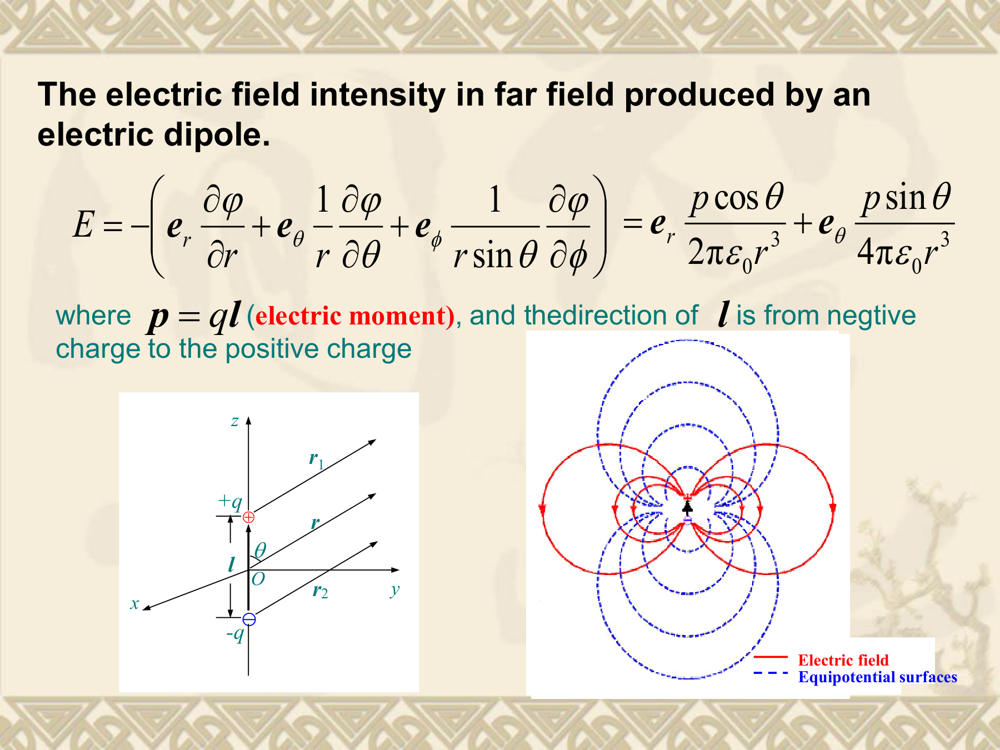
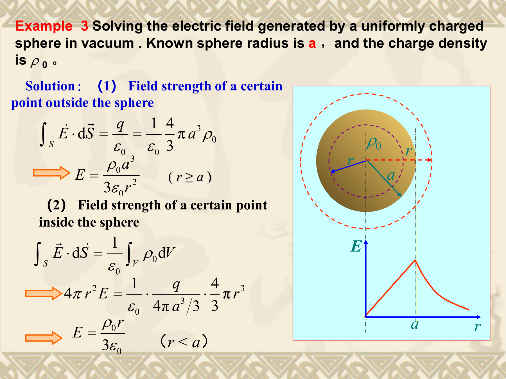
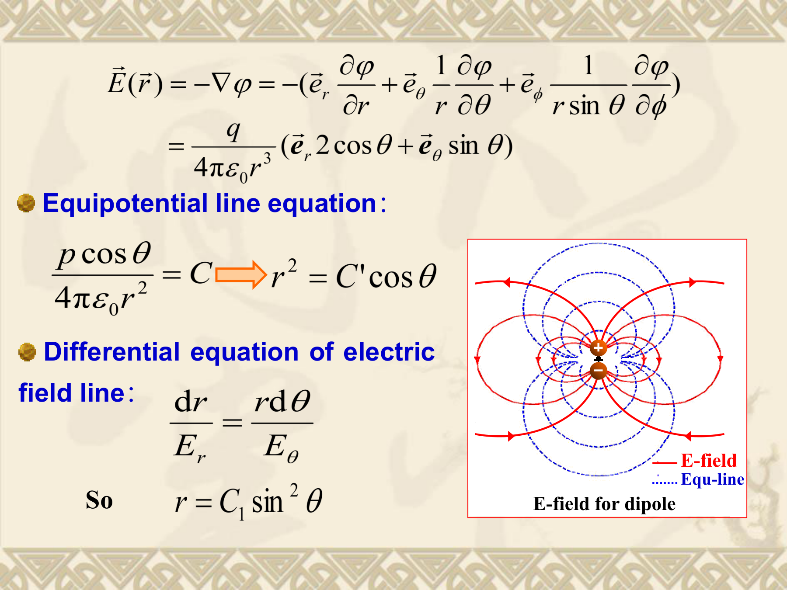
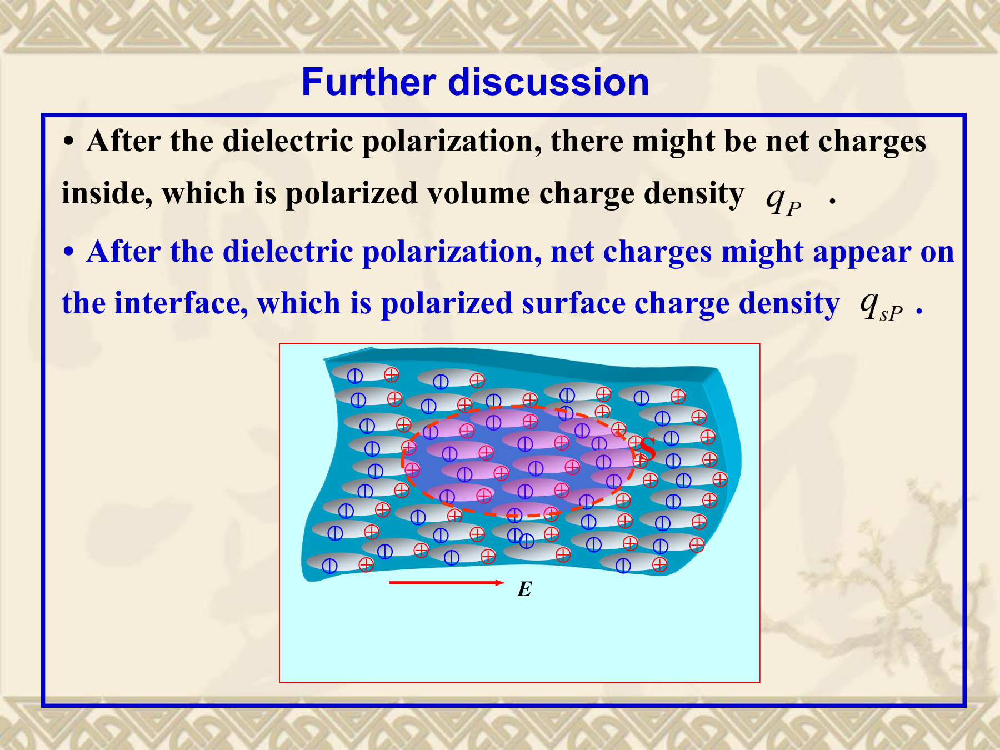
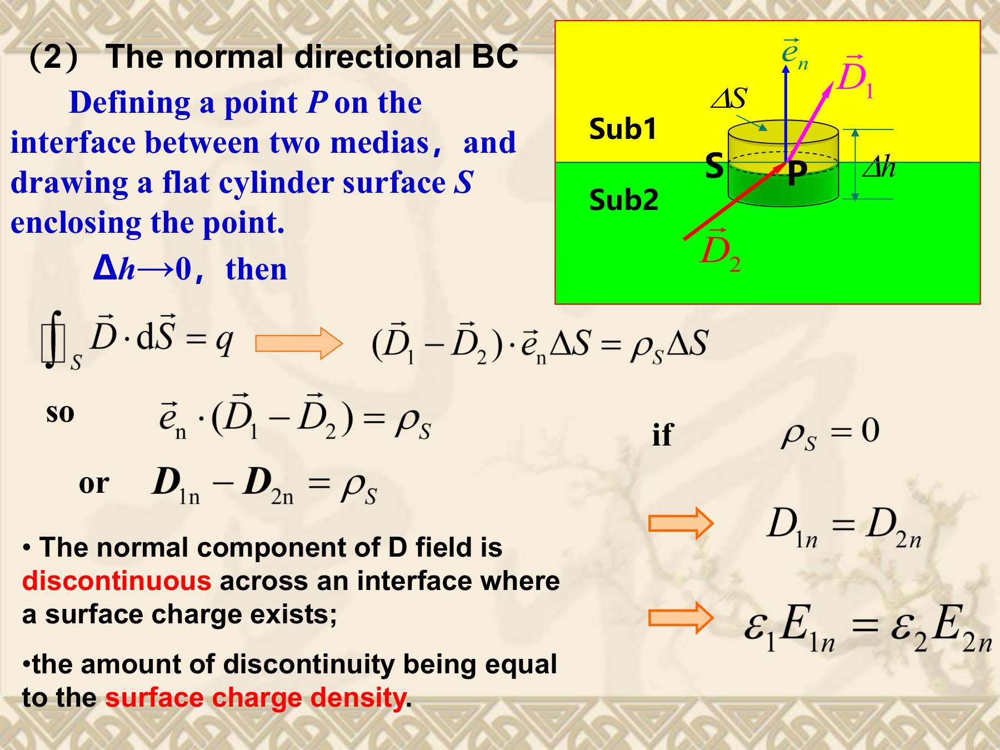
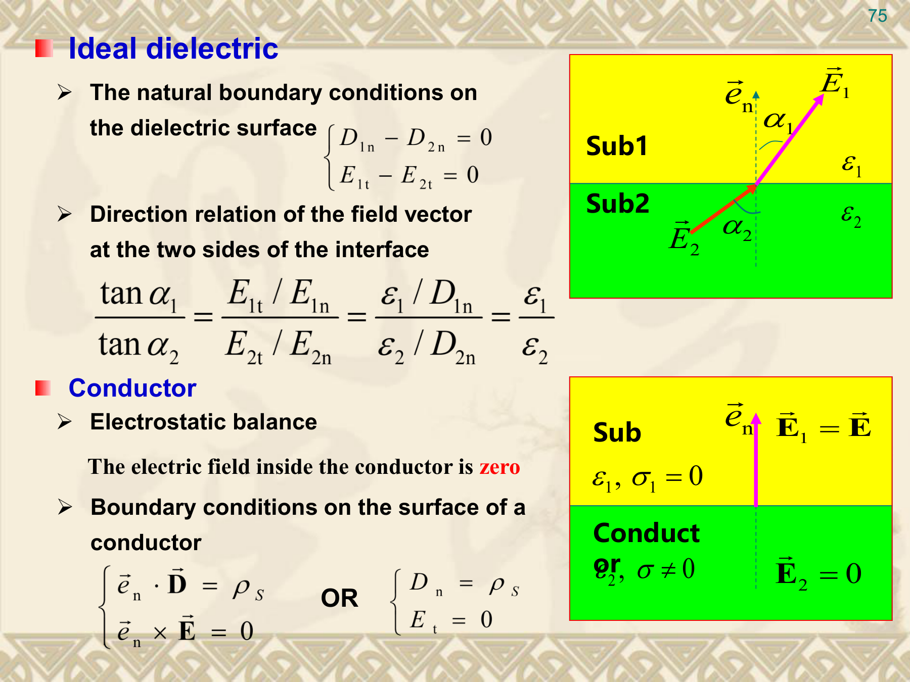
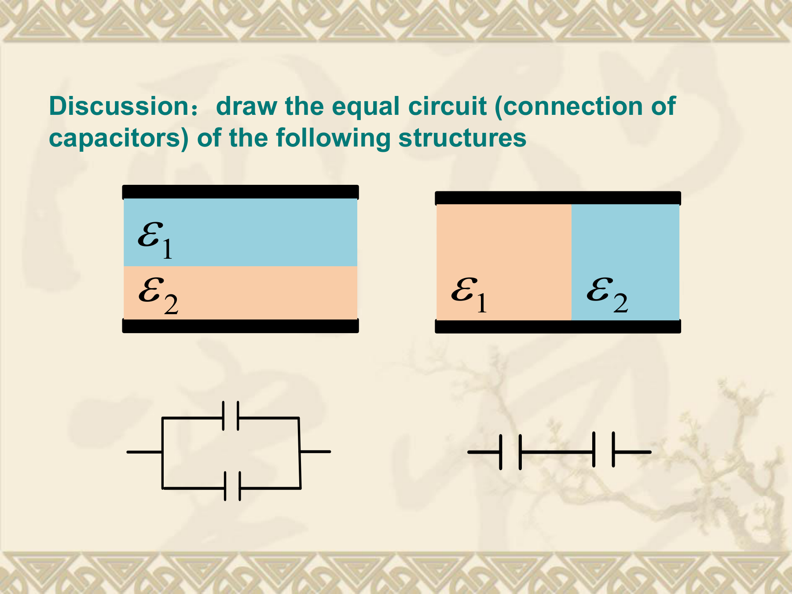

## 本章学习目标

学完本章后，你应该能够：

1. 区分体电荷密度、面电荷密度、线电荷密度和点电荷四种电荷分布形式，并会计算对应的总电荷。
2. 默写并理解真空中静电场的两个基本假设（散度方程和旋度方程）及其物理含义：静电场是有散无旋的保守场。
3. 会用库仑定律和叠加原理计算点电荷系统以及连续分布电荷产生的电场强度。
4. 会用电偶极子模型理解极化和远场电场的表达式。
5. 能判断何时可以用高斯定理简化电场计算，并会用高斯定理求解球对称、轴对称和平面面对称的电场。
6. 理解电势的物理定义（单位正电荷从参考点移动到该点外力做的功），掌握电场矢量与电势标量之间的关系：$\vec E = -\nabla\varphi$。
7. 能写出泊松方程和拉普拉斯方程，并理解它们分别是“有电荷”和“无电荷”区域的电势微分方程。
8. 理解导体在静电场中的行为：内部电场为零，表面为等势面，电场垂直于导体表面。
9. 理解介质极化的微观机制（位移极化与取向极化），能定义极化强度 $\vec P$ 并计算极化体电荷密度和面电荷密度。
10. 能定义电通量密度 $\vec D = \varepsilon_0 \vec E + \vec P$，并默写含介质时的高斯定理微分形式和积分形式。
11. 能写出并应用不同介质界面上的边界条件：$\vec E$ 的切向分量连续，$\vec D$ 的法向分量差等于自由面电荷密度。
12. 能用设电荷法或设电压法计算典型电容器的电容（同心球、同轴线、平行双导线）。
13. 能用电荷-电势形式和场能量密度形式分别计算静电能量。
14. 理解场能量并不满足叠加原理（因为与 $|\vec E|^2$ 成正比），同时区分自能和互能。

## 1. 先用人话理解本章在讲什么

### 1.1 本章要解决的问题

前两章先介绍了电磁场的基本对象（第1章）和数学工具（第2章），现在正式开始学习静态电场。

“静态”的意思是所有电荷静止不动，不随时间变化。本章回答的问题是：

| 问题 | 回答工具 |
|---|---|
| 电荷在空间中如何分布？ | 体电荷、面电荷、线电荷、点电荷 |
| 电场从电荷“流”出来以后怎么分布？ | 库仑定律 + 叠加原理 |
| 有没有更省力的方法算电场？ | 高斯定理（对称情况） |
| 能不能把矢量问题变成标量问题？ | 电势（标量）替代电场（矢量） |
| 导体放进电场会怎样？ | 内部 $\vec E=0$，表面是等势面 |
| 绝缘体（介质）放进电场会怎样？ | 极化，正负电荷微小分离 |
| 两种不同介质交界处电场怎么变？ | 边界条件 |
| 怎么量化“储存电荷的本事”？ | 电容 |
| 电场中存了多少能量？ | 静电场能量 |

### 1.2 本章在课程中的位置

本章是电磁场课程中第一个完整的“静态场”章节。第2章教的散度、旋度、梯度，在这里第一次被用来描述真实的物理场。后面第4章会平行学习“静态磁场”，结构非常相似（也是先讲源、再讲基本假设、再讲标量势/矢量势、边界条件、能量）。所以本章学扎实了，第4章难度会小很多。

本章与第2章的关键衔接点：
- 第2章的散度 $\leftrightarrow$ 本章的高斯定理微分形式：$\nabla\cdot\vec E = \rho/\varepsilon_0$
- 第2章的旋度 $\leftrightarrow$ 本章说明静电场无旋：$\nabla\times\vec E = 0$
- 第2章的梯度 $\leftrightarrow$ 本章的电场与电势关系：$\vec E = -\nabla\varphi$
- 第2章的散度定理 $\leftrightarrow$ 本章从微分形式推导高斯定理积分形式
- 第2章的Stokes定理 $\leftrightarrow$ 本章从微分形式推导保守场性质

### 1.3 初学者最容易踩的坑

1. **混淆“自由电荷”和“极化电荷”。** 自由电荷是你放上去的电荷（比如给电容器充电）；极化电荷是介质在电场中自动产生的束缚电荷，它不会自己跑，但会影响总电场。
2. **看到公式 $\varphi = q/(4\pi\varepsilon_0 r)$ 就以为所有情况的电势都是它。** 这个公式只对点电荷成立。对连续分布电荷，要用积分叠加。
3. **用高斯定理时乱选高斯面。** 高斯面必须是闭合面，而且高斯定理只有在对称情况下才能简化成代数方程——不是所有问题都能用高斯定理技巧求解。
4. **忘记电势参考点是“人为选择”的。** 电势的绝对值没有物理意义，只有电势差才有意义。不同的参考点选择会差一个常数，但不影响电场。
5. **搞混 $\vec D$ 和 $\vec E$ 的边界条件。** $\vec E$ 切向连续，$\vec D$ 法向有跳跃（如果界面有自由面电荷）。公式是 $E_{1t} = E_{2t}$ 和 $D_{1n} - D_{2n} = \rho_s$。
6. **以为场的能量可以叠加。** 能量正比于 $|\vec E|^2$，而 $|\vec E_1 + \vec E_2|^2 \neq |\vec E_1|^2 + |\vec E_2|^2$（因为交叉项），所以能量不满足叠加原理。

## 2. 核心概念

### 2.1 电荷与电荷密度 (Charge and Charge Density)

**一句话理解：** 电荷是电场之源。描述电荷在空间中怎么分布，就是描述“场源”的样子。

**正式定义：**

电荷有四种分布形式：

**(1) 体电荷密度 (Volume Charge Density)** $\rho_v$（或简写为 $\rho$）

$$\rho_v = \lim_{\Delta V \to 0} \frac{\Delta q}{\Delta V}$$

单位：$\text{C/m}^3$

总电荷与密度的关系：
$$q = \int_V \rho_v \, dV$$

**(2) 面电荷密度 (Surface Charge Density)** $\rho_s$（或简写为 $\sigma$）

$$\rho_s = \lim_{\Delta S \to 0} \frac{\Delta q}{\Delta S}$$

单位：$\text{C/m}^2$

总电荷：
$$q = \int_S \rho_s \, dS$$

**(3) 线电荷密度 (Line Charge Density)** $\rho_l$

$$\rho_l = \lim_{\Delta l \to 0} \frac{\Delta q}{\Delta l}$$

单位：$\text{C/m}$

总电荷：
$$q = \int_l \rho_l \, dl$$

**(4) 点电荷 (Point Charge)** $q$

用 $\delta$ 函数描述密度：
$$\rho(\vec r) = q \, \delta(\vec r - \vec r')$$

理解方法：体积趋近于零，密度趋于无穷，但"体积乘密度"等于1（对单位点电荷而言）。

**直观例子：**
- 体电荷：一块带电的塑料块，电荷散布在整块材料内部。
- 面电荷：用毛皮摩擦后的气球表面，电荷只在二维表面上。
- 线电荷：一根极细的带电导线。
- 点电荷：一个微小的带电粒子，比如电子（$e = 1.602 \times 10^{-19} \text{ C}$）。

**容易混淆的点：**
- 面电荷模型只是为了数学简化。真实的"面电荷"其实是很薄的一层体电荷。
- 把面电荷模型用于计算时，在电荷层表面 $\vec E$ 会不连续（后面高斯定理部分会展示），这是模型本身带来的数学性质，不是物理悖论。

### 2.2 静电场的基本假设 (Fundamental Postulates of Electrostatics in Free Space)

**一句话理解：** 这是整个静电学的两条"公理"——一条说电荷是电场的散度源（有源），一条说静电场不会绕圈（无旋、保守）。

**正式定义：**

电场强度定义为单位正电荷受到的力：
$$\vec E = \lim_{q \to 0} \frac{\vec F}{q} \quad (\text{单位：V/m 或 N/C})$$

作用在电荷 $q$ 上的力：
$$\vec F = q\vec E$$

电通量 $\Psi$：穿过一个面的电场线总数
$$\Psi = \int_S \vec E \cdot d\vec S$$

真空中两条基本假设（微分形式）：

$$\nabla \cdot \vec E = \frac{\rho}{\varepsilon_0}$$

$$\nabla \times \vec E = 0$$

其中 $\rho$ 是自由电荷的体密度（$\text{C/m}^3$），$\varepsilon_0$ 是真空中介电常数（$\approx 8.854 \times 10^{-12} \text{ F/m}$）。

对应的积分形式（用散度定理和Stokes定理推导）：

$$\oint_S \vec E \cdot d\vec S = \frac{Q_{\text{enclosed}}}{\varepsilon_0}$$

$$\oint_C \vec E \cdot d\vec l = 0$$

**直觉理解：**
- 散度方程 $\nabla \cdot \vec E = \rho/\varepsilon_0$ 的意思是：电场线的源头是正电荷，终点是负电荷。在某一点如果 $\rho > 0$，电场线从这里发散出去。
- 旋度方程 $\nabla \times \vec E = 0$ 的意思是：把单位正电荷沿任意闭合回路走一圈，电场力做的净功为零——所以静电场是保守场，做功与路径无关。
- 积分形式的环路积分为零 $\oint \vec E \cdot d\vec l = 0$，直接说明"静电场中走一圈回到原点，电势不变"。

**容易混淆的点：**
- 微分形式和积分形式说的是同一件事。微分形式是"点"上的规律，积分形式是"大片区域"的规律。用散度定理可以把散度体积分变成闭合曲面积分，用Stokes定理可以把旋度曲面积分变成闭合曲线积分。
- 保守场的性质在后面的电势部分特别重要——正是因为 $\nabla \times \vec E = 0$，我们才能定义标量电势 $\varphi$，并让 $\vec E = -\nabla\varphi$。回忆第2章：只有无旋场才能写成梯度场。

### 2.3 库仑定律 (Coulomb's Law)

**一句话理解：** 库仑定律告诉你一个点电荷在空间中产生的电场强度有多大、指向哪里。

**正式定义：**

位于原点的点电荷 $Q$ 在自由空间中产生的电场：
$$\vec E = \frac{Q}{4\pi\varepsilon_0 R^2} \vec e_R$$

位于任意位置 $\vec r'$ 的点电荷 $Q$ 产生的电场（$\vec R = \vec r - \vec r'$，$R = |\vec r - \vec r'|$）：
$$\vec E = \frac{Q}{4\pi\varepsilon_0 R^2} \vec e_R = \frac{Q(\vec r - \vec r')}{4\pi\varepsilon_0 |\vec r - \vec r'|^3}$$

点电荷 $Q_1$（在原点）对点电荷 $Q_2$ 的作用力：
$$\vec F_{12} = Q_2 \vec E_{12} = \frac{Q_1 Q_2}{4\pi\varepsilon_0 R^2} \vec e_R$$

叠加原理：$n$ 个点电荷 $q_1, q_2, \ldots, q_n$ 产生的总电场是各电荷单独产生的电场之和：
$$\vec E = \frac{1}{4\pi\varepsilon_0} \sum_{k=1}^{n} \frac{q_k (\vec r - \vec r_k)}{|\vec r - \vec r_k|^3}$$

**连续分布电荷的电场：**

体积电荷分布：
$$\vec E(\vec r) = \frac{1}{4\pi\varepsilon_0} \int_{V'} \frac{\rho(\vec r')(\vec r - \vec r')}{|\vec r - \vec r'|^3} \, dV'$$

面电荷分布：
$$\vec E(\vec r) = \frac{1}{4\pi\varepsilon_0} \int_{S'} \frac{\rho_s(\vec r')(\vec r - \vec r')}{|\vec r - \vec r'|^3} \, dS'$$

线电荷分布：
$$\vec E(\vec r) = \frac{1}{4\pi\varepsilon_0} \int_{l'} \frac{\rho_l(\vec r')(\vec r - \vec r')}{|\vec r - \vec r'|^3} \, dl'$$

**电偶极子：**

由一对大小相等、符号相反的电荷 $+q$ 和 $-q$ 组成，相距 $\vec l$（从负到正的方向）。

电偶极矩（electric moment）：$\vec p = q\vec l$

偶极子在远场区 $\vec r$ 处产生的电位和电场：

$$\varphi = \frac{\vec p \cdot \vec e_r}{4\pi\varepsilon_0 r^2} = \frac{p\cos\theta}{4\pi\varepsilon_0 r^2}$$

$$\vec E = \frac{p}{4\pi\varepsilon_0 r^3}(\vec e_r 2\cos\theta + \vec e_\theta \sin\theta)$$

**几个典型电荷分布的电场（可直接引用）：**

- **均匀带电无限长直线：** $\vec E = \frac{\rho_l}{2\pi\varepsilon_0 r} \vec e_r$
- **有限长均匀带电直线段：** $\vec E = \frac{\rho_l}{4\pi\varepsilon_0 r}[(\sin\theta_2 - \sin\theta_1)\vec e_r + (\cos\theta_1 - \cos\theta_2)\vec e_z]$

**容易混淆的点：**
- 库仑定律给出的是"一个点电荷产生的电场"，而高斯定理给出的是"通过一个闭合面的总电通量与内部电荷的关系"。两者的关系就像"列所有收入来源"和"算总余额"。
- 叠加原理适用于电场矢量 $\vec E$，但不适用于能量（后面会讲），因为能量有交叉项。
- 库仑定律中的分母是 $4\pi\varepsilon_0 R^2$，不是 $4\pi\varepsilon_0 R$——这是"平方反比律"的体现。

### 2.4 高斯定理 (Gauss's Law)

**一句话理解：** 穿过任意闭合曲面的总电通量，等于曲面内电荷总和除以 $\varepsilon_0$。在对称情况下，它比库仑定律方便得多。

**正式定义：**

$$ \oint_S \vec E \cdot d\vec S = \frac{Q_{\text{enclosed}}}{\varepsilon_0} = \frac{1}{\varepsilon_0} \int_V \rho \, dV$$

**高斯定理的适用条件（简化计算的关键）：**

只有当以下对称条件之一满足时，$\vec E$ 才能提出积分号外从而简化计算：

| 分布类型 | 特点 | 高斯面选择 |
|---|---|---|
| 球对称分布 | 均匀带电球面、球体、多层同心球壳 | 同心球面 |
| 轴对称分布 | 无限长均匀带电直线、圆柱面、圆柱壳 | 同轴圆柱面 |
| 面对称分布 | 无限大均匀带电平面 | 垂直穿过的柱形（药片盒形） |

**几个用高斯定理求出的典型结果：**

(1) **均匀带电球体**（半径 $a$，体电荷密度 $\rho_0$）：

球外 $(r \geq a)$：$\vec E = \frac{\rho_0 a^3}{3\varepsilon_0 r^2} \vec e_r$

球内 $(r < a)$：$\vec E = \frac{\rho_0 r}{3\varepsilon_0} \vec e_r$

(2) **均匀带电球面**（半径 $R$，总电荷 $Q$）：

球外 $(r > R)$：$\vec E = \frac{Q}{4\pi\varepsilon_0 r^2} \vec e_r$

球内 $(r < R)$：$\vec E = 0$

**特别注意：在表面 $r = R$ 处，$\vec E$ 有跳跃（不连续），这是面电荷模型带来的结果。** 对于真实的体电荷分布（有一定厚度），$\vec E$ 是光滑变化的。

(3) **无限长均匀带电圆柱体**（半径 $a$，体电荷密度 $\rho$）：

柱外 $(r > a)$：$\vec E = \frac{\rho a^2}{2\varepsilon_0 r} \vec e_r = \frac{\rho_l}{2\pi\varepsilon_0 r} \vec e_r$

柱内 $(r < a)$：$\vec E = \frac{\rho r}{2\varepsilon_0} \vec e_r$

其中 $\rho_l = \pi a^2 \rho$ 为单位长度上的电荷。

(4) **无限大均匀带电平面**（面电荷密度 $\sigma$）：

$$\vec E = \frac{\sigma}{2\varepsilon_0} \vec e_n$$

方向垂直于平面，由电荷符号决定正负方向。

**直觉理解：**
- 高斯定理可以类比为"水龙头—水量"的关系：包住越多的水龙头（电荷），流出的水总量（电通量）越大。
- 在非对称情况下高斯定理也成立，但你没法把 $\vec E$ 提出积分号，所以算不出 $\vec E$。这时还是得用库仑定律硬算积分。

**容易混淆的点：**
- 高斯面必须是**闭合面**，必须是虚构的数学面（不是物理实体）。
- 高斯面外的电荷对通过高斯面的总通量贡献为零（进去的等于出去的），但不意味着它们产生的电场在面上为零。
- 面电荷模型导致电场在表面上不连续——这在真实的物理世界中不会发生，因为真实电荷分布总有厚度。

### 2.5 电势 (Electric Potential)

**一句话理解：** 电势是把电场这个三维矢量变成一个标量的办法——把单位正电荷从参考点移到目标点，外力需要做的功就是该点的电势。

**正式定义：**

电势 $\varphi$ 的定义（因为 $\nabla \times \vec E = 0$，可以写 $\vec E = -\nabla\varphi$）：

$$\varphi(\vec r) = -\int_{\text{ref}}^{\vec r} \vec E \cdot d\vec l$$

（从参考点积分到目标点）

电场与电势的关系：
$$\vec E = -\nabla\varphi$$

**物理意义：** 电势 $\varphi$ 等于"把单位正电荷从参考点移动到该点，外力的功"——或者等价地，"单位正电荷从该点移动到参考点，电场力的功除以 $q$"。

**泊松方程 (Poisson Equation)：** 在均匀介质中

$$\nabla^2 \varphi = -\frac{\rho}{\varepsilon}$$

当区域中没有电荷时（$\rho = 0$），退化为拉普拉斯方程 (Laplace Equation)：

$$\nabla^2 \varphi = 0$$

**不同电荷源产生的电势：**

点电荷：$\varphi = \frac{q}{4\pi\varepsilon R} + C$

体电荷：$\varphi = \frac{1}{4\pi\varepsilon} \int_{V'} \frac{\rho dV'}{R}$

面电荷：$\varphi = \frac{1}{4\pi\varepsilon} \int_{S'} \frac{\rho_s dS'}{R}$

线电荷：$\varphi = \frac{1}{4\pi\varepsilon} \int_{l'} \frac{\rho_l dl'}{R}$

**电压（电势差）：**

两点 $P_1, P_2$ 之间的电压定义为：
$$U_{12} = \varphi_1 - \varphi_2 = \int_{P_1}^{P_2} \vec E \cdot d\vec l$$

**电势参考点的选择原则：**
1. 电势表达式有意义（不发散）。
2. 电势表达式尽可能简单。
3. 同一个问题只能有一个参考点。
4. 电势差与参考点无关。

典型参考点选择：对有限分布电荷选无穷远处；对无限长线电荷不能选无穷远（积分发散），选有限距离处如 $\rho = a$。

**等势面：** $\varphi(x,y,z) = \text{常数}$ 定义的曲面。性质：
- 电场线处处垂直于等势面。
- 等势面的疏密反映电场强弱（密则场强）。

**容易混淆的点：**
- 电势可以差一个任意常数，但电场由电势的梯度决定，所以加上常数不影响电场。
- 对无限大分布（如无限长线电荷），不能选 $r \to \infty$ 为零电势点，因为积分不收敛。
- $\nabla^2 \varphi = -\rho/\varepsilon$ 是把 $\nabla \cdot \vec E = \rho/\varepsilon$ 和 $\vec E = -\nabla\varphi$ 联合起来得到的。

### 2.6 导体在静电场中 (Conductors in Static Electric Field)

**一句话理解：** 把导体放进静电场，导体里的自由电子马上动起来，直到内部电场被完全抵消——这时导体进入静电平衡。

**核心结论（静电平衡状态下）：**

1. **导体内部电场为零：** $\vec E_{\text{inside}} = 0$
2. **导体内部电荷为零：** 所有净电荷分布在导体表面。
3. **导体表面的电场垂直于表面**（因为 $\vec E$ 切向分量必须为零；如果切向分量不为零，表面的电荷会继续移动，破坏静电力平衡）。
4. **导体是一个等势体**（内部 $\vec E = 0$ 意味着各处电势相等）。
5. **导体表面电荷分布取决于表面形状：** 尖锐处电荷密度大，平坦处电荷密度小。

**边界条件（导体表面）：**

设导体为介质2（内部 $\vec E_2 = 0$），介质1为导体外的介质（介电常数 $\varepsilon_1$）：
$$E_{1t} = 0 \quad \Rightarrow \quad \vec E_1 \perp \text{表面}$$
$$D_{1n} = \rho_s \quad \text{或} \quad \varepsilon_1 E_{1n} = \rho_s$$

**电场和电势的不连续性：**
- 电场强度在导体表面有跳跃（从有限值跳到零）。
- 电势在通过导体表面时保持连续——电势的不连续意味着无限大的电场强度，在物理上不可能。

**容易混淆的点：**
- "导体内部电场为零"不是"电场绕过导体"，而是导体表面的感应电荷产生了"与外场大小相等、方向相反"的内部电场，两者抵消。
- 导体表面 $\vec E$ 的法向分量与面电荷密度的关系是 $E_n = \rho_s/\varepsilon$，这来自高斯定理对药片盒形高斯面的应用。

### 2.7 介质在静电场中 (Dielectrics in Static Electric Field)

**一句话理解：** 介质（绝缘体）放进电场后，不会像导体那样电荷跑光，而是正负电荷微微分开，产生极化——这会影响总电场。

**极化机制：**

(1) **非极性分子（Nonpolar molecules，如 $\text{CO}_2$, $\text{H}_2$, $\text{O}_2$, $\text{CH}_4$）：** 没有外加电场时正负电荷中心重合，电偶极矩为零。加了外电场后，正负电荷中心被拉开，产生**位移极化 (displacement polarization)**。

(2) **极性分子（Polar molecules，如 $\text{H}_2\text{O}$, $\text{HCl}$, $\text{CO}$, $\text{SO}_2$）：** 本身就有永久电偶极矩。无外加电场时，由于分子热运动，各偶极矩方向随机分布，宏观极化强度为零。加了外电场后，偶极子倾向于沿外电场方向排列，产生**取向极化 (orientation polarization)**。

**极化强度 (Polarization Intensity)** $\vec P$：

定义为单位体积内电偶极矩的矢量和：
$$\vec P = \lim_{\Delta V \to 0} \frac{\sum \vec p_i}{\Delta V}$$

单位：$\text{C/m}^2$

对于线性且各向同性的介质，实验表明：
$$\vec P = \varepsilon_0 \chi_e \vec E$$

其中 $\chi_e$ 为**电极化率 (electric susceptibility)**，是一个无量纲的常数。

**介质极化后的电荷分布：**

极化体电荷密度：$\rho_P = -\nabla \cdot \vec P$

极化面电荷密度（在介质表面或两种介质交界面上）：
$$\rho_{sP} = \vec P \cdot \vec e_n \quad （\text{单一介质-真空界面}）$$
$$\rho_{sP} = \vec e_n \cdot (\vec P_1 - \vec P_2) \quad （\text{两种介质界面}）$$

其中 $\vec e_n$ 是从介质1指向介质2的单位法向量。

**介质极化后总电荷守恒：**
$$\int_V \rho_P \, dV + \int_S \rho_{sP} \, dS = 0$$

也就是说极化不会凭空创造或消灭总电荷，只是重新分布。

**容易混淆的点：**
- 极化电荷是"束缚电荷"——它们被束缚在原子或分子中，不能自由移动。自由电荷则是导体中可以到处跑的电子。
- 极性分子本身就有偶极矩（H2O分子就是弯曲的，正负电荷中心不重合），但宏观极化强度为零（因为方向随机）。外加电场只是让它们"对齐"而不是"产生"偶极矩。

### 2.8 电通量密度与介电常数 (Electric Flux Density and Dielectric Constant)

**一句话理解：** 在有介质的时候，只关心自由电荷比总电荷方便多了——引入 $\vec D$ 就是为了这个目的。

**正式定义：**

电通量密度（电位移矢量）$\vec D$：
$$\vec D = \varepsilon_0 \vec E + \vec P$$

单位：$\text{C/m}^2$

对线性各向同性介质，代入 $\vec P = \varepsilon_0 \chi_e \vec E$：
$$\vec D = \varepsilon_0(1 + \chi_e) \vec E = \varepsilon_0 \varepsilon_r \vec E = \varepsilon \vec E$$

其中：
- $\varepsilon_r = 1 + \chi_e$ 为**相对介电常数 (relative permittivity)**，无量纲
- $\varepsilon = \varepsilon_0 \varepsilon_r$ 为**介电常数（电容率）(dielectric constant / permittivity)**，单位 $\text{F/m}$

**含介质时的基本方程：**

高斯定理（只含自由电荷！）：
$$\oint_S \vec D \cdot d\vec S = Q_{\text{free}}$$

$$\nabla \cdot \vec D = \rho_{\text{free}}$$

静电场的无旋性不变：
$$\nabla \times \vec E = 0$$

$$\oint_C \vec E \cdot d\vec l = 0$$

**本构关系 (Constitutive Relation)：** $\vec D = \varepsilon \vec E$ 这描述了介质对电场的响应。

**介质分类：**

| 类型 | 含义 |
|---|---|
| 线性 (Linear) | $\varepsilon$ 与 $\vec E$ 的大小无关 |
| 非线性 (Nonlinear) | $\varepsilon$ 随 $\vec E$ 的大小变化 |
| 各向同性 (Isotropic) | $\varepsilon$ 不依赖于 $\vec E$ 的方向 |
| 各向异性 (Anisotropic) | $\vec D$ 与 $\vec E$ 方向不同，$\varepsilon$ 是一个张量$(3\times3$矩阵$)$ |
| 均匀 (Homogeneous) | $\varepsilon$ 不随空间坐标变化 |
| 非均匀 (Inhomogeneous) | $\varepsilon$ 随空间位置变化 |

**求解问题的流程：**
1. 已知自由电荷分布 $\rho_{\text{free}}$
2. 用 $\nabla \cdot \vec D = \rho_{\text{free}}$ 求 $\vec D$
3. 用 $\vec D = \varepsilon \vec E$ 求 $\vec E$
4. 用 $\vec E = -\nabla\varphi$ 求 $\varphi$

**为什么引入 $\vec D$ 这么有用？**
- 极化电荷 $\rho_P$ 本身也产生电场，而它又取决于总电场——这是一个"鸡生蛋"的循环。引入 $\vec D$ 后，$\nabla \cdot \vec D = \rho_{\text{free}}$ 只依赖已知的自由电荷，把极化电荷的效应"吸收"到了本构关系 $\vec D = \varepsilon \vec E$ 中。

**容易混淆的点：**
- $\vec D$ 的通量只算"自由电荷"，$\vec E$ 的通量算的是"总电荷（自由+极化）"除以 $\varepsilon_0$。
- $\vec D$ 不是"介质中的电场"——它的物理含义是"由自由电荷引起、经介质修正后的通量密度"。

### 2.9 静电场的边界条件 (Boundary Conditions)

**一句话理解：** 当电场穿过两种不同介质的交界面时，它不能随心所欲地变化——边界条件规定了哪些分量必须连续、哪些可以跳跃。

**为什么需要边界条件？**
- 物理原因：介质特征参数在两边的突然变化会导致场的突变。
- 数学原因：麦克斯韦方程的微分形式在界面上失去意义（参数不连续），但积分形式仍然适用——用它来推导边界条件。

**(1) 切向边界条件（$\vec E$ 的切向分量）**

取跨越界面的小矩形回路，令高度 $\Delta h \to 0$，用 $\oint \vec E \cdot d\vec l = 0$ 得：

$$\vec e_n \times (\vec E_1 - \vec E_2) = 0$$

即：
$$E_{1t} = E_{2t}$$

**$\vec E$ 的切向分量在界面两侧连续。**

**(2) 法向边界条件（$\vec D$ 的法向分量）**

取跨越界面的扁圆柱体高斯面（药片盒），令高度 $\Delta h \to 0$，用 $\oint \vec D \cdot d\vec S = Q_{\text{free}}$ 得：

$$\vec e_n \cdot (\vec D_1 - \vec D_2) = \rho_s$$

即：
$$D_{1n} - D_{2n} = \rho_s$$

**$\vec D$ 的法向分量在界面有跳跃，跳跃量等于自由面电荷密度。** 若界面上没有自由面电荷（$\rho_s = 0$），则 $D_{1n} = D_{2n}$（法向连续）。

**麦克斯韦方程组的边界条件汇总表：**

| 方程 | 微分形式 | 积分形式 | 边界条件 |
|---|---|---|---|
| 高斯定理 | $\nabla \cdot \vec D = \rho$ | $\oint_S \vec D \cdot d\vec S = Q$ | $D_{1n}-D_{2n}=\rho_s$ |
| 静电场无旋 | $\nabla \times \vec E = 0$ | $\oint_C \vec E \cdot d\vec l = 0$ | $E_{1t}=E_{2t}$ |

**特殊情况：**

**(A) 两种理想介质界面（无自由面电荷 $\rho_s = 0$）**

$$E_{1t} = E_{2t}, \quad D_{1n} = D_{2n}$$

电场方向的折射关系：
$$\frac{\tan\alpha_1}{\tan\alpha_2} = \frac{\varepsilon_1}{\varepsilon_2}$$

其中 $\alpha$ 是电场与法线的夹角。

**(B) 理想导体表面（导体为介质2，内部 $\vec E_2 = 0$）**

$$E_{1t} = 0, \quad D_{1n} = \rho_s \quad\text{或}\quad \varepsilon_1 E_{1n} = \rho_s$$

即导体外的电场垂直于导体表面。

**电势的边界条件：**

在任意静电问题中：$\varphi$ 在界面上连续（$\varphi_1 = \varphi_2$）

在导体表面：$\varphi$ = 常数 （导体是等势体）

**容易混淆的点：**

- 是 $\vec E$ 的切向分量连续，$\vec D$ 的法向分量差 $\rho_s$——很多同学记反。
- 折射公式 $\tan\alpha_1 / \tan\alpha_2 = \varepsilon_1/\varepsilon_2$ 只在无自由面电荷时成立。
- 折射规律：$\varepsilon_1 > \varepsilon_2$ 时 $\alpha_1 > \alpha_2$，即介电常数较大的介质中，电场线与法线的夹角更大（更偏离法线方向）。直觉理解：高 $\varepsilon$ 介质中，同样的 $D_n$ 产生更小的 $E_n$（因为 $E_n = D_n/\varepsilon$），法向分量"变弱"，电场整体就更偏向切向。反之，进入低 $\varepsilon$ 介质时电场向法线靠拢。

### 2.10 电容与电容器 (Capacitance and Capacitors)

**一句话理解：** 电容衡量导体系统"储存电荷的本事"——它能存多少电荷对应于一伏电压。

**电容的定义：**

(1) **孤立导体电容：**
$$C = \frac{Q}{\varphi}$$

(2) **两导体组成的电容器：**
$$C = \frac{Q}{U} = \frac{Q}{\varphi_1 - \varphi_2}$$

(3) **多导体系统：** 电容矩阵描述（有自电容 $C_{ii}$ 和互电容 $C_{ij}$ 两种）：

$$Q_1 = C_{11}\varphi_1 + C_{12}(\varphi_1 - \varphi_2) + C_{13}(\varphi_1 - \varphi_3)$$

$$Q_2 = C_{22}\varphi_2 + C_{21}(\varphi_2 - \varphi_1) + C_{23}(\varphi_2 - \varphi_3)$$

$$Q_3 = C_{33}\varphi_3 + C_{31}(\varphi_3 - \varphi_1) + C_{32}(\varphi_3 - \varphi_2)$$

**电容的决定因素：**
- 取决于导体系统的几何结构、尺寸、形状和周围介质的介电常数。
- 与导体上的电荷量和电势无关。

**求解电容的两种方法：**

方法一（设电荷法）：
1. 假设导体的电荷为 $\pm Q$。
2. 求导体间的电压 $U$（通过求 $\vec E$ 或 $\varphi$）。
3. $C = Q/U$。

方法二（设电压法）：
1. 假设导体间的电压为 $U$。
2. 求导体表面总电荷 $Q$。
3. $C = Q/U$。

**典型结果：**

(1) **同心球电容器**（内径 $a$，外径 $b$，介质 $\varepsilon$）：

$$C = 4\pi\varepsilon \frac{ab}{b-a}$$

当 $b \to \infty$ 时，$C = 4\pi\varepsilon a$（孤立导体球的电容）。

(2) **同轴线**（内径 $a$，外径 $b$，介质 $\varepsilon$，单位长度）：

$$C = \frac{2\pi\varepsilon}{\ln(b/a)} \quad (\text{单位长度的电容})$$

(3) **平行双导线**（导线半径 $a$，间距 $D$，且 $D \gg a$，单位长度）：

$$C = \frac{\pi\varepsilon}{\ln(D/a)} \quad (\text{单位长度的电容})$$

**电容器的等效电路：**

对于多层介质或多层结构的电容器，可将其分为串联或并联的子电容器画等效电路图。判断规则：
- 电场方向相同的区域——并联
- 电场方向串联的区域——串联

**电容器的优缺点：**
- 优点：储能、滤波、移相、隔直、旁路、选频等。
- 缺点：可能带来电磁兼容问题。

**容易混淆的点：**
- 电容只由几何形状和介质决定（$C = \varepsilon \times (\text{几何因子})$），与 $Q$ 和 $U$ 无关。
- 孤立导体也有电容（如地球的电容约 $710\,\mu\text{F}$），只是没有与之构成电容器的第二导体。

### 2.11 静电场能量 (Electrostatic Energy)

**一句话理解：** 电场不是虚无的——它里面存着真实的能量。把电荷一个个搬进空间来，你做的功最后都以电场能量的形式存储在整个空间中。

**通过电荷和电势计算的能量：**

若电荷在空间中连续分布：
$$W_e = \frac{1}{2} \int_V \rho \varphi \, dV \quad \text{（体电荷）}$$

$$W_e = \frac{1}{2} \int_S \rho_s \varphi \, dS \quad \text{（面电荷）}$$

$$W_e = \frac{1}{2} \int_l \rho_l \varphi \, dl \quad \text{（线电荷）}$$

对 $n$ 个带电导体组成的系统：
$$W_e = \frac{1}{2} \sum_{i=1}^{n} Q_i \Phi_i$$

其中 $Q_i$ 和 $\Phi_i$ 分别是第 $i$ 个导体的总电荷和电势。

对电容器（电荷 $Q$，电压 $U$，电容 $C$）：
$$W_e = \frac{1}{2} QU = \frac{1}{2} CU^2 = \frac{Q^2}{2C}$$

**通过场分布计算的能量（更为基本的形式）：**

能量密度：
$$w_e = \frac{1}{2} \vec D \cdot \vec E$$

单位：$\text{J/m}^3$

对线性各向同性介质（$\vec D = \varepsilon \vec E$）：
$$w_e = \frac{1}{2} \varepsilon E^2$$

总能量（积分遍布电场存在的整个空间）：
$$W_e = \int_V w_e \, dV = \frac{1}{2} \int_V \vec D \cdot \vec E \, dV = \frac{1}{2} \int_V \varepsilon E^2 \, dV$$

**能量密度公式的推导思路：**

从 $W_e = \frac{1}{2} \int_V \rho\varphi \, dV$ 出发。

用 $\rho = \nabla \cdot \vec D$（高斯定理微分形式），将密度 $\rho$ 替换为 $\vec D$ 的散度：
$$W_e = \frac{1}{2} \int_V (\nabla \cdot \vec D) \varphi \, dV$$

利用第2章学过的矢量恒等式（乘积规则）：
$$\varphi(\nabla \cdot \vec D) = \nabla \cdot (\varphi \vec D) - \vec D \cdot \nabla\varphi$$

代入并将积分拆为两项：
$$W_e = \frac{1}{2} \int_V \nabla \cdot (\varphi \vec D) \, dV - \frac{1}{2} \int_V \vec D \cdot \nabla\varphi \, dV$$

第一项用散度定理（第2章）变成面积分：$\frac{1}{2} \oint_S \varphi \vec D \cdot d\vec S$

第二项中 $-\nabla\varphi = \vec E$（由 $\vec E = -\nabla\varphi$），所以 $-\vec D \cdot \nabla\varphi = \vec D \cdot \vec E$：
$$W_e = \frac{1}{2} \oint_S \varphi \vec D \cdot d\vec S + \frac{1}{2} \int_V \vec D \cdot \vec E \, dV$$

将积分区域扩展到整个空间（大球面 $R \to \infty$）。对于距离 $R$ 很远处，任何有限电荷分布从远处看都近似为点电荷：电势 $\varphi \sim 1/R$，电通量密度 $D \sim 1/R^2$。面积分中被积函数 $\varphi \vec D \cdot d\vec S$ 随 $R$ 变化的规律是：

$$\varphi D \cdot dS \propto \frac{1}{R} \cdot \frac{1}{R^2} \cdot R^2 = \frac{1}{R} \to 0$$

所以面积分消失，只剩体积分：

$$\boxed{W_e = \frac{1}{2} \int_{V_{\text{all}}} \vec D \cdot \vec E \, dV}$$

**能量的一个重要性质：不满足叠加原理！**

因为能量正比于 $|\vec E|^2$：
$$|\vec E_1 + \vec E_2|^2 = |\vec E_1|^2 + |\vec E_2|^2 + 2\vec E_1 \cdot \vec E_2 \neq |\vec E_1|^2 + |\vec E_2|^2$$

交叉项 $2\vec E_1 \cdot \vec E_2$ 代表"互能"(mutual energy)，而 $|\vec E_1|^2$ 项代表"自能"(self energy)。

**容易混淆的点:**
- 计算能量有两种等价方式：用 $\frac{1}{2}\sum Q_i\Phi_i$（电荷-电势形式）或用 $\frac{1}{2}\int \varepsilon E^2 dV$（场能密度形式），两者结果一致。
- 能量也不等于两个场单独存在时的能量之和——交叉项不能忽略。
- 场能量密度公式表明：有电场的地方就有能量，不像电荷-电势公式让人误以为"能量只存在于电荷上"。

## 3. 核心公式与推导

### 3.1 从点电荷电场到叠加原理

**这个公式在干什么：** 把很多个点电荷各自产生的电场加起来，得到总电场。

对于 $n$ 个点电荷 $q_1, q_2, \ldots, q_n$ 分别位于 $\vec r_1, \vec r_2, \ldots, \vec r_n$：

$$\vec E(\vec r) = \frac{1}{4\pi\varepsilon_0} \sum_{k=1}^{n} \frac{q_k(\vec r - \vec r_k)}{|\vec r - \vec r_k|^3}$$

**怎么用：** 找到每个电荷的位置 $\vec r_k$ 和你关心的场点 $\vec r$，逐一计算 $\vec R_k = \vec r - \vec r_k$ 作为方向矢量，再按上式叠加。

**常见错误：** 把每个电场的分量写成 $q_k / (4\pi\varepsilon_0 R_k^2)$ 再相加——这忽略了方向。各电荷到同一点的 $\vec R_k$ 方向不同，不能用标量直接加。

### 3.2 电偶极子电势与电场的推导

**这个公式在干什么：** 一对正负电荷在远距离处产生的电场——这是理解介质极化的基础。

**推导（电势部分）：**

考虑 $+q$ 在 $z = +d/2$，$-q$ 在 $z = -d/2$，在点 $P(r, \theta)$ 处：

$$\varphi = \frac{q}{4\pi\varepsilon_0} \left( \frac{1}{r_1} - \frac{1}{r_2} \right)$$

其中 $r_1, r_2$ 分别为 $P$ 到 $+q$ 和 $-q$ 的距离。

在远场 $r \gg d$ 时，有近似：
$$r_1 \approx r - \frac{d}{2}\cos\theta, \quad r_2 \approx r + \frac{d}{2}\cos\theta$$

$$\frac{1}{r_1} - \frac{1}{r_2} \approx \frac{1}{r - \frac{d}{2}\cos\theta} - \frac{1}{r + \frac{d}{2}\cos\theta}$$

用二项式展开，保留一阶项，得到：
$$\frac{1}{r_1} - \frac{1}{r_2} \approx \frac{d\cos\theta}{r^2}$$

因此：
$$\varphi = \frac{qd\cos\theta}{4\pi\varepsilon_0 r^2} = \frac{p\cos\theta}{4\pi\varepsilon_0 r^2}$$

其中 $p = qd$ 为电偶极矩的大小。

**推导（电场部分）：** 使用球坐标中 $\vec E = -\nabla\varphi$

$$E_r = -\frac{\partial\varphi}{\partial r} = \frac{2p\cos\theta}{4\pi\varepsilon_0 r^3}$$

$$E_\theta = -\frac{1}{r}\frac{\partial\varphi}{\partial\theta} = \frac{p\sin\theta}{4\pi\varepsilon_0 r^3}$$

所以：
$$\vec E = \frac{p}{4\pi\varepsilon_0 r^3}(\vec e_r 2\cos\theta + \vec e_\theta \sin\theta)$$

**常见错误：** 偶极子电场不是 $1/R^2$ 衰减的，而是 $1/R^3$！这是因为正负电荷的电场在远场几乎抵消——这是偶极子最重要的特征。

### 3.3 高斯定理在对称情况下的应用推导

**(A) 均匀带电球体（半径 $a$，体电荷密度 $\rho$）——球外 $(r \geq a)$**

高斯面：半径为 $r$ 的同心球面。

高斯面内的总电荷：$Q_{\text{enclosed}} = \rho \cdot \frac{4}{3}\pi a^3$

球对称保证 $\vec E$ 沿径向且大小在高斯面上处处相等：
$$\oint_S \vec E \cdot d\vec S = E_r \cdot 4\pi r^2 = \frac{\rho \cdot \frac{4}{3}\pi a^3}{\varepsilon_0}$$

$$\Rightarrow E_r = \frac{\rho a^3}{3\varepsilon_0 r^2}$$

**(B) 均匀带电球体——球内 $(r < a)$**

高斯面内只有半径 $r$ 内的电荷：$Q_{\text{enclosed}} = \rho \cdot \frac{4}{3}\pi r^3$

$$E_r \cdot 4\pi r^2 = \frac{\rho \cdot \frac{4}{3}\pi r^3}{\varepsilon_0}$$

$$\Rightarrow E_r = \frac{\rho r}{3\varepsilon_0}$$

**易错提醒：** 球内场不是零！对均匀带电球体，内部电场从中心向外线性增长 $E \propto r$；对球面则内部为零。两者不同。

**(C) 无限大均匀带电平面的推导**

面电荷密度 $\sigma$。

高斯面：穿过的封闭圆柱体（药片盒），底面积 $\Delta S$。

只有上下底面的通量不为零（侧面 $\vec E \perp d\vec S$）：
$$\oint \vec E \cdot d\vec S = E \cdot \Delta S + E \cdot \Delta S + 0 = 2E \cdot \Delta S$$

高斯面内电荷：$Q_{\text{enclosed}} = \sigma \cdot \Delta S$

$$2E \cdot \Delta S = \frac{\sigma \cdot \Delta S}{\varepsilon_0}$$

$$\Rightarrow E = \frac{\sigma}{2\varepsilon_0}$$

**为什么结果是 $2\varepsilon_0$ 而不是 $\varepsilon_0$？** 因为电通量从两侧各穿出一个底面——电场只向一个方向，但通量是两侧都穿出。

### 3.4 边界条件的推导

**切向边界条件 ($E_{1t} = E_{2t}$) 的推导：**

取跨越界面的小矩形回路 abcd（长边 $\Delta l$，高 $\Delta h \to 0$）。用 $\oint_C \vec E \cdot d\vec l = 0$：

$$\oint \vec E \cdot d\vec l = \vec E_1 \cdot \Delta \vec l_{ab} + \vec E_2 \cdot \Delta \vec l_{cd} + (\text{侧边贡献} \to 0) = 0$$

$\Delta \vec l_{ab}$ 和 $\Delta \vec l_{cd}$ 方向相反、长度相同：
$$E_{1t} \Delta l - E_{2t} \Delta l = 0 \quad \Rightarrow \quad E_{1t} = E_{2t}$$

等价形式：$\vec e_n \times (\vec E_1 - \vec E_2) = 0$

**法向边界条件 ($D_{1n} - D_{2n} = \rho_s$) 的推导：**

取扁圆柱形高斯面（上下底面积为 $\Delta S$，高 $\Delta h \to 0$）。用 $\oint_S \vec D \cdot d\vec S = Q_{\text{free}}$：

$$\oint \vec D \cdot d\vec S = \vec D_1 \cdot \vec e_n \Delta S + \vec D_2 \cdot (-\vec e_n) \Delta S + (\text{侧面贡献} \to 0) = \rho_s \Delta S$$

$$D_{1n} \Delta S - D_{2n} \Delta S = \rho_s \Delta S \quad \Rightarrow \quad D_{1n} - D_{2n} = \rho_s$$

### 3.5 场能量密度公式的推导

**推导过程：**

从 $W_e = \frac{1}{2} \int_V \rho \varphi \, dV$ 出发。

用 $\rho = \nabla \cdot \vec D$：
$$W_e = \frac{1}{2} \int_V (\nabla \cdot \vec D) \varphi \, dV$$

用矢量恒等式 $\varphi(\nabla \cdot \vec D) = \nabla \cdot (\varphi \vec D) - \vec D \cdot \nabla\varphi$：
$$W_e = \frac{1}{2} \int_V \nabla \cdot (\varphi \vec D) \, dV - \frac{1}{2} \int_V \vec D \cdot \nabla\varphi \, dV$$

第一项用散度定理变成面积分：$\frac{1}{2} \oint_S \varphi \vec D \cdot d\vec S$

第二项用 $\vec E = -\nabla\varphi$ 即 $-\nabla\varphi = \vec E$：
$$W_e = \frac{1}{2} \oint_S \varphi \vec D \cdot d\vec S + \frac{1}{2} \int_V \vec D \cdot \vec E \, dV$$

将积分区域扩展到整个空间（大球面 $R \to \infty$）：
- $\varphi \sim 1/R$，$D \sim 1/R^2$，所以 $\varphi D \cdot dS \sim (1/R)(1/R^2)(R^2) = 1/R \to 0$
- 面积分消失，只剩体积分

$$\boxed{W_e = \frac{1}{2} \int_{V_{\text{all}}} \vec D \cdot \vec E \, dV}$$

这证明了能量存在于整个电场空间中，而不只是电荷所在处。

## 4. 图像与直观理解

本节把本章涉及的所有图片集中展示，方便你一次性浏览建立直觉。部分图片在第二节已经出现，这里重新放一遍是为了让你不用来回翻页。

**图中应该看什么：**
- 正点电荷的电场线从中心向外放射，负点电荷的电场线从外向内汇聚——这对应 $\nabla \cdot \vec E$ 的正和负（散度源和汇）。
- 两平行带电板之间的电场线基本平行均匀——这是"均匀电场"的例子，后面高斯定理的无限大平面模型就是从它推广的。
- 电场管（electric field tube）直观展示了"电通量"的概念——电场线穿过一个截面的数量。
- 注意电场线箭头方向：电场线总是从正电荷出发，终止于负电荷，这是"有散场"的直观表现。

**图中应该看什么：**
- $\pm q$ 两个电荷相距 $l$，构成了最简单的偶极子模型。
- $\vec r_1$ 和 $\vec r_2$ 是从两个电荷分别指向场点的距离（注意从哪个电荷起算）。
- 角度 $\theta$ 是从 $z$ 轴（偶极子轴线）测量的。
- 远场近似条件 $r \gg l$ 使公式大幅简化——实际天线辐射问题和介质极化都用这个近似。

**图中应该看什么：**
- 球对称分布（左）：均匀带电球面和球体，高斯面选同心球面。
- 轴对称分布（中）：无限长圆柱体，电场沿径向，大小只与 $r$ 有关。
- 面对称分布（右）：无限大面，电场均匀垂直于平面。
- 这三种对称性对应的"可简化计算"条件是闪闪发光的记忆点。

**图中应该看什么：**
- 球内（$r < a$）：$E \propto r$，线性增长（因为高斯面内包含的电荷与 $r^3$ 成正比）。
- 球外（$r > a$）：$E \propto 1/r^2$，就是点电荷的衰减规律。
- 在表面 $r = a$ 处连续——因为这是体电荷分布，不是面电荷模型。
- 最大值出现在表面处 $r = a$。

**图中应该看什么：**
- 实线箭头是电场线，虚线是等势面（对点电荷而言是同心球面）。
- 电场线处处垂直于等势面——这是电势概念最重要的几何性质。
- 等势面越密，电场越强（因为梯度大）。
- 沿着等势面移动电荷，电场不做功（电场力垂直于位移）——"等势"的含义就是这个。

**图中应该看什么：**
- 实线是电场线：从正电荷发出，弯向负电荷终止——形成闭合弧线。
- 虚线是等势线：围绕在每个电荷周围，但与大范围等势线连接。
- 中垂面（$\theta = 90^\circ$ 面）是零电势面（电势为0），但电场不为零。
- 电场线处处与等势线正交。

**图中应该看什么：**
- 非极性分子：无外场时无偶极矩，加外场后正负电荷中心被拉开产生偶极矩（位移极化）。
- 极性分子：无外场时已有偶极矩但方向随机，加外场后偶极子倾向于对齐外场方向（取向极化）。
- 两者最终效果类似：介质内部的极化电荷互相抵消，但表面出现净极化电荷。
- 外电场方向向右（图中 E），正电荷被往右拉，负电荷往左拉。

**图中应该看什么：**
- 左图：介质内部极化后，正负电荷交替排列，内部互相抵消但表面出现净极化电荷。
- 右上：S 表面附近的极化面电荷分布，由 $\vec P \cdot \vec e_n$ 计算。
- 右下：$\Delta V$ 内的极化体电荷量计算——利用每个极性分子视为一个偶极子，统计穿过表面的净电荷。

**图中应该看什么：**
- 矩形回路 abcd 跨越两种介质的界面，高度 $\Delta h \to 0$。
- 介质1和介质2的电场切向分量分别为 $E_{1t}$ 和 $E_{2t}$。
- 用 $\oint \vec E \cdot d\vec l = 0$ 直接得出 $E_{1t} = E_{2t}$。
- $\vec e_n$ 是界面法向量（从介质2指向介质1）。

**图中应该看什么：**
- 扁圆柱形高斯面（药片盒）跨越界面，高 $\Delta h \to 0$。
- 上下面分别暴露在介质1和介质2中。
- 用高斯定理 $\oint \vec D \cdot d\vec S = Q_{\text{free}}$ 得 $D_{1n} - D_{2n} = \rho_s$。
- 自由面电荷 $\rho_s$ 若存在，$\vec D$ 法向分量跳跃。

**图中应该看什么：**
- 上图：两种理想介质界面（$\sigma = 0$），电场线在界面弯折，满足折射定律。
- 下图左：导体与非导体界面——导体侧内部 $\vec E = 0$，外部 $\vec E$ 垂直于导体表面。
- 下图右：两种理想介质界面（$\sigma = 0$），法向连续的示意图。
- 注意区分"有电荷"和"无电荷"两种情况时的条件。

**图中应该看什么：**
- 左：孤立导体，$C = Q/\varphi$。
- 中：两导体电容器，$C = Q/(\varphi_1 - \varphi_2)$。
- 右：三导体系统，有自电容 $C_{11}, C_{22}, C_{33}$ 和互电容 $C_{12}, C_{13}, C_{23}$。
- 注意多导体系统中 $C_{ij} = C_{ji}$（互易性）。

**图中应该看什么：**
- 左：两层不同介质的平板电容器——等效为两个电容器串联。
- 中：介质交界平行于电场方向——等效为并联。
- 右：两种介质拼接，中间有交界面——需具体分析电场方向决定等效电路。
- 判断规则：电场串联则电容串联；电场并联则电容并联。

**图中应该看什么：**
- 推导起点：体积 $V$ 内电荷分布，从 $W_e = \frac{1}{2}\int_V \rho\varphi \, dV$ 开始。
- 用散度定理将体积分转为面积分加另一体积分。
- 扩展到无穷大球面时面积分消失（$\varphi D \cdot dS \sim 1/R \to 0$）。
- 最终得到 $w_e = \frac{1}{2}\vec D \cdot \vec E$ 的场能量密度公式。

## 5. 应用与动机：静电场从哪里来、用到哪去

### 5.1 静电场的物理来源（为什么我们需要学这一章）

任何带电体或施加电压的系统都会在周围空间产生静电场。本章的目的是：给定电荷分布，定量算出电场，并理解场在介质和边界上的行为。这是电磁学中最基础、最成熟的"正问题"（已知源，求场）。

### 5.2 静电场的工程应用场景

| 应用领域 | 涉及本章概念 |
|---|---|
| 电容器设计 | 电容 $C$、介质 $\varepsilon$、边界条件 |
| 高压绝缘设计 | 电场强度 $E$、介质击穿、边界条件 |
| 静电屏蔽 | 导体内部 $E=0$ |
| 天线/电磁兼容 | 电偶极子、远场近似 |
| 集成电路互连 | 多导体系统电容矩阵 |
| 静电除尘/喷漆 | 库仑力 $\vec F = q\vec E$ |

### 5.3 为什么 $\vec D$ 非常重要

在处理实际工程问题时，你通常只知道自由电荷（对电容器而言是极板上的电荷），而不是极化电荷。引入 $\vec D$ 可以"绕过"极化电荷的麻烦——直接用自由电荷求解高斯定理 $\nabla \cdot \vec D = \rho_{\text{free}}$，再通过 $\vec D = \varepsilon \vec E$ 得到电场。

## 6. 本章重点难点总结

| 关键内容 | 为什么重要 | 常见错误 | 自查方式 |
|---|---|---|---|
| 静电场的两个基本假设 | 整个静电学的公理 | 把 $\nabla\times\vec E=0$ 写成不等于零（与变化磁场混淆）| 问自己：静电场有旋吗？为什么能定义标量电势？ |
| 库仑定律 $E=Q/(4\pi\varepsilon_0 R^2)$ | 最基本的电场公式 | 忘记方向矢量 $\vec e_R$ | 画图：源点在原点，场点在$(x,y,z)$，方向是？ |
| 高斯定理使用条件 | 只有对称才能简化计算 | 乱用高斯定理到非对称情况 | 问自己：$\vec E$ 在高斯面上大小是否处处相等？方向是否处处垂直？ |
| 电势 $\vec E = -\nabla\varphi$ | 把矢量问题降级为标量问题 | 忘记负号 | 电势升高的方向与电场方向相反——$\vec E$指"下山"的方向 |
| 泊松方程 $\nabla^2\varphi = -\rho/\varepsilon$ | 求解复杂电荷分布的关键方程 | 符号记反 | 点电荷电势 $q/(4\pi\varepsilon R)$ 代入验证：$\nabla^2(1/R) = -4\pi\delta(\vec R)$ |
| 导体静电平衡 | 屏蔽、导线分析的基础 | 以为导体内部也有电场 | 问自己：如果内部有电场，自由电子还会不动吗？ |
| 极化强度 $\vec P$ 和极化电荷 | 理解介质响应的关键 | 混淆自由电荷和极化电荷 | 回忆：极化电荷能否自由移动？它们是被什么束缚的？ |
| $\vec D = \varepsilon_0\vec E + \vec P = \varepsilon\vec E$ | 工程计算的核心公式 | 以为 $\vec D$ 只是"乘个$\varepsilon$的$\vec E$" | $\vec D$ 的来源是规避极化电荷的困难 |
| BC: $E_{1t}=E_{2t}$, $D_{1n}-D_{2n}=\rho_s$ | 不同介质交界处的万能规则 | $E$ 和 $D$ 的切向/法向条件记反 | 画小矩形和小圆柱推导一次，就不会记反 |
| 能量不叠加 | 多电荷系统的能量不等于各自能量之和 | 直接加各自能量 | 用 $|E_1+E_2|^2=E_1^2+E_2^2+2E_1\cdot E_2$ 验证 |
| 电容 $C = Q/U$ | 评价储存电荷能力 | 以为电容与 $Q$、$U$ 有关 | 不同材料、相同尺寸的电容器的不同是否来自 $Q$？ |

## 7. 配套例题

### 例题1：无限长均匀带电直线段产生的电场

**题目：** Example 1（Slides 第18-20页）。求长度为 $2L$、线电荷密度为 $\rho_l$ 的均匀带电直线段在空间中产生的电场强度。

**解题思路：**
- 该问题不具备用高斯定理简化计算的对称性（直线有限长），必须用库仑定律直接积分。
- 建立柱坐标系，让 $z$ 轴与直线段重合，线段中点位于原点。
- 由于旋转对称性（绕 $z$ 轴旋转），场与极角 $\phi$ 无关。
- 将源点 $(0, 0, z')$ 到场点 $(\rho, 0, 0)$ 的矢量差代入库仑积分公式。

**解答：**

设场点 $M$ 在 $\phi = 0$ 平面内，坐标为 $(\rho, 0, 0)$，源点为 $(0, 0, z')$。

距离矢量：$\vec R = \rho \vec e_\rho - z' \vec e_z$，$R = \sqrt{\rho^2 + z'^2}$

$$\vec E = \frac{\rho_l}{4\pi\varepsilon_0} \int_{-L}^{L} \frac{\rho \vec e_\rho - z' \vec e_z}{(\rho^2 + z'^2)^{3/2}} \, dz'$$

注意到 $\int_{-L}^{L} \frac{z'}{(\rho^2 + z'^2)^{3/2}} \, dz' = 0$（奇函数在对称区间积分），所以：

$$\vec E = \frac{\rho_l \rho}{4\pi\varepsilon_0} \vec e_\rho \int_{-L}^{L} \frac{dz'}{(\rho^2 + z'^2)^{3/2}}$$

做变量替换 $z' = \rho \tan \theta$（则 $dz' = \rho \sec^2\theta \, d\theta$，$\rho^2 + z'^2 = \rho^2\sec^2\theta$）：

$$\vec E = \frac{\rho_l}{4\pi\varepsilon_0 \rho} \vec e_\rho \left[ \sin \theta \right]_{\theta_1}^{\theta_2}$$

使用 $\sin\theta = z'/\sqrt{\rho^2 + z'^2}$，得到：

$$\vec E = \frac{\rho_l}{4\pi\varepsilon_0 \rho} [(\sin\theta_2 - \sin\theta_1)\vec e_\rho + (\cos\theta_1 - \cos\theta_2)\vec e_z]$$

**答案：** $$\boxed{\vec E = \frac{\rho_l}{4\pi\varepsilon_0 \rho}[(\sin\theta_2 - \sin\theta_1)\vec e_\rho + (\cos\theta_1 - \cos\theta_2)\vec e_z]}$$

当 $L \to \infty$ 时（$\theta_1 \to 0, \theta_2 \to \pi$）：$\boxed{\vec E = \frac{\rho_l}{2\pi\varepsilon_0 \rho} \vec e_\rho}$

**易错提醒：** 有限长直线段的电场同时有径向分量和轴向分量（$\vec e_z$ 项），不是纯径向的！只有无限长时才简化为纯径向。

### 例题2：均匀带电圆环轴上电场

**题目：** Example 2（Slides 第21页）。求均匀带电圆形薄环在其轴线上任意点的电场强度。

**解题思路：**
- 利用对称性：在圆环上关于轴心对称的两个电荷元，它们在轴外方向的分量互相抵消。
- 只有沿轴线方向的分量保留。
- 对角度做积分。

**解答：**

设圆环半径为 $a$，线电荷密度 $\rho_l$，场点位于轴线上 $P(0,0,z)$。

电荷元：$dq = \rho_l a \, d\phi$（$(a\cos\phi, a\sin\phi, 0)$ 处）。

距离：$R = \sqrt{a^2 + z^2}$

$$\vec E = \frac{1}{4\pi\varepsilon_0} \int_0^{2\pi} \frac{\rho_l a \, d\phi}{(a^2+z^2)^{3/2}} (-a\cos\phi \,\vec e_x - a\sin\phi \,\vec e_y + z \,\vec e_z)$$

$$\int_0^{2\pi} \cos\phi \, d\phi = 0, \quad \int_0^{2\pi} \sin\phi \, d\phi = 0$$

**答案：** $$\boxed{\vec E = \frac{\rho_l a z}{2\varepsilon_0 (a^2+z^2)^{3/2}} \vec e_z}$$

沿轴向的分量与 $\rho_l$ 和 $a$ 成正比，与距离 $z$ 的关系是 $z/(a^2+z^2)^{3/2}$。

### 例题3：均匀带电球体的电场（高斯定理应用）

**题目：** Example 3（Slides 第25页）。真空中一个半径为 $a$ 的均匀带电球体，体电荷密度为 $\rho_0$。求球内外的电场强度。

**解题思路：**
- 球对称分布，用高斯定理（选同心球面作高斯面）是最快的方法。
- 球内外分开计算，因为高斯面内包含的电荷量不同。

**解答：**

**球外 $(r \geq a)$：**
高斯面（半径 $r$ 的球面）内的总电荷：$Q = \rho_0 \cdot \frac{4}{3}\pi a^3$

$$\oint \vec E \cdot d\vec S = E \cdot 4\pi r^2 = \frac{\rho_0 \cdot \frac{4}{3}\pi a^3}{\varepsilon_0}$$

$$E = \frac{\rho_0 a^3}{3\varepsilon_0 r^2}$$

**球内 $(r < a)$：**
高斯面内的总电荷：$Q_{\text{enc}} = \rho_0 \cdot \frac{4}{3}\pi r^3$

$$E \cdot 4\pi r^2 = \frac{\rho_0 \cdot \frac{4}{3}\pi r^3}{\varepsilon_0}$$

$$E = \frac{\rho_0 r}{3\varepsilon_0}$$

**答案：** $$\boxed{\vec E = \begin{cases} \frac{\rho_0 r}{3\varepsilon_0} \vec e_r, & r < a \\[12pt] \frac{\rho_0 a^3}{3\varepsilon_0 r^2} \vec e_r, & r \geq a \end{cases}}$$

**易错提醒：** 球内场不是零！这是因为球内有电荷体密度。而对球面（所有电荷在表面上），球内场才是零。两种"均匀带电球"不能混为一谈。

### 例题4：无限大均匀带电平面的电场

**题目：** Example 7（Slides 第32-33页）。求面电荷密度为 $\sigma$ 的无限大均匀带电平面的电场强度。

**解题思路：**
- 平面对称：电场必垂直于平面（这是关键判断）。
- 选择药片盒形高斯面：一个柱体，上下底面与平面平行，侧面垂直。
- 注意通量从两侧各流出。

**解答：**

设平面为 $yz$ 平面（$x = 0$），电场方向沿 $\pm \vec e_x$。

取底面面积为 $\Delta S$ 的柱形高斯面，穿过平面。

$$\oint \vec E \cdot d\vec S = E \cdot \Delta S (\text{右底面}) + E \cdot \Delta S (\text{左底面}) + 0 (\text{侧面}) = 2E \Delta S$$

内部电荷：$Q_{\text{enclosed}} = \sigma \Delta S$

$$2E \Delta S = \frac{\sigma \Delta S}{\varepsilon_0}$$

$$E = \frac{\sigma}{2\varepsilon_0}$$

**答案：** $$\boxed{\vec E = \frac{\sigma}{2\varepsilon_0} \vec e_x \quad (x > 0), \quad \vec E = -\frac{\sigma}{2\varepsilon_0} \vec e_x \quad (x < 0)}$$

对于正 $\sigma$，电场指向离开平面的方向。

### 例题5：电偶极子的电势与电场

**题目：** Example 8（Slides 第41-42页）。求电偶极子的电势分布和电场强度。

**解题思路：**
- 偶极子：$+q$ 和 $-q$ 相距 $d$，远场条件 $r \gg d$。
- 电势是两电荷电势的代数和（标量叠加），电场用 $\vec E = -\nabla\varphi$ 在球坐标中展开。

**解答：**

见 3.2 节的完整推导。结果：

$$\boxed{\varphi = \frac{p\cos\theta}{4\pi\varepsilon_0 r^2}}$$

$$\boxed{\vec E = \frac{p}{4\pi\varepsilon_0 r^3}(\vec e_r 2\cos\theta + \vec e_\theta \sin\theta)}$$

**易错提醒：** 偶极子电势以 $1/r^2$ 衰减（不是 $1/r$），电场以 $1/r^3$ 衰减（不是 $1/r^2$）。因为正负电荷的贡献互相削弱。

### 例题6：同心球电容器的电容

**题目：** (Slides 第86页)。内导体球半径 $a$，外导体球壳内半径 $b$，中间充满介电常数 $\varepsilon$ 的均匀介质。求电容 $C$。

**解题思路：**
- 用设电荷法：假设内导体球带电荷 $+q$，外球壳带 $-q$。
- 用高斯定理求 $\vec E$（球对称）。
- 积分得到两导体间电压 $U$。
- $C = q/U$。

**解答：**

设内导体球上电荷 $+q$，外球壳内表面 $-q$。

在 $a < r < b$ 区域，选半径 $r$ 的球面作高斯面：
$$D \cdot 4\pi r^2 = q \quad \Rightarrow \quad D = \frac{q}{4\pi r^2}, \quad E = \frac{q}{4\pi\varepsilon r^2}$$

内、外导体间电压：
$$U = \int_a^b E \, dr = \frac{q}{4\pi\varepsilon} \int_a^b \frac{dr}{r^2} = \frac{q}{4\pi\varepsilon} \left( \frac{1}{a} - \frac{1}{b} \right)$$

$$C = \frac{q}{U} = \frac{4\pi\varepsilon}{\frac{1}{a} - \frac{1}{b}} = \frac{4\pi\varepsilon ab}{b - a}$$

**答案：** $$\boxed{C = \frac{4\pi\varepsilon ab}{b - a}}$$

当 $b \to \infty$（孤立导体球）：$\boxed{C = 4\pi\varepsilon a}$

### 例题7：导体球存储的静电场能量（三种方法验证）

**题目：** (Slides 第99-100页)。一个半径为 $a$、带电荷 $Q$ 的导体球，周围介质介电常数为 $\varepsilon$。用三种不同方法求储存的静电场总能量。

**解题思路：**
- 方法一：用 $W_e = \frac{1}{2}Q\Phi$（电荷-电势公式）。
- 方法二：用 $W_e = \frac{1}{2}\int_S \rho_s \Phi \, dS$（面积分表面电荷）。
- 方法三：用 $W_e = \frac{1}{2}\int_V \varepsilon E^2 \, dV$（场能量密度积分整个空间）。
- 三种方法结果应一致——这是物质不灭定律在电磁场能量中的体现。

**解答：**

导体球电势（无穷远为零参考点）：$\Phi = \dfrac{Q}{4\pi\varepsilon a}$

**方法一：** $W_e = \frac{1}{2} Q \Phi = \frac{1}{2} Q \cdot \frac{Q}{4\pi\varepsilon a} = \frac{Q^2}{8\pi\varepsilon a}$

**方法二：** 球表面面电荷均匀分布（对孤立导体球而言）：$\rho_s = \frac{Q}{4\pi a^2}$，

$$W_e = \frac{1}{2} \oint_S \rho_s \Phi \, dS = \frac{1}{2} \cdot \frac{Q}{4\pi a^2} \cdot \frac{Q}{4\pi\varepsilon a} \cdot 4\pi a^2 = \frac{Q^2}{8\pi\varepsilon a}$$

**方法三：** 球外电场 $E = \dfrac{Q}{4\pi\varepsilon r^2}$（$r > a$），能量密度 $w_e = \frac{1}{2}\varepsilon E^2 = \dfrac{Q^2}{32\pi^2\varepsilon r^4}$，

$$W_e = \int_a^\infty w_e \cdot 4\pi r^2 \, dr = \frac{Q^2}{8\pi\varepsilon} \int_a^\infty \frac{dr}{r^2} = \frac{Q^2}{8\pi\varepsilon a}$$

**答案：** $$\boxed{W_e = \frac{Q^2}{8\pi\varepsilon a}}$$

三种方法结果一致，验证了静电能量在不同表达形式下的统一性。

## 8. 自测题

### 基础题（概念理解）

**Q1.** 静电场中，电场强度的散度 $\nabla \cdot \vec E$ 的含义是什么？为什么静电场是"有散场"？

**Q2.** 对于一根有限长的均匀带电直线段，能否直接用高斯定理求其电场？为什么？

**Q3.** 两个点电荷中间的电场是否为零？请说明理由。

**Q4.** 电势参考点是否唯一？如果将参考点移动一个位置，电势的值会如何变化？电场会如何变化？

**Q5.** 为什么引入电偶极子模型？它与介质极化有什么联系？

### 计算题

**Q6.** 一个点电荷 $Q = 2\ \mu\text{C}$ 位于原点。求在 $(3, 0, 0)$ m 处的电场强度（真空中，$\varepsilon_0 = 8.854 \times 10^{-12}\ \text{F/m}$）。

**Q7.** 两个点电荷分别位于：$q_1 = +1\ \mu\text{C}$ 在 $(0, 0, 0)$ m，$q_2 = -1\ \mu\text{C}$ 在 $(0, 0, 2)$ m。求电偶极矩 $\vec p$。

**Q8.** 一个半径为 $R = 0.1$ m 的均匀带电球体，总电荷 $Q = 1\ \mu\text{C}$。分别求 $r = 0.05$ m 和 $r = 0.2$ m 处的电场强度。

**Q9.** 一个半径为 $a = 0.05$ m 的导体球，带电荷 $Q = 1\ \mu\text{C}$。求导体球表面的面电荷密度和附近的电场强度。

**Q10.** 两无限大平行金属板分别带有面电荷密度 $+\sigma$ 和 $-\sigma$，中间区域是真空。求两板之间的电场强度。

**Q11.** 一个同心球电容器，内半径 $a = 1$ cm，外半径 $b = 2$ cm，中间介质的 $\varepsilon_r = 3$。求其电容。

**Q12.** 一根同轴线，内导体半径 $a = 1$ mm，外导体内半径 $b = 4$ mm，中间填充介质 $\varepsilon_r = 2.25$。求单位长度的电容。

**Q13.** 空气中两个点电荷 $q_1 = q_2 = 1\ \mu\text{C}$，相距 1 m。求该系统的静电总能量（$\varepsilon_0 \approx 8.854 \times 10^{-12}\ \text{F/m}$）。

**Q14.** 比较 Q7 中电偶极子电场的 $1/r^3$ 衰减与 Q6 中点电荷电场的 $1/r^2$ 衰减，为什么偶极子衰减更快？

### 应用题

**Q15.** 两种各向同性线性介质 $(\varepsilon_1, \varepsilon_2)$ 构成平面界面，界面上无自由面电荷。如果介质1侧电场与法线夹角为 $30^\circ$，$\varepsilon_1 = 2\varepsilon_0$，$\varepsilon_2 = \varepsilon_0$，求介质2侧电场与法线的夹角。

---

### 自测题答案

**A1.**
$\nabla \cdot \vec E = \rho/\varepsilon_0$。它的含义是：电场的散度等于该点电荷密度除以 $\varepsilon_0$。有正电荷的地方电场发散（源头），有负电荷的地方电场汇聚（汇点）。所以静电场是"有散场"。

**A2.**
不能。高斯定理本身成立（任何封闭面的总通量等于内部电荷除以 $\varepsilon_0$），但无法把 $\vec E$ 提出积分号外，因为对于有限长直线段，$\vec E$ 的大小和方向在高斯面上不是常数——分量同时包含 $\vec e_\rho$ 和 $\vec e_z$ 方向。必须用库仑定律直接积分。

**A3.**
不一定。两个同号正电荷中间的连线上，来自两个电荷的电场方向相反，确实存在一个电场为零的点（若两电荷电荷相等则该点在连线中点）。两个异号电荷之间则电场不为零，而且方向从正电荷指向负电荷。

**A4.**
电势参考点不是唯一的，电势可以差一个任意常数。改变参考点会使所有点的电势都加减同一个常数，但电势差不变，$\vec E = -\nabla\varphi$ 也不变（因为常数的梯度为零）。

**A5.**
电偶极子是"正负电荷对"最简单的基本模型。介质中的分子（尤其是极性分子如 H2O）就是天然的微小电偶极子。理解电偶极子的电场和电势规律（特别是远场 $1/r^3$ 衰减特征），是理解大量分子极化后宏观电场行为的基础。极化强度 $\vec P$ 正是单位体积内电偶极矩的矢量和。

**A6.**
场点 $(3,0,0)$，所以 $r = 3$ m，$r^2 = 9$，方向 $\vec e_r = \vec e_x$。

$$\vec E = \frac{Q}{4\pi\varepsilon_0 r^2} \vec e_r = \frac{2 \times 10^{-6}}{4\pi \times 8.854 \times 10^{-12} \times 3^2} \vec e_x$$

分母：$4\pi \times 8.854 \times 10^{-12} \times 9 = 4\pi \times 79.686 \times 10^{-12} \approx 1.001 \times 10^{-9}$

$$E = \frac{2 \times 10^{-6}}{1.001 \times 10^{-9}} \approx 2.0 \times 10^3\ \text{V/m}$$

答案为 $\vec E \approx 2.0 \times 10^3\ \vec e_x\ \text{V/m}$（方向沿 $\vec e_x$，从原点指向场点）。

**易错提醒：** 分母中的 $r^2$ 是距离的平方（$3^2=9$），不要误写成 $3$。另外别忘了方向矢量 $\vec e_x$——电场是矢量，不能只给大小。

**A7.**
$$\vec p = q \cdot \vec l = 1 \times 10^{-6} \times (0,0,2) = 2 \times 10^{-6}\ \vec e_z\ \text{C}\cdot\text{m}$$

方向从负电荷指向正电荷。

**A8.**
先求体电荷密度：$\rho_0 = \dfrac{Q}{\frac{4}{3}\pi R^3} = \dfrac{1 \times 10^{-6}}{\frac{4}{3}\pi (0.1)^3} = \dfrac{10^{-6}}{4.19 \times 10^{-3}} \approx 2.39 \times 10^{-4}\ \text{C/m}^3$

$r = 0.05$ m（球内）：$E = \dfrac{\rho_0 r}{3\varepsilon_0} = \dfrac{2.39 \times 10^{-4} \times 0.05}{3 \times 8.854 \times 10^{-12}} \approx 4.5 \times 10^5\ \text{V/m}$

$r = 0.2$ m（球外）：$E = \dfrac{Q}{4\pi\varepsilon_0 r^2} = \dfrac{10^{-6}}{4\pi \times 8.854 \times 10^{-12} \times 0.04} \approx 2.25 \times 10^5\ \text{V/m}$

**A9.**
面电荷密度：$\rho_s = \dfrac{Q}{4\pi a^2} = \dfrac{1 \times 10^{-6}}{4\pi \times (0.05)^2} \approx 3.18 \times 10^{-5}\ \text{C/m}^2$

表面附近的电场（用导体表面边界条件 $E_n = \rho_s/\varepsilon_0$）：
$$E = \frac{\rho_s}{\varepsilon_0} = \frac{3.18 \times 10^{-5}}{8.854 \times 10^{-12}} \approx 3.59 \times 10^6\ \text{V/m}$$

也可以用 $E = \dfrac{Q}{4\pi\varepsilon_0 a^2}$ 直接算：$E = 3.59 \times 10^6\ \text{V/m}$，两者一致。

**A10.**
设上板面电荷密度 $+\sigma$，下板 $-\sigma$。两板之间的区域中，两个板的电场同向叠加：

上板在内部区域产生的电场（指向下）：$E_1 = \sigma/(2\varepsilon_0)$，方向向下。

下板在内部区域产生的电场（也指向下，因为负电荷吸引力向下）：$E_2 = \sigma/(2\varepsilon_0)$，方向向下。

总电场：$E_{\text{total}} = \dfrac{\sigma}{\varepsilon_0}$，方向从正极板指向负极板。

**补充理解：** 为什么两板外侧的电场为零？因为上板在外上侧产生的电场向上，下板在外上侧产生的电场向下——两者等大反向，抵消为零。类似地，下侧也抵消。所以平行板电容器把所有电场都"关"在两板之间。

**A11.**
$C = \dfrac{4\pi\varepsilon_0\varepsilon_r ab}{b-a} = \dfrac{4\pi \times 8.854 \times 10^{-12} \times 3 \times 0.01 \times 0.02}{0.02-0.01}$

$$= \dfrac{4\pi \times 8.854 \times 10^{-12} \times 3 \times 2 \times 10^{-4}}{0.01} = \dfrac{4\pi \times 8.854 \times 10^{-12} \times 6 \times 10^{-4}}{0.01}$$

$$= 4\pi \times 8.854 \times 10^{-12} \times 6 \times 10^{-2} \approx 6.67 \times 10^{-12}\ \text{F} = 6.67\ \text{pF}$$

**A12.**
单位长度电容：$C = \dfrac{2\pi\varepsilon}{\ln(b/a)} = \dfrac{2\pi \times 8.854 \times 10^{-12} \times 2.25}{\ln(4/1)}$

$\ln 4 \approx 1.386$，所以：
$$C = \frac{2\pi \times 8.854 \times 10^{-12} \times 2.25}{1.386} \approx 9.02 \times 10^{-11}\ \text{F/m}$$

即大约 $90.2\ \text{pF/m}$。

**A13.**
系统的总静电能量为自能 + 互能：

自能（以孤立导体球作估计不太合适，这里用 $W_e = \frac{1}{2}Q\Phi$ 法）：对两个点电荷系统：

总能量公式：$W_e = \frac{1}{2}q_1\Phi_1 + \frac{1}{2}q_2\Phi_2$

$\Phi_1 = \dfrac{q_2}{4\pi\varepsilon_0 \times 1}$ （q2在q1处产生的电势，q1自身的自能在点电荷模型中按定义已排除）

实际操作中，点电荷系统的能量就是互能：
$$W_e = \frac{q_1 q_2}{4\pi\varepsilon_0 R} = \frac{(10^{-6})^2}{4\pi \times 8.854 \times 10^{-12} \times 1}$$

$$= \frac{10^{-12}}{4\pi \times 8.854 \times 10^{-12}} \approx \frac{1}{4\pi \times 8.854} \approx 8.99 \times 10^{-3}\ \text{J}$$

大约 $9.0\ \text{mJ}$。

**A14.**
点电荷有"净电荷"，电场从一点放射，能量分散到整个球面，所以 $\vec E \propto 1/r^2$（球面积 $\propto r^2$ 正好"稀释"电场）。电偶极子没有净电荷——正负电荷的电场在远距离处几乎抵消，只有"谁离场点更近"的微小优势残留下来，这就是 $\propto 1/r^3$ 的来源。

**A15.**
无自由面电荷时，折射公式：
$$\frac{\tan\alpha_1}{\tan\alpha_2} = \frac{\varepsilon_1}{\varepsilon_2}$$

$\alpha_1 = 30^\circ$，$\tan 30^\circ = 1/\sqrt{3} \approx 0.577$

$$\frac{0.577}{\tan\alpha_2} = \frac{2\varepsilon_0}{\varepsilon_0} = 2$$

$$\tan\alpha_2 = \frac{0.577}{2} = 0.289 \quad \Rightarrow \quad \alpha_2 \approx 16.1^\circ$$

$\varepsilon_1 > \varepsilon_2$ 时，折射公式 $\tan\alpha_1/\tan\alpha_2 = \varepsilon_1/\varepsilon_2 > 1$，故 $\alpha_1 > \alpha_2$。即高 $\varepsilon$ 介质中电场更偏离法线方向（30°），低 $\varepsilon$ 介质中电场更靠近法线方向（16.1°）。电场从高 $\varepsilon$ 进入低 $\varepsilon$ 时，向法线方向靠拢。直觉：低 $\varepsilon$ 介质中，为了维持 $D_n$ 连续，$E_n = D_n/\varepsilon$ 更大，法向分量"变强"，所以电场整体更偏法线方向。

（注意：这里的角度 $\alpha$ 是电场与法线的夹角。$\varepsilon_1=2\varepsilon_0$，$\varepsilon_2=\varepsilon_0$，所以 $\varepsilon_1/\varepsilon_2=2$，即 $\tan\alpha_1 > \tan\alpha_2$。$\alpha_1=30^\circ$，$\alpha_2=16.1^\circ$。）

## 9. 本章学习路线

### 推荐学习顺序（总时间估计：8-10 小时）

| 阶段 | 内容 | 时间估计 | 说明 |
|---|---|---|---|
| 1 | 阅读 1.1-1.3 节 | 30 分钟 | 建立整章直觉框架 |
| 2 | 学习 2.1-2.2 节（电荷密度 + 基本假设）| 1 小时 | 这是整章的两块基石 |
| 3 | 学习 2.3 节（库仑定律，包括偶极子）| 1.5 小时 | 练习用积分算电场 |
| 4 | 学习 2.4 节（高斯定理）+ 做例题 3、4 | 1.5 小时 | 区分"何时能用""何时不能" |
| 5 | 学习 2.5 节（电势）+ 做例题 5 | 1.5 小时 | 关键过渡：矢量 $\to$ 标量 |
| 6 | 学习 2.6-2.8 节（导体 + 介质 + $\vec D$）| 2 小时 | 理解极化和 $\vec D$ 的引入动机 |
| 7 | 学习 2.9 节（边界条件）| 1 小时 | 画图并推导一次就永远不会忘 |
| 8 | 学习 2.10-2.11 节（电容 + 能量）| 1.5 小时 | 做例题 6、7 检查理解 |
| 9 | 完成 8 节自测题 | 1.5 小时 | 检验弱点和遗漏 |

### 如果时间紧张，优先掌握：

1. 静电场的两个基本假设（$\nabla \cdot \vec E = \rho/\varepsilon_0$，$\nabla \times \vec E = 0$）及其物理含义
2. 高斯定理在球对称和圆柱对称下的应用
3. 电势的定义和 $\vec E = -\nabla\varphi$ 的关系
4. 边界条件：$E_{1t} = E_{2t}$，$D_{1n} - D_{2n} = \rho_s$
5. 电容的定义和同心球、同轴线的电容公式
6. 静电场能量的两个计算方法：$W_e = \frac{1}{2}QU$ 和 $W_e = \frac{1}{2}\int \varepsilon E^2 dV$

## 10. 和后续章节的关系

**和上一章（第2章 矢量分析）的关系：**
第2章提供了所有分析静电场需要的数学工具。本章把次部分接过的梯度 $\nabla\varphi$、散度 $\nabla \cdot \vec E$、旋度 $\nabla \times \vec E$、高斯定理和斯托克斯定理全部"用在真实的物理系统上"。

**和下一章（第4章 静态磁场 / Static Magnetic Fields）的关系：**

第4章将以几乎完全平行的结构处理静态磁场：
- 第3章的基本假设 $\nabla \cdot \vec E = \rho/\varepsilon_0$、$\nabla \times \vec E = 0$ 对应第4章的 $\nabla \cdot \vec B = 0$、$\nabla \times \vec B = \mu_0 \vec J$（无散有旋场，恰好与静电场相反）。
- 第3章的电势 $\varphi$（标量势）对应第4章的磁矢量势 $\vec A$（因为磁场的散度为零，所以能写成旋度场 $\vec B = \nabla \times \vec A$）。
- 第3章的边界条件推导方法同样用于第4章的磁场边界条件。
- 第3章的电容对应第4章的电感。
- 第3章的能量分析方法（场能密度 $\propto (\text{场})^2$）同样适用于磁场。

**将两章放在一起看，你会发现一个漂亮的对称性：**

| 性质 | 静电场（第3章） | 静态磁场（第4章） |
|---|---|---|
| 散度 | $\nabla \cdot \vec D = \rho$（有散） | $\nabla \cdot \vec B = 0$（无散，无磁单极子）|
| 旋度 | $\nabla \times \vec E = 0$（无旋） | $\nabla \times \vec H = \vec J$（有旋） |
| 标量势 | $\vec E = -\nabla\varphi$（梯度场） | 不能只用标量势（因为 $B$ 有旋） |
| 矢量势 | 不需要（$E$ 无旋，可以用标量势） | $\vec B = \nabla \times \vec A$（旋度场） |

打好第3章的基础，第4章本质上就是"把有散无旋换成无散有旋，把标量势换成矢量势"。到时候你会感谢现在花的时间的。

**和第5章（时变电磁场）的关系：** Maxwell 将静电场的 $\nabla \times \vec E = 0$ 推广为 $\nabla \times \vec E = -\partial \vec B/\partial t$（法拉第定律），这是从静态到动态最关键的跨越。在此之前，必须先把静态场搞清楚。

---

## 作业

Slides 第101页列出本章作业题号：3-5, 3-11, 3-12, 3-22, 3-25, 3-33, 3-37, 3-40。作业题目原文不在 slides 中，请结合教材或作业册完成。建议在学完本章并做完自测题后，用这些习题进一步检验理解。
