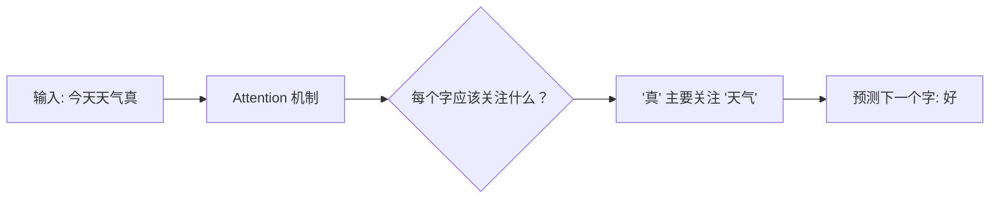

# 第 1 章：LLM 是什么，怎么工作的

**学完本章，你将能够：**

- 用直觉理解 LLM 的工作原理（不需要推公式）
- 用 Python 代码调用 OpenAI / Claude API
- 理解 Tokenization，知道为什么中文比英文更费 Token
- 掌握 Temperature、上下文窗口等核心参数的含义
- 知道 Self-Attention 的直觉原理

---

## 1.1 一个直觉：LLM 是"超级自动补全"

你每天都在用"自动补全"——手机输入法会根据你已经输入的字，预测下一个字。比如你输入"今天天气"，输入法会建议"不错"、"很好"、"怎么样"。

**LLM（Large Language Model，大语言模型）本质上就是一个超级强大的自动补全机器。** 它做的事情和你手机输入法完全一样：给定前面的文字，预测下一个字（准确地说是下一个 Token）。

区别在于：

| | 手机输入法 | GPT-4 |
|---|---|---|
| 训练数据 | 你的聊天记录 | 互联网上万亿字的文本 |
| 参数量 | 几百万 | 几千亿 |
| 能力 | 补全几个字 | 写文章、写代码、推理、翻译 |

关键直觉：**LLM 不是"理解"了你的问题，而是根据海量训练数据，计算出"最可能的下一个字"。** 但当模型足够大、数据足够多时，这种"统计预测"就表现出了惊人的"智能"。

让我们先跑一个最简单的例子，感受一下。

> 完整代码见 [`code/01-llm-basics/hello_llm.py`](/agent-tutorial/code/01-llm-basics/hello_llm.py)。

```python
from openai import OpenAI

client = OpenAI()  # 自动读取 OPENAI_API_KEY 环境变量

response = client.chat.completions.create(
    model="gpt-4o",
    messages=[
        {"role": "user", "content": "用一句话解释什么是 AI Agent"}
    ]
)

print(response.choices[0].message.content)
```

运行它，你会看到类似这样的输出：

> AI Agent 是一个能自主感知环境、做出决策并采取行动来完成目标的智能程序。

10 行代码，你已经完成了第一次 LLM API 调用。接下来我们深入了解它背后是怎么工作的。

---

## 1.2 Transformer 核心原理

所有现代 LLM（GPT、Claude、Llama）都基于同一种架构：**Transformer**。

你可以把 Transformer 理解为一种"注意力机制"——它在生成每个字的时候，会回头看前面所有的字，然后决定"该重点关注哪些字"。

### 类比：做阅读理解题

想象你在做一道阅读理解题："根据文章第三段，作者为什么感到失望？"

你的做法是：
1. 先看问题，知道关键词是"失望"
2. 回头扫描第三段，找到"失望"相关的句子
3. 把这些句子和问题一起理解，得出答案

Transformer 的 Self-Attention 做的就是同样的事情：



### Self-Attention 的直觉

Self-Attention 的核心思想可以用一句话概括：**让每个字都能"看到"其他所有字，并根据重要性加权。**

用公式表示：

$$
\text{Attention}(Q, K, V) = \text{softmax}\left(\frac{QK^T}{\sqrt{d_k}}\right)V
$$

别被公式吓到，它的意思就是：

1. **Q（Query，查询）**：每个字发出"我需要什么信息"的请求
2. **K（Key，键）**：每个字提供"我有什么信息"的标签
3. **V（Value，值）**：每个字提供实际内容
4. **$\frac{QK^T}{\sqrt{d_k}}$**：计算每个字和其他字的"相关度分数"
5. **softmax**：把分数转化为概率（加起来等于 1）
6. **乘以 $V$**：按概率加权，得到最终表示

$d_k$ 是 Key 向量的维度，$\sqrt{d_k}$ 用于缩放，防止点积值太大导致 softmax 梯度消失。

### 可视化 Attention 权重

让我们用 `bertviz` 可视化一下 Attention 到底在关注什么：

> 完整代码见 [`code/01-llm-basics/attention_viz.py`](/agent-tutorial/code/01-llm-basics/attention_viz.py)。

```python
# 注意：bertviz 可视化需要在 Jupyter Notebook 中运行
# 这里给出核心代码，用于理解 Attention 权重的含义
from transformers import AutoTokenizer, AutoModel
import torch

model_name = "bert-base-uncased"
tokenizer = AutoTokenizer.from_pretrained(model_name)
model = AutoModel.from_pretrained(model_name, output_attentions=True)

inputs = tokenizer("The cat sat on the mat", return_tensors="pt")
outputs = model(**inputs)

# 获取第 1 层、第 1 个 head 的 Attention 权重
attention = outputs.attentions[0][0, 0].detach().numpy()
print(f"Attention 矩阵形状: {attention.shape}")
# 输出: Attention 矩阵形状: (8, 8)  — 8 个 token 之间的相互关注程度
```

> **关键理解**：Transformer 不是把所有信息混在一起。通过多层 Attention，它能捕捉到语法关系（主语-谓语）、语义关系（同义词）甚至长距离依赖（指代关系）。这就是 LLM 能"理解"语言的原因。

---

## 1.3 Tokenization：LLM 眼中的文字长什么样

LLM 不是按"字"处理文本的，而是按 **Token**。Token 是介于"字"和"词"之间的单位。

为什么不用单个字？因为：
- "喜欢" 是一个语义单位，拆成 "喜" 和 "欢" 就丢了意思
- 但遇到没见过的词（如 "Transformer"），可以拆成 "Trans"+"form"+"er"

### 动手实验：看看 LLM 怎么拆分句子

> 完整代码见 [`code/01-llm-basics/tokenization_demo.py`](/agent-tutorial/code/01-llm-basics/tokenization_demo.py)。

```python
import tiktoken

# GPT-4o 使用的编码器
enc = tiktoken.encoding_for_model("gpt-4o")

# 英文
tokens = enc.encode("Hello, how are you?")
print(f"英文: {tokens}")
print(f"Token 数: {len(tokens)}")
# 输出: Token 数: 6

# 中文
tokens = enc.encode("你好，你今天怎么样？")
print(f"\n中文: {tokens}")
print(f"Token 数: {len(tokens)}")
# 输出: Token 数: 8

# 对比：同样的意思，中文用了更多 token
print(f"\n中文比英文更费 Token！")
```

你可以试试看：

```python
# 把 token 拆解回来，看看 LLM 眼中的文字长什么样
text = "AI Agent 是人工智能的未来"
tokens = enc.encode(text)

print(f"原文: {text}")
print(f"Token 数: {len(tokens)}")
print("\n逐个 Token 解码:")
for i, token_id in enumerate(tokens):
    print(f"  Token {i}: {token_id} -> '{enc.decode([token_id])}'")
```

> **为什么中文更费 Token？** 因为 GPT 的训练数据以英文为主，中文在词表中的覆盖率较低。同样的语义，中文通常需要 1.5-2 倍的 Token 数。这意味着：
> - 中文输入占更多上下文窗口
> - 中文调用 API 更贵（按 Token 计费）
> - 这也是为什么有时 LLM 回复中文会夹杂英文——它在"省 Token"

### Token 与价格的关系

| 模型 | 输入价格（每百万 Token） | 输出价格（每百万 Token） |
|---|---|---|
| GPT-4o | $2.50 | $10.00 |
| GPT-4o-mini | $0.15 | $0.60 |
| Claude Sonnet 4.6 | $3.00 | $15.00 |

一个中文问题大约 20-50 个 Token，回答大约 100-500 个 Token。所以一次对话的成本通常不到 $0.01。

---

## 1.4 参数量、上下文窗口、Temperature

### 参数量：模型的"脑容量"

参数量就像模型的"神经元数量"：

| 模型 | 参数量 | 类比 |
|---|---|---|
| GPT-2 | 1.5B | 小学生 |
| Llama 3 8B | 8B | 中学生 |
| GPT-4o | ~200B（推测） | 大学生 |
| Claude Opus 4 | 未公开 | 研究生 |

参数越多，模型能记住的知识越多、推理能力越强，但也越慢、越贵。

### 上下文窗口：模型的"工作记忆"

上下文窗口（Context Window）是模型一次能"看到"的最大文本长度：

- GPT-4o：128K Token（约 10 万字中文）
- Claude Opus 4：200K Token（约 15 万字中文）

你可以把上下文窗口想象成考试时能带的"草稿纸"。草稿纸越大，你能处理的信息越多，但也不能无限大。

> **注意**：上下文窗口越大，API 调用越贵，因为价格是按输入 + 输出的总 Token 数计算的。

### Temperature：控制"创造力"

Temperature 是最重要的生成参数，它控制模型输出的"随机性"：

$$
P(w_i) = \frac{\exp(z_i / T)}{\sum_j \exp(z_j / T)}
$$

- $T$ 是 Temperature 参数
- $z_i$ 是每个词的原始分数（logit）
- 当 $T \to 0$：只选概率最高的词（确定性最高）
- 当 $T \to 1$：按原始概率采样（正常模式）
- 当 $T > 1$：概率分布更平坦（更随机、更有"创造力"）

| Temperature | 适用场景 |
|---|---|
| 0 | 代码生成、数学计算、事实问答 |
| 0.7 | 日常对话、通用任务 |
| 1.0+ | 创意写作、头脑风暴 |

让我们做一个实验，看看不同 Temperature 的效果：

> 完整代码见 [`code/01-llm-basics/temperature_experiment.py`](/agent-tutorial/code/01-llm-basics/temperature_experiment.py)。

```python
from openai import OpenAI

client = OpenAI()

prompt = "写一首关于秋天的五言绝句，只写一首"

for temp in [0, 0.7, 1.2]:
    response = client.chat.completions.create(
        model="gpt-4o",
        messages=[{"role": "user", "content": prompt}],
        temperature=temp,
    )
    print(f"Temperature = {temp}:")
    print(response.choices[0].message.content)
    print("---")
```

运行这个实验几次，你会发现：
- `temperature=0`：每次结果几乎一样
- `temperature=0.7`：有变化但主题稳定
- `temperature=1.2`：风格和用词差异很大，偶尔会出现奇怪的句子

> **踩坑提醒**：如果你的任务需要确定性输出（如 JSON 格式、代码生成），一定要设 `temperature=0`。否则同样的输入可能得到不同格式的输出。

---

## 动手练习

### 练习 1（基础）：搭建最简单的聊天机器人

> 写一个循环，让用户可以和 GPT 持续对话。输入 "quit" 退出。
>
> 提示：用 `while True` 循环 + `input()` 获取用户输入，维护一个 `messages` 列表存储对话历史。

### 练习 2（进阶）：Token 成本计算器

> 写一个函数，给定一段中文文本和一个模型名称，计算输入需要多少 Token、大约花多少钱。
>
> 提示：用 `tiktoken` 做 Token 计数，参考上面的价格表。

### 练习 3（挑战）：Temperature 对比实验

> 固定一个 Prompt（比如"解释量子纠缠"），分别用 `temperature=0, 0.5, 1.0, 1.5` 调用 API 各 5 次。统计每次输出的 Token 数和内容差异。
>
> 提示：可以用 `difflib.SequenceMatcher` 计算两段文本的相似度。

---

## 常见踩坑 FAQ

### Q: 调用 API 报错 `RateLimitError`

API 有请求频率限制。解决办法：
1. 加入重试逻辑（`tenacity` 库的 `@retry` 装饰器）
2. 用 `time.sleep(1)` 在请求之间加延迟
3. 降低并发量

### Q: 输出被截断了

检查 `max_tokens` 参数。默认值可能太小。设置为一个更大的值，或不传这个参数让模型自己决定。

### Q: 中文回复夹杂英文

这是 GPT 模型的常见现象。在 System Prompt 中明确要求"请用中文回复"可以缓解。

### Q: 为什么我的 `temperature=0` 结果还是不完全一样？

OpenAI API 的 `temperature=0` 是"几乎确定性"，但不是完全确定。后端可能有浮点精度差异。如果需要完全可重现的结果，还需要设置 `seed` 参数。

---

下一章：[Prompt Engineering — 用 Prompt 让大模型高质量完成任务](/notes/tutorial/ai-agent/02-prompt-engineering/)。
