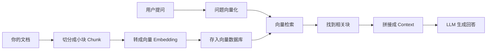

# 第 3 章：RAG — 让 LLM 拥有外部知识

**学完本章，你将能够：**

- 理解 LLM 的幻觉问题，知道 RAG 为什么重要
- 搭建一个完整的 PDF 文档问答系统
- 掌握不同的文档切分（Chunking）策略
- 实现向量检索和混合检索

---

## 3.1 幻觉问题：LLM 为什么会"胡说八道"

让我们先做一个实验：

```python
from openai import OpenAI
client = OpenAI()

response = client.chat.completions.create(
    model="gpt-4o",
    messages=[{"role": "user", "content": "《三体》的作者是谁？他获得雨果奖是哪一年？"}],
)
print(response.choices[0].message.content)
# 大概率回答正确：刘慈欣，2015年

# 但如果问一个更冷门的问题：
response = client.chat.completions.create(
    model="gpt-4o",
    messages=[{"role": "user", "content": "刘慈欣在 2024 年出版了什么新书？"}],
)
# LLM 可能会"编造"一个不存在的书名！
```

**幻觉（Hallucination）** 是 LLM 的固有问题。LLM 本质上是"预测下一个最可能的 Token"，当它不知道答案时，会基于训练数据的模式"编造"一个看起来合理的回答。

### 为什么会有幻觉？

| 原因 | 说明 |
|---|---|
| 训练数据有截止日期 | GPT-4o 的知识截止到 2023 年（具体日期因模型而异） |
| 统计概率 vs 事实 | LLM 选择的是"最可能的下一个 Token"，不是"最正确的事实" |
| 缺乏私有知识 | 你公司的内部文档、最新数据不在训练集中 |

### RAG 的解决方案

**RAG（Retrieval-Augmented Generation，检索增强生成）** 的核心思想很简单：

> **在 LLM 回答问题之前，先帮它找到相关资料。**

就像开卷考试——学生不需要把所有知识都记住，只需要知道去哪里找答案。

---

## 3.2 RAG 完整流程



分步理解：

**第 1 步：文档切分（Chunking）**
把长文档切成小段（通常 200-1000 字一段）。为什么要切？因为：
- LLM 的上下文窗口有限，不能把整个文档都塞进去
- 检索时需要精确定位到相关段落，而不是整篇文档

**第 2 步：向量化（Embedding）**
把每段文字转化成一个数字向量（一串数字）。语义相近的文字，向量也相近。这就像把文字放在一个"语义空间"里——"猫"和"狗"的距离比"猫"和"汽车"近。

$$
\text{Embedding}(\text{"猫"}) = [0.2, -0.5, 0.8, ...] \quad \text{(通常 1536 维)}
$$

**第 3 步：存储到向量数据库**
把所有文档块的向量存起来，建立索引。常用的向量数据库有 Chroma、FAISS、Pinecone 等。

**第 4 步：检索**
用户提问时，把问题也转成向量，然后在数据库中找到最相似的文档块。这个过程叫**语义检索**。

**第 5 步：生成**
把检索到的文档块和用户问题一起交给 LLM，让它基于这些"参考资料"来回答。

> **关键理解**：RAG 让 LLM 从"闭卷考试"变成"开卷考试"。它不需要记住所有知识，只需要会查资料、会总结。

---

## 3.3 动手：PDF 问答助手

让我们用 50 行代码搭建一个完整的 RAG 应用。

> 完整代码见 [`code/03-rag/pdf_qa.py`](/agent-tutorial/code/03-rag/pdf_qa.py)。

### 核心代码

```python
import chromadb
from openai import OpenAI

client = OpenAI()
chroma_client = chromadb.Client()

# 第 1 步：创建集合（相当于一个"数据库表"）
collection = chroma_client.create_collection(name="my_docs")

# 第 2 步：把文档切块并存入
documents = [
    "AI Agent 是能够自主感知环境、做出决策并采取行动的智能程序。",
    "RAG 通过检索外部知识来增强 LLM 的回答能力，减少幻觉。",
    "Transformer 是现代 LLM 的基础架构，核心是 Self-Attention 机制。",
    "Prompt Engineering 是通过设计输入提示来优化 LLM 输出的技术。",
]

# 用 OpenAI 的 Embedding API 把文本转成向量
def get_embedding(text: str) -> list[float]:
    response = client.embeddings.create(
        model="text-embedding-3-small",
        input=text,
    )
    return response.data[0].embedding

# 存入 ChromaDB
for i, doc in enumerate(documents):
    collection.add(
        ids=[f"doc_{i}"],
        documents=[doc],
        embeddings=[get_embedding(doc)],
    )

# 第 3 步：检索
def retrieve(query: str, n_results: int = 3) -> list[str]:
    """检索最相关的文档块"""
    query_embedding = get_embedding(query)
    results = collection.query(
        query_embeddings=[query_embedding],
        n_results=n_results,
    )
    return results["documents"][0]

# 第 4 步：生成回答
def ask(question: str) -> str:
    """RAG 问答"""
    # 检索相关文档
    context_docs = retrieve(question)
    context = "\n".join(context_docs)

    # 拼接 Prompt
    response = client.chat.completions.create(
        model="gpt-4o",
        messages=[
            {"role": "system", "content": f"根据以下参考资料回答问题。如果资料中没有相关信息，请说"我无法根据现有资料回答"。\n\n参考资料：\n{context}"},
            {"role": "user", "content": question},
        ],
    )
    return response.choices[0].message.content

# 测试
print(ask("什么是 AI Agent？"))
```

---

## 3.4 Chunking 策略对比

文档切分是 RAG 中最关键的环节之一。切得太粗，检索不精准；切得太细，丢失上下文。

> 完整代码见 [`code/03-rag/chunking_experiment.py`](/agent-tutorial/code/03-rag/chunking_experiment.py)。

```python
def fixed_size_chunks(text: str, chunk_size: int = 200, overlap: int = 50) -> list[str]:
    """固定大小切分，带重叠"""
    chunks = []
    start = 0
    while start < len(text):
        end = start + chunk_size
        chunks.append(text[start:end])
        start = end - overlap  # 重叠部分
    return chunks


def sentence_chunks(text: str) -> list[str]:
    """按句子切分（更自然的语义单元）"""
    import re
    sentences = re.split(r'[。！？\n]+', text)
    return [s.strip() for s in sentences if s.strip()]


def recursive_chunks(text: str, chunk_size: int = 200) -> list[str]:
    """递归切分：先按段落，再按句子，最后按字符"""
    separators = ["\n\n", "\n", "。", "！", "？", "，", " "]
    # 优先按大单元切分，如果还是太长就按小单元
    # 这就是 LangChain 的 RecursiveCharacterTextSplitter 的原理
```

| 策略 | 优点 | 缺点 | 适用场景 |
|---|---|---|---|
| 固定大小 | 简单可控 | 可能切断句子 | 结构化文本 |
| 按句子 | 语义完整 | 块大小不均匀 | 文章、对话 |
| 递归切分 | 灵活、兼顾语义 | 实现稍复杂 | 通用场景 |

---

## 3.5 混合检索：向量 + BM25

向量检索擅长理解语义（"机器学习"能匹配到"ML"），但可能漏掉关键词精确匹配的情况。BM25 是传统的关键词检索算法，擅长精确匹配。

**混合检索 = 向量检索 + BM25**，两者互补，效果通常更好。

> 完整代码见 [`code/03-rag/hybrid_search.py`](/agent-tutorial/code/03-rag/hybrid_search.py)。

```python
from rank_bm25 import BM25Okapi
import numpy as np

def hybrid_search(query: str, documents: list[str], alpha: float = 0.5) -> list[str]:
    """混合检索：向量检索 + BM25

    alpha: 向量检索的权重（0-1），1-alpha 是 BM25 的权重
    """
    # BM25 分数
    tokenized_docs = [list(doc) for doc in documents]  # 简化分词
    bm25 = BM25Okapi(tokenized_docs)
    bm25_scores = bm25.get_scores(list(query))

    # 向量检索分数
    query_emb = get_embedding(query)
    doc_embs = [get_embedding(doc) for doc in documents]
    vector_scores = [
        cosine_similarity(query_emb, emb) for emb in doc_embs
    ]

    # 归一化后加权
    bm25_norm = np.array(bm25_scores) / (max(bm25_scores) + 1e-8)
    vector_norm = np.array(vector_scores) / (max(vector_scores) + 1e-8)

    combined = alpha * vector_norm + (1 - alpha) * bm25_norm
    ranked_indices = np.argsort(combined)[::-1]

    return [documents[i] for i in ranked_indices]
```

---

## 动手练习

### 练习 1（基础）：搭建一个简单的文档问答

> 准备 5 段不同主题的文本（可以自己写，也可以从维基百科复制），用 ChromaDB 存储并实现问答。
> 测试：问一个只有某段文本包含答案的问题，看看 RAG 能不能找到正确的段落。

### 练习 2（进阶）：给你的简历做一个问答助手

> 把你的简历（或一段个人介绍）作为知识库，实现一个能回答"你有什么技能"、"你的项目经历"等问题的助手。
> 提示：先用 `pdfplumber` 或 `PyPDF2` 读取 PDF 文件。

### 练习 3（挑战）：对比不同 Chunking 策略

> 准备一篇 2000 字以上的文章，分别用"固定大小"、"按句子"、"递归"三种策略切分。
> 对每个策略：存储所有块，然后问 5 个问题，统计检索到的块是否包含正确答案。
> 哪种策略的准确率最高？

---

## 常见踩坑 FAQ

### Q: 向量检索结果不相关

检查 Embedding 模型是否合适。中文文档用 `text-embedding-3-small` 效果一般，可以试试专门的中文 Embedding 模型如 `bge-large-zh`。

### Q: 检索到了相关内容，但 LLM 还是"幻觉"

在 Prompt 中明确要求"只根据提供的资料回答，不要编造信息"。如果资料中没有答案，让模型说"我无法根据现有资料回答"。

### Q: ChromaDB 报错 `UniqueConstraintError`

`add()` 时 `ids` 必须唯一。如果你重复运行代码，先 `delete_collection()` 再重新创建。

### Q: PDF 读取后文字乱码

PDF 解析问题。试试：
1. 用 `pdfplumber` 代替 `PyPDF2`（对中文支持更好）
2. 如果是扫描件 PDF，需要用 OCR（如 `pytesseract`）

### Q: 向量化太慢

本地 Embedding 模型（如 `sentence-transformers`）首次加载需要下载模型。后续调用会很快。或者直接用 OpenAI 的 Embedding API，速度快但需要付费。

---

下一章：[Tool Use — 让 LLM 调用外部工具](/notes/tutorial/ai-agent/04-tool-use/)。
