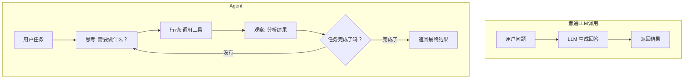

# 第 5 章：Agent 循环 — 思考-行动-观察

> **全教程最关键的一章。** 学完这章，你将真正理解 Agent 的本质，并能从零手写一个完整的 AI Agent。

**学完本章，你将能够：**

- 理解 Agent 和普通 LLM 调用的本质区别
- 掌握 ReAct（Reasoning + Acting）范式
- 不依赖任何框架，用纯 Python 手写一个 Agent
- 理解 Plan-and-Execute 模式与 ReAct 的区别和适用场景

---

## 5.1 什么是 Agent

### 普通 LLM 调用 vs Agent

| | 普通 LLM 调用 | Agent |
|---|---|---|
| 交互方式 | 一问一答 | 自主循环执行 |
| 工具使用 | 不使用或一次性使用 | 根据中间结果动态决定 |
| 执行步数 | 1 步 | 多步，直到完成任务 |
| 复杂任务 | 无法拆解 | 自动拆解、规划、执行 |

用一个类比：

> **普通 LLM** 像一个只会回答问题的客服——你问一句，它答一句。
>
> **Agent** 像一个实习生——你给他一个任务（"帮我调研一下竞品"），他会自己计划、查资料、整理、写报告，中间遇到问题还会自己想办法解决。



### Agent 的三个核心组成部分

1. **LLM（大脑）**：负责推理、决策、规划
2. **Tools（手脚）**：负责执行具体操作（搜索、计算、API 调用）
3. **Memory（记忆）**：记住之前做了什么、得到了什么结果

这三者通过一个**循环**连接在一起：大脑思考 → 手脚行动 → 观察结果 → 大脑再思考 → ... 直到任务完成。

---

## 5.2 ReAct 范式

**ReAct（Reasoning + Acting）** 是目前最主流的 Agent 范式，由 Yao et al. 在 2022 年提出。

核心思想：**每一步都先"想"再"做"**。

### 一个完整的 ReAct 过程

假设用户问："2024 年诺贝尔物理学奖得主是哪个学校的？"

```
Step 1 - Thought: 我需要先搜索 2024 年诺贝尔物理学奖得主是谁
         Action:  search("2024 Nobel Prize Physics winner")
         Observation: Geoffrey Hinton 和 John Hopfield 获得 2024 年诺贝尔物理学奖

Step 2 - Thought: 现在我知道得主了，需要查他们分别是哪个学校的
         Action:  search("Geoffrey Hinton university")
         Observation: Geoffrey Hinton 是多伦多大学教授

Step 3 - Thought: 还需要查 John Hopfield
         Action:  search("John Hopfield university")
         Observation: John Hopfield 是普林斯顿大学教授

Step 4 - Thought: 我已经收集到所有信息了，可以回答用户的问题
         Final Answer: 2024 年诺贝尔物理学奖得主是 Geoffrey Hinton（多伦多大学）
                       和 John Hopfield（普林斯顿大学）。
```

> **关键理解**：每一步的 "Thought" 不是给用户看的，而是 Agent 的"内心独白"——它在告诉自己"我现在知道了什么，下一步该做什么"。这个思考过程让 Agent 的行为可解释、可调试。

### ReAct 的优势

- **可解释**：每一步都有推理过程，出错时容易定位
- **灵活**：根据中间结果动态调整策略
- **可靠**：Thought 步骤让 LLM "想清楚再做"，减少盲目行动

---

## 5.3 手写 ReAct Agent

这是全教程最重要的代码。我们不用任何框架，只用 `openai` 库和 Python 标准库，从零实现一个完整的 ReAct Agent。

> 完整代码见 [`code/05-agent-loop/react_from_scratch.py`](/agent-tutorial/code/05-agent-loop/react_from_scratch.py)。

### 核心循环

```python
def react_agent(user_query: str, tools: dict, llm, max_steps: int = 10) -> str:
    """ReAct Agent 核心循环

    Args:
        user_query: 用户的输入
        tools: 工具字典 {名称: 函数}
        llm: LLM 调用函数
        max_steps: 最大执行步数

    Returns:
        Agent 的最终回答
    """
    # 初始化系统提示
    system_prompt = build_system_prompt(tools)
    messages = [
        {"role": "system", "content": system_prompt},
        {"role": "user", "content": user_query},
    ]

    for step in range(max_steps):
        # 第 1 步：让 LLM 思考并决定下一步行动
        response = llm(messages)
        assistant_message = parse_response(response)

        # 如果 LLM 给出了最终答案，循环结束
        if assistant_message.get("is_final"):
            return assistant_message["answer"]

        # 第 2 步：执行工具
        action = assistant_message["action"]
        action_input = assistant_message["action_input"]
        observation = execute_tool(tools, action, action_input)

        # 第 3 步：把结果加入对话历史
        messages.append({
            "role": "assistant",
            "content": f"Thought: {assistant_message.get('thought', '')}\n"
                       f"Action: {action}\n"
                       f"Action Input: {action_input}"
        })
        messages.append({
            "role": "user",  # 用 user 角色传递观察结果
            "content": f"Observation: {observation}"
        })

    return "达到最大步数限制，任务未完成"
```

### 逐行讲解

**1. 构建 System Prompt**

System Prompt 告诉 LLM "你现在是一个 Agent，你需要这样思考和行动"：

```python
def build_system_prompt(tools: dict) -> str:
    tool_descriptions = "\n".join([
        f"- {name}: {func.__doc__}" for name, func in tools.items()
    ])

    return f"""你是一个 ReAct Agent。按以下格式回答问题：

Thought: 分析当前情况，决定下一步
Action: 工具名称
Action Input: 工具参数（JSON 格式）

当你能回答用户问题时：
Thought: 我已经收集到足够信息
Final Answer: 你的最终回答

可用工具：
{tool_descriptions}

重要规则：
1. 每次只能调用一个工具
2. 如果工具返回错误，分析原因并尝试其他方法
3. 不要重复调用同一个工具用同样的参数"""
```

**2. 解析 LLM 输出**

LLM 返回的是文本，我们需要解析出 Thought、Action、Action Input：

```python
def parse_response(text: str) -> dict:
    """解析 Agent 的输出"""
    result = {}

    if "Final Answer:" in text:
        result["is_final"] = True
        result["answer"] = text.split("Final Answer:")[-1].strip()
        return result

    result["is_final"] = False

    for line in text.strip().split("\n"):
        if line.startswith("Thought:"):
            result["thought"] = line[8:].strip()
        elif line.startswith("Action:"):
            result["action"] = line[7:].strip()
        elif line.startswith("Action Input:"):
            result["action_input"] = line[13:].strip()

    return result
```

**3. 执行工具**

```python
def execute_tool(tools: dict, action: str, action_input: str) -> str:
    """执行工具并返回结果"""
    func = tools.get(action)
    if not func:
        return f"错误：未知工具 '{action}'"

    try:
        # 尝试把 input 解析为 JSON
        try:
            args = json.loads(action_input)
        except json.JSONDecodeError:
            args = {"query": action_input}  # 默认作为 query 参数

        return str(func(**args))
    except Exception as e:
        return f"工具执行错误: {e}"
```

### 运行完整示例

```python
# 定义工具
def search(query: str) -> str:
    """搜索互联网获取信息"""
    # 这里用模拟数据，实际项目中调用搜索 API
    knowledge = {
        "Python": "Python 由 Guido van Rossum 于 1991 年创建。",
        "AI Agent": "AI Agent 是能自主感知和行动的智能程序。",
    }
    for key, value in knowledge.items():
        if key.lower() in query.lower():
            return value
    return f"搜索 '{query}' 未找到相关结果"

def calculate(expression: str) -> str:
    """执行数学计算"""
    return str(eval(expression))

# 创建 Agent 并运行
tools = {"search": search, "calculate": calculate}
answer = react_agent("Python 是谁创建的？创建于哪一年？", tools, call_llm)
print(answer)
```

---

## 5.4 Plan-and-Execute：先规划再执行

ReAct 是"边想边做"——每一步决定下一步做什么。但有些复杂任务需要"先规划再执行"。

### 两种模式对比

| | ReAct | Plan-and-Execute |
|---|---|---|
| 思维方式 | 每步决策 | 先规划全局，再逐步执行 |
| 优点 | 灵活，能应对意外 | 结构清晰，不容易遗漏 |
| 缺点 | 可能"走弯路" | 计划可能需要调整 |
| 适用场景 | 探索性任务、信息收集 | 步骤明确的复杂任务 |

### Plan-and-Execute 实现

> 完整代码见 [`code/05-agent-loop/plan_and_execute.py`](/agent-tutorial/code/05-agent-loop/plan_and_execute.py)。

```python
def plan_and_execute(user_query: str, tools: dict, llm, max_replans: int = 3) -> str:
    """Plan-and-Execute Agent

    第 1 阶段：LLM 生成执行计划
    第 2 阶段：逐步执行计划中的每个步骤
    第 3 阶段：如果执行失败，重新规划
    """
    # 阶段 1：生成计划
    plan = generate_plan(user_query, llm)
    print(f"计划: {plan}")

    for replan_count in range(max_replans):
        results = []

        # 阶段 2：逐步执行
        for step in plan:
            result = execute_step(step, tools, llm)
            results.append({"step": step, "result": result})

            # 如果某步失败，可能需要重新规划
            if "错误" in result:
                plan = replan(user_query, results, llm)
                break
        else:
            # 所有步骤都成功了
            return synthesize_answer(user_query, results, llm)

    return "任务失败：多次重新规划后仍未完成"
```

---

## 动手练习

### 练习 1（基础）：手写 Agent，支持自定义工具

> 基于本章的 `react_agent` 代码，实现一个支持以下工具的 Agent：
> - `get_time()`：返回当前时间
> - `calculate(expr)`：数学计算
> - `search(query)`：模拟搜索
>
> 测试："现在几点了？另外帮我算一下 2 的 20 次方。"

### 练习 2（进阶）：给 Agent 添加日志功能

> 让 Agent 在每一步执行时，打印出 Thought / Action / Observation 的详细日志。
> 格式参考：
> ```
> [Step 1] Thought: 需要先搜索...
> [Step 1] Action: search("...")
> [Step 1] Observation: ...
> [Step 2] ...
> ```

### 练习 3（挑战）：实现带记忆的 Agent

> 给 Agent 添加一个"笔记本"功能：
> - Agent 可以调用 `save_note(key, value)` 保存中间结果
> - Agent 可以调用 `read_note(key)` 读取之前保存的信息
> - 测试一个需要跨步骤传递信息的任务

---

## 常见踩坑 FAQ

### Q: Agent 陷入死循环，一直调用同一个工具

在 System Prompt 中明确写"不要重复调用同一个工具用同样的参数"。另外可以加一个去重逻辑：如果连续两次调用相同，强制跳出循环。

### Q: LLM 不按 Thought/Action 格式输出

1. 检查 System Prompt 是否清晰
2. 降低 `temperature`（建议 0 或 0.1）
3. 在 `parse_response` 中加容错逻辑

### Q: Agent 执行太慢

1. 检查是否有不必要的重复调用
2. 减少 `max_steps`
3. 优化工具实现（如缓存搜索结果）

### Q: 如何调试 Agent？

打印每一步的 Thought、Action、Observation。Agent 的 Thought 就是它的"内心独白"，通过它你可以理解 Agent 为什么做出某个决策。

### Q: ReAct 和 Function Calling 有什么区别？

**Function Calling** 是 LLM API 的一个功能——让 LLM 输出工具调用的 JSON。
**ReAct** 是一种 Agent 设计范式——定义了"思考-行动-观察"的循环模式。
ReAct 可以用 Function Calling 实现（更结构化），也可以用纯文本解析实现（更灵活）。本章两种都展示了。

---

下一章：[LangGraph 框架实战](/notes/tutorial/ai-agent/06-langgraph/) — 用框架构建更复杂的 Agent 工作流。
