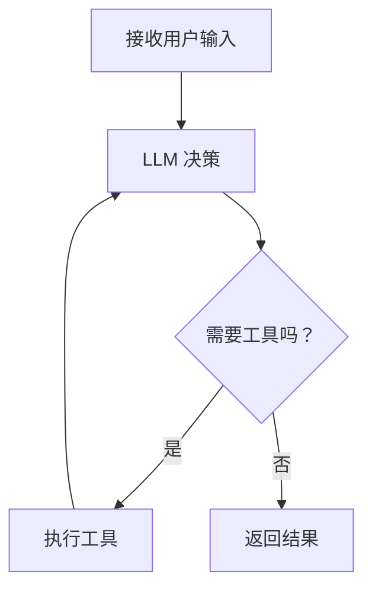
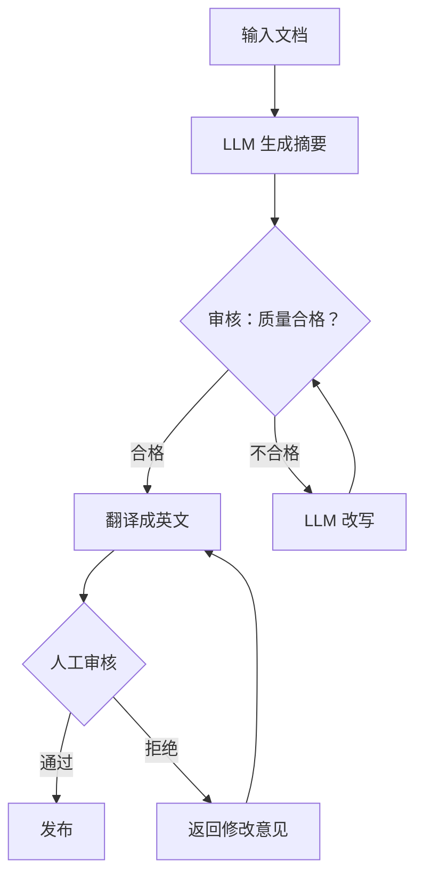

# 第 6 章：LangGraph 框架实战

**学完本章，你将能够：**

- 理解什么时候该用框架、什么时候该手写
- 掌握 LangGraph 的核心概念：State、Node、Edge
- 构建带分支和循环的复杂 Agent 工作流
- 实现人机协作（Human-in-the-Loop）模式

---

## 6.1 为什么需要框架

第 5 章我们手写了 ReAct Agent，100 行代码就够了。那你可能会问：**为什么还需要框架？**

| 场景 | 手写 | 框架 |
|---|---|---|
| 简单 Agent | 够用，代码清晰 | 杀鸡用牛刀 |
| 带分支的工作流 | 代码变成一堆 if-else | 声明式定义，清晰直观 |
| 需要持久化/恢复 | 自己实现序列化 | 内置支持 |
| 多 Agent 协作 | 管理多个循环很麻烦 | 统一的状态管理 |
| 调试和可视化 | 只能 print | 内置 tracing |

> **建议**：先手写理解原理，再用框架提高效率。如果没读第 5 章就直接用 LangGraph，你会不知道框架在帮你做什么。

### LangGraph 的核心思想

LangGraph 把 Agent 看作一个**有向图**：



每个**节点（Node）** 是一个函数，每条**边（Edge）** 表示节点之间的转移。条件边（Conditional Edge）可以根据状态决定走哪条路。

---

## 6.2 核心概念

### State（状态）

State 是贯穿整个图的数据。你可以把它想象成一个"全局变量"，所有节点都能读写：

```python
from typing import TypedDict, Annotated
from langgraph.graph import add_messages

class AgentState(TypedDict):
    messages: Annotated[list, add_messages]  # 对话历史
    tool_results: list                        # 工具调用结果
    step_count: int                           # 当前步骤数
```

### Node（节点）

节点是处理函数，接收当前 State，返回更新后的 State：

```python
def call_llm(state: AgentState) -> AgentState:
    """节点：调用 LLM"""
    response = llm.invoke(state["messages"])
    return {"messages": [response]}

def call_tool(state: AgentState) -> AgentState:
    """节点：执行工具"""
    # 从最后一条消息中提取工具调用
    last_message = state["messages"][-1]
    # 执行工具...
    return {"messages": [tool_result]}
```

### Edge（边）

边定义节点之间的连接：

```python
from langgraph.graph import StateGraph, END

# 普通边：A -> B
graph.add_edge("node_a", "node_b")

# 条件边：根据条件选择下一个节点
graph.add_conditional_edges(
    "decision_node",
    lambda state: "tools" if needs_tool(state) else "end",
    {"tools": "tool_node", "end": END}
)
```

### 完整示例：用 LangGraph 重写 ReAct Agent

> 完整代码见 [`code/06-langgraph/basic_agent.py`](/agent-tutorial/code/06-langgraph/basic_agent.py)。

```python
from typing import TypedDict, Annotated
from langgraph.graph import StateGraph, END
from langgraph.prebuilt import ToolNode
from langchain_openai import ChatOpenAI
from langchain_core.messages import HumanMessage

# 第 1 步：定义 State
class AgentState(TypedDict):
    messages: Annotated[list, lambda x, y: x + y]

# 第 2 步：定义工具
def search(query: str) -> str:
    """搜索信息"""
    return f"搜索结果: {query}"

def calculate(expression: str) -> str:
    """数学计算"""
    return str(eval(expression))

tools = [search, calculate]

# 第 3 步：创建 LLM（绑定工具）
llm = ChatOpenAI(model="gpt-4o", temperature=0)
llm_with_tools = llm.bind_tools(tools)

# 第 4 步：定义节点
def agent(state: AgentState):
    """Agent 节点：调用 LLM"""
    response = llm_with_tools.invoke(state["messages"])
    return {"messages": [response]}

tool_node = ToolNode(tools)

# 第 5 步：定义条件边
def should_continue(state: AgentState):
    """判断是否需要继续调用工具"""
    last_message = state["messages"][-1]
    if last_message.tool_calls:
        return "tools"
    return END

# 第 6 步：构建图
graph = StateGraph(AgentState)
graph.add_node("agent", agent)
graph.add_node("tools", tool_node)
graph.set_entry_point("agent")
graph.add_conditional_edges("agent", should_continue, {"tools": "tools", END: END})
graph.add_edge("tools", "agent")

# 编译并运行
app = graph.compile()
result = app.invoke({"messages": [HumanMessage(content="2 的 10 次方是多少？")]})
```

---

## 6.3 复杂工作流

LangGraph 的真正威力在于构建**带分支和循环**的复杂工作流。

### 示例：带审核的文档处理流水线



> 完整代码见 [`code/06-langgraph/complex_workflow.py`](/agent-tutorial/code/06-langgraph/complex_workflow.py)。

```python
from typing import TypedDict, Literal
from langgraph.graph import StateGraph, END

class WorkflowState(TypedDict):
    document: str
    summary: str
    translation: str
    quality_score: float
    human_approved: bool
    revision_count: int

def generate_summary(state: WorkflowState) -> WorkflowState:
    """节点：生成摘要"""
    # 调用 LLM 生成摘要
    ...

def review_quality(state: WorkflowState) -> WorkflowState:
    """节点：自动审核质量"""
    # 调用 LLM 给摘要打分
    ...

def quality_check(state: WorkflowState) -> Literal["pass", "fail"]:
    """条件边：质量检查"""
    if state["quality_score"] >= 0.8:
        return "pass"
    return "fail"

def translate(state: WorkflowState) -> WorkflowState:
    """节点：翻译"""
    ...

def human_review(state: WorkflowState) -> WorkflowState:
    """节点：人工审核"""
    # 这里会暂停等待人工输入
    ...

# 构建工作流
workflow = StateGraph(WorkflowState)
workflow.add_node("summarize", generate_summary)
workflow.add_node("review", review_quality)
workflow.add_node("revise", revise_summary)
workflow.add_node("translate", translate)
workflow.add_node("human_review", human_review)

workflow.set_entry_point("summarize")
workflow.add_edge("summarize", "review")
workflow.add_conditional_edges("review", quality_check, {"pass": "translate", "fail": "revise"})
workflow.add_edge("revise", "review")
workflow.add_edge("translate", "human_review")
```

LangGraph 还支持 **Human-in-the-Loop（人机协作）** 模式——在关键节点暂停执行，等待人工审核后再继续。这在需要人类把关的场景（如内容审核、代码审批）中非常有用。

> 完整代码见 [`code/06-langgraph/human_in_loop.py`](/agent-tutorial/code/06-langgraph/human_in_loop.py)，其中包含带 `MemorySaver` checkpoint 的暂停-恢复实现。

---

## 6.4 其他框架简介

LangGraph 不是唯一的选择。以下是几个主流的 Agent 框架对比：

| 框架 | 特点 | 适用场景 |
|---|---|---|
| **LangGraph** | 有向图、状态管理、支持循环 | 复杂工作流、需要精细控制 |
| **CrewAI** | 多角色协作、角色定义简单 | 多 Agent 协作（详见第 8 章） |
| **AutoGen** | 微软出品、对话驱动 | 多 Agent 对话、研究原型 |
| **MetaGPT** | 模拟软件公司流程 | 代码生成、项目管理 |

**CrewAI** 的核心抽象是 `Agent → Task → Crew`，你只需要定义每个角色的 `role`、`goal` 和 `backstory`，框架自动处理角色间的通信。它的上手门槛比 LangGraph 低得多，但灵活性也更低——适合"标准流水线"场景，不适合需要复杂分支逻辑的工作流。

**AutoGen** 的设计哲学是"Agent 之间通过对话协作"。你定义多个 Agent，它们会自动互相说话、讨论、直到达成共识。适合探索性任务和研究原型，但对话轮次不好控制，成本容易失控。

**MetaGPT** 模拟了一个完整的软件公司：产品经理、架构师、开发者、测试者各司其职。它内置了代码生成的标准化流程（需求文档 → 系统设计 → 代码 → 测试），开箱即用但定制空间有限。

> **选型建议**：如果你的任务是线性流水线（A→B→C），用 CrewAI。如果需要循环和分支控制，用 LangGraph。如果是研究原型或快速实验，用 AutoGen。没有"最好的框架"，只有最适合你场景的框架。

---

## 动手练习

### 练习 1（基础）：用 LangGraph 重写第 5 章的 Agent

> 用 LangGraph 重写 ReAct Agent，支持 search 和 calculate 两个工具。
> 对比手写版本和框架版本的代码量和可读性。

### 练习 2（进阶）："研究→写作→审核"三步工作流

> 实现一个写作 Agent 工作流：
> 1. 研究阶段：搜索相关资料
> 2. 写作阶段：基于资料写一篇文章
> 3. 审核阶段：检查文章质量，不合格则返回写作阶段修改

### 练习 3（挑战）：带并行分支的工作流

> 实现一个工作流，让多个 Agent 同时处理不同的子任务（如同时搜索多个主题），然后汇总结果。

---

## 常见踩坑 FAQ

### Q: `langgraph` 安装失败

确保 Python 版本 >= 3.10。`pip install langgraph` 会自动安装依赖。如果报版本冲突，尝试在新虚拟环境中安装。

### Q: State 更新时数据丢失

LangGraph 的 State 更新是**合并**而不是**替换**。如果你用 `Annotated[list, add_messages]`，消息会自动追加。但如果用普通字段，赋值会覆盖。

### Q: 无限循环

给循环加上退出条件。比如限制最大步骤数：
```python
def should_continue(state):
    if state["step_count"] > 10:
        return END
    ...
```

### Q: 调试困难

使用 LangSmith 进行 tracing。设置环境变量 `LANGCHAIN_TRACING_V2=true`，可以在 LangSmith 界面查看每一步的输入输出。

---

下一章：[Memory — 让 Agent 拥有记忆](/notes/tutorial/ai-agent/07-memory/)。
