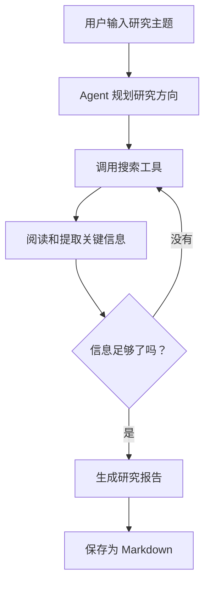
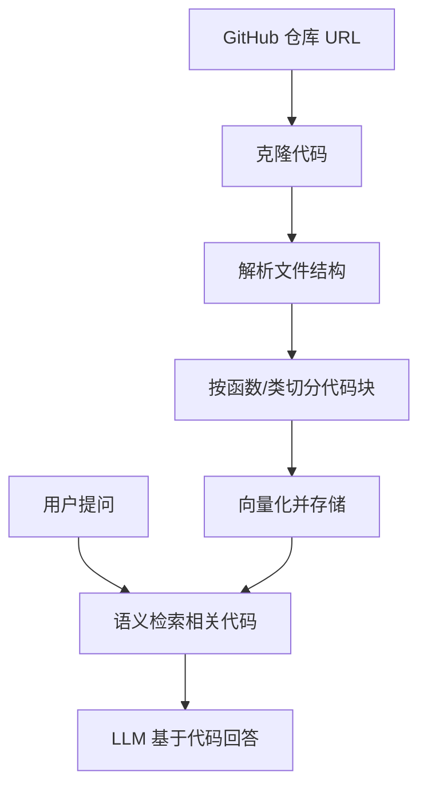
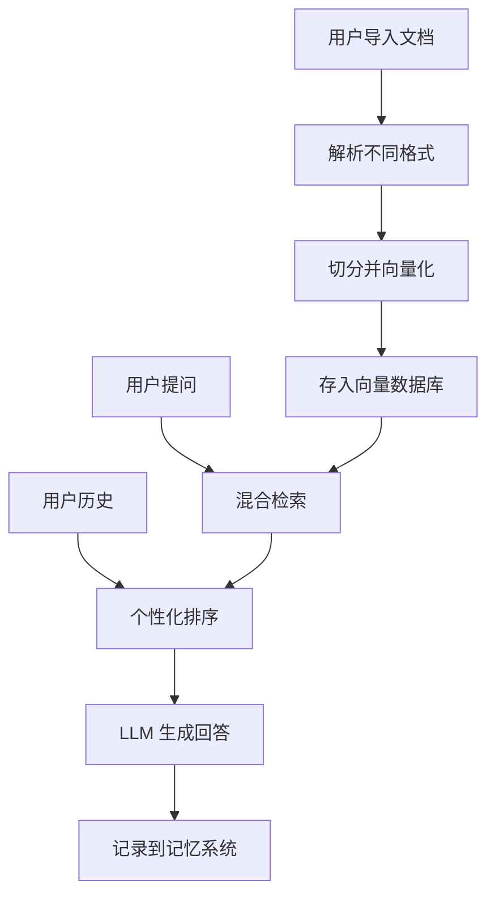

# 第 10 章：毕业项目

> 恭喜你走到最后一步！这章没有新知识——你将运用前 9 章学到的所有技能，独立完成一个完整的 Agent 产品。

**学完本章，你将拥有：**

- 一个可运行、可展示的 Agent 项目
- 一段可以在简历中详细描述的技术经历
- 对 Agent 开发全流程的深入理解

---

## 三个选题方向

### 选题 A：智能研究助手

> 帮用户研究一个话题，搜索资料、整理要点、生成研究报告。

**核心技术点：**
- RAG（检索 + 生成）
- Tool Use（搜索、网页抓取）
- 多步骤 Agent 循环
- 文档生成

**技术架构：**



**功能范围（MVP）：**
1. 用户输入一个研究主题
2. Agent 自动搜索 3-5 个相关网页
3. 提取关键信息，整理成结构化要点
4. 生成一篇 500-1000 字的研究报告
5. 支持用户追问和深入探索

**预计开发时间：** 10-15 小时

> 代码骨架见 [`code/10-capstone/research_assistant/`](/agent-tutorial/code/10-capstone/research_assistant/)。

---

### 选题 B：代码仓库问答

> 让用户用自然语言提问一个 GitHub 代码仓库，Agent 能读懂代码并回答问题。

**核心技术点：**
- 代码理解（AST 解析）
- RAG（代码片段检索）
- Embedding（代码向量化）
- 上下文管理

**技术架构：**



**功能范围（MVP）：**
1. 输入 GitHub 仓库 URL
2. 自动克隆并解析代码结构
3. 将代码按函数/类切分，向量化存储
4. 支持自然语言提问（如"这个项目的认证逻辑是怎么实现的？"）
5. 回答时引用具体文件和行号

**预计开发时间：** 12-18 小时

---

### 选题 C：个人知识库

> 把用户的笔记、文档变成一个可搜索、可问答的个人知识库。

**核心技术点：**
- 长期记忆（向量数据库持久化）
- 混合检索（语义 + 关键词）
- 个性化推荐
- 多格式文档处理

**技术架构：**



**功能范围（MVP）：**
1. 支持导入 Markdown、PDF、TXT 文档
2. 文档自动切分、向量化、存储
3. 自然语言问答，支持追问
4. 跨会话记忆（记住用户偏好和历史问题）
5. 相关笔记推荐

**预计开发时间：** 12-15 小时

---

## 项目开发路线

无论选择哪个题目，都按以下步骤进行：

### 第 1 步：需求分析（1-2 小时）

回答以下问题：

1. **核心功能是什么？** 一句话描述
2. **用户怎么用？** 写出 3 个用户故事
3. **技术难点在哪？** 列出 2-3 个主要挑战
4. **MVP 包含什么？** 最小可用版本的功能列表
5. **什么可以暂缓？** 后续再加的功能

### 第 2 步：架构设计（1-2 小时）

画出系统架构图（用 Mermaid 或手绘），明确：

- 有哪些模块（Agent、工具、存储、前端）
- 模块之间的数据流
- 用到哪些技术组件（LLM、向量数据库、框架等）

### 第 3 步：分步实现（8-12 小时）

按优先级实现功能：

```python
# 建议的开发顺序
# 1. 先跑通核心链路（最简单的版本）
# 2. 逐步添加工具和功能
# 3. 最后打磨体验和边界情况

# Day 1-2: 核心链路
# - 基础 RAG 或 Agent 循环
# - 最少一个工具（搜索或计算）

# Day 3-4: 功能完善
# - 添加更多工具
# - 实现记忆系统
# - 错误处理

# Day 5-6: 打磨和测试
# - 评估和优化
# - 安全防护
# - 编写 README
```

### 第 4 步：效果评估（2-3 小时）

准备 10 个测试问题，评估：
- 回答准确率（目标 > 80%）
- 平均响应时间（目标 < 10 秒）
- Token 消耗（单次对话 < $0.05）

### 第 5 步：简历包装（1 小时）

在简历中这样描述你的项目：

> **智能研究助手 | 独立开发**
>
> - 基于 GPT-4o 构建的 AI Agent，能自主搜索网页、提取信息、生成研究报告
> - 使用 RAG 技术结合向量检索，支持对历史研究资料的语义搜索
> - 实现 ReAct Agent 循环，支持多步骤推理和动态工具调用
> - 加入 Prompt Injection 防御和 Token 成本监控，保障生产级安全性
> - 技术栈：Python, OpenAI API, ChromaDB, LangGraph

---

## 代码骨架

每个选题提供了代码骨架，帮你快速开始：

### 选题 A 骨架

```python
# code/10-capstone/research_assistant/main.py

class ResearchAssistant:
    def __init__(self):
        self.tools = {
            "search": self.search_web,
            "read_url": self.read_webpage,
            "save_report": self.save_report,
        }
        self.memory = []  # 研究历史

    def research(self, topic: str) -> str:
        """主入口：研究一个话题"""
        # 1. 规划研究方向
        plan = self.plan_research(topic)

        # 2. 逐步搜索和收集信息
        findings = []
        for sub_topic in plan:
            results = self.search_web(sub_topic)
            findings.extend(results)

        # 3. 生成研究报告
        report = self.generate_report(topic, findings)

        # 4. 保存报告
        self.save_report(topic, report)
        return report

    def plan_research(self, topic: str) -> list[str]:
        """规划研究子话题"""
        ...

    def search_web(self, query: str) -> list[str]:
        """搜索网页"""
        ...

    def read_webpage(self, url: str) -> str:
        """读取网页内容"""
        ...

    def generate_report(self, topic: str, findings: list[str]) -> str:
        """生成研究报告"""
        ...

    def save_report(self, topic: str, report: str):
        """保存为 Markdown 文件"""
        ...
```

### 选题 B 和 C 骨架

> 详见 [`code/10-capstone/code_qa/`](/agent-tutorial/code/10-capstone/code_qa/) 和 [`code/10-capstone/knowledge_base/`](/agent-tutorial/code/10-capstone/knowledge_base/) 目录。

---

## 成功标准

| 标准 | 最低要求 | 加分项 |
|---|---|---|
| 核心功能 | 能跑通主流程 | 处理边界情况 |
| 代码质量 | 结构清晰、有注释 | 模块化、可测试 |
| 错误处理 | 不会崩溃 | 优雅降级 |
| 文档 | README 有安装和使用说明 | 有架构图和设计决策 |
| 评估 | 有 5 个以上测试用例 | 有自动化评估 Pipeline |

---

## 挑战与反思

在完成毕业项目后，回答以下问题来巩固你的学习：

### 反思 1：架构决策

> 回顾你选择的技术方案。为什么用 ReAct 而不是 Plan-and-Execute？为什么选 ChromaDB 而不是 FAISS？
> 把你的决策过程写下来——面试时这比代码本身更有价值。

### 反思 2：如果重新来过

> 列出 3 个你会做不同决定的地方。是工具设计不够好？Agent 循环效率太低？还是评估方法不够全面？
> 这些"如果"就是你下一次做项目时的经验。

### 反思 3：扩展计划

> 你的 MVP 之外还有哪些功能可以加？性能优化、多语言支持、前端界面？
> 制定一个 2.0 版本的计划，作为简历中"后续规划"的素材。

---

## 常见踩坑 FAQ

### Q: 不知道选哪个题目

如果你对搜索和信息提取更感兴趣，选 A。
如果你是后端/全栈开发者，选 B。
如果你想做一个"产品"，选 C。

### Q: 功能做不完怎么办

先做 MVP！核心功能跑通后再加东西。一个能跑的简单版本比一个"计划中的完美版本"有价值得多。

### Q: 用什么框架？

建议：第 5 章的纯 Python 手写 Agent 作为基础，按需加入 LangGraph 的状态管理。不要一开始就用 CrewAI 等重量级框架——你需要理解底层原理。

### Q: 如何在面试中展示这个项目？

1. 先用 30 秒介绍：做了什么、用了什么技术
2. 然后 demo：现场跑一遍
3. 接着讲技术细节：最有挑战性的部分你怎么解决的
4. 最后谈收获：如果重新做，你会怎么改进

---

## 恭喜你完成了整个教程！

回顾一下你学到的：

```text
第 1 章：LLM 原理               → 理解了"大脑"
第 2 章：Prompt Engineering     → 学会了和"大脑"沟通
第 3 章：RAG                    → 让 LLM 拥有外部知识
第 4 章：Tool Use               → 让 LLM 调用外部工具
第 5 章：Agent 循环             → 手写了完整的 Agent ⭐
第 6 章：LangGraph              → 用框架构建复杂工作流
第 7 章：Memory                 → 让 Agent 拥有记忆
第 8 章：Multi-Agent            → 多 Agent 协作
第 9 章：生产级 Agent           → 评估、安全、成本控制
第 10 章：毕业项目              → 独立完成一个完整产品 🎓
```

你现在具备了独立开发生产级 Agent 系统的能力。去创造属于你的 AI Agent 吧！
