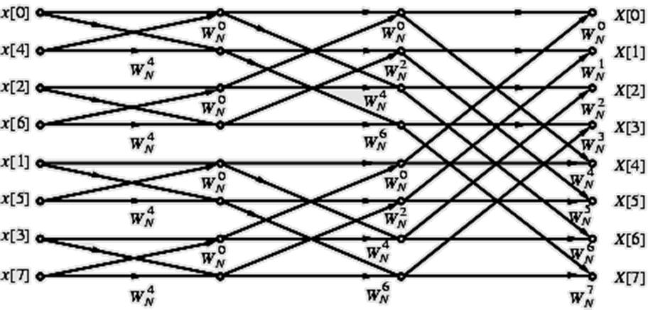
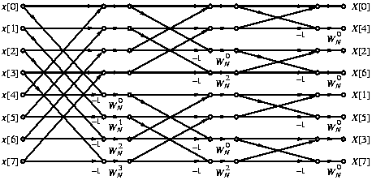

# 第11章 FFT 兼容入口

> 📌 考试定位：FFT 主内容已经并入 [第5章 DFT、FFT 与工程频谱](/notes/digital-signal-processing/chapter5/)。本页保留 `/notes/digital-signal-processing/chapter11/` 旧链接，避免已有引用断开，同时提供考前最常用的 FFT 速查。

## 0. 先用一句话抓住本章

FFT（Fast Fourier Transform）不是新的变换，而是 **快速计算 DFT 的算法**。考试中通常不要求你推完整算法，而是要求会：

- 写 DFT / IDFT 定义；
- 画或读 8 点 DIT / DIF FFT 流图；
- 判断 bit reversal 顺序；
- 计算复数乘法和复数加法数量；
- 解释 DIT 与 DIF 的输入输出顺序差异。

完整 DFT 性质、实序列对称、谱线 Hz 换算、DFT 长度变化、Overlap-add / Overlap-save 请回到 [第5章](/notes/digital-signal-processing/chapter5/)。

## 1. 30 秒公式速查

| 编号 | 公式 / 结论 | 名称 | 看到什么题干就用 |
|---|---|---|---|
| 11.1 | $W_N=e^{-j2\pi/N}$ | 旋转因子 | DFT、FFT、twiddle factor |
| 11.2 | $X[k]=\sum_{n=0}^{N-1}x[n]W_N^{kn}$ | DFT | 直接计算或推导蝶形 |
| 11.3 | $x[n]=\frac1N\sum_{k=0}^{N-1}X[k]W_N^{-kn}$ | IDFT | 从频域回时域 |
| 11.4 | $W_N^{k+N/2}=-W_N^k$ | 半周期性质 | 蝶形后一半输出的减号 |
| 11.5 | $W_N^{2rk}=W_{N/2}^{rk}$ | 可约性 | DIT 把 N 点拆成两个 N/2 点 |
| 11.6 | 级数 $=\log_2N$ | radix-2 FFT stage 数 | 问 N 点 FFT 有几级 |
| 11.7 | 每级蝶形数 $=N/2$ | butterfly 数 | 计算复杂度 |
| 11.8 | 复乘 $=\frac{N}{2}\log_2N$ | FFT 乘法次数 | 与直接 DFT 比较 |
| 11.9 | 复加 $=N\log_2N$ | FFT 加法次数 | 与直接 DFT 比较 |
| 11.10 | DIT：输入比特反转，输出正常 | DIT 顺序 | 画 8 点 DIT |
| 11.11 | DIF：输入正常，输出比特反转 | DIF 顺序 | 区分 DIT/DIF |

## 2. 5 分钟直觉

直接 DFT 每个 $X[k]$ 都要对 $N$ 个样本求和，总共 $N$ 个 $k$，所以复乘大约是 $N^2$。FFT 的想法是：不要每个频率都从头算，而是把一个 N 点 DFT 拆成两个 N/2 点 DFT，再拆成四个 N/4 点 DFT，直到 2 点 DFT。

2 点 DFT 最简单：

$$
X[0]=x[0]+x[1]
$$

$$
X[1]=x[0]-x[1]
$$

这就是蝶形运算的最小单元。更大的 FFT 只是把很多蝶形按规律连起来。

## 3. DIT FFT 速查

DIT（Decimation-In-Time）先把输入按时间索引的奇偶拆开：

$$
x_0[r]=x[2r],\quad x_1[r]=x[2r+1].
$$

由 DFT 定义可得：

$$
X[k]=X_0[k]+W_N^kX_1[k],\quad 0\le k\le N/2-1
$$

后一半利用 $W_N^{k+N/2}=-W_N^k$：

$$
X[k+N/2]=X_0[k]-W_N^kX_1[k].
$$

所以一个 DIT 蝶形就是：上输出相加，下输出相减。

```text
X0[k] ───────┬──── X[k]       = X0[k] + W_N^k X1[k]
             │
             │
X1[k] ── W ──┴──── X[k+N/2]   = X0[k] - W_N^k X1[k]
```

### 8 点 DIT 输入顺序

N = 8 需要 3 位二进制。把索引二进制反转：

| 正常索引 | 二进制 | 反转后 | DIT 输入顺序 |
|---:|---|---|---:|
| 0 | 000 | 000 | 0 |
| 1 | 001 | 100 | 4 |
| 2 | 010 | 010 | 2 |
| 3 | 011 | 110 | 6 |
| 4 | 100 | 001 | 1 |
| 5 | 101 | 101 | 5 |
| 6 | 110 | 011 | 3 |
| 7 | 111 | 111 | 7 |

因此 8 点 DIT FFT 左侧输入通常排成：

$$
x[0],x[4],x[2],x[6],x[1],x[5],x[3],x[7].
$$

输出是正常顺序：

$$
X[0],X[1],\ldots,X[7].
$$



**读图提醒：** 看三件事就够：左边输入是否比特反转；中间是否有 $\log_2 8=3$ 级；每一级蝶形跨距是否逐级变大。

## 4. DIF FFT 速查

DIF（Decimation-In-Frequency）把输入按前后两半拆开。它的结论和 DIT 很像，但数据流方向不同。

| 特性 | DIT FFT | DIF FFT |
|---|---|---|
| 抽取对象 | time index，按奇偶拆输入 | frequency index，输出奇偶拆分 |
| 输入顺序 | 比特反转 | 正常顺序 |
| 输出顺序 | 正常顺序 | 比特反转 |
| 蝶形乘法位置 | 常理解为先乘再加减 | 常理解为先加减再乘 |
| 计算量 | $\frac N2\log_2N$ 复乘，$N\log_2N$ 复加 | 相同 |

记忆口诀：**DIT 先乱后顺，DIF 先顺后乱。**



## 5. 典型题精讲

### 例题 1：计算 FFT 复杂度

**题目：** N = 256 时，直接 DFT 和 radix-2 FFT 的复数乘法次数分别是多少？

**解答：**

直接 DFT：

$$
N^2=256^2=65536.
$$

FFT：

$$
\frac{N}{2}\log_2N=128\times8=1024.
$$

**答案：** 直接 DFT 需要 65536 次复乘；FFT 需要 1024 次复乘。

**易错提醒：** $\log_2 256=8$，不是 $\log_{10}$。

### 例题 2：8 点 DIT 的比特反转

**题目：** 8 点 DIT FFT 中，正常索引 $n=3$ 的样本在比特反转后放到哪里？

**解答：**

N = 8，需要 3 位二进制：

$$
3=(011)_2.
$$

反转后：

$$
(011)_2\to(110)_2=6.
$$

**答案：** $x[3]$ 在比特反转顺序中对应位置 6。

**易错提醒：** 必须补足固定位数再反转。N=8 用 3 位；N=16 用 4 位。

### 例题 3：蝶形计算

**题目：** 已知某个 DIT 蝶形中 $X_0[k]=2+j$，$X_1[k]=1-j$，$W_N^k=-j$。求两个输出。

**解答：**

先算旋转后的下支路：

$$
W_N^kX_1[k]=(-j)(1-j)=-j+j^2=-1-j.
$$

上输出：

$$
X[k]=X_0[k]+W_N^kX_1[k]=(2+j)+(-1-j)=1.
$$

下输出：

$$
X[k+N/2]=X_0[k]-W_N^kX_1[k]=(2+j)-(-1-j)=3+2j.
$$

**答案：** $X[k]=1$，$X[k+N/2]=3+2j$。

**易错提醒：** 下输出是减去整个 $W_N^kX_1[k]$，不是只给虚部变号。

## 6. 易错点表

| ❌ 错误做法 | ✅ 正确做法 | 来源 |
|---|---|---|
| 把 FFT 当成新变换 | FFT 只是快速计算 DFT 的算法 | 概念题 |
| DIT 输入按正常顺序画 | DIT 输入是 bit-reversed，输出正常 | 8 点 DIT 图 |
| DIF 输出按正常顺序画 | DIF 输入正常，输出 bit-reversed | 8 点 DIF 图 |
| 忘记 IDFT 的 $1/N$ | IDFT 必须除以 $N$ | 频域回时域 |
| 复乘数量写成 $N\log_2N$ | radix-2 FFT 复乘常用 $\frac N2\log_2N$ | 复杂度题 |
| 不补足二进制位就反转 | N=8 用 3 位，N=16 用 4 位 | bit reversal |
| 蝶形后一半忘记减号 | $X[k+N/2]=X_0[k]-W_N^kX_1[k]$ | DIT 推导 |

## 7. 本章 90 分检查清单

- [ ] 能说明 FFT 和 DFT 的关系。
- [ ] 能写出 $W_N$、DFT、IDFT 定义。
- [ ] 能给出 8 点 DIT 输入比特反转顺序。
- [ ] 能计算 $N=2^m$ 时的 stage 数、蝶形数、复乘和复加数量。
- [ ] 能区分 DIT 和 DIF 的输入输出顺序。
- [ ] 能完成一个简单蝶形的复数计算。

## 8. 自测题与答案

1. FFT 是新的傅里叶变换吗？  
   **答案：** 不是。FFT 是快速计算 DFT 的算法，结果与 DFT 完全相同。

2. N=32 的 radix-2 FFT 有几级？  
   **答案：** $\log_2 32=5$ 级。

3. N=32 的复乘和复加次数是多少？  
   **答案：** 复乘 $=\frac{32}{2}\times5=80$；复加 $=32\times5=160$。

4. N=16 时，索引 $3$ 比特反转后是多少？  
   **答案：** $3=(0011)_2$，反转为 $(1100)_2=12$。

5. DIT 和 DIF 的一句话区别是什么？  
   **答案：** DIT 输入比特反转、输出正常；DIF 输入正常、输出比特反转。

## 9. 和第5章的关系

第5章是考试主章节：DFT 性质、实序列对称、Parseval、循环移位、循环卷积、谱线 Hz 换算、DFT 长度变化、Overlap-add / Overlap-save 都在那里。本页只保留 FFT 旧链接和速查内容。复习时请优先使用 [第5章](/notes/digital-signal-processing/chapter5/)。
