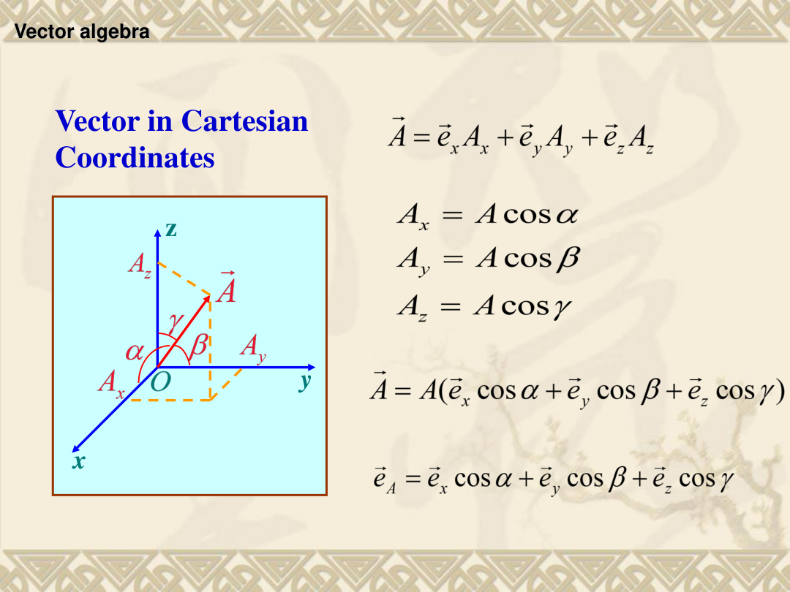
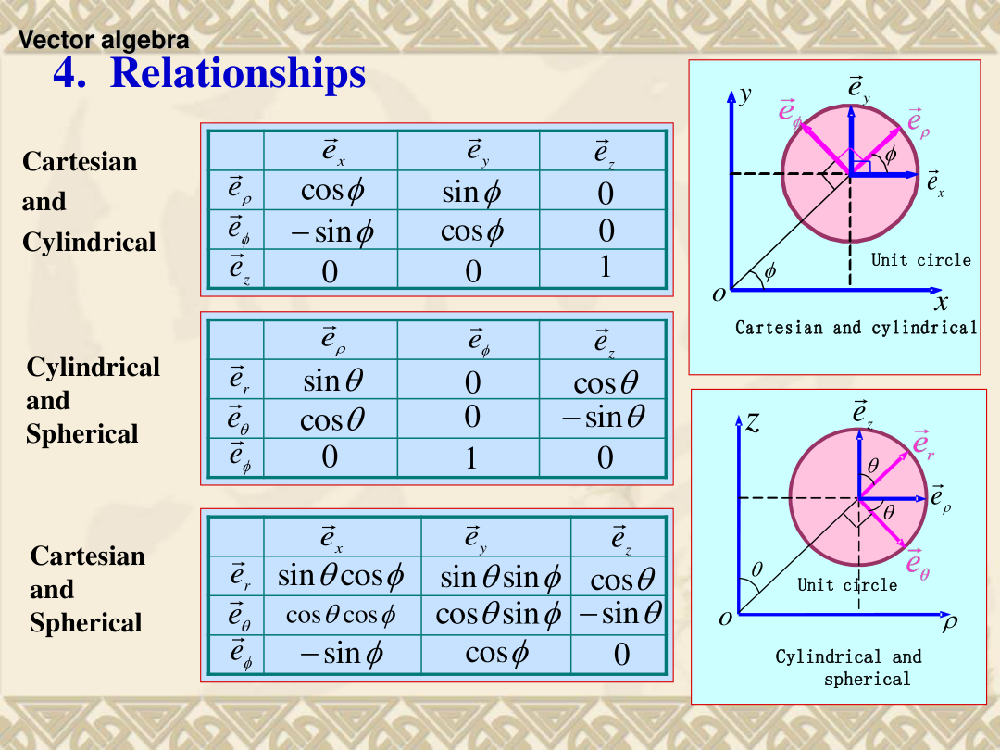
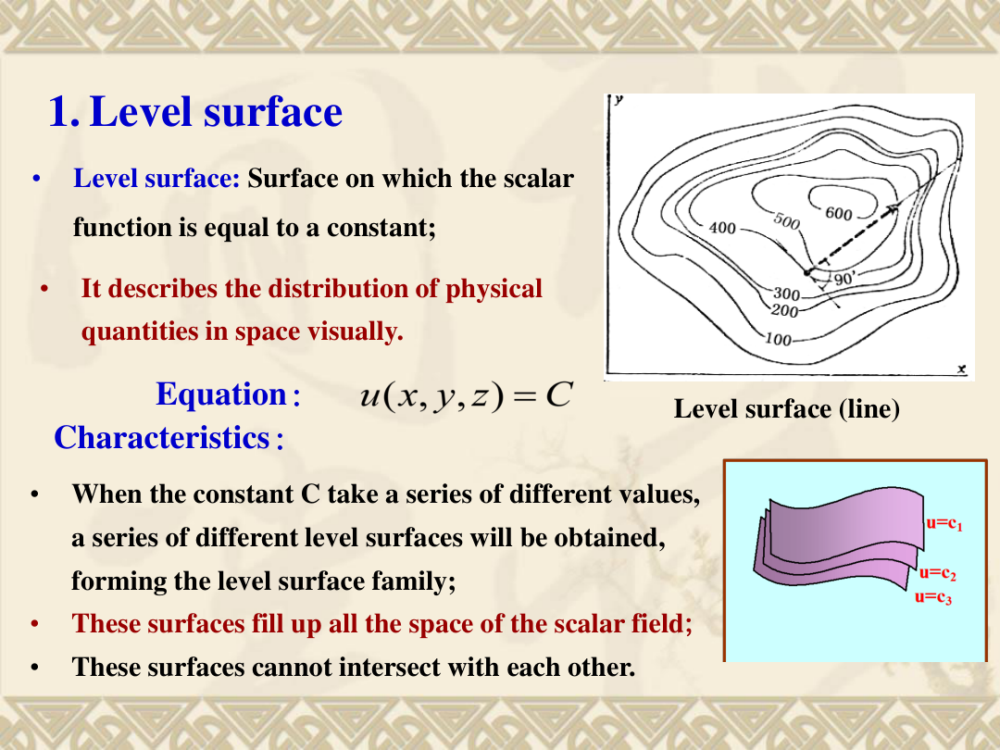
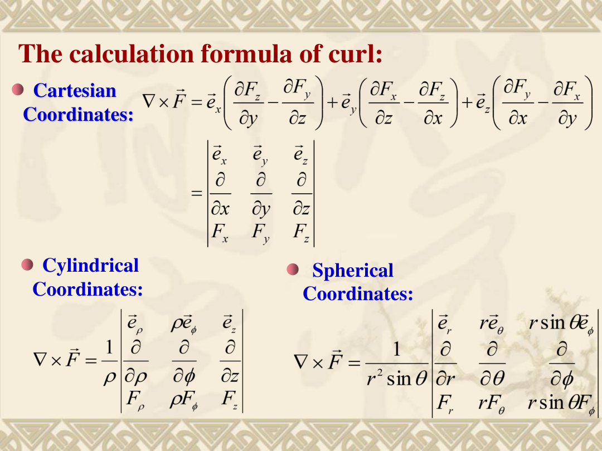
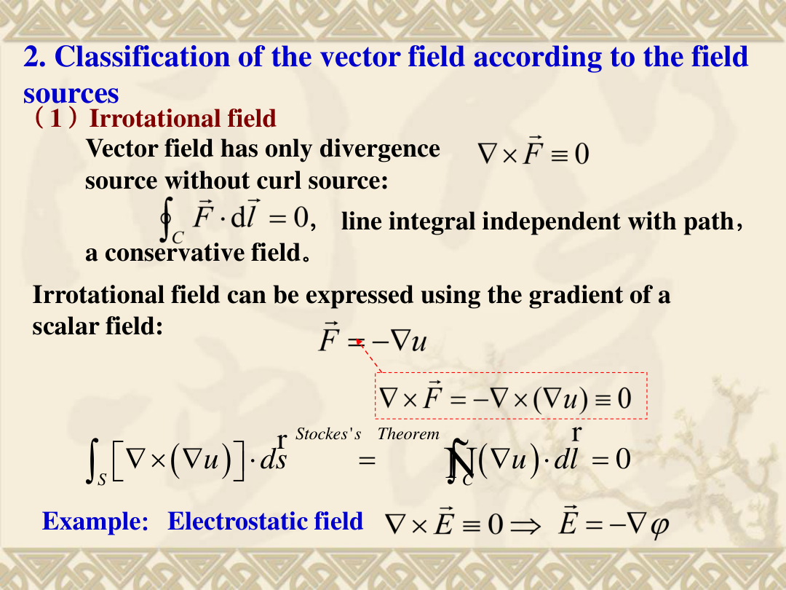
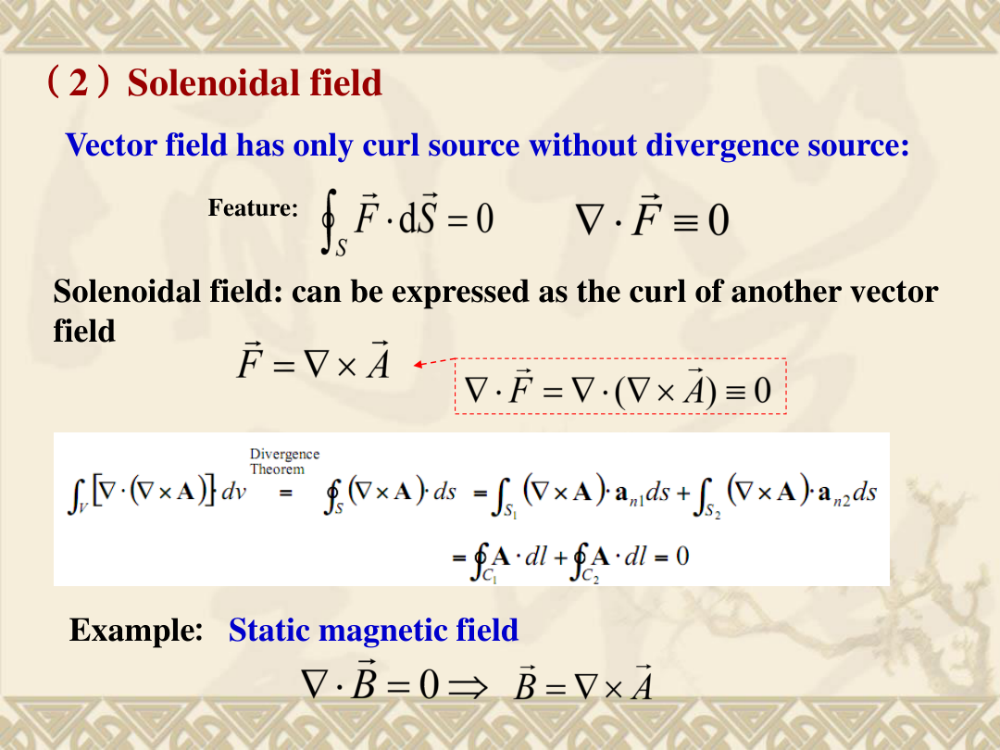
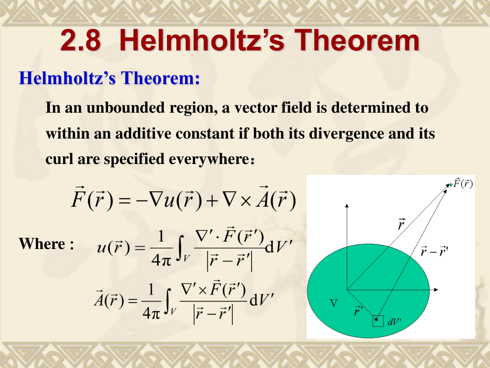

本章不是 DSP 内容，而是电磁场与波课程中的数学工具章。它的作用是：把电磁场里经常出现的“方向、通量、环流、源、旋涡”等概念，翻译成可以计算的矢量公式。

## 0. 学习目标

学完本章后，你应该能够：

1. 区分标量、矢量、标量场、矢量场、静态场、时变场。
2. 在直角坐标、圆柱坐标、球坐标中写出位置矢量、线元、面元和体元。
3. 计算矢量的加减、数乘、点乘、叉乘、标量三重积和矢量三重积。
4. 理解并计算标量场的等值面、方向导数和梯度。
5. 理解通量的物理意义，并会用散度计算“单位体积净流出量”。
6. 理解环流的物理意义，并会用旋度判断矢量场是否有旋涡源。
7. 掌握散度定理和 Stokes 定理的含义：一个把闭合曲面积分变成体积分，一个把闭合曲线积分变成曲面积分。
8. 区分无旋场、无散场、既无旋又无散场、一般场。
9. 会写标量 Laplacian 运算，并理解它与“梯度再散度”的关系。
10. 理解 Helmholtz 定理：矢量场可以由散度源和旋度源共同决定。

## 1. 概述

### 1.1 研究目标

电磁场里，电场 $\vec E$、磁感应强度 $\vec B$、磁场强度 $\vec H$ 都不是简单的一个数，而是“空间中每一点都有大小和方向”的矢量场。为了描述它们，我们需要回答四类问题：

| 问题 | 数学工具 | 直观意思 |
|---|---|---|
| 某个量往哪个方向增加最快？ | 梯度 $\nabla u$ | 爬山时最陡的上坡方向 |
| 有多少场线穿出一个面？ | 通量 $\int_S \vec F\cdot d\vec S$ | 穿过渔网的水流量 |
| 某一点是不是“源”或“汇”？ | 散度 $\nabla\cdot\vec F$ | 水从这里冒出来还是流进去 |
| 某一点附近有没有旋转趋势？ | 旋度 $\nabla\times\vec F$ | 小水轮会不会转 |

### 1.2 课程定位

第1章通常介绍电磁场的基本对象和物理背景；第2章提供后续章节需要的数学语言。后续学习 Maxwell 方程时，会反复看到：

$$
\nabla\cdot\vec D=\rho_v,
\qquad
\nabla\cdot\vec B=0,
\qquad
\nabla\times\vec E=-\frac{\partial\vec B}{\partial t},
\qquad
\nabla\times\vec H=\vec J+\frac{\partial\vec D}{\partial t}.
$$

如果本章的散度、旋度、通量、环流不清楚，后面 Maxwell 方程会变成“看得见符号但不知道在说什么”。

### 1.3 常见误区

1. **把标量和矢量混在一起。** 温度是标量；速度、电场是矢量。标量只有大小，矢量有大小和方向。
2. **把单位矢量当成永远不变。** 直角坐标的 $\vec e_x,\vec e_y,\vec e_z$ 方向固定；但圆柱坐标的 $\vec e_\rho,\vec e_\phi$ 和球坐标的 $\vec e_r,\vec e_\theta,\vec e_\phi$ 会随位置方向变化。
3. **忘记圆柱/球坐标中的尺度因子。** 例如圆柱坐标中沿 $\phi$ 方向的小长度不是 $d\phi$，而是 $\rho d\phi$。
4. **把散度和旋度都理解成“场强大小”。** 散度看“净流出”，旋度看“绕圈趋势”，都不是单纯看 $|\vec F|$。
5. **看到 $\nabla$ 就机械套公式。** 必须先确认坐标系，再选对应公式；不同坐标系的梯度、散度、旋度公式不一样。

## 2. 基本概念

### 2.1 标量、矢量和场

- **一句话理解：** 标量是一个数，矢量是带方向的量；场是这些量在空间中的分布。
- **正式定义：**
  - 标量：只有大小的量，如长度、面积、体积、温度、密度、能量。
  - 矢量：既有大小又有方向的量，如力、位移、速度、加速度、电场强度、磁场强度。
  - 场：一个物理量在空间中的分布；标量的分布叫标量场，矢量的分布叫矢量场。
- **直观例子：** 房间中每一点的温度 $T(x,y,z)$ 是标量场；空气在每一点的速度 $\vec v(x,y,z)$ 是矢量场。
- **容易混淆的点：** “场”不一定随时间变化。若不含 $t$，如 $u(x,y,z)$、$\vec F(x,y,z)$，叫静态场；若含 $t$，如 $u(x,y,z,t)$、$\vec F(x,y,z,t)$，叫时变场。

### 2.2 矢量大小、单位矢量和常矢量

- **一句话理解：** 单位矢量只表示方向，长度固定为 1；常矢量要求大小和方向都固定。
- **正式定义：** 若矢量为 $\vec A$，大小为

$$
A=|\vec A|,
$$

单位矢量为

$$
\vec e_A=\frac{\vec A}{A},
\qquad
\vec A=\vec e_A A.
$$

常矢量是大小恒定、方向固定的矢量。
- **直观例子：** 在直角坐标中 $\vec e_x$ 是常矢量；但圆柱坐标中的 $\vec e_\rho$ 虽然长度为 1，却会随方位角 $\phi$ 改变方向，所以一般不是常矢量。
- **容易混淆的点：** “单位矢量 = 常矢量”是错误的。单位矢量只要求长度为 1，不要求方向固定。

### 2.3 等值面、方向导数和梯度

- **一句话理解：** 等值面像地图等高线；方向导数问沿某方向变化多快；梯度指出变化最快方向。
- **正式定义：** 标量场 $u(x,y,z)$ 的等值面满足

$$
u(x,y,z)=C
$$

其中 $C$ 是常数。沿方向 $\vec l$ 的方向导数为

$$
\left.\frac{\partial u}{\partial l}\right|_{M_0}
=\lim_{\Delta l\to0}\frac{\Delta u}{\Delta l}
=\frac{\partial u}{\partial x}\cos\alpha+\frac{\partial u}{\partial y}\cos\beta+\frac{\partial u}{\partial z}\cos\gamma,
$$

其中 $\cos\alpha,\cos\beta,\cos\gamma$ 是方向 $\vec l$ 与 $x,y,z$ 轴的方向余弦。
- **直观例子：** 在山地地图上，等高线越密，海拔变化越快；垂直穿过等高线的方向通常是爬升最快方向。
- **容易混淆的点：** 方向导数依赖“点”和“方向”；梯度是该点处让方向导数最大的方向和大小。

### 2.4 矢量线、通量和散度

- **一句话理解：** 矢量线画出场的方向；通量数穿过面的场线多少；散度看一点附近净流出强不强。
- **正式定义：** 对矢量场

$$
\vec F=\vec e_xF_x+\vec e_yF_y+\vec e_zF_z,
$$

矢量线方程为

$$
\frac{dx}{F_x(x,y,z)}=\frac{dy}{F_y(x,y,z)}=\frac{dz}{F_z(x,y,z)}.
$$

通量为

$$
\psi=\int_S \vec F\cdot d\vec S=\int_S \vec F\cdot\vec e_n\,dS,
$$

闭合曲面取外法线方向：

$$
\psi=\oint_S \vec F\cdot d\vec S.
$$

散度定义为单位体积净流出通量的极限：

$$
\operatorname{div}\vec F=\nabla\cdot\vec F
=\lim_{\Delta V\to0}\frac{\oint_S\vec F\cdot d\vec S}{\Delta V}.
$$
- **直观例子：** 喷泉向外喷水，对包围喷口的闭合面有正通量；排水口吸水，对闭合面有负通量；均匀水平水流穿过一个盒子，进多少出多少，净通量为 0。
- **容易混淆的点：** 通量是对一个面算的；散度是一个点附近的局部量。

### 2.5 环流和旋度

- **一句话理解：** 环流看沿闭合圈绕一圈的“推着转”的总效果；旋度看单位面积上的最大环流趋势。
- **正式定义：** 闭合曲线 $C$ 上的环流为

$$
\Gamma=\oint_C \vec F\cdot d\vec l.
$$

沿法向 $\vec n$ 的环流面密度为

$$
\operatorname{rot}_n\vec F=\lim_{\Delta S\to0}\frac{1}{\Delta S}\oint_C\vec F\cdot d\vec l.
$$

旋度 $\nabla\times\vec F$ 是最大环流面密度对应的矢量，其投影满足

$$
\operatorname{rot}_n\vec F=\vec e_n\cdot\operatorname{rot}\vec F.
$$
- **直观例子：** 把小水轮放进水流里，如果水轮明显转动，说明该处旋度不为零。
- **容易混淆的点：** 场线弯曲不一定代表旋度不为零；要看局部闭合环流的极限。

### 2.6 无旋场、无散场和 Helmholtz 分解

- **一句话理解：** 无旋场没有旋涡源，无散场没有发散源；一般场可分成无旋部分和无散部分。
- **正式定义：**
  - 无旋场：$\nabla\times\vec F=0$。
  - 无散场：$\nabla\cdot\vec F=0$。
  - 一般场分解：

$$
\vec F(\vec r)=\vec F_i(\vec r)+\vec F_c(\vec r)=-\nabla u(\vec r)+\nabla\times\vec A(\vec r).
$$

- **直观例子：** 静电场是无旋场，常写作 $\vec E=-\nabla\varphi$；静磁场是无散场，常写作 $\vec B=\nabla\times\vec A$。
- **容易混淆的点：** “无散”不等于场为零，只是没有净流出源；“无旋”不等于场线一定是直线，只是闭合环流为零。

## 3. 核心公式与推导

### 3.1 矢量代数公式

#### 3.1.1 直角坐标中的分量表示

**这个公式在干什么：** 把一个三维矢量拆成 $x,y,z$ 三个方向的投影。

$$
\vec A=\vec e_xA_x+\vec e_yA_y+\vec e_zA_z.
$$

若 $\alpha,\beta,\gamma$ 分别是 $\vec A$ 与 $x,y,z$ 轴的夹角，则

$$
A_x=A\cos\alpha,
\qquad
A_y=A\cos\beta,
\qquad
A_z=A\cos\gamma,
$$

所以

$$
\vec A=A(\vec e_x\cos\alpha+\vec e_y\cos\beta+\vec e_z\cos\gamma),
$$

$$
\vec e_A=\vec e_x\cos\alpha+\vec e_y\cos\beta+\vec e_z\cos\gamma.
$$

**怎么用：** 已知分量就直接写；已知大小和方向角就先算三个投影。

**常见错误：** 忘记方向余弦必须满足

$$
\cos^2\alpha+\cos^2\beta+\cos^2\gamma=1.
$$

#### 3.1.2 加减、数乘、点乘、叉乘

对

$$
\vec A=\vec e_xA_x+\vec e_yA_y+\vec e_zA_z,
\qquad
\vec B=\vec e_xB_x+\vec e_yB_y+\vec e_zB_z,
$$

加减：

$$
\vec A\pm\vec B=\vec e_x(A_x\pm B_x)+\vec e_y(A_y\pm B_y)+\vec e_z(A_z\pm B_z).
$$

数乘：

$$
k\vec A=\vec e_xkA_x+\vec e_ykA_y+\vec e_zkA_z.
$$

点乘：

$$
\vec A\cdot\vec B=AB\cos\theta=A_xB_x+A_yB_y+A_zB_z.
$$

其中 $\theta$ 是 $\vec A$ 与 $\vec B$ 的夹角。若 $\vec A\perp\vec B$，则 $\vec A\cdot\vec B=0$；若 $\vec A\parallel\vec B$ 且同向，则 $\vec A\cdot\vec B=AB$。

叉乘：

$$
\vec A\times\vec B=\vec e_nAB\sin\theta,
$$

方向由右手定则决定。分量形式为

$$
\vec A\times\vec B
=\vec e_x(A_yB_z-A_zB_y)
+\vec e_y(A_zB_x-A_xB_z)
+\vec e_z(A_xB_y-A_yB_x).
$$

行列式形式：

$$
\vec A\times\vec B=
\begin{vmatrix}
\vec e_x&\vec e_y&\vec e_z\\
A_x&A_y&A_z\\
B_x&B_y&B_z
\end{vmatrix}.
$$

性质：

$$
\vec A+\vec B=\vec B+\vec A,
\qquad
\vec A+(\vec B+\vec C)=(\vec A+\vec B)+\vec C,
$$

$$
\vec A\cdot\vec B=\vec B\cdot\vec A,
\qquad
\vec A\times\vec B=-\vec B\times\vec A.
$$

**常见错误：** 点乘结果是标量；叉乘结果是矢量。叉乘不能交换顺序。

#### 3.1.3 三重积公式

分配律：

$$
(\vec A+\vec B)\cdot\vec C=\vec A\cdot\vec C+\vec B\cdot\vec C,
$$

$$
(\vec A+\vec B)\times\vec C=\vec A\times\vec C+\vec B\times\vec C.
$$

标量三重积：

$$
\vec A\cdot(\vec B\times\vec C)
=\vec B\cdot(\vec C\times\vec A)
=\vec C\cdot(\vec A\times\vec B).
$$

矢量三重积：

$$
\vec A\times(\vec B\times\vec C)
=(\vec A\cdot\vec C)\vec B-(\vec A\cdot\vec B)\vec C.
$$

**易错点：** $\vec A\times(\vec B\times\vec C)$ 不是 $(\vec A\times\vec B)\times\vec C$，叉乘没有普通乘法的结合律。

### 3.2 三种正交坐标系

#### 3.2.1 直角坐标系 Cartesian

变量：$x,y,z$；单位矢量：$\vec e_x,\vec e_y,\vec e_z$。

位置矢量：

$$
\vec r=\vec e_xx+\vec e_yy+\vec e_zz.
$$

线元：

$$
d\vec l=\vec e_xdx+\vec e_ydy+\vec e_zdz.
$$

面元：

$$
d\vec S_x=\vec e_x\,dy\,dz,
\qquad
d\vec S_y=\vec e_y\,dx\,dz,
\qquad
d\vec S_z=\vec e_z\,dx\,dy.
$$

体元：

$$
dV=dx\,dy\,dz.
$$

#### 3.2.2 圆柱坐标系 Cylindrical

变量：$\rho,\phi,z$；单位矢量：$\vec e_\rho,\vec e_\phi,\vec e_z$。

位置矢量：

$$
\vec r=\vec e_\rho\rho+\vec e_zz.
$$

线元：

$$
d\vec l=\vec e_\rho d\rho+\vec e_\phi\rho d\phi+\vec e_zdz.
$$

面元：

$$
d\vec S_\rho=\vec e_\rho\rho d\phi dz,
\qquad
d\vec S_\phi=\vec e_\phi d\rho dz,
\qquad
d\vec S_z=\vec e_z\rho d\rho d\phi.
$$

体元：

$$
dV=\rho d\rho d\phi dz.
$$

**为什么有 $\rho$：** 沿圆周方向走小角度 $d\phi$ 时，弧长是半径乘角度，即 $\rho d\phi$，不是 $d\phi$。

#### 3.2.3 球坐标系 Spherical

变量：$r,\theta,\phi$；单位矢量：$\vec e_r,\vec e_\theta,\vec e_\phi$。这里 $\theta$ 是从 $+z$ 轴量下来的极角，$\phi$ 是绕 $z$ 轴的方位角。

线元：

$$
d\vec l=\vec e_rdr+\vec e_\theta r d\theta+\vec e_\phi r\sin\theta d\phi.
$$

常用面元：

$$
d\vec S_r=\vec e_r r^2\sin\theta d\theta d\phi,
$$

$$
d\vec S_\theta=\vec e_\theta r\sin\theta dr d\phi,
\qquad
d\vec S_\phi=\vec e_\phi r dr d\theta.
$$

体元：

$$
dV=r^2\sin\theta dr d\theta d\phi.
$$

**易错点：** 球面 $r=R$ 上的面元一定是 $R^2\sin\theta d\theta d\phi$，不能漏掉 $\sin\theta$。

#### 3.2.4 单位矢量关系

直角与圆柱：

$$
\vec e_\rho=\vec e_x\cos\phi+\vec e_y\sin\phi,
\qquad
\vec e_\phi=-\vec e_x\sin\phi+\vec e_y\cos\phi,
\qquad
\vec e_z=\vec e_z.
$$

圆柱与球：

$$
\vec e_r=\vec e_\rho\sin\theta+\vec e_z\cos\theta,
$$

$$
\vec e_\theta=\vec e_\rho\cos\theta-\vec e_z\sin\theta,
\qquad
\vec e_\phi=\vec e_\phi.
$$

直角与球：

$$
\vec e_r=\vec e_x\sin\theta\cos\phi+\vec e_y\sin\theta\sin\phi+\vec e_z\cos\theta,
$$

$$
\vec e_\theta=\vec e_x\cos\theta\cos\phi+\vec e_y\cos\theta\sin\phi-\vec e_z\sin\theta,
$$

$$
\vec e_\phi=-\vec e_x\sin\phi+\vec e_y\cos\phi.
$$

### 3.3 梯度公式

**这个公式在干什么：** 梯度把标量场 $u$ 变成矢量，方向是 $u$ 增加最快方向，大小是最大方向导数。

直角坐标：

$$
\nabla u=\vec e_x\frac{\partial u}{\partial x}
+\vec e_y\frac{\partial u}{\partial y}
+\vec e_z\frac{\partial u}{\partial z}.
$$

圆柱坐标：

$$
\nabla u=\vec e_\rho\frac{\partial u}{\partial\rho}
+\vec e_\phi\frac{1}{\rho}\frac{\partial u}{\partial\phi}
+\vec e_z\frac{\partial u}{\partial z}.
$$

球坐标：

$$
\nabla u=\vec e_r\frac{\partial u}{\partial r}
+\vec e_\theta\frac{1}{r}\frac{\partial u}{\partial\theta}
+\vec e_\phi\frac{1}{r\sin\theta}\frac{\partial u}{\partial\phi}.
$$

基本运算：

$$
\nabla C=0,
\qquad
\nabla(Cu)=C\nabla u,
\qquad
\nabla(u\pm v)=\nabla u\pm\nabla v,
$$

$$
\nabla(uv)=u\nabla v+v\nabla u,
\qquad
\nabla f(u)=f'(u)\nabla u.
$$

**推导方向导数与梯度关系：** 若单位方向矢量

$$
\vec e_l=\vec e_x\cos\alpha+\vec e_y\cos\beta+\vec e_z\cos\gamma,
$$

则

$$
\nabla u\cdot\vec e_l
=\left(\vec e_x\frac{\partial u}{\partial x}+\vec e_y\frac{\partial u}{\partial y}+\vec e_z\frac{\partial u}{\partial z}\right)
\cdot(\vec e_x\cos\alpha+\vec e_y\cos\beta+\vec e_z\cos\gamma)
$$

因为同方向单位矢量点乘为 1，互相垂直的单位矢量点乘为 0，所以

$$
\nabla u\cdot\vec e_l
=\frac{\partial u}{\partial x}\cos\alpha+\frac{\partial u}{\partial y}\cos\beta+\frac{\partial u}{\partial z}\cos\gamma
=\frac{\partial u}{\partial l}.
$$

这说明方向导数就是梯度在该方向上的投影，因此最大值为 $|\nabla u|$。

### 3.4 散度公式与推导

直角坐标：

$$
\nabla\cdot\vec F=\frac{\partial F_x}{\partial x}+\frac{\partial F_y}{\partial y}+\frac{\partial F_z}{\partial z}.
$$

圆柱坐标：

$$
\nabla\cdot\vec F=\frac{1}{\rho}\frac{\partial(\rho F_\rho)}{\partial\rho}
+\frac{1}{\rho}\frac{\partial F_\phi}{\partial\phi}
+\frac{\partial F_z}{\partial z}.
$$

球坐标：

$$
\nabla\cdot\vec F=\frac{1}{r^2}\frac{\partial(r^2F_r)}{\partial r}
+\frac{1}{r\sin\theta}\frac{\partial(\sin\theta F_\theta)}{\partial\theta}
+\frac{1}{r\sin\theta}\frac{\partial F_\phi}{\partial\phi}.
$$

**直角坐标推导：** 在点 $P(x_0,y_0,z_0)$ 周围取小长方体 $\Delta x\Delta y\Delta z$。先看 $x$ 方向两面。

用一阶 Taylor 展开：

$$
F_x\left(x_0+\frac{\Delta x}{2},y_0,z_0\right)
\approx F_x(x_0,y_0,z_0)+\frac{\Delta x}{2}\left.\frac{\partial F_x}{\partial x}\right|_P,
$$

$$
F_x\left(x_0-\frac{\Delta x}{2},y_0,z_0\right)
\approx F_x(x_0,y_0,z_0)-\frac{\Delta x}{2}\left.\frac{\partial F_x}{\partial x}\right|_P.
$$

从右面流出的通量减去从左面流入的通量：

$$
\left[F_x\left(x_0+\frac{\Delta x}{2}\right)-F_x\left(x_0-\frac{\Delta x}{2}\right)\right]\Delta y\Delta z
=\frac{\partial F_x}{\partial x}\Delta x\Delta y\Delta z.
$$

同理，$y,z$ 方向贡献为

$$
\frac{\partial F_y}{\partial y}\Delta x\Delta y\Delta z,
\qquad
\frac{\partial F_z}{\partial z}\Delta x\Delta y\Delta z.
$$

总净通量为

$$
\oint_S\vec F\cdot d\vec S
=\left(\frac{\partial F_x}{\partial x}+\frac{\partial F_y}{\partial y}+\frac{\partial F_z}{\partial z}\right)\Delta V.
$$

除以 $\Delta V$ 并令 $\Delta V\to0$，得到散度公式。

散度相关公式：

$$
\nabla\cdot\vec C=0 \quad (\vec C\text{ 为常矢量}),
$$

$$
\nabla\cdot(\vec C f)=\vec C\cdot\nabla f,
\qquad
\nabla\cdot(k\vec F)=k\nabla\cdot\vec F,
$$

$$
\nabla\cdot(f\vec F)=f\nabla\cdot\vec F+\vec F\cdot\nabla f,
\qquad
\nabla\cdot(\vec F\pm\vec G)=\nabla\cdot\vec F\pm\nabla\cdot\vec G.
$$

### 3.5 散度定理

**这个公式在干什么：** 把闭合曲面上的通量，换成内部体积中散度的积分。

$$
\boxed{\oint_S\vec F\cdot d\vec S=\int_V\nabla\cdot\vec F\,dV}
$$

**直观理解：** 把体积切成很多小块。相邻小块之间的内部面，一个小块的流出正好是另一个小块的流入，互相抵消。最后只剩最外层边界面的净流出。

### 3.6 旋度公式与推导

直角坐标：

$$
\nabla\times\vec F
=\vec e_x\left(\frac{\partial F_z}{\partial y}-\frac{\partial F_y}{\partial z}\right)
+\vec e_y\left(\frac{\partial F_x}{\partial z}-\frac{\partial F_z}{\partial x}\right)
+\vec e_z\left(\frac{\partial F_y}{\partial x}-\frac{\partial F_x}{\partial y}\right).
$$

行列式形式：

$$
\nabla\times\vec F=
\begin{vmatrix}
\vec e_x&\vec e_y&\vec e_z\\
\frac{\partial}{\partial x}&\frac{\partial}{\partial y}&\frac{\partial}{\partial z}\\
F_x&F_y&F_z
\end{vmatrix}.
$$

圆柱坐标：

$$
\nabla\times\vec F=\frac{1}{\rho}
\begin{vmatrix}
\vec e_\rho&\rho\vec e_\phi&\vec e_z\\
\frac{\partial}{\partial\rho}&\frac{\partial}{\partial\phi}&\frac{\partial}{\partial z}\\
F_\rho&\rho F_\phi&F_z
\end{vmatrix}.
$$

球坐标：

$$
\nabla\times\vec F=\frac{1}{r^2\sin\theta}
\begin{vmatrix}
\vec e_r&r\vec e_\theta&r\sin\theta\vec e_\phi\\
\frac{\partial}{\partial r}&\frac{\partial}{\partial\theta}&\frac{\partial}{\partial\phi}\\
F_r&rF_\theta&r\sin\theta F_\phi
\end{vmatrix}.
$$

**$x$ 分量推导思路：** 取法向沿 $x$ 方向的小矩形，边长为 $\Delta y$ 和 $\Delta z$。沿闭合边界积分：

$$
\oint_C\vec F\cdot d\vec l
=F_{y1}\Delta y+F_{z2}\Delta z+F_{y3}(-\Delta y)+F_{z4}(-\Delta z).
$$

用 Taylor 展开后可得

$$
\oint_C\vec F\cdot d\vec l
=\left(\frac{\partial F_z}{\partial y}-\frac{\partial F_y}{\partial z}\right)\Delta y\Delta z.
$$

因此

$$
(\nabla\times\vec F)_x=\frac{\partial F_z}{\partial y}-\frac{\partial F_y}{\partial z}.
$$

其他两个分量同理。

旋度相关公式：

$$
\nabla\times\vec C=0,
\qquad
\nabla\times(f\vec C)=\nabla f\times\vec C,
$$

$$
\nabla\times(f\vec F)=f\nabla\times\vec F+\nabla f\times\vec F,
$$

$$
\nabla\times(\vec F\pm\vec G)=\nabla\times\vec F\pm\nabla\times\vec G,
$$

$$
\nabla\cdot(\vec F\times\vec G)=\vec G\cdot(\nabla\times\vec F)-\vec F\cdot(\nabla\times\vec G).
$$

两个恒等式：

$$
\boxed{\nabla\cdot(\nabla\times\vec F)=0}
$$

$$
\boxed{\nabla\times(\nabla u)=0}
$$

**为什么成立：** 它们依赖混合二阶偏导相等，例如

$$
\frac{\partial^2u}{\partial y\partial z}=\frac{\partial^2u}{\partial z\partial y}
$$

在函数足够光滑时成立。

### 3.7 Stokes 定理

**这个公式在干什么：** 把闭合曲线上的环流，换成曲面上旋度的通量。

$$
\boxed{\oint_C\vec F\cdot d\vec l=\int_S(\nabla\times\vec F)\cdot d\vec S}
$$

**直观理解：** 把曲面分成很多小面元。相邻小面元公共边上的线积分方向相反，所以内部边界互相抵消，最后只剩外边界 $C$。

### 3.8 Laplacian 运算

标量 Laplacian 定义为

$$
\nabla^2u=\nabla\cdot(\nabla u).
$$

直角坐标：

$$
\nabla^2u=\frac{\partial^2u}{\partial x^2}+\frac{\partial^2u}{\partial y^2}+\frac{\partial^2u}{\partial z^2}.
$$

圆柱坐标：

$$
\nabla^2u=\frac{1}{\rho}\frac{\partial}{\partial\rho}\left(\rho\frac{\partial u}{\partial\rho}\right)
+\frac{1}{\rho^2}\frac{\partial^2u}{\partial\phi^2}
+\frac{\partial^2u}{\partial z^2}.
$$

球坐标：

$$
\nabla^2u=\frac{1}{r^2}\frac{\partial}{\partial r}\left(r^2\frac{\partial u}{\partial r}\right)
+\frac{1}{r^2\sin\theta}\frac{\partial}{\partial\theta}\left(\sin\theta\frac{\partial u}{\partial\theta}\right)
+\frac{1}{r^2\sin^2\theta}\frac{\partial^2u}{\partial\phi^2}.
$$

### 3.9 Helmholtz 定理

无界区域中，如果矢量场在各处的散度和旋度都已知，则该矢量场可确定到一个加性常矢量：

$$
\vec F(\vec r)=-\nabla u(\vec r)+\nabla\times\vec A(\vec r),
$$

其中

$$
u(\vec r)=\frac{1}{4\pi}\int_V\frac{\nabla'\cdot\vec F(\vec r')}{|\vec r-\vec r'|}\,dV',
$$

$$
\vec A(\vec r)=\frac{1}{4\pi}\int_V\frac{\nabla'\times\vec F(\vec r')}{|\vec r-\vec r'|}\,dV'.
$$

有界区域中，还需要给出边界面上的法向分量信息。Slides 给出的形式为：

$$
u(\vec r)=\frac{1}{4\pi}\int_V\frac{\nabla'\cdot\vec F(\vec r')}{|\vec r-\vec r'|}\,dV'
-\frac{1}{4\pi}\oint_S\frac{\vec F(\vec r')\cdot d\vec S'}{|\vec r-\vec r'|},
$$

$$
\vec A(\vec r)=\frac{1}{4\pi}\int_V\frac{\nabla'\times\vec F(\vec r')}{|\vec r-\vec r'|}\,dV'
-\frac{1}{4\pi}\oint_S\frac{\vec F(\vec r')\times d\vec S'}{|\vec r-\vec r'|}.
$$

**直观理解：** 散度告诉你“哪里有源/汇”，旋度告诉你“哪里有旋涡”，边界条件告诉你“边界上场怎样进出”。这些信息合起来足够恢复场。

## 4. 图示说明

本节把本章涉及的所有图片集中展示，方便你一次性浏览建立直觉。部分图片在第二节已经出现，这里重新放一遍是为了让你不用来回翻页。

**图中应该看什么：**
- $\vec A$ 可以分解成 $A_x,A_y,A_z$ 三个投影。
- $\alpha,\beta,\gamma$ 是 $\vec A$ 与三条坐标轴的夹角。
- 投影公式是 $A_x=A\cos\alpha$ 等。
- 单位矢量 $\vec e_A$ 只保留方向，不保留长度 $A$。

**图中应该看什么：**
- 坐标面 $x=x_0,y=y_0,z=z_0$ 分别垂直于对应坐标轴。
- 面元方向由法向单位矢量决定。
- 体元是小长方体，体积为 $dx\,dy\,dz$。

**图中应该看什么：**
- $\rho=\rho_0$ 是圆柱面，$\phi=\phi_0$ 是半平面，$z=z_0$ 是平面。
- 沿 $\phi$ 方向的小长度是 $\rho d\phi$。
- 圆柱侧面的面元是 $d\vec S_\rho=\vec e_\rho\rho d\phi dz$。

**图中应该看什么：**
- $r$ 表示到原点的距离，$\theta$ 是极角，$\phi$ 是方位角。
- 球面面积元包含 $\sin\theta$。
- 球坐标适合点对称问题，如点电荷场。

**图中应该看什么：**
- 圆柱和球坐标的单位矢量随角度变化。
- 表格中的每一行表示一个新坐标单位矢量在旧坐标基底上的投影。
- 坐标变换时，既要变分量，也要注意单位矢量方向。

**图中应该看什么：**
- 同一条线或同一个面上的 $u$ 值相同。
- 等值面族填满标量场空间。
- 不同等值面不能相交，否则同一点会有两个不同的 $u$ 值。

**图中应该看什么：**
- 梯度方向与等值面垂直。
- 梯度指向 $u$ 增加最快方向。
- 方向导数是梯度在指定方向上的投影。

**图中应该看什么：**
- $\psi=0$：进出相等，没有净源。
- $\psi<0$：流入多于流出，像汇。
- $\psi>0$：流出多于流入，像源。

**图中应该看什么：**
- 大体积可分成很多小体积。
- 内部公共面通量方向相反，会互相抵消。
- 最终只剩外边界通量。

**图中应该看什么：**
- 旋度公式在不同坐标系中不同。
- 直角坐标可用行列式记忆。
- 圆柱、球坐标公式包含尺度因子，不能直接照搬直角公式。

**图中应该看什么：**
- 平行均匀场：$\nabla\cdot\vec F=0,\nabla\times\vec F=0$。
- 纯发散源：$\nabla\cdot\vec F\ne0,\nabla\times\vec F=0$。
- 纯旋涡源：$\nabla\cdot\vec F=0,\nabla\times\vec F\ne0$。
- 一般场可同时有散度和旋度。

**图中应该看什么：**
- 无旋场满足 $\nabla\times\vec F=0$。
- 线积分与路径无关。
- 静电场是典型例子：$\vec E=-\nabla\varphi$。

**图中应该看什么：**
- 无散场满足 $\nabla\cdot\vec F=0$。
- 闭合曲面净通量为零。
- 静磁场是典型例子：$\vec B=\nabla\times\vec A$。

**图中应该看什么：**
- $\vec r$ 表示观察点，$\vec r'$ 表示源点。
- 分母 $|\vec r-\vec r'|$ 表示源点到观察点的距离。
- 散度源和旋度源共同决定矢量场。

## 5. 应用

### 5.1 数学工具的物理意义

电磁场不是只在一个点有值，而是在整个空间都有分布。例如点电荷周围电场向外发散，长直电流周围磁场绕线旋转。这两类现象分别需要散度和旋度描述。

| 物理现象 | 数学描述 | 后续电磁学中的典型形式 |
|---|---|---|
| 电荷产生电场源 | 散度 | $\nabla\cdot\vec D=\rho_v$ |
| 磁感应线无头无尾 | 无散 | $\nabla\cdot\vec B=0$ |
| 变化磁场产生旋涡电场 | 旋度 | $\nabla\times\vec E=-\partial\vec B/\partial t$ |
| 电流和变化电场产生磁场环流 | 旋度 | $\nabla\times\vec H=\vec J+\partial\vec D/\partial t$ |

### 5.2 坐标系选择

Slides 给出的经验：

| 坐标系 | 适合问题 | 例子 |
|---|---|---|
| 直角坐标 | 面对称问题 | 无限大平面附近的场 |
| 圆柱坐标 | 轴对称问题 | 带电长直线附近的场 |
| 球坐标 | 点对称问题 | 点电荷产生的场 |

**自查方法：** 如果题目中的几何物体像“平板”，优先想直角坐标；像“长直线/圆柱”，优先想圆柱坐标；像“点/球”，优先想球坐标。

### 5.3 积分定理的意义

它们是“积分形式”和“微分形式”的桥梁。

- 散度定理：把闭合面通量变成体内散度积分。
- Stokes 定理：把闭合线环流变成面上旋度通量。

后续 Maxwell 方程经常在积分形式和微分形式之间转换，本章这两个定理就是转换工具。

## 6. 重点与难点

| 知识点 | 为什么重要 | 常见错误 | 如何检查自己 |
|---|---|---|---|
| 单位矢量 | 所有矢量分解都依赖它 | 认为所有单位矢量都是常矢量 | 圆柱坐标 $\vec e_\rho$ 是否随 $\phi$ 变？是 |
| 面元 $d\vec S$ | 通量积分必须用它 | 忘记面元方向 | 闭合面永远取外法线 |
| 圆柱/球坐标尺度因子 | 决定线元、面元、体元 | 漏掉 $\rho$、$r$、$\sin\theta$ | 看角度变量是否对应弧长 |
| 梯度 | 描述标量场最大变化方向 | 把梯度当成普通导数 | 梯度结果必须是矢量 |
| 散度 | 描述源/汇 | 把散度当成场强大小 | 散度结果是标量 |
| 旋度 | 描述旋涡源 | 忘记叉乘顺序 | 旋度结果是矢量 |
| 散度定理 | 通量积分与体积分转换 | 用在非闭合曲面上 | 左边必须是 $\oint_S$ |
| Stokes 定理 | 环流与旋度通量转换 | 曲线方向和面法线不匹配 | 用右手定则配方向 |
| 无旋场 | 静电场基础 | 误以为无旋就是场为零 | 判断 $\nabla\times\vec F=0$ |
| 无散场 | 静磁场基础 | 误以为无散就是没有场线 | 判断 $\nabla\cdot\vec F=0$ |
| Helmholtz 定理 | 说明场由散度和旋度决定 | 忽略边界条件 | 有界区域还要给边界法向分量 |

## 7. 例题

### 例题1：矢量加法、点乘和叉乘

**题目：** 已知

$$
\vec A=2\vec e_x+3\vec e_y+4\vec e_z,
\qquad
\vec B=4\vec e_x+3\vec e_y+\vec e_z.
$$

求 $\vec A+\vec B$、$\vec B\cdot\vec A$、$\vec A\times\vec B$。

**解题思路：** 加法按同方向分量相加；点乘对应分量相乘再相加；叉乘用行列式。

**解答：**

$$
\vec A+\vec B=(2+4)\vec e_x+(3+3)\vec e_y+(4+1)\vec e_z
=6\vec e_x+6\vec e_y+5\vec e_z.
$$

$$
\vec B\cdot\vec A=4\cdot2+3\cdot3+1\cdot4=8+9+4=21.
$$

$$
\vec A\times\vec B=
\begin{vmatrix}
\vec e_x&\vec e_y&\vec e_z\\
2&3&4\\
4&3&1
\end{vmatrix}
$$

$$
=\vec e_x(3\cdot1-4\cdot3)-\vec e_y(2\cdot1-4\cdot4)+\vec e_z(2\cdot3-3\cdot4)
$$

$$
=-9\vec e_x+14\vec e_y-6\vec e_z.
$$

**答案：**

$$
\boxed{\vec A+\vec B=6\vec e_x+6\vec e_y+5\vec e_z}
$$

$$
\boxed{\vec B\cdot\vec A=21}
$$

$$
\boxed{\vec A\times\vec B=-9\vec e_x+14\vec e_y-6\vec e_z}
$$

**易错提醒：** 展开行列式时 $\vec e_y$ 项前面有负号。

### 例题2：圆柱侧面的通量积分

**题目：** 在半径为 1、高为 $h$ 的圆柱侧面上，计算

$$
\int_S(3\rho z\vec e_\rho+\phi\vec e_z)\cdot d\vec S.
$$

**解题思路：** 侧面是 $\rho=1$，外法向是 $\vec e_\rho$，所以只保留 $\vec e_\rho$ 分量。

**解答：** 圆柱坐标侧面面元为

$$
d\vec S=\vec e_\rho\rho d\phi dz.
$$

在侧面 $\rho=1$，所以

$$
d\vec S=\vec e_\rho d\phi dz.
$$

被积函数点乘面元：

$$
(3\rho z\vec e_\rho+\phi\vec e_z)\cdot(\vec e_\rho d\phi dz)
=3\rho z\,d\phi dz.
$$

代入 $\rho=1$：

$$
=3z\,d\phi dz.
$$

积分范围：$0\le\phi\le2\pi$，$0\le z\le h$。

$$
\int_0^{2\pi}\int_0^h3z\,dz\,d\phi
=\int_0^{2\pi}\left[\frac{3z^2}{2}\right]_0^h d\phi
=\int_0^{2\pi}\frac{3h^2}{2}d\phi
=3\pi h^2.
$$

**答案：**

$$
\boxed{3\pi h^2}
$$

**易错提醒：** Slides 第14页的结果写成 $6\pi h$，但按其被积函数 $3\rho z\vec e_\rho+\phi\vec e_z$ 与 $z\in[0,h]$ 计算应为 $3\pi h^2$。若原题实际被积函数或积分范围不同，需要人工确认。

### 例题3：球面通量积分

**题目：** 在半径为 1 的球面上，计算

$$
\int_S(3r\vec e_r+5r\vec e_\theta)\cdot d\vec S.
$$

**解题思路：** 球面 $r=1$ 的外法向是 $\vec e_r$，所以只有 $\vec e_r$ 分量有贡献。

**解答：** 球面 $r=1$ 上

$$
d\vec S=\vec e_r r^2\sin\theta d\theta d\phi=\vec e_r\sin\theta d\theta d\phi.
$$

点乘：

$$
(3r\vec e_r+5r\vec e_\theta)\cdot(\vec e_r\sin\theta d\theta d\phi)
=3r\sin\theta d\theta d\phi.
$$

代入 $r=1$：

$$
=3\sin\theta d\theta d\phi.
$$

积分范围：$0\le\theta\le\pi$，$0\le\phi\le2\pi$。

$$
\int_0^{2\pi}\int_0^\pi3\sin\theta\,d\theta d\phi
=\int_0^{2\pi}3[-\cos\theta]_0^\pi d\phi
$$

$$
=\int_0^{2\pi}3(1-(-1))d\phi
=\int_0^{2\pi}6d\phi=12\pi.
$$

**答案：**

$$
\boxed{12\pi}
$$

**易错提醒：** $\vec e_\theta$ 与 $\vec e_r$ 垂直，所以 $5r\vec e_\theta$ 对球面通量没有贡献。

### 例题4：梯度和方向导数

**题目：** 给定

$$
\varphi(x,y,z)=x^2+y^2-z.
$$

求点 $P(1,1,1)$ 处的梯度及其单位矢量；再求沿

$$
\vec e_l=\vec e_x\cos60^\circ+\vec e_y\cos45^\circ+\vec e_z\cos60^\circ
$$

方向的方向导数，并与最大方向导数比较。

**解题思路：** 梯度先对 $x,y,z$ 分别偏导；方向导数等于梯度与方向单位矢量点乘。

**解答：**

$$
\nabla\varphi=\vec e_x\frac{\partial\varphi}{\partial x}+\vec e_y\frac{\partial\varphi}{\partial y}+\vec e_z\frac{\partial\varphi}{\partial z}
=2x\vec e_x+2y\vec e_y-\vec e_z.
$$

在 $P(1,1,1)$：

$$
\left.\nabla\varphi\right|_P=2\vec e_x+2\vec e_y-\vec e_z.
$$

大小：

$$
\left|\nabla\varphi\right|_P=\sqrt{2^2+2^2+(-1)^2}=3.
$$

梯度方向的单位矢量：

$$
\vec e_{\nabla\varphi}=\frac{2\vec e_x+2\vec e_y-\vec e_z}{3}
=\frac{2}{3}\vec e_x+\frac{2}{3}\vec e_y-\frac{1}{3}\vec e_z.
$$

方向矢量为

$$
\vec e_l=\frac{1}{2}\vec e_x+\frac{\sqrt2}{2}\vec e_y+\frac{1}{2}\vec e_z.
$$

方向导数：

$$
\left.\frac{\partial\varphi}{\partial l}\right|_P
=\left.\nabla\varphi\right|_P\cdot\vec e_l
=(2\vec e_x+2\vec e_y-\vec e_z)\cdot\left(\frac{1}{2}\vec e_x+\frac{\sqrt2}{2}\vec e_y+\frac{1}{2}\vec e_z\right)
$$

$$
=2\cdot\frac12+2\cdot\frac{\sqrt2}{2}+(-1)\cdot\frac12
=1+\sqrt2-\frac12
=\frac{1+2\sqrt2}{2}.
$$

最大方向导数为梯度大小：

$$
\left|\nabla\varphi\right|_P=3.
$$

由于

$$
\frac{1+2\sqrt2}{2}\approx1.914<3,
$$

所给方向不是变化最快方向。

**答案：**

$$
\boxed{\left.\nabla\varphi\right|_P=2\vec e_x+2\vec e_y-\vec e_z}
$$

$$
\boxed{\vec e_{\nabla\varphi}=\frac{2}{3}\vec e_x+\frac{2}{3}\vec e_y-\frac{1}{3}\vec e_z}
$$

$$
\boxed{\left.\frac{\partial\varphi}{\partial l}\right|_P=\frac{1+2\sqrt2}{2}<3}
$$

**易错提醒：** 方向导数可以小于梯度大小；只有沿梯度方向时才等于最大值。

### 例题5：散度和旋度计算

**题目：** 已知

$$
\vec A=2z^2\vec e_x+3x\vec e_y.
$$

求 $\nabla\cdot\vec A$ 和 $\nabla\times\vec A$。

**解题思路：** 先识别分量：$A_x=2z^2,A_y=3x,A_z=0$。再套直角坐标公式。

**解答：** 散度：

$$
\nabla\cdot\vec A=\frac{\partial A_x}{\partial x}+\frac{\partial A_y}{\partial y}+\frac{\partial A_z}{\partial z}
=\frac{\partial(2z^2)}{\partial x}+\frac{\partial(3x)}{\partial y}+\frac{\partial0}{\partial z}=0.
$$

旋度：

$$
\nabla\times\vec A
=\vec e_x\left(\frac{\partial A_z}{\partial y}-\frac{\partial A_y}{\partial z}\right)
+\vec e_y\left(\frac{\partial A_x}{\partial z}-\frac{\partial A_z}{\partial x}\right)
+\vec e_z\left(\frac{\partial A_y}{\partial x}-\frac{\partial A_x}{\partial y}\right).
$$

逐项计算：

$$
\vec e_x: \frac{\partial0}{\partial y}-\frac{\partial(3x)}{\partial z}=0-0=0,
$$

$$
\vec e_y: \frac{\partial(2z^2)}{\partial z}-\frac{\partial0}{\partial x}=4z-0=4z,
$$

$$
\vec e_z: \frac{\partial(3x)}{\partial x}-\frac{\partial(2z^2)}{\partial y}=3-0=3.
$$

所以

$$
\nabla\times\vec A=4z\vec e_y+3\vec e_z.
$$

**答案：**

$$
\boxed{\nabla\cdot\vec A=0}
$$

$$
\boxed{\nabla\times\vec A=4z\vec e_y+3\vec e_z}
$$

**易错提醒：** $2z^2$ 对 $x$ 的偏导是 0，不是 $4z$；偏导时只对指定变量求导。

## 8. 自测题

### 题目

1. 判断：温度场 $T(x,y,z)$ 是标量场还是矢量场？速度场 $\vec v(x,y,z)$ 呢？
2. 已知 $\vec A=3\vec e_x-4\vec e_y+12\vec e_z$，求 $|\vec A|$ 和 $\vec e_A$。
3. 已知 $\vec A=2\vec e_x+\vec e_y$，$\vec B=\vec e_x+3\vec e_y$，求 $\vec A\cdot\vec B$。
4. 同第3题，求 $\vec A\times\vec B$。
5. 写出圆柱坐标中的线元 $d\vec l$ 和体元 $dV$。
6. 写出球面 $r=R$ 上的外法向面元 $d\vec S$。
7. 求 $f(x,y,z)=2x+3y^3+y^2+1$ 的梯度。
8. 求 $f(\rho,\phi,z)=2\rho^2+2\phi-z$ 在圆柱坐标中的梯度。
9. 已知 $\vec A=2\vec e_x+3\vec e_y+4\vec e_z$，求 $\nabla\cdot\vec A$。
10. 已知 $\vec A=2x\vec e_x+3y\vec e_y+4z^2\vec e_z$，求 $\nabla\cdot\vec A$。
11. 已知 $\vec A=2\vec e_x+3\vec e_y+4\vec e_z$，求 $\nabla\times\vec A$。
12. 已知 $\vec A=2x\vec e_x+3y\vec e_y+4z^2\vec e_z$，求 $\nabla\times\vec A$。
13. 判断 $\vec F=-\nabla u$ 一定无旋吗？说明理由。
14. 判断 $\vec F=\nabla\times\vec A$ 一定无散吗？说明理由。
15. 写出散度定理和 Stokes 定理，并说明它们分别连接什么量。

### 8. 自测题答案

1. **答案：** $T(x,y,z)$ 是标量场，因为每一点只有温度大小；$\vec v(x,y,z)$ 是矢量场，因为每一点速度有大小和方向。

2. **公式：** $|\vec A|=\sqrt{A_x^2+A_y^2+A_z^2}$，$\vec e_A=\vec A/|\vec A|$。代入：

$$
|\vec A|=\sqrt{3^2+(-4)^2+12^2}=\sqrt{169}=13.
$$

$$
\vec e_A=\frac{3}{13}\vec e_x-\frac{4}{13}\vec e_y+\frac{12}{13}\vec e_z.
$$

3. **公式：** $\vec A\cdot\vec B=A_xB_x+A_yB_y+A_zB_z$。代入：

$$
\vec A\cdot\vec B=2\cdot1+1\cdot3+0\cdot0=5.
$$

4. **公式：** 用行列式。

$$
\vec A\times\vec B=
\begin{vmatrix}
\vec e_x&\vec e_y&\vec e_z\\
2&1&0\\
1&3&0
\end{vmatrix}
=\vec e_z(2\cdot3-1\cdot1)=5\vec e_z.
$$

5. **答案：** 圆柱坐标中

$$
d\vec l=\vec e_\rho d\rho+\vec e_\phi\rho d\phi+\vec e_zdz,
\qquad
dV=\rho d\rho d\phi dz.
$$

其中 $\rho d\phi$ 来自圆弧长度。

6. **答案：** 球面 $r=R$ 外法向为 $\vec e_r$，所以

$$
d\vec S=\vec e_rR^2\sin\theta d\theta d\phi.
$$

7. **公式：** 直角坐标梯度。

$$
\nabla f=\vec e_x\frac{\partial f}{\partial x}+\vec e_y\frac{\partial f}{\partial y}+\vec e_z\frac{\partial f}{\partial z}.
$$

代入：

$$
\frac{\partial f}{\partial x}=2,
\quad
\frac{\partial f}{\partial y}=9y^2+2y,
\quad
\frac{\partial f}{\partial z}=0.
$$

$$
\boxed{\nabla f=2\vec e_x+(9y^2+2y)\vec e_y}
$$

8. **公式：** 圆柱坐标梯度。

$$
\nabla f=\vec e_\rho\frac{\partial f}{\partial\rho}+\vec e_\phi\frac{1}{\rho}\frac{\partial f}{\partial\phi}+\vec e_z\frac{\partial f}{\partial z}.
$$

代入：

$$
\frac{\partial f}{\partial\rho}=4\rho,
\quad
\frac{\partial f}{\partial\phi}=2,
\quad
\frac{\partial f}{\partial z}=-1.
$$

$$
\boxed{\nabla f=4\rho\vec e_\rho+\frac{2}{\rho}\vec e_\phi-\vec e_z}
$$

9. **公式：** $\nabla\cdot\vec A=\partial A_x/\partial x+\partial A_y/\partial y+\partial A_z/\partial z$。各分量都是常数：

$$
\nabla\cdot\vec A=0+0+0=0.
$$

10. **公式：** 直角坐标散度。代入：

$$
\nabla\cdot\vec A=\frac{\partial(2x)}{\partial x}+\frac{\partial(3y)}{\partial y}+\frac{\partial(4z^2)}{\partial z}=2+3+8z=5+8z.
$$

11. **公式：** 常矢量旋度为零，也可逐项偏导。因为所有分量都是常数：

$$
\boxed{\nabla\times\vec A=\vec 0}
$$

12. **公式：** 直角坐标旋度。代入：

$$
\nabla\times\vec A
=\vec e_x(0-0)+\vec e_y(0-0)+\vec e_z(0-0)=\vec0.
$$

解释：虽然 $\vec A$ 的大小随位置变化，但各分量只沿自己的方向变化，没有形成局部环流。

13. **答案：** 在函数足够光滑时一定无旋。因为

$$
\nabla\times\vec F=\nabla\times(-\nabla u)=-\nabla\times(\nabla u)=0.
$$

例子：静电场 $\vec E=-\nabla\varphi$，满足 $\nabla\times\vec E=0$。

14. **答案：** 在矢量势足够光滑时一定无散。因为

$$
\nabla\cdot\vec F=\nabla\cdot(\nabla\times\vec A)=0.
$$

例子：静磁场 $\vec B=\nabla\times\vec A$，满足 $\nabla\cdot\vec B=0$。

15. **答案：** 散度定理：

$$
\oint_S\vec F\cdot d\vec S=\int_V\nabla\cdot\vec F\,dV.
$$

它连接“闭合曲面通量”和“体内散度”。Stokes 定理：

$$
\oint_C\vec F\cdot d\vec l=\int_S(\nabla\times\vec F)\cdot d\vec S.
$$

它连接“闭合曲线环流”和“曲面上旋度通量”。

## 9. 学习路线

1. **第1轮：只建立图像直觉（30分钟）** 先看第1、2、4节，理解标量/矢量、三种坐标系、梯度/散度/旋度分别描述什么。
2. **第2轮：背核心公式（45分钟）** 重点背直角坐标中的梯度、散度、旋度，再理解圆柱和球坐标为什么多出尺度因子。
3. **第3轮：做基础计算（60分钟）** 完成例题1、4、5和自测题7到12。
4. **第4轮：理解积分定理（40分钟）** 把通量、散度定理、环流、Stokes 定理连起来看。
5. **第5轮：联系电磁场（30分钟）** 记住静电场无旋、静磁场无散，并理解 Helmholtz 分解。

如果时间紧张，优先掌握：

1. 三种坐标系的线元、面元、体元。
2. 梯度、散度、旋度在直角坐标中的公式。
3. 散度定理和 Stokes 定理。
4. 无旋场 $\nabla\times\vec F=0$ 与无散场 $\nabla\cdot\vec F=0$ 的区别。
5. 例题4和例题5。

## 10. 与前后章的关系

1. 后续电磁场章节会用散度描述电荷作为电场源，例如 $\nabla\cdot\vec D=\rho_v$。
2. 后续会用旋度描述电场或磁场的环流性质，例如电流周围磁场环流。
3. 坐标系选择会直接影响电场/磁场计算难度：点电荷用球坐标，长直线用圆柱坐标，无限平面用直角坐标。
4. Helmholtz 定理为 Maxwell 方程提供直觉：只要知道一个矢量场的散度、旋度以及必要边界条件，就能确定这个场。
5. 具体下一章内容需以课程 `chap3.pdf` 为准；本笔记只确认本章为后续电磁场公式提供数学基础。

## 附：Slides 中作业

Slides 第64页列出的 Homework：

$$
2\text{-}1,
2\text{-}2,
2\text{-}5,
2\text{-}9,
2\text{-}17,
2\text{-}20,
2\text{-}23,
2\text{-}26,
2\text{-}29,
2\text{-}32,
2\text{-}34.
$$

题目原文未出现在 Chapter 2 slides 中，需要结合教材或作业册查看。