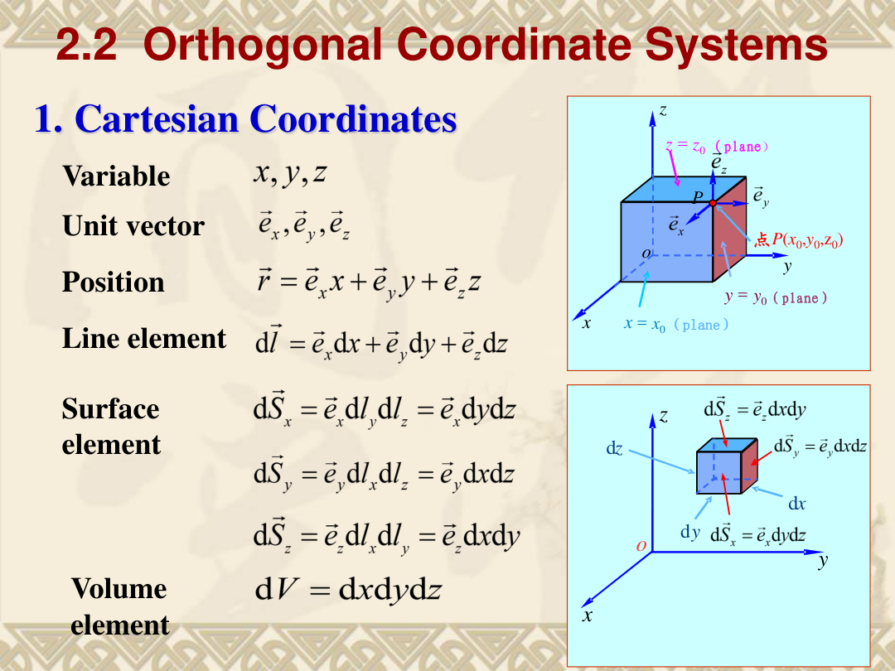
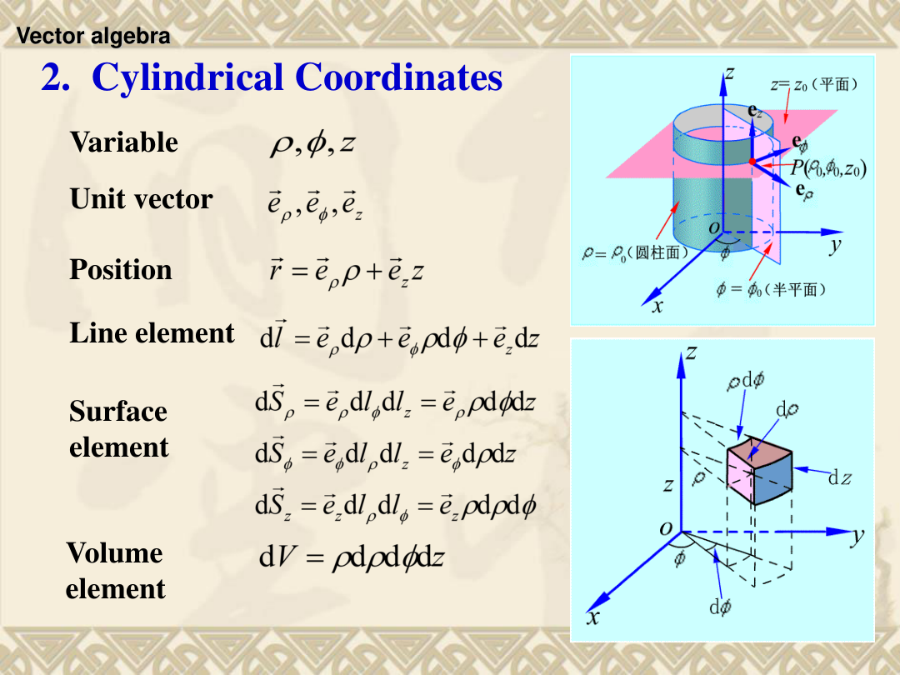
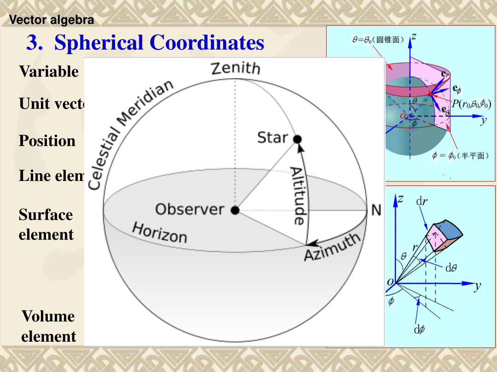
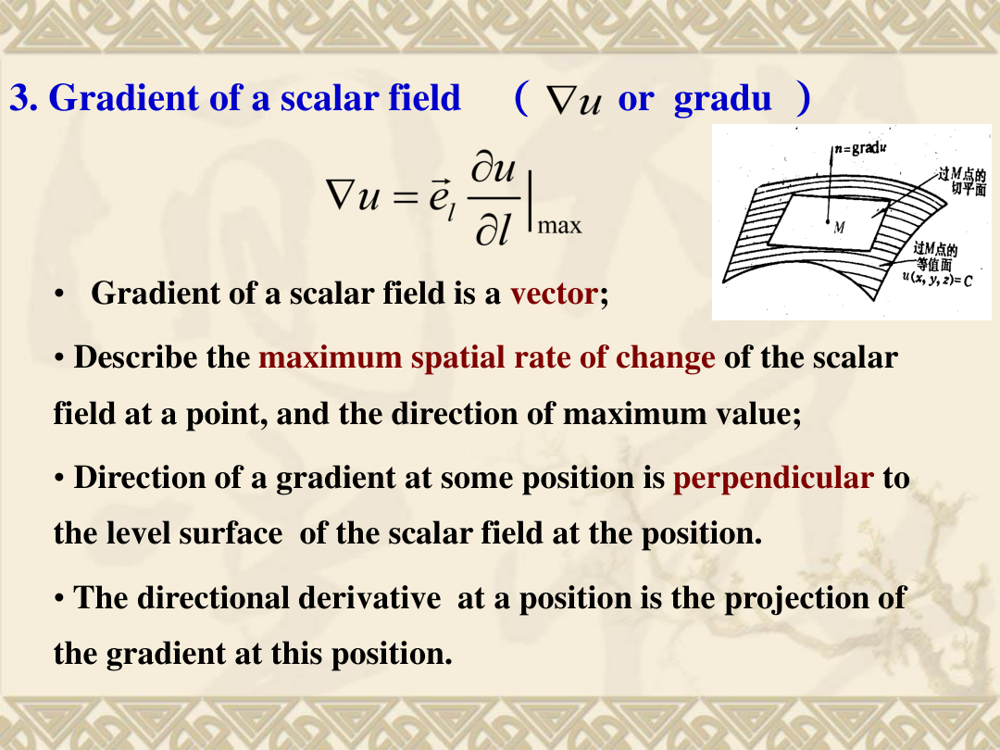
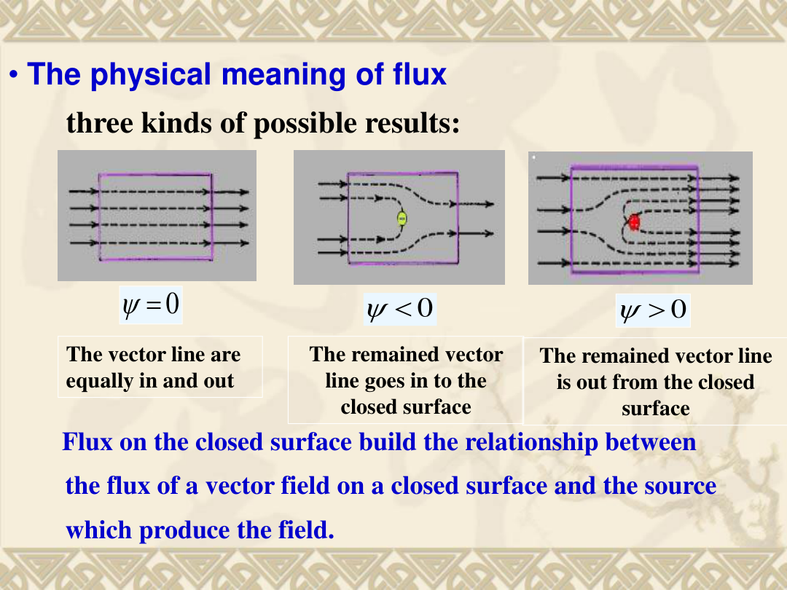
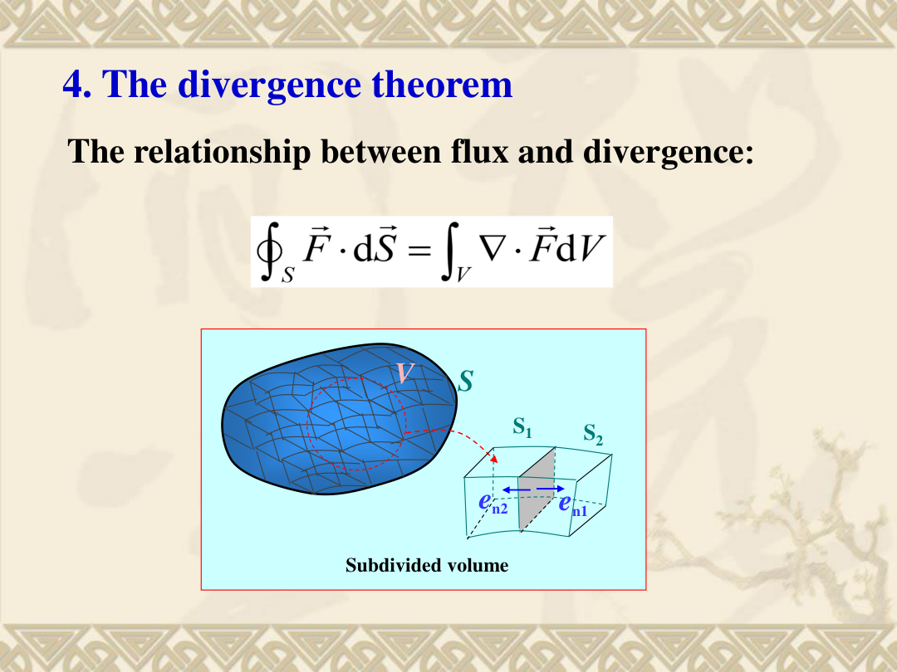
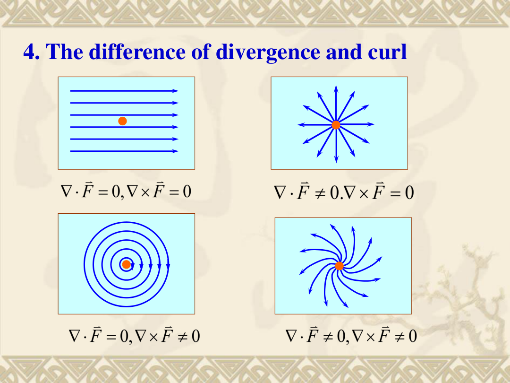

## 1. 基础：标量、矢量、场

- **标量**：只有大小的量（温度、能量）。**矢量**：有大小和方向的量（力、电场 $\vec E$）。矢量大小记为 $A=|\vec A|$，方向用单位矢量 $\vec e_A=\frac{\vec A}{A}$ 表示。
- **场**：物理量在空间中每一点的分布。标量场如 $T(x,y,z)$，矢量场如 $\vec E(x,y,z)$。不含 $t$ 叫静态场，含 $t$ 叫时变场。
- **矢量基本运算**（直接算，不考推导）：

| 运算 | 公式 | 结果 |
|---|---|---|
| 加减 | $\vec A\pm\vec B=\vec e_x(A_x\pm B_x)+\vec e_y(A_y\pm B_y)+\vec e_z(A_z\pm B_z)$ | 矢量 |
| 数乘 | $k\vec A=\vec e_x kA_x+\vec e_y kA_y+\vec e_z kA_z$ | 矢量 |
| 点乘 | $\vec A\cdot\vec B=AB\cos\theta=A_xB_x+A_yB_y+A_zB_z$ | 标量 |
| 叉乘 | $\vec A\times\vec B=\vec e_n AB\sin\theta$（$\vec e_n\perp\vec A,\vec B$，方向右手定则） | 矢量 |

分量式：

$$
\vec A=\vec e_xA_x+\vec e_yA_y+\vec e_zA_z,\quad A_x=A\cos\alpha,\;A_y=A\cos\beta,\;A_z=A\cos\gamma
$$

其中 $\cos\alpha,\cos\beta,\cos\gamma$ 是 $\vec A$ 与 $x,y,z$ 轴的方向余弦，满足 $\cos^2\alpha+\cos^2\beta+\cos^2\gamma=1$（因为 $(\cos\alpha,\cos\beta,\cos\gamma)=\vec e_A$ 是单位矢量，长度平方=1）。

## 2. 三种坐标系

选择原则：面对称→直角坐标，轴对称→圆柱坐标，点对称→球坐标。

### 2.1 直角坐标 (Cartesian)

变量 $x,y,z$，单位矢量 $\vec e_x,\vec e_y,\vec e_z$（方向固定，是常矢量）。

| 要素 | 表达式 |
|---|---|
| 位置矢量 | $\vec r=\vec e_x x+\vec e_y y+\vec e_z z$ |
| 线元 | $d\vec l=\vec e_x dx+\vec e_y dy+\vec e_z dz$ |
| 面元 | $d\vec S_x=\vec e_x\,dy\,dz,\; d\vec S_y=\vec e_y\,dx\,dz,\; d\vec S_z=\vec e_z\,dx\,dy$ |
| 体元 | $dV=dx\,dy\,dz$ |

### 2.2 圆柱坐标 (Cylindrical)

变量 $\rho,\phi,z$，单位矢量 $\vec e_\rho,\vec e_\phi,\vec e_z$。**注意：$\vec e_\rho,\vec e_\phi$ 方向随 $\phi$ 变化，不是常矢量。**

| 要素 | 表达式 |
|---|---|
| 位置矢量 | $\vec r=\vec e_\rho\rho+\vec e_z z$ |
| 线元 | $d\vec l=\vec e_\rho d\rho+\vec e_\phi\,\rho d\phi+\vec e_z dz$ |
| 面元（常用） | $d\vec S_\rho=\vec e_\rho\,\rho d\phi dz$（侧面），$d\vec S_z=\vec e_z\,\rho d\rho d\phi$（底面） |
| 体元 | $dV=\rho\,d\rho\,d\phi\,dz$ |

**为什么多出 $\rho$：** 沿 $\phi$ 走 $d\phi$，弧长 = 半径 × 角度 = $\rho d\phi$，不是 $d\phi$。

### 2.3 球坐标 (Spherical)

变量 $r,\theta,\phi$。$\theta$ 是从 $+z$ 轴量的极角（0 到 $\pi$），$\phi$ 是绕 $z$ 轴的方位角（0 到 $2\pi$）。单位矢量 $\vec e_r,\vec e_\theta,\vec e_\phi$ 方向都随位置变化。

| 要素 | 表达式 |
|---|---|
| 位置矢量 | $\vec r=\vec e_r r$（只有一个分量！从原点出发天然沿 $\vec e_r$） |
| 线元 | $d\vec l=\vec e_r dr+\vec e_\theta\,r d\theta+\vec e_\phi\,r\sin\theta d\phi$ |
| 面元（常用） | $d\vec S_r=\vec e_r\,r^2\sin\theta d\theta d\phi$（球面） |
| 体元 | $dV=r^2\sin\theta\,dr\,d\theta\,d\phi$ |

**易错：** 球面面元一定带 $\sin\theta$，不能漏。

## 3. $\nabla$ 算符与三大运算

$\nabla$（del / nabla）是一个"带方向的求导算符"。直角坐标中定义为：

$$
\nabla=\vec e_x\frac{\partial}{\partial x}+\vec e_y\frac{\partial}{\partial y}+\vec e_z\frac{\partial}{\partial z}
$$

三种作用方式：

| 作用方式 | 运算 | 记号 | 输入→输出 |
|---|---|---|---|
| 乘标量 $u$ | 梯度 | $\nabla u$ | 标量→矢量 |
| 点乘矢量 $\vec F$ | 散度 | $\nabla\cdot\vec F$ | 矢量→标量 |
| 叉乘矢量 $\vec F$ | 旋度 | $\nabla\times\vec F$ | 矢量→矢量 |

下面逐一展开。**三个运算在三种坐标系中的公式必须记住**，考试附录只给坐标系线面体元，不给算子公式。

### 3.1 梯度 Gradient

**干什么：** 标量场 $u$ 变化最快的方向和速率。结果是矢量——方向指向 $u$ 增加最快方向，大小等于最大方向导数。

**直角坐标：**
$$\nabla u=\vec e_x\frac{\partial u}{\partial x}+\vec e_y\frac{\partial u}{\partial y}+\vec e_z\frac{\partial u}{\partial z}$$

**圆柱坐标：**
$$\nabla u=\vec e_\rho\frac{\partial u}{\partial\rho}+\vec e_\phi\frac{1}{\rho}\frac{\partial u}{\partial\phi}+\vec e_z\frac{\partial u}{\partial z}$$

**球坐标：**
$$\nabla u=\vec e_r\frac{\partial u}{\partial r}+\vec e_\theta\frac{1}{r}\frac{\partial u}{\partial\theta}+\vec e_\phi\frac{1}{r\sin\theta}\frac{\partial u}{\partial\phi}$$

**运算法则：** $\nabla C=0$，$\nabla(Cu)=C\nabla u$，$\nabla(uv)=u\nabla v+v\nabla u$，$\nabla f(u)=f'(u)\nabla u$

#### 配套例题

**题目：** 求 $\varphi(x,y,z)=2x^2+y-5z^2$ 在点 $P(1,0,3)$ 处的梯度。

**解：**
$$\nabla\varphi=\vec e_x\frac{\partial\varphi}{\partial x}+\vec e_y\frac{\partial\varphi}{\partial y}+\vec e_z\frac{\partial\varphi}{\partial z}=\vec e_x(4x)+\vec e_y(1)+\vec e_z(-10z)$$

代入 $P(1,0,3)$：
$$\boxed{\left.\nabla\varphi\right|_P=4\vec e_x+\vec e_y-30\vec e_z}$$

（这是考试 Q1(c) 同类题）

**方向导数：** 沿方向 $\vec e_l$ 的变化率 = 梯度在该方向的投影：$\frac{\partial u}{\partial l}=\nabla u\cdot\vec e_l$。最大方向导数 = $|\nabla u|$（当 $\vec e_l$ 与 $\nabla u$ 同向时）。

**直观理解：** 梯度方向 $\perp$ 等值面，指向 $u$ 增加最快方向，就像爬山时最陡的上坡方向。

### 3.2 通量与散度 Flux & Divergence

**干什么：** 通量数穿过一个面的"场线"多少；散度判断一点是"源"（往外冒）还是"汇"（往里吸）。

**通量定义：** 矢量场 $\vec F$ 穿过曲面 $S$ 的通量
$$\psi=\int_S \vec F\cdot d\vec S=\int_S \vec F\cdot\vec e_n\,dS$$

闭合曲面取**外法线**方向：
$$\psi=\oint_S \vec F\cdot d\vec S$$
$\psi>0$：净流出（内含源），$\psi<0$：净流入（内含汇），$\psi=0$：进出平衡。

**散度定义：** 单位体积的净流出通量（一点附近的局部性质）
$$\operatorname{div}\vec F=\nabla\cdot\vec F=\lim_{\Delta V\to0}\frac{\oint_S\vec F\cdot d\vec S}{\Delta V}$$

**直角坐标：**
$$\nabla\cdot\vec F=\frac{\partial F_x}{\partial x}+\frac{\partial F_y}{\partial y}+\frac{\partial F_z}{\partial z}$$

**圆柱坐标：**
$$\nabla\cdot\vec F=\frac{1}{\rho}\frac{\partial(\rho F_\rho)}{\partial\rho}+\frac{1}{\rho}\frac{\partial F_\phi}{\partial\phi}+\frac{\partial F_z}{\partial z}$$

**球坐标：**
$$\nabla\cdot\vec F=\frac{1}{r^2}\frac{\partial(r^2F_r)}{\partial r}+\frac{1}{r\sin\theta}\frac{\partial(\sin\theta F_\theta)}{\partial\theta}+\frac{1}{r\sin\theta}\frac{\partial F_\phi}{\partial\phi}$$

**运算法则：** $\nabla\cdot(\vec C f)=\vec C\cdot\nabla f$，$\nabla\cdot(f\vec F)=f\nabla\cdot\vec F+\vec F\cdot\nabla f$，常矢量散度为零。

#### 配套例题

**题目：** 在半径为 1、高为 $h$ 的圆柱侧面上，计算 $\int_S(3\rho z\vec e_\rho+\phi\vec e_z)\cdot d\vec S$。

**解：** 侧面 $\rho=1$，外法向 $=\vec e_\rho$，面元 $d\vec S=\vec e_\rho\,d\phi dz$（$\rho=1$）。
$$(3\rho z\vec e_\rho+\phi\vec e_z)\cdot(\vec e_\rho d\phi dz)=3z\,d\phi dz$$
$$\int_0^{2\pi}\int_0^h 3z\,dz\,d\phi=2\pi\cdot\frac{3h^2}{2}=\boxed{3\pi h^2}$$

**散度定理（Gauss 定理）：** 闭合曲面通量 = 内部散度积分
$$\boxed{\oint_S\vec F\cdot d\vec S=\int_V\nabla\cdot\vec F\,dV}$$

直观：把体积切成小块，内部相邻面通量抵消，只剩外边界。

### 3.3 环流与旋度 Circulation & Curl

**干什么：** 环流看沿闭合回路绕一圈"推着转"的总效果；旋度看一点附近单位面积的环流趋势。

**环流定义：** 矢量场 $\vec F$ 沿闭合曲线 $C$ 的线积分
$$\Gamma=\oint_C \vec F\cdot d\vec l$$

**旋度定义：** 取法向为 $\vec e_n$ 的小面积 $\Delta S$，环流面密度的极限
$$\operatorname{rot}_n\vec F=\lim_{\Delta S\to0}\frac{1}{\Delta S}\oint_C\vec F\cdot d\vec l$$

旋度矢量取最大环流面密度的方向和大小（$\operatorname{rot}\vec F=\operatorname{curl}\vec F=\nabla\times\vec F$，三种写法等价）。

**直角坐标：**
$$\nabla\times\vec F=\vec e_x\left(\frac{\partial F_z}{\partial y}-\frac{\partial F_y}{\partial z}\right)+\vec e_y\left(\frac{\partial F_x}{\partial z}-\frac{\partial F_z}{\partial x}\right)+\vec e_z\left(\frac{\partial F_y}{\partial x}-\frac{\partial F_x}{\partial y}\right)$$

记忆：行列式展开（注意 $\vec e_y$ 项有负号）
$$\nabla\times\vec F=\begin{vmatrix}\vec e_x&\vec e_y&\vec e_z\\ \frac{\partial}{\partial x}&\frac{\partial}{\partial y}&\frac{\partial}{\partial z}\\ F_x&F_y&F_z\end{vmatrix}$$

**圆柱坐标：**
$$\nabla\times\vec F=\frac{1}{\rho}\begin{vmatrix}\vec e_\rho&\rho\vec e_\phi&\vec e_z\\ \frac{\partial}{\partial\rho}&\frac{\partial}{\partial\phi}&\frac{\partial}{\partial z}\\ F_\rho&\rho F_\phi&F_z\end{vmatrix}$$

**球坐标：**
$$\nabla\times\vec F=\frac{1}{r^2\sin\theta}\begin{vmatrix}\vec e_r&r\vec e_\theta&r\sin\theta\vec e_\phi\\ \frac{\partial}{\partial r}&\frac{\partial}{\partial\theta}&\frac{\partial}{\partial\phi}\\ F_r&rF_\theta&r\sin\theta F_\phi\end{vmatrix}$$

**两个关键恒等式（考试常用）：**
$$\boxed{\nabla\times(\nabla u)=0}\quad\text{（梯度场一定无旋）}$$
$$\boxed{\nabla\cdot(\nabla\times\vec F)=0}\quad\text{（旋度场一定无散）}$$

#### 配套例题

**题目：** $\vec A=2z^2\vec e_x+3x\vec e_y$，求 $\nabla\cdot\vec A$ 和 $\nabla\times\vec A$。

**解：** $A_x=2z^2,A_y=3x,A_z=0$

散度：$\nabla\cdot\vec A=\frac{\partial(2z^2)}{\partial x}+\frac{\partial(3x)}{\partial y}+0=0+0+0=\boxed{0}$

旋度：
- $x$ 分量：$\frac{\partial0}{\partial y}-\frac{\partial(3x)}{\partial z}=0$
- $y$ 分量：$\frac{\partial(2z^2)}{\partial z}-\frac{\partial0}{\partial x}=4z$
- $z$ 分量：$\frac{\partial(3x)}{\partial x}-\frac{\partial(2z^2)}{\partial y}=3$

$$\boxed{\nabla\times\vec A=4z\vec e_y+3\vec e_z}$$

**Stokes 定理：** 闭合曲线环流 = 曲面上旋度通量
$$\boxed{\oint_C\vec F\cdot d\vec l=\int_S(\nabla\times\vec F)\cdot d\vec S}$$

直观：把曲面分成小面元，相邻边线积分方向相反抵消，只剩外边界。

**直观理解旋度：** 把小水轮放进水流——水轮转动说明旋度不为零。注意：场线弯曲 ≠ 有旋度。

### 3.4 Laplacian 运算

**定义：** 梯度再散度（标量场求梯度得矢量，再求散度得回标量）
$$\nabla^2u=\nabla\cdot(\nabla u)$$

**直角坐标：** $\displaystyle\nabla^2u=\frac{\partial^2u}{\partial x^2}+\frac{\partial^2u}{\partial y^2}+\frac{\partial^2u}{\partial z^2}$

**圆柱坐标：** $\displaystyle\nabla^2u=\frac{1}{\rho}\frac{\partial}{\partial\rho}\left(\rho\frac{\partial u}{\partial\rho}\right)+\frac{1}{\rho^2}\frac{\partial^2u}{\partial\phi^2}+\frac{\partial^2u}{\partial z^2}$

**球坐标：** $\displaystyle\nabla^2u=\frac{1}{r^2}\frac{\partial}{\partial r}\left(r^2\frac{\partial u}{\partial r}\right)+\frac{1}{r^2\sin\theta}\frac{\partial}{\partial\theta}\left(\sin\theta\frac{\partial u}{\partial\theta}\right)+\frac{1}{r^2\sin^2\theta}\frac{\partial^2u}{\partial\phi^2}$

Laplacian 后续在泊松方程 $\nabla^2\varphi=-\rho_v/\varepsilon$ 和拉普拉斯方程 $\nabla^2\varphi=0$ 中反复出现。

## 4. 场的分类

| 类型 | 条件 | 等价形式 | 电磁场例子 |
|---|---|---|---|
| 无旋场（保守场） | $\nabla\times\vec F=0$ | $\vec F=-\nabla\varphi$ | 静电场 $\vec E=-\nabla\varphi$ |
| 无散场（管量场） | $\nabla\cdot\vec F=0$ | $\vec F=\nabla\times\vec A$ | 静磁场 $\vec B=\nabla\times\vec A$ |

- **无旋 ≠ 场为零**，只是闭合环流为零，线积分与路径无关。
- **无散 ≠ 没有场线**，只是没有净流出源，场线形成闭合回路。

**Helmholtz 定理（定性理解）：** 一个矢量场由它的散度（源/汇分布）和旋度（旋涡分布）共同决定，加上边界条件就能唯一确定。这就是 Maxwell 方程组能定义电磁场的数学基础——四个方程正给出了 $\vec E,\vec B$（或 $\vec D,\vec H$）的散度和旋度。

## 5. 自测题

### 题目

1. 写出通量和散度的定义及数学表达式。
2. 写出环流和旋度的定义及数学表达式。
3. 求 $\varphi(x,y,z)=2x^2+y-5z^2$ 在 $P(1,0,3)$ 处的梯度。
4. 写出圆柱坐标的线元 $d\vec l$ 和体元 $dV$。
5. 写出球面 $r=R$ 的外法向面元 $d\vec S$。
6. 已知 $\vec A=2z^2\vec e_x+3x\vec e_y$，求 $\nabla\cdot\vec A$ 和 $\nabla\times\vec A$。
7. $\vec A=2\vec e_x+3\vec e_y+4\vec e_z$，求 $\nabla\cdot\vec A$ 和 $\nabla\times\vec A$。
8. $\vec A=2x\vec e_x+3y\vec e_y+4z^2\vec e_z$，求 $\nabla\cdot\vec A$ 和 $\nabla\times\vec A$。
9. 写出散度定理和 Stokes 定理的数学表达式。
10. 判断正误并说理由：(a) "无旋场就是场强处处为零" (b) "无散场就是没有场线"
11. 求证：$\nabla\times(\nabla u)=0$，$\nabla\cdot(\nabla\times\vec F)=0$。
12. 写出圆柱坐标和球坐标中的梯度、散度、旋度公式。

### 答案

1. **通量：** $\psi=\int_S \vec F\cdot d\vec S$，闭合面取外法向 $\psi=\oint_S \vec F\cdot d\vec S$。**散度：** $\nabla\cdot\vec F=\lim_{\Delta V\to0}\frac{\oint_S\vec F\cdot d\vec S}{\Delta V}$。散度是单位体积净流出通量，正值=源，负值=汇。

2. **环流：** $\Gamma=\oint_C \vec F\cdot d\vec l$。**旋度：** $\operatorname{rot}_n\vec F=\lim_{\Delta S\to0}\frac{1}{\Delta S}\oint_C\vec F\cdot d\vec l$，旋度是最大环流面密度。

3. $\nabla\varphi=4x\vec e_x+\vec e_y-10z\vec e_z$，在 $P(1,0,3)$：$\boxed{\nabla\varphi|_P=4\vec e_x+\vec e_y-30\vec e_z}$

4. $d\vec l=\vec e_\rho d\rho+\vec e_\phi\rho d\phi+\vec e_z dz$，$dV=\rho d\rho d\phi dz$

5. $d\vec S=\vec e_r R^2\sin\theta d\theta d\phi$

6. $\boxed{\nabla\cdot\vec A=0}$，$\boxed{\nabla\times\vec A=4z\vec e_y+3\vec e_z}$

7. 常矢量：$\boxed{\nabla\cdot\vec A=0}$，$\boxed{\nabla\times\vec A=\vec 0}$

8. $\nabla\cdot\vec A=2+3+8z=\boxed{5+8z}$；$\nabla\times\vec A=\vec e_x(0-0)+\vec e_y(0-0)+\vec e_z(0-0)=\boxed{\vec 0}$。虽然各分量随位置变化，但各分量只沿自己的方向变化，没有交叉项产生环流。

9. 散度定理：$\oint_S\vec F\cdot d\vec S=\int_V\nabla\cdot\vec F\,dV$（面通量→体散度积分）。Stokes 定理：$\oint_C\vec F\cdot d\vec l=\int_S(\nabla\times\vec F)\cdot d\vec S$（线环流→面旋度通量）。

10. (a) 错误。无旋场 $\nabla\times\vec F=0$ 是说没有旋涡源，场本身可以很强。如点电荷的静电场无旋但场强不为零。(b) 错误。无散场 $\nabla\cdot\vec F=0$ 是说没有发散源，场线可以存在且形成闭合回路，如磁感应线。

11. (a) $\nabla\times(\nabla u)$：$x$ 分量 $=\frac{\partial}{\partial y}\frac{\partial u}{\partial z}-\frac{\partial}{\partial z}\frac{\partial u}{\partial y}=0$（混合偏导可交换）。同理 $y,z$ 分量也为零。(b) $\nabla\cdot(\nabla\times\vec F)=\frac{\partial}{\partial x}(\frac{\partial F_z}{\partial y}-\frac{\partial F_y}{\partial z})+\frac{\partial}{\partial y}(\frac{\partial F_x}{\partial z}-\frac{\partial F_z}{\partial x})+\frac{\partial}{\partial z}(\frac{\partial F_y}{\partial x}-\frac{\partial F_x}{\partial y})$，展开每对混合偏导互相抵消=0。

12. 见正文 3.1-3.4 节各坐标系公式。重点记忆直角坐标，理解圆柱/球坐标多出的尺度因子（$\frac{1}{\rho},\frac{1}{r},\frac{1}{r\sin\theta}$ 等）。
