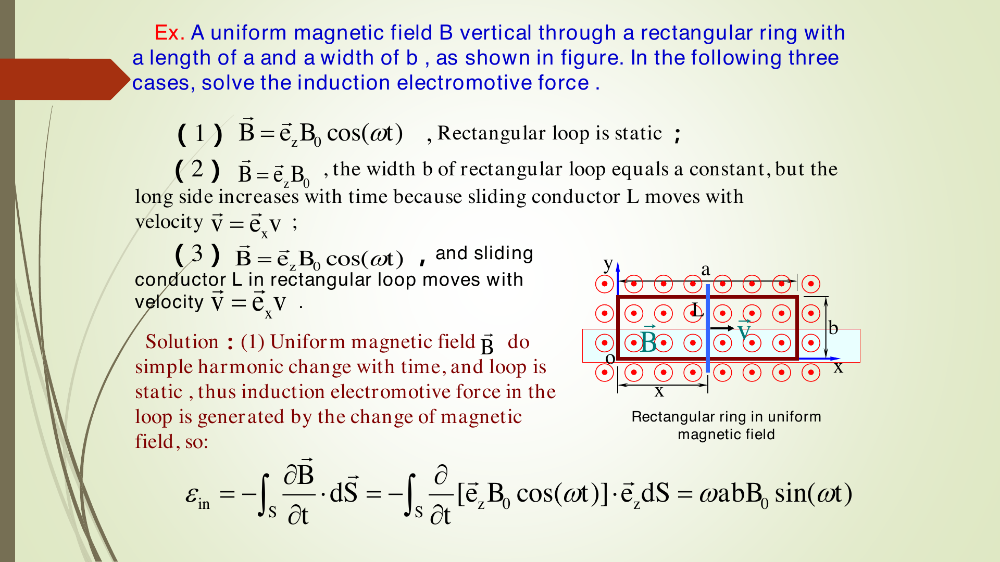
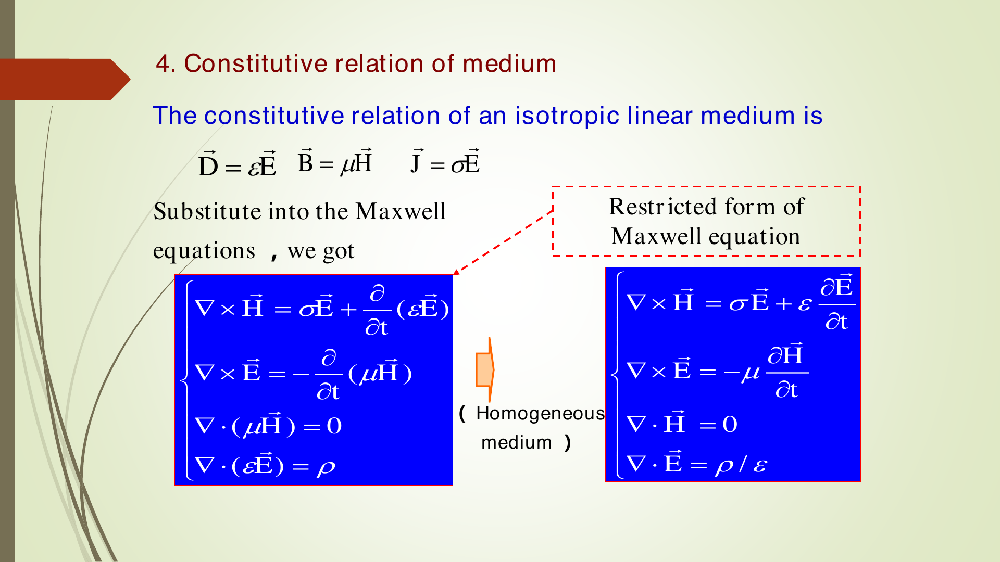
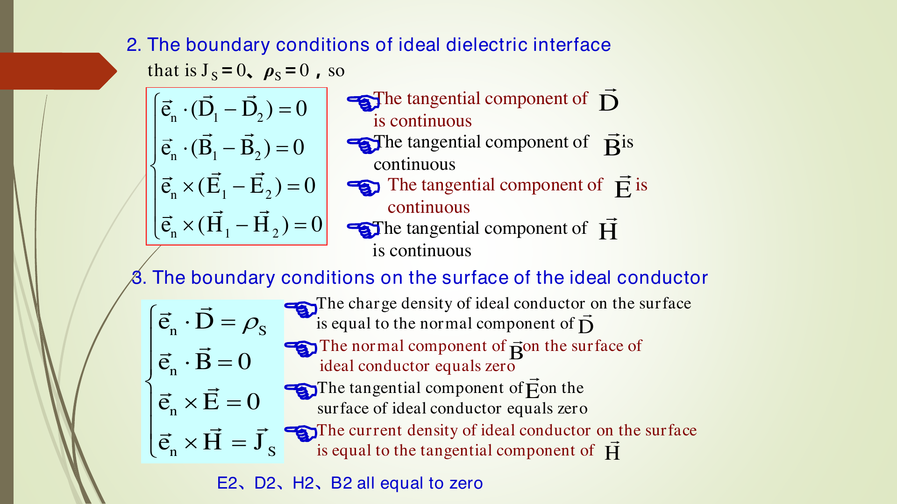

## 1. 本章主线

前几章主要是静态或恒定问题：静电场中 $\nabla\times\vec E=0$，恒定电流场中 $\nabla\cdot\vec J=0$，静磁场中常用 $\nabla\times\vec H=\vec J$。第7章开始研究**时变场**：电场、磁场、电荷、电流可以随时间变化。

一句话理解本章：

- **变化的磁场产生有旋电场**：Faraday 定律。
- **变化的电场产生磁场**：Maxwell 位移电流修正。
- 两者合起来就是完整的 Maxwell 方程组，并推出电磁波。

考试优先级：Faraday 定律符号、运动电动势、位移电流、Maxwell 方程积分/微分形式、边界条件、波动方程、位函数、Lorentz 规范、相量法 $\partial/\partial t\to j\omega$。

---

## 2. 符号表

| 符号 | 含义 | 单位 |
|---|---|---|
| $\vec E$ | 电场强度 | V/m |
| $\vec D$ | 电位移矢量，线性介质中 $\vec D=\varepsilon\vec E$ | C/m$^2$ |
| $\vec H$ | 磁场强度 | A/m |
| $\vec B$ | 磁感应强度，线性介质中 $\vec B=\mu\vec H$ | T |
| $\vec J,\vec J_f$ | 传导电流密度/自由电流密度 | A/m$^2$ |
| $\vec J_d$ | 位移电流密度，$\vec J_d=\partial\vec D/\partial t$ | A/m$^2$ |
| $\rho,\rho_f$ | 体电荷密度/自由体电荷密度 | C/m$^3$ |
| $\rho_s$ | 自由面电荷密度 | C/m$^2$ |
| $\vec J_s$ | 自由面电流密度 | A/m |
| $\varepsilon,\mu,\sigma$ | 介电常数、磁导率、电导率 | F/m, H/m, S/m |
| $\vec A$ | 磁矢位 | Wb/m |
| $\varphi$ | 标量电位 | V |
| $\omega$ | 角频率 | rad/s |
| $k$ | 无损介质波数，$k=\omega\sqrt{\mu\varepsilon}$ | rad/m |
| $k_c$ | 有损介质复波数，$k_c=\omega\sqrt{\mu\varepsilon_c}$ | rad/m |

本章统一采用相量时间因子 $e^{j\omega t}$。如果别的教材采用 $e^{-j\omega t}$，所有含 $j\omega$ 的符号会相反；做题时先确认时间因子。

---

## 3. Faraday 电磁感应定律

### 3.1 磁通与感应电动势

磁通量定义为

$$\Psi=\int_S\vec B\cdot d\vec S$$

其中 $S$ 是以闭合回路 $C$ 为边界的曲面，$d\vec S=\vec e_n dS$。$d\vec S$ 的方向与回路积分方向 $d\vec l$ 必须按右手定则配套：右手四指沿 $C$ 正方向弯曲，大拇指方向就是 $d\vec S$ 的正方向。

Faraday 定律：

$$\boxed{\mathcal E_{\text{in}}=-\frac{d\Psi}{dt}=-\frac{d}{dt}\int_S\vec B\cdot d\vec S}$$

$\mathcal E_{\text{in}}$ 是感应电动势。负号表示 Lenz 定律：感应效应总是**反抗磁通量的变化**，不是简单地“反抗磁场”。

静止闭合回路中，感应电动势也可写为

$$\boxed{\mathcal E_{\text{in}}=\oint_C\vec E_{\text{in}}\cdot d\vec l}$$

所以

$$\boxed{\oint_C\vec E\cdot d\vec l=-\frac{d}{dt}\int_S\vec B\cdot d\vec S}$$

若回路不动，时间导数只作用在 $\vec B$ 上：

$$\boxed{\oint_C\vec E\cdot d\vec l=-\int_S\frac{\partial\vec B}{\partial t}\cdot d\vec S}$$

由 Stokes 定理

$$\oint_C\vec E\cdot d\vec l=\int_S(\nabla\times\vec E)\cdot d\vec S$$

得到微分形式：

$$\boxed{\nabla\times\vec E=-\frac{\partial\vec B}{\partial t}}$$

这说明：变化磁场是电场的来源之一，而且产生的是**有旋电场**。

### 3.2 静电场与感应电场

电场来源可以分成两类：电荷、随时间变化的磁场。可写成

$$\vec E=\vec E_c+\vec E_{\text{in}}$$

其中 $\vec E_c$ 是电荷产生的静电型电场，$\vec E_{\text{in}}$ 是变化磁场产生的感应电场。

| 项目 | 静电型电场 $\vec E_c$ | 感应电场 $\vec E_{\text{in}}$ |
|---|---|---|
| 来源 | 电荷 | 随时间变化的磁场 |
| 环路积分 | $\oint_C\vec E_c\cdot d\vec l=0$ | $\oint_C\vec E_{\text{in}}\cdot d\vec l=-d\Psi/dt$ |
| 是否保守 | 是 | 一般不是 |
| 能否只用静态电势表示 | 可以，$\vec E_c=-\nabla\varphi$ | 一般不可以 |
| 场线 | 起于正电荷、止于负电荷 | 常形成闭合旋涡线 |

弱基础记忆：如果 $\oint_C\vec E\cdot d\vec l\ne0$，说明沿闭合路一圈还能得到非零“推动作用”，这类电场不能只由单值电势 $\varphi$ 描述。

### 3.3 磁通变化的三种情况

#### 情况1：回路不动，磁场随时间变化

$$\boxed{\mathcal E_{\text{in}}=-\int_S\frac{\partial\vec B}{\partial t}\cdot d\vec S}$$

这叫**变压器电动势**或静止回路中的感应电动势，来源是 $\partial\vec B/\partial t$。

#### 情况2：磁场不变，导体回路运动

运动电荷在磁场中受 Lorentz 力，单位电荷受到的磁力对应 $\vec v\times\vec B$，因此

$$\boxed{\mathcal E_{\text{in}}=\oint_C(\vec v\times\vec B)\cdot d\vec l}$$

这叫**运动电动势**，是发电机的基本原理。

#### 情况3：回路运动且磁场也随时间变化

$$\boxed{\mathcal E_{\text{in}}=\oint_C(\vec v\times\vec B)\cdot d\vec l-\int_S\frac{\partial\vec B}{\partial t}\cdot d\vec S}$$

考试步骤：先判断磁通变化来自“磁场变化”还是“面积/回路运动”，再分项计算。不要只写 $-d\Psi/dt$ 后乱定号；回路方向、面积法向、滑动杆积分方向必须统一。

---

## 4. Maxwell 方程组

### 4.1 为什么 Ampere 定律必须修正

静态磁场中有

$$\nabla\times\vec H=\vec J$$

但时变场满足连续性方程

$$\boxed{\nabla\cdot\vec J=-\frac{\partial\rho}{\partial t}}$$

如果仍用 $\nabla\times\vec H=\vec J$，两边取散度：

$$\nabla\cdot\vec J=\nabla\cdot(\nabla\times\vec H)=0$$

这与 $\nabla\cdot\vec J=-\partial\rho/\partial t$ 矛盾。用 Gauss 定律 $\nabla\cdot\vec D=\rho$：

$$\nabla\cdot\vec J=-\frac{\partial}{\partial t}(\nabla\cdot\vec D)=-\nabla\cdot\frac{\partial\vec D}{\partial t}$$

移项得到

$$\boxed{\nabla\cdot\left(\vec J+\frac{\partial\vec D}{\partial t}\right)=0}$$

因此修正为**全电流定律**：

$$\boxed{\nabla\times\vec H=\vec J_f+\frac{\partial\vec D}{\partial t}}$$

其中

$$\boxed{\vec J_d=\frac{\partial\vec D}{\partial t}}$$

称为位移电流密度。

### 4.2 位移电流的物理含义

位移电流不是电子真实穿过介质的传导电流。它表示 $\vec D$ 随时间变化的效应，也能产生磁场。

| 情况 | 传导电流 $\vec J=\sigma\vec E$ | 位移电流 $\partial\vec D/\partial t$ |
|---|---|---|
| 理想绝缘介质 | 无或很小 | 可以存在 |
| 理想导体 | 主要考虑传导电流 | 理想化处理中通常不单独考虑位移电流 |
| 一般介质 | 存在 | 存在 |

电容器例子：导线中有传导电流，电容极板间没有电子穿过空气/介质，但极板间电场随时间变化，所以有位移电流。引入位移电流后，Ampere 环路积分不再依赖你选导线截面还是穿过电容间隙的曲面。

### 4.3 Maxwell 方程：微分形式与积分形式

#### 微分形式

$$
\boxed{
\begin{aligned}
\nabla\times\vec H &= \vec J_f+\frac{\partial\vec D}{\partial t} &&\text{全电流定律}\\[2mm]
\nabla\times\vec E &= -\frac{\partial\vec B}{\partial t} &&\text{Faraday 定律}\\[2mm]
\nabla\cdot\vec B &=0 &&\text{磁通连续，无磁单极子}\\[2mm]
\nabla\cdot\vec D &=\rho_f &&\text{Gauss 定律}
\end{aligned}}
$$

#### 积分形式

$$
\boxed{
\begin{aligned}
\oint_C\vec H\cdot d\vec l &=\int_S\left(\vec J_f+\frac{\partial\vec D}{\partial t}\right)\cdot d\vec S \\
\oint_C\vec E\cdot d\vec l &=-\int_S\frac{\partial\vec B}{\partial t}\cdot d\vec S \\
\oint_S\vec B\cdot d\vec S &=0 \\
\oint_S\vec D\cdot d\vec S &=\int_V\rho_f\,dV
\end{aligned}}
$$

说明：前两个方程中的 $S$ 是以闭合路径 $C$ 为边界的开曲面；后两个方程中的 $S$ 是闭合曲面，$V$ 是它包围的体积。

### 4.4 本构关系与均匀介质中的限制形式

线性各向同性介质：

$$\boxed{\vec D=\varepsilon\vec E,\qquad \vec B=\mu\vec H,\qquad \vec J=\sigma\vec E}$$

代入 Maxwell 方程得到

$$
\boxed{
\begin{aligned}
\nabla\times\vec H&=\sigma\vec E+\frac{\partial}{\partial t}(\varepsilon\vec E)\\
\nabla\times\vec E&=-\frac{\partial}{\partial t}(\mu\vec H)\\
\nabla\cdot(\mu\vec H)&=0\\
\nabla\cdot(\varepsilon\vec E)&=\rho
\end{aligned}}
$$

若介质均匀，即 $\varepsilon,\mu,\sigma$ 为空间常数，则可写成常用限制形式：

$$
\boxed{
\begin{aligned}
\nabla\times\vec H&=\sigma\vec E+\varepsilon\frac{\partial\vec E}{\partial t}\\
\nabla\times\vec E&=-\mu\frac{\partial\vec H}{\partial t}\\
\nabla\cdot\vec H&=0\\
\nabla\cdot\vec E&=\frac{\rho}{\varepsilon}
\end{aligned}}
$$

---

## 5. 电磁边界条件

边界条件来自 Maxwell 方程的积分形式。取无限薄矩形回路或薄柱面时，面积趋于零，因此 $\partial\vec B/\partial t$ 和 $\partial\vec D/\partial t$ 的面积积分也趋于零。因此 **时变场边界条件的形式与静态场相同**。

设界面法向单位矢量 $\vec e_n$ 从介质2指向介质1。一般边界条件为

$$\boxed{\vec e_n\times(\vec H_1-\vec H_2)=\vec J_s}$$

$$\boxed{\vec e_n\times(\vec E_1-\vec E_2)=0}$$

$$\boxed{\vec e_n\cdot(\vec B_1-\vec B_2)=0}$$

$$\boxed{\vec e_n\cdot(\vec D_1-\vec D_2)=\rho_s}$$

其中 $\rho_s$ 是界面自由面电荷密度，$\vec J_s$ 是界面自由面电流密度。

电流连续性边界条件：

$$\boxed{\vec e_n\cdot(\vec J_1-\vec J_2)=-\frac{\partial\rho_s}{\partial t}}$$

含义：如果界面自由面电荷随时间增加，则流入界面的净电流不为零；如果 $\partial\rho_s/\partial t=0$，就退化为恒定电流场中的 $J_{1n}=J_{2n}$。

记忆法：

- $\vec e_n\times$ 对应**切向**条件。
- $\vec e_n\cdot$ 对应**法向**条件。
- $\rho_s$ 只造成 $D_n$ 跳变。
- $\vec J_s$ 只造成 $H_t$ 跳变。

### 5.1 理想介质界面

若界面无自由面电荷、无自由面电流，即 $\rho_s=0,\vec J_s=0$：

$$\boxed{\vec e_n\cdot(\vec D_1-\vec D_2)=0}$$

$$\boxed{\vec e_n\cdot(\vec B_1-\vec B_2)=0}$$

$$\boxed{\vec e_n\times(\vec E_1-\vec E_2)=0}$$

$$\boxed{\vec e_n\times(\vec H_1-\vec H_2)=0}$$

即 $D_n,B_n,E_t,H_t$ 连续。

注意：点乘 $\vec e_n\cdot$ 对应法向分量，所以这里连续的是 $D_n$ 和 $B_n$，不是切向分量。

### 5.2 理想导体表面

设介质1在导体外部，介质2为理想导体内部。理想导体内部时变场取零：

$$\vec E_2=\vec D_2=\vec H_2=\vec B_2=0$$

于是导体表面边界条件为

$$\boxed{\vec e_n\cdot\vec D=\rho_s}$$

$$\boxed{\vec e_n\cdot\vec B=0}$$

$$\boxed{\vec e_n\times\vec E=0}$$

$$\boxed{\vec e_n\times\vec H=\vec J_s}$$

考试语言：导体表面切向电场为零，法向磁感应强度为零；表面电荷由法向 $D$ 决定，表面电流由切向 $H$ 决定。

---

## 6. 关键图像

### 图1：矩形回路中的电磁感应例题

看图时只抓三点：

- $\vec B$ 沿 $+\vec e_z$，即从纸面向外。
- 滑动杆沿 $+x$ 方向运动，面积随时间变化。
- 第(3)问要把磁场变化项和运动项相加。

### 图2：电容器中的位移电流

电容极板间没有传导电流穿过介质，但有 $\partial\vec D/\partial t$，所以磁场仍能连续地由全电流解释。

### 图3：电磁边界条件总图

此图核心是法向方向：$\vec e_n$ 从介质2指向介质1。因此所有差值都写成“1 减 2”。如果你反过来定义法向，公式中的差值也要反过来。

---

## 7. 波动方程

### 7.1 有源区波动方程

在均匀线性介质中，从 Maxwell 方程可推出电场、磁场波动方程：

$$\boxed{\nabla^2\vec E-\mu\varepsilon\frac{\partial^2\vec E}{\partial t^2}=\mu\frac{\partial\vec J}{\partial t}+\frac{1}{\varepsilon}\nabla\rho}$$

$$\boxed{\nabla^2\vec H-\mu\varepsilon\frac{\partial^2\vec H}{\partial t^2}=-\nabla\times\vec J}$$

推导磁场方程的关键恒等式：

$$\nabla\times(\nabla\times\vec H)=\nabla(\nabla\cdot\vec H)-\nabla^2\vec H$$

因为均匀介质中 $\nabla\cdot\vec H=0$，所以左边变成 $-\nabla^2\vec H$，再代入 Faraday 定律得到上式。

### 7.2 无源区波动方程与波速

无源区指 $\vec J=0,\rho=0$。此时

$$\boxed{\nabla^2\vec E-\mu\varepsilon\frac{\partial^2\vec E}{\partial t^2}=0}$$

$$\boxed{\nabla^2\vec H-\mu\varepsilon\frac{\partial^2\vec H}{\partial t^2}=0}$$

与标准波动方程

$$\nabla^2 u-\frac{1}{v^2}\frac{\partial^2u}{\partial t^2}=0$$

比较可得波速

$$\boxed{v=\frac{1}{\sqrt{\mu\varepsilon}}}$$

$k=\omega\sqrt{\mu\varepsilon}$ 与 $v=\omega/k$ 等价。

---

## 8. 位函数

### 8.1 引入位函数

因为

$$\nabla\cdot\vec B=0$$

任意无散磁场都可写成某个矢量位的旋度：

$$\boxed{\vec B=\nabla\times\vec A}$$

代入 Faraday 定律：

$$\nabla\times\vec E=-\frac{\partial}{\partial t}(\nabla\times\vec A)=-\nabla\times\frac{\partial\vec A}{\partial t}$$

所以

$$\nabla\times\left(\vec E+\frac{\partial\vec A}{\partial t}\right)=0$$

无旋场可写成标量势的负梯度：

$$\boxed{\vec E+\frac{\partial\vec A}{\partial t}=-\nabla\varphi}$$

即

$$\boxed{\vec E=-\frac{\partial\vec A}{\partial t}-\nabla\varphi}$$

注意：时变场中 $\vec E$ 不能只写成 $-\nabla\varphi$，必须加 $-\partial\vec A/\partial t$。

### 8.2 位函数方程

D'Alembert 位函数方程：

$$\boxed{\nabla^2\vec A-\varepsilon\mu\frac{\partial^2\vec A}{\partial t^2}=-\mu\vec J+\nabla\left(\nabla\cdot\vec A+\mu\varepsilon\frac{\partial\varphi}{\partial t}\right)}$$

$$\boxed{\nabla^2\varphi=-\frac{\rho}{\varepsilon}-\frac{\partial}{\partial t}(\nabla\cdot\vec A)}$$

问题：$\vec A$ 和 $\varphi$ 耦合在一起，不好分别求。

### 8.3 规范条件：Coulomb gauge 与 Lorentz gauge

#### Coulomb 规范

$$\boxed{\nabla\cdot\vec A=0}$$

则

$$\boxed{\nabla^2\varphi=-\frac{\rho}{\varepsilon}}$$

但 $\vec A$ 方程仍含有 $\mu\varepsilon\,\partial(\nabla\varphi)/\partial t$，所以标量位和矢量位仍不能完全分离。

#### Lorentz 规范

$$\boxed{\nabla\cdot\vec A+\mu\varepsilon\frac{\partial\varphi}{\partial t}=0}$$

也可写为

$$\boxed{\nabla\cdot\vec A=-\mu\varepsilon\frac{\partial\varphi}{\partial t}}$$

代入得到解耦方程：

$$\boxed{\nabla^2\vec A-\mu\varepsilon\frac{\partial^2\vec A}{\partial t^2}=-\mu\vec J}$$

$$\boxed{\nabla^2\varphi-\mu\varepsilon\frac{\partial^2\varphi}{\partial t^2}=-\frac{\rho}{\varepsilon}}$$

在无源区，直接求 $\vec E,\vec H$ 和求位函数复杂度差不多；在有源区，位函数通常更简单，因为 Lorentz 规范下 $\vec A$ 主要由电流源决定，$\varphi$ 主要由电荷源决定。

---

## 9. 时谐场与复数表示

### 9.1 时谐场定义

若物理量按正弦或余弦规律随时间变化，称为时谐场：

$$A(\vec r,t)=A_0\cos[\omega t+\phi(\vec r)]$$

或

$$A(\vec r,t)=A_0\sin[\omega t+\phi(\vec r)]$$

复数表示：

$$\boxed{A(\vec r,t)=\operatorname{Re}\left[A(\vec r)e^{j\omega t}\right]}$$

其中 $A(\vec r)$ 是相量，只含空间变化和初相位。相量本身不是瞬时值；真正物理量是取实部后的结果。

### 9.2 微分、积分替换

在 $e^{j\omega t}$ 约定下：

$$\boxed{\frac{\partial}{\partial t}\longleftrightarrow j\omega}$$

$$\boxed{\frac{\partial^2}{\partial t^2}\longleftrightarrow -\omega^2}$$

$$\boxed{\int dt\longleftrightarrow \frac{1}{j\omega}}$$

### 9.3 相量形式 Maxwell 方程

$$
\boxed{
\begin{aligned}
\nabla\times\vec H(\vec r)&=\vec J(\vec r)+j\omega\vec D(\vec r)\\
\nabla\times\vec E(\vec r)&=-j\omega\vec B(\vec r)\\
\nabla\cdot\vec D(\vec r)&=\rho(\vec r)\\
\nabla\cdot\vec B(\vec r)&=0
\end{aligned}}
$$

连续性方程变成

$$\boxed{\nabla\cdot\vec J(\vec r)=-j\omega\rho(\vec r)}$$

### 9.4 无源区 Helmholtz 方程

由无源波动方程，用 $\partial^2/\partial t^2\to-\omega^2$：

$$\boxed{\nabla^2\vec E+k^2\vec E=0}$$

$$\boxed{\nabla^2\vec H+k^2\vec H=0}$$

其中

$$\boxed{k=\omega\sqrt{\mu\varepsilon}}$$

### 9.5 相量形式位函数方程

Lorentz 规范在相量形式下为

$$\boxed{\nabla\cdot\vec A=-j\omega\mu\varepsilon\varphi}$$

等价地，若需要由 $\vec A$ 求 $\varphi$：

$$\boxed{\varphi=-\frac{\nabla\cdot\vec A}{j\omega\mu\varepsilon}=\frac{j}{\omega\mu\varepsilon}\nabla\cdot\vec A}$$

有源区位函数 Helmholtz 方程：

$$\boxed{\nabla^2\vec A+k^2\vec A=-\mu\vec J}$$

$$\boxed{\nabla^2\varphi+k^2\varphi=-\frac{\rho}{\varepsilon}}$$

由位函数求场：

$$\boxed{\vec B=\nabla\times\vec A}$$

$$\boxed{\vec E=-j\omega\vec A-\nabla\varphi}$$

若用 Lorentz 规范消去 $\varphi$：

$$\boxed{\vec E=-j\omega\vec A-j\frac{\nabla(\nabla\cdot\vec A)}{\omega\mu\varepsilon}}$$

最后一式容易看晕，考试通常只需记住来源：先用 $\varphi=-\nabla\cdot\vec A/(j\omega\mu\varepsilon)$，再代入 $\vec E=-j\omega\vec A-\nabla\varphi$。

### 9.6 有损介质与复介电常数

导电介质中相量形式的 Ampere 定律：

$$\nabla\times\vec H=\vec J_{\text{introduced}}+\sigma\vec E+j\omega\varepsilon\vec E$$

把 $\sigma\vec E$ 合并进复介电常数：

$$\sigma\vec E+j\omega\varepsilon\vec E=j\omega\left(\varepsilon-j\frac{\sigma}{\omega}\right)\vec E$$

定义

$$\boxed{\varepsilon_c=\varepsilon-j\frac{\sigma}{\omega}}$$

于是

$$\boxed{\nabla\times\vec H=\vec J_{\text{introduced}}+j\omega\varepsilon_c\vec E}$$

有损无源区：

$$\boxed{\nabla^2\vec E+k_c^2\vec E=0,\\ \nabla^2\vec H+k_c^2\vec H=0}$$

其中

$$\boxed{k_c=\omega\sqrt{\mu\varepsilon_c}}$$

有损有源区位函数方程：

$$\boxed{\nabla^2\vec A+k_c^2\vec A=-\mu\vec J_{\text{introduced}}}$$

$$\boxed{\nabla^2\varphi+k_c^2\varphi=-\frac{\rho_{\text{introduced}}}{\varepsilon_c}}$$

Lorentz 规范变为

$$\boxed{\nabla\cdot\vec A=-j\omega\mu\varepsilon_c\varphi}$$

### 9.7 损耗正切

一般复介电常数可写为

$$\varepsilon_c=\varepsilon'-j\varepsilon''$$

损耗正切是虚部与实部的比值：

$$\tan\delta_\varepsilon=\frac{\varepsilon''}{\varepsilon'}$$

若损耗来自电导率，则

$$\boxed{\tan\delta_\sigma=\frac{\sigma}{\omega\varepsilon}}$$

它等于传导电流幅值与位移电流幅值之比：

$$\frac{|\sigma E|}{|j\omega\varepsilon E|}=\frac{\sigma}{\omega\varepsilon}$$

| 条件 | 介质类型 | 主导项 |
|---|---|---|
| $\sigma/(\omega\varepsilon)\ll1$ | 弱导电介质/好绝缘体 | 位移电流主导 |
| $\sigma/(\omega\varepsilon)\approx1$ | 普通导电介质 | 两者同量级 |
| $\sigma/(\omega\varepsilon)\gg1$ | 良导体 | 传导电流主导 |

---

## 10. 典型例题

### 例1：矩形回路的感应电动势

**题目**：矩形回路宽 $b$。磁场垂直回路，方向取 $+\vec e_z$。滑动杆沿 $+x$ 方向运动，$x=vt$。求三种情况的感应电动势：

1. $\vec B=\vec e_zB_0\cos\omega t$，回路静止，面积 $ab$；
2. $\vec B=\vec e_zB_0$，滑动杆运动，面积 $bvt$；
3. $\vec B=\vec e_zB_0\cos\omega t$，滑动杆也运动。

**解答**：取 $d\vec S=\vec e_zdS$，滑动杆积分方向取 $d\vec l=\vec e_y dl$。

(1) 回路静止：

$$\Psi=B_0\cos\omega t\cdot ab$$

$$\mathcal E=-\frac{d\Psi}{dt}=-ab\frac{d}{dt}(B_0\cos\omega t)=\omega abB_0\sin\omega t$$

$$\boxed{\mathcal E=\omega abB_0\sin\omega t}$$

(2) 磁场不变，面积 $S=bvt$：

$$\Psi=B_0bvt$$

$$\mathcal E=-\frac{d}{dt}(B_0bvt)=-bB_0v$$

也可用运动电动势：

$$\vec v\times\vec B=(\vec e_xv)\times(\vec e_zB_0)=-\vec e_yvB_0$$

$$\mathcal E=\int_0^b(-\vec e_yvB_0)\cdot\vec e_y dl=-vB_0b$$

$$\boxed{\mathcal E=-bB_0v}$$

(3) 两项相加。

磁场变化项：

$$-\int_S\frac{\partial\vec B}{\partial t}\cdot d\vec S=-\int_S[-\omega B_0\sin\omega t]dS=vt\,\omega bB_0\sin\omega t$$

运动项：

$$\oint_C(\vec v\times\vec B)\cdot d\vec l=\int_0^b[-\vec e_yvB_0\cos\omega t]\cdot\vec e_y dl=-vbB_0\cos\omega t$$

总电动势：

$$\boxed{\mathcal E=vt\omega bB_0\sin\omega t-vbB_0\cos\omega t}$$

检查：若令 $\omega=0$，第(3)式退化为第(2)式，说明符号合理。

### 例2：位移电流密度

**题目**：空气中平行板电容器间电场为

$$\vec E(t)=\vec e_zE_0\cos\omega t$$

空气介电常数为 $\varepsilon$，求位移电流密度 $\vec J_d$。

**解答**：

$$\vec D=\varepsilon\vec E=\vec e_z\varepsilon E_0\cos\omega t$$

$$\vec J_d=\frac{\partial\vec D}{\partial t}=\vec e_z\varepsilon E_0\frac{d}{dt}(\cos\omega t)$$

$$\boxed{\vec J_d=-\vec e_z\omega\varepsilon E_0\sin\omega t}$$

### 例3：由相量求瞬时场

**题目**：已知电场相量

$$\vec E_m(z)=\vec e_x jE_{xm}\cos(k_z z)$$

采用 $e^{j\omega t}$ 约定，求瞬时电场。

**解答**：

$$\vec E(z,t)=\operatorname{Re}[\vec E_m(z)e^{j\omega t}]$$

$$=\operatorname{Re}[\vec e_x jE_{xm}\cos(k_z z)e^{j\omega t}]$$

因为 $j=e^{j\pi/2}$：

$$=\operatorname{Re}[\vec e_xE_{xm}\cos(k_z z)e^{j(\omega t+\pi/2)}]$$

$$=\vec e_xE_{xm}\cos(k_z z)\cos(\omega t+\pi/2)$$

$$\boxed{\vec E(z,t)=-\vec e_xE_{xm}\cos(k_z z)\sin\omega t}$$

相量中的 $j$ 代表相位超前 $90^\circ$，不能丢掉。

### 例4：由瞬时场写相量

**题目**：

$$\vec E(z,t)=\vec e_xE_{xm}\cos(\omega t-kz+\phi_x)+\vec e_yE_{ym}\sin(\omega t-kz+\phi_y)$$

写出相量 $\vec E_m(z)$。

**解答**：把正弦改成余弦：

$$\sin\alpha=\cos(\alpha-\pi/2)$$

所以

$$\vec E(z,t)=\vec e_xE_{xm}\cos(\omega t-kz+\phi_x)+\vec e_yE_{ym}\cos(\omega t-kz+\phi_y-\pi/2)$$

去掉公共的 $e^{j\omega t}$ 后：

$$\vec E_m(z)=\vec e_xE_{xm}e^{j(-kz+\phi_x)}+\vec e_yE_{ym}e^{j(-kz+\phi_y-\pi/2)}$$

因为 $e^{-j\pi/2}=-j$：

$$\boxed{\vec E_m(z)=\left(\vec e_xE_{xm}e^{j\phi_x}-j\vec e_yE_{ym}e^{j\phi_y}\right)e^{-jkz}}$$

易错点：$\sin$ 在 $e^{j\omega t}$ 约定下转相量会多出 $-j$，不是 $+j$。

---

## 11. 重点难点总结

| 知识点 | 关键公式 | 常见错误 | 检查方法 |
|---|---|---|---|
| Faraday 定律 | $\oint\vec E\cdot d\vec l=-d\Psi/dt$ | 忘记负号或误解 Lenz 定律 | 看是否反抗“变化” |
| 运动电动势 | $\oint(\vec v\times\vec B)\cdot d\vec l$ | 与 $-\partial\vec B/\partial t$ 混用 | 先判断回路是否运动 |
| 位移电流 | $\vec J_d=\partial\vec D/\partial t$ | 当成电子穿过介质 | 看是否来自 $D$ 变化 |
| Maxwell 方程 | 四个微分/积分方程 | 漏掉 $\partial\vec D/\partial t$ | 用连续性方程检查 |
| 边界条件 | $e_n\times H,E$；$e_n\cdot B,D$ | 点乘/叉乘混淆 | 叉乘切向，点乘法向 |
| 电流边界 | $e_n\cdot(J_1-J_2)=-\partial_t\rho_s$ | 只记恒定 $J_{1n}=J_{2n}$ | 看面电荷是否随时间变 |
| 波动方程 | $\nabla^2E-\mu\varepsilon\partial_t^2E=0$ | 有源区误当无源区 | 检查 $J,\rho$ |
| 位函数 | $B=\nabla\times A$，$E=-\partial_tA-\nabla\varphi$ | 漏掉 $-\partial_tA$ | 代回 Faraday 定律 |
| Lorentz 规范 | $\nabla\cdot A+\mu\varepsilon\partial_t\varphi=0$ | 与 Coulomb 规范混淆 | Lorentz 可解耦 |
| 相量法 | $\partial_t\to j\omega$ | 时间因子符号用错 | 本章默认 $e^{j\omega t}$ |
| 复介电常数 | $\varepsilon_c=\varepsilon-j\sigma/\omega$ | 符号写反 | 从 $\sigma E+j\omega\varepsilon E$ 推 |

---

## 12. 自测题

### 题目

1. 写出 Faraday 定律积分形式和微分形式，并解释负号。
2. 为什么感应电场不是保守场？
3. 静止回路、运动回路、运动且磁场变化三种感应电动势公式分别是什么？
4. 写出位移电流密度定义，并说明它和传导电流的区别。
5. 从连续性方程说明为什么 Ampere 定律要修正。
6. 写出 Maxwell 方程组的微分形式。
7. 写出 Maxwell 方程组的积分形式。
8. 理想介质界面在 $\rho_s=0,\vec J_s=0$ 时有哪些边界条件？
9. 理想导体表面有哪些边界条件？
10. 写出电流连续性边界条件，并解释 $-\partial\rho_s/\partial t$ 的含义。
11. 均匀无源介质中的电场波动方程是什么？波速是多少？
12. 写出 $\vec B,\vec E$ 与位函数 $\vec A,\varphi$ 的关系。
13. 写出 Lorentz 规范及其解耦后的位函数方程。
14. 时谐场采用 $e^{j\omega t}$ 时，$\partial/\partial t$ 和 $\partial^2/\partial t^2$ 分别替换成什么？
15. 写出无源区 Helmholtz 方程和 $k$ 的表达式。
16. 导电介质中 $\varepsilon_c$、$k_c$ 和损耗正切 $\tan\delta_\sigma$ 如何定义？

### 自测题答案

1. 积分形式：$\oint_C\vec E\cdot d\vec l=-d\int_S\vec B\cdot d\vec S/dt$。固定回路时：$\oint_C\vec E\cdot d\vec l=-\int_S(\partial\vec B/\partial t)\cdot d\vec S$。微分形式：$\nabla\times\vec E=-\partial\vec B/\partial t$。负号表示 Lenz 定律：感应效应反抗磁通量的变化。

2. 保守场满足任意闭合回路积分为零。感应电场满足 $\oint_C\vec E\cdot d\vec l=-d\Psi/dt$。若磁通随时间变化，右边非零，因此环路积分非零，所以不是保守场。

3. 回路不动：$\mathcal E=-\int_S(\partial\vec B/\partial t)\cdot d\vec S$。磁场不变而回路运动：$\mathcal E=\oint_C(\vec v\times\vec B)\cdot d\vec l$。两者都有：$\mathcal E=\oint_C(\vec v\times\vec B)\cdot d\vec l-\int_S(\partial\vec B/\partial t)\cdot d\vec S$。

4. $\vec J_d=\partial\vec D/\partial t$。传导电流是电荷真实定向运动，线性介质中 $\vec J=\sigma\vec E$，会产生焦耳热；位移电流表示电位移随时间变化，不是电子穿过介质。

5. 连续性方程 $\nabla\cdot\vec J=-\partial\rho/\partial t$。若仍用 $\nabla\times\vec H=\vec J$，取散度得 $\nabla\cdot\vec J=0$，与时变电荷矛盾。用 $\rho=\nabla\cdot\vec D$ 得 $\nabla\cdot(\vec J+\partial\vec D/\partial t)=0$，所以修正为 $\nabla\times\vec H=\vec J+\partial\vec D/\partial t$。

6. Maxwell 微分形式：

   $$
   \nabla\times\vec H=\vec J_f+\frac{\partial\vec D}{\partial t},\quad
   \nabla\times\vec E=-\frac{\partial\vec B}{\partial t},\quad
   \nabla\cdot\vec B=0,\quad
   \nabla\cdot\vec D=\rho_f.
   $$

7. 积分形式：

   $$\oint_C\vec H\cdot d\vec l=\int_S\left(\vec J_f+\frac{\partial\vec D}{\partial t}\right)\cdot d\vec S,$$

   $$\oint_C\vec E\cdot d\vec l=-\int_S\frac{\partial\vec B}{\partial t}\cdot d\vec S,$$

   $$\oint_S\vec B\cdot d\vec S=0,\quad \oint_S\vec D\cdot d\vec S=\int_V\rho_f dV.$$

8. $\vec e_n\cdot(\vec D_1-\vec D_2)=0$，$\vec e_n\cdot(\vec B_1-\vec B_2)=0$，$\vec e_n\times(\vec E_1-\vec E_2)=0$，$\vec e_n\times(\vec H_1-\vec H_2)=0$。即 $D_n,B_n,E_t,H_t$ 连续。

9. 理想导体表面：$\vec e_n\cdot\vec D=\rho_s$，$\vec e_n\cdot\vec B=0$，$\vec e_n\times\vec E=0$，$\vec e_n\times\vec H=\vec J_s$。

10. $\vec e_n\cdot(\vec J_1-\vec J_2)=-\partial\rho_s/\partial t$。若 $\rho_s$ 增大，说明界面正在积累正电荷，流入界面的净电流不为零；若 $\partial\rho_s/\partial t=0$，法向电流连续。

11. 无源区：

   $$\nabla^2\vec E-\mu\varepsilon\frac{\partial^2\vec E}{\partial t^2}=0.$$

   波速 $v=1/\sqrt{\mu\varepsilon}$。

12. $\vec B=\nabla\times\vec A$，$\vec E=-\partial\vec A/\partial t-\nabla\varphi$。第一式保证 $\nabla\cdot\vec B=0$，第二式保证满足 Faraday 定律。

13. Lorentz 规范：$\nabla\cdot\vec A+\mu\varepsilon\partial\varphi/\partial t=0$。解耦方程：

   $$\nabla^2\vec A-\mu\varepsilon\frac{\partial^2\vec A}{\partial t^2}=-\mu\vec J,$$

   $$\nabla^2\varphi-\mu\varepsilon\frac{\partial^2\varphi}{\partial t^2}=-\frac{\rho}{\varepsilon}.$$

14. $\partial/\partial t\to j\omega$，$\partial^2/\partial t^2\to (j\omega)^2=-\omega^2$。

15. 无源 Helmholtz 方程：

   $$\nabla^2\vec E+k^2\vec E=0,\quad \nabla^2\vec H+k^2\vec H=0,$$

   $$k=\omega\sqrt{\mu\varepsilon}.$$

16. $\varepsilon_c=\varepsilon-j\sigma/\omega$，$k_c=\omega\sqrt{\mu\varepsilon_c}$，$\tan\delta_\sigma=\sigma/(\omega\varepsilon)$。损耗正切表示传导电流幅值与位移电流幅值之比。

---

## 13. 考试复习路线

1. 背熟 Faraday 定律三种情况和符号约定。
2. 用连续性方程推一遍位移电流。
3. 默写 Maxwell 方程微分形式和积分形式。
4. 背边界条件：叉乘切向、点乘法向；注意 $\vec e_n$ 方向。
5. 推一遍无源波动方程到 Helmholtz 方程。
6. 练例1的三种感应电动势和例3、例4相量互换。
7. 最后看位函数、Lorentz 规范、有损介质复介电常数。

如果时间很紧，最低限度必须会：

- $\nabla\times\vec E=-\partial\vec B/\partial t$。
- $\nabla\times\vec H=\vec J+\partial\vec D/\partial t$。
- 四个 Maxwell 方程的积分/微分形式。
- 四个边界条件。
- $\partial_t\to j\omega$，$\partial_t^2\to-\omega^2$。
- $\nabla^2\vec E+k^2\vec E=0$，$k=\omega\sqrt{\mu\varepsilon}$。

