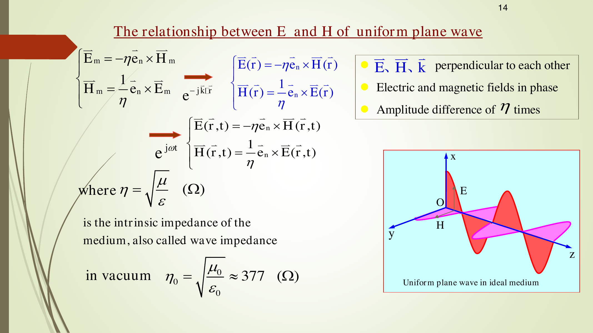
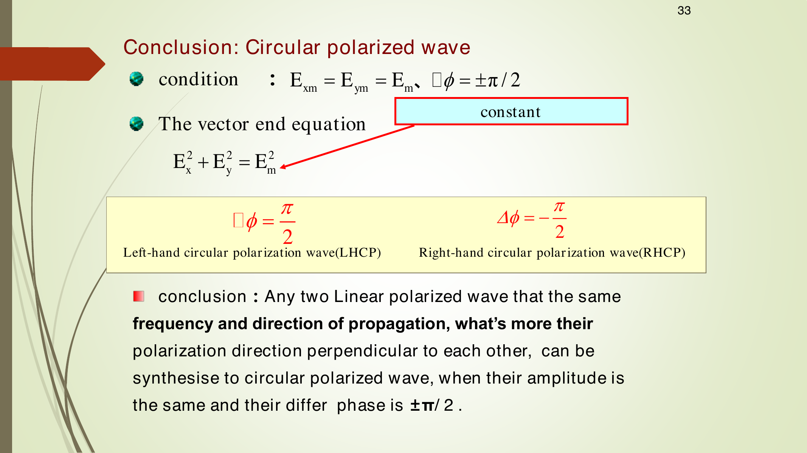
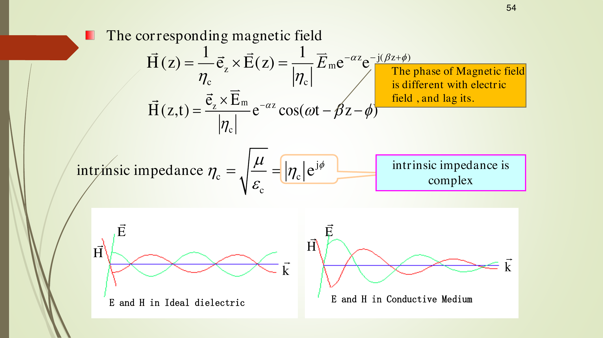
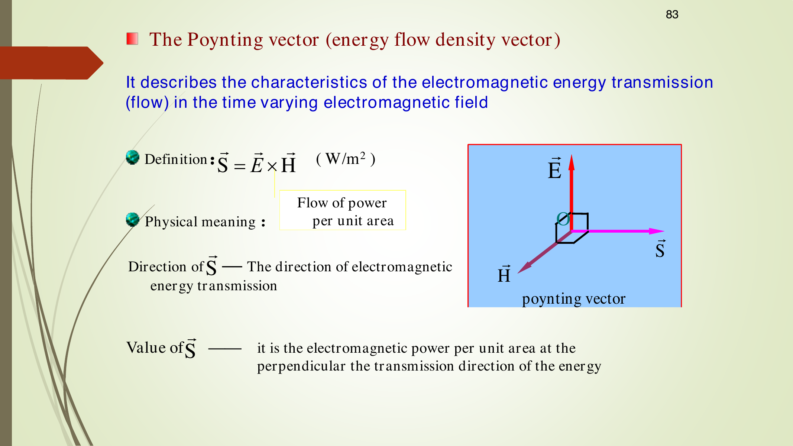
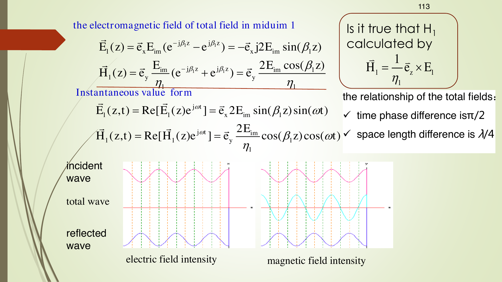
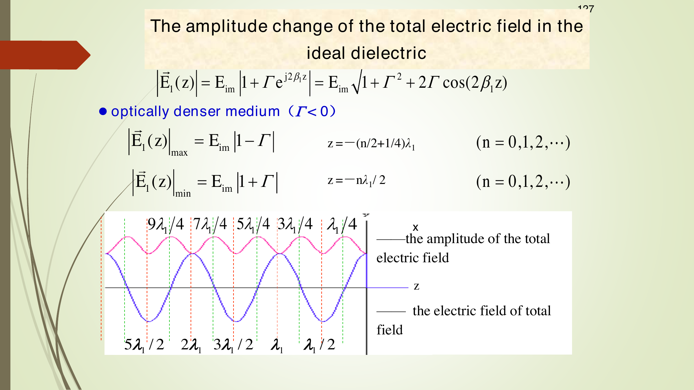

## 1. 本章主线

第7章已经把 Maxwell 方程写成时谐场形式，并得到 Helmholtz 方程。本章继续问：**这些方程的“波”解长什么样？遇到有损介质、导体边界、介质边界时会发生什么？电磁能量怎样传播？**

一句话理解：

- 在无限均匀介质中，均匀平面波的 $\vec E$、$\vec H$、传播方向互相垂直，按右手关系组成 TEM 波。
- 无损介质中波只改变相位，不衰减；有损介质中波一边传播一边按 $e^{-\alpha z}$ 衰减。
- 能量流方向由 Poynting 矢量 $\vec S=\vec E\times\vec H$ 描述。
- 正入射到理想导体时全反射，形成纯驻波；正入射到理想介质界面时部分反射、部分透射，形成行驻波。

考试优先级：均匀平面波表达式、$\vec E/\vec H/\vec k$ 方向、波阻抗 $\eta$、极化判断、有损介质 $\gamma=\alpha+j\beta$、趋肤深度、Poynting 平均功率、正入射反射/透射系数、导体边界驻波、介质边界驻波比。

> 本章默认采用第7章相同的相量时间因子 $e^{j\omega t}$，因此 $\partial/\partial t\to j\omega$。所有瞬时场都由 $\operatorname{Re}[\text{相量}\cdot e^{j\omega t}]$ 得到。

---

## 2. 符号表

| 符号 | 含义 | 单位/说明 |
|---|---|---|
| $\vec E,\vec H$ | 电场强度、磁场强度 | V/m, A/m |
| $\vec E_m,\vec H_m$ | 电场、磁场复振幅矢量 | 含幅值和初相位 |
| $\omega,f,T$ | 角频率、频率、周期 | $\omega=2\pi f$, $T=1/f$ |
| $\vec k=k\vec e_n$ | 波矢量 | 指向传播方向，$k$ 为波数 |
| $k$ | 无损介质相位常数/波数 | $k=\omega\sqrt{\mu\varepsilon}=\beta$ |
| $k_c$ | 有损介质复波数 | 本章记为 $k_c=\beta-j\alpha$ |
| $\gamma$ | 传播常数 | $\gamma=jk_c=\alpha+j\beta$ |
| $\alpha$ | 衰减常数 | Np/m，控制 $e^{-\alpha z}$ |
| $\beta$ | 相位常数 | rad/m，控制 $e^{-j\beta z}$ |
| $\lambda$ | 波长 | $\lambda=2\pi/\beta$ |
| $v_p$ | 相速度 | $v_p=\omega/\beta$ |
| $\eta$ | 无损介质本征阻抗/波阻抗 | $\eta=\sqrt{\mu/\varepsilon}$ |
| $\eta_c$ | 有损介质复本征阻抗 | $\eta_c=\sqrt{\mu/\varepsilon_c}=|\eta_c|e^{j\phi}$ |
| $\varepsilon_c$ | 复介电常数 | $\varepsilon_c=\varepsilon-j\sigma/\omega$ |
| $\delta$ | 趋肤深度 | $\delta=1/\alpha$ |
| $\vec S$ | Poynting 矢量 | $\vec S=\vec E\times\vec H$, W/m$^2$ |
| $\Gamma$ | 电场反射系数 | $\Gamma=E_{rm}/E_{im}$ |
| $\tau$ | 电场透射系数 | $\tau=E_{tm}/E_{im}$ |
| $S$ | 驻波比 SWR | $S=E_{\max}/E_{\min}$，注意不要和 Poynting 矢量混淆 |

说明：后文若界面在 $z=0$，默认介质1在 $z<0$，入射波沿 $+z$ 方向传播，反射波沿 $-z$ 方向传播，透射波沿 $+z$ 方向传播。

---

## 3. 均匀平面波在无损介质中的形式

### 3.1 什么是均匀平面波

**平面波**：任意时刻等相位面是平面。
**均匀**：同一个等相位面上，电磁场幅值不随位置变化。

所以均匀平面波的特点是：

1. 等相位面与等幅面重合或平行。
2. 在同一个波前平面内，$\vec E$ 和 $\vec H$ 的幅值相同；方向在同一均匀平面波中固定。
3. 场量只沿传播方向变化。例如沿 $+z$ 传播时，$\vec E=\vec E(z)$。

沿 $+z$ 传播的电场相量一般写成

$$
\boxed{\vec E(z)=\vec E_m e^{-jkz}}
$$

对应瞬时场为

$$
\boxed{\vec E(z,t)=\operatorname{Re}[\vec E_m e^{-jkz}e^{j\omega t}]}
$$

若某一分量 $E_x$ 的复振幅为 $E_{xm}e^{j\phi_x}$，则

$$
E_x(z,t)=E_{xm}\cos(\omega t-kz+\phi_x)
$$

**为什么 $e^{-jkz}$ 表示沿 $+z$ 传播？**
相位为 $\omega t-kz+\phi$。令相位为常数：

$$
\omega t-kz+\phi=C
$$

两边微分：

$$
\omega dt-kdz=0
$$

所以

$$
\frac{dz}{dt}=\frac{\omega}{k}>0
$$

等相位面随时间向 $+z$ 方向移动，因此是沿 $+z$ 传播。反过来，$e^{+jkz}$ 对应 $\cos(\omega t+kz)$，沿 $-z$ 传播。

### 3.2 任意方向传播

若传播方向单位矢量为 $\vec e_n$，位置矢量为 $\vec r$，波矢量定义为

$$
\boxed{\vec k=k\vec e_n}
$$

均匀平面波可写成

$$
\boxed{\vec E(\vec r)=\vec E_m e^{-j\vec k\cdot\vec r}},\qquad
\boxed{\vec H(\vec r)=\vec H_m e^{-j\vec k\cdot\vec r}}
$$

其中 $\vec k\cdot\vec r$ 是空间相位。若 $\vec k=4\pi\vec e_x+3\pi\vec e_z$，则空间相位就是 $4\pi x+3\pi z$。

### 3.3 TEM 横电磁波关系

无源、均匀、无损介质中 Maxwell 方程推出

$$
\vec k\cdot\vec E_m=0,\qquad \vec k\cdot\vec H_m=0
$$

说明 $\vec E$ 和 $\vec H$ 都垂直于传播方向，所以均匀平面波是 TEM 波。

电场和磁场关系为

$$
\boxed{\vec H=\frac{1}{\eta}\vec e_n\times\vec E}
$$

等价地

$$
\boxed{\vec E=-\eta\vec e_n\times\vec H=\eta\vec H\times\vec e_n}
$$

其中

$$
\boxed{\eta=\sqrt{\frac{\mu}{\varepsilon}}}
$$

是真实数，称为介质本征阻抗或波阻抗。真空中

$$
\boxed{\eta_0=\sqrt{\frac{\mu_0}{\varepsilon_0}}\approx 377\ \Omega=120\pi\ \Omega}
$$

**方向判断模板：**

- 已知传播方向 $\vec e_n$ 和 $\vec E$：用 $\vec H=(1/\eta)\vec e_n\times\vec E$。
- 已知传播方向 $\vec e_n$ 和 $\vec H$：用 $\vec E=\eta\vec H\times\vec e_n$。
- $\vec E\times\vec H$ 指向能量传播方向，也就是 $\vec e_n$。

**常见错误：**把 $\vec H=(1/\eta)\vec E\times\vec e_n$ 写反。叉乘顺序反了方向会反。

### 3.4 无损介质传播参数

| 物理量 | 公式 | 含义 |
|---|---|---|
| 角频率 | $\omega=2\pi f$ | 时间相位每秒变化多少 rad |
| 周期 | $T=2\pi/\omega=1/f$ | 固定位置相位变化 $2\pi$ 的时间 |
| 相位常数 | $k=\beta=\omega\sqrt{\mu\varepsilon}$ | 空间相位每米变化多少 rad |
| 波长 | $\lambda=2\pi/k=1/(f\sqrt{\mu\varepsilon})$ | 相位差 $2\pi$ 的空间距离 |
| 相速度 | $v_p=\omega/k=1/\sqrt{\mu\varepsilon}$ | 等相位面移动速度 |
| 真空波速 | $c=1/\sqrt{\mu_0\varepsilon_0}=3\times10^8\,\text{m/s}$ | 电磁波在真空速度 |

无损理想介质中 $v_p$ 与频率无关；相速度随频率变化称为色散。

---

## 4. 极化：看固定点处电场矢量端点怎么转

极化研究的是：**在空间某一点固定不动，随着时间变化，电场矢量 $\vec E(t)$ 的端点画出什么轨迹。**

设波沿 $+z$ 传播，只考虑横向分量：

$$
\vec E(z,t)=\vec e_xE_{xm}\cos(\omega t-kz+\phi_x)+\vec e_yE_{ym}\cos(\omega t-kz+\phi_y)
$$

固定某一点，例如 $z=0$，判断极化只需要看：

1. 两个分量幅值 $E_{xm},E_{ym}$；
2. 初相位差

$$
\boxed{\Delta\phi=\phi_y-\phi_x}
$$

### 4.1 线极化

条件：

$$
\boxed{\Delta\phi=0\quad\text{或}\quad \Delta\phi=\pm\pi}
$$

此时 $E_x,E_y$ 同相或反相，电场矢量端点沿一条直线来回运动。

若 $\Delta\phi=0$，则

$$
\frac{E_y}{E_x}=\frac{E_{ym}}{E_{xm}}=\tan\alpha
$$

方向角 $\alpha$ 为常数，所以轨迹是直线。

### 4.2 圆极化

条件：

$$
\boxed{E_{xm}=E_{ym},\qquad \Delta\phi=\pm\frac{\pi}{2}}
$$

对于沿 $+z$ 方向传播的波，本章约定：

| 条件 | 极化 |
|---|---|
| $\Delta\phi=+\pi/2$ | 左旋圆极化 LHCP |
| $\Delta\phi=-\pi/2$ | 右旋圆极化 RHCP |

例如若 $\phi_y=\phi_x-\pi/2$，则

$$
E_x=E_m\cos(\omega t+\phi_x),\qquad E_y=E_m\sin(\omega t+\phi_x)
$$

于是

$$
E_x^2+E_y^2=E_m^2
$$

电场端点轨迹为圆。

### 4.3 椭圆极化

一般情况下是椭圆极化：

$$
\boxed{\frac{E_x^2}{E_{xm}^2}+\frac{E_y^2}{E_{ym}^2}-\frac{2E_xE_y}{E_{xm}E_{ym}}\cos\Delta\phi=\sin^2\Delta\phi}
$$

判断口诀：

| 条件 | 极化类型 |
|---|---|
| $\Delta\phi=0,\pm\pi$ | 线极化 |
| $\Delta\phi=\pm\pi/2$ 且 $E_{xm}=E_{ym}$ | 圆极化 |
| 其他一般情况 | 椭圆极化 |

对于沿 $+z$ 传播的波，本章采用约定：$0<\Delta\phi<\pi$ 为左旋，$-\pi<\Delta\phi<0$ 为右旋。

对于沿 $-z$ 传播的波，左右旋判断会反过来：$0<\Delta\phi<\pi$ 为右旋，$-\pi<\Delta\phi<0$ 为左旋。原因是“旋向”必须沿传播方向观察，观察方向反了，顺/逆时针也会反。

### 4.4 极化分解与任意方向判断（考试了解）

还有两个常用结论：

1. 任意均匀平面波的极化都可分解成两个互相垂直的线极化分量。
2. 任意线极化波也可分解成等幅的左旋圆极化与右旋圆极化之和。例如

$$
\vec E=\vec e_xE_me^{-jkz}
=\frac{E_m}{2}(\vec e_x+j\vec e_y)e^{-jkz}+\frac{E_m}{2}(\vec e_x-j\vec e_y)e^{-jkz}
$$

其中两项分别对应一对相反旋向的圆极化分量。

若传播方向不是 $+z$，不要直接套 $x,y$ 相位差口诀。可以用一种更通用的判断模板：把复振幅写成实部向量 $\vec E_{mr}$ 和虚部向量 $\vec E_{mi}$，再看

$$
\vec k\cdot(\vec E_{mi}\times\vec E_{mr})
$$

在本章约定下：大于 0 为右旋，小于 0 为左旋，等于 0 为线极化。若还要判断圆/椭圆，再检查 $|\vec E_{mr}|=|\vec E_{mi}|$ 且 $\vec E_{mr}\cdot\vec E_{mi}=0$；满足则为圆极化，否则为椭圆极化。

**直观理解：** 这个任意方向判据本质上是在“沿着传播方向看电场端点转动”。固定 $+z$ 口诀只是它的特殊情况。

**易错点：**若题目给的是 $\sin$，要先转成 $\cos$。例如

$$
\sin\theta=\cos(\theta-\pi/2)
$$

所以 $E_x=E_m\sin(\omega t-kz)$ 的相位是 $-\pi/2$，不是 $0$。

---

## 5. 有损介质中的均匀平面波

### 5.1 复介电常数、复波数和传播常数

导电介质中

$$
\varepsilon_c=\varepsilon-j\frac{\sigma}{\omega}
$$

其中 $\sigma$ 是电导率。定义复波数

$$
\boxed{k_c=\omega\sqrt{\mu\varepsilon_c}=\beta-j\alpha}
$$

又定义传播常数

$$
\boxed{\gamma=jk_c=\alpha+j\beta}
$$

沿 $+z$ 传播时

$$
\boxed{\vec E(z)=\vec E_m e^{-jk_cz}=\vec E_m e^{-\gamma z}=\vec E_m e^{-\alpha z}e^{-j\beta z}}
$$

瞬时值为

$$
\boxed{\vec E(z,t)=\vec E_m e^{-\alpha z}\cos(\omega t-\beta z+\phi_E)}
$$

其中 $e^{-\alpha z}$ 表示幅值随传播距离指数衰减。

### 5.2 有损介质传播参数

由

$$
k_c^2=(\beta-j\alpha)^2=\beta^2-\alpha^2-j2\alpha\beta
$$

又

$$
k_c^2=\omega^2\mu\left(\varepsilon-j\frac{\sigma}{\omega}\right)=\omega^2\mu\varepsilon-j\omega\mu\sigma
$$

比较实部和虚部：

$$
\boxed{\beta^2-\alpha^2=\omega^2\mu\varepsilon},
\qquad
\boxed{2\alpha\beta=\omega\mu\sigma}
$$

解得

$$
\boxed{\alpha=\omega\sqrt{\frac{\mu\varepsilon}{2}\left[\sqrt{1+\left(\frac{\sigma}{\omega\varepsilon}\right)^2}-1\right]}}
$$

$$
\boxed{\beta=\omega\sqrt{\frac{\mu\varepsilon}{2}\left[\sqrt{1+\left(\frac{\sigma}{\omega\varepsilon}\right)^2}+1\right]}}
$$

波长和相速度：

$$
\boxed{\lambda=\frac{2\pi}{\beta}},\qquad
\boxed{v_p=\frac{\omega}{\beta}}
$$

在有损介质中，$\beta$ 与频率有关，所以相速度通常与频率有关，这就是色散。

### 5.3 有损介质中的复波阻抗

$$
\boxed{\eta_c=\sqrt{\frac{\mu}{\varepsilon_c}}=|\eta_c|e^{j\phi}}
$$

磁场关系仍写为

$$
\boxed{\vec H=\frac{1}{\eta_c}\vec e_n\times\vec E}
$$

但因为 $\eta_c$ 是复数，$\vec E$ 和 $\vec H$ 不再同相。若

$$
\eta_c=|\eta_c|e^{j\phi}
$$

则 $1/\eta_c=(1/|\eta_c|)e^{-j\phi}$，所以磁场相位相对电场滞后 $\phi$。

### 5.4 低损耗介质近似

当

$$
\frac{\sigma}{\omega\varepsilon}\ll1
$$

称为低损耗介质。近似为：

$$
\boxed{\alpha\approx\frac{\sigma}{2}\sqrt{\frac{\mu}{\varepsilon}}}
$$

$$
\boxed{\beta\approx\omega\sqrt{\mu\varepsilon}}
$$

$$
\boxed{\eta_c\approx\sqrt{\frac{\mu}{\varepsilon}}\left(1+j\frac{\sigma}{2\omega\varepsilon}\right)}
$$

重点：低损耗介质的相位常数几乎等于理想介质，主要多了小衰减。

### 5.5 良导体近似、趋肤深度、表面阻抗

当

$$
\frac{\sigma}{\omega\varepsilon}\gg1
$$

称为良导体。近似为：

$$
\boxed{\alpha\approx\beta\approx\sqrt{\pi f\mu\sigma}=\sqrt{\frac{\omega\mu\sigma}{2}}}
$$

$$
\boxed{v_p=\frac{\omega}{\beta}\approx\sqrt{\frac{2\omega}{\mu\sigma}}}
$$

$$
\boxed{\lambda=\frac{2\pi}{\beta}\approx2\sqrt{\frac{\pi}{f\mu\sigma}}}
$$

复波阻抗：

$$
\boxed{\eta_c\approx(1+j)\sqrt{\frac{\pi f\mu}{\sigma}}=\sqrt{\frac{\omega\mu}{\sigma}}e^{j\pi/4}}
$$

所以良导体中磁场相对电场滞后 $45^\circ$。

趋肤深度定义为场强衰减到表面值 $1/e$ 的深度：

$$
E(\delta)=E(0)e^{-1}
$$

因此

$$
\boxed{\delta=\frac{1}{\alpha}\approx\frac{1}{\sqrt{\pi f\mu\sigma}}}
$$

频率越高，$\delta$ 越小，高频电流越集中在导体表层，这就是趋肤效应。

工程上可以这样理解：高频导线常不用一根很粗的实心线，而用多股细导线或表面镀银/镀金来增加有效导电表面、降低交流电阻；高频发射机线圈可做成空心铜管，因为电流主要在表面流动，内部铜对高频导电贡献很小。这些属于趋肤效应应用，考试重点仍是 $\delta=1/\alpha$ 的计算。

表面阻抗：

$$
\boxed{Z_s=R_s+jX_s=(1+j)\frac{1}{\sigma\delta}=(1+j)\sqrt{\frac{\pi f\mu}{\sigma}}}
$$

**常见错误：**

- $\delta$ 不是“完全没有场”的深度，而是衰减到 $1/e\approx36.8\%$ 的深度。
- 良导体中 $\alpha\approx\beta$，但它们含义不同：$\alpha$ 管衰减，$\beta$ 管相位。
- 有损介质中不能直接说 $E$ 和 $H$ 同相。
- 判断损耗大小时统一使用无量纲判据 $\sigma/(\omega\varepsilon)$，不要把分母写成 $\omega\mu$。

### 5.6 色散与群速度（了解）

**色散 dispersion**：相速度 $v_p=\omega/\beta$ 随频率变化。理想无损介质中 $\beta=\omega\sqrt{\mu\varepsilon}$，所以

$$
v_p=\frac{1}{\sqrt{\mu\varepsilon}}
$$

与频率无关，称为无色散。导电介质中 $\beta$ 的公式含 $\sigma/(\omega\varepsilon)$，通常随频率变，所以是色散介质。

**群速度 group velocity**：实际信号常由一小段频带组成，包络或信息传播速度近似为

$$
\boxed{v_g=\frac{d\omega}{d\beta}}
$$

群速度也可写成等价关系

$$
\boxed{v_g=\frac{v_p}{1-\dfrac{\omega}{v_p}\dfrac{dv_p}{d\omega}}}
$$

考试若只问概念，记住：无色散时 $dv_p/d\omega=0$，因此 $v_g=v_p$；有色散时二者一般不同。

### 5.7 有损介质应用例子（了解，不作为主推导）

- 煤矿/地下通信：高频信号在有损介质中按 $e^{-\alpha z}$ 快速衰减，若规定接收阈值为 $E/E_0=10^{-6}$，最大距离由 $e^{-\alpha z}=10^{-6}$ 给出，即 $z=6\ln 10/\alpha$。降低频率通常可减小 $\alpha$，增加传播距离。
- 海水通信：海水 $\sigma\approx4$ S/m，常可视作良导体。频率越高，$\alpha$ 越大，海水中通信距离越短，所以潜艇通信常用很低频率。
- 屏蔽室：铜板厚度常按若干个趋肤深度估算。若要求厚度至少 $5\delta$，且频率范围从 $f_L$ 到 $f_H$，由于 $\delta\propto1/\sqrt f$，应按最低频率 $f_L$ 的最大趋肤深度设计。

---

## 6. Poynting 矢量与电磁功率流

### 6.1 Poynting 定理

电磁场能量密度为

$$
\boxed{w=\frac12\vec E\cdot\vec D+\frac12\vec H\cdot\vec B}
$$

Poynting 矢量定义为

$$
\boxed{\vec S=\vec E\times\vec H\quad(\text{W/m}^2)}
$$

它表示单位面积上电磁能量流过的功率密度，方向就是能量传播方向。

Poynting 定理微分形式：

$$
\boxed{-\nabla\cdot(\vec E\times\vec H)=\frac{\partial}{\partial t}\left(\frac12\vec E\cdot\vec D+\frac12\vec H\cdot\vec B\right)+\vec E\cdot\vec J}
$$

含义：流入某体积的电磁功率 = 体内电磁场储能增加率 + 体内焦耳损耗。

积分形式：

$$
\boxed{-\oint_S\vec S\cdot d\vec S=\frac{d}{dt}\int_V w\,dV+\int_V\vec E\cdot\vec J\,dV}
$$

### 6.2 瞬时量必须用实数场

瞬时 Poynting 矢量：

$$
\boxed{\vec S(t)=\vec E(t)\times\vec H(t)}
$$

这里必须用真实瞬时场，不能直接把相量相乘。

例如

$$
\vec E(t)=\operatorname{Re}[\vec E e^{j\omega t}],\qquad
\vec H(t)=\operatorname{Re}[\vec H e^{j\omega t}]
$$

则

$$
\vec S(t)=\operatorname{Re}[\vec E e^{j\omega t}]\times\operatorname{Re}[\vec H e^{j\omega t}]
$$

### 6.3 平均功率密度相量公式

时谐场最常用的是平均 Poynting 矢量：

$$
\boxed{\vec S_{av}=\frac12\operatorname{Re}(\vec E\times\vec H^*)}
$$

其中 $^*$ 表示复共轭。

平均电场能量密度：

$$
\boxed{w_{E,av}=\frac14\operatorname{Re}(\vec D\cdot\vec E^*)}
$$

若介质无损且 $\varepsilon$ 为实数：

$$
\boxed{w_{E,av}=\frac14\varepsilon |\vec E|^2}
$$

平均磁场能量密度：

$$
\boxed{w_{M,av}=\frac14\operatorname{Re}(\vec B\cdot\vec H^*)}
$$

无损时：

$$
\boxed{w_{M,av}=\frac14\mu |\vec H|^2}
$$

平均焦耳损耗密度：

$$
\boxed{p_{J,av}=\frac12\sigma |\vec E|^2}
$$

对于无损均匀平面波，$E=\eta H$，所以

$$
\boxed{\vec S_{av}=\vec e_n\frac{E_m^2}{2\eta}=\vec e_n\frac{\eta H_m^2}{2}}
$$

对于有损介质若 $\eta_c=|\eta_c|e^{j\phi}$，沿 $+z$ 传播且电场幅值为 $E_m e^{-\alpha z}$：

$$
\boxed{\vec S_{av}=\vec e_z\frac{E_m^2e^{-2\alpha z}}{2|\eta_c|}\cos\phi}
$$

---

## 7. 正入射到理想导体边界

设理想导体平面在 $z=0$，介质1为无损介质，位于 $z<0$。入射波沿 $+z$ 传播，电场沿 $x$ 方向：

$$
\vec E_i=\vec e_xE_{im}e^{-j\beta z},\qquad
\vec H_i=\vec e_y\frac{E_{im}}{\eta_1}e^{-j\beta z}
$$

理想导体等效为 $\eta_2=0$，所以

$$
\boxed{\Gamma=-1},\qquad \boxed{\tau=0}
$$

即电场全反射且反相，没有透射波。

反射波为

$$
\vec E_r=-\vec e_xE_{im}e^{j\beta z}
$$

反射波沿 $-z$ 传播，磁场方向要用传播方向 $-\vec e_z$ 判断：

$$
\vec H_r=\vec e_y\frac{E_{im}}{\eta_1}e^{j\beta z}
$$

总场：

$$
\boxed{\vec E_1=\vec E_i+\vec E_r=-j2\vec e_xE_{im}\sin(\beta z)}
$$

$$
\boxed{\vec H_1=\vec H_i+\vec H_r=\vec e_y\frac{2E_{im}}{\eta_1}\cos(\beta z)}
$$

瞬时场：

$$
\boxed{\vec E_1(z,t)=\vec e_x2E_{im}\sin(\beta z)\sin(\omega t)}
$$

$$
\boxed{\vec H_1(z,t)=\vec e_y\frac{2E_{im}}{\eta_1}\cos(\beta z)\cos(\omega t)}
$$

注意：在导体表面 $z=0$，$\sin0=0$，所以切向电场为零，满足理想导体边界条件。

### 7.1 驻波特点

- 电场和磁场时间相位差 $90^\circ$。
- 电场和磁场空间位置差 $\lambda/4$。
- 平均 Poynting 矢量为 0，说明没有净功率向导体内部传播。

电场波腹位置：

$$
\boxed{z_{\max}=-\frac{(2n+1)\lambda_1}{4},\quad n=0,1,2,\dots}
$$

电场波节位置：

$$
\boxed{z_{\min}=-\frac{n\lambda_1}{2},\quad n=0,1,2,\dots}
$$

这里 $z<0$，所以位置写成负数，表示在导体左侧。

导体表面感应面电流密度：若导体外侧法向取从导体指向介质，即 $\vec e_n=-\vec e_z$，则

$$
\boxed{\vec J_s=\vec e_n\times\vec H_1|_{z=0}}
$$

代入本例：

$$
\vec J_s=(-\vec e_z)\times\left(\vec e_y\frac{2E_{im}}{\eta_1}\right)=\vec e_x\frac{2E_{im}}{\eta_1}
$$

---

## 8. 正入射到理想介质边界

设介质1在 $z<0$，介质2在 $z>0$，两者均无损：

$$
\eta_1=\sqrt{\frac{\mu_1}{\varepsilon_1}},\qquad
\eta_2=\sqrt{\frac{\mu_2}{\varepsilon_2}}
$$

入射波、反射波、透射波为

$$
\vec E_i=\vec e_xE_{im}e^{-j\beta_1z}
$$

$$
\vec E_r=\vec e_xE_{rm}e^{j\beta_1z}
$$

$$
\vec E_t=\vec e_xE_{tm}e^{-j\beta_2z}
$$

边界处切向 $E$、$H$ 连续：

$$
E_{im}+E_{rm}=E_{tm}
$$

$$
\frac{E_{im}}{\eta_1}-\frac{E_{rm}}{\eta_1}=\frac{E_{tm}}{\eta_2}
$$

解得电场反射系数和透射系数：

$$
\boxed{\Gamma=\frac{E_{rm}}{E_{im}}=\frac{\eta_2-\eta_1}{\eta_2+\eta_1}}
$$

$$
\boxed{\tau=\frac{E_{tm}}{E_{im}}=\frac{2\eta_2}{\eta_2+\eta_1}=1+\Gamma}
$$

判断相位：

| 条件 | $\Gamma$ 符号 | 反射电场相位 |
|---|---|---|
| $\eta_2>\eta_1$ | $\Gamma>0$ | 与入射电场同相 |
| $\eta_2<\eta_1$ | $\Gamma<0$ | 与入射电场反相 |
| $\eta_2=\eta_1$ | $\Gamma=0$ | 无反射，阻抗匹配 |

介质1中总电场：

$$
\boxed{\vec E_1(z)=\vec e_xE_{im}\left(e^{-j\beta_1z}+\Gamma e^{j\beta_1z}\right)}
$$

介质2中透射电场：

$$
\boxed{\vec E_2(z)=\vec e_x\tau E_{im}e^{-j\beta_2z}}
$$

### 8.1 介质1中的行驻波

总电场幅值为

$$
\boxed{|E_1(z)|=E_{im}\sqrt{1+\Gamma^2+2\Gamma\cos(2\beta_1z)}}
$$

当 $|\Gamma|<1$ 时，既有行波成分又有驻波成分，称为行驻波。

也可把总场拆成“行波部分 + 驻波部分”：

$$
E_1=E_{im}\left(e^{-j\beta_1z}+\Gamma e^{j\beta_1z}\right)
=E_{im}\left[(1+\Gamma)e^{-j\beta_1z}+\Gamma(e^{j\beta_1z}-e^{-j\beta_1z})\right]
$$

第一项随 $+z$ 传播，第二项与 $\sin(\beta_1z)$ 有关，表现为驻波起伏。这解释了为什么介质边界前不是纯行波，也不是纯驻波。

最大、最小幅值：

$$
\boxed{E_{\max}=E_{im}(1+|\Gamma|)},\qquad
\boxed{E_{\min}=E_{im}(1-|\Gamma|)}
$$

驻波比：

$$
\boxed{S=\frac{E_{\max}}{E_{\min}}=\frac{1+|\Gamma|}{1-|\Gamma|}}
$$

反过来：

$$
\boxed{|\Gamma|=\frac{S-1}{S+1}}
$$

若直接写 $S=(1+\Gamma)/(1-\Gamma)$，必须先确定 $\Gamma$ 为正；通用计算建议先用 $|\Gamma|$。

**最大/最小位置也要看 $\Gamma$ 的正负：**

- 若 $\Gamma>0$（轻薄介质，或 $\eta_2>\eta_1$），界面 $z=0$ 处 $\cos(2\beta_1z)=1$，所以是电场最大点；最大点 $z=-n\lambda_1/2$，最小点 $z=-(2n+1)\lambda_1/4$。
- 若 $\Gamma<0$（光密介质，或 $\eta_2<\eta_1$），界面 $z=0$ 处反射电场反相，所以是电场最小点；最小点 $z=-n\lambda_1/2$，最大点 $z=-(2n+1)\lambda_1/4$。

**弱基础记忆：**先看界面处入射电场和反射电场同相还是反相。同相就界面最大，反相就界面最小。

### 8.2 平均功率守恒

入射平均功率密度：

$$
\vec S_{i,av}=\vec e_z\frac{E_{im}^2}{2\eta_1}
$$

反射平均功率密度：

$$
\vec S_{r,av}=-\vec e_z\frac{|\Gamma|^2E_{im}^2}{2\eta_1}
$$

介质1净平均功率密度：

$$
\boxed{\vec S_{1,av}=\vec e_z\frac{E_{im}^2}{2\eta_1}(1-|\Gamma|^2)}
$$

透射平均功率密度：

$$
\boxed{\vec S_{2,av}=\vec e_z\frac{|\tau|^2E_{im}^2}{2\eta_2}}
$$

无损介质边界无损耗，所以 $\vec S_{1,av}=\vec S_{2,av}$。

### 8.3 反射板与信号叠加（了解）

金属反射板可以用来理解反射和相位叠加：金属板近似理想导体，反射电场相对入射电场反相；但波从天线到反射板再回到天线/目标点还会多走路程，路程差也会带来相位差。

如果金属板放在天线后方约 $\lambda/4$ 处：

1. 天线到金属板再返回，多走路程 $2(\lambda/4)=\lambda/2$，产生 $180^\circ$ 相位差；
2. 理想导体反射再产生 $180^\circ$ 相位反转；
3. 总相位差约 $360^\circ$，可在前向相长叠加。

如果距离约 $\lambda/2$，路程相位差为 $360^\circ$，再加反射 $180^\circ$，反而可能相消。实际环境有多径、天线方向图和损耗，所以“增强三倍”不可靠；理论上单个理想反射板主要是把原本向后辐射的能量重定向，幅值理想上最多约加倍，且位置不当会减弱。

### 8.4 雷达测距与低空盲区（了解）

雷达测距利用往返时间：若电磁波近似以 $c$ 传播，发射到收到回波的时间间隔为 $t$，目标距离

$$
\boxed{s=\frac{ct}{2}}
$$

低空目标可能出现盲区：直接反射波和地面反射后的波到达雷达时可能近似等幅反相，导致回波减弱。斜入射 Fresnel 反射系数可以解释这个现象，但完整推导超出本章正入射主线；如果题目未特别说明，掌握“反射会导致相消/相长”即可。

---

## 9. 关键图像

### 图1：均匀平面波中 $\vec E,\vec H,\vec k$ 的方向关系

图中看什么：

- $\vec E$、$\vec H$、传播方向互相垂直。
- $\vec E\times\vec H$ 指向传播方向。
- 无损介质中 $E$ 与 $H$ 同相，幅值相差 $\eta$ 倍。

### 图2：圆极化的电场端点轨迹

图中看什么：

- 固定空间点观察，电场矢量端点绕圆转动。
- $E_x,E_y$ 幅值相等。
- 相位差 $\pm\pi/2$ 决定左旋或右旋。

### 图3：有损介质中 $E$ 与 $H$ 不同相

图中看什么：

- 有损介质中 $\eta_c$ 是复数。
- $E$ 和 $H$ 的相位不再完全一致。
- 波传播时幅值按 $e^{-\alpha z}$ 衰减。

### 图4：Poynting 矢量表示能量流

图中看什么：

- $\vec S=\vec E\times\vec H$。
- $\vec S$ 的方向是电磁能量传播方向。
- $|\vec S|$ 表示单位面积功率密度。

### 图5：理想导体边界前的驻波

图中看什么：

- 入射波和反射波叠加形成驻波。
- 导体表面电场切向为零，是电场波节。
- 电场波腹和磁场波腹相差 $\lambda/4$。

### 图6：介质边界前的行驻波幅度分布

图中看什么：

- 介质边界不是全反射，所以总场不是纯驻波。
- 总场幅度随 $z$ 呈周期性起伏。
- 起伏强弱由 $|\Gamma|$ 或 SWR 决定。

---

## 10. 典型例题

### 例1：由磁场相量求传播参数和电场相量

**题目：**空气中均匀平面波磁场为

$$
\vec H=(-A\vec e_x+2\vec e_y+4\vec e_z)e^{-j\pi(4x+3z)}\ \text{A/m}
$$

求：$\vec k$、波长 $\lambda$、频率 $f$、常数 $A$、电场相量 $\vec E$。

**解题思路：**先从指数相位读出 $\vec k$；再用横波条件 $\vec k\cdot\vec H_m=0$ 求 $A$；最后用 $\vec E=\eta_0\vec H\times\vec e_n$。

**解答：**

相量标准形式为 $\vec H=\vec H_m e^{-j\vec k\cdot\vec r}$。题中

$$
\vec k\cdot\vec r=4\pi x+3\pi z
$$

所以

$$
\boxed{\vec k=4\pi\vec e_x+3\pi\vec e_z\ \text{rad/m}}
$$

大小：

$$
k=\sqrt{(4\pi)^2+(3\pi)^2}=5\pi\ \text{rad/m}
$$

波长：

$$
\lambda=\frac{2\pi}{k}=\frac{2\pi}{5\pi}=0.4\ \text{m}
$$

空气中近似 $v=c=3\times10^8$ m/s：

$$
f=\frac{c}{\lambda}=\frac{3\times10^8}{0.4}=7.5\times10^8\ \text{Hz}
$$

横波条件：

$$
\vec k\cdot\vec H_m=0
$$

代入：

$$
(4\pi)(-A)+0\cdot2+(3\pi)(4)=0
$$

$$
-4\pi A+12\pi=0
$$

$$
\boxed{A=3}
$$

传播方向单位矢量：

$$
\vec e_n=\frac{\vec k}{k}=\frac45\vec e_x+\frac35\vec e_z
$$

空气中 $\eta_0=120\pi\ \Omega$。电场：

$$
\vec E=\eta_0\vec H\times\vec e_n
$$

先算复振幅叉乘：

$$
(-3\vec e_x+2\vec e_y+4\vec e_z)\times\left(\frac45\vec e_x+\frac35\vec e_z\right)
$$

逐项：

$$
(-3\vec e_x)\times\frac35\vec e_z=\frac95\vec e_y
$$

$$
(2\vec e_y)\times\frac45\vec e_x=-\frac85\vec e_z
$$

$$
(2\vec e_y)\times\frac35\vec e_z=\frac65\vec e_x
$$

$$
(4\vec e_z)\times\frac45\vec e_x=\frac{16}{5}\vec e_y
$$

合并：

$$
\frac65\vec e_x+\left(\frac95+\frac{16}{5}\right)\vec e_y-\frac85\vec e_z
=1.2\vec e_x+5\vec e_y-1.6\vec e_z
$$

所以

$$
\boxed{\vec E=120\pi(1.2\vec e_x+5\vec e_y-1.6\vec e_z)e^{-j\pi(4x+3z)}\ \text{V/m}}
$$

**易错提醒：**不能用 $\vec E=\eta\vec e_n\times\vec H$，那会反号；本题已知 $\vec H$，应使用 $\vec E=\eta\vec H\times\vec e_n$。

### 例2：判断极化方式

**题目：**判断下列沿 $+z$ 传播的波的极化：

$$
\vec E=(\vec e_xE_m-j\vec e_yE_m)e^{-jkz}
$$

**解答：**

写出两个分量的相位：

$$
E_x=E_me^{-jkz}\quad\Rightarrow\quad \phi_x=0
$$

$$
E_y=-jE_me^{-jkz}=E_me^{-j\pi/2}e^{-jkz}\quad\Rightarrow\quad \phi_y=-\frac\pi2
$$

相位差：

$$
\Delta\phi=\phi_y-\phi_x=-\frac\pi2
$$

且两个分量幅值相等：

$$
E_{xm}=E_{ym}=E_m
$$

沿 $+z$ 传播时，$\Delta\phi=-\pi/2$ 对应右旋圆极化。

**答案：**

$$
\boxed{\text{右旋圆极化 RHCP}}
$$

**易错提醒：**$-j=e^{-j\pi/2}$，不是 $+\pi/2$。

### 例3：海水中的衰减与趋肤深度

**题目：**海水参数为 $\varepsilon_r=81,\mu_r=1,\sigma=4\ \text{S/m}$。电磁波角频率 $\omega=10^7\pi\ \text{rad/s}$，沿 $+z$ 传播。判断是否可视为良导体，并求 $\alpha,\beta,\eta_c,\delta$ 的近似值。

**解题思路：**先算 $\sigma/(\omega\varepsilon)$。若远大于 1，用良导体近似。

**解答：**

频率：

$$
f=\frac{\omega}{2\pi}=\frac{10^7\pi}{2\pi}=5\times10^6\ \text{Hz}
$$

介电常数：

$$
\varepsilon=81\varepsilon_0=81\times\frac{1}{36\pi}\times10^{-9}\ \text{F/m}
$$

计算判据：

$$
\frac{\sigma}{\omega\varepsilon}=\frac{4}{10^7\pi\cdot81\cdot\frac{1}{36\pi}\times10^{-9}}
$$

分母：

$$
10^7\pi\cdot81\cdot\frac{1}{36\pi}\times10^{-9}=10^{-2}\cdot\frac{81}{36}=0.0225
$$

所以

$$
\frac{\sigma}{\omega\varepsilon}=\frac{4}{0.0225}\approx177.8\gg1
$$

可视为良导体。

良导体中

$$
\alpha\approx\beta\approx\sqrt{\pi f\mu\sigma}
$$

代入 $\mu=\mu_0=4\pi\times10^{-7}$：

$$
\alpha=\beta\approx\sqrt{\pi(5\times10^6)(4\pi\times10^{-7})(4)}
$$

$$
=\sqrt{8\pi^2}\approx8.89\ \text{m}^{-1}
$$

复波阻抗：

$$
\eta_c\approx(1+j)\sqrt{\frac{\pi f\mu}{\sigma}}
$$

$$
\sqrt{\frac{\pi(5\times10^6)(4\pi\times10^{-7})}{4}}=\sqrt{\frac{2\pi^2}{4}}=\frac{\pi}{\sqrt2}
$$

因此

$$
\eta_c=(1+j)\frac{\pi}{\sqrt2}=\pi e^{j\pi/4}\ \Omega
$$

趋肤深度：

$$
\delta=\frac{1}{\alpha}=\frac{1}{8.89}=0.112\ \text{m}
$$

**答案：**

$$
\boxed{\alpha\approx\beta\approx8.89\ \text{m}^{-1},\quad \eta_c\approx\pi e^{j\pi/4}\ \Omega,\quad \delta\approx0.112\ \text{m}}
$$

**易错提醒：**$\eta_c$ 的相角是 $45^\circ$，所以求磁场瞬时式时要让 $H$ 相位比 $E$ 滞后 $\pi/4$。

### 例4：自由空间中平均功率穿过圆面

**题目：**自由空间中

$$
\vec E=\vec e_x50\cos(\omega t-kz)\ \text{V/m}
$$

求垂直穿过半径 $R=2.5$ m 的圆面的平均功率。

**解答：**

相量为

$$
\vec E=\vec e_x50e^{-jkz}
$$

自由空间 $\eta_0=120\pi\ \Omega$，传播方向为 $+z$，所以

$$
\vec H=\vec e_y\frac{50}{120\pi}e^{-jkz}=\vec e_y\frac{5}{12\pi}e^{-jkz}\ \text{A/m}
$$

平均 Poynting 矢量：

$$
\vec S_{av}=\frac12\operatorname{Re}(\vec E\times\vec H^*)
$$

因为两者同相：

$$
\vec S_{av}=\vec e_z\frac12\cdot50\cdot\frac{5}{12\pi}=\vec e_z\frac{125}{12\pi}\ \text{W/m}^2
$$

圆面积：

$$
A=\pi R^2=\pi(2.5)^2=6.25\pi
$$

平均功率：

$$
P_{av}=S_{av}A=\frac{125}{12\pi}\cdot6.25\pi=65.1\ \text{W}
$$

**答案：**

$$
\boxed{P_{av}=65.1\ \text{W}}
$$

### 例5：理想介质界面的反射与透射

**题目：**空气中均匀平面波正入射到无损介质界面。介质2满足 $\mu_{r2}=1,\varepsilon_{r2}=4$。入射电场幅值 $E_{im}=10$ V/m。求 $\Gamma,\tau$ 和透射电场幅值。

**解答：**

空气中

$$
\eta_1=\eta_0=120\pi\ \Omega
$$

介质2中

$$
\eta_2=\eta_0\sqrt{\frac{\mu_{r2}}{\varepsilon_{r2}}}=120\pi\sqrt{\frac14}=60\pi\ \Omega
$$

反射系数：

$$
\Gamma=\frac{\eta_2-\eta_1}{\eta_2+\eta_1}=\frac{60\pi-120\pi}{60\pi+120\pi}=-\frac13
$$

透射系数：

$$
\tau=\frac{2\eta_2}{\eta_2+\eta_1}=\frac{120\pi}{180\pi}=\frac23
$$

透射电场幅值：

$$
E_{tm}=\tau E_{im}=\frac23\times10=6.67\ \text{V/m}
$$

**答案：**

$$
\boxed{\Gamma=-\frac13,\quad \tau=\frac23,\quad E_{tm}=6.67\ \text{V/m}}
$$

**易错提醒：**$\tau$ 是电场幅值透射系数，不是功率透射比例。功率还要除以对应介质的 $\eta$。

### 例6：由 SWR 和波长比反推介质参数

**题目：**自由空间中的均匀平面波正入射到半无限无损介质。已知自由空间中的驻波比 $S=3$，介质中的波长为自由空间波长的 $1/6$，且电场最小值点在界面上。求介质的 $\mu_r$ 和 $\varepsilon_r$。

**解题思路：**$S$ 只能给出 $|\Gamma|$；“最小值在界面”决定 $\Gamma$ 的符号；波长比给出 $\mu_r\varepsilon_r$；阻抗比给出 $\mu_r/\varepsilon_r$。

**解答：**

由驻波比

$$
S=\frac{1+|\Gamma|}{1-|\Gamma|}=3
$$

得

$$
3(1-|\Gamma|)=1+|\Gamma|
$$

所以

$$
\boxed{|\Gamma|=\frac12}
$$

界面 $z=0$ 处电场最小，说明入射电场和反射电场在界面处反相，因此

$$
\boxed{\Gamma=-\frac12}
$$

又

$$
\Gamma=\frac{\eta_2-\eta_0}{\eta_2+\eta_0}=-\frac12
$$

解得

$$
2(\eta_2-\eta_0)=-(\eta_2+\eta_0)
$$

$$
3\eta_2=\eta_0
$$

$$
\boxed{\eta_2=\frac{\eta_0}{3}}
$$

无损介质中

$$
\eta_2=\eta_0\sqrt{\frac{\mu_r}{\varepsilon_r}}
$$

所以

$$
\sqrt{\frac{\mu_r}{\varepsilon_r}}=\frac13
$$

即

$$
\boxed{\frac{\mu_r}{\varepsilon_r}=\frac19}
$$

波长关系为

$$
\lambda_2=\frac{\lambda_0}{\sqrt{\mu_r\varepsilon_r}}=\frac{\lambda_0}{6}
$$

因此

$$
\boxed{\mu_r\varepsilon_r=36}
$$

联立

$$
\mu_r=\frac{\varepsilon_r}{9},\qquad \mu_r\varepsilon_r=36
$$

得到

$$
\frac{\varepsilon_r^2}{9}=36
$$

$$
\varepsilon_r=18,\qquad \mu_r=2
$$

**答案：**

$$
\boxed{\mu_r=2,\qquad \varepsilon_r=18}
$$

**易错提醒：**只由 $S=3$ 不能判断 $\Gamma=+1/2$ 还是 $-1/2$；必须用“界面是最大还是最小”判断符号。

---

## 11. 常见错误总结

| 易错点 | 错误写法/想法 | 正确理解 | 检查方法 |
|---|---|---|---|
| 传播方向 | $e^{-jkz}$ 以为沿 $-z$ | 在 $e^{j\omega t}$ 约定下，$e^{-jkz}$ 沿 $+z$ | 令 $\omega t-kz=C$ |
| $E/H$ 方向 | $\vec H=(1/\eta)\vec E\times\vec e_n$ | $\vec H=(1/\eta)\vec e_n\times\vec E$ | 看 $\vec E\times\vec H$ 是否指向传播方向 |
| 横波条件 | 忘记 $\vec k\cdot\vec E=0$ | 均匀平面波为 TEM | 用来求未知分量 |
| 极化判断 | 直接看 $j$，不转相位 | $j=e^{j\pi/2}$，$-j=e^{-j\pi/2}$ | 先统一成余弦相位 |
| 有损介质 | 仍认为 $E,H$ 同相 | $\eta_c$ 为复数，$E,H$ 有相位差 | 写 $\eta_c=|\eta_c|e^{j\phi}$ |
| 趋肤深度 | 认为 $\delta$ 后场为 0 | $\delta$ 处幅值为 $1/e$ | $E(\delta)=E_0e^{-1}$ |
| Poynting 瞬时量 | 用相量直接叉乘 | 瞬时量必须用实数场 | 平均量才用 $\frac12\operatorname{Re}(E\times H^*)$ |
| 导体反射 | 忘记 $\Gamma=-1$ | 理想导体切向 $E=0$，电场反相全反射 | 表面总 $E_t$ 应为 0 |
| 反射波磁场 | 磁场也跟电场同样反号 | 反射波传播方向反了，$H$ 方向要重新叉乘 | 分别用传播方向算 $H$ |
| SWR | 不取 $|\Gamma|$ 导致小于 1 | $S=E_{\max}/E_{\min}\ge1$ | 用 $S=(1+|\Gamma|)/(1-|\Gamma|)$ |
| 透射系数 | 把 $\tau$ 当成功率比例 | $\tau$ 是电场幅度系数 | 功率用 $E^2/(2\eta)$ |
| 驻波最大/最小位置 | 只背一套位置 | 介质边界前要看 $\Gamma$ 正负；导体边界 $\Gamma=-1$ | 界面处同相为最大，反相为最小 |
| 群速度 | 误以为总等于相速度 | 只有无色散时 $v_g=v_p$ | 看 $v_p$ 是否随频率变化 |
| 反射板增强信号 | 以为一定增强三倍 | 相位合适才增强，位置不当会减弱；理想单反射板幅值最多约加倍 | 算路程相位差 + 反射相位差 |

---

## 12. 自测题

### 题目

1. 在 $e^{j\omega t}$ 约定下，$e^{-jkz}$ 和 $e^{+jkz}$ 分别表示沿哪个方向传播？说明理由。
2. 写出无损介质中均匀平面波 $\vec E,\vec H,\vec e_n$ 的关系和波阻抗。
3. 已知波沿 $+z$ 传播，$\vec E=\vec e_xE_0e^{-jkz}$，求 $\vec H$。
4. 均匀平面波为什么是 TEM 波？用点乘关系说明。
5. 频率 $f=100$ MHz、介质 $\varepsilon_r=4,\mu_r=1$，求 $v_p,\lambda,\eta$。
6. 判断 $\vec E=(\vec e_xE_m+j\vec e_yE_m)e^{-jkz}$ 沿 $+z$ 传播时的极化。
7. 写出有损介质中 $k_c,\gamma,\alpha,\beta$ 的关系，并说明 $e^{-\alpha z}$ 的意义。
8. 什么条件下可用良导体近似？写出 $\alpha,\beta,\delta,\eta_c$。
9. 铜在 $f=10$ kHz 时若 $\sigma=5.8\times10^7$ S/m、$\mu=\mu_0$，估算趋肤深度。
10. 写出 Poynting 定理微分形式，并解释三项物理意义。
11. 已知相量 $\vec E=\vec e_x20e^{-jkz}$ V/m 在自由空间传播，求平均 Poynting 矢量。
12. 正入射到理想导体时，电场反射系数是多少？为什么表面切向电场为零？
13. 理想导体边界前总场 $\vec E_1=-j2\vec e_xE_{im}\sin\beta z$，求瞬时电场。
14. 正入射到无损介质界面，写出 $\Gamma,\tau$。若 $\eta_2=3\eta_1$，求 $\Gamma,\tau$。
15. 驻波比 $S=3$，求 $|\Gamma|$。若入射幅值为 4 V/m，求 $E_{\max},E_{\min}$。
16. 为什么介质界面前是行驻波，而理想导体前是纯驻波？
17. 任意方向传播时，若 $\vec k\cdot(\vec E_{mi}\times\vec E_{mr})>0$，按本章约定是什么旋向？若 $|\vec E_{mr}|=|\vec E_{mi}|$ 且 $\vec E_{mr}\cdot\vec E_{mi}=0$，极化类型是什么？
18. 无色散介质中群速度和相速度有什么关系？为什么？
19. 用反射板增强 WiFi 时，为什么距离约 $\lambda/4$ 可能增强，而约 $\lambda/2$ 可能减弱？
20. 自由空间正入射到无损介质，已知 $S=3$ 且界面为电场最小点，求 $\Gamma$。

### 自测题答案

1. $e^{-jkz}$ 表示沿 $+z$ 传播。瞬时相位为 $\omega t-kz$，令 $\omega t-kz=C$，得 $dz/dt=\omega/k>0$。$e^{+jkz}$ 的相位为 $\omega t+kz$，令其为常数得 $dz/dt=-\omega/k<0$，所以沿 $-z$ 传播。

2. 无损介质中
   $$
   \vec H=\frac1\eta\vec e_n\times\vec E,
   \qquad
   \vec E=\eta\vec H\times\vec e_n
   $$
   其中
   $$
   \eta=\sqrt{\frac{\mu}{\varepsilon}}.
   $$
   $\vec E,\vec H,\vec e_n$ 互相垂直，且 $\vec E\times\vec H$ 指向传播方向。

3. 传播方向 $\vec e_n=\vec e_z$，所以
   $$
   \vec H=\frac1\eta\vec e_z\times(\vec e_xE_0e^{-jkz})
   $$
   用 $\vec e_z\times\vec e_x=\vec e_y$：
   $$
   \boxed{\vec H=\vec e_y\frac{E_0}{\eta}e^{-jkz}}.
   $$

4. 无源均匀介质中 Maxwell 方程给出
   $$
   \vec k\cdot\vec E_m=0,
   \qquad
   \vec k\cdot\vec H_m=0.
   $$
   点乘为零表示垂直，所以 $\vec E$ 和 $\vec H$ 都垂直于传播方向 $\vec k$，因此是横电磁波 TEM。

5. 介质参数：$\varepsilon=4\varepsilon_0,\mu=\mu_0$。
   $$
   v_p=\frac{c}{\sqrt{\mu_r\varepsilon_r}}=\frac{3\times10^8}{\sqrt4}=1.5\times10^8\ \text{m/s}
   $$
   $$
   \lambda=\frac{v_p}{f}=\frac{1.5\times10^8}{100\times10^6}=1.5\ \text{m}
   $$
   $$
   \eta=\eta_0\sqrt{\frac{\mu_r}{\varepsilon_r}}=120\pi\sqrt{\frac14}=60\pi\ \Omega.
   $$

6. $j=e^{j\pi/2}$，所以 $\phi_x=0,\phi_y=+\pi/2$。两分量幅值相等，且
   $$
   \Delta\phi=\phi_y-\phi_x=+\frac\pi2.
   $$
   沿 $+z$ 传播时，本章约定 $+\pi/2$ 为左旋圆极化，所以答案为
   $$
   \boxed{\text{LHCP}}.
   $$

7. 本章采用
   $$
   k_c=\beta-j\alpha,
   \qquad
   \gamma=jk_c=\alpha+j\beta.
   $$
   沿 $+z$ 传播：
   $$
   \vec E(z)=\vec E_m e^{-jk_cz}=\vec E_m e^{-\alpha z}e^{-j\beta z}.
   $$
   $e^{-\alpha z}$ 表示幅值随距离指数衰减；$e^{-j\beta z}$ 表示相位随距离变化。

8. 良导体条件：
   $$
   \frac{\sigma}{\omega\varepsilon}\gg1.
   $$
   近似公式：
   $$
   \alpha\approx\beta\approx\sqrt{\pi f\mu\sigma},
   $$
   $$
   \delta=\frac1\alpha\approx\frac{1}{\sqrt{\pi f\mu\sigma}},
   $$
   $$
   \eta_c\approx(1+j)\sqrt{\frac{\pi f\mu}{\sigma}}=\sqrt{\frac{\omega\mu}{\sigma}}e^{j\pi/4}.
   $$

9. 用良导体趋肤深度：
   $$
   \delta=\frac{1}{\sqrt{\pi f\mu\sigma}}
   $$
   代入：
   $$
   \delta=\frac{1}{\sqrt{\pi(10^4)(4\pi\times10^{-7})(5.8\times10^7)}}
   $$
   中间乘积：
   $$
   \pi\cdot10^4\cdot4\pi\times10^{-7}\cdot5.8\times10^7\approx2.29\times10^6
   $$
   $$
   \delta\approx\frac{1}{1515}=6.6\times10^{-4}\ \text{m}=0.66\ \text{mm}.
   $$

10. Poynting 定理微分形式：
   $$
   -\nabla\cdot(\vec E\times\vec H)=\frac{\partial}{\partial t}\left(\frac12\vec E\cdot\vec D+\frac12\vec H\cdot\vec B\right)+\vec E\cdot\vec J.
   $$
   左边表示单位体积净流入的电磁功率；第一项表示电磁场储能增加率；第二项表示焦耳损耗功率密度。

11. 自由空间 $\eta_0=120\pi\ \Omega$，沿 $+z$ 传播：
   $$
   \vec H=\vec e_y\frac{20}{120\pi}e^{-jkz}=\vec e_y\frac{1}{6\pi}e^{-jkz}.
   $$
   平均 Poynting 矢量：
   $$
   \vec S_{av}=\frac12\operatorname{Re}(\vec E\times\vec H^*)
   =\vec e_z\frac12\cdot20\cdot\frac{1}{6\pi}
   $$
   $$
   \boxed{\vec S_{av}=\vec e_z\frac{5}{3\pi}\ \text{W/m}^2\approx0.531\vec e_z\ \text{W/m}^2}.
   $$

12. 理想导体中 $\eta_2=0$，所以
   $$
   \Gamma=\frac{\eta_2-\eta_1}{\eta_2+\eta_1}=-1.
   $$
   反射电场与入射电场等幅反相，表面 $z=0$ 处
   $$
   E_i(0)+E_r(0)=E_{im}-E_{im}=0,
   $$
   因此满足理想导体表面切向电场为零。

13. 相量总场为
   $$
   \vec E_1=-j2\vec e_xE_{im}\sin\beta z.
   $$
   瞬时场：
   $$
   \vec E_1(z,t)=\operatorname{Re}[-j2\vec e_xE_{im}\sin\beta z\,e^{j\omega t}].
   $$
   因为 $\operatorname{Re}[-je^{j\omega t}]=\sin\omega t$，所以
   $$
   \boxed{\vec E_1(z,t)=2\vec e_xE_{im}\sin\beta z\sin\omega t}.
   $$

14. 正入射无损介质界面：
   $$
   \Gamma=\frac{\eta_2-\eta_1}{\eta_2+\eta_1},
   \qquad
   \tau=\frac{2\eta_2}{\eta_2+\eta_1}.
   $$
   若 $\eta_2=3\eta_1$：
   $$
   \Gamma=\frac{3\eta_1-\eta_1}{3\eta_1+\eta_1}=\frac12,
   $$
   $$
   \tau=\frac{2(3\eta_1)}{3\eta_1+\eta_1}=\frac32.
   $$
   $\tau>1$ 不代表能量增加，因为透射介质阻抗也变了。

15. 驻波比
   $$
   S=\frac{1+|\Gamma|}{1-|\Gamma|}
   $$
   所以
   $$
   |\Gamma|=\frac{S-1}{S+1}=\frac{3-1}{3+1}=\frac12.
   $$
   若 $E_{im}=4$ V/m：
   $$
   E_{\max}=E_{im}(1+|\Gamma|)=4(1+0.5)=6\ \text{V/m},
   $$
   $$
   E_{\min}=E_{im}(1-|\Gamma|)=4(1-0.5)=2\ \text{V/m}.
   $$

16. 理想导体边界 $\Gamma=-1$，反射波与入射波等幅，净平均功率为零，叠加后形成纯驻波。普通理想介质界面通常 $|\Gamma|<1$，只有部分能量反射，另一部分透射；入射波和较小的反射波叠加后既有行波成分又有驻波起伏，所以是行驻波。

17. 按本章约定，若
    $$
    \vec k\cdot(\vec E_{mi}\times\vec E_{mr})>0
    $$
    则为右旋。若同时满足
    $$
    |\vec E_{mr}|=|\vec E_{mi}|,
    \qquad
    \vec E_{mr}\cdot\vec E_{mi}=0,
    $$
    则两个正交分量等幅且相差 $90^\circ$，所以是圆极化；结合前一判断，为右旋圆极化。

18. 无色散介质中 $v_p$ 不随频率变化，所以
    $$
    \frac{dv_p}{d\omega}=0.
    $$
    代入群速度关系
    $$
    v_g=\frac{v_p}{1-\dfrac{\omega}{v_p}\dfrac{dv_p}{d\omega}}
    $$
    得
    $$
    \boxed{v_g=v_p}.
    $$
    理想无损介质中 $v_p=1/\sqrt{\mu\varepsilon}$，与频率无关，因此无色散。

19. 金属板近似理想导体，反射电场相对入射电场多 $180^\circ$ 相位反转。若反射板距天线约 $\lambda/4$，往返多走 $2\times\lambda/4=\lambda/2$，路程又带来 $180^\circ$ 相位差；总相位差约 $360^\circ$，与前向波相长叠加。若距离约 $\lambda/2$，往返路程差为 $\lambda$，路程相位差为 $360^\circ$，再加反射相位 $180^\circ$，总相位差为 $180^\circ$，可能相消减弱。

20. 由
    $$
    S=\frac{1+|\Gamma|}{1-|\Gamma|}=3
    $$
    得 $|\Gamma|=1/2$。界面为电场最小点，说明界面处反射电场与入射电场反相，所以 $\Gamma<0$。因此
    $$
    \boxed{\Gamma=-\frac12}.
    $$

---

## 13. 本章学习路线

1. 先掌握相量约定：$e^{j\omega t}$、$e^{-jkz}$ 沿 $+z$、$e^{+jkz}$ 沿 $-z$。
2. 背熟均匀平面波三件套：$\vec E\perp\vec H\perp\vec k$，$\vec H=(1/\eta)\vec e_n\times\vec E$，$\eta=\sqrt{\mu/\varepsilon}$。
3. 练极化判断：先把所有分量改成余弦，再比较 $E_{xm},E_{ym},\Delta\phi$；任意方向题再用 $\vec k\cdot(\vec E_{mi}\times\vec E_{mr})$ 判旋向。
4. 学有损介质：区分 $\alpha$ 和 $\beta$，会用低损耗/良导体近似，知道趋肤深度和色散/群速度的基本概念。
5. 学 Poynting：瞬时用实数场，平均用 $\frac12\operatorname{Re}(\vec E\times\vec H^*)$。
6. 练理想导体正入射：$\Gamma=-1$、驻波、表面电流。
7. 练理想介质正入射：$\Gamma,\tau$、总场、SWR、最大/最小位置、功率守恒。

如果时间紧张，优先掌握：

- $\vec H=(1/\eta)\vec e_n\times\vec E$ 和方向判断；
- $\lambda=2\pi/\beta$，$v_p=\omega/\beta$，$\eta=\sqrt{\mu/\varepsilon}$；
- 极化条件：线、圆、椭圆；任意方向题会用 $\vec E_{mr},\vec E_{mi}$ 判旋向；
- 有损介质 $\gamma=\alpha+j\beta$，良导体 $\alpha\approx\beta\approx\sqrt{\pi f\mu\sigma}$，$\delta=1/\alpha$；
- $\vec S_{av}=\frac12\operatorname{Re}(\vec E\times\vec H^*)$；
- 正入射 $\Gamma=(\eta_2-\eta_1)/(\eta_2+\eta_1)$，$\tau=2\eta_2/(\eta_2+\eta_1)$；
- 理想导体 $\Gamma=-1$，表面切向 $E=0$。

---

## 14. 和前后章节的关系

- 第7章给出时谐 Maxwell 方程、Helmholtz 方程和相量法；第8章就是把这些方程具体解成平面波，并研究传播、能量和边界反射。
- 第7章的边界条件在第8章正入射问题中直接使用：切向 $E$ 连续、切向 $H$ 连续；理想导体表面切向 $E=0$。
- 第6章的磁场方向、叉乘、边界法向经验在本章判断 $\vec E,\vec H,\vec k$ 方向和表面电流时继续使用。
- 后续若进入导波、传输线或天线，都会反复用到本章的波阻抗、反射系数、驻波比、Poynting 功率流和极化概念。

