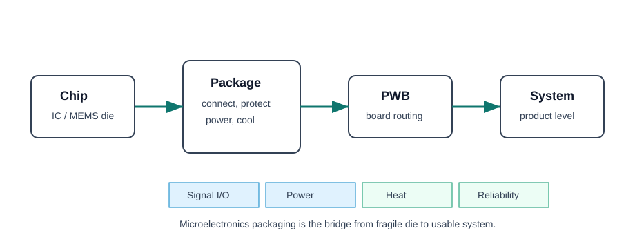

## 考试要会什么

本章对应 Lecture 1，是整门课的语言基础。考试常问：

- What is microelectronics / microsystems packaging?
- Why is packaging important?
- Trace the development of packaging technology waves.
- Explain Moore's Law for packaging / interconnection.
- What are the main functions of a package?

## 一句话记忆

**Packaging 是 chip 和 system 之间的桥：把 fragile die 连接、供电、散热、保护并集成到产品里。**

## 核心原理

Microelectronics packaging 的对象不是单一“外壳”，而是一个从 die 到 system 的层级：

| 层级 | 作用 | 典型问题 |
|---|---|---|
| Chip / die | 产生功能 | fragile、I/O pad、heat generation |
| Package | 连接芯片和外部世界 | interconnect、thermal path、protection |
| PWB / substrate | 板级互连 | routing、power distribution、CTE mismatch |
| System | 最终产品 | cost、reliability、size、performance |

> **Packaging 的定义可写成：** Packaging is the technology that interconnects, powers, cools, protects and mechanically supports ICs or microsystem devices so that they can operate reliably at board and system level.

## 必背功能

| 功能 | 解释 | 考试关键词 |
|---|---|---|
| Signal distribution | 把 chip signal 连接到其他 chip / board / system | I/O, interconnect, delay |
| Power distribution | 提供 supply 和 ground path | voltage drop, inductive noise |
| Heat dissipation | 把 chip heat 传到 ambient | thermal path, heat sink, TIM |
| Mechanical support | 支撑 fragile die 和 interconnect | substrate, package body |
| Environmental protection | 防 moisture、contamination、shock | encapsulation, hermetic sealing |
| Reliability and cost | 在性能、寿命、成本间折中 | yield, MTBF, manufacturability |

## Technology Waves

| Wave | 代表技术 | 优势 | 主要 drawback |
|---|---|---|---|
| Through-hole | DIP, pin packages | simple, robust, easy assembly | large size, low I/O density, poor high-frequency performance |
| SMT | QFP, SOP, LCC | smaller footprint, higher board density | peripheral leads limit I/O pitch |
| Area-array | BGA, CSP, flip-chip | higher I/O, shorter path, better performance | warpage, solder fatigue, inspection difficult |
| Advanced 3D / heterogeneous | SiP, FOWLP, interposer, TSV, chiplets | high integration, small form, mix technologies | thermal, reliability, yield, cost challenge |

## Moore's Law for Packaging

IC scaling pushes more transistors into smaller die. Packaging must follow by increasing I/O density, reducing interconnect length, improving heat removal and lowering cost. 这就是 packaging version of Moore's Law：不是简单让封装变小，而是让 **interconnection and integration density** 跟上芯片性能。

> 高频答法：As ICs scale, package interconnects become the performance bottleneck. Packaging must provide more I/O, shorter signal paths, better power distribution and better thermal management at lower cost.

## 题型模板

### 题型：Explain why packaging is multidisciplinary

1. Electrical：signal and power distribution。
2. Mechanical：support, shock/vibration resistance, assembly stress。
3. Thermal：remove heat and control junction/device temperature。
4. Materials：select compatible dielectric, metal, solder, underfill, substrate with suitable CTE and conductivity。
5. Reliability：avoid delamination, corrosion, fatigue and moisture failure。

## 易错点

- 不要把 package 只写成 “protective case”。保护只是功能之一。
- Trace development 题一定要写每一代的 drawback，否则像流水账。
- Moore's Law for packaging 不是背 IC transistor count，而是讲 I/O、interconnect、integration、cost 的压力。

## 本章概览

Lecture 1 的作用是建立“封装到底是什么”的框架。考试不会只问漂亮定义，而是要求你能解释：为什么随着芯片集成度提高，封装从一个附属工艺变成系统性能、成本和可靠性的核心瓶颈。

### 零基础先览

- **Bare die 不能直接变成产品**：它太脆弱、I/O pad 太小、无法直接承受环境和机械冲击。
- **Package 是 bridge**：把 die 的微小电连接转成 board/system 可用的连接。
- **Package 是 compromise**：电性能、散热、机械强度、材料兼容性、成本、制造良率同时被考虑。
- **Technology waves 的本质**：每一代封装都在解决上一代的 I/O density、size、speed、thermal 或 cost 限制。

## Package functions 深入理解

### Signal distribution

Signal distribution 不是简单“接线”。当 frequency 增加、edge rate 变快时，package interconnect 的长度、形状和材料都会影响 signal delay、reflection 和 crosstalk。因此 package electrical design 会成为 high-speed system 的性能限制。

### Power distribution

Power path 要把 supply current 稳定送到 chip。随着 current density 上升，power distribution network 的 resistance 和 inductance 会导致 voltage drop、ground bounce 和 switching noise。

### Heat dissipation

芯片工作时的 electrical power 最终变成 heat。Package 必须提供从 die → attach/TIM → substrate/heat spreader/heat sink → ambient 的热路径。热路径不好会让 device temperature 上升，进而影响 performance 和 lifetime。

### Mechanical and environmental protection

Package 保护 die 免受 moisture、contamination、shock、vibration 和 handling damage。但对 MEMS 这类器件，封装还要允许它和环境交互，所以保护和访问环境之间存在矛盾。

## Technology Waves 标准答案

### Wave 1：Through-hole / DIP

代表：DIP、pin-through-hole package。优点是结构简单、装配直观、可靠性较好。缺点是 package size 大、board area 大、I/O density 低，高频下 lead parasitics 明显。

### Wave 2：SMT

代表：SOP、QFP、LCC。优点是元件贴在 PCB 表面，不需要 through holes，减小体积并提高 board density。缺点是 peripheral leads 限制了 I/O pitch，lead deformation 和 solder joint reliability 仍是问题。

### Wave 3：Area-array / BGA / CSP / Flip-chip

代表：BGA、CSP、flip-chip。优点是把 I/O 从边缘扩展到底部面积阵列，提高 I/O density，缩短 interconnect，改善 electrical performance。缺点是 inspection 难、warpage 和 solder fatigue 重要，rework 更复杂。

### Wave 4：2.5D / 3D / SiP / FOWLP / Chiplets

代表：interposer、TSV、3D stacking、SiP、fan-out WLP。优点是 heterogeneous integration、更短互连、更高 bandwidth、更小 form factor。缺点是 thermal management、yield、cost、CTE/stress 和 process complexity。

## 完整答题模板：Trace technology waves

> Microelectronics packaging evolved through several technology waves to meet increasing requirements for miniaturization, I/O density, speed and reliability. The first wave was through-hole packaging such as DIP, which was simple and robust but large and low in I/O density. The second wave was SMT, which mounted components directly on the PCB surface and reduced size, but peripheral leads still limited I/O. The third wave introduced area-array packages such as BGA, CSP and flip-chip, improving I/O density and electrical performance through shorter interconnects, but creating solder reliability and inspection challenges. The current wave moves toward SiP, WLP, 2.5D/3D integration and chiplets, enabling heterogeneous integration but bringing thermal, yield and cost challenges.

## Future development 答题点

| Trend | Why it appears | Challenge |
|---|---|---|
| 3D integration / TSV | shorter interconnect, higher density | heat removal, stress, yield |
| Chiplets / SiP | mix different process nodes and functions | package-level design complexity |
| Fan-out WLP | more I/O and small form factor | warpage, fine-pitch routing |
| Advanced thermal materials | high power density | material cost and compatibility |
| Flexible / biomedical packaging | wearable and implantable devices | reliability, biocompatibility |

## Self-check

- [ ] 我是否写出了封装的 5-6 个功能，而不只是 protection？
- [ ] Technology waves 是否每一代都有 feature + drawback？
- [ ] Future trends 是否写了 challenge，而不是只写技术名？
- [ ] 是否说明 packaging 和 system performance / reliability / cost 的关系？

## Reference

- Lecture 1: function and classification of packages, development trends, assembly intro。
- Practice questions: technology waves, future development, multidisciplinary packaging。

## 来源说明

Slides-backed: Lecture 1。Slides + Exam-backed: practice questions 中 technology waves、multidisciplinary packaging 和 future trends。
