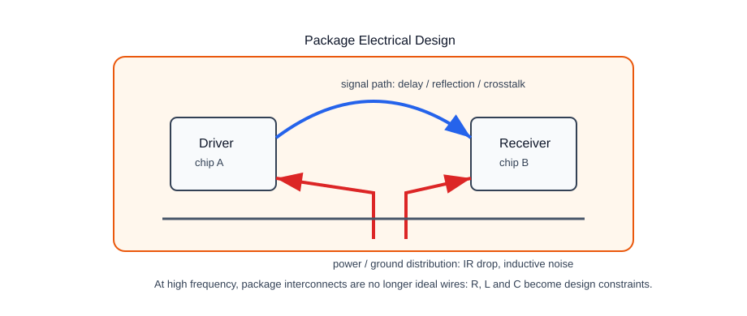
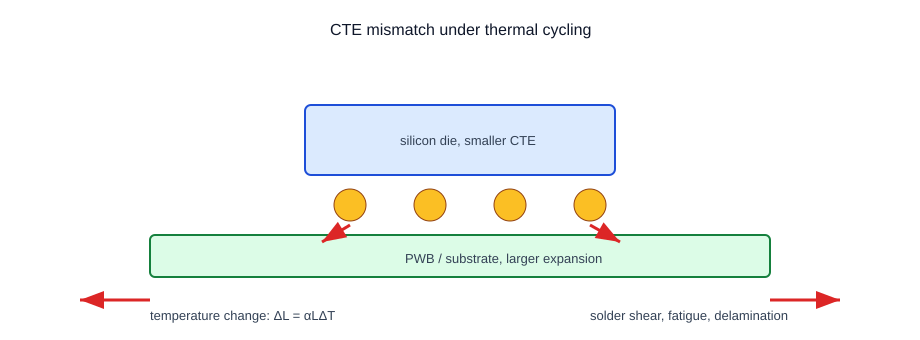
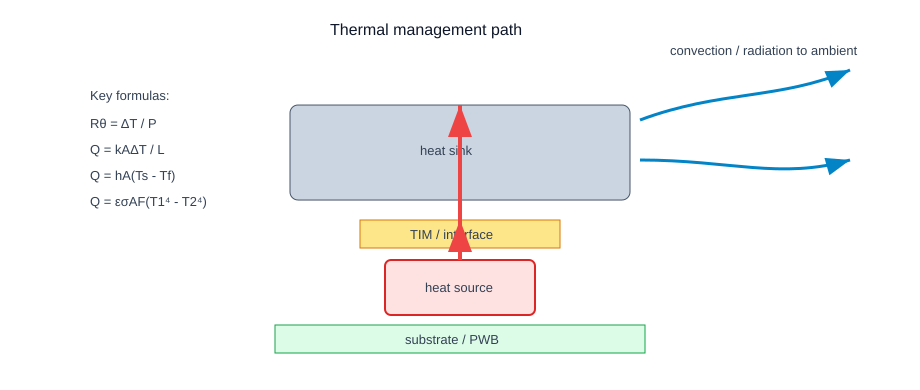
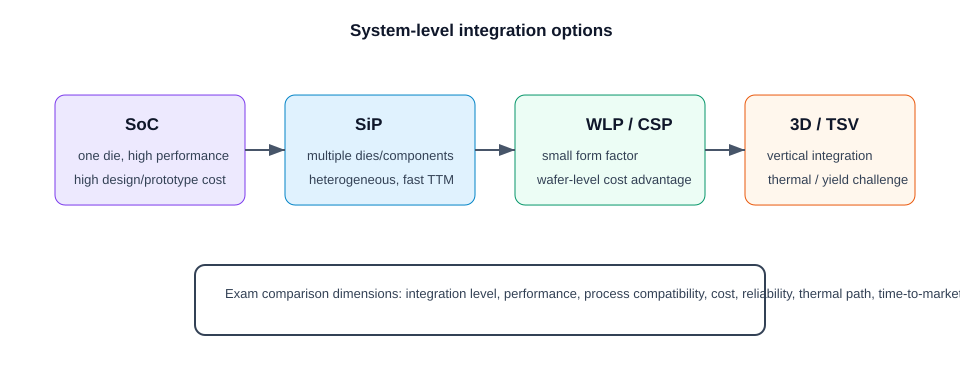
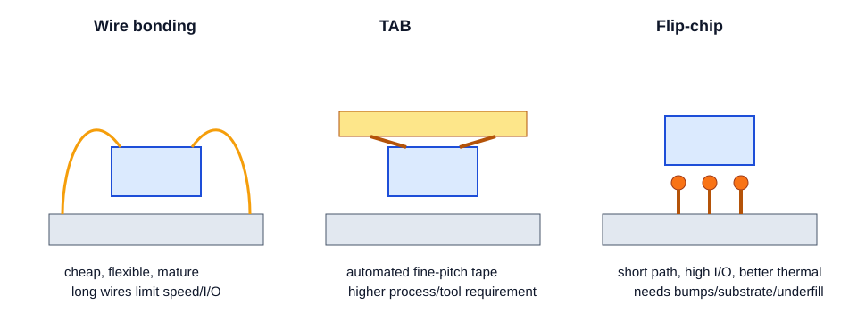

# Microelectronics Packaging 期末高分复习笔记

> 基于 `封装/slides` 主线课件、practice/past exam/考前资料整理。中文解释为主，关键英文术语保留；目标是按 PE/EPMF 的考试复习逻辑形成可直接背诵和套题的总稿。

---

## 00 考试地图与复习策略

### 考试要会什么

这门课的考试更像 **概念解释 + 比较题 + 机制题 + 少量热管理计算**，不是大量推导。最稳定的高频模块是：

1. **Packaging fundamentals**：封装的功能、分类、technology waves、Moore's Law for packaging。
2. **Electrical package design**：signal path、power/ground path、parasitic R/L/C、frequency challenge、DFR/DFT。
3. **Materials and reliability**：underfill、mold、solder、TIM、substrate、CTE mismatch、moisture、delamination、solder fatigue。
4. **Assembly and interconnect**：wire bonding、TAB、flip-chip、BGA、CSP、WLP 的比较。
5. **Microelectronics / microsystems**：SoC vs SiP、MEMS packaging、系统级封装的作用。
6. **Si processing impact**：low-k ILD、die thinning、TSV、interposer、3D integration。
7. **Thermal management**：thermal resistance、conduction、convection、radiation、cooling methods。

### 一句话记忆

**封装不是“外壳”，而是把裸芯片变成可靠系统的电、热、机械、材料和制造折中。**

### 做题总顺序

1. **先给定义**：先写一句清晰定义，避免一上来堆例子。
2. **再写作用**：从 electrical / thermal / mechanical / environmental / reliability / cost 中选 2-4 个维度。
3. **解释机制**：为什么会改善或失效，例如 CTE mismatch 如何导致 solder fatigue。
4. **补例子**：wire bonding、flip-chip、BGA、WLP、SiP、MEMS 等。
5. **写 limitation**：比较题一定要写缺点或 challenge。

### 高频题型地图

| 题型 | 典型问法 | 快速答题框架 |
|---|---|---|
| Explain | Explain CTE / DFT / WLP / MEMS packaging | definition → importance → mechanism → example |
| Discuss | Discuss future developments in packaging | trend → benefit → challenge → material/thermal issue |
| Compare | Compare SoC and SiP / CSP and WLP / wire bonding and flip-chip | 先列维度，再逐项比较 |
| Trace development | Trace packaging technology waves | 每代：代表技术 + 优势 + drawback |
| Explain with figures | Explain package hierarchy / heat path / CTE mismatch | 画简图，标注 signal/power/heat/stress |
| Calculation | board heat dissipation / convection / radiation | 写公式、单位、代入、结论 |

### 必背优先级

#### P0：一定会用到

- package 六个核心功能：signal distribution、power distribution、heat dissipation、mechanical support/protection、environmental isolation、reliability/cost control。
- technology waves：through-hole、SMT、BGA/CSP/flip-chip、2.5D/3D/SiP/FOWLP。
- wire bonding / TAB / flip-chip 的优缺点。
- CTE mismatch 的失效链：thermal cycling → differential expansion → solder shear → fatigue/delamination/crack。
- thermal formulas：$R_\theta=\Delta T/P$、$Q=kA\Delta T/L$、$Q=hA(T_s-T_f)$。
- SoC vs SiP：performance/cost/flexibility/time-to-market。

#### P1：高分区分点

- low-k ILD 为什么降低 capacitance 但增加 packaging fragility。
- die thinning 为什么降低高度和热阻但增加 handling/stress challenge。
- interposer / TSV / 3D integration 的作用和挑战。
- MEMS packaging 为什么比普通 IC 更复杂。
- WLP 为什么成本/时间优势明显，同时 I/O pitch 和可靠性受限。

### 零基础先览

如果完全没学过这门课，不要先背缩写。先抓住一个主线：**芯片本身只提供功能，封装让这个功能能够被系统使用。** 所有章节都围绕同一个矛盾展开：芯片越来越小、越来越快、越来越热、I/O 越来越多，但产品还要求更便宜、更可靠、更容易制造。

把封装问题拆成五个维度最稳：

| 维度 | 这门课怎么考 | 典型关键词 |
|---|---|---|
| Electrical | 信号和电源怎么走，为什么高频难 | signal path, power distribution, parasitics, crosstalk |
| Thermal | 热怎么从 die 传到 ambient | thermal resistance, conduction, convection, radiation |
| Mechanical | CTE mismatch、stress、shock 怎么导致失效 | solder fatigue, warpage, delamination |
| Materials | 什么材料承担什么功能 | underfill, mold compound, solder, TIM, substrate |
| Manufacturing / Cost | 为什么某种封装更适合量产 | WLP, flip-chip, wire bonding, yield, process |

### 学习路线

1. **先学第1章**：知道 package 的功能和 technology waves。否则后面 wire bonding、WLP、SiP 都是散词。
2. **再学第2章和第3章**：一个讲 electrical/reliability，一个讲 materials/CTE，是解释题的基本语言。
3. **接着学第7章**：thermal management 是唯一比较稳定可能计算的部分。
4. **再学第8-9章**：SoC/SiP/WLP/flip-chip/BGA 是比较题核心。
5. **最后背第10-11章**：把所有知识压成 answer templates 和 common mistakes。

### 高频题型拆解

#### 1. Explain concept

题干常出现 `Explain`, `What is`, `Why is ... important`。这类题不要写成单句定义，要写四层：

1. 定义：它是什么。
2. 作用：它解决什么 package problem。
3. 机制：为什么能解决或为什么会失效。
4. 例子/限制：给一个封装技术或 failure mode。

例：问 CTE，不要只写 coefficient of thermal expansion；要接着写 thermal cycling → different expansion → solder shear → fatigue/delamination。

#### 2. Compare technologies

题干常出现 `Compare`, `difference`, `advantages and disadvantages`。固定五维：

- structure / process；
- electrical performance；
- cost and equipment；
- reliability / thermal / mechanical；
- suitable application。

只写 “A is smaller than B” 通常不够。高分答案一定有 trade-off。

#### 3. Discuss future development

这类题常考 technology waves、future trends、materials and technique challenges。答案要有“趋势 + 原因 + 挑战”：

- 3D / TSV / chiplet / heterogeneous integration：提高密度、缩短互连。
- Fan-out / WLP：减小尺寸、降低处理时间。
- Advanced thermal materials/cooling：解决高 power density。
- Challenge：thermal, reliability, yield, cost, CTE mismatch, fine-pitch routing。

### 一页背诵版

考试前如果只剩 10 分钟，背下面这几句：

> Packaging provides signal distribution, power distribution, heat dissipation, mechanical support, environmental protection and reliability control.

> High-frequency package design is difficult because interconnect parasitics become significant, causing delay, reflection, crosstalk and power/ground noise.

> CTE mismatch during thermal cycling causes differential expansion, generating shear stress in solder joints and interfaces, leading to fatigue, delamination and cracks.

> Wire bonding is low-cost and mature but has long interconnects and limited I/O density; flip-chip gives shorter interconnects and higher I/O density but needs bumping, substrate control and underfill.

> SoC integrates functions on one die for high performance but high design cost; SiP integrates multiple dies/components in one package for heterogeneity, flexibility and shorter time-to-market.

> WLP reduces cost and size by processing packages at wafer level, but fine pitch, I/O limit, board routing and solder fatigue are key challenges.

### Working marks 写法

封装课虽然不像电力电子那样大量计算，但也有 working marks。长题建议按下面格式写：

```text
Definition:
Mechanism:
Advantages:
Limitations / challenges:
Example:
Conclusion:
```

如果题目要求 “with figures if necessary”，至少画一个方块图，并标注 signal / heat / stress / interconnect，不要画没有文字标签的装饰图。

### 高频错项陷阱

| 错项 | 为什么错 |
|---|---|
| Packaging only protects the IC | 保护只是功能之一，封装还负责 signal, power, heat, mechanical, reliability |
| WLP and CSP are the same | CSP 是尺寸接近 chip 的 package type，WLP 是 wafer-level process |
| SiP is always worse than SoC | SiP 在 heterogeneity、time-to-market、flexibility 上有优势 |
| Low-k ILD is only beneficial | 它降低 capacitance，但机械脆弱性和 reliability challenge 增加 |
| Thermal management only prevents overheating | 它还影响 lifetime, material failure, solder fatigue and reliability |

### 来源说明

本章由 `Source_Inventory.md`、`Exam_Point_Map.md` 和 practice/exam 资料综合整理。主线定义来自 Lecture 1-9；考试优先级来自 practice questions、Exam paper 2022、考前资料与学长笔记。

---

## 01 Fundamentals of Packaging

### 考试要会什么

本章对应 Lecture 1，是整门课的语言基础。考试常问：

- What is microelectronics / microsystems packaging?
- Why is packaging important?
- Trace the development of packaging technology waves.
- Explain Moore's Law for packaging / interconnection.
- What are the main functions of a package?

### 一句话记忆

**Packaging 是 chip 和 system 之间的桥：把 fragile die 连接、供电、散热、保护并集成到产品里。**


### 核心原理

Microelectronics packaging 的对象不是单一“外壳”，而是一个从 die 到 system 的层级：

| 层级 | 作用 | 典型问题 |
|---|---|---|
| Chip / die | 产生功能 | fragile、I/O pad、heat generation |
| Package | 连接芯片和外部世界 | interconnect、thermal path、protection |
| PWB / substrate | 板级互连 | routing、power distribution、CTE mismatch |
| System | 最终产品 | cost、reliability、size、performance |

> **Packaging 的定义可写成：** Packaging is the technology that interconnects, powers, cools, protects and mechanically supports ICs or microsystem devices so that they can operate reliably at board and system level.

### 必背功能

| 功能 | 解释 | 考试关键词 |
|---|---|---|
| Signal distribution | 把 chip signal 连接到其他 chip / board / system | I/O, interconnect, delay |
| Power distribution | 提供 supply 和 ground path | voltage drop, inductive noise |
| Heat dissipation | 把 chip heat 传到 ambient | thermal path, heat sink, TIM |
| Mechanical support | 支撑 fragile die 和 interconnect | substrate, package body |
| Environmental protection | 防 moisture、contamination、shock | encapsulation, hermetic sealing |
| Reliability and cost | 在性能、寿命、成本间折中 | yield, MTBF, manufacturability |

### Technology Waves

| Wave | 代表技术 | 优势 | 主要 drawback |
|---|---|---|---|
| Through-hole | DIP, pin packages | simple, robust, easy assembly | large size, low I/O density, poor high-frequency performance |
| SMT | QFP, SOP, LCC | smaller footprint, higher board density | peripheral leads limit I/O pitch |
| Area-array | BGA, CSP, flip-chip | higher I/O, shorter path, better performance | warpage, solder fatigue, inspection difficult |
| Advanced 3D / heterogeneous | SiP, FOWLP, interposer, TSV, chiplets | high integration, small form, mix technologies | thermal, reliability, yield, cost challenge |

### Moore's Law for Packaging

IC scaling pushes more transistors into smaller die. Packaging must follow by increasing I/O density, reducing interconnect length, improving heat removal and lowering cost. 这就是 packaging version of Moore's Law：不是简单让封装变小，而是让 **interconnection and integration density** 跟上芯片性能。

> 高频答法：As ICs scale, package interconnects become the performance bottleneck. Packaging must provide more I/O, shorter signal paths, better power distribution and better thermal management at lower cost.

### 题型模板

#### 题型：Explain why packaging is multidisciplinary

1. Electrical：signal and power distribution。
2. Mechanical：support, shock/vibration resistance, assembly stress。
3. Thermal：remove heat and control junction/device temperature。
4. Materials：select compatible dielectric, metal, solder, underfill, substrate with suitable CTE and conductivity。
5. Reliability：avoid delamination, corrosion, fatigue and moisture failure。

### 易错点

- 不要把 package 只写成 “protective case”。保护只是功能之一。
- Trace development 题一定要写每一代的 drawback，否则像流水账。
- Moore's Law for packaging 不是背 IC transistor count，而是讲 I/O、interconnect、integration、cost 的压力。

### 本章概览

Lecture 1 的作用是建立“封装到底是什么”的框架。考试不会只问漂亮定义，而是要求你能解释：为什么随着芯片集成度提高，封装从一个附属工艺变成系统性能、成本和可靠性的核心瓶颈。

#### 零基础先览

- **Bare die 不能直接变成产品**：它太脆弱、I/O pad 太小、无法直接承受环境和机械冲击。
- **Package 是 bridge**：把 die 的微小电连接转成 board/system 可用的连接。
- **Package 是 compromise**：电性能、散热、机械强度、材料兼容性、成本、制造良率同时被考虑。
- **Technology waves 的本质**：每一代封装都在解决上一代的 I/O density、size、speed、thermal 或 cost 限制。

### Package functions 深入理解

#### Signal distribution

Signal distribution 不是简单“接线”。当 frequency 增加、edge rate 变快时，package interconnect 的长度、形状和材料都会影响 signal delay、reflection 和 crosstalk。因此 package electrical design 会成为 high-speed system 的性能限制。

#### Power distribution

Power path 要把 supply current 稳定送到 chip。随着 current density 上升，power distribution network 的 resistance 和 inductance 会导致 voltage drop、ground bounce 和 switching noise。

#### Heat dissipation

芯片工作时的 electrical power 最终变成 heat。Package 必须提供从 die → attach/TIM → substrate/heat spreader/heat sink → ambient 的热路径。热路径不好会让 device temperature 上升，进而影响 performance 和 lifetime。

#### Mechanical and environmental protection

Package 保护 die 免受 moisture、contamination、shock、vibration 和 handling damage。但对 MEMS 这类器件，封装还要允许它和环境交互，所以保护和访问环境之间存在矛盾。

### Technology Waves 标准答案

#### Wave 1：Through-hole / DIP

代表：DIP、pin-through-hole package。优点是结构简单、装配直观、可靠性较好。缺点是 package size 大、board area 大、I/O density 低，高频下 lead parasitics 明显。

#### Wave 2：SMT

代表：SOP、QFP、LCC。优点是元件贴在 PCB 表面，不需要 through holes，减小体积并提高 board density。缺点是 peripheral leads 限制了 I/O pitch，lead deformation 和 solder joint reliability 仍是问题。

#### Wave 3：Area-array / BGA / CSP / Flip-chip

代表：BGA、CSP、flip-chip。优点是把 I/O 从边缘扩展到底部面积阵列，提高 I/O density，缩短 interconnect，改善 electrical performance。缺点是 inspection 难、warpage 和 solder fatigue 重要，rework 更复杂。

#### Wave 4：2.5D / 3D / SiP / FOWLP / Chiplets

代表：interposer、TSV、3D stacking、SiP、fan-out WLP。优点是 heterogeneous integration、更短互连、更高 bandwidth、更小 form factor。缺点是 thermal management、yield、cost、CTE/stress 和 process complexity。

### 完整答题模板：Trace technology waves

> Microelectronics packaging evolved through several technology waves to meet increasing requirements for miniaturization, I/O density, speed and reliability. The first wave was through-hole packaging such as DIP, which was simple and robust but large and low in I/O density. The second wave was SMT, which mounted components directly on the PCB surface and reduced size, but peripheral leads still limited I/O. The third wave introduced area-array packages such as BGA, CSP and flip-chip, improving I/O density and electrical performance through shorter interconnects, but creating solder reliability and inspection challenges. The current wave moves toward SiP, WLP, 2.5D/3D integration and chiplets, enabling heterogeneous integration but bringing thermal, yield and cost challenges.

### Future development 答题点

| Trend | Why it appears | Challenge |
|---|---|---|
| 3D integration / TSV | shorter interconnect, higher density | heat removal, stress, yield |
| Chiplets / SiP | mix different process nodes and functions | package-level design complexity |
| Fan-out WLP | more I/O and small form factor | warpage, fine-pitch routing |
| Advanced thermal materials | high power density | material cost and compatibility |
| Flexible / biomedical packaging | wearable and implantable devices | reliability, biocompatibility |

### Self-check

- [ ] 我是否写出了封装的 5-6 个功能，而不只是 protection？
- [ ] Technology waves 是否每一代都有 feature + drawback？
- [ ] Future trends 是否写了 challenge，而不是只写技术名？
- [ ] 是否说明 packaging 和 system performance / reliability / cost 的关系？

### Reference

- Lecture 1: function and classification of packages, development trends, assembly intro。
- Practice questions: technology waves, future development, multidisciplinary packaging。

### 来源说明

Slides-backed: Lecture 1。Slides + Exam-backed: practice questions 中 technology waves、multidisciplinary packaging 和 future trends。

---

## 02 Electrical Design and Reliability

### 考试要会什么

本章对应 Lecture 2。高频问题包括：

- What are the electrical functions of a package?
- Why does high frequency make package design difficult?
- What are DFR and DFT?
- What environmental factors affect package reliability?
- How does moisture degrade reliability?

### 一句话记忆

**Electrical package design 的目标是让 signal 和 power 走得稳：少 delay、少 noise、少 reflection、少 voltage drop。**



### 核心原理

Package electrical design defines the signal and power paths through the package so that the whole system meets performance requirements.

| 路径 | 功能 | 主要问题 |
|---|---|---|
| Signal path | chip-to-chip / chip-to-board communication | delay, reflection, crosstalk, attenuation |
| Power path | supply current to chips | IR drop, simultaneous switching noise |
| Ground path | stable reference and return current | ground bounce, EMI |

在低频时，interconnect 可以近似当成 wire；在高频尤其 GHz 量级，interconnect length 和 signal wavelength / edge rate 可比，package 中的 $R$、$L$、$C$ 就会造成 signal integrity 问题。

### 必背概念

#### Parasitics

- Resistance：导致 voltage drop 和 power loss。
- Inductance：导致 switching noise、ground bounce 和 high-frequency impedance。
- Capacitance：导致 delay、coupling 和 crosstalk。

> 高频表达：At high frequency, package interconnects are not ideal wires. Their parasitic resistance, inductance and capacitance affect delay, reflection, crosstalk and power integrity.

#### Design for Reliability (DFR)

DFR 是在设计早期主动考虑 failure mechanisms，而不是等封装做完以后才测试失败。它关注 thermal cycling、CTE mismatch、moisture、vibration、mechanical shock、corrosion 等。

#### Design for Testability (DFT)

DFT 是在 circuit/package design 中加入便于测试的结构或策略，使 production testing 更快、更便宜、更可靠。DFT 的价值在于降低测试成本、提高 fault detection，避免大量返工。

### Environmental Reliability

| 因素 | 可能后果 | 设计对策 |
|---|---|---|
| Temperature extremes | thermal stress, parameter drift | material matching, thermal design |
| Moisture / humidity | corrosion, delamination, insulation drop | encapsulant, hermetic sealing, MSL control |
| Vibration / shock | bond break, solder crack | mechanical support, robust interconnect |
| UV / chemical exposure | material degradation | resistant materials/coatings |
| EMI | signal error, noise coupling | grounding, shielding, layout control |

### 题型模板

#### 题型：Explain moisture uptake in encapsulants

1. Moisture enters encapsulant or interfaces。
2. It can corrode leads/solder joints。
3. It weakens adhesion and causes delamination。
4. It lowers insulation resistance and may cause leakage/shorts。
5. Use moisture-resistant materials, sealing and MSL testing to mitigate。

#### 题型：Why high-frequency package design is challenging

1. Interconnects become electrically long。
2. Parasitic $R/L/C$ cannot be ignored。
3. Signal reflections, crosstalk and delay increase。
4. Power/ground noise affects stable operation。
5. Future packages may integrate passive elements for termination and decoupling。

### 易错点

- DFR 不是“做完以后可靠性测试”，而是 upfront design activity。
- DFT 不是简单 final inspection，而是 design 中嵌入 test features。
- EMI、moisture、temperature 题要写 mechanism，不能只列名词。

### 本章概览

本章把 package 看成一个 electrical network。芯片之间的信号不是“理想导线”传输，电源也不是“理想电压源”直接送到 transistor。Package 中每一段 metal trace、via、lead、solder bump 都有寄生参数。

#### 零基础先览

- **Signal path**：关心 signal delay、reflection、crosstalk。
- **Power path**：关心 voltage drop、ground bounce、simultaneous switching noise。
- **Ground path**：关心 return current 和 reference stability。
- **High frequency**：frequency 越高，interconnect 越不像理想导线。
- **DFR/DFT**：一个是提前设计可靠性，一个是提前设计可测试性。

### Electrical anatomy of package

Package electrical design 至少包含两件事：

1. 为信号提供合适路径：driver chip → package trace/via/bump → receiver chip。
2. 为电源和地提供低阻抗路径：supply/ground → package → die。

考试中如果问 electrical functions，可以按下面写：

> The electrical package provides communication paths for signals and distribution channels for power and ground. It must minimize parasitic resistance, capacitance and inductance so that signal delay, reflection, crosstalk and power noise remain within system requirements.

### Frequency challenge 详细解释

低频时，interconnect 的 physical length 相对于 signal wavelength 很短，常可近似为 lumped wire。高频时，信号边沿很快，interconnect 的 parasitic $R/L/C$ 会导致：

| 问题 | 原因 | 后果 |
|---|---|---|
| Signal delay | capacitance and resistance slow transition | timing margin 变小 |
| Reflection | impedance mismatch | overshoot / ringing |
| Crosstalk | capacitive/inductive coupling | adjacent signal error |
| Ground bounce | common inductance in return path | logic reference shift |
| IR drop | resistance in power path | supply voltage at die lower than expected |

### DFR vs DFT 对比

| 项目 | DFR | DFT |
|---|---|---|
| Full name | Design for Reliability | Design for Testability |
| 目标 | 设计阶段减少 failure risk | 设计阶段让测试更容易、更便宜 |
| 时间点 | upfront design, before fabrication | design phase, before production testing |
| 典型内容 | material selection, thermal design, CTE/stress analysis | scan chain, built-in test, test access, test points |
| 考试易错 | 写成“做完后测试可靠性” | 写成“最后检查产品” |

### Reliability mechanism 模板

#### Moisture

Moisture uptake in encapsulants or interfaces 会导致：

1. corrosion of leads/solder joints；
2. delamination due to weakened adhesion；
3. reduced insulation resistance；
4. leakage current or short circuit；
5. package cracking during reflow if trapped moisture vaporizes。

#### Temperature cycling

Temperature cycling 会让不同 CTE 的材料反复膨胀/收缩，导致 solder fatigue、interface crack 和 delamination。

#### Vibration / shock

Automotive or outdoor packages 需要承受 vibration and shock，否则 wire bonds、solder joints、die attach 可能 fatigue 或 fracture。

### 完整答题模板：Environmental factors

> For outdoor or automotive packages, important environmental factors include temperature extremes, humidity, vibration, shock, UV radiation and electromagnetic interference. Temperature cycling creates thermomechanical stress due to CTE mismatch. Moisture can cause corrosion, delamination and leakage. Vibration and shock can break solder joints or wire bonds. Therefore package design must use suitable materials, sealing, mechanical support and electrical shielding.

### Self-check

- [ ] 高频问题是否写了 parasitic R/L/C？
- [ ] DFR/DFT 是否区分了“设计阶段”而不是“事后测试”？
- [ ] moisture 题是否写了 corrosion、delamination、leakage？
- [ ] automotive/outdoor 题是否写了 temperature、humidity、vibration/shock、EMI？

### Reference

- Lecture 2: electrical package design, electrical functions, reliability/testability/environment。
- `考前一小时.docx`: DFR/DFT、frequency challenge、thermomechanical stress 高频整理。

### 来源说明

Slides-backed: Lecture 2。Exam-signal: `考前一小时.docx` 对 DFT/DFR、frequency challenge 和 moisture/reliability 有集中提醒。

---

## 03 Packaging Materials

### 考试要会什么

本章对应 Lecture 3，是最容易出 explain / compare / mechanism 的章节。你需要会：

- underfill / mold compound / solder / TIM / substrate 各自作用；
- CTE 的定义和 reliability 意义；
- thermal conductivity、electrical conductivity、mechanical properties 的作用；
- wire bonding、TAB、flip-chip 的材料与连接机制；
- solder fatigue、delamination、die cracking 等失效机制。

### 一句话记忆

**材料不是“选便宜的”，而是要同时满足电、热、机械、化学和工艺兼容性。**



### 关键材料

| 材料/结构 | 作用 | 关键词 |
|---|---|---|
| Underfill | 填充 die 与 substrate 间隙，分担 solder joint stress | stress reduction, flip-chip reliability |
| Mold compound | 包封 die 和 wire bonds，防污染和机械损伤 | encapsulation, protection |
| Solder | 形成 electrical/mechanical interconnect | Sn-Pb, Sn-Ag, fatigue |
| Thermal interface material (TIM) | 在 heat source 与 heat sink 之间提供低热阻路径 | thermal path, contact resistance |
| Substrate | 支撑和布线，实现 signal/power distribution | PWB, ceramic, organic laminate |
| Wire / trace metals | 提供高导电互连 | Au, Al, Cu, oxidation resistance |

### CTE：最常考的材料性质

Coefficient of Thermal Expansion (CTE) 表示材料温度变化时长度变化的比例：

$$
\Delta L = \alpha L \Delta T
$$

CTE mismatch 会在 thermal cycling 中产生热应力。典型失效链：

> board/substrate 与 silicon die 的 CTE 不同 → 升温/降温时膨胀量不同 → solder joints 被剪切 → fatigue crack → electrical open 或 package failure。

高频 failure modes：

- solder joint fatigue；
- delamination；
- die cracking；
- interface fracture；
- warpage。

### 其他材料性质

| 性质 | 为什么重要 | 答题用语 |
|---|---|---|
| Thermal conductivity | 决定 heat 能否从 chip 快速传走 | high `k` helps heat dissipation |
| Electrical conductivity | interconnect 要高导电，dielectric/substrate 要绝缘 | signal/power efficiency vs isolation |
| Young's modulus / tensile strength | 影响刚度和抗裂能力 | mechanical reliability |
| Moisture absorption | 影响腐蚀、delamination、leakage | environmental reliability |
| Chemical stability | 防止污染和材料降解 | long-term reliability |

### 题型模板

#### 题型：What are important packaging materials and applications?

1. Underfill/mold compounds：protection and stress reduction。
2. Solders/metals：electrical and mechanical interconnection。
3. TIM：heat removal from chip to heat sink。
4. Substrates：mechanical support and signal/power routing。
5. Encapsulants/sealing：environmental protection。

#### 题型：Explain CTE mismatch failure

1. Define CTE。
2. Different package materials have different CTE values。
3. During thermal cycling, they expand/contract differently。
4. Solder joints/interfaces carry shear stress。
5. Results: fatigue, delamination, cracks, reliability loss。

### 易错点

- 不要只背材料名字；每个材料都要能写出 “role + property + failure prevented”。
- CTE 是 reliability 题，不只是材料定义题。
- TIM 的作用是降低 thermal contact resistance，不是简单“粘住散热器”。

### 本章概览

材料题的核心不是“列材料”，而是说明 **材料属性如何影响封装功能和失效模式**。同一个 package 同时包含 silicon、metals、polymers、ceramics、solder、underfill、mold compound、TIM、substrate。它们的 CTE、thermal conductivity、elastic modulus、moisture absorption 不同，就会带来可靠性问题。

#### 零基础先览

- **Underfill**：保护 flip-chip solder bumps，降低热循环中的应变。
- **Mold compound**：把 die/wire 封住，防污染和机械损伤。
- **Solder**：既是 electrical interconnect，也是 mechanical joint。
- **TIM**：填补微小空气间隙，让热更容易从 die 走到 heat sink。
- **Substrate/PWB**：提供 mechanical support 和 signal/power routing。
- **CTE mismatch**：本章最重要 failure mechanism。

### Materials role table

| Material / structure | Electrical role | Thermal role | Mechanical / reliability role |
|---|---|---|---|
| Gold / Al / Cu wire | high conductivity interconnect | minor heat path | must resist oxidation, creep, fatigue |
| Solder bump/joint | electrical + mechanical connection | heat path between die/substrate | fatigue under thermal cycling |
| Underfill | dielectric support | may help heat spreading | reduces solder strain, prevents crack growth |
| Mold compound | insulation | limited heat spreading | protects against moisture/contamination |
| TIM | usually insulating or controlled conductivity | lowers thermal interface resistance | fills surface roughness |
| Ceramic substrate | electrical isolation with routing metallization | good thermal stability | hermetic, CTE closer to silicon |
| Organic laminate | routing and low dielectric constant | moderate thermal performance | low cost, CTE mismatch concern |

### Wire bonding / TAB / flip-chip 与材料

| Method | Main materials | Joining principle | Key reliability issue |
|---|---|---|---|
| Wire bonding | Au/Al/Cu wire, bond pads | heat / pressure / ultrasonic energy | wire sweep, bond lift, long wire parasitics |
| TAB | Cu leads on polyimide tape | thermocompression bonding | tape alignment, process/equipment demand |
| Flip-chip | solder bumps, underfill, substrate pads | bump reflow and underfill support | solder fatigue, underfill delamination |

### CTE mismatch 深入解释

CTE mismatch 不只是“热胀冷缩不同”，而是 package 中最常见的 thermomechanical reliability source。

假设 silicon die 的 CTE 较小，organic board 的 CTE 较大。当温度上升时，board 想膨胀更多，但 die 限制它，solder joints 被剪切；温度下降时剪切方向反过来。经过很多 thermal cycles 后，solder joint 出现 fatigue crack。

答题时可以写成链条：

```text
different α values → different ΔL under ΔT → shear stress at joint/interface → fatigue/delamination/crack → electrical/mechanical failure
```

### Failure modes

| Failure mode | 触发原因 | 结果 |
|---|---|---|
| Solder fatigue cracking | CTE mismatch + thermal cycling | open circuit / intermittent failure |
| Delamination | weak adhesion + moisture/thermal stress | heat path/electrical isolation degraded |
| Die cracking | mechanical stress, thin die, CTE mismatch | catastrophic die failure |
| Void growth | poor underfill/process or thermal cycling | stress concentration, crack initiation |
| Corrosion | moisture + ionic contamination | leakage, resistance increase, open/short |

### 高频问答：important materials and applications

> Important materials in electronic packaging include underfill and mold compounds for protection and stress reduction, solders for electrical and mechanical interconnections, thermal interface materials for heat removal, substrates for signal/power routing and support, and metals such as copper, aluminium and gold for conductive paths. Their properties such as CTE, thermal conductivity, electrical conductivity, stiffness and moisture absorption determine package reliability.

### 高频问答：CTE importance

> CTE is important because package materials such as silicon, solder, substrate and encapsulant expand differently during temperature change. This mismatch generates thermomechanical stress at solder joints and interfaces. Under repeated thermal cycling, this stress can cause solder fatigue, delamination, die cracking and reliability failure. Therefore material selection and underfill design are used to reduce stress.

### Self-check

- [ ] 每个材料是否写出 role，而不是只列名字？
- [ ] CTE 是否写出公式和 failure chain？
- [ ] Flip-chip 是否提到 underfill？
- [ ] Solder 是否同时写 electrical 和 mechanical function？
- [ ] TIM 是否写 thermal interface resistance？

### Reference

- Lecture 3: underfill/mold compounds, solder, TIM, substrates, material properties, IC assembly。
- Practice questions: CTE、wire bonding、TAB、flip-chip、materials applications。

### 来源说明

Slides-backed: Lecture 3。Slides + Exam-backed: practice questions 和考前资料多次出现 CTE、underfill、solder、TIM、substrate。

---

## 04 Packaging in Microelectronics

### 考试要会什么

本章对应 Lecture 4。常见问法：

- What is the role of packaging in microelectronics?
- Why does packaging control performance, reliability and cost?
- Compare SoC and SiP.
- What challenges are faced by future IC packaging?

### 一句话记忆

**IC 可以在芯片上很快，但真正产品的速度、成本和寿命常常被 package 限制。**

### 核心原理

Microelectronics package 的基本任务是让 IC 能在外部系统中工作。它必须：

- connect chip signals to board/system；
- deliver power and ground；
- remove heat；
- protect die from moisture, contamination and mechanical damage；
- provide mechanical connection and manufacturing compatibility。

> 高频表达：Every IC and device has to be packaged. The package can control performance, reliability and cost because it determines interconnect length, heat removal path, environmental protection and assembly yield.

### Why packaging becomes a bottleneck

| 压力来源 | 对 package 的影响 |
|---|---|
| More transistors | More I/O and power density |
| Higher speed | Shorter interconnects and lower parasitics needed |
| Lower cost bare die | Package cost becomes larger portion of product cost |
| Smaller products | Package footprint and height must decrease |
| Higher power | Thermal path must improve |
| Heterogeneous functions | Need SiP/chiplet/3D integration |

### SoC vs SiP

| 维度 | SoC | SiP |
|---|---|---|
| Integration | functions on one die | multiple dies/components in one package |
| Performance | usually better on-chip interconnect | slightly longer package interconnects |
| Design cost | high, custom design | lower if using known good dies |
| Time-to-market | longer | shorter |
| Flexibility | hard to modify | easier mix-and-match technologies |
| Process compatibility | one process must fit all functions | can combine CMOS, RF, MEMS, memory, passives |

### 题型模板

#### 题型：Compare SoC and SiP

1. Define SoC and SiP。
2. SoC integrates system functions on a single die, giving high performance and short interconnects。
3. SiP integrates multiple chips/components in one package, supporting heterogeneous technologies。
4. SoC has high design and prototype cost; SiP has shorter development time and more flexibility。
5. Conclusion: SoC suits high-volume optimized products; SiP suits heterogeneous, fast-changing, lower-volume or mixed-technology systems。

### 易错点

- 不要把 SiP 只写成“性能差的 SoC”。SiP 的核心优势是 heterogeneity、flexibility 和 time-to-market。
- packaging challenge 不要只写 size，要同时写 I/O、thermal、cost、reliability。

### 本章概览

Lecture 4 讲的是 packaging 在 microelectronics 里的地位。核心结论：随着 IC 本身越来越强，package 不再只是配套外壳，而会决定最终 product 的 speed、power、cost、reliability 和 manufacturability。

#### 零基础先览

- **IC package 必须存在**：裸片无法直接插到系统里。
- **Package controls performance**：互连越长，寄生越大，高速信号越难。
- **Package controls reliability**：失效往往发生在 solder、interface、underfill、substrate 等封装层面。
- **Package controls cost**：die 成本下降后，package/assembly/test 成本占比上升。
- **SoC/SiP 是系统集成路线选择**：不是谁绝对更高级，而是取决于性能、成本、周期和异构集成需求。

### Packaging controls performance

高性能 IC 的 transistor switching 很快，但 package interconnect 有 physical length、resistance、inductance、capacitance。Package 可能限制：

- maximum operating frequency；
- signal integrity；
- power integrity；
- heat removal；
- I/O bandwidth。

> 考试句：The on-chip silicon system may outperform the speed capability of the package, so package interconnects can become the system bottleneck.

### Packaging controls reliability

IC die 本身可能很可靠，但 final product 的失效常发生在：

- solder joint fatigue；
- wire bond failure；
- delamination；
- moisture corrosion；
- thermal overstress；
- substrate cracking。

因此 reliability 不是只由 semiconductor process 决定，也由 package materials、assembly process 和 operating environment 决定。

### Packaging controls cost

Bare silicon 的制造成本通过 volume production 和 wafer-level automation 不断下降，package 成本、assembly 成本、test 成本和 yield loss 在 total system cost 中变得更重要。高分答案要写：package engineering must resolve high performance and low cost simultaneously。

### SoC vs SiP 深度比较

#### SoC 适合什么情况

- high-volume product；
- functions compatible with same process technology；
- performance and power are top priorities；
- development budget and time are acceptable。

#### SiP 适合什么情况

- heterogeneous functions: CMOS + memory + RF + MEMS + passives；
- shorter time-to-market；
- reuse known good dies；
- lower design/prototype risk；
- product volume or complexity does not justify full custom SoC。

#### 标准答案段落

> SoC integrates most system functions on a single die, giving short on-chip interconnects and potentially the best electrical performance and power efficiency. However, it requires high design cost, long development time and process compatibility among all functions. SiP integrates multiple dies or components in a single package, allowing heterogeneous technologies such as logic, memory, RF, MEMS and passives to be combined. It may have slightly longer interconnects than SoC, but it offers flexibility, shorter time-to-market and lower redesign risk.

### IC packaging challenges

| Challenge | Explanation |
|---|---|
| I/O density | more transistors require more external connections |
| Signal integrity | high speed signals are sensitive to parasitics |
| Power delivery | higher current density causes voltage drop/noise |
| Thermal management | more power in smaller area increases heat flux |
| Materials compatibility | CTE mismatch causes stress and fatigue |
| Cost/yield | advanced packaging improves performance but raises process complexity |

### Self-check

- [ ] SoC/SiP 是否按至少 4 个维度比较？
- [ ] 是否写出 package controls performance/reliability/cost？
- [ ] 是否把 microelectronics package 和 board/system 联系起来？
- [ ] 是否写出 future challenge，而不只是“更小更快”？

### Reference

- Lecture 4: role of packaging in microelectronics, SoC/SiP comparison, package challenges and roadmap。
- Practice/senior notes: SoC vs SiP 高频比较题。

### 来源说明

Slides-backed: Lecture 4。Exam-signal: 学长整理和 practice 中 SoC/SiP comparison 高频出现。

---

## 05 Packaging in Microsystems

### 考试要会什么

本章对应 Lecture 5。重点不是背行业介绍，而是理解 microsystem packaging 为什么比普通 IC packaging 更复杂。

高频问法：

- What is a microsystem?
- What is the role of packaging in MEMS devices?
- Why is MEMS packaging more complex than traditional semiconductor packaging?
- What packaging requirements appear in automotive / medical / telecom applications?

### 一句话记忆

**Microsystem packaging 不只保护电路，还要允许系统和环境发生 sensing、actuation、optical/fluidic/RF interaction。**

### 核心概念

Microsystems can combine microelectronics, MEMS, RF, photonics, sensors, actuators and wireless functions. 它们不仅处理电子信号，还要和环境交互。

MEMS packaging 的复杂性来自：

| 特点 | 封装要求 |
|---|---|
| moving microstructures | 不能把结构压死，需要 cavity / clearance |
| sensing environment | 需要 pressure/optical/fluidic/acoustic access |
| high sensitivity | 需要防 vibration、stress、contamination |
| reliability critical | 医疗/汽车场景要求长期稳定 |
| mixed domains | electrical + mechanical + thermal + fluidic/optical/RF |

### 行业应用

| 行业 | 典型要求 | 封装重点 |
|---|---|---|
| Automotive | harsh environment, temperature, vibration | robust materials, thermal and mechanical reliability |
| Medical electronics | implantable, ultra-reliable, small size, longevity | hermetic sealing, biocompatibility, low power |
| Telecommunication | high speed, multimedia, RF | signal integrity, heat removal, miniaturization |
| Industrial / aerospace | shock, vibration, long lifetime | mechanical protection and reliability testing |

### 题型模板

#### 题型：Why is MEMS packaging more complex?

1. MEMS includes mechanical microstructures as well as electrical circuits。
2. The package must protect the device but still allow interaction with the environment。
3. It may require hermetic sealing, controlled cavity, optical/fluidic/RF ports。
4. Mechanical stress from package can shift sensor output or block moving parts。
5. Therefore MEMS packaging is device-specific and often dominates cost and reliability。

### 易错点

- 不要把 MEMS packaging 写成普通 IC 的 “wire + mold”。
- 行业应用题要写 requirement，不要只列 product name。
- “environmental access”和“environmental protection”是矛盾统一：既要接触环境，又不能被环境破坏。

### 本章概览

Microsystems packaging 的难点在于：系统不只是计算，还要 sensing、actuation、communication 或 interaction with environment。普通 IC package 往往追求隔绝环境，而 MEMS / microsystem package 可能既要保护器件，又要让 pressure、light、fluid、sound 或 motion 进入。

#### 零基础先览

- **Microsystem**：由 microelectronics、MEMS、RF、photonics、sensors/actuators 等组成的小型集成系统。
- **MEMS**：把 electrical function 和 micro-mechanical elements 结合。
- **Packaging role**：不仅 connect/protect/cool，还要提供 controlled environmental access。
- **复杂原因**：moving structures、sensitivity、hermetic sealing、calibration、bio/auto harsh requirements。

### Microsystem anatomy

Microsystem 通常可包含：

- processor / control circuit；
- sensor；
- actuator；
- RF / optical / fluidic interface；
- power source；
- package/substrate/interconnect；
- software or signal processing path。

封装要把这些 parts 变成一个可制造、可测试、可使用的 system。

### Why MEMS packaging is different

| 普通 IC packaging | MEMS packaging |
|---|---|
| mainly protects electronic circuits | protects mechanical microstructures and electronics |
| often wants isolation from environment | often needs controlled access to environment |
| electrical I/O dominant | electrical + mechanical + fluidic/optical/acoustic paths |
| stress mainly affects reliability | stress may directly shift sensor output |
| standard package possible | device-specific package common |

### Industry examples

#### Automotive

汽车电子面对 high/low temperature、vibration、shock、moisture、long lifetime。Airbag accelerometer 是 MEMS 的典型例子。封装必须在 harsh environment 下保证 sensor 输出稳定。

#### Medical

Implantable medical electronics 要求 ultra-reliable、small size、long lifetime、biocompatibility。Package 既要 protect electronics from body fluid，也要允许必要 sensing/stimulation。

#### Telecommunication

通信系统强调 high-speed/RF performance、thermal and electromagnetic issues。Package 需要控制 signal integrity 和 heat dissipation。

### 标准答案：MEMS packaging complexity

> MEMS packaging is more complex than traditional IC packaging because MEMS devices contain moving microstructures and often need to interact with the external environment. The package must protect the device from contamination and mechanical damage while allowing pressure, motion, optical, acoustic or fluidic signals to reach the sensing element. Package-induced stress can change sensor calibration or block moving parts. Therefore MEMS packaging often requires cavities, hermetic sealing, special materials and device-specific mechanical design.

### 高频错项

- “MEMS package just seals the device” → 不完整。它常常需要 controlled access。
- “MEMS failure is only electrical” → 错。mechanical sticking、stress shift、contamination 都可能失效。
- “所有 microsystem package 都可标准化” → 错。很多 MEMS package strongly device-specific。

### Self-check

- [ ] 是否解释了 environmental access？
- [ ] 是否说明 moving structure 对封装的影响？
- [ ] 行业题是否写了 requirement 而不是只写 application name？
- [ ] 是否把 reliability、size、functionality、longevity 联系起来？

### Reference

- Lecture 5: anatomy of microsystem, role in automotive/medical/telecommunication, MEMS applications。
- Background doc: What are Microsystem/Microelectronics。

### 来源说明

Slides-backed: Lecture 5。Exam-signal: L1/L5 学长整理多次强调 microsystem 与 MEMS 的作用。

---

## 06 Impact of Si Processing

### 考试要会什么

本章对应 Lecture 6。它的核心不是讲完整晶圆工艺，而是回答：**Si processing 的变化如何改变 packaging 的要求。**

高频关键词：

- CMOS / MEMS / MOEMS；
- low-k ILD；
- die thinning；
- interposer；
- through-silicon via (TSV)；
- 3D integration。

### 一句话记忆

**芯片工艺越先进，封装越要处理更脆弱的材料、更高 I/O、更薄 die、更强热/机械耦合。**

### Low-k ILD

Low-k interlayer dielectric 的优势是降低 on-chip interconnect parasitic capacitance，从而改善 delay 和 power。但 low-k 材料通常机械强度较弱、易受应力和加工影响。

> 答题重点：low-k improves electrical performance but creates packaging reliability challenges because fragile dielectric layers are sensitive to mechanical and thermal stresses.

### Die thinning

Die thinning 的潜在好处：

- reduce package height；
- reduce thermal resistance；
- improve heat spreading path；
- enable stacking / 3D packaging；
- reduce form factor for portable products。

挑战：

- thin die is fragile；
- handling and warpage risk increase；
- CTE mismatch stress may become more serious；
- assembly process control becomes harder。

### Interposer and TSV

Interposer 是位于 die 和 substrate/board 之间的 bridge/conduit，用于重新分配信号、连接多个 die 或实现高密度互连。

TSV 是穿过 silicon wafer/die 的垂直互连。它用于 3D IC 和高密度封装，可缩短互连长度，提高带宽和集成密度。

| 技术 | 作用 | 优势 | 挑战 |
|---|---|---|---|
| Interposer | bridge / redistribution between dies and substrate | high-density routing, heterogeneous integration | cost, thermal, CTE/stress |
| TSV | vertical via through silicon | short interconnect, 3D stacking, high bandwidth | process complexity, thermal stress, yield |
| Die thinning | thinner die for stacking and thermal path | lower height, lower thermal resistance | fragility, warpage, handling |

### 题型模板

#### 题型：What is the impact of Si processing on packaging?

1. Si processing enables CMOS, MEMS and advanced microsystems。
2. Scaling and interconnect development increase I/O density and performance demand。
3. Low-k ILD reduces parasitic capacitance but introduces fragile materials。
4. Die thinning and 3D integration reduce size and interconnect length but increase mechanical/thermal stress。
5. Packaging must provide reliable interconnection, thermal management and stress control。

### 易错点

- 不要把 low-k 只写成“好材料”，它的 packaging challenge 同样重要。
- TSV 不是普通 wire，它是 vertical through-silicon interconnect。
- Interposer 的关键词是 bridge、redistribution、multi-die integration。

### 本章概览

Lecture 6 不要求你复述完整 wafer fabrication，而是要求你说明：Si processing 的发展如何改变 package 的压力。关键词包括 feature size、interconnect density、low-k ILD、die thinning、MEMS/MOEMS、TSV/interposer。

#### 零基础先览

- **CMOS scaling**：让 chip 更快更复杂，但 I/O 和 heat density 上升。
- **Low-k ILD**：降低 capacitance，但材料机械强度较弱。
- **Die thinning**：让封装更薄、热阻更低、可堆叠，但 die 更脆。
- **Interposer**：在 die 和 substrate 之间做 bridge/redistribution。
- **TSV**：穿过 silicon 的垂直互连，用于 3D package。

### Si processing 对 packaging 的影响链

```text
smaller feature size / more functions
→ higher I/O and power density
→ shorter interconnect and better thermal path needed
→ advanced package: flip-chip, interposer, TSV, SiP, WLP
→ new reliability risks: low-k cracking, die warpage, thermal stress, yield loss
```

### Low-k ILD 深入理解

Low-k dielectric 的目的：降低 interconnect capacitance。因为 RC delay 和 dynamic power 与 capacitance 有关，low-k 有利于 electrical performance。

但对 package 来说，它带来新的问题：

- lower mechanical strength；
- lower fracture toughness；
- more sensitive to packaging stress；
- risk of delamination or cracking during assembly/thermal cycling。

高分句：

> Low-k ILD improves on-chip electrical performance by reducing parasitic capacitance, but it increases packaging reliability challenges because the dielectric is mechanically fragile and sensitive to assembly-induced stress.

### Die thinning 深入理解

Die thinning 的目的不是单纯“磨薄”，而是服务 advanced packaging：

| Benefit | Reason |
|---|---|
| Lower package height | thinner die allows thinner product |
| Better thermal path | shorter conduction path through silicon |
| 3D stacking | thin dies are easier to stack |
| Lower stress in some structures | reduced stiffness may help certain assemblies |

但同时：

- thin die cracks more easily；
- warpage and handling risk increase；
- die attach and pick-place more difficult；
- CTE mismatch stress control becomes more important。

### Interposer / TSV / 3D integration

Interposer 可以理解为 high-density bridge。它让多个 die 通过 fine-pitch routing 互连，再连接到 package substrate。TSV 则提供 through-silicon vertical path，使 3D stack 中上下 die 可以短距离连接。

考试比较时可写：

| Technology | It solves | It creates |
|---|---|---|
| Interposer | routing density and heterogeneous die integration | cost, thermal path, extra interface |
| TSV | vertical high-density interconnect | process complexity, stress, yield |
| 3D stacking | small footprint, high bandwidth | heat removal and testing difficulty |

### 标准答案：impact of Si processing

> The impact of Si processing on microelectronic packaging is that advances in wafer fabrication produce smaller, faster and more highly integrated chips, which require packages with higher I/O density, shorter interconnects, better power delivery and better thermal management. Low-k ILD reduces parasitic capacitance but is mechanically fragile. Die thinning reduces package height and thermal resistance but increases handling and stress risk. TSVs and interposers enable 3D and heterogeneous integration, but they introduce new thermal, stress, yield and cost challenges.

### Self-check

- [ ] low-k 是否同时写 benefit 和 reliability challenge？
- [ ] die thinning 是否同时写 package height/thermal 和 fragility？
- [ ] TSV 是否写 vertical interconnect，而不是普通 via？
- [ ] interposer 是否写 bridge/redistribution/multi-die？

### Reference

- Lecture 6: impact of Si processing, low-k ILD, die thinning, MEMS/MOEMS, TSV/interposer。
- `考前一小时.docx` 和学长 L5/L6：low-k ILD、die thinning、TSV/interposer 高频提示。

### 来源说明

Slides-backed: Lecture 6。Exam-signal: `考前一小时.docx`、学长 L5/L6 整理多次出现 low-k ILD、die thinning、TSV、interposer。

---

## 07 Thermal Management

### 考试要会什么

本章对应 Lecture 7，也是最可能出现定量计算的章节。你需要会：

- 为什么 thermal management 重要；
- catastrophic failure、performance degradation、reliability loss 的关系；
- conduction、convection、radiation 的公式；
- thermal resistance 类比；
- board temperature / heat dissipation 的简单计算；
- cooling methods 和 heat sink / TIM 的作用。

### 一句话记忆

**热管理的目标不是“摸起来不烫”，而是控制 device temperature，避免性能漂移、材料失效和可靠性下降。**



### 核心原理

Microelectronic devices dissipate power as heat. 如果热不能及时传走，会导致：

- semiconductor behavior deteriorates；
- package materials crack, delaminate, melt or degrade；
- solder fatigue accelerates；
- reliability and lifetime decrease。

### 必背公式

#### Thermal resistance

$$
R_\theta = \frac{\Delta T}{P}
$$

类比电阻：temperature difference 类比 voltage，heat flow/power 类比 current，thermal resistance 类比 resistance。

#### Conduction

$$
Q = \frac{kA\Delta T}{L}
$$

$k$ 越大、面积 $A$ 越大、厚度 $L$ 越小，导热越好。

#### Convection

$$
Q = hA(T_s-T_f)
$$

自然对流的 $h$ 小，强迫对流的 $h$ 大。所以同样温升下，forced convection 能带走更多 heat。

#### Radiation

$$
Q=\varepsilon\sigma A F_{12}(T_1^4-T_2^4)
$$

注意 radiation 的温度必须用 Kelvin。

### 题型模板

#### 题型：Why is thermal management important?

1. Semiconductor devices generate heat during operation。
2. Excessive temperature causes performance degradation and catastrophic failure。
3. Package materials may crack, delaminate, melt or fatigue。
4. Thermal management provides a heat flow path from junction/die to ambient。
5. Good design improves reliability and lifetime。

#### 题型：Board convection calculation

1. Identify heat generation $Q$ and surface area $A$。
2. Choose convection formula $Q=hA(T_s-T_f)$。
3. If both sides are cooled, use total wetted area。
4. Solve for $T_s$ or $Q$。
5. Keep units: W, m², W/m²K, K or °C difference。

### Cooling methods

| 方法 | 作用 | 适用场景 |
|---|---|---|
| TIM | lower interface resistance | die-to-heat-sink contact |
| Heat sink | increase surface area | air cooling |
| Forced air | increase convection coefficient | boards, packages |
| Liquid cooling / microchannel | high heat flux removal | high-power / high-density systems |
| Thermal vias / spreaders | spread heat through substrate | BGA, PWB, SiP |

### 易错点

- Radiation 公式不能用摄氏度直接四次方。
- Convection 计算要看是一面还是两面散热。
- 热管理问答题要写 reliability，不只写 temperature。
- TIM 是降低 interface thermal resistance，不是“产生冷却”。

### 本章概览

Thermal management 是封装课中最像“工程计算”的章节。考试可能让你解释热管理为什么重要，也可能给 board size、power、convection coefficient 让你估算温度或散热能力。

#### 零基础先览

- 热从 chip 产生，必须经过 package 材料传到 ambient。
- 热路径上每个界面都有 thermal resistance。
- Thermal failure 不只是烧坏，还包括 performance drift、solder fatigue、delamination、material degradation。
- Conduction 在 solid 内发生；convection 是 solid surface 到 moving fluid；radiation 是电磁波辐射。

### Thermal hierarchy

热管理目标有层级：

1. prevent catastrophic failure；
2. keep device parameters within operating range；
3. slow down reliability degradation；
4. allow high performance / high power density；
5. reduce package size and cooling cost。

### Heat transfer modes 对比

| Mode | Formula | Physical meaning | Package example |
|---|---|---|---|
| Conduction | $Q=kA\Delta T/L$ | heat through solid | die, TIM, substrate, heat spreader |
| Convection | $Q=hA(T_s-T_f)$ | heat from surface to fluid | heat sink to air |
| Radiation | $Q=\varepsilon\sigma AF(T_1^4-T_2^4)$ | heat by electromagnetic radiation | hot package surface to surroundings |

### Thermal resistance network

Thermal resistance 可以串联：

```text
Die/junction → die attach/TIM → substrate/heat spreader → heat sink → ambient
```

总温升：

$$
\Delta T = P(R_{\theta 1}+R_{\theta 2}+...)
$$

若题目给多个热路径并联，要像电阻并联一样处理；但大多数考试题用串联或简单 convection。

### Worked mini example：two-sided convection board

题型：20 cm × 20 cm board dissipates 10 W, cooled by natural convection from both sides in 35°C air, $h=5\,W/m^2K$。求平均表面温度。

1. 面积：一面 $A=0.2\times0.2=0.04\,m^2$。
2. 两面散热：$A_{total}=0.08\,m^2$。
3. 用 convection：$Q=hA(T_s-T_f)$。
4. 温升：

$$
T_s-T_f=\frac{Q}{hA}=\frac{10}{5\times0.08}=25^\circ C
$$

5. 表面温度：$T_s=35+25=60^\circ C$。

如果 forced convection $h=25\,W/m^2K$ 且要保持相同温升 25°C：

$$
Q=hA\Delta T=25\times0.08\times25=50\,W
$$

这说明 forced convection 可以在相同温度下带走更多 heat。

### Thermal interface

真实 solid surfaces 不是完全平整的，界面处有 air gaps。空气导热差，所以 interface thermal resistance 可能很大。TIM 的作用是填充微观空隙，提供更连续的 heat path。

高分句：

> Thermal interface materials do not generate cooling; they reduce the contact thermal resistance between two solid surfaces by filling microscopic air gaps.

### Radiation 注意点

Radiation 公式中的温度必须用 Kelvin，因为四次方温差依赖 absolute temperature。考试中如果直接用 °C，数值会严重错误。

### 完整答题模板：thermal management importance

> Thermal management is important because electrical power dissipated in a microelectronic device becomes heat. If this heat is not removed, the device temperature rises, causing performance degradation, parameter drift and even catastrophic failure. High temperature also accelerates package failure mechanisms such as solder fatigue, delamination, cracking and material degradation. Therefore the package must provide a low-resistance thermal path from the die to the ambient using TIMs, substrates, heat spreaders, heat sinks and convection or liquid cooling.

### Self-check

- [ ] Convection 是否用了总受风面积？
- [ ] Radiation 是否把 °C 转成 K？
- [ ] Thermal management 解释是否写了 reliability？
- [ ] TIM 是否写成降低 interface resistance？
- [ ] 是否区分 conduction/convection/radiation？

### Reference

- Lecture 7: thermal analysis, thermal design, cooling methods。
- Exam paper 2022: board heat dissipation / convection calculation。
- 学长 L6：heat flow across interfaces、convection、radiation。

### 来源说明

Slides-backed: Lecture 7。Slides + Exam-backed: Exam paper 2022 和学长 L6 整理含热管理问答与计算。

---

## 08 System Level in Package

### 考试要会什么

本章对应 Lecture 8。高频问题：

- Compare SoC, SiP and SoP。
- What are CSP and WLP?
- Why is WLP expected to reduce cost and time?
- What are WLP reliability challenges?
- Why is SiP useful for heterogeneous systems?

### 一句话记忆

**System-level packaging 的核心是：当一个芯片做不完或太贵时，用 package 把多个功能集成成系统。**



### SoC / SiP / SoP

| 概念 | 定义 | 优势 | 挑战 |
|---|---|---|---|
| SoC | system functions integrated on one chip | high performance, short on-chip interconnect | high design cost, long development, process compatibility |
| SiP | multiple active/passive components in one package | heterogeneous integration, flexible, shorter time-to-market | package interconnect, thermal, assembly complexity |
| SoP | system-on-package concept with package as integration platform | package-level passives/RF/optical integration | design/manufacturing complexity |

### CSP and WLP

CSP (chip scale package) 指 package size 接近 chip size。WLP (wafer-level packaging) 指在 wafer level 完成封装、互连和测试等步骤，singulation 前已经完成很多 packaging operations。

WLP 优势：

- smaller form factor；
- wafer-level parallel processing reduces cost/time；
- shorter interconnect improves electrical performance；
- wafer-level test/burn-in can reduce downstream cost；
- useful for portable products。

WLP 挑战：

- I/O count limited by chip area and ball pitch；
- small solder joints face fatigue/reliability issue；
- PWB routing must support fine pitch；
- thermal and mechanical stress become important。

### 题型模板

#### 题型：Why is WLP cheaper than wire bonding?

1. WLP processes many dies in parallel at wafer level。
2. It reduces individual die handling and separate package assembly steps。
3. It shortens interconnects and package size, saving material and board area。
4. Wafer-level testing can detect defects earlier。
5. Limitation: fine pitch, I/O count and solder fatigue must be controlled。

#### 题型：Compare CSP, flip-chip and WLP

- CSP：package size close to chip size；重点是外形尺寸。
- Flip-chip：interconnection method using solder bumps and face-down die；重点是连接方式。
- WLP：wafer-level manufacturing flow；重点是工艺阶段。

三者可以重叠，但不是同一个分类维度。

### 易错点

- CSP、flip-chip、WLP 不要混成一个概念。
- SiP 不等于落后；它在 heterogeneous integration 和快速开发上有优势。
- WLP 的优势和限制都要写，尤其是 pitch/I/O/reliability。

### 本章概览

System-level integration 的问题是：一个复杂产品往往不适合全部做成单一 SoC。不同功能可能需要不同 process technology，例如 logic、memory、RF、MEMS、optical、passives。SiP/SoP/WLP/CSP 等技术就是把这些功能在 package 层面组织起来。

#### 零基础先览

- **SoC**：把系统功能尽量做在一颗 chip 上。
- **SiP**：把多颗 die / passive / MEMS / RF 等放进一个 package。
- **SoP**：把 package 当成系统集成平台，可能集成 passive、RF、optical。
- **CSP**：package size close to chip size。
- **WLP**：在 wafer level 完成封装流程。

### SoC / SiP / SoP 的层次关系

SoC 和 SiP 不是简单替代关系，而是两种 system integration strategy。SoC 把复杂性放在 silicon design；SiP 把复杂性放在 package integration；SoP 则进一步把 package 作为更完整的 system platform。

### SiP 的典型优势

| 优势 | 解释 |
|---|---|
| Heterogeneous integration | 不同 process 的 dies 可组合，例如 CMOS + memory + RF + MEMS |
| Shorter development time | 可复用 known good dies，不必重做 full custom SoC |
| Lower risk | 单个 die 出问题不一定影响整个 system design |
| Flexible upgrade | 可替换某个 component 更新系统 |
| Compact module | 比 board-level discrete assembly 更小 |

### SiP 的挑战

- thermal management：多个 heat sources 在小 package 内；
- interconnect design：package-level routing 和 signal integrity；
- test：known good die、package-level test；
- reliability：多个 die、underfill、interposer、solder interfaces；
- assembly yield：components 越多，整体良率越难控制。

### WLP 深入理解

WLP 的关键不是“很小”，而是 manufacturing flow：在 wafer 尚未切割前完成 redistribution、bumping、passivation、test 等步骤。它的成本优势来自 parallel processing。

#### WLP advantage

1. Many dies processed simultaneously at wafer level。
2. Reduced individual package handling。
3. Smaller form factor and shorter interconnect。
4. Lower package and test cost for suitable products。
5. Good for portable and low-profile electronics。

#### WLP limitation

1. I/O count limited by die area and ball pitch。
2. Fine-pitch solder balls face fatigue risk。
3. PWB routing becomes expensive if pitch too small。
4. Underfill/reliability may be required for large die or harsh cycling。

### CSP / Flip-chip / WLP 区分

| Term | 它回答的问题 | 例子 |
|---|---|---|
| CSP | package size relative to chip | package footprint close to die size |
| Flip-chip | die-to-substrate interconnection method | solder bump face-down connection |
| WLP | when/how package is fabricated | wafer-level redistribution and bumping |

它们可以组合：一个 WLP 可以是 CSP 形式，也可能使用 bump interconnect；但三者不是同义词。

### 标准答案：WLP cost/time advantage

> WLP can reduce cost and processing time because packaging steps are performed in parallel on the whole wafer before dicing. This reduces individual die handling, wire bonding and separate package assembly. It also shortens interconnects and reduces package footprint. However, the small package area limits I/O count and ball pitch, and solder joint fatigue and PWB routing become important reliability and cost challenges.

### Self-check

- [ ] SoC/SiP 是否写了 process compatibility？
- [ ] WLP 是否写了 wafer-level parallel processing？
- [ ] CSP/flip-chip/WLP 是否按不同分类维度区分？
- [ ] 是否写了 SiP thermal/test/yield challenge？

### Reference

- Lecture 8: SoC/SiP/SoP, CSP, WLP, wafer-level burn-in/test。
- Senior L7 notes: CSP/flip-chip/WLP, WLP cost/time and reliability issues。

### 来源说明

Slides-backed: Lecture 8。Exam-signal: 学长 L7 整理和 practice questions 中 CSP/flip-chip/WLP、SoC/SiP 高频出现。

---

## 09 Advanced Packaging Technology

### 考试要会什么

本章对应 Additional Lecture 9，并和 Lecture 3/8 重叠。重点是各种 interconnect / package technology 的比较。

### 一句话记忆

**Advanced packaging 的方向是：更短互连、更高 I/O、更小尺寸、更高集成，但代价是工艺、热和可靠性更难。**



### Wire bonding

优点：

- low cost and mature infrastructure；
- flexible for design changes and repair；
- equipment and process widely available；
- reliable for many low- to mid-I/O packages。

缺点：

- point-to-point process is slower；
- long wires add inductance/capacitance and degrade high-speed performance；
- peripheral pads limit I/O density；
- wire sweep and bond failure can occur during molding。

### TAB

Tape automated bonding uses patterned metal leads on flexible polymer tape. 它适合 finer pitch 和自动化生产，但需要专门 tape/process，灵活性不如 wire bonding。

### Flip-chip

Flip-chip turns the die face-down and connects it to substrate using solder bumps.

优点：

- shorter interconnect and better high-frequency performance；
- area-array I/O enables higher pin count；
- better thermal path from backside；
- all bumps can be joined simultaneously。

挑战：

- bumping and substrate cost；
- alignment/reflow process control；
- underfill needed for reliability；
- solder fatigue and inspection difficulty。

### BGA / CSP / WLP / 3D

| 技术 | 核心特征 | 主要优势 | 主要挑战 |
|---|---|---|---|
| BGA | solder balls under package | high I/O, compact, good assembly yield | inspection, warpage, solder reliability |
| CSP | package close to chip size | small footprint | limited heat/I/O depending on design |
| WLP | package at wafer level | cost/time, small form factor | fine pitch, board routing, fatigue |
| 3D / TSV | vertical stacking | high density, short interconnect | thermal, yield, process complexity |
| FOWLP | fan-out redistribution beyond die | more I/O than fan-in WLP | warpage, process complexity |

### 题型模板

#### 题型：Discuss wire bonding advantages and disadvantages

先写一句定义，然后从 cost、equipment、reliability、electrical performance、I/O density 五个维度展开。最后总结：wire bonding is mature and low-cost, but becomes less suitable for very high-density and high-speed packages.

#### 题型：Why did packaging move from 2D to 3D?

1. 2D footprint and interconnect length limit integration and speed。
2. 3D stacking increases density and shortens connections。
3. TSV/interposer/chiplets enable heterogeneous integration。
4. Main challenges are heat removal, yield, reliability and cost。

### 易错点

- Wire bonding 缺点里一定要写 electrical performance 或 I/O limitation。
- Flip-chip 的优势不只是“小”，还包括 short interconnect 和 area-array I/O。
- 3D packaging 不能只写“堆叠”，还要写 thermal/yield challenge。

### 本章概览

Additional Lecture 9 把很多封装技术放在一起：wire bonding、TAB、flip-chip、BGA、CSP、WLP、2D/3D packaging。考试最可能不是让你背全部工艺步骤，而是让你比较它们为什么出现、解决什么问题、又带来什么挑战。

#### 零基础先览

- **Wire bonding**：便宜成熟，但 wire 长、I/O 受限。
- **TAB**：用 metallized flexible tape 做自动化 fine-pitch interconnect。
- **Flip-chip**：用 bump 直接连接 die 和 substrate，短互连、高 I/O。
- **BGA**：底部 solder balls，area-array I/O。
- **CSP/WLP**：尺寸和流程更接近 chip/wafer level。
- **3D packaging**：垂直堆叠提高密度，但热和测试更难。

### Chip connection methods

#### Wire bonding

Wire bonding 是 point-to-point interconnection。它的最大优势是成熟、低成本、灵活、设备普及。缺点也来自 point-to-point 和 long wire：速度慢、寄生参数大、I/O pitch 受限、overmolding 时可能 wire sweep。

#### TAB

TAB uses etched copper leads on polymer tape. 它适合 fine-pitch 和自动化，但需要 tape design 和 specialized bonding process，灵活性和通用性不如 wire bonding。

#### Flip-chip

Flip-chip 把 die 翻转，active side 朝向 substrate，通过 solder bumps 连接。它消除了长 wire，实现 area-array I/O，降低 resistance/inductance/capacitance，改善高速性能和热路径。但它需要 bumping、精密 alignment、reflow、underfill 和更复杂的 substrate。

### Complete comparison answer

> Wire bonding is a mature and low-cost chip-to-package interconnection technology. It is flexible and supported by a large manufacturing infrastructure, but each wire is bonded point by point, so the process is slower and the long wires introduce parasitic inductance and capacitance. TAB improves automation and fine-pitch capability by using patterned copper leads on flexible polymer tape, but it needs special tape and bonding equipment. Flip-chip uses solder bumps to connect the die directly to the substrate, giving shorter interconnects, higher I/O density and better electrical/thermal performance, but it requires wafer bumping, precise alignment, underfill and more expensive substrates.

### BGA / CSP / WLP 关系

BGA 和 CSP 更多描述 package structure / size；WLP 描述 fabrication stage。BGA 可用于高 I/O；CSP 强调 package footprint 接近 die；WLP 强调 wafer-level process。

### 2D 到 3D 的动因

传统 2D packaging 的限制：

- footprint grows with number of dies；
- interconnect length increases；
- signal delay and power increase；
- I/O density reaches board/package limits。

3D packaging 的优势：

- vertical integration saves area；
- shorter interconnect improves bandwidth/power；
- heterogeneous dies can be stacked/integrated；
- chiplets can improve yield and design flexibility。

3D packaging 的挑战：

- heat trapped inside stack；
- TSV/interposer process cost；
- test and known-good-die issue；
- stress and warpage；
- yield loss from multi-die assembly。

### 题型：Estimate WLP cost/time saving

如果题目给 wafer size、die size、I/O count，但没有明确成本模型，通常不是要求精确商业报价，而是让你说明逻辑：

1. WLP processes all dies in parallel on wafer。
2. It avoids individual wire bonding for each I/O。
3. Higher throughput reduces time per die。
4. Smaller form factor reduces material and handling。
5. But fine-pitch reliability and board routing may offset part of savings。

### Self-check

- [ ] 比较题是否至少覆盖 cost、equipment、reliability、electrical performance？
- [ ] Flip-chip 是否写 underfill 和 solder fatigue？
- [ ] 3D packaging 是否写 thermal/yield/test challenge？
- [ ] WLP 是否写 wafer-level process，而不是只写小尺寸？

### Reference

- Additional Lecture 9: chip connection, BGA/CSP/WLP, 2D/3D packaging。
- Lecture 3: assembly methods and failure modes。
- Practice questions: wire bonding/TAB/flip-chip comparison, WLP cost/time saving。

### 来源说明

Slides-backed: Additional Lecture 9, Lecture 3, Lecture 8。Slides + Exam-backed: practice questions 中 wire bonding/TAB/flip-chip 与 WLP 反复出现。

---

## 10 Question and Answer Templates

### 考试要会什么

- 看到 explain / discuss / compare / with figures，能立刻判断该套哪一种答题骨架。
- 能把 packaging function、technology waves、CTE、thermal、SoC/SiP、wire bonding/TAB/flip-chip、WLP 等高频题写成完整段落。
- 能在答案里同时写出 definition、mechanism、impact、limitation 和 example，而不是只堆关键词。

### 一句话记忆

> 模板不是背作文，而是保证每道大题都有“定义 + 机制 + 影响 + 缺点/限制 + 图示/例子”这五块。

### 用法

本章不是新知识，而是考试时可直接套用的答题框架。遇到不会写的题，先把题目归类到下面模板。

### Template 1：Explain why packaging is important

> Microelectronics packaging is important because it provides the bridge between a fragile semiconductor die and a usable electronic system. It provides signal interconnection, power and ground distribution, heat dissipation, mechanical support and environmental protection. As ICs become smaller, faster and more power-dense, packaging increasingly controls system performance, reliability and cost.

可展开维度：signal、power、heat、mechanical、environment、cost。

### Template 2：Trace technology waves

| 句子位置 | 写什么 |
|---|---|
| 1 | Microelectronics packaging evolved to meet increasing I/O density, miniaturization and performance demand. |
| 2 | Through-hole/DIP was simple and robust but large and low-density. |
| 3 | SMT reduced size and increased board density but peripheral leads limited I/O. |
| 4 | BGA/CSP/flip-chip enabled area-array and shorter interconnects but introduced solder reliability and inspection challenges. |
| 5 | Advanced 2.5D/3D/SiP/FOWLP enables heterogeneous integration but creates thermal, yield and cost challenges. |

### Template 3：Compare two technologies

比较题用固定五维：

1. Definition / structure。
2. Electrical performance。
3. Cost and equipment。
4. Reliability / thermal / mechanical issue。
5. Suitable applications。

#### Example: wire bonding vs flip-chip

| 维度 | Wire bonding | Flip-chip |
|---|---|---|
| Structure | wires from die pads to leads/substrate | solder bumps directly connect die to substrate |
| Cost | low, mature | higher due to bumping/substrate/process |
| Electrical | long wires, higher parasitics | short path, better high-speed performance |
| I/O density | peripheral, limited | area-array, high density |
| Reliability | mature but wire sweep/bond failure | needs underfill; solder fatigue concern |

### Template 4：Explain a failure mechanism

适用于 CTE、moisture、thermal cycling、solder fatigue。

1. Define the driving factor。
2. Explain where it appears in the package。
3. Explain the physical mechanism。
4. Name the failure mode。
5. Give mitigation.

#### Example: CTE mismatch

> CTE mismatch means different materials expand by different amounts for the same temperature change. In a package, silicon, solder, substrate and board often have different CTE values. During thermal cycling, this mismatch generates shear stress at solder joints and interfaces, leading to fatigue cracks, delamination or die cracking. It can be mitigated by material matching, underfill and careful mechanical design.

### Template 5：Thermal calculation

1. 写出 heat source / power dissipation。
2. 判断 heat transfer mode：conduction / convection / radiation。
3. 写公式和单位。
4. 若两面散热，面积用 total exposed area。
5. 得出 temperature rise 或 heat dissipation。

常用公式：

$$
R_\theta=\frac{\Delta T}{P},\quad Q=\frac{kA\Delta T}{L},\quad Q=hA(T_s-T_f)
$$

### Template 6：Explain WLP advantage and challenge

> WLP is attractive because packaging operations are performed at wafer level, so many dies are processed in parallel before singulation. This reduces handling, assembly time and cost, while also giving a small form factor and short interconnects. However, WLP is limited by die area, ball pitch, PWB routing capability and solder joint fatigue under thermal cycling.

### 高频答案库

#### Q1. Explain why systems packaging is multidisciplinary

> Systems packaging is multidisciplinary because it must solve electrical, mechanical, thermal and materials problems at the same time. Electrically, it provides signal paths and power/ground distribution while controlling parasitic resistance, inductance and capacitance. Mechanically, it supports the fragile die and protects interconnects against shock, vibration and stress. Thermally, it removes heat from the device to the ambient. From a materials perspective, it must select compatible metals, polymers, ceramics, solders, underfills and substrates with suitable CTE, thermal conductivity and moisture resistance. Therefore packaging requires electrical, mechanical and materials engineering to achieve reliable system-level operation.

#### Q2. Discuss future developments and challenges

> Future microelectronics packaging will move toward higher density, smaller form factor and heterogeneous integration. Important trends include 2.5D/3D integration using interposers and TSVs, chiplet-based SiP, fan-out wafer-level packaging, embedded die technologies and advanced thermal solutions. These technologies reduce interconnect length, improve bandwidth and allow different process technologies to be combined. However, they also create challenges in heat removal, CTE mismatch, warpage, solder fatigue, fine-pitch routing, testing, yield and manufacturing cost.

#### Q3. Explain role of underfill

> Underfill is a polymer material placed between a flip-chip die and the substrate. Its main purpose is to mechanically couple the die and substrate so that thermal cycling stress is shared over a larger area rather than concentrated in solder bumps. It improves solder joint fatigue life and protects the interconnects from moisture and contamination. However, poor underfill process may introduce voids or delamination.

#### Q4. Explain why thermal management is critical

> Thermal management is critical because power dissipated in microelectronic devices becomes heat. Excessive temperature can degrade semiconductor performance, accelerate failure mechanisms and cause catastrophic package failure such as cracking, delamination or melting. A good package provides a low-resistance heat path through die attach, TIM, substrate, heat spreader and heat sink to the ambient.

#### Q5. Compare WLP and wire bonding

> Wire bonding connects each die pad to package leads using individual metal wires. It is mature and low cost, but it is a serial process with long interconnects and limited I/O density. WLP performs packaging operations at wafer level before dicing, processing many dies in parallel. This reduces handling, package size and interconnect length, but it faces fine-pitch routing, limited I/O count and solder fatigue challenges.

### 中文速写模板

如果考试允许中英混合，中文组织可以这样写：

```text
定义：X 是……
作用：它用于解决……
机制：原因是……，因此会……
优点：从 cost / electrical / thermal / reliability 看……
缺点：但它会带来……
结论：所以 X 适合……，不适合……
```

### 画图题最低配置

#### Package hierarchy

画：die → package → PWB → system。标：signal、power、heat、mechanical support、protection。

#### CTE mismatch

画：die 在上、substrate/board 在下、中间 solder balls。标：board expansion larger、solder shear、fatigue crack。

#### Heat path

画：die → TIM → heat spreader/sink → ambient。标：conduction、interface resistance、convection。

#### Interconnect comparison

画三栏：wire bonding 弧形线、TAB tape lead、flip-chip bumps。标：cost/flexibility vs short path/high I/O。

### Reference

本章综合 practice questions、Exam paper 2022、Lecture 1-9 和 senior notes，目标是提供可直接背诵和变形的 answer skeleton。

### 来源说明

本章综合 M01-M08 中的问答和主线 Lecture 1-9。正式表述以 slides-backed concepts 为基础，practice 只决定答题结构。

---

## 11 Common Mistakes Checklist

### 考试要会什么

- 写完概念题后，能检查自己有没有漏掉 signal、power、heat、protection、reliability 等封装功能。
- 写完比较题后，能检查是否同时比较 structure、electrical、cost、reliability、application。
- 写完公式题后，能检查单位、面积、温度制和热路径是否合理。

### 一句话记忆

> 微电子封装最常丢分的不是不会名词，而是只写名词、不写机制、不写后果、不写限制。

### 用法

考前最后扫一遍。每道问答题写完后，按这一页检查有没有漏掉关键维度。

### A. 概念题

| 检查项 | 正确做法 | 常见扣分点 |
|---|---|---|
| Packaging definition | 写 interconnect + power + heat + protection + reliability | 只写“保护芯片” |
| Multidisciplinary | electrical / mechanical / materials / thermal 都提到 | 只写材料或只写电路 |
| Microsystem | 写 sensing/actuation/environmental interaction | 把 MEMS 当普通 IC |
| DFR | upfront design for reliability | 写成 final reliability test |
| DFT | design features for efficient testing | 写成普通 inspection |

### B. 比较题

| 比较 | 必须出现的维度 | 常见错误 |
|---|---|---|
| SoC vs SiP | integration, cost, time-to-market, performance, flexibility | 只说 SoC 一个芯片、SiP 多个芯片 |
| Wire bonding vs flip-chip | cost, equipment, I/O density, interconnect length, reliability | 只写 flip-chip 更小 |
| CSP vs WLP | CSP 是尺寸概念，WLP 是工艺阶段 | 把二者当同义词 |
| WLP vs wire bonding | wafer-level parallel process vs individual die/wire process | 只写 WLP 便宜，不解释为什么 |

### C. 材料与可靠性

| 检查项 | 正确做法 | 常见错误 |
|---|---|---|
| CTE | 写 `ΔL=αLΔT` 和 mismatch failure chain | 只写“热胀冷缩” |
| Underfill | stress sharing and solder reliability | 写成普通胶水 |
| TIM | lower interface thermal resistance | 写成产生冷量 |
| Moisture | corrosion, delamination, leakage/short | 只写“受潮不好” |
| Low-k ILD | lower capacitance but fragile | 只写优点 |

### D. Thermal

| 检查项 | 正确做法 | 常见错误 |
|---|---|---|
| Conduction | `Q=kAΔT/L` | 忘记厚度/面积单位 |
| Convection | `Q=hA(T_s-T_f)` | 两面散热时只算一面面积 |
| Radiation | Kelvin temperature in fourth power | 用摄氏度直接代入 |
| Thermal resistance | `Rθ=ΔT/P` | 把 power 和 temperature rise 混用 |

### E. 画图题

最稳的图：

- chip-package-board-system hierarchy；
- signal/power/ground path；
- wire bonding / TAB / flip-chip cross-section；
- CTE mismatch solder shear；
- heat flow path from die to ambient；
- SoC/SiP/WLP/3D package map。

画图必须标注箭头和功能，不要只画方块。

### 逐题检查顺序

每道长题写完后按下面 5 个问题扫一遍：

1. 我有没有先定义？
2. 我有没有写 mechanism，而不是只列关键词？
3. 我有没有写 advantage 和 limitation？
4. 如果是比较题，我有没有至少比较 4 个维度？
5. 如果题目说 with figures，我的图有没有标签和箭头？

### 高频漏点红线

| 主题 | 必须出现 | 漏掉会怎样 |
|---|---|---|
| Packaging function | signal, power, heat, protection, mechanical, reliability | 答案像常识，不像课程答案 |
| Electrical design | parasitic R/L/C, high frequency | 无法解释为什么 package design 难 |
| Materials | CTE, thermal conductivity, moisture | 材料题没有工程机制 |
| CTE | differential expansion and solder shear | 只背定义，失去 reliability 分 |
| Wire bonding | low cost vs long wire parasitics | 比较题不完整 |
| Flip-chip | short path/high I/O vs bump/underfill cost | 只写优点 |
| WLP | wafer-level parallel process | 解释不了为什么省时间/成本 |
| SiP | heterogeneous integration | 错写成 “多个芯片所以低级” |
| Thermal | formula + units + area | 计算题单位错 |

### 公式/单位最终检查

- CTE 用 ppm/°C 时，代入计算要转换或说明单位。
- Convection 面积要用 m²，不是 cm²。
- Two-sided board 要乘 2 个面积。
- Radiation 用 Kelvin。
- Thermal resistance 单位是 °C/W 或 K/W。
- $Q$ 是 heat flow / power，单位 W。
- $h$ 是 W/m²K。
- $k$ 是 W/mK。

### 概念边界最终检查

| 概念 | 不要混淆 |
|---|---|
| CSP | package size category |
| WLP | wafer-level fabrication process |
| Flip-chip | die attach / interconnect method |
| BGA | package with solder ball array |
| SiP | package-level integration of multiple components |
| SoC | chip-level integration on one die |
| TSV | vertical through-silicon interconnect |
| Interposer | bridge / redistribution substrate |

### Reference

本 checklist 来自 practice/exam 高频问法、考前资料、以及对首版笔记的逐文件审查。

### 来源说明

本章来自 `Exam_Point_Map.md`、practice answers 和考前资料中的高频错误/高频提醒。

---

## 12 Coverage and Gaps

### 考试要会什么

- 知道每个正式章节分别来自哪份 Lecture、practice、past exam 或考前资料。
- 知道哪些内容是 slides-backed，哪些只是 exam-signal，避免把学长资料当官方定义。
- 知道哪些资料被明确排除，尤其是 `final_exam` 中的 slides。

### 一句话记忆

> 这页不是知识点正文，而是整套笔记的“来源账本”：以后补资料、查缺口、追溯某个结论都从这里开始。

### 来源等级说明

| 等级 | 含义 |
|---|---|
| `Slides-backed` | 主线 `封装/slides` 有明确支撑 |
| `Slides + Exam-backed` | slides 有基础，practice/exam 确认考法 |
| `Exam-signal` | 考前/学长资料提示高频，但正式定义仍需回到 slides |
| `Background-only` | 教材或背景资料，仅作术语校对 |

### Lecture → 笔记对照表

| Source | 支撑主题 | 对应笔记 | 等级 |
|---|---|---|---|
| Lecture1 Fundamentals-Packaging | packaging functions, classification, waves, Moore's Law | 01, 00, 10 | Slides + Exam-backed |
| Lecture2 Fundamental Electrical Package Design | electrical path, parasitics, DFR/DFT, environment | 02, 10, 11 | Slides + Exam-backed |
| Lecture3 Packaging-Materials | materials, CTE, assembly methods, solder/TIM/substrate | 03, 09, 10 | Slides + Exam-backed |
| Lecture4 Role-Packaging in Microelectronics | IC packaging role, SoC/SiP, challenges | 04, 08, 10 | Slides + Exam-backed |
| Lecture5 Role-Packaging in Microsystem | microsystems, MEMS, industry requirements | 05, 10 | Slides-backed |
| Lecture6 ImpactSi-Processing | low-k ILD, die thinning, TSV, interposer, MEMS/MOEMS | 06, 10 | Slides + Exam-backed |
| Lecture7 Thermal-Management | conduction, convection, radiation, cooling | 07, 10, 11 | Slides + Exam-backed |
| Lecture8 System-Package | SoC/SiP/SoP, CSP/WLP, wafer-level test | 08, 10 | Slides + Exam-backed |
| Additional Lecture9 | wire bonding, TAB, flip-chip, BGA/CSP/WLP, 3D | 09, 10 | Slides + Exam-backed |
| electronic-packaging-technology.pdf | packaging technology background | 09, 12 | Background-only |

### Exam / Practice → 笔记对照表

| Source | 用途 | 对应笔记 | 等级 |
|---|---|---|---|
| Example_PracticeQuestions_MEP2026 | expected-answer structure and high-frequency topics | 00-11 | Exam-backed |
| PracticeQuestions_ME2025 | MCQ/short-answer concept boundary | 00-11 | Exam-backed |
| questions_answers | cross-check answer phrasing | 10, 11 | Exam-signal |
| Exam paper2022 | past exam topic confirmation, thermal calculation | 00, 07, 10 | Exam-backed |
| 考前一小时 / 绝密级 | last-hour重点和易错提醒 | 00, 10, 11 | Exam-signal |
| 超超整理 / notes | senior notes, translation, missing-topic check | 04-09, 10 | Exam-signal |
| textbook PDF | terminology check | 12 | Background-only |

### 明确边界

- `final_exam` 中的 slides 不纳入本套笔记，因为用户已经说明不用管。
- 学长笔记可作为高频信号，但不作为最高优先级定义来源。
- 正式笔记没有逐页翻译 PPT，也没有整页截图。
- 图片采用重画 SVG，服务考试图示和比较题。

### 仍可后续加强的地方

1. 如果老师发新的 final feedback，应更新 `Exam_Point_Map.md`。
2. 如果需要更贴近原 PPT 图，可从 PPTX media 中挑选非整页图片补进 `assets/`。
3. 如果考试明确给 formula sheet，应把 thermal calculation 章节再压缩成公式速查版。
