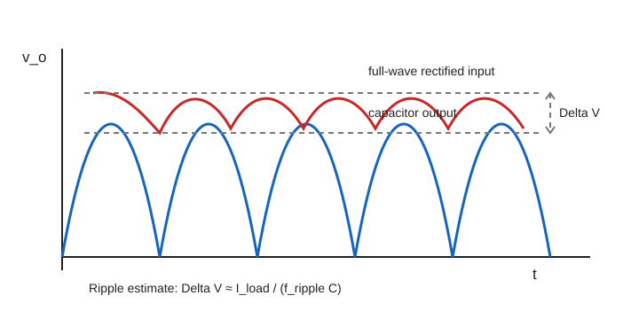

## 考试要会什么

本章是历年 Q2 高频题。你需要会：

- 画 half-wave rectifier、full-wave rectifier、bridge rectifier 的 load voltage 和 diode voltage；
- 求理想整流输出的 $V_{DC}$ 和 $V_{\mathrm{rms}}$；
- 判断 PIV，即 peak inverse voltage；
- 处理 capacitor smoothing：ripple、conduction angle、所需 capacitance；
- 解释增大 smoothing capacitor 的影响。

## 一句话记忆

**Half-wave 每个 line cycle 充一次电，full-wave 每半个 line cycle 充一次电；PIV 一定按拓扑和极性画出来。**

## 核心原理

Diode 是 uncontrolled switch：正向偏置时自动导通，反向偏置时自动关断。Rectifier 的作用是把 AC 转成 pulsating DC。

- **Half-wave rectifier**：只保留正半周，负半周输出为 $0$。
- **Full-wave rectifier**：正负半周都变成同极性输出。
- **Bridge rectifier**：用四个 diode，每半周有两个 diode 导通。
- **Capacitor smoothing**：输入接近峰值时 diode 导通给 capacitor 充电；输入低于 capacitor voltage 时 diode 关断，capacitor 对 load 放电，形成 ripple。

## 必背公式

输入峰值：

$$
\hat V_m=\sqrt{2}V_{AC,\mathrm{rms}}
$$

Half-wave rectifier，理想 diode，resistive load：

$$
V_{DC}=\frac{\hat V_m}{\pi}=\frac{\sqrt{2}}{\pi}V_{AC,\mathrm{rms}}\approx0.45V_{AC,\mathrm{rms}}
$$

$$
V_{\mathrm{rms}}=\frac{\hat V_m}{2}
$$

Full-wave / bridge rectifier，理想 diode，resistive load：

$$
V_{DC}=\frac{2\hat V_m}{\pi}\approx0.90V_{AC,\mathrm{rms}}
$$

$$
V_{\mathrm{rms}}=V_{AC,\mathrm{rms}}
$$

Capacitor ripple 近似：

$$
\Delta V\approx\frac{I_{load}}{f_{\mathrm{ripple}}C}
$$

Ripple frequency：

$$
f_{\mathrm{ripple}}=f_{line}\quad\text{half-wave}
$$

$$
f_{\mathrm{ripple}}=2f_{line}\quad\text{full-wave}
$$

更通用的 charge balance 写法：

$$
\Delta V\approx\frac{I_{load}\Delta t}{C}
$$

Ripple factor：

$$
r=\frac{V_{r,\mathrm{rms}}}{V_{DC}}
$$

Diode conduction loss 近似：

$$
P_D\approx V_F I_{F,\mathrm{avg}}
$$

## 图像/波形/拓扑

这张图要看懂三个位置：

1. 输入整流波形到峰值附近时，diode 导通，capacitor 被快速充电。
2. 峰值过后，输入低于 capacitor voltage，diode 关断。
3. Load 从 capacitor 取电，capacitor voltage 缓慢下降，下降量就是 peak-to-peak ripple $\Delta V$。

### Half-wave、full-wave、bridge 对比

| 项目 | Half-wave | Full-wave centre-tap | Bridge rectifier |
|---|---|---|---|
| 每个 line cycle 的输出脉冲 | 1 个 | 2 个 | 2 个 |
| Ripple frequency | $f_{line}$ | $2f_{line}$ | $2f_{line}$ |
| 理想 $V_{DC}$ | $\hat V_m/\pi$ | $2\hat V_m/\pi$ | $2\hat V_m/\pi$ |
| 理想 $V_{\mathrm{rms}}$ | $\hat V_m/2$ | $V_{AC,\mathrm{rms}}$ | $V_{AC,\mathrm{rms}}$ |
| Diode drops | 1 个 | 1 个 | 2 个 |
| 常见 PIV | 约 $\hat V_m$ | 约 $2\hat V_m$ | 约 $\hat V_m$ |

PIV 的表格结论只适用于常见理想拓扑。考试如果给了 capacitor、diode polarity 或 centre-tap 标注，必须按图重新判断。

## 做题步骤

### A. 无 smoothing capacitor 的 rectifier

1. 把输入写成 $v_s(t)=\hat V_m\sin\omega t$。
2. 判断 diode 导通区间。
3. 画 load voltage：
   - half-wave：正半周跟随输入，负半周为 $0$；
   - full-wave / bridge：输出近似为 $|v_s(t)|$。
4. 若题目给 diode drop $V_F$，导通时输出约为输入减去 diode drop：
   - half-wave 或 centre-tap：减 $V_F$；
   - bridge：减 $2V_F$。
5. 用对应公式求 $V_{DC}$ 或 $V_{\mathrm{rms}}$。

### B. 有 smoothing capacitor 的 ripple 题

1. 判断 half-wave 还是 full-wave。
2. 写 ripple period：

$$
T_{\mathrm{ripple}}=\frac{1}{f_{\mathrm{ripple}}}
$$

3. 若题目给 conduction angle $\theta_c$，先选 ripple period，再把 conduction angle 当作该 ripple period 内的充电时间比例。常用 exam approximation：

$$
\Delta t\approx T_{\mathrm{ripple}}-\frac{\theta_c}{360^\circ}T_{\mathrm{ripple}}
$$

若题图给出具体 charging / discharging 起止点，应按图直接读 $\Delta t$，不要机械套公式。

小例子：half-wave、$50\,\mathrm{Hz}$、$\theta_c=30^\circ$ 时，$T_{\mathrm{ripple}}=20\,\mathrm{ms}$，charging time 为 $(30/360)\times20=1.67\,\mathrm{ms}$，所以 discharge time 约为 $18.33\,\mathrm{ms}$。

4. 估算 load current：

$$
I_{load}\approx\frac{V_{DC}}{R_L}
$$

5. 用 charge balance：

$$
\Delta V\approx\frac{I_{load}\Delta t}{C}
$$

6. 若题目反求 capacitance：

$$
C\approx\frac{I_{load}\Delta t}{\Delta V}
$$

### C. PIV 题

1. 先画 diode 关断时两端电压极性。
2. 找 capacitor 可能保持的最高电压，通常接近 $\hat V_m$。
3. 找 AC source 的最不利反向峰值。
4. 两者按 polarity 相加或相减。
5. 写清是“each diode PIV”还是“total secondary voltage”。

PIV 三步判断小例子：

| 拓扑 | 如何想 | 常见结论 |
|---|---|---|
| Half-wave with smoothing | capacitor 可能保持在 $+\hat V_m$，source 到负峰时 diode 反向电压按题图 polarity 可能接近 $2\hat V_m$ | 有电容时不要只背无电容 half-wave 的 PIV |
| Bridge rectifier | 每次两个 diode 导通，关断 diode 通常只承受一个 secondary peak | each diode PIV 常约为 $\hat V_m$ |
| Centre-tap full-wave | 未导通 diode 可能看到两个半绕组电压叠加 | each diode PIV 常约为 $2\hat V_m$ |

表里的 $\hat V_m$ 必须对应题目指定的 secondary voltage peak；centre-tap 中要确认 $\hat V_m$ 是整段 secondary 还是半边绕组。

### D. Diode voltage waveform sketch checklist

- Diode 导通时，diode voltage 约为 $0$ 或题目给定的 forward drop $V_F$，符号按图上 $V_D$ 参考方向写。
- Diode 关断时，$V_D$ 是 reverse voltage；峰值位置通常给出 PIV。
- 无 capacitor 时，关断电压随输入负半周变化。
- 有 capacitor 时，关断电压还要考虑 capacitor 保持的电压。
- 画图必须标 time scale、zero line、peak / PIV、forward drop。

### E. 增大 smoothing capacitor 的影响

答简答题可以写：

- $C$ 变大，$\Delta V$ 变小，输出更平滑。
- Diode conduction angle 变窄。
- Peak diode current 变大。
- Transformer / diode RMS current 和 VA rating 可能变大。
- 输出 DC voltage 更接近 peak，但实际受 diode drop 和 load 影响。

## 高频错误

- Half-wave 50 Hz 的 ripple period 写成 $10\,\mathrm{ms}$，正确是 $20\,\mathrm{ms}$。
- Full-wave 50 Hz 的 ripple frequency 忘记变成 $100\,\mathrm{Hz}$。
- $V_{AC,\mathrm{rms}}$ 没乘 $\sqrt{2}$ 就当 peak 用。
- Bridge rectifier 忘记每次有两个 diode drop。
- Centre-tap 和 bridge 的 PIV 混淆。
- Conduction angle 给 $30^\circ$ 时，没有换算成时间。
- 只说 capacitor reduces ripple，漏说 peak current 和 VA rating 增大。
- 用 $\Delta V=I/(fC)$ 时，$C$ 的 $\mathrm{\mu F}$ 没换算成 F。

## Past paper 连接

- **2017 Q2(a)**：half-wave rectifier with capacitor smoothing，给 $C$、$R$、conduction angle，估 ripple 和 PIV。关键是 half-wave 周期用 $20\,\mathrm{ms}$。
- **2017 Q2(b)**：无 capacitor，画 load voltage 和 diode voltage，题中 diode drop 要体现在波形峰值上。
- **2018 Q2(a)**：full-wave rectifier with smoothing，关键是 full-wave ripple frequency 为 $100\,\mathrm{Hz}$。
- **2018 Q2(b)**：full-wave output RMS，理想 full-wave rectified sine 的 RMS 等于原 sine RMS。
- **2018 Q2(e)**：限制 ripple 反求 $C$，用 $C\approx I_{load}\Delta t/\Delta V$。
- **Exam feedback**：PIV、half-wave / full-wave 周期、peak conversion 是高频扣分点。

## 补充：PIV 三步判断例子

### Half-wave + smoothing capacitor

1. 导通时：diode 正向导通，capacitor 充到 $\hat V_m$
2. 关断时：source 反向到 $-\hat V_m$，capacitor 保持 $+\hat V_m$
3. Diode 承受反向电压 ≈ $\hat V_m - (-\hat V_m) = 2\hat V_m$（最坏情况）

**但**：若题目无 capacitor（纯 resistive load），PIV = $\hat V_m$ 即可。

### Bridge rectifier

每个 diode 关断时承受 ≈ $\hat V_m$。不要和 centre-tap 混淆。

### Centre-tap

未导通 diode 看到整个 secondary 两半绕组叠加，PIV ≈ $2\hat V_m$。

**考试提醒**：表格里的 $\hat V_m$ 是哪一段绕组的 peak？centre-tap 的 $\hat V_m$ 是单边 secondary peak，不是整个 secondary。

## 补充：Conduction angle 数字例子

**Half-wave 50 Hz、$\theta_c = 30°$**：

1. Ripple period $T_{ripple} = 20\,\mathrm{ms}$（half-wave 50 Hz）
2. Charging time = $30/360 \times 20 = 1.67\,\mathrm{ms}$
3. Discharge time ≈ $20 - 1.67 = 18.33\,\mathrm{ms}$

**Full-wave 50 Hz、$\theta_c = 30°$**：

1. Ripple period $T_{ripple} = 10\,\mathrm{ms}$（full-wave 100 Hz ripple）
2. Charging time = $30/360 \times 10 = 0.83\,\mathrm{ms}$
3. Discharge time ≈ $10 - 0.83 = 9.17\,\mathrm{ms}$

**关键**：先选 ripple period（half-wave 20 ms / full-wave 10 ms），再按 conduction angle 比例算充电时间。此为 exam approximation；若题图给出 conduction interval 起止点，应按图直接读 discharge time。

## 补充：Diode voltage waveform 画图清单

画 diode voltage 时必须标：

1. **导通期间**：$v_D \approx 0$（理想）或 $v_D = -V_F$（有压降）
2. **关断期间**：$v_D$ 为负值，峰值按 PIV 判断
3. **时间轴**：标 period、导通区间、peak 时间点
4. **极性**：按题图 polarity 标正负

参考：2017 Q2(b) 要求同时画 load voltage 和 diode voltage。
