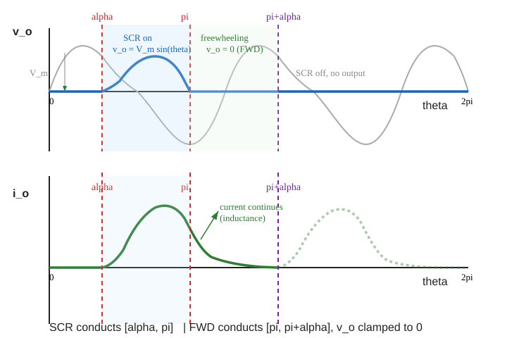
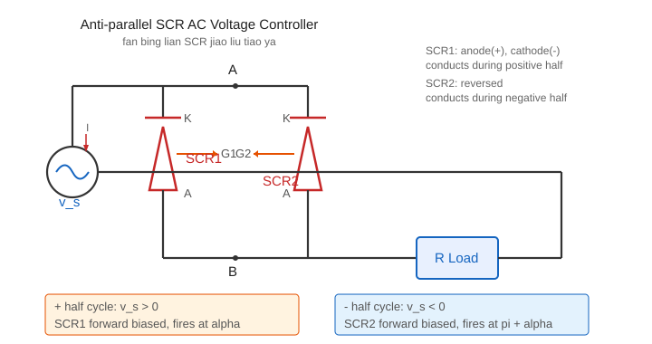
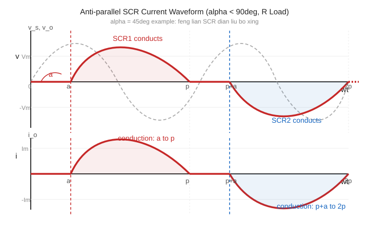
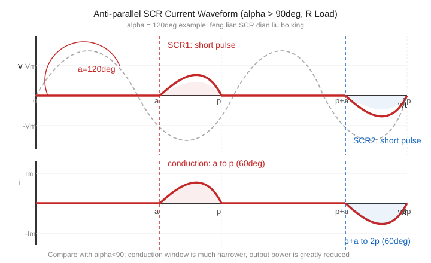
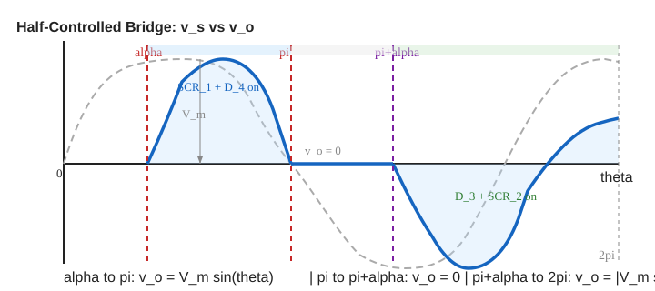

## 先讲清楚

Diode 是不能控的：只要正向偏置，它就自己导通。

SCR 也是单向器件，但多了一个门极（gate）。它不会一正向偏置就自动导通，而是要等 gate pulse。这样就可以把导通时刻往后拖，这个拖后的角度叫触发角（firing angle），记作 $\alpha$。

SCR 的关键点：门极只能让它导通，不能让它关断。导通后要等电流降到维持电流（holding current）以下才关断。AC 电路有自然过零点，所以 SCR 容易关断；纯 DC 没有自然过零点，所以普通 SCR 不适合直接关断 DC。

## 半波 SCR 带电阻负载

输入：

$$
v_s(\theta)=\hat V_m\sin\theta
$$

对电阻负载，SCR 从 $\alpha$ 导通到 $\pi$。负半周反向偏置，输出为 0。

导通区间：

$$
\alpha\le \theta\le \pi
$$

完整周期仍是 $2\pi$。

## 平均值推导（完整逐步，不跳步）

这个推导考试必须能在白纸上复现。按"写积分→提取常数→代入上下限→化简"四步走。

**第 1 步：写积分表达式。**

平均值的定义是"一个完整周期内的有符号面积除以周期"。半波 SCR 的完整周期是 $2\pi$，但只有 $\alpha$ 到 $\pi$ 区间有输出：

$$
V_{avg}=\frac{1}{2\pi}\int_{\alpha}^{\pi}\hat V_m\sin\theta\,d\theta
$$

**第 2 步：提取常数 $\hat V_m$。**

$$
V_{avg}=\frac{\hat V_m}{2\pi}\int_{\alpha}^{\pi}\sin\theta\,d\theta
$$

**第 3 步：积分 $\sin\theta$。**

$$
\int\sin\theta\,d\theta=-\cos\theta
$$

**第 4 步：代入上下限。**

$$
\int_{\alpha}^{\pi}\sin\theta\,d\theta=\left[-\cos\theta\right]_{\alpha}^{\pi}=-\cos\pi-(-\cos\alpha)=-(-1)+\cos\alpha=1+\cos\alpha
$$

**第 5 步：写出最终结果。**

$$
\boxed{V_{avg}=\frac{\hat V_m}{2\pi}(1+\cos\alpha)}
$$

**边界检查：**
- $\alpha=0$（全导通）：$V_{avg}=\hat V_m/\pi$，这和半波二极管整流的平均值一致。正确。
- $\alpha=\pi$（完全不导通）：$V_{avg}=0$。正确。
- $\alpha=\pi/2$：$V_{avg}=\hat V_m/(2\pi)$。正确。

## 有效值推导（完整逐步，不跳步）

**第 1 步：写积分表达式。**

$$
V_{rms}=\sqrt{\frac{1}{2\pi}\int_{\alpha}^{\pi}\hat V_m^2\sin^2\theta\,d\theta}
$$

**第 2 步：用三角恒等式化简 $\sin^2\theta$。**

$$
\sin^2\theta=\frac{1-\cos2\theta}{2}
$$

**第 3 步：代入积分。**

$$
\int_{\alpha}^{\pi}\sin^2\theta\,d\theta=\int_{\alpha}^{\pi}\frac{1-\cos2\theta}{2}\,d\theta
$$

拆成两项：

$$
=\frac{1}{2}\int_{\alpha}^{\pi}1\,d\theta-\frac{1}{2}\int_{\alpha}^{\pi}\cos2\theta\,d\theta
$$

**第 4 步：分别积分。**

第一项：

$$
\frac{1}{2}\int_{\alpha}^{\pi}1\,d\theta=\frac{1}{2}\left[\theta\right]_{\alpha}^{\pi}=\frac{1}{2}(\pi-\alpha)
$$

第二项：

$$
\frac{1}{2}\int_{\alpha}^{\pi}\cos2\theta\,d\theta=\frac{1}{2}\left[\frac{\sin2\theta}{2}\right]_{\alpha}^{\pi}=\frac{1}{4}(\sin2\pi-\sin2\alpha)=\frac{1}{4}(0-\sin2\alpha)=-\frac{\sin2\alpha}{4}
$$

**第 5 步：合并。**

$$
\int_{\alpha}^{\pi}\sin^2\theta\,d\theta=\frac{\pi-\alpha}{2}+\frac{\sin2\alpha}{4}
$$

**第 6 步：代入 RMS 公式。**

$$
\boxed{V_{rms}=\hat V_m\sqrt{\frac{1}{2\pi}\left(\frac{\pi-\alpha}{2}+\frac{\sin2\alpha}{4}\right)}}
$$

**边界检查：**
- $\alpha=0$（全导通）：$V_{rms}=\hat V_m\sqrt{\frac{1}{2\pi}\cdot\frac{\pi}{2}}=\hat V_m/2$，与半波正弦 RMS 一致。正确。
- $\alpha=\pi$：$V_{rms}=0$。正确。

电阻功率：

$$
P=\frac{V_{rms}^2}{R}
$$

> **考试技巧：** 如果忘记 RMS 公式，可以用 $\sin^2=(1-\cos2\theta)/2$ 从头推。推导过程本身就能得一半以上的分。

## 例题 1：半波 SCR

输入 $v_s=100\sin\theta\,\mathrm{V}$，电阻负载，$\alpha=60^\circ$。求 average。

先把角度换成弧度：

$$
\alpha=\frac{\pi}{3}
$$

代公式：

$$
V_{avg}=\frac{100}{2\pi}\left(1+\cos\frac{\pi}{3}\right)
$$

$$
V_{avg}=\frac{100}{2\pi}(1+0.5)=23.9\,\mathrm{V}
$$

注意：这里不能用全波的公式。

## 波形怎么画

固定画法：

1. 画输入正弦。
2. 从自然过零点开始量 $\alpha$。
3. $0$ 到 $\alpha$：输出 0。
4. $\alpha$ 到 $\pi$：输出跟随正弦。
5. $\pi$ 到 $2\pi$：输出 0。
6. 标 $\alpha$、$\hat V_m$、0、$\pi$、$2\pi$。

## 半波 SCR 带感性负载 + 续流二极管（2022Q1d[5分]+2024Q1b[5分] 型，考试必画波形）

半波 SCR 带纯电阻负载时，电流在 $\pi$ 过零后 SCR 自然关断，波形简单。但带感性负载（inductive load）时，电感会阻止电流突变，电流在 $\pi$ 之后不会立刻降到零——SCR 继续导通，输出电压出现负值区域，平均值下降。

这时候就需要**续流二极管（freewheeling diode, FWD）**。

### 电路接法

1. 交流电源 $v_s=\hat V_m\sin\theta$ 在左侧
2. SCR 阳极接电源正端，阴极接负载正端（$A$ 点）
3. RL 负载接在 $A$ 和 $B$（地）之间
4. **续流二极管**反向并联在负载两端：阳极接 $B$（地），阴极接 $A$（负载正端）

续流二极管平时反向偏置不导通。只有当 $A$ 点电压低于 $B$（即 $v_o<0$）时，FWD 才正向导通。

### 没有续流二极管时（问题所在）

1. $\alpha$ 时刻 SCR 触发，电流开始流过负载
2. 电流峰值滞后于电压峰值（因为电感）
3. $\theta=\pi$ 时电源电压过零，但电感电流还没降到零
4. 电流继续流，$v_o$ 变成负值（电感释放能量）
5. 直到电流降到零，SCR 才关断
6. **问题：** $v_o$ 有负面积，$V_{avg}$ 下降；如果电感很大，SCR 可能导通很久，甚至跨入负半周

### 有续流二极管时（考试要画的情况）

续流二极管解决了上面的问题：

1. $\alpha$ 到 $\pi$：SCR 导通，$v_o=\hat V_m\sin\theta$，电流流过 SCR 和负载
2. $\theta=\pi$ 后：$v_s$ 变负，$A$ 点电压开始低于 $B$。续流二极管正向导通，把 $A$、$B$ 短路
3. 续流二极管导通期间：$v_o=0$（二极管把负载短路了），电感电流通过 FWD 形成回路：$A$→负载→$B$→FWD→$A$
4. 电感电流衰减到零，FWD 关断
5. 下一个周期 $\alpha$ 时刻，SCR 再次触发

**关键效果：**
- $v_o$ 不会出现负值——FWD 在 $\pi$ 时就把输出钳位到零
- $V_{avg}$ 比没有 FWD 时更高
- SCR 在 $\pi$ 时关断（FWD 接管了电流），不会拖到负半周
- 电流波形更平滑

### 波形图

**上图（$v_o$）：** 蓝色是负载电压。
- $0$ 到 $\alpha$：SCR 未触发，$v_o=0$
- $\alpha$ 到 $\pi$（蓝色实线，浅蓝区域）：SCR 导通，$v_o=\hat V_m\sin\theta$
- $\pi$ 到 $\pi+\alpha$（浅绿区域）：续流二极管导通，$v_o=0$——这就是续流二极管的作用
- $\pi+\alpha$ 到 $2\pi$：SCR 和 FWD 都关断，$v_o=0$

**下图（$i_o$）：** 绿色是负载电流。
- 电流从 $\alpha$ 开始上升，在 $\pi$ 之前达到峰值
- 过 $\pi$ 后电流继续流（电感效应），通过续流二极管续流，缓慢衰减
- 在 $\pi+\alpha$ 之前衰减到零
- 灰色虚线是下一个周期的电流（形状相同）

### 画波形的固定做法（考试必背）

**第 1 步：画输入正弦 $v_s$。** 用虚线画，作为参考。

**第 2 步：画输出电压 $v_o$。**
- $0$ 到 $\alpha$：画 $v_o=0$（水平线在零轴上）
- $\alpha$ 到 $\pi$：$v_o$ 跟随 $\hat V_m\sin\theta$（从零开始上升，到 $\pi$ 回零）
- $\pi$ 到 $\pi+\alpha$：$v_o=0$（续流二极管钳位，**这是关键区别**）
- $\pi+\alpha$ 到 $2\pi$：$v_o=0$

**第 3 步：画电流 $i_o$。**
- $0$ 到 $\alpha$：$i_o=0$
- $\alpha$ 到 $\pi$：电流上升，峰值在 $\pi$ 之前（电感使电流滞后）
- $\pi$ 到 $\pi+\alpha$：电流通过续流二极管衰减，形状是指数衰减
- $\pi+\alpha$ 到 $2\pi$：$i_o=0$

**第 4 步：标注。** 必须标 $\alpha$、$\pi$、$\pi+\alpha$、$\hat V_m$，并在续流区间标注"freewheeling"或"FWD"。

### $V_{avg}$ 推导（带续流二极管）

续流二极管把 $\pi$ 到 $\pi+\alpha$ 的输出钳位为零，所以只有 $\alpha$ 到 $\pi$ 这一段有积分贡献：

$$
V_{avg}=\frac{1}{2\pi}\int_{\alpha}^{\pi}\hat V_m\sin\theta\,d\theta=\frac{\hat V_m}{2\pi}(1+\cos\alpha)
$$

这和纯电阻负载的半波 SCR 公式**完全相同**——因为续流期间 $v_o=0$，和没有输出一样。差别在于电流波形和 SCR 的关断行为，不在 $V_{avg}$。

> **重要：** 如果**没有**续流二极管，电流在 $\pi$ 后继续流，$v_o$ 有负面积，$V_{avg}$ 会比 $\frac{\hat V_m}{2\pi}(1+\cos\alpha)$ 更小。续流二极管的作用是阻止负面积，保持 $V_{avg}$ 不下降。

### 和电阻负载的关键区别（考试常问）

| 特性 | 电阻负载 | 感性负载 + FWD |
|---|---|---|
| 电流波形 | 和电压同形状，$\pi$ 过零 | 峰值滞后，$\pi$ 后续流衰减 |
| SCR 关断 | $\theta=\pi$ 自然关断 | $\theta=\pi$ 时 FWD 接管，SCR 关断 |
| $v_o$ 波形 | $\alpha$ 到 $\pi$ 有值，其余为零 | 相同（FWD 钳位后） |
| $V_{avg}$ | $\frac{\hat V_m}{2\pi}(1+\cos\alpha)$ | 相同公式 |
| 区别所在 | 电流瞬间过零 | 电流通过 FWD 续流，关断更可靠 |

## 反并联 SCR 交流调压（2023Q1c + 2025Q1b 型，5 分）

如果要控制 AC 负载的正负半周，用两个 SCR 反并联（anti-parallel）。这是考试反复考的画波形题。

### 电路图

**上图说明：** $SCR_1$ 和 $SCR_2$ 方向相反并联，串联在交流电源和负载之间。正半周 $SCR_1$ 导通，负半周 $SCR_2$ 导通。两个门极分别控制。

### 工作原理

- **正半周**：电源电压为正。$SCR_1$ 正向偏置，在触发角 $\alpha$ 时门极触发导通。电流从电源经 $SCR_1$ 流向负载。电流过零时 $SCR_1$ 自然关断。
- **负半周**：电源电压为负。$SCR_2$ 正向偏置，在对应触发角 $\alpha$ 时门极触发导通。电流从负载经 $SCR_2$ 流回电源。电流过零时 $SCR_2$ 自然关断。

### 画电流波形的固定做法（两种 α）

**$\alpha$ 较小时（如 $\alpha=30°$）：**

1. 画输入正弦波
2. 正半周：从 $\alpha$ 开始有电流，到 $\pi$ 过零结束。电流波形就是 $\alpha$ 到 $\pi$ 这段正弦
3. 负半周：从 $\pi+\alpha$ 开始有电流，到 $2\pi$ 过零结束。电流波形是负半周正弦的 $\pi+\alpha$ 到 $2\pi$ 段
4. 标注 $\alpha$ 和 $\pi$，画出导通区间

**$\alpha$ 较大时（如 $\alpha=120°$）：**

1. 画输入正弦波
2. 正半周：从 $120°$ 开始有电流，到 $180°$ 过零。导通区间只有 $60°$
3. 负半周：从 $300°$ 开始有电流，到 $360°$ 过零。导通区间只有 $60°$
4. 电流波形更窄，负载功率更小

**关键观察：**
- $\alpha$ 越大，导通时间越短，负载功率越小
- $\alpha=0$ 时，整个半周都导通，和没有 SCR 一样
- $\alpha=180°$ 时，完全不导通，输出为零
- 电阻负载时电流波形和电压波形形状相同（只是少了 $\alpha$ 前面的部分）

### 波形图

**$\alpha<90°$ 的情况（如 $\alpha=45°$）：**

**上图说明：**
- 上半部分是电源电压 $v_s$（虚线）和输出电压 $v_o$（实线）。电阻负载时 $v_o$ 和电流 $i_o$ 形状相同。
- 下半部分是负载电流 $i_o$。红色为 $SCR_1$ 导通（$\alpha$ 到 $\pi$），蓝色为 $SCR_2$ 导通（$\pi+\alpha$ 到 $2\pi$）。
- 浅色区域标注导通区间。$\alpha<90°$ 时导通区间较大（$\pi-\alpha>90°$），输出功率较高。

**$\alpha>90°$ 的情况（如 $\alpha=120°$）：**

**上图说明：**
- 结构和 $\alpha<90°$ 相同，但导通区间明显变窄（$\pi-\alpha=60°$）。
- 电流脉冲更窄更矮，负载功率大幅下降。
- 对比 $\alpha=45°$ 和 $\alpha=120°$：$\alpha$ 越大，导通时间越短，功率越低。

### 负载电压 RMS

反并联 SCR 的输出波形在 $2\pi$ 周期内有两个对称脉冲（正半周 $\alpha$ 到 $\pi$，负半周 $\pi+\alpha$ 到 $2\pi$），两个脉冲的积分相等，所以：

$$
V_{rms}=\hat V_m\sqrt{\frac{1}{\pi}\left(\frac{\pi-\alpha}{2}+\frac{\sin2\alpha}{4}\right)}
$$

这个公式和半控桥式电阻负载的 RMS 公式完全相同——因为输出波形一样。

负载功率：

$$
P=\frac{V_{rms}^2}{R}
$$

### 例题 2：反并联 SCR（2023Q1c 型）

**已知：** 反并联 SCR 交流调压器，输入 $v_s=200\sin\theta\,\mathrm{V}$，电阻负载 $R=10\,\Omega$。画 $\alpha=60°$ 和 $\alpha=120°$ 时的负载电流波形。

**$\alpha=60°$（$\pi/3$）：**

负载电压 RMS：

$$
V_{rms}=200\sqrt{\frac{1}{\pi}\left(\frac{\pi-\pi/3}{2}+\frac{\sin120°}{4}\right)}
$$

$$
=200\sqrt{\frac{1}{\pi}\left(\frac{2\pi/3}{2}+\frac{0.866}{4}\right)}=200\sqrt{\frac{1}{\pi}(1.047+0.217)}
$$

$$
=200\sqrt{\frac{1.264}{3.1416}}=200\sqrt{0.402}=200\times0.634=126.9\,\mathrm{V}
$$

负载电流 RMS：

$$
I_{rms}=\frac{126.9}{10}=12.69\,\mathrm{A}
$$

**$\alpha=120°$（$2\pi/3$）：**

$$
V_{rms}=200\sqrt{\frac{1}{\pi}\left(\frac{\pi-2\pi/3}{2}+\frac{\sin240°}{4}\right)}
$$

$$
=200\sqrt{\frac{1}{\pi}\left(\frac{\pi/3}{2}+\frac{-0.866}{4}\right)}=200\sqrt{\frac{1}{\pi}(0.524-0.217)}
$$

$$
=200\sqrt{\frac{0.307}{3.1416}}=200\sqrt{0.0977}=200\times0.313=62.5\,\mathrm{V}
$$

**对比：** $\alpha$ 从 $60°$ 增到 $120°$，RMS 电压从 $126.9\,\mathrm{V}$ 降到 $62.5\,\mathrm{V}$，功率降为原来的 $(62.5/126.9)^2=0.243$，只剩约四分之一。

## SCR 三个状态（概念题框架）

考试问"SCR 的工作原理"或"为什么 SCR 是半控型器件"时，用以下框架答题：

| 状态 | 条件 | 说明 |
|---|---|---|
| **正向阻断**（forward blocking） | 阳极电压 > 阴极，但门极无触发 | SCR 承受正向电压但不导通，相当于断开 |
| **正向导通**（forward conducting） | 阳极电压 > 阴极，且门极有触发脉冲 | 一旦导通，门极失去控制——即使撤去门极信号，SCR 保持导通 |
| **反向阻断**（reverse blocking） | 阴极电压 > 阳极 | SCR 反向偏置，不导通，承受反向电压 |

**"半控"的含义：** 门极只能控制导通（turn-on），不能控制关断（turn-off）。关断只能靠电流降到维持电流（holding current）以下——在 AC 电路中，电流过零时自然关断（natural commutation）。

**答题模板（直接抄）：**

> SCR 是半控型器件。门极信号可以让 SCR 从正向阻断状态转入正向导通状态，但导通后门极失去控制。关断必须等电流降到维持电流以下。在 AC 电路中利用电流自然过零关断（natural commutation），在 DC 电路中需要额外的强制换相（forced commutation）电路。

## 半控桥式（half-controlled bridge）完整推导（2025Q2c 型，15 分）

2025Q2c 考了半控桥式整流器，要求画波形、推 $V_{avg}$、推 $V_{rms}$、讨论续流二极管。这是考试高分值题型，必须能独立复现。

### 什么是半控桥式

全控桥式（fully controlled bridge）用 4 只 SCR，半控桥式（half-controlled bridge）用 2 只 SCR + 2 只二极管。上面两个臂是 SCR（可控），下面两个臂是二极管（不可控），或者反过来。

好处：比全控便宜（只用 2 只 SCR），且带电阻负载时行为比全控简单。坏处：控制灵活度不如全控。

### 电路画法

1. 交流电源 $v_s=\hat V_m\sin\theta$ 在左侧
2. 上面两个臂：$SCR_1$（阳极接 A 端）和 $SCR_2$（阳极接 B 端）
3. 下面两个臂：$D_3$（阴极接 A 端）和 $D_4$（阴极接 B 端）
4. 负载接在 A、B 之间

另一种等效画法：上面两个臂是二极管，下面两个臂是 SCR。考试给哪种就用哪种，分析方法完全相同。

**上图说明：** 上半桥两只 SCR（$T_1$、$T_3$，红色），下半桥两只二极管（$D_2$、$D_4$，蓝色）。RL 负载接在 A、B 之间，续流二极管 $D_f$ 反向并联在负载两端（阳极接 B，阴极接 A）。蓝色虚线箭头是正半周电流路径（$T_1$+$D_4$），红色虚线箭头是负半周电流路径（$T_3$+$D_2$）。

### 工作过程（电阻负载）

**正半周：** $v_s>0$。$SCR_1$ 正向偏置，在触发角 $\alpha$ 时门极触发导通。电流路径：电源 → $SCR_1$ → 负载 → $D_4$ → 电源。$v_o=v_s$。电流在 $\theta=\pi$ 时过零，$SCR_1$ 自然关断。

**负半周：** $v_s<0$。$SCR_2$ 正向偏置，在 $\pi+\alpha$ 时门极触发导通。电流路径：电源 → $D_3$ → 负载 → $SCR_2$ → 电源。$v_o=-v_s$（正值）。电流在 $\theta=2\pi$ 时过零，$SCR_2$ 自然关断。

### 画波形的固定做法

**上图说明：** 灰色虚线是输入电压 $v_s=\hat V_m\sin\theta$，蓝色实线是输出电压 $v_o$。浅蓝区域是 $SCR_1+D_4$ 导通（$\alpha$ 到 $\pi$），浅绿区域是 $D_3+SCR_2$ 导通（$\pi+\alpha$ 到 $2\pi$），中间 $\pi$ 到 $\pi+\alpha$ 区间输出为零（$SCR_1$ 已关断、$SCR_2$ 未触发）。

**第 1 步：画输入正弦 $v_s$。**

**第 2 步：标触发角。** 正半周从 $\alpha$ 开始，负半周从 $\pi+\alpha$ 开始。

**第 3 步：画输出电压 $v_o$。**
- $0$ 到 $\alpha$：$v_o=0$（SCR 未触发）
- $\alpha$ 到 $\pi$：$v_o=\hat V_m\sin\theta$（跟随正弦）
- $\pi$ 到 $\pi+\alpha$：$v_o=0$（$SCR_1$ 已关断，$SCR_2$ 未触发）
- $\pi+\alpha$ 到 $2\pi$：$v_o=-\hat V_m\sin\theta=|\hat V_m\sin\theta|$（正值跟随 $|v_s|$）
- $2\pi$ 到 $2\pi+\alpha$：$v_o=0$

**关键观察：** 半控桥式的输出波形和全控桥式带电阻负载完全一样——都是从 $\alpha$ 开始到 $\pi$，再从 $\pi+\alpha$ 到 $2\pi$。差别在内部电流路径，不在输出波形。

### 为什么半控桥式不适合直流电机负载（2025Q2c 型，必考）

这个知识点 2025Q2c 直接考了，分值 2-3 分。很多人只知道"半控便宜"，但说不清楚为什么不能用在 DC 电机上。

**核心问题：** 半控桥式的下臂是二极管（不可控），当负载是 DC 电机（大电感，电流连续）时，会出现"自然续流"现象，导致输出平均电压无法从零调节。

**详细分析：**

全控桥式在 $\alpha>90°$ 时，$V_{avg}=(2\hat V_m/\pi)\cos\alpha$ 可以变为负值——这是再生制动（regenerative braking）的前提。DC 电机需要负平均电压来实现制动。

半控桥式呢？看负半周的工作过程：

1. 正半周：$SCR_1$ 在 $\alpha$ 触发，电流经 $SCR_1$→负载→$D_4$，$v_o=v_s$。$\theta=\pi$ 时电源电压过零，电流应该下降。
2. **问题来了：** 电感电流不能突然为零。在全控桥式中，$SCR_2+SCR_3$ 可以在 $\pi+\alpha$ 才触发，在此之前电流由 $SCR_1+SCR_4$ 续流，输出为 0。但在半控桥式中，$D_3$ 是二极管——只要负载电压略为正，$D_3$ 就自动导通！
3. $\theta>\pi$ 时，$v_s$ 变负，但电感维持电流方向不变。$SCR_1$ 还在导通（电感维持电流），$D_3$ 自然导通（下臂二极管不需要触发）。电流路径变成 $SCR_1$→负载→$D_3$→$SCR_1$，输出电压 $v_o\approx 0$（续流回路）。
4. 这个续流一旦开始，$SCR_1$ 中的电流不经过电源，无法通过电流过零来关断。结果 $SCR_1$ 一直导通到下一个半周 $SCR_2$ 触发为止。
5. **后果：** 输出平均电压变成 $V_{avg}=(\hat V_m/\pi)(1+\cos\alpha)$，这个值**总是正的**（不可能变负）。无法实现再生制动，DC 电机无法四象限运行。

**对比总结：**

| 特性 | 全控桥式（4 SCR） | 半控桥式（2 SCR + 2 二极管） |
|---|---|---|
| 输出范围 | 正负可调（$\pm 2\hat V_m/\pi$） | 只能正（$0$ 到 $2\hat V_m/\pi$） |
| 再生制动 | 可以（$\alpha>90°$） | 不可以 |
| 电流连续时行为 | 可控，$\alpha$ 精确控制导通 | 二极管"抢跑"导致自然续流，控制精度下降 |
| 适用负载 | DC 电机、四象限驱动 | 电阻负载、只需要单向调压 |

**答题模板（直接抄）：**

> 半控桥式不适合直流电机负载，原因：
>
> 1. 半控桥式的下臂是二极管，当负载电流连续时，二极管在电源电压过零后会自然导通形成续流回路，导致 SCR 无法在电流过零时关断。
> 2. 输出平均电压 $V_{avg}=\frac{\hat V_m}{\pi}(1+\cos\alpha)$ 始终为正值，无法实现负平均电压。
> 3. 因此不能实现再生制动（regenerative braking），DC 电机无法在制动和反转状态下工作。
> 4. 需要四象限运行的 DC 电机应选用全控桥式（4 只 SCR），使 $V_{avg}=\frac{2\hat V_m}{\pi}\cos\alpha$ 可正可负。

### 为什么半控桥式和全控桥式的电阻负载输出相同

全控桥式：正半周 $SCR_1+SCR_4$ 导通，负半周 $SCR_2+SCR_3$ 导通。导通区间和半控一样——都是从各自的触发角到电流过零。

半控桥式：正半周 $SCR_1+D_4$ 导通，负半周 $D_3+SCR_2$ 导通。二极管不需要触发，只要有正向偏置就自动导通，所以导通区间由 SCR 的触发角决定——和全控一样。

只有在连续电流（如 DC 电机）情况下，两者的输出波形才不同。半控桥式在连续电流时会因为二极管"抢跑"而出现自然续流，输出平均值变小。

### $V_{avg}$ 推导（逐步不跳步）

半控桥式的输出波形由两段组成：$\alpha$ 到 $\pi$（正半周），$\pi+\alpha$ 到 $2\pi$（负半周）。每段都是正弦波的绝对值，所以平均值计算和全波整流一样，只是积分起点从 $\alpha$ 开始。

**第 1 步：写积分表达式。**

输出波形有两段正弦脉冲，完整周期 $2\pi$：

$$
V_{avg}=\frac{1}{2\pi}\left[\int_{\alpha}^{\pi}\hat V_m\sin\theta\,d\theta+\int_{\pi+\alpha}^{2\pi}\hat V_m(-\sin\theta)\,d\theta\right]
$$

**第 2 步：利用对称性简化。**

两段积分的面积相等（正半周和负半周对称），所以：

$$
V_{avg}=\frac{1}{2\pi}\times 2\int_{\alpha}^{\pi}\hat V_m\sin\theta\,d\theta=\frac{\hat V_m}{\pi}\int_{\alpha}^{\pi}\sin\theta\,d\theta
$$

**第 3 步：积分 $\sin\theta$。**

$$
\int_{\alpha}^{\pi}\sin\theta\,d\theta=\left[-\cos\theta\right]_{\alpha}^{\pi}=-\cos\pi-(-\cos\alpha)=1+\cos\alpha
$$

**第 4 步：写出最终结果。**

$$
\boxed{V_{avg}=\frac{\hat V_m}{\pi}(1+\cos\alpha)}
$$

**边界检查：**
- $\alpha=0$：$V_{avg}=2\hat V_m/\pi$，全波整流平均值。正确。
- $\alpha=\pi$：$V_{avg}=0$。完全不导通。正确。
- $\alpha=\pi/2$：$V_{avg}=\hat V_m/\pi$。正确。

**和全控桥式对比：** 全控桥式连续电流时 $V_{avg}=(2\hat V_m/\pi)\cos\alpha$，半控电阻负载 $V_{avg}=(\hat V_m/\pi)(1+\cos\alpha)$。两个公式**不一样**，不要混用。考试时看清楚是半控还是全控、是电阻负载还是连续电流。

### $V_{rms}$ 推导（逐步不跳步）

**第 1 步：写积分表达式。**

$$
V_{rms}=\sqrt{\frac{1}{2\pi}\left[\int_{\alpha}^{\pi}\hat V_m^2\sin^2\theta\,d\theta+\int_{\pi+\alpha}^{2\pi}\hat V_m^2\sin^2\theta\,d\theta\right]}
$$

**第 2 步：利用对称性。**

两段相等：

$$
V_{rms}=\sqrt{\frac{2}{2\pi}\int_{\alpha}^{\pi}\hat V_m^2\sin^2\theta\,d\theta}=\sqrt{\frac{\hat V_m^2}{\pi}\int_{\alpha}^{\pi}\sin^2\theta\,d\theta}
$$

**第 3 步：用三角恒等式。**

$$
\sin^2\theta=\frac{1-\cos2\theta}{2}
$$

$$
\int_{\alpha}^{\pi}\sin^2\theta\,d\theta=\frac{1}{2}\int_{\alpha}^{\pi}d\theta-\frac{1}{2}\int_{\alpha}^{\pi}\cos2\theta\,d\theta
$$

$$
=\frac{\pi-\alpha}{2}-\frac{1}{4}\left[\sin2\theta\right]_{\alpha}^{\pi}=\frac{\pi-\alpha}{2}-\frac{1}{4}(\sin2\pi-\sin2\alpha)=\frac{\pi-\alpha}{2}+\frac{\sin2\alpha}{4}
$$

**第 4 步：代入 RMS 公式。**

$$
\boxed{V_{rms}=\hat V_m\sqrt{\frac{1}{\pi}\left(\frac{\pi-\alpha}{2}+\frac{\sin2\alpha}{4}\right)}}
$$

**和半波 RMS 对比：** 半波 $V_{rms}=\hat V_m\sqrt{\frac{1}{2\pi}(\cdots)}$，半控桥式 $V_{rms}=\hat V_m\sqrt{\frac{1}{\pi}(\cdots)}$。差别在分母：半波是 $2\pi$，桥式是 $\pi$。桥式有两个脉冲，RMS 更大。

**边界检查：**
- $\alpha=0$：$V_{rms}=\hat V_m\sqrt{\frac{1}{\pi}\cdot\frac{\pi}{2}}=\hat V_m/\sqrt{2}$，全波正弦 RMS。正确。
- $\alpha=\pi$：$V_{rms}=0$。正确。

### 续流二极管（freewheeling diode）

半控桥式带**感性负载**（inductive load）时，需要加续流二极管。

**为什么需要？** 感性负载时电流不会在 $\pi$ 时立刻降到零。如果 SCR 在 $\pi$ 后要关断，电感需要一个续流通路。没有续流二极管的话，SCR 可能因为电感维持电流而无法在电流过零时关断。

**续流二极管怎么接：** 反向并联在负载两端——阳极接负载的负端（$B$），阴极接负载的正端（$A$）。

**续流期间：** $\pi$ 到 $\pi+\alpha$ 之间，$SCR_1$ 已关断，$SCR_2$ 未触发。电感电流通过续流二极管形成回路：$A$ → 负载 → $B$ → 续流二极管 → $A$。此时输出电压 $v_o=0$（续流二极管把输出短路了）。

**加续流二极管后的效果：**
- 输出平均值不变：因为续流期间 $v_o=0$，和没触发时一样
- 电流波形更平滑：电感能量不会突然中断
- $SCR$ 的导通角变小：从 $\pi-\alpha$ 降到更小的值（取决于电感大小）
- $SCR$ 关断更可靠：续流二极管保证电流有通路

### 半控桥式完整例题（模拟 2025Q2c，15 分）

**已知：** 半控桥式整流器，$v_s=200\sin\theta\,\mathrm{V}$（RMS $=200/\sqrt{2}=141.4\,\mathrm{V}$），电阻负载 $R=10\,\Omega$，$\alpha=60°$。

**(a) 求 $V_{avg}$。**

$$
V_{avg}=\frac{\hat V_m}{\pi}(1+\cos\alpha)=\frac{200}{\pi}(1+\cos60°)
$$

$$
=\frac{200}{\pi}(1+0.5)=\frac{200\times1.5}{\pi}=\frac{300}{\pi}=95.5\,\mathrm{V}
$$

**(b) 求 $V_{rms}$。**

$$
V_{rms}=200\sqrt{\frac{1}{\pi}\left(\frac{\pi-\pi/3}{2}+\frac{\sin120°}{4}\right)}
$$

$$
=200\sqrt{\frac{1}{\pi}\left(\frac{2\pi/3}{2}+\frac{0.866}{4}\right)}
$$

$$
=200\sqrt{\frac{1}{\pi}\left(1.047+0.217\right)}=200\sqrt{\frac{1.264}{3.1416}}
$$

$$
=200\sqrt{0.402}=200\times0.634=126.9\,\mathrm{V}
$$

**(c) 求负载功率。**

$$
P=\frac{V_{rms}^2}{R}=\frac{126.9^2}{10}=\frac{16103}{10}=1610\,\mathrm{W}
$$

**(d) 讨论续流二极管。**

电阻负载不需要续流二极管（电流自然过零）。如果是 RL 负载，需要在负载两端反向并联续流二极管，保证 SCR 可靠关断。

## SCR 桥式电路 / 直流电机（2024Q1a 型，5 分推导）

如果题目是全控型桥式（bridge），且直流电机或大电感让电流近似连续，常用：

### 电路图

**上图说明：** 4 只 SCR 组成全桥，DC 电机负载接在 A、B 两端之间。续流二极管（FWD）反向并联在负载两端（阳极接 B，阴极接 A），在两组 SCR 换相间隙提供续流通路。

**SCR 分组与触发规则：**
- **正半周**（$v_s>0$）：$SCR_1$ + $SCR_3$ 同时触发。电流路径：电源(+) $\to$ $SCR_1$ $\to$ A $\to$ 负载 $\to$ B $\to$ $SCR_3$ $\to$ 电源(-)。蓝色虚线箭头。
- **负半周**（$v_s<0$）：$SCR_2$ + $SCR_4$ 同时触发。电流路径：电源(-) $\to$ $SCR_2$ $\to$ A $\to$ 负载 $\to$ B $\to$ $SCR_4$ $\to$ 电源(+)。绿色虚线箭头。
- 两组的电流方向**经过负载都是 A $\to$ B**（单向），所以 DC 电机得到的是脉动直流。
- **续流二极管（FWD）：** 在 $\alpha$ 到下一组 SCR 触发的间隙，如果没有 SCR 导通，电感电流通过 FWD 续流：B $\to$ FWD $\to$ A $\to$ 负载 $\to$ B，$v_o \approx 0$。

$$V_{avg}=\frac{2\hat V_m}{\pi}\cos\alpha$$

### 从零推导（考试必备，逐步不跳步）

**第 1 步：确认桥式 SCR 电路结构。**（电路图见上方。）

四只 SCR 组成全桥。对角 SCR 同时触发：正半周 $SCR_1$+$SCR_3$，负半周 $SCR_2$+$SCR_4$。负载（直流电机）接在 A、B 之间。续流二极管反向并联在负载两端，续流期间 $v_o\approx 0$。

**第 2 步：确认连续电流假设。**

直流电机的电枢电感很大，电流基本恒定。这意味着即使在电源电压过零附近，电流也不会降到零——另一组 SCR 已经导通续流。

**第 3 步：写导通区间。**

每组 SCR 导通 $\pi$ 弧度。但导通起始点从 $\alpha$ 开始（不是从 $0$）。所以第一组导通区间为 $[\alpha, \alpha+\pi]$，第二组从 $[\alpha+\pi, \alpha+2\pi]$。

**第 4 步：写输出电压。**

在第一组导通期间，输出电压就是输入电压的绝对值 $|v_s|=\hat V_m|\sin\theta|$（注意：这里是单相输入电压的绝对值，不是三相系统的线电压）。在连续电流假设下，输出电压在一个 $\pi$ 的区间内积分。

**第 5 步：积分求平均值。**

$$
V_{avg}=\frac{1}{\pi}\int_{\alpha}^{\alpha+\pi}\hat V_m\sin\theta\,d\theta
$$

$$
=\frac{\hat V_m}{\pi}\left[-\cos\theta\right]_{\alpha}^{\alpha+\pi}
$$

$$
=\frac{\hat V_m}{\pi}\left[-\cos(\alpha+\pi)+\cos\alpha\right]
$$

因为 $\cos(\alpha+\pi)=-\cos\alpha$：

$$
=\frac{\hat V_m}{\pi}\left[\cos\alpha+\cos\alpha\right]=\frac{2\hat V_m}{\pi}\cos\alpha
$$

$$
\boxed{V_{avg}=\frac{2\hat V_m}{\pi}\cos\alpha}
$$

### 边界检查

- $\alpha=0$：$V_{avg}=2\hat V_m/\pi$，这是全波整流的平均值。正确。
- $\alpha=90°$：$V_{avg}=0$。触发角太大，正负面积抵消。正确。
- $\alpha>90°$：$V_{avg}$ 为负值。如果负载是电机，负平均电压意味着制动（regenerative braking）。公式是否适用取决于题目条件。

### 物理意义

$\alpha=90°$ 时平均输出为零——不是因为没有输出电压，而是因为正半周和负半周的面积相等、互相抵消。这就是为什么直流电机在 $\alpha<90°$ 时电动运行、$\alpha>90°$ 时再生制动。

### 例题 3：SCR 桥式 DC 电机（2024Q1a 型）

**已知：** 全控桥式 SCR，$\hat V_m=200\,\mathrm{V}$，直流电机负载（连续电流），$\alpha=90°$。

$$
V_{avg}=\frac{2\times200}{\pi}\cos90°=\frac{400}{\pi}\times0=0\,\mathrm{V}
$$

$\alpha=60°$ 时：

$$
V_{avg}=\frac{2\times200}{\pi}\cos60°=\frac{400}{\pi}\times0.5=63.7\,\mathrm{V}
$$

适用条件必须写：连续电流（continuous current），即电枢电感足够大，电流不会降到零。

## 固定套路

SCR 题按这几步：

1. 判断拓扑：半波 / 全波 / 桥式 / 反并联 / 半控桥式
2. 判断负载：电阻负载、连续电流、RL 负载（需要续流二极管）
3. 标触发角 $\alpha$
4. 写导通区间
5. 感性负载时标续流区间 $[\pi, \pi+\alpha]$，画 $v_o=0$
6. 按导通区间积分 average / RMS
7. power 用 RMS
8. 解释半控型时写门极只能导通
9. 半控桥式用 $(1+\cos\alpha)$ 公式，全控桥式用 $\cos\alpha$ 公式——不要混

## 别丢分

- $\alpha$ 从自然过零点量，不是从峰值量。
- 角度代入积分前换成弧度。
- 门极不能关断。
- 电阻负载功率用 RMS。
- 半波公式、全波电阻负载公式、桥式连续电流公式、半控桥式公式不要混用。四个公式四种场景。
- 纯 DC 中普通 SCR 需要强制换相（forced commutation）。
- 反并联 SCR 画波形时，正负半周各画一个 SCR 导通段，不要漏掉负半周。
- 桥式 $V_{avg}=(2\hat V_m/\pi)\cos\alpha$ 只在连续电流下适用。如果电流断续了，这个公式不成立。
- 半控桥式 $V_{avg}=(\hat V_m/\pi)(1+\cos\alpha)$ 适用于电阻负载。带感性负载需要续流二极管。
- 半控桥式的 RMS 公式分母是 $\pi$（不是 $2\pi$），因为两个脉冲。
- RMS 推导时 $\sin^2\theta=(1-\cos2\theta)/2$ 是必用的三角恒等式。考试忘了公式就从这步开始推。
- $\sin2\alpha$ 可以是负值（$\alpha>90°$ 时），计算时不要丢符号。
- 半波 SCR 的平均值公式 $V_{avg}=\hat V_m(1+\cos\alpha)/(2\pi)$ 只适用于电阻负载。如果是连续电流的半波（有续流二极管），公式不同。
- 概念题问"为什么 SCR 是半控型"→ 门极只能导通不能关断，必须写三个状态（正向阻断、正向导通、反向阻断）。
- 半控桥式 vs 全控桥式：半控用 2 SCR + 2 二极管，全控用 4 SCR。带电阻负载时输出波形相同，带感性负载时不同。
- **半波 SCR 感性负载画波形（2022Q1d+2024Q1b）：** 考试必画。续流二极管在 $\pi$ 到 $\pi+\alpha$ 把 $v_o$ 钳位为零，电流通过 FWD 衰减。标注 $\alpha$、$\pi$、$\pi+\alpha$、$\hat V_m$。没有 FWD 时 $v_o$ 有负面积，有 FWD 时 $v_o$ 不会出现负值。
- **半控桥式不适合 DC 电机：** 下臂二极管在电流连续时会自然续流，输出电压只能为正，无法再生制动。DC 电机必须用全控桥式（4 SCR）。这是 2025Q2c 考过的知识点。
- **全控桥式 SCR 画电路图（2024Q1a+2025Q2c）：** 4 只 SCR 分两组对角触发（正半周 $SCR_1+SCR_3$，负半周 $SCR_2+SCR_4$），负载电流方向始终 A→B（单向脉动直流）。续流二极管反向并联在负载两端，在 SCR 换相间隙续流。考试画图时必须标注触发分组、电流路径和 FWD 位置。
