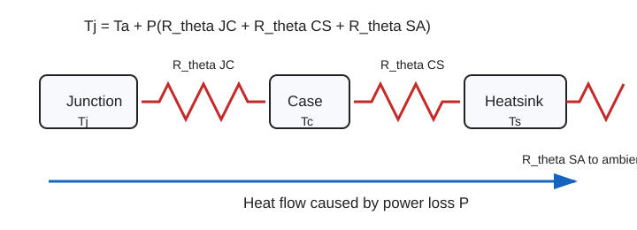

## 为什么热设计很重要

电力电子器件的损耗最终都变成热。如果热量散不出去，结温（junction）就会超标。半导体器件的最高结温通常在 125 °C 左右，超过这个温度，失效率大约每升高 10 °C 翻一倍。所以热设计不是可选项——它直接决定器件能不能活下来。

## 三种传热机制

热量从器件传到空气，靠三种方式：

1. **传导**（conduction）：热量沿固体材料传递，比如从芯片 die 到封装外壳、从外壳到散热器。驱动力是温差，阻力是热阻。
2. **对流**（convection）：散热器表面把热量传给周围的流体（通常是空气）。自然对流（natural convection）靠空气密度差驱动，风速低、换热弱；强制对流（forced convection）用风扇吹，换热效率高得多。
3. **辐射**（radiation）：任何有温度的物体都在向周围辐射电磁波。在电力电子的典型温度范围（50–150 °C）内，辐射占比不大，但在真空或高温环境下会变得重要。

工程上，传导和对流是主要路径。如果散热器设计比较复杂（比如翅片形状、风道布局），可以用 CFD（计算流体力学）软件做仿真优化，但考试只考集总参数的热路计算。

## 热路模型

热路和电路很像：

| 电路 | 热路 |
|---|---|
| 电流 $I$ | 功耗 $P$ |
| 电压差 $V$ | 温差 $\Delta T$ |
| 电阻 $R$ | 热阻（thermal resistance） $R_\theta$ |
| $V=IR$ | $\Delta T=PR_\theta$ |

## 热阻阶梯

单个器件从结到环境的热路，像一个逐级传递的阶梯：

1. 结（junction）→ 外壳（case）：热阻 $R_{\theta JC}$
2. 外壳（case）→ 散热器（heatsink）：热阻 $R_{\theta CS}$
3. 散热器（heatsink）→ 环境（ambient）：热阻 $R_{\theta SA}$

对应：

$$
T_J \;\text{—}\; R_{\theta JC} \;\text{—}\; T_C \;\text{—}\; R_{\theta CS} \;\text{—}\; T_S \;\text{—}\; R_{\theta SA} \;\text{—}\; T_A
$$

从环境往上算：

$$
T_S=T_A+P R_{\theta SA}
$$

$$
T_C=T_S+P R_{\theta CS}
$$

$$
T_J=T_C+P R_{\theta JC}
$$

合并：

$$
T_J=T_A+P(R_{\theta JC}+R_{\theta CS}+R_{\theta SA})
$$

## 例题 1：算结温

已知 $P=20\,\mathrm{W}$，$T_A=25^\circ\mathrm{C}$，$R_{\theta JC}=1^\circ\mathrm{C/W}$，$R_{\theta CS}=0.5^\circ\mathrm{C/W}$，$R_{\theta SA}=2^\circ\mathrm{C/W}$。求 $T_J$。

总热阻：

$$
R_{total}=1+0.5+2=3.5^\circ\mathrm{C/W}
$$

温升：

$$
\Delta T=20\times3.5=70^\circ\mathrm{C}
$$

结温：

$$
T_J=25+70=95^\circ\mathrm{C}
$$

若 $T_{J,max}=150^\circ\mathrm{C}$，这组条件安全。

## 反推散热器

有时题目给最大结温，让你选散热器。

$$
R_{\theta SA}\le\frac{T_{J,max}-T_A}{P}-R_{\theta JC}-R_{\theta CS}
$$

选散热器时要选更小的 $R_{\theta SA}$。热阻越小，散热越好。

## 例题 2：选散热器

已知 $P=30\,\mathrm{W}$，$T_A=40^\circ\mathrm{C}$，$T_{J,max}=125^\circ\mathrm{C}$，$R_{\theta JC}=1^\circ\mathrm{C/W}$，$R_{\theta CS}=0.5^\circ\mathrm{C/W}$。求 $R_{\theta SA}$ 上限。

总允许热阻：

$$
\frac{125-40}{30}=2.83^\circ\mathrm{C/W}
$$

扣掉 junction-case 和 case-sink：

$$
R_{\theta SA}\le2.83-1-0.5=1.33^\circ\mathrm{C/W}
$$

所以散热器要选 $1.33^\circ\mathrm{C/W}$ 或更小。

## 共用散热器

多个器件共用同一个散热器时，散热器到环境这段承受总功耗。

$$
P_{total}=P_1+P_2+\cdots+P_n
$$

$$
T_S=T_A+P_{total}R_{\theta SA}
$$

每个器件自己的结温单独算：

$$
T_{J,k}=T_S+P_k(R_{\theta CS,k}+R_{\theta JC,k})
$$

## 例题 3：共用散热器

MOSFET 损耗 $10\,\mathrm{W}$，diode 损耗 $5\,\mathrm{W}$，共用散热器。$T_A=25^\circ\mathrm{C}$，$R_{\theta SA}=3^\circ\mathrm{C/W}$。MOSFET 的 $R_{\theta JC}+R_{\theta CS}=2^\circ\mathrm{C/W}$，diode 的 $R_{\theta JC}+R_{\theta CS}=4^\circ\mathrm{C/W}$。

散热器温度：

$$
T_S=25+(10+5)\times3=70^\circ\mathrm{C}
$$

MOSFET：

$$
T_{J,M}=70+10\times2=90^\circ\mathrm{C}
$$

Diode：

$$
T_{J,D}=70+5\times4=90^\circ\mathrm{C}
$$

两个都要检查是否低于各自最大结温。

## 瞬态热分析

前面的计算都假设稳态——器件一直工作、温度不再变化。但实际工作中，很多器件是间歇工作的（比如脉冲负载）。这种情况下，温度还没来得及升到稳态值，负载就已经关了。瞬态热分析就是处理这种情况的。

### 热容的概念

热路里，除了热阻还有热容（thermal capacitance）。热容 $C_\theta$ 类比电路里的电容：就像电容两端的电压不能突变，物体的温度也不能突变。热容越大，温度变化越慢。

### RC 热路模型

把热阻和热容组合起来，就是一个 RC 电路：

$$
\tau = \theta_{SA} \times C_{SA}
$$

其中 $\tau$ 是热时间常数，$\theta_{SA}$ 是散热器到环境的热阻，$C_{SA}$ 是散热器的热容。

温度响应曲线和电容充电曲线一样：

$$
T_{actual} = T_{final} \times (1 - e^{-t/\tau})
$$

其中 $T_{final}$ 是稳态温度，$T_{actual}$ 是 $t$ 时刻的实际温度。

### 时间常数表

| 时间 | 温度达到稳态值的百分比 |
|---|---|
| $0.5\tau$ | 39% |
| $\tau$ | 63% |
| $2\tau$ | 86% |
| $3\tau$ | 95% |
| $5\tau$ | 99%（可视为达到稳态） |

### 脉冲工作

在脉冲工作模式下，器件只在脉冲期间发热。如果脉冲宽度远小于热时间常数，峰值温升会远低于稳态值——这是好事。但要注意一个事实：冷却的时间常数通常比加热的时间常数大（因为散热器的热容在冷却阶段持续向环境放热），所以不能简单地假设"热多少就冷多少"。在做题时，如果题目没有特别说明瞬态，按稳态处理就行；如果题目提到了脉冲宽度或占空比，就需要考虑热容的影响。

## 热路图画法（2022Q4c 型，3 分）

考试经常要求"画出热路图"。很多人知道公式但画不出图，直接丢 3 分。下面是固定画法。

### 热路图的画法固定做法

**第 1 步：画一串串联的"方块+节点"。**

从左到右依次：

$$
\boxed{T_J} \;\xrightarrow{R_{\theta JC}}\; \boxed{T_C} \;\xrightarrow{R_{\theta CS}}\; \boxed{T_S} \;\xrightarrow{R_{\theta SA}}\; \boxed{T_A}
$$

- 每个方框是一个温度节点
- 每两个节点之间是一个热阻
- 功耗 $P$ 用一个电流源符号（箭头）从上往下注入节点

**第 2 步：标功耗注入点。**

对单器件：功耗 $P$ 注入到 $T_J$ 节点（因为热量从结开始产生）。

对共用散热器：每个器件各自把功耗注入到各自的 $T_J$ 节点，所有热量汇总到 $T_S$ 节点。

**第 3 步：标数值。**

在每个热阻旁标数值（$°\mathrm{C/W}$），在每个温度节点旁标已知温度（通常 $T_A$ 已知）。

### 热路图画法示例（2022Q4c 风格）

**已知：** 二极管功耗 $P=200\,\mathrm{W}$，$R_{\theta JC}=0.1\,°\mathrm{C/W}$，散热器 $R_{\theta SA}=0.15\,°\mathrm{C/W}$，$R_{\theta CS}=0.04\,°\mathrm{C/W}$，$T_A=25°C$。

热路图：

$$
T_A=25°C \;\xleftarrow{R_{\theta SA}=0.15}\; T_S \;\xleftarrow{R_{\theta CS}=0.04}\; T_C \;\xleftarrow{R_{\theta JC}=0.1}\; T_J
$$

功耗 $P=200\,\mathrm{W}$ 从 $T_J$ 节点注入，沿热路向 $T_A$ 方向传递。

从环境往上算：

$$
T_S=T_A+P\cdot R_{\theta SA}=25+200\times0.15=55°C
$$

$$
T_C=T_S+P\cdot R_{\theta CS}=55+200\times0.04=63°C
$$

$$
T_J=T_C+P\cdot R_{\theta JC}=63+200\times0.1=83°C
$$

**答案：** $T_S=55°C$，$T_C=63°C$，$T_J=83°C$。

> **画图得分关键：** 必须标注温度节点（$T_J$、$T_C$、$T_S$、$T_A$）、每个热阻的符号和数值、功耗注入方向。光写公式不画图会扣分。

## 降额（2024Q1d 型，5 分）

降额（derating）就是不按器件极限用。温度越高，允许功耗通常越低。并联器件也不能假设完全均流，所以要留余量。

### 降额规格怎么读

器件手册给的典型降额规格格式：

> $P_{D,max}=65\,\mathrm{W}$ @ $T_A=25°C$，降额 $0.5\,\mathrm{W/°C}$ 超过 $25°C$。

意思是：
- 在 $25°C$ 环境温度下，最大允许功耗 $65\,\mathrm{W}$
- 每升高 $1°C$，允许功耗减少 $0.5\,\mathrm{W}$
- 在 $T_A=30°C$ 时，允许功耗 $=65-0.5\times(30-25)=65-2.5=62.5\,\mathrm{W}$

通用公式：

$$
P_{allowed}=P_{max@25}-k\times(T_A-25)
$$

其中 $k$ 是降额斜率（$\mathrm{W/°C}$）。

### 从降额反推散热器（2024Q1d 完整例题）

**已知：** TIP120，$P_{max}=65\,\mathrm{W}$ @ $25°C$，降额 $0.5\,\mathrm{W/°C}$，$T_A=30°C$，$R_{\theta CS}=0.5\,°\mathrm{C/W}$。实际功耗 $P=20\,\mathrm{W}$，$T_{J,max}=150°C$。

**求：需要什么散热器？**

**方法 1：用降额规格求允许功耗。**

$$
P_{allowed}=65-0.5\times(30-25)=65-2.5=62.5\,\mathrm{W}
$$

实际功耗 $20\,\mathrm{W}$，远小于 $62.5\,\mathrm{W}$，从降额角度看安全。

但散热器还要满足热阻要求。用 $T_{J,max}$ 反推：

$$
R_{\theta SA}\le\frac{T_{J,max}-T_A}{P}-R_{\theta JC}-R_{\theta CS}
$$

需要知道 $R_{\theta JC}$（从器件手册查）。假设 $R_{\theta JC}=2\,°\mathrm{C/W}$：

$$
R_{\theta SA}\le\frac{150-30}{20}-2-0.5=6-2.5=3.5\,°\mathrm{C/W}
$$

**方法 2：直接用降额规格联立方程。**

降额规格隐含了 $T_{J,max}$ 的信息。当允许功耗降到 0 时：

$$
T_{A,max}=25+\frac{P_{max@25}}{k}=25+\frac{65}{0.5}=25+130=155°C
$$

这实际上就是 $T_{J,max}$（因为 $P_{allowed}=0$ 时所有温升都来自 $R_{\theta JC}$ 和 $R_{\theta CS}$）。有些题目直接给降额规格而不给 $T_{J,max}$，这时可以从降额反推。

### 从降额反推散热器上限（通用方法，2024Q1d 型）

很多时候降额规格比热路分析更快——因为它隐含了整个热路的信息。关键是找到两个约束条件中最严格的一个。

**约束 1：热阻约束（从 $T_{J,max}$ 反推）。**

$$
R_{\theta SA}\le\frac{T_{J,max}-T_A}{P}-R_{\theta JC}-R_{\theta CS}
$$

这个是最基本的约束，保证结温不超过极限。

**约束 2：降额约束。**

降额规格告诉你"在当前环境温度下，器件最多能承受多少功耗"。如果实际功耗 $P$ 超过 $P_{allowed}$，不管散热器多好都不行——因为降额已经考虑了封装和内部热阻的限制。

$$
P\le P_{max@25}-k\times(T_A-25)
$$

如果这个不等式不成立，要么降功耗，要么降环境温度，换散热器没用。

**反推散热器上限的完整步骤：**

1. 先检查降额约束：算 $P_{allowed}$，确认 $P\le P_{allowed}$。如果不满足，散热器救不了。
2. 再用热阻约束反推 $R_{\theta SA,max}$。
3. 两个约束都要满足。

**考试得分要点：** 很多学生只做第 2 步，不做第 1 步检查降额。即使热阻算对了，如果降额约束不满足，结论也是错的。两个检查都要写出来。

### 两个器件的选型思路（2024Q1d 完整答题模板）

如果题目给两个器件（如 TIP120 和 TIP3055），分别有自己的降额规格，按以下三步走：

1. 对每个器件分别算允许功耗
2. 对每个器件分别算散热器要求
3. 取最严格的（最小 $R_{\theta SA}$）作为共同散热器要求

### 例题：两个器件选散热器（模拟 2024Q1d）

**已知：**

| 参数 | TIP120 | TIP3055 |
|---|---|---|
| 额定功耗 | $65\,\mathrm{W}$ @ $25°C$ | $90\,\mathrm{W}$ @ $25°C$ |
| 降额斜率 | $0.5\,\mathrm{W/°C}$ | $0.7\,\mathrm{W/°C}$ |
| $R_{\theta JC}$ | $2\,°\mathrm{C/W}$ | $1.5\,°\mathrm{C/W}$ |
| 实际功耗 | $P_1=20\,\mathrm{W}$ | $P_2=40\,\mathrm{W}$ |

$T_A=30°C$，$R_{\theta CS}=0.5\,°\mathrm{C/W}$，两个器件共用散热器。

**第 1 步：检查降额。**

TIP120 允许功耗：$65-0.5\times(30-25)=62.5\,\mathrm{W}>20\,\mathrm{W}$。安全。

TIP3055 允许功耗：$90-0.7\times(30-25)=86.5\,\mathrm{W}>40\,\mathrm{W}$。安全。

**第 2 步：反推每个器件对散热器的要求。**

共用散热器时，散热器温度 $T_S$ 用总功耗计算：

$$
T_S=T_A+(P_1+P_2)\cdot R_{\theta SA}=30+60\cdot R_{\theta SA}
$$

TIP120 的结温：

$$
T_{J1}=T_S+P_1(R_{\theta CS}+R_{\theta JC1})=30+60R_{\theta SA}+20\times(0.5+2)=30+60R_{\theta SA}+50
$$

要求 $T_{J1}\le 150°C$：

$$
80+60R_{\theta SA}\le150 \implies R_{\theta SA}\le1.17\,°\mathrm{C/W}
$$

TIP3055 的结温：

$$
T_{J2}=T_S+P_2(R_{\theta CS}+R_{\theta JC2})=30+60R_{\theta SA}+40\times(0.5+1.5)=30+60R_{\theta SA}+80
$$

要求 $T_{J2}\le 150°C$：

$$
110+60R_{\theta SA}\le150 \implies R_{\theta SA}\le0.67\,°\mathrm{C/W}
$$

**第 3 步：取最严格的。**

TIP3055 要求更严格（$0.67\,°\mathrm{C/W}$ vs $1.17\,°\mathrm{C/W}$），选散热器 $R_{\theta SA}\le0.67\,°\mathrm{C/W}$。

**验证两个器件都安全：**

$$
T_S=30+60\times0.67=70.2°C
$$

$$
T_{J1}=70.2+20\times2.5=120.2°C<150°C \quad\checkmark
$$

$$
T_{J2}=70.2+40\times2.5=170.2°C>150°C \quad\times
$$

等一下——$T_{J2}$ 超标了！这说明 $R_{\theta SA}=0.67$ 刚好是临界值，实际必须选更小的。重新精确计算：

$$
R_{\theta SA}=\frac{150-110}{60}=\frac{40}{60}=0.667\,°\mathrm{C/W}
$$

$$
T_{J2}=30+60\times0.667+40\times2=30+40+80=150°C \quad\text{刚好边界}
$$

$$
T_{J1}=30+60\times0.667+20\times2.5=30+40+50=120°C<150°C \quad\checkmark
$$

**答案：散热器 $R_{\theta SA}\le0.67\,°\mathrm{C/W}$，由 TIP3055 决定。**

> **考试得分要点：** 必须两个器件都检查结温，不能只检查一个。功耗大的器件不一定是最严格的——还要看各自的 $R_{\theta JC}$。最后必须写"安全"或"不安全"。

### $\theta_{CA}$ 和 $\theta_{CS}$ 的关系

$\theta_{CA}$（case-to-ambient）是**不加散热器**时外壳到环境的热阻。$\theta_{CS}$（case-to-sink）是**加散热器**时外壳到散热器的热阻。

$$
\theta_{CA}=\theta_{CS}+\theta_{SA}
$$

如果题目给 $\theta_{CA}$ 很大（如 $60°C/W$），说明不加散热器时热阻很高，器件温度会升得很快——通常意味着必须加散热器。

### 共用散热器例题强化（2025Q1d 型）

**已知：** 两个 TO-220 封装器件（MOSFET 功耗 $1\,\mathrm{W}$，二极管功耗 $2\,\mathrm{W}$），$R_{\theta JC}=3\,°\mathrm{C/W}$（两个器件相同），$\theta_{CA}=60\,°\mathrm{C/W}$（无散热器），$T_A=25°C$，$T_{J,max}=150°C$。

**(a) 不加散热器安全吗？**

无散热器时，热路是 $J\to C\to A$：

$$
T_{J,MOS}=25+1\times(3+60)=25+63=88°C
$$

$$
T_{J,D}=25+2\times(3+60)=25+126=151°C>T_{J,max}
$$

二极管结温超标，**不安全**。

**(b) 选散热器。**

共用散热器，总功耗 $3\,\mathrm{W}$。设散热器热阻 $R_{\theta SA}$：

$$
T_S=25+3\times R_{\theta SA}
$$

$$
T_{J,D}=T_S+2\times R_{\theta JC}=25+3R_{\theta SA}+6
$$

要求 $T_{J,D}\le150$：

$$
25+3R_{\theta SA}+6\le150
$$

$$
3R_{\theta SA}\le119
$$

$$
R_{\theta SA}\le39.7\,°\mathrm{C/W}
$$

再检查 MOSFET：

$$
T_{J,MOS}=25+3\times39.7+1\times3=25+119+3=147°C<150°C
$$

安全。选 $R_{\theta SA}\le39.7\,°\mathrm{C/W}$ 的散热器。

## 固定套路

热阻题按这几步：

1. 确认 $P$ 是器件损耗，不是负载功率
2. 画出热阻阶梯
3. 单器件：$T_J = T_A + P \Sigma R_\theta$
4. 选散热器：反推 $R_{\theta SA,max}$
5. 共用散热器：先用总功耗求 $T_S$
6. 每个器件单独算 $T_J$
7. 最后写安全/不安全

## 别丢分

- 热阻计算用器件损耗，不用负载功率。
- 共用散热器的 $T_S$ 用总功耗。
- 每个器件的 $T_J$ 用自己的功耗。
- $R_{\theta SA}$ 越小越好。
- 最后必须写安全/不安全。
- 降额题要同时考虑降额规格和热阻约束，取更严格的那个。
- 无散热器时用 $\theta_{CA}$，有散热器时用 $\theta_{CS}+\theta_{SA}$，不要搞混。
- 共用散热器时，每个器件的 $T_J$ 必须**单独检查**，不能只看一个。
- 如果题目给 $\theta_{CA}$ 但没给 $\theta_{CS}$，默认 $\theta_{CS}\approx 0$（直接装在散热器上，忽略接触热阻），此时 $T_J=T_S+P\times R_{\theta JC}$。
- 降额题先检查 $P\le P_{allowed}$，不满足时散热器救不了。两个约束（降额 + 热阻）都要写。
- 降额斜率 $k$ 的单位是 W/°C，表示环境温度每升高 1°C，允许功耗减少 $k$ W。
- 从降额反推 $T_{J,max}$：允许功耗降到 0 时的环境温度就是 $T_{J,max}$。$T_{J,max}=25+P_{max@25}/k$。
- 共用散热器选散热器时，先算每个器件各自需要的 $R_{\theta SA}$ 上限，再取最严格的（最小的那个）。
