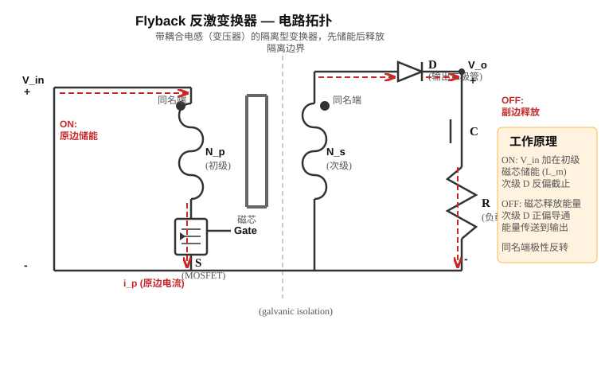

## 先讲清楚

开关感性负载时，最麻烦的是电感电流不能突然变成 0。开关一关断，电感会想办法维持原来的电流。如果没有通路，电压会被抬得很高，可能击穿开关。

缓冲电路（snubber）的作用就是给这些瞬态能量一个受控路径，保护开关。

## 为什么需要缓冲电路

实际的开关器件不是理想器件。寄生电感来自 PCB 走线和引线，寄生电容（parasitic capacitance）来自器件端子，它们会形成一个 LC 谐振电路。当开关关断时，储存在杂散电感（stray inductance）中的能量 $\frac{1}{2}LI^2$ 必须有去处。

如果没有保护：

1. 杂散电感中的电流突然被切断，产生很高的电压尖峰。
2. 电压尖峰可能超过器件额定电压（rated voltage），导致器件损坏。
3. 杂散电感和寄生电容之间形成 LC 振荡，产生振铃（ringing）——一种阻尼振荡。

振铃频率为：

$$
f_r=\frac{1}{2\pi\sqrt{LC}}
$$

$L$ 用 H，$C$ 用 F。nH、pF 要先换单位。

加入缓冲电容后，总电容 $C_{total}=C_{snub}+C_{parasitic}$ 增大，所以振铃频率 $f_r=\frac{1}{2\pi\sqrt{LC_{total}}}$ 会降低。这是缓冲电路的副作用之一——虽然降低了电压尖峰，但也延长了振铃周期。

缓冲电路的用途：

- 限制 $dv/dt$
- 限制 $di/dt$
- 钳位（clamp）电压尖峰
- 阻尼（damp）振铃
- 为电感电流提供通路
- 保持开关在安全工作区（SOA）内

缓冲电路会增加损耗。它不是为了提高效率，而是为了保护器件和减小电磁干扰（EMI）。

## 缓冲电路分类

### 无极性串联 RC 缓冲电路

用于保护二极管和晶闸管（thyristor），抑制振铃。把串联的 R-C 支路并联在器件两端。

设计规则：

1. $C_{snub}\approx 3\times C_{parasitic}$
2. $R_{snub}=\sqrt{L_{stray}/C_{parasitic}}$

### 极性 RC 缓冲电路（关断缓冲）

属于 turn-off snubber。用于限制关断时的 $dv/dt$，钳位电压尖峰。电路由二极管 + R + C 构成。

工作过程：开关关断时，二极管导通，电容开始充电，拖慢了开关两端电压的上升速度。原来可能直接加在开关上的高压，转移到了电容上。之后电容储存的能量通过电阻耗散掉。

### 极性 RL 缓冲电路（开通缓冲）

属于 turn-on snubber。用于限制开通时的 $di/dt$。电路由电感 + 二极管 + R 构成。

工作过程：电感串联在开关回路中，开通时电感限制电流上升速度。关断时，二极管和电阻为电感能量提供放电通路。

设计要点：控制关断时的电压尖峰，可能会导致开通时的电流尖峰变大，反之亦然。缓冲电路设计始终是一个权衡（trade-off）。

## 在感性负载电路上添加 Snubber

考试经常给一个感性负载开关电路，让你"添加缓冲电路"。这是必考题型（2024Q3b），关键是知道往哪里画、画什么类型。

### 加 Snubber 的固定画法

拿到一个感性负载开关电路（开关管 + 续流二极管 + 电感 + 电源），加缓冲电路分三步：

**第一步：识别需要保护什么**

- 开关关断时出现电压尖峰？→ 需要关断缓冲（turn-off snubber）
- 开关开通时电流上升太快？→ 需要开通缓冲（turn-on snubber）
- 有 LC 振铃？→ 需要 RC 阻尼

**第二步：画关断缓冲（最常考）**

关断缓冲 = 标准 RCD 电路：电阻 $R$ 和电容 $C$ 并联，再与二极管 $D$ 串联，整个支路并联在开关管两端。

结构关系：$D$ 串联在主回路中，$R$ 与 $C$ 并联在一起。这不是三者都串联，$R$ 和 $C$ 是并联的——$R$ 提供放电路径，$C$ 吸收瞬态能量。

具体画法：
1. 二极管 $D$ 的阴极接开关的集电极（或 MOSFET 的漏极，即高压侧）
2. 二极管 $D$ 的阳极接节点 A
3. 电容 $C$ 一端接节点 A，另一端接开关的发射极（或源极，即地）
4. 电阻 $R$ 一端接节点 A，另一端接开关的发射极（或源极，即地）
5. 所以 $R$ 和 $C$ 并联在节点 A 和地之间，$D$ 从漏极串联到节点 A

回忆工作过程：开关关断 → 电感电流不能突然消失 → 电流通过 $D$ 给 $C$ 充电 → 电容电压缓慢上升 → 限制了开关两端的 $dv/dt$ → 保护开关。开关导通时，$C$ 上的电荷通过 $R$ 放电，为下一次关断做准备。

**第三步：画开通缓冲（较少考）**

开通缓冲 = 电感串联在开关回路中，再加一个二极管+电阻并联支路给电感放电。

具体画法：
1. 电感串联在开关和负载之间
2. 二极管+电阻并联在电感两端
3. 开通时电感限流 $di/dt$，关断时二极管+电阻给电感能量放掉

### 例题 A：加关断缓冲

已知：一个 DC 电路，电源 $V_{dc}=200\,\mathrm{V}$，开关管 S1（MOSFET），续流二极管 D1，电感 $L=1\,\mathrm{mH}$。要求加一个关断缓冲（turn-off snubber），限制 $dv/dt$。

**画法说明：**

1. 在 S1 的漏极和源极之间，并联一个 RCD 支路
2. 电容 $C$ 一端接漏极，另一端接电阻 $R$
3. 电阻 $R$ 的另一端接源极（地）
4. 二极管方向：阳极接电容侧（即 R-C 连接点），阴极接漏极
5. 这样当 S1 关断时，电感电流通过 D1 和缓冲二极管给电容充电

结果：S1 关断时，电压不会瞬间从 0 跳到 $V_{dc}$，而是被电容"拖慢"了上升速度。

### 例题 B：选缓冲电路类型

题目问："该电路需要哪种类型的缓冲电路？为什么？"

答题模板（直接抄）：

> 需要关断缓冲电路（turn-off snubber），类型为极性 RCD 缓冲电路。
>
> 理由：该电路含感性负载，开关关断时电感电流不能突变，会产生很高的电压尖峰，可能超过开关管的额定电压。关断缓冲电路通过电容吸收电流、限制 $dv/dt$，将电压尖峰钳位到安全值。标准 RCD 缓冲电路中，$R$ 与 $C$ 并联，再与 $D$ 串联，整个支路并联在开关管两端。关断时二极管导通、电容充电限制电压上升速率；导通时电容通过电阻放电，为下一次关断做准备。

### Snubber 选型决策流程（2024Q3b 型，8 分）

考试给一个感性负载开关电路，问"选哪种 snubber、为什么、怎么画"。按以下决策树回答：

**第 1 步：判断问题是什么。**

| 问题 | 现象 | 选什么 |
|---|---|---|
| 关断时电压尖峰过大 | $V_{DS}$ 或 $V_{CE}$ 超过额定值 | 关断缓冲（turn-off snubber）= RCD |
| 开通时电流上升太快 | $di/dt$ 过大，可能损坏器件 | 开通缓冲（turn-on snubber）= RL |
| LC 振铃（ringing） | 电压/电流波形有高频振荡 | 串联 RC 阻尼 |

**第 2 步：写理由（4 分答题模板）。**

> 选用极性 RCD 关断缓冲电路（turn-off snubber）。
>
> 理由：
> 1. 电路含感性负载，开关关断时电感电流不能突变。
> 2. 电感储能 $\frac{1}{2}LI^2$ 必须有释放通路，否则产生高电压尖峰。
> 3. RCD 缓冲电路中，$R$ 与 $C$ 并联、再与 $D$ 串联，整个支路并联在开关管两端。电容为电感电流提供暂态通路，限制 $dv/dt$；电阻耗散电感能量（导通期间电容通过 $R$ 放电）；二极管保证关断时电容能被充电。
> 4. 将开关轨迹限制在安全工作区（SOA）内。

**第 3 步：画电路（4 分）。**

关断缓冲的画法——标准 RCD 支路并联在开关管两端。电路拓扑：$R$ 与 $C$ 并联，再与 $D$ 串联。

```
        Drain (或 Collector)
        │
        ├── D_snub (阴极↓阳极) ──┬── 节点 A
        │                        │
        │              ┌── C_snub ──┐
        │              │             │
        │              ├── R_snub ──┤
        │              │             │
        └──────────────┴─────────────┴── Source (或 Emitter / GND)
```

说明：$D_{snub}$ 阴极接漏极（高压侧），阳极接节点 A。$C_{snub}$ 和 $R_{snub}$ 都并联在节点 A 与地之间。

具体接法：
1. 二极管 $D_{snub}$：阴极接开关管漏极（高压侧），阳极接节点 A
2. 电容 $C_{snub}$：一端接节点 A，另一端接源极（地）
3. 电阻 $R_{snub}$：一端接节点 A，另一端接源极（地），与 $C_{snub}$ 并联

**工作过程叙述（概念题加分）：**

- **开关导通时：** 电容 $C_{snub}$ 上的电压通过电阻 $R_{snub}$ 放电。二极管 $D_{snub}$ 阴极接高压侧（导通时为低电位），阳极接电容端（电容电压为正），所以 $D_{snub}$ 可能短暂导通后截止——关键是电容通过 $R$ 放电，为下一次关断腾出"充电空间"。
- **开关关断时：** 电感电流不能突变，电流通过 $D_{snub}$ 给 $C_{snub}$ 充电。电容电压从 0 缓慢上升，限制了开关两端的 $dv/dt$。之后电容储存的能量通过 $R_{snub}$ 耗散掉。

> **对比无缓冲的情况：** 无缓冲时开关关断，杂散电感中的能量全部加到寄生电容上，产生 $V_{peak}=I\sqrt{L/C}$ 的高压尖峰。加了缓冲电容后，等效电容增大，峰值电压降低。

## 感性负载基本公式

电感公式：

$$
v_L=L\frac{di}{dt}
$$

所以：

$$
\frac{di}{dt}=\frac{v_L}{L}
$$

如果电压越大，电流变化越快。关断时电感为了让电流继续流，会产生高电压。

## 常见保护办法

| 场景 | 常用电路 | 作用 |
|---|---|---|
| DC 感性负载 | 续流二极管（freewheel diode） | 给电感电流续流 |
| 开关电压尖峰 | RCD 钳位 / TVS | 限制开关峰值电压 |
| LC 振铃 | 串联 RC 缓冲电路 | 阻尼振荡 |
| 关断 $dv/dt$ 太大 | RC / RCD 缓冲电路 | 让电压上升慢一点 |
| 开通 $di/dt$ 太大 | 串联电感 | 限制电流上升速度 |

画图时必须画出瞬态电流路径（transient current path）。

## 例题 1：振铃频率

已知杂散电感 $L=800\,\mathrm{nH}$，寄生电容 $C=300\,\mathrm{pF}$。求振铃频率。

换单位：

$$
L=800\times10^{-9}\,\mathrm{H}
$$

$$
C=300\times10^{-12}\,\mathrm{F}
$$

代入：

$$
f_r=\frac{1}{2\pi\sqrt{800\times10^{-9}\cdot300\times10^{-12}}}
$$

$$
f_r\approx10.3\,\mathrm{MHz}
$$

## Snubber 功率怎么估

如果每次开关周期吸收电感能量，那么每个开关周期杂散电感中储存的能量必须被耗散掉：

$$
E_L=\frac12LI^2
$$

平均功率：

$$
P\approx E_Lf_s
$$

如果每次电容充放电：

$$
E_C=\frac12CV^2
$$

$$
P\approx E_Cf_s
$$

如果题目直接给电阻电流波形，就用：

$$
P_R=I_{rms}^2R
$$

### 三种损耗估算公式的适用条件（别搞混）

| 场景 | 用哪个公式 | 含义 |
|---|---|---|
| 每个周期杂散电感释放全部储能 | $P=\frac{1}{2}LI^2 f_s$ | 每个周期 $\frac{1}{2}LI^2$ 被电阻耗散 |
| 电容每次充放电（电压已知） | $P=\frac{1}{2}CV^2 f_s$ | 每个周期 $\frac{1}{2}CV^2$ 被电阻耗散 |
| 题目直接给了电阻上的电流 | $P=I_{rms}^2 R$ | 直接算平均功耗 |

记住：$f_s$ 一定不能漏。储能是一次性的，功率是每秒多少次，所以要乘频率。

## 例题 2：完整 Snubber 数值题（模拟 2022Q4ab，12 分）

这道题覆盖了 snubber 考试的核心题型。必须能独立复现每一步。

### 已知

一个开关电路工作在 $100\,\mathrm{kHz}$，关断电流 $I=10\,\mathrm{A}$。杂散电感 $L_{stray}=2\,\mu\mathrm{H}$，寄生电容 $C_{parasitic}=50\,\mathrm{pF}$。开关管额定电压 $400\,\mathrm{V}$。要求加一个 RCD 关断缓冲电路，选择合适的缓冲电容和电阻。

### 第 1 部分：缓冲电路的作用（4 分答题模板）

> 缓冲电路（snubber）的作用：
>
> 1. **限制关断电压尖峰**：关断时电感电流不能突变，缓冲电容为电感电流提供暂态通路，避免开关两端出现过高的电压尖峰。
> 2. **限制 $dv/dt$**：电容充电过程拖慢了电压上升速率，保护开关管不因过高的 $dv/dt$ 而误触发或损坏。
> 3. **阻尼振铃（ringing）**：杂散电感和寄生电容形成 LC 谐振，缓冲电路中的电阻消耗振荡能量，减小 EMI。
> 4. **限制 $di/dt$**（部分电路）：串联电感型缓冲可限制开通时的电流变化率。

### 第 2 部分：计算 $di/dt$（3 分）

$di/dt$ 就是开关关断瞬间电流的变化率。用感性公式：

$$
\frac{di}{dt}=\frac{V}{L_{stray}}
$$

公式中的 $V$ 是关断瞬间杂散电感两端的电压。在无缓冲的硬关断场景下，这个电压约等于直流母线电压 $V_{dc}$。

**$V_{dc}$ 怎么来？** 两种情况：

1. **题目直接给了 $V_{dc}$。** 比如"直流母线电压 $V_{dc}=200\,\mathrm{V}$"，直接用。
2. **题目给了交流输入电压。** 比如"输入为 $220\,\mathrm{V}$（RMS）"，则经过整流后的直流母线电压为 $V_{dc}=\sqrt{2}\times V_{rms}=\sqrt{2}\times220\approx311\,\mathrm{V}$。

本题假设电源电压 $V_{dc}=200\,\mathrm{V}$（来自 2022Q4ab 题目给定的直流母线电压）：

$$
\frac{di}{dt}=\frac{200}{2\times10^{-6}}=10^8\,\mathrm{A/s}=100\,\mathrm{A/\mu s}
$$

这是无缓冲时的电流变化率。如果有串联电感型缓冲，$di/dt$ 会减小。

### 第 3 部分：计算峰值电压（2 分）

无缓冲时，杂散电感中储存的能量全部转化为寄生电容上的电压：

能量守恒：

$$
\frac{1}{2}L_{stray}I^2=\frac{1}{2}C_{parasitic}V_{peak}^2
$$

解出峰值电压：

$$
V_{peak}=I\sqrt{\frac{L_{stray}}{C_{parasitic}}}
$$

代入数值：

$$
V_{peak}=10\times\sqrt{\frac{2\times10^{-6}}{50\times10^{-12}}}
$$

先算比值：

$$
\frac{2\times10^{-6}}{50\times10^{-12}}=\frac{2}{50}\times10^{6}=0.04\times10^{6}=4\times10^{4}
$$

开根号：

$$
\sqrt{4\times10^{4}}=200
$$

所以：

$$
V_{peak}=10\times200=2000\,\mathrm{V}
$$

**远超 $400\,\mathrm{V}$ 额定电压**，必须加缓冲。

加上缓冲电容后，等效电容增大，$V_{peak}$ 降低。设缓冲电容 $C_{snub}$，则总电容 $C_{total}=C_{snub}+C_{parasitic}$。要使 $V_{peak}\leq400\,\mathrm{V}$：

$$
C_{snub}+C_{parasitic}\geq\frac{LI^2}{V_{peak}^2}=\frac{2\times10^{-6}\times100}{160000}=\frac{2\times10^{-4}}{1.6\times10^{5}}=1.25\times10^{-9}\,\mathrm{F}=1.25\,\mathrm{nF}
$$

所以：

$$
C_{snub}\geq1.25\,\mathrm{nF}-50\,\mathrm{pF}\approx1.2\,\mathrm{nF}
$$

这个 $1.2\,\mathrm{nF}$ 是从能量守恒严格推出来的：要保证峰值电压不超过 $400\,\mathrm{V}$，缓冲电容至少要 $1.2\,\mathrm{nF}$。

---

**两种方法的关系（必须搞清楚）：**

上面出现了两个不同的电容值——$1.2\,\mathrm{nF}$ 和下面的 $150\,\mathrm{pF}$，差了将近 8 倍。这不是算错了，而是两种不同的设计思路，适用场景不同：

| 方法 | 公式 | 结果 | 适用场景 |
|---|---|---|---|
| 能量守恒法 | $C_{snub}\geq\dfrac{LI^2}{V_{peak}^2}-C_{parasitic}$ | $1.2\,\mathrm{nF}$ | 需要将峰值电压钳位到某个具体值（如不超过额定电压） |
| 经验设计规则 | $C_{snub}=3\times C_{parasitic}$ | $150\,\mathrm{pF}$ | 抑制振铃、阻尼 LC 谐振，作为初始设计起点 |

**优先级：**

1. **题目要求钳位到特定电压时**（如"使 $V_{peak}\leq400\,\mathrm{V}$"），用能量守恒法，算出 $1.2\,\mathrm{nF}$。$150\,\mathrm{pF}$ 在这种情况下不够用。
2. **题目只要求抑制振铃**（如"设计一个阻尼振铃的缓冲电路"），用 $3\times C_{parasitic}$ 经验规则，算出 $150\,\mathrm{pF}$。
3. **实际工程中**，$150\,\mathrm{pF}$ 是起步值，再根据电压钳位需求往上加。两个值不矛盾——$150\,\mathrm{pF}$ 是"至少要这么多来阻尼振铃"，$1.2\,\mathrm{nF}$ 是"如果要硬钳位到 $400\,\mathrm{V}$ 则至少要这么多"。
4. **考试时**，看题目问什么就用什么。如果题目给定了允许的峰值电压，用能量守恒法；如果题目只给了设计规则，用经验公式。

---

下面用设计规则再算一遍（阻尼振铃场景）：

$$
C_{snub}=3\times50=150\,\mathrm{pF}
$$

缓冲电阻（设计规则）：

$$
R_{snub}=\sqrt{\frac{L_{stray}}{C_{parasitic}}}=\sqrt{\frac{2\times10^{-6}}{50\times10^{-12}}}=200\,\Omega
$$

### 第 4 部分：电阻功耗（3 分）

缓冲电阻上消耗的功率。每个开关周期，杂散电感中的储能被电阻耗散掉：

$$
P_R=\frac{1}{2}L_{stray}I^2\times f_s
$$

代入：

$$
P_R=\frac{1}{2}\times2\times10^{-6}\times10^2\times100\times10^3
$$

逐步计算：

$$
\frac{1}{2}\times2\times10^{-6}=1\times10^{-6}
$$

$$
1\times10^{-6}\times100=1\times10^{-4}
$$

$$
1\times10^{-4}\times100\times10^{3}=1\times10^{-4}\times10^{5}=10\,\mathrm{W}
$$

**电阻功耗 $P_R=10\,\mathrm{W}$。** 这个电阻必须选 10W 以上的功率电阻。

### 第 5 部分：振铃频率（4 分）

振铃频率由杂散电感和寄生电容决定：

$$
f_r=\frac{1}{2\pi\sqrt{L_{stray}\cdot C_{parasitic}}}
$$

代入：

$$
f_r=\frac{1}{2\pi\sqrt{2\times10^{-6}\times50\times10^{-12}}}
$$

$$
2\times10^{-6}\times50\times10^{-12}=100\times10^{-18}=10^{-16}
$$

$$
\sqrt{10^{-16}}=10^{-8}
$$

$$
f_r=\frac{1}{2\pi\times10^{-8}}=\frac{10^8}{2\pi}\approx\frac{10^8}{6.283}\approx1.59\times10^7\,\mathrm{Hz}\approx15.9\,\mathrm{MHz}
$$

**$f_r\approx15.9\,\mathrm{MHz}$。**

注意：加了缓冲电容后，等效电容增大，振铃频率会降低。这是缓冲电路的另一个好处——把高频振铃移到更低的频率，更容易被 EMI 滤波器吸收。

### 例题总结：逐问对照

| 真题子问 | 对应计算 | 关键公式 |
|---|---|---|
| 缓冲电路作用 | 文字回答（4条） | — |
| 电阻功耗 | $P=\frac{1}{2}LI^2 f_s$ | 每周期耗散储能 × 频率 |
| $di/dt$ | $\frac{di}{dt}=\frac{V}{L}$ | 关断瞬间电压 / 杂散电感 |
| 峰值电压 | $V_{peak}=I\sqrt{L/C}$ | 能量守恒 |
| 振铃频率 | $f_r=\frac{1}{2\pi\sqrt{LC}}$ | LC 谐振 |

## 反激（Flyback）为什么常用于隔离



普通 buck、boost、buck-boost 都没有电气隔离（galvanic isolation）。题目要求隔离（isolation）时，常选反激（flyback）。

反激变换器可以理解成带耦合电感（coupled inductor）/ 变压器（transformer）的 buck-boost。它用一个变压器代替了独立电感，初级（primary）和次级（secondary）通过磁芯耦合，但直流不导通，所以实现了电气隔离。

### 同名端标记法

同名端标记法（dot convention）规定了变压器的极性：

- 当电流从初级的同名端（dotted terminal）流入时，次级同名端为高电位。
- 即初级和次级的同名端电压极性相同。

这决定了反激的工作模式：开关导通时，初级储能，次级被反向偏置，二极管截止；开关关断时，同名端极性反转，次级二极管正偏导通，能量传送到输出。

### 能量传递过程

1. 开关导通（switch ON）：电流流过初级线圈，磁芯储存能量 $\frac{1}{2}L_m I_p^2$，次级二极管反偏截止。
2. 开关关断（switch OFF）：磁芯中储存的能量需要释放，次级电压极性反转，二极管正偏导通，能量传送到输出。

这就是"先储能、后释放"的反激工作原理。

### 伏秒平衡推导

对初级电感应用伏秒平衡（volt-second balance）：

$$
\int v_L\,dt = 0
$$

在开关导通期间（$0$ 到 $t_{on}$），初级两端电压为 $V_{in}$：

$$
V_{in}\times t_{on}
$$

在开关关断期间（$t_{on}$ 到 $T$），次级二极管导通，输出电压折算到初级为 $\frac{N_1}{N_2}V_{out}$，方向与 $V_{in}$ 相反：

$$
-\frac{N_1}{N_2}V_{out}\times(T-t_{on})
$$

伏秒平衡：

$$
V_{in}\times t_{on}-\frac{N_1}{N_2}V_{out}\times(T-t_{on})=0
$$

令 $D=t_{on}/T$，解出输出电压：

$$
V_{out}=V_{in}\times\frac{D}{1-D}\times\frac{N_2}{N_1}
$$

其中 $N_2/N_1$ 是匝比（turns ratio），$D$ 是占空比（duty cycle）。

### 输出电压纹波

$$
\frac{\Delta V_{out}}{V_{out}}=\frac{DT}{RC}
$$

$R$ 是负载（load）电阻，$C$ 是输出滤波电容，$T$ 是开关周期。

## 例题 3：反激选择题

题目：输入 $16$–$32\,\mathrm{V}$，输出隔离 $24\,\mathrm{V}$，选什么变换器？

答案写法：

选用反激变换器（flyback converter）。
理由：它通过耦合电感 / 变压器提供电气隔离，输出电压可通过占空比和匝比来控制。

如果题目要求关系式：

$$
V_o=V_{in}\frac{N_s}{N_p}\frac{D}{1-D}
$$

## 例题 4：反激变换器完整设计（模拟 2024Q3aii/2025Q3b，8 分）

这道题覆盖了反激变换器考试的核心计算。必须能独立复现每一步。

### 已知

设计一个反激变换器（flyback converter），参数如下：

- 输入电压：$V_{in}=24\,\mathrm{V}$
- 输出电压：$V_o=12\,\mathrm{V}$
- 输出功率：$P_o=24\,\mathrm{W}$
- 开关频率：$f=100\,\mathrm{kHz}$
- 工作在连续导通模式（CCM，continuous conduction mode）

求：匝比（turns ratio）、占空比（duty cycle）、初级电感值（primary inductance）、输出二极管的反向峰值电压（PIV，peak inverse voltage）。

### 第 1 步：确定匝比

反激变换器的输出电压公式：

$$
V_o=V_{in}\frac{N_s}{N_p}\frac{D}{1-D}
$$

其中 $N_p$ 是初级匝数，$N_s$ 是次级匝数，$n=N_s/N_p$ 是匝比。

反激变换器中，匝比和占空比是两个独立的设计变量。题目通常给定 $V_{in}$、$V_o$ 和一个额外条件（比如指定占空比或匝比），然后求另一个。本题没有额外指定，我们先根据合理的工程经验选取匝比。

**经验选取：** 反激变换器常用 $D=0.5$ 左右工作。取 $D=0.5$，代入电压公式：

$$
n=\frac{N_s}{N_p}=\frac{V_o}{V_{in}}\times\frac{1-D}{D}=\frac{12}{24}\times\frac{0.5}{0.5}=0.5
$$

即 $N_s:N_p=1:2$，次级匝数是初级的一半。

> **如果题目直接指定了匝比或占空比，直接代公式算另一个，跳过经验选取。** 比如题目说"匝比为 1:3"，就用 $D=\frac{V_o}{V_o+V_{in}\cdot n}$ 求占空比。

### 第 2 步：求占空比

由反激电压公式变形：

$$
V_o=V_{in}\frac{n\cdot D}{1-D}
$$

代入 $n=0.5$：

$$
12=24\times\frac{0.5D}{1-D}
$$

$$
12(1-D)=12D
$$

$$
12-12D=12D
$$

$$
12=24D
$$

$$
D=0.5
$$

**占空比 $D=0.5$。**

### 第 3 步：求初级电感值

反激变换器的输入功率等于输出功率（假设效率 100%）：

$$
P_{in}=P_o=24\,\mathrm{W}
$$

输入电流平均值：

$$
I_{in,avg}=\frac{P_{in}}{V_{in}}=\frac{24}{24}=1\,\mathrm{A}
$$

在 CCM 下，反激变换器的输入电流只在开关导通时流动（$DT$ 期间），所以初级电流平均值与输入电流的关系为：

$$
I_{p,avg}=I_{in,avg}\times\frac{1}{D}=\frac{1}{0.5}=2\,\mathrm{A}
$$

> 为什么乘 $1/D$？因为输入电流只在导通时间 $DT$ 内流过，要维持平均值为 $1\,\mathrm{A}$，导通期间的平均电流就是 $1/D$ 倍。

对于 CCM 工作的反激变换器，初级电感（primary inductance，也叫磁化电感 magnetizing inductance $L_m$）的设计条件是保证电流连续。最小电感值为：

$$
L_m=\frac{V_{in}\cdot D}{f\cdot\Delta I_p}
$$

其中 $\Delta I_p$ 是初级电流纹波（ripple）。工程上取纹波比 $r=\Delta I_p/I_{p,avg}=0.4$（即纹波为平均值的 40%，保证 CCM）：

$$
\Delta I_p=r\times I_{p,avg}=0.4\times2=0.8\,\mathrm{A}
$$

代入：

$$
L_m=\frac{24\times0.5}{100\times10^3\times0.8}=\frac{12}{80000}=150\,\mu\mathrm{H}
$$

**初级电感 $L_m=150\,\mu\mathrm{H}$。**

> **如果题目没有给纹波比：** 可以用边界条件法——令纹波等于 2 倍平均电流（即 $\Delta I_p=2I_{p,avg}$），此时恰好处于 CCM/DCM 边界，实际电感取此值的 2–3 倍即可保证 CCM。或者如果题目明确说 DCM 工作，计算方法完全不同。

### 第 4 步：求二极管反向峰值电压（PIV）

这是反激题的高频考点。PIV 是**开关导通期间**二极管承受的最大反向电压，不是开关关断期间。开关关断时二极管是导通的，只承受很小的正向压降，不存在反向电压。

分析开关导通期间的电路状态：

1. 开关 ON 时，初级两端电压为 $V_{in}$（同名端为正）。
2. 根据同名端规则，次级同名端也为正，但由于二极管的接法，二极管阳极（接次级同名端）处于低电位，二极管反偏截止。
3. 次级感应电压为 $V_{in}\times N_s/N_p$，这个电压反向加在二极管上。
4. 同时输出电容维持的输出电压 $V_o$ 也正向加在二极管的反向端（阴极侧）。
5. 两个电压同向叠加，所以：

$$
PIV=V_o+\frac{N_s}{N_p}\times V_{in}
$$

代入：

$$
PIV=12+0.5\times24=12+12=24\,\mathrm{V}
$$

**二极管反向峰值电压 $PIV=24\,\mathrm{V}$。**

> **推导细节：** 开关导通时，$V_{in}$ 加在初级上，次级感应电压为 $V_{in}\times N_s/N_p$。从二极管看：阳极接次级同名端（感应电压的低电位端），阴极接 $V_o$（高电位），所以二极管两端的反向电压 = $V_o$ + 感应电压，两者同向叠加。开关关断时二极管导通续流，承受的是正向压降，不是反向电压。

### 第 5 步：次级电流（辅助计算）

次级电流平均值等于输出电流：

$$
I_{s,avg}=I_o=\frac{P_o}{V_o}=\frac{24}{12}=2\,\mathrm{A}
$$

次级电流只在开关关断时流动（$(1-D)T$ 期间），所以次级电流的有效值：

$$
I_{s,rms}=\frac{I_o}{\sqrt{1-D}}=\frac{2}{\sqrt{0.5}}=\frac{2}{0.707}\approx2.83\,\mathrm{A}
$$

这个值用于选择二极管的额定电流和计算次级铜损。

### 计算结果汇总

| 参数 | 符号 | 数值 |
|---|---|---|
| 匝比 | $n=N_s/N_p$ | $0.5$（即 $1:2$） |
| 占空比 | $D$ | $0.5$ |
| 初级电感 | $L_m$ | $150\,\mu\mathrm{H}$ |
| 二极管 PIV | $PIV$ | $24\,\mathrm{V}$ |
| 次级电流有效值 | $I_{s,rms}$ | $2.83\,\mathrm{A}$ |

### 例题总结：反激设计必做清单

| 步骤 | 做什么 | 用什么公式 |
|---|---|---|
| 1 | 确定匝比 | $n=\frac{V_o}{V_{in}}\cdot\frac{1-D}{D}$ |
| 2 | 求占空比 | $D=\frac{V_o}{V_o+n\cdot V_{in}}$（由电压公式变形） |
| 3 | 求初级电感 | $L_m=\frac{V_{in}\cdot D}{f\cdot\Delta I_p}$，$\Delta I_p=r\cdot I_{p,avg}$ |
| 4 | 求二极管 PIV | $PIV=V_o+\frac{N_s}{N_p}\cdot V_{in}$ |
| 5 | 求次级电流 | $I_{s,rms}=I_o/\sqrt{1-D}$ |

## 固定套路

缓冲电路题按这几步：

1. 判断问题：过压（overvoltage）、$di/dt$、$dv/dt$、振铃（ringing）还是隔离（isolation）
2. 感性负载先找电流关断路径
3. 计算 $di/dt$ 用 $v = L\,di/dt$
4. 计算振铃频率用 $f = 1/(2\pi\sqrt{LC})$
5. 计算损耗用 $E\cdot f_s$ 或 $I_{rms}^2 R$
6. 需要隔离就选反激（flyback）

反激设计题按这几步：

1. 列出已知量：$V_{in}$、$V_o$、$P_o$、$f$
2. 用 $V_o=V_{in}\cdot n\cdot D/(1-D)$ 求匝比或占空比（通常先取 $D=0.5$ 估算匝比）
3. 用 $L_m=V_{in}D/(f\cdot\Delta I_p)$ 求初级电感，取纹波比 $r=0.4$
4. 用 $PIV=V_o+(N_s/N_p)\cdot V_{in}$ 求二极管反向峰值电压
5. 用 $I_{s,rms}=I_o/\sqrt{1-D}$ 求次级电流有效值

## 别丢分

- 缓冲电路不是主功率变换器。
- 感性负载关断必须给电流路径。
- RC 缓冲电路通常是串联 R-C 支路。
- $f_r$ 公式别漏 $2\pi$。
- 缓冲电路损耗要乘开关频率。
- 缓冲电路设计始终存在权衡：控制关断电压尖峰可能导致开通电流尖峰变大，反之亦然。
- 杂散电感中储存的能量每个开关周期都会产生，必须每个周期都耗散掉。
- 反激有隔离，普通 buck-boost 没有。
- 电阻功耗 $P=\frac{1}{2}LI^2 f_s$ 中，$I$ 是关断瞬间的电流值（不是平均电流），$L$ 是杂散电感（不是主电感），$f_s$ 是开关频率。
- 峰值电压公式 $V_{peak}=I\sqrt{L/C}$ 中，$L$ 和 $C$ 都是寄生参数（杂散电感和寄生电容）。加缓冲电容后，等效 $C$ 变大，$V_{peak}$ 降低。
- 振铃频率 $f_r=\frac{1}{2\pi\sqrt{LC}}$ 用的是杂散电感和寄生电容，不是外加的缓冲电容。加缓冲电容会降低 $f_r$。
- $di/dt=V/L$ 中 $V$ 是关断瞬间电感两端电压，通常是电源电压；$L$ 是杂散电感。
- 缓冲电路设计规则：$C_{snub}\approx 3C_{parasitic}$，$R_{snub}=\sqrt{L_{stray}/C_{parasitic}}$。但这个经验公式只适用于阻尼振铃；如果题目要求钳位到特定电压（如不超过额定电压），必须用能量守恒法 $C_{snub}\geq LI^2/V_{peak}^2-C_{parasitic}$ 算出更大的值。考试时看题目问什么就用什么。
- 单位换算：nH = $10^{-9}$ H，pF = $10^{-12}$ F，$\mu$H = $10^{-6}$ H。考试里最常见的丢分点就是单位没换。
- 反激二极管 PIV 公式是 $PIV=V_o+(N_s/N_p)\cdot V_{in}$，两个电压同向叠加，不要写成相减。PIV 发生在**开关导通期间**：开关 ON 时初级电压 $V_{in}$ 通过变压器耦合到次级，加上输出电压 $V_o$，两者同向叠加在截止的二极管上。开关关断时二极管是导通的，只承受正向压降，不是反向电压。
- 反激电压公式 $V_o=V_{in}\cdot n\cdot D/(1-D)$ 中，$n=N_s/N_p$（次级/初级），不是 $N_p/N_s$。搞反了匝比，占空比和 PIV 全部算错。
- 反激初级电感用 $L_m=V_{in}D/(f\cdot\Delta I_p)$，注意 $\Delta I_p$ 是纹波电流，不是平均电流。如果题目没给纹波比，取 $r=0.4$。
- 反激次级电流有效值 $I_{s,rms}=I_o/\sqrt{1-D}$，分母是 $\sqrt{1-D}$ 不是 $\sqrt{D}$，因为次级电流只在关断期间（$1-D$ 时间内）流动。
