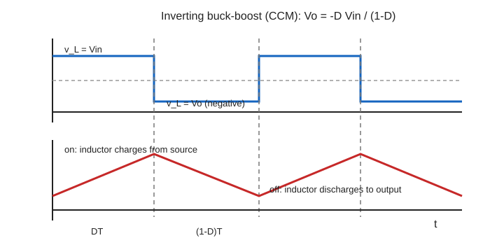

## 先讲清楚

DC-DC converter 不是靠电阻分压来降压或升压，而是靠开关周期性地给电感充电、放电。稳态时，电感电流每个周期回到原来的值。

所以有一个最重要的条件：电感一周期平均电压为 0。

$$
\int_0^T v_L(t)\,dt=0
$$

也就是：

$$
D v_{L,on}+(1-D)v_{L,off}=0
$$

这叫 volt-second balance。Buck、Boost、Buck-Boost 的公式都从它来。

## 通用做法

每道 DC-DC 题都先写这几步：

```text
1. 画 switch ON 等效电路
2. 画 switch OFF 等效电路
3. 写 v_L,on 和 v_L,off
4. 用 volt-second balance 推 V_o 和 D
5. 用 Δi_L = v_L Δt / L 算 ripple
6. 用平均电流算 I_max 和 I_min
```

Ripple：

$$
\Delta i_L=\frac{v_L\Delta t}{L}
$$

最大最小电流：

$$
I_{L,max}=I_{L,avg}+\frac{\Delta i_L}{2}
$$

$$
I_{L,min}=I_{L,avg}-\frac{\Delta i_L}{2}
$$

## Buck converter

Buck 是降压。


ON 时，输入给电感和负载：

$$
v_L=V_{in}-V_o
$$

OFF 时，电感通过 diode 续流：

$$
v_L=-V_o
$$

Volt-second balance：

$$
(V_{in}-V_o)D+(-V_o)(1-D)=0
$$

化简：

$$
V_o=DV_{in}
$$

Ripple：

$$
\Delta i_L=\frac{(V_{in}-V_o)D}{Lf_s}
$$

Buck 中电感在输出侧：

$$
I_{L,avg}=I_o
$$

## 例题 1：Buck

$V_{in}=12\,\mathrm{V}$，$V_o=5\,\mathrm{V}$，$f_s=50\,\mathrm{kHz}$，$L=100\,\mu\mathrm{H}$，$I_o=0.5\,\mathrm{A}$。求 duty 和电感电流纹波。

Duty：

$$
D=\frac{V_o}{V_{in}}=\frac{5}{12}=0.417
$$

Ripple：

$$
\Delta i_L=\frac{(12-5)\times0.417}{100\times10^{-6}\times50\times10^3}
$$

$$
\Delta i_L=0.584\,\mathrm{A}
$$

平均电感电流：

$$
I_{L,avg}=I_o=0.5\,\mathrm{A}
$$

最大最小：

$$
I_{L,max}=0.5+0.584/2=0.792\,\mathrm{A}
$$

$$
I_{L,min}=0.5-0.584/2=0.208\,\mathrm{A}
$$

$ I_{L,min}>0 $，所以是 CCM。

## Boost converter

Boost 是升压。


ON 时，电感接输入储能：

$$
v_L=V_{in}
$$

OFF 时，电感和输入一起给输出：

$$
v_L=V_{in}-V_o
$$

Volt-second balance：

$$
V_{in}D+(V_{in}-V_o)(1-D)=0
$$

化简：

$$
V_o=\frac{V_{in}}{1-D}
$$

Duty：

$$
D=1-\frac{V_{in}}{V_o}
$$

Boost 中电感在输入侧：

$$
I_{L,avg}=I_{in}=\frac{V_oI_o}{V_{in}}
$$

## Buck-Boost

Buck-Boost 可升可降，但输出极性反相。



ON：

$$
v_L=V_{in}
$$

OFF：

$$
v_L=-|V_o|
$$

输出幅值关系：

$$
|V_o|=\frac{D}{1-D}V_{in}
$$

Duty：

$$
D=\frac{|V_o|}{V_{in}+|V_o|}
$$

输出只在 OFF interval 得到电感电流：

$$
I_o=(1-D)I_{L,avg}
$$

$$
I_{L,avg}=\frac{I_o}{1-D}
$$

## Boundary CCM

Boundary CCM 是电感电流刚好降到 0。

$$
I_{L,min}=0
$$

所以：

$$
\Delta I_L=2I_{L,avg}
$$

Buck boundary inductance 常写：

$$
L_b=\frac{(V_{in}-V_o)D}{2I_of_s}
$$

## Flyback

需要 isolation 时选 Flyback。它像 buck-boost，但用 transformer / coupled inductor 隔离输入输出。

理想关系：

$$
\frac{V_o}{V_{in}}=\frac{N_s}{N_p}\frac{D}{1-D}
$$

Switch on：primary 储能。Switch off：secondary 向输出放能。

## 固定套路

DC-DC 大题按这几行写：

```text
1. Identify topology
2. Switch ON: write v_L,on
3. Switch OFF: write v_L,off
4. Volt-second balance gives D
5. Δi_L = v_L Δt/L
6. Find I_L,avg
7. I_max/min = I_avg ± Δi/2
8. Check CCM or boundary CCM
9. Sketch v_L and i_L
```

## 别丢分

- Buck：$I_{L,avg}=I_o$。
- Boost：$I_{L,avg}=I_{in}$。
- Buck-Boost：输出反相。
- $\Delta i_L$ 是 peak-to-peak。
- Boundary CCM 用 $\Delta I=2I_{avg}$。
- 需要 isolation 时选 flyback，不选普通 buck-boost。
