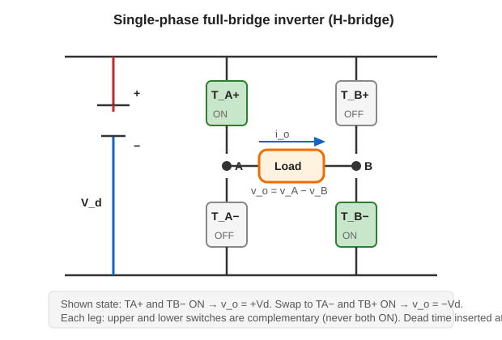
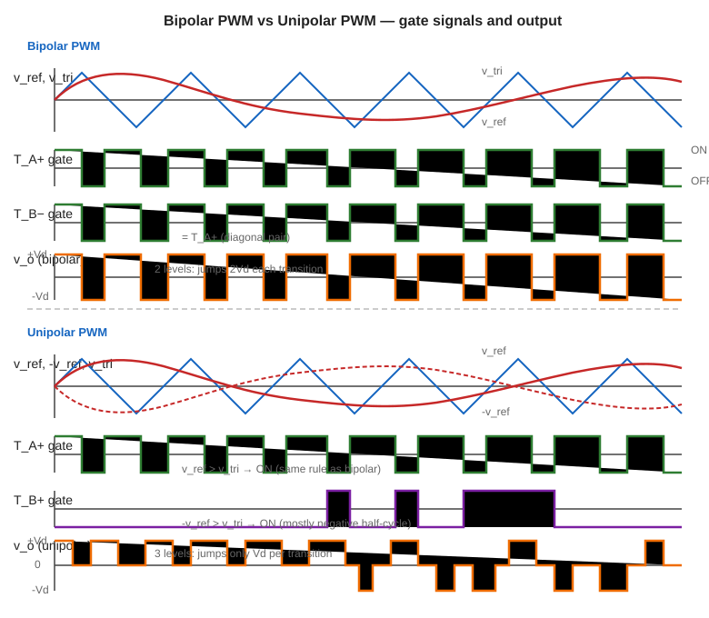
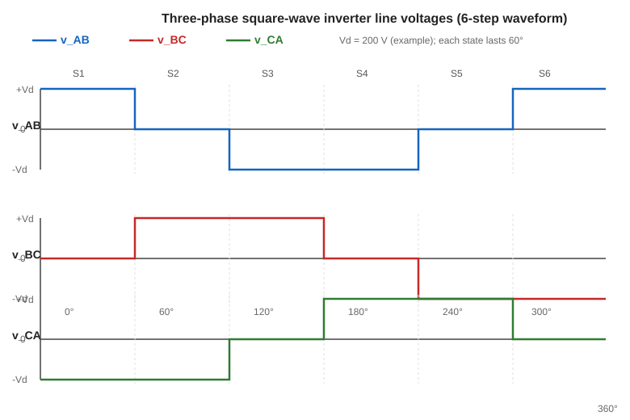

## 什么是逆变器

DC-AC 变换器叫做逆变器（inverter）。它的任务是把直流电变成交流电。输入端接直流电源，输出端产生不同频率和幅值的交流信号。

逆变器的典型应用场景包括：

- 新能源发电系统：太阳能板输出直流，需要逆变器转成交流才能并网（grid-tied）或供离网（off-grid）负载使用
- 电机驱动：控制交流电机的转速和转矩
- 不间断电源（UPS）：电池供电时将直流逆变成交流输出

逆变器按输出相数分为两类：单相逆变器和三相逆变器。基本构建单元是桥式电路（bridge circuit），由功率开关管组成。

## 功率因数

交流电路中，电压和电流之间可能存在相位差 $\theta$。功率因数（power factor）定义为：

$$
\text{PF} = \cos\theta
$$

三种功率的关系构成一个直角三角形：

- 有功功率（active power / true power）：$P = VI\cos\theta$，单位 W，是实际做功的部分
- 无功功率（reactive power）：$Q = VI\sin\theta$，单位 VAR，在电感和电容之间交换
- 视在功率（apparent power）：$S = VI$，单位 VA

三者满足：

$$
S^2 = P^2 + Q^2
$$

功率因数越接近 1，电源传输效率越高。纯电阻负载 $\theta=0$，$\text{PF}=1$；纯电感或纯电容负载 $\theta=90°$，$\text{PF}=0$。

## 先讲清楚

逆变器的实质是用开关把直流母线电压按某种规律接到负载（load）上，而不是连续地调节电压。

### 全桥逆变器电路拓扑

全桥逆变器（single-phase full-bridge inverter）由直流电源 $V_d$、四只开关管（$T_{A+}$、$T_{A-}$、$T_{B+}$、$T_{B-}$）和负载组成。

电路画法：
- 直流电源 $V_d$ 在左侧，正极在上、负极在下
- A 桥臂：$T_{A+}$（上管）接电源正极到 A 节点，$T_{A-}$（下管）接 A 节点到电源负极
- B 桥臂：$T_{B+}$（上管）接电源正极到 B 节点，$T_{B-}$（下管）接 B 节点到电源负极
- 负载接在 A 和 B 之间

每条桥臂的上管和下管不能同时导通，否则直流母线会被短路，这叫做直通（shoot-through）。

图中展示了 $T_{A+}$（上管 ON）和 $T_{B-}$（下管 ON）同时导通的状态，此时电流从电源正极经 $T_{A+}$ → 负载 → $T_{B-}$ 回到电源负极，输出 $v_o = +V_d$。如果切换到 $T_{A-}$ + $T_{B+}$ 导通，则输出 $v_o = -V_d$。

### 半桥逆变器电路拓扑

半桥逆变器（half-bridge inverter）只有两个开关管（$T_{+}$ 和 $T_{-}$）和两个串联电容分压的直流源。

电路画法：
- 直流电源 $V_d$ 在左侧，两个等值电容串联分压，中点接地
- $T_{+}$（上管）接电源正极到输出节点，$T_{-}$（下管）接输出节点到电源负极
- 负载接在输出节点和电容中点之间

半桥逆变器的基波幅值是全桥的一半（$\hat{V}_{o1}=m_aV_d/2$），结构更简单，适用于功率较小的场合。

### PWM 的基本想法

用正弦参考信号（reference）和三角载波（carrier）通过比较器（comparator）进行比较，比较结果决定开关的通断。参考信号决定基波频率和幅值，载波决定开关频率。

## 双极性 vs 单极性 PWM 门极信号与输出波形

下图对比了双极性和单极性 PWM 的门极信号和输出电压波形。这是理解两种模式区别的关键。

**双极性 PWM：**  $T_{A+}$ 和 $T_{B-}$ 的门极信号完全同步（对角管同时开/关）。输出 $v_o$ 只在 $+V_d$ 和 $-V_d$ 之间跳变，每次跳变幅度为 $2V_d$。

**单极性 PWM：**  $T_{A+}$ 的门极信号由 $v_{ref}$ vs $v_{tri}$ 决定，$T_{B+}$ 的门极信号由 $-v_{ref}$ vs $v_{tri}$ 决定——两者独立。输出 $v_o$ 在 $+V_d$、0、$-V_d$ 三个电平之间跳变，每次跳变幅度只有 $V_d$。

## $m_a$ 和 $m_f$

幅度调制比（amplitude modulation index）：

$$
m_a=\frac{\hat V_{control}}{\hat V_{tri}}
$$

它主要控制基波幅值。

频率调制比（frequency modulation index）：

$$
m_f=\frac{f_{carrier}}{f_{control}}
$$

它决定开关谐波（switching harmonics）出现在哪些频率附近。

$m_f$ 越大，谐波频率越高，越容易滤掉，但开关损耗（switching loss）也会变大。

## 谐波分析基础

逆变器的输出不是纯正弦波，里面包含谐波（harmonics）——频率为基波频率整数倍的分量。谐波会导致负载发热、产生转矩脉动、引起电磁干扰。

分析谐波的数学工具是傅里叶级数（Fourier series）。对 PWM 调制的逆变器，谐波频率的一般公式为：

$$
f_h = (j \times m_f \pm k) \times f_1
$$

其中 $j$、$k$ 为正整数，$f_1$ 为基波频率。

规律是：$j$ 为奇数时 $k$ 必须为偶数；$j$ 为偶数时 $k$ 必须为奇数。

对单极性（unipolar）PWM，$j$ 必须为偶数、$k$ 必须为奇数，这意味着谐波更加集中在高次区域，滤波器设计更容易。

## 全桥输出状态

全桥逆变器可以输出三种电平：

- $+V_d$
- $-V_d$
- 0（单极性 PWM 时会出现）

## 双极性 PWM

双极性（bipolar）PWM 只有两个输出电平：$+V_d$ 和 $-V_d$。

### 开关条件（含互补和死区）

在双极性 PWM 中，四只开关管分成两组对角：

| 条件 | $T_{A+}$ | $T_{B-}$ | $T_{A-}$ | $T_{B+}$ | 输出 $v_o$ |
|---|---|---|---|---|---|
| $v_{ref}>v_{tri}$ | ON | ON | OFF | OFF | $+V_d$ |
| $v_{ref}<v_{tri}$ | OFF | OFF | ON | ON | $-V_d$ |

**互补规则：** 同一桥臂的上下管必须互补——$T_{A+}$ 和 $T_{A-}$ 互为反相，$T_{B+}$ 和 $T_{B-}$ 互为反相。

**死区时间（dead time）：** 在开关切换瞬间，同一桥臂的上下管同时关断一小段时间（通常 $\mu s$ 级），防止直通（shoot-through）。死区时间对输出电压波形影响很小，但分析时默认忽略它，只在概念题中提到。

### 驱动波形画法

考试要求能画出双极性 PWM 的驱动波形。按以下四步：

**第 1 步：画三角载波 $v_{tri}$。** 等腰三角形，周期为 $T_s=1/f_s$，幅值从 $-1$ 到 $+1$（或 $-\hat{V}_{tri}$ 到 $+\hat{V}_{tri}$）。

**第 2 步：画正弦参考波 $v_{ref}$。** 正弦波，频率为基波频率 $f_1$，幅值 $\hat{V}_{ref}=m_a\cdot\hat{V}_{tri}$。

**第 3 步：标交点。** $v_{ref}$ 和 $v_{tri}$ 的每个交点处开关状态翻转：
- 交点上方（$v_{ref}>v_{tri}$ 区间）：$T_{A+}$ 和 $T_{B-}$ 导通，输出 $+V_d$
- 交点下方（$v_{ref}<v_{tri}$ 区间）：$T_{A-}$ 和 $T_{B+}$ 导通，输出 $-V_d$

**第 4 步：画输出波形。** $v_o$ 是脉冲波，在 $+V_d$ 和 $-V_d$ 之间跳变。脉冲宽度随 $v_{ref}$ 的正弦变化：$v_{ref}$ 正半周时 $+V_d$ 脉冲宽，负半周时 $-V_d$ 脉冲宽。

**$T_{A+}$ 的门极信号**和**$T_{A-}$ 的门极信号**互为反相（中间加死区时间空白段）。

### 例题：双极性 PWM 波形画法

**已知：** $V_d=100\,\mathrm{V}$，$m_a=0.8$，$m_f=9$，$f_1=50\,\mathrm{Hz}$。

**画出一个基波周期内的输出电压 $v_o$ 草图。**

- 载波频率：$f_s=m_f\times f_1=9\times50=450\,\mathrm{Hz}$
- 一个基波周期内有 $m_f=9$ 个载波周期，产生 9 个脉冲（每半周约 4.5 个）
- 正半周：$v_{ref}>v_{tri}$ 的区间较长，$+V_d$ 脉冲宽度大
- 负半周：$v_{ref}<v_{tri}$ 的区间较长，$-V_d$ 脉冲宽度大
- 输出在 $+100\,\mathrm{V}$ 和 $-100\,\mathrm{V}$ 之间跳变，没有 0 电平

### 优点和缺点

优点：控制简单，只需一个比较器。

缺点：输出电压每次在 $+V_d$ 和 $-V_d$ 之间跳变，跳变幅度 $2V_d$，谐波较重。

## 单极性 PWM

单极性（unipolar）PWM 每个桥臂单独调制。这是考试中选 PWM 类型题的首选答案。

### 开关条件

A 桥臂用 $v_{ref}$ 和载波比较，B 桥臂用 $-v_{ref}$ 和载波比较。

| 桥臂 | 条件 | 上管 | 下管 | 极电压 |
|---|---|---|---|---|
| A 桥臂 | $v_{ref}>v_{tri}$ | $T_{A+}$ ON | $T_{A-}$ OFF | $v_A=V_d$ |
| A 桥臂 | $v_{ref}<v_{tri}$ | $T_{A+}$ OFF | $T_{A-}$ ON | $v_A=0$ |
| B 桥臂 | $-v_{ref}>v_{tri}$ | $T_{B+}$ ON | $T_{B-}$ OFF | $v_B=V_d$ |
| B 桥臂 | $-v_{ref}<v_{tri}$ | $T_{B+}$ OFF | $T_{B-}$ ON | $v_B=0$ |

输出电压：

$$
v_o=v_A-v_B
$$

所以输出可以是 $+V_d$（A高B低）、0（A和B同电平）、$-V_d$（A低B高）三种电平。

**互补规则和死区与双极性相同：** 每条桥臂的上下管互补，切换瞬间插入死区时间。

### 驱动波形画法

单极性 PWM 的画法比双极性多一步，因为有两条桥臂独立调制：

**第 1 步：画三角载波 $v_{tri}$。** 与双极性相同。

**第 2 步：画 $v_{ref}$ 和 $-v_{ref}$。** 两条正弦波，互为反相。

**第 3 步：A 桥臂。** $v_{ref}$ 与 $v_{tri}$ 的交点决定 $T_{A+}$ 的通断。
- $v_{ref}>v_{tri}$ 区间：$T_{A+}$ ON，$v_A=V_d$
- $v_{ref}<v_{tri}$ 区间：$T_{A-}$ ON，$v_A=0$

**第 4 步：B 桥臂。** $-v_{ref}$ 与 $v_{tri}$ 的交点决定 $T_{B+}$ 的通断。
- $-v_{ref}>v_{tri}$ 区间：$T_{B+}$ ON，$v_B=V_d$
- $-v_{ref}<v_{tri}$ 区间：$T_{B-}$ ON，$v_B=0$

**第 5 步：输出。** $v_o=v_A-v_B$。分别画出 $v_A$ 和 $v_B$，然后逐段做差。

关键观察：$v_{ref}$ 正半周期间，$-v_{ref}$ 是负值，所以 $T_{B+}$ 几乎不开，$v_B$ 大部分时间为 0，输出 $v_o$ 以 $+V_d$ 脉冲为主。负半周反过来。

### 例题：单极性 PWM 波形画法

**已知：** $V_d=100\,\mathrm{V}$，$m_a=0.8$，$m_f=9$，$f_1=50\,\mathrm{Hz}$。

**画输出电压 $v_o$ 草图，并与双极性对比。**

- 一个基波周期内，$v_o$ 在 $+V_d$、0、$-V_d$ 三个电平之间跳变
- 正半周：大部分时间为 $+V_d$，偶尔跳到 0（当 $v_{ref}$ 和 $-v_{ref}$ 的比较结果使 A、B 同电平时）
- 负半周：大部分时间为 $-V_d$，偶尔跳到 0
- 零电平处电压跳变幅度只有 $V_d$（对比双极性的 $2V_d$），EMI 更小
- 等效开关频率是双极性的 2 倍——因为每个桥臂各自以 $f_s$ 切换，但输出的电压变化频率是 $2f_s$

### 单极性的谐波更集中在高频

单极性 PWM 的谐波主要出现在 $2m_f$ 附近（而不是双极性的 $m_f$ 附近）。这意味着：
- 低频谐波更少
- 输出波形更接近正弦
- 滤波器可以更小、更便宜

## 死区时间

实际的功率开关管有有限的开关时间，不是理想的瞬间切换。如果上管关断和下管导通之间没有间隔，可能出现两管同时短暂导通的情况，导致直通（shoot-through），直流母线短路——这是灾难性的故障。

解决方案是死区时间（dead time），也叫消隐时间（blanking time）：在切换时刻，让上下两管同时关断一小段时间。

电路实现：使用两个带有偏移量的三角波分别比较上管和下管的门极（gate）信号。正偏移的三角波产生上管信号，负偏移的三角波产生下管信号。偏移量本身就形成了一个自然的时间间隔，保证两管不会同时导通。

这就是为什么上下管的门极信号是互补的（complementary）但不完全重叠——中间总有一小段"空白"。

## 例题 1：判断 PWM 类型

题目问：想降低谐波，又不改变直流输入电压，单相全桥逆变器选哪种 PWM？

答案：选单极性 PWM。

理由：

- 输出有 $+V_d$、0、$-V_d$ 三个电平。
- 等效开关频率更高，谐波集中在更高频区域。
- 输出电压每次跳变幅度更小，滤波更容易。
- 缺点是控制逻辑比双极性 PWM 复杂。

## 比较器电路怎么画

考试不要求画漂亮电路，但要画清逻辑。2025 年真题要求画 PWM 调制电路——要画出参考信号、载波信号、比较器和输出门极信号的连接关系。

**双极性 PWM 调制电路：**

1. 正弦参考信号 $v_{ref}$ 和三角载波 $v_{tri}$ 送入**比较器 1**
2. 比较器 1 输出：$v_{ref}>v_{tri}$ 时为高电平 → 直接驱动 $T_{A+}$ 和 $T_{B-}$
3. $T_{A+}$ 的门极信号经**反相器 + 死区**产生 $T_{A-}$ 的门极信号
4. $T_{B-}$ 的门极信号经**反相器 + 死区**产生 $T_{B+}$ 的门极信号

**单极性 PWM 调制电路：**

1. 正弦参考信号 $v_{ref}$ 和三角载波 $v_{tri}$ 送入**比较器 1** → 输出 A 桥臂上门极信号（驱动 $T_{A+}$）
2. 反相正弦参考信号 $-v_{ref}$ 和同一三角载波 $v_{tri}$ 送入**比较器 2** → 输出 B 桥臂上门极信号（驱动 $T_{B+}$）
3. $T_{A+}$ 门极信号经**反相器 + 死区** → $T_{A-}$ 门极信号
4. $T_{B+}$ 门极信号经**反相器 + 死区** → $T_{B-}$ 门极信号

## SPWM 基波幅值

全桥双极性 SPWM 在线性区：

$$
\hat V_{o1}\approx m_aV_d
$$

$$
V_{o1,rms}\approx\frac{m_aV_d}{\sqrt2}
$$

半桥逆变器的基波幅值是全桥的一半。题目问总 RMS、基波峰值、基波 RMS 时要看清楚是全桥还是半桥。

### 例题：谐波频率计算

**已知：** 全桥逆变器，$f_1=50\,\mathrm{Hz}$，$m_f=21$（载波频率 $f_s=1050\,\mathrm{Hz}$），双极性 PWM。

**求：最低次谐波群的中心频率。**

谐波公式：

$$
f_h=(j\times m_f\pm k)\times f_1
$$

双极性 PWM 中，$j$ 为奇数时 $k$ 为偶数，$j$ 为偶数时 $k$ 为奇数。

最低次谐波群取 $j=1$：

- $j=1$，$k=0$：$f_h=21\times50=1050\,\mathrm{Hz}$（即 $m_f$ 次谐波）
- $j=1$，$k=2$：$f_h=(21-2)\times50=950\,\mathrm{Hz}$ 和 $(21+2)\times50=1150\,\mathrm{Hz}$

所以谐波集中在 $1050\,\mathrm{Hz}$ 附近，远离 $50\,\mathrm{Hz}$ 基波。

如果换成单极性 PWM，$j$ 必须为偶数，最低次谐波群在 $2m_f=42$ 次（$2100\,\mathrm{Hz}$）附近，频率更高、更容易滤波。

### 例题：$m_a$ 和输出幅值

**已知：** 全桥 SPWM，$V_d=200\,\mathrm{V}$，$m_a=0.6$。

**求基波峰值和基波 RMS。**

$$
\hat V_{o1}=m_a V_d=0.6\times200=120\,\mathrm{V}
$$

$$
V_{o1,rms}=\frac{\hat V_{o1}}{\sqrt2}=\frac{120}{\sqrt2}=84.9\,\mathrm{V}
$$

**如果 $m_a>1$ 会怎样？** 进入过调制（overmodulation）区，输出趋向方波模式，基波幅值趋近 $4V_d/\pi$，但出现大量低次谐波。线性区公式 $m_aV_d$ 不再适用。

## 三相逆变器 6 状态完整分析

这是考试必考内容。三相逆变器有 A、B、C 三条桥臂，每条桥臂有上下两个开关管。用 1 表示上管导通（下管关断），用 0 表示下管导通（上管关断）。

三个桥臂的开关组合一共 $2^3=8$ 种，但只有 6 种有效状态。两种零矢量（000 和 111）的输出线电压全为 0。

### 6 状态真值表

下表列出 6 个有效状态的开关组合和极电压、线电压。每个状态占 60 度电角度。

| 状态 | $T_{A+}$ | $T_{B+}$ | $T_{C+}$ | $v_A$ | $v_B$ | $v_C$ | $v_{AB}$ | $v_{BC}$ | $v_{CA}$ |
|---|---|---|---|---|---|---|---|---|---|
| 1 | 1 | 0 | 0 | $V_d$ | 0 | 0 | $+V_d$ | 0 | $-V_d$ |
| 2 | 1 | 1 | 0 | $V_d$ | $V_d$ | 0 | 0 | $+V_d$ | $-V_d$ |
| 3 | 0 | 1 | 0 | 0 | $V_d$ | 0 | $-V_d$ | $+V_d$ | 0 |
| 4 | 0 | 1 | 1 | 0 | $V_d$ | $V_d$ | $-V_d$ | 0 | $+V_d$ |
| 5 | 0 | 0 | 1 | 0 | 0 | $V_d$ | 0 | $-V_d$ | $+V_d$ |
| 6 | 1 | 0 | 1 | $V_d$ | 0 | $V_d$ | $+V_d$ | $-V_d$ | 0 |

### 怎么快速填表

固定做法——拿到开关状态后，三步算出线电压：

**第 1 步：写极电压。** 上管导通（1）时极电压为 $V_d$，下管导通（0）时极电压为 0。

**第 2 步：做减法。**

$$
v_{AB}=v_A-v_B,\quad v_{BC}=v_B-v_C,\quad v_{CA}=v_C-v_A
$$

**第 3 步：检查三和为零。**

$$
v_{AB}+v_{BC}+v_{CA}=0
$$

如果加起来不等于 0，说明算错了。

### 为什么只有 6 个有效状态

8 种组合中有 2 种零矢量：

- **000**（三个下管全开）：$v_A=v_B=v_C=0$，所有线电压为 0。
- **111**（三个上管全开）：$v_A=v_B=v_C=V_d$，所有线电压为 0。

零矢量不产生输出电压，但在 PWM 调制中用来调节输出的占空比。

### 例题：三相方波线电压

三相方波模式下，每个状态持续 60 度，按 1→2→3→4→5→6→1 的顺序循环。画出一个完整周期的 $v_{AB}$ 波形。

从真值表直接读出 $v_{AB}$ 在各 60 度区间内的值：

| 区间 | 0°–60° | 60°–120° | 120°–180° | 180°–240° | 240°–300° | 300°–360° |
|---|---|---|---|---|---|---|
| 状态 | 1 | 2 | 3 | 4 | 5 | 6 |
| $v_{AB}$ | $+V_d$ | 0 | $-V_d$ | $-V_d$ | 0 | $+V_d$ |

这是一个六阶梯波（six-step waveform），正半周和负半周各有两个 $+V_d$（或 $-V_d$）区间和一个 0 区间。

上图是三相方波逆变器的三条线电压 $v_{AB}$、$v_{BC}$、$v_{CA}$ 的完整波形。注意三条波形形状相同，只是相位依次差 120 度。$v_{AB}+v_{BC}+v_{CA}=0$ 在任何时刻都成立。

**画波形的固定做法：**
1. 先写 6 状态真值表（上面的表格）
2. 逐条线电压读出每段的值
3. 画 6 个 60 度区间，每段画水平线
4. 检查：三条波形互差 120 度，每条正半周的面积 = 负半周的面积

### 方波模式基波幅值——完整推导

方波模式的基波峰值公式：

$$
\boxed{\hat{V}_{o1}=\frac{4V_d}{\pi}\approx 1.27\,V_d}
$$

这个公式适用于：**单相全桥方波的输出电压**，以及**三相全桥方波的线电压 $v_{AB}$**。

下面给出两种推导方法。方法 1 是考试最常用的直接积分法，方法 2 是用得上的快速校验法。

#### 方法 1：直接傅里叶积分（考试首选）

**第 1 步：写方波表达式。**

单相全桥方波，$v_o(\theta)$ 在 $[0,\pi)$ 为 $+V_d$，$[\pi,2\pi)$ 为 $-V_d$。

**第 2 步：傅里叶系数公式。**

方波有半波对称（$v_o(\theta+\pi)=-v_o(\theta)$），只含奇次正弦项。取半周期：

$$
b_n=\frac{2}{\pi}\int_0^{\pi}v_o(\theta)\sin(n\theta)\,d\theta,\quad n=1,3,5,...
$$

**第 3 步：代入 $v_o=V_d$。**

$$
b_n=\frac{2V_d}{\pi}\int_0^{\pi}\sin(n\theta)\,d\theta=\frac{2V_d}{\pi}\left[-\frac{1}{n}\cos(n\theta)\right]_0^{\pi}
$$

$$
=\frac{2V_d}{n\pi}\left[-\cos(n\pi)+\cos(0)\right]=\frac{2V_d}{n\pi}\left[1-(-1)^n\right]
$$

**第 4 步：$n$ 为奇数时 $(-1)^n=-1$。**

$$
b_n=\frac{2V_d}{n\pi}\times 2=\frac{4V_d}{n\pi}
$$

**第 5 步：取 $n=1$。**

$$
\hat{V}_{o1}=b_1=\frac{4V_d}{\pi}
$$

$n$ 次谐波幅值 $=4V_d/(n\pi)$，即 3 次谐波为 $4V_d/(3\pi)$，5 次为 $4V_d/(5\pi)$，谐波按 $1/n$ 衰减。

#### 方法 2：三相线电压的验证

三相方波逆变器的线电压 $v_{AB}$ 是六阶梯波，不是简单的 $\pm V_d$ 方波。但它的基波峰值**也是** $4V_d/\pi$。验证如下：

$v_{AB}$ 在一个周期内（按 6 状态真值表）：

| 区间 | 0°–60° | 60°–120° | 120°–180° | 180°–240° | 240°–300° | 300°–360° |
|---|---|---|---|---|---|---|
| $v_{AB}$ | $+V_d$ | 0 | $-V_d$ | $-V_d$ | 0 | $+V_d$ |

$v_{AB}$ 有半波对称（$v_{AB}(\theta+180°)=-v_{AB}(\theta)$），所以只含奇次谐波（$n=1,3,5,...$）。利用半波对称，只需在 $[0,\pi)$ 上积分再乘 2：

$$
a_n=\frac{2}{\pi}\int_0^{\pi}v_{AB}\cos(n\theta)\,d\theta,\quad b_n=\frac{2}{\pi}\int_0^{\pi}v_{AB}\sin(n\theta)\,d\theta
$$

在 $[0,\pi)$ 上，$v_{AB}$ 三段取值：$[0,\pi/3)$ 为 $+V_d$，$[\pi/3,2\pi/3)$ 为 $0$，$[2\pi/3,\pi)$ 为 $-V_d$。

**$a_1$ 的计算（完整步骤）：**

$$
a_1=\frac{2V_d}{\pi}\left[\int_0^{\pi/3}\cos\theta\,d\theta-\int_{2\pi/3}^{\pi}\cos\theta\,d\theta\right]
$$

$$
=\frac{2V_d}{\pi}\left[\sin\theta\Big|_0^{\pi/3}-\sin\theta\Big|_{2\pi/3}^{\pi}\right]
$$

逐段代入上下限：

- 第1段：$\sin(\pi/3)-\sin(0)=\frac{\sqrt{3}}{2}-0=\frac{\sqrt{3}}{2}$
- 第2段：$\sin(\pi)-\sin(2\pi/3)=0-\frac{\sqrt{3}}{2}=-\frac{\sqrt{3}}{2}$

$$
a_1=\frac{2V_d}{\pi}\left[\frac{\sqrt{3}}{2}-\left(-\frac{\sqrt{3}}{2}\right)\right]=\frac{2V_d}{\pi}\times\sqrt{3}=\frac{2\sqrt{3}\,V_d}{\pi}
$$

**$b_1$ 的计算（完整步骤）：**

$$
b_1=\frac{2V_d}{\pi}\left[\int_0^{\pi/3}\sin\theta\,d\theta-\int_{2\pi/3}^{\pi}\sin\theta\,d\theta\right]
$$

$$
=\frac{2V_d}{\pi}\left[[-\cos\theta]_0^{\pi/3}-[-\cos\theta]_{2\pi/3}^{\pi}\right]
$$

逐段代入上下限：

- 第1段：$-\cos(\pi/3)+\cos(0)=-\frac{1}{2}+1=\frac{1}{2}$
- 第2段：$-\cos(\pi)+\cos(2\pi/3)=-(-1)+(-\frac{1}{2})=\frac{1}{2}$

$$
b_1=\frac{2V_d}{\pi}\left[\frac{1}{2}-\frac{1}{2}\right]=0
$$

基波峰值：

$$
\hat{V}_{AB,1}=\sqrt{a_1^2+b_1^2}=\frac{2\sqrt{3}\,V_d}{\pi}\approx 1.10\,V_d
$$

> **注意：** 严格积分得到的三相六阶梯线电压基波峰值是 $\frac{2\sqrt{3}}{\pi}V_d$，而单相全桥方波的基波峰值是 $\frac{4}{\pi}V_d$。两者不完全相同。但很多课程和考试公式表将两者都简化为 $4V_d/\pi$。**做题时以公式表为准**——如果公式表给的是 $4V_d/\pi$，直接用；如果题目要求"从零推导"，按上面的积分步骤走。

**必背结论：**

| 电路 | 基波峰值 |
|---|---|
| 单相全桥方波 | $4V_d/\pi\approx 1.27\,V_d$ |
| 三相全桥方波（线电压，严格值） | $2\sqrt{3}\,V_d/\pi\approx 1.10\,V_d$ |
| SPWM 全桥线性区 | $m_aV_d$（$m_a\le 1$） |

注意区分：
- 方波模式的基波幅值与 $m_a$ 无关（方波模式没有载波比较，$m_a>1$ 过调制区域）。
- SPWM 线性区的基波幅值是 $m_a V_d$（全桥），$m_a\le 1$。
- 方波模式的直流母线利用率（bus utilization）比 SPWM 高约 27%，代价是低次谐波大。

方波模式的谐波主要出现在 $6k\pm 1$ 次（$k=1,2,3,...$），即 5、7、11、13、17、19 次等。谐波幅值随次数反比衰减：$n$ 次谐波幅值为基波的 $1/n$。

### 相序和改相序

方波模式的相序（phase sequence）取决于 6 状态的切换顺序。按 1→2→3→4→5→6 循环是正序（A-B-C），逆序循环就是负序（A-C-B）。

**考试怎么改相序：** 交换任意两相的门极信号（或 PWM 参考信号）即可。例如 A 相和 C 相的门极信号互换，相序就从 A-B-C 变成 C-B-A（负序）。这等价于电机反转。

## 三相逆变器完整例题

### 例题：三相方波逆变器分析

**已知：** 三相全桥逆变器，$V_d=200\,\mathrm{V}$，工作在方波模式。

**(a) 画 $v_{AB}$、$v_{BC}$、$v_{CA}$ 波形。**

用上面真值表，逐段写值：

| 区间 | $v_{AB}$ | $v_{BC}$ | $v_{CA}$ |
|---|---|---|---|
| 0°–60°（状态1） | $+200$ | 0 | $-200$ |
| 60°–120°（状态2） | 0 | $+200$ | $-200$ |
| 120°–180°（状态3） | $-200$ | $+200$ | 0 |
| 180°–240°（状态4） | $-200$ | 0 | $+200$ |
| 240°–300°（状态5） | 0 | $-200$ | $+200$ |
| 300°–360°（状态6） | $+200$ | $-200$ | 0 |

三条线电压波形形状相同，只是相位依次差 120 度。

**(b) 求基波线电压峰值。**

三相六阶梯波线电压基波峰值（严格值）：

$$
\hat V_{1}=\frac{2\sqrt{3}\,V_d}{\pi}=\frac{2\sqrt{3}\times200}{\pi}=\frac{400\sqrt{3}}{\pi}\approx 220.6\,\mathrm{V}
$$

> **提示：** 如果公式表给的是 $4V_d/\pi$，则 $\hat V_1=4\times200/\pi=254.6\,\mathrm{V}$。做题以公式表为准。

**(c) 为什么三相逆变器比单相好？**

- 三相输出功率恒定（脉动频率为 $6f$），单相功率以 $2f$ 脉动。
- 三相直流母线利用率高：线电压基波峰值 $2\sqrt{3}V_d/\pi\approx 1.10V_d$。
- 三相电机产生旋转磁场，单相需要额外启动绕组。
- 线电压中的 3 次谐波自动抵消（因为 $v_{AB}+v_{BC}+v_{CA}=0$）。

**(d) 如果电机反转方向，怎么改？**

交换任意两相的门极信号。例如 A 相和 C 相互换。

### 例题：三相方波完整答题模板（2023Q4 + 2024Q4a 型）

**真题回放（2023Q4，25分；2024Q4a，13分）：** 三相全桥方波逆变器，要求填真值表、画线电压波形、解释三相优于单相、改相序、讨论直通。

**已知：** 三相全桥逆变器，$V_d=300\,\mathrm{V}$，方波模式，基波频率 $f_1=60\,\mathrm{Hz}$。

#### (a) 填 6 状态真值表

固定做法——三个开关状态 $T_{A+}$、$T_{B+}$、$T_{C+}$ 各取 0 或 1（1 = 上管 ON，0 = 下管 ON），极电压和线电压一步算出：

| 状态 | $T_{A+}$ | $T_{B+}$ | $T_{C+}$ | $v_A$ | $v_B$ | $v_C$ | $v_{AB}$ | $v_{BC}$ | $v_{CA}$ |
|---|---|---|---|---|---|---|---|---|---|
| 1 (0°–60°) | 1 | 0 | 0 | 300 | 0 | 0 | +300 | 0 | −300 |
| 2 (60°–120°) | 1 | 1 | 0 | 300 | 300 | 0 | 0 | +300 | −300 |
| 3 (120°–180°) | 0 | 1 | 0 | 0 | 300 | 0 | −300 | +300 | 0 |
| 4 (180°–240°) | 0 | 1 | 1 | 0 | 300 | 300 | −300 | 0 | +300 |
| 5 (240°–300°) | 0 | 0 | 1 | 0 | 0 | 300 | 0 | −300 | +300 |
| 6 (300°–360°) | 1 | 0 | 1 | 300 | 0 | 300 | +300 | −300 | 0 |

**检查：** 每一行 $v_{AB}+v_{BC}+v_{CA}=0$。如有不为零的行，回去重算。

#### (b) 画 $v_{AB}$ 波形

从真值表直接读出 $v_{AB}$：

| 区间 | 0°–60° | 60°–120° | 120°–180° | 180°–240° | 240°–300° | 300°–360° |
|---|---|---|---|---|---|---|
| $v_{AB}$ | +300 | 0 | −300 | −300 | 0 | +300 |

这是六阶梯波。画法：6 个 60° 区间，每段画水平线。$v_{BC}$ 和 $v_{CA}$ 形状相同，相位各差 120°。

#### (c) 三相优于单相

- **功率恒定：** 三相总功率 $P_{total}$ 在任何时刻都恒定（脉动频率 $6f$），单相功率以 $2f$ 脉动。三相电机运行更平稳。
- **旋转磁场：** 三相电流自然产生旋转磁场，单相需要额外启动绕组或电容。
- **线电压谐波抵消：** $v_{AB}+v_{BC}+v_{CA}=0$，3 的倍数次谐波在线电压中自动抵消。
- **直流母线利用率：** 三相线电压基波峰值 $2\sqrt{3}V_d/\pi$（约 $1.10V_d$），三相可输出更大总功率。

#### (d) 改相序

交换任意两相的门极信号。例如把 A 相门极信号和 C 相互换，状态切换顺序从 1→2→3→4→5→6 变成 6→5→4→3→2→1，相序从 A-B-C（正序）变为 C-B-A（负序），电机反转。

#### (e) 直通防护

| 措施 | 说明 |
|---|---|
| 死区时间 | 互补信号之间插入 $\mu s$ 级空白，保证上下管不同时 ON |
| 互锁电路 | 硬件逻辑门：下管确认 OFF → 上管才能 ON |
| 去饱和检测 | 监测 $V_{DS}$，直通时 $V_{DS}$ 异常高 → 触发紧急关断 |
| 母线限流 | 串联小电感/电阻，限制直通电流上升速率 |

## 双极性 PWM vs 单极性 PWM 完整对比

考试反复考两种 PWM 的对比。下面逐项整理，可以直接抄答案。

> **真题回放（2025Q4，25分）：** 给出单相全桥逆变器，要求比较双极性和单极性 PWM——画波形、写开关条件、画电路图、给谐波关系（$m_a$、$m_f$）、做性能比较。这是本章最高分值题型，背熟下表和答题模板，考试直接拿分。

### 电路结构

两种 PWM 都用单相全桥，4 个开关管组成两条桥臂。

- **双极性 PWM：** 两组对角开关交替导通。$T_{A+}$+$T_{B-}$ 为一组，$T_{A-}$+$T_{B+}$ 为另一组。
- **单极性 PWM：** 每条桥臂独立调制。A 桥臂用 $v_{ref}$ 与载波比较，B 桥臂用 $-v_{ref}$ 与载波比较。

### 开关条件

| 模式 | 条件 | 导通开关 | 输出电压 |
|---|---|---|---|
| 双极性 | $v_{ref}>v_{tri}$ | $T_{A+}$、$T_{B-}$ | $+V_d$ |
| 双极性 | $v_{ref}<v_{tri}$ | $T_{A-}$、$T_{B+}$ | $-V_d$ |
| 单极性（A臂） | $v_{ref}>v_{tri}$ | $T_{A+}$ ON, $T_{A-}$ OFF | $v_A=V_d$ |
| 单极性（A臂） | $v_{ref}<v_{tri}$ | $T_{A-}$ ON, $T_{A+}$ OFF | $v_A=0$ |
| 单极性（B臂） | $-v_{ref}>v_{tri}$ | $T_{B+}$ ON, $T_{B-}$ OFF | $v_B=V_d$ |
| 单极性（B臂） | $-v_{ref}<v_{tri}$ | $T_{B-}$ ON, $T_{B+}$ OFF | $v_B=0$ |

单极性输出 $v_o=v_A-v_B$，可以是 $+V_d$、0、$-V_d$ 三种电平。

### 驱动电路

两种模式都需要互补门极信号（complementary gate signals）+ 死区时间（dead time）。

- **双极性：** $T_{A+}$ 和 $T_{A-}$ 互补，$T_{B+}$ 和 $T_{B-}$ 互补。同一桥臂上下管不能同时 ON。
- **单极性：** 同样每条桥臂的上下管互补。但两桥臂的比较器输入不同（$v_{ref}$ vs $-v_{ref}$），因此需要两个独立的比较器。

画驱动波形时：

1. 画三角载波 $v_{tri}$。
2. 画正弦参考 $v_{ref}$（双极性）或 $v_{ref}$ 和 $-v_{ref}$（单极性）。
3. 交点处翻转开关状态。
4. 补上死区时间的空白段。

### 谐波关系

| 特性 | 双极性 PWM | 单极性 PWM |
|---|---|---|
| 输出电平 | $+V_d$、$-V_d$（2 电平） | $+V_d$、0、$-V_d$（3 电平） |
| 等效开关频率 | $f_s$ | $2f_s$ |
| 最低次谐波群 | 以 $m_f$ 为中心 | 以 $2m_f$ 为中心 |
| 电压跳变幅度 | $2V_d$ | $V_d$ |
| 滤波器尺寸 | 较大 | 较小 |
| 控制复杂度 | 简单（1 个比较器） | 复杂（2 个比较器） |

单极性的核心优势：等效开关频率翻倍，谐波被推到更高频率，LC 滤波器可以做得更小。

### $m_a$ 对谐波含量的定量影响

考试可能问："$m_a$ 变大/变小，谐波怎么变？" 下面是关键规律：

| $m_a$ 范围 | 基波幅值 | 低次谐波 | 说明 |
|---|---|---|---|
| $m_a=0$ | 0 | 无意义 | 没有调制信号，输出为载波频率方波 |
| $m_a$ 小（$<0.5$） | $m_aV_d$，较小 | 较多（载波频率附近谐波幅值相对大） | 基波分量小，谐波占比高 |
| $m_a$ 中等（$0.5\sim 0.9$） | $m_aV_d$，适中 | 较少 | 线性区最佳工作范围 |
| $m_a=1$ | $V_d$（满幅） | 线性区内最少 | 线性区上限 |
| $m_a>1$ | 趋向 $4V_d/\pi$（方波极限） | 大量低次谐波（5、7、11...） | 过调制区，输出趋向方波 |

核心结论：
- 在线性区（$m_a\le 1$），基波幅值正比于 $m_a$，谐波主要在 $m_f$（双极性）或 $2m_f$（单极性）附近。
- 进入过调制区（$m_a>1$），基波幅值增长放缓（趋向 $4V_d/\pi$），低次谐波急剧增大。
- 选型时通常让 $m_a$ 工作在 0.7-0.9 之间，兼顾基波幅值和谐波性能。

### 谐波与 $m_a$、$m_f$ 的定量关系（2025Q4 型必考）

2025 年真题明确要求"分别讨论两种 PWM 的谐波与 $m_a$ 和 $m_f$ 的关系"。答题时要同时覆盖频率位置和幅值变化。

**谐波频率位置——由 $m_f$ 决定：**

$$
f_h=(j\times m_f\pm k)\times f_1
$$

| PWM 模式 | $j$ 取值 | $k$ 取值 | 最低次谐波群位置 |
|---|---|---|---|
| 双极性 | 奇数时 $k$ 为偶数；偶数时 $k$ 为奇数 | 同左 | $m_f$ 次附近（$j=1,k=0$） |
| 单极性 | $j$ 必须为偶数 | $k$ 必须为奇数 | $2m_f$ 次附近（$j=2,k=1$） |

具体算几个最低次谐波（以 $m_f=15$ 为例）：

| PWM 模式 | $j$ | $k$ | 谐波次数 | 谐波频率 |
|---|---|---|---|---|
| 双极性 | 1 | 0 | 15 | $15f_1$ |
| 双极性 | 1 | 2 | 13, 17 | $13f_1$, $17f_1$ |
| 双极性 | 1 | 4 | 11, 19 | $11f_1$, $19f_1$ |
| 单极性 | 2 | 1 | 29, 31 | $29f_1$, $31f_1$ |
| 单极性 | 2 | 3 | 27, 33 | $27f_1$, $33f_1$ |

结论：$m_f$ 越大，最低次谐波频率越高，越容易用小滤波器滤掉。但 $m_f$ 增大会增加开关次数，开关损耗 $P_{sw}\propto f_s$ 上升。工程中 $m_f$ 通常取 15–30。

**谐波幅值——由 $m_a$ 决定：**

$m_a$ 不改变谐波频率位置，但影响各次谐波的**相对幅值**：

- $m_a=0$ 时没有基波，输出全是载波频率的方波，谐波含量最大
- $m_a$ 增大时基波幅值 $=m_aV_d$ 线性增大，但谐波幅值并不等比增大——谐波占基波的比例下降
- $m_a=1$ 时基波达到线性区最大值 $V_d$，谐波占比在 $m_a$ 的线性区内最小
- $m_a>1$ 进入过调制，输出趋向方波，出现 5、7、11 次等大量低次谐波

**答题模板（2025Q4 第 5 小题）：**

> **双极性 PWM：** 谐波频率以 $m_f$ 次为中心（$f_h\approx m_f\times f_1$），两侧对称分布。$m_f$ 越大谐波频率越高，越容易滤除。$m_a$ 决定基波幅值（$\hat{V}_{o1}=m_aV_d$），$m_a$ 越接近 1，谐波与基波的比值越小。
>
> **单极性 PWM：** 谐波频率以 $2m_f$ 次为中心（$f_h\approx 2m_f\times f_1$），比双极性高一倍。$m_f$ 和 $m_a$ 的影响规律与双极性相同，但谐波起点更高、滤波更容易。

### 性能对比总结表

| 比较项 | 双极性 PWM | 单极性 PWM |
|---|---|---|
| 谐波含量 | 较多，集中在 $f_s$ 附近 | 较少，集中在 $2f_s$ 附近 |
| 滤波难度 | 较难 | 较易 |
| 开关损耗 | 4 管每周期全切换 | 部分时段只有 2 管切换，损耗较低 |
| 电磁干扰（EMI） | 跳变大，EMI 较强 | 跳变小，EMI 较弱 |
| 控制复杂度 | 简单 | 复杂 |
| 直流母线利用率 | 相同（线性区 $m_a\le 1$） | 相同 |

### 考试答题模板

题目问"选哪种 PWM，为什么"：

> 选单极性 PWM。
>
> 理由：
> 1. 输出为三电平（$+V_d$、0、$-V_d$），电压跳变幅度小。
> 2. 等效开关频率是双极性的 2 倍，谐波集中在更高频率。
> 3. 滤波器可以做得更小、更便宜。
> 4. 缺点是控制逻辑更复杂，需要两个独立比较器。

## 直通（shoot-through）防护

直通是逆变器最严重的故障模式——同一桥臂的上下管同时导通，直流母线被短路，大电流瞬间烧毁器件。

**产生原因：** 驱动信号时序错误、开关管关断延迟、EMI 噪声误触发门极。

**防护措施：**

1. **死区时间（dead time）：** 最基本的防护。在互补信号之间插入几微秒的空白期。
2. **互锁电路（interlock）：** 用硬件逻辑门确保下管确认关断后上管才能导通。
3. **去饱和检测（desaturation detection）：** 监测 $V_{DS}$，直通时 $V_{DS}$ 异常升高，触发紧急关断。
4. **母线限流：** 串联小电感/电阻，限制直通电流上升速率，给保护电路争取响应时间。

## 方波模式 vs SPWM 模式

| 比较项 | 方波模式 | SPWM 模式 |
|---|---|---|
| 基波幅值 | $4V_d/\pi\approx1.27V_d$ | $m_aV_d$（$m_a\le 1$） |
| 直流母线利用率 | 高（约 81%） | 较低（线性区最大约 78.5%） |
| 低次谐波 | 大（5、7、11、13 次） | 小，但有载波频率附近的谐波 |
| 控制灵活性 | 只能调频率 | 可同时调幅值和频率 |
| 开关损耗 | 低（基频切换） | 高（载波频率切换） |
| 适用场景 | 对波形质量要求不高的场合 | 需要精确控制输出电压的场合 |

## 例题：2025Q4 型 PWM 对比题完整答题示范

这类题满分套路：按"电路→开关条件→波形→谐波→性能比较"五步走。

**已知：** 单相全桥逆变器，$V_d=200\,\mathrm{V}$，$m_a=0.8$，$m_f=15$，$f_1=50\,\mathrm{Hz}$，分别用双极性和单极性 PWM 驱动。

### 第 1 步：画电路图

两种模式用同一个电路——单相全桥，4 只开关管。不需要画两张电路图，只需标注一种状态：

- A 桥臂：$T_{A+}$（上管）接 $V_d$ 正极到 A 点，$T_{A-}$（下管）接 A 点到 $V_d$ 负极
- B 桥臂：$T_{B+}$（上管）接 $V_d$ 正极到 B 点，$T_{B-}$（下管）接 B 点到 $V_d$ 负极
- 负载接 A 和 B 之间

每条桥臂上下管互补 + 死区时间。

### 第 2 步：写开关条件

**双极性 PWM：**

| $v_{ref}$ vs $v_{tri}$ | $T_{A+}$ | $T_{B-}$ | $T_{A-}$ | $T_{B+}$ | $v_o$ |
|---|---|---|---|---|---|
| $v_{ref}>v_{tri}$ | ON | ON | OFF | OFF | $+V_d$ |
| $v_{ref}<v_{tri}$ | OFF | OFF | ON | ON | $-V_d$ |

**单极性 PWM：**

| 桥臂 | 条件 | 上管 | 下管 | 极电压 |
|---|---|---|---|---|
| A | $v_{ref}>v_{tri}$ | $T_{A+}$ ON | $T_{A-}$ OFF | $v_A=V_d$ |
| A | $v_{ref}<v_{tri}$ | $T_{A+}$ OFF | $T_{A-}$ ON | $v_A=0$ |
| B | $-v_{ref}>v_{tri}$ | $T_{B+}$ ON | $T_{B-}$ OFF | $v_B=V_d$ |
| B | $-v_{ref}<v_{tri}$ | $T_{B+}$ OFF | $T_{B-}$ ON | $v_B=0$ |

$v_o=v_A-v_B$，可取 $+V_d$、0、$-V_d$。

### 第 3 步：画波形

参照上面的 SVG 图。关键区别：

- **双极性**的 $v_o$ 只在 $+V_d$ 和 $-V_d$ 之间跳变（2 电平），一个载波周期内有 2 次跳变
- **单极性**的 $v_o$ 在 $+V_d$、0、$-V_d$ 之间跳变（3 电平），正半周只在 $+V_d$ 和 0 之间变化

### 第 4 步：谐波关系

$$
f_s=m_f\times f_1=15\times50=750\,\mathrm{Hz}
$$

| 特性 | 双极性 | 单极性 |
|---|---|---|
| 最低次谐波群中心 | $m_f=15$ 次（$750\,\mathrm{Hz}$） | $2m_f=30$ 次（$1500\,\mathrm{Hz}$） |
| 谐波分布 | 以 $m_f$ 为中心 | 以 $2m_f$ 为中心 |
| $m_a$ 变大 | 基波幅值 $\propto m_a$，谐波占比下降 | 同双极性 |

### 第 5 步：性能比较

| 比较项 | 双极性 PWM | 单极性 PWM |
|---|---|---|
| 输出电平 | 2 电平（$\pm V_d$） | 3 电平（$\pm V_d$, 0） |
| 跳变幅度 | $2V_d$ | $V_d$ |
| 等效开关频率 | $f_s$ | $2f_s$ |
| 谐波位置 | $m_f$ 附近 | $2m_f$ 附近 |
| 滤波器 | 较大 | 较小 |
| 开关损耗 | 4 管每周期全切换 | 部分时段仅 2 管切换 |
| EMI | 较强 | 较弱 |
| 控制复杂度 | 简单（1 比较器） | 复杂（2 比较器） |
| 直流母线利用率 | 相同（$m_a\le1$） | 相同 |

**最终结论：** 需要低谐波、小滤波器选单极性；需要简单控制选双极性。

### 提高 PWM 逆变器输出波形质量的方法（2025Q4 第 9 小题）

2025 年真题明确问了"有哪些方法可以提高 PWM 型逆变器输出波形质量"。以下是完整的答题框架。

**方法 1：增大 $m_f$（提高载波频率）**

原理：谐波频率 $f_h\approx m_f\times f_1$（双极性）或 $2m_f\times f_1$（单极性），$m_f$ 越大，最低次谐波频率越高，LC 滤波器更容易把它滤掉。代价是开关次数增加，开关损耗 $P_{sw}\propto f_s$ 线性增大，器件发热加剧。

**方法 2：从双极性 PWM 切换到单极性 PWM**

原理：单极性等效开关频率为 $2f_s$，最低次谐波从 $m_f$ 附近移到 $2m_f$ 附近，滤波器可以做得更小。代价是控制电路需要两个独立比较器，逻辑更复杂。

**方法 3：多电平逆变器（multilevel inverter）**

原理：增加输出电平数（3 电平、5 电平...），电压跳变幅度从 $2V_d$ 降到 $V_d/(\text{电平数}-1)$。每级跳变更小，波形更接近正弦，THD（总谐波畸变率）显著下降。代价是器件数量增加、控制更复杂。

> 三电平 NPC（Neutral Point Clamped）逆变器是工程中最常见的多电平拓扑。每条桥臂用 4 个开关管和 2 个钳位二极管，输出 $+V_d/2$、0、$-V_d/2$ 三个电平。

**方法 4：多重化（multi-pulse / phase-shifted carrier）**

原理：多个逆变器模块并联或串联，各模块的三角载波相位错开一定角度（例如 2 个模块错开 $180°/m_f$）。叠加后低次谐波互相抵消，等效脉冲数翻倍。代价是多套独立功率电路。

**方法 5：加入 LC 输出滤波器**

原理：在逆变器输出端加 LC 低通滤波器，截止频率设在基波和最低次谐波之间。保留基波，滤除高频谐波。这是所有 PWM 逆变器的标配。滤波器尺寸与最低次谐波频率有关——谐波频率越高（$m_f$ 越大），滤波器越小。

**方法 6：优化调制策略（选择性谐波消除 SHE-PWM）**

原理：预先计算开关角位置，使特定次数的谐波（如 5、7、11 次）精确为零。代价是需要离线求解非线性方程组，灵活性不如 SPWM。

**答题模板（2025Q4 第 9 小题）：**

> 1. **增大 $m_f$：** 载波频率越高，谐波频率越高，越容易滤除。代价是开关损耗增加。
> 2. **采用单极性 PWM：** 等效开关频率翻倍，谐波频率提高一倍。
> 3. **多电平拓扑：** 增加输出电平数，减小电压跳变幅度，降低 THD。
> 4. **多重化/载波移相：** 多模块叠加使低次谐波互相抵消。
> 5. **加 LC 滤波器：** 在输出端滤除高频谐波，保留基波。
> 6. **SHE-PWM：** 预设开关角消除指定低次谐波。

## 三相 PWM 逆变器线电压分析（2023Q4 型，9 分）

2023Q4 要求画三相 PWM 逆变器的 $v_{AB}$、$v_{BC}$、$v_{CA}$ 波形。这和方波模式完全不同——方波模式每条线电压是六阶梯波，而 PWM 模式每条线电压是高频脉冲，包含基波分量和开关谐波。

### 先讲清楚：三相 PWM 怎么工作

三相 PWM 逆变器有 A、B、C 三条桥臂，每条桥臂独立用 SPWM 调制。三条正弦参考信号互差 120 度：

$$
v_{ref,A}(\theta)=m_a\sin\theta
$$

$$
v_{ref,B}(\theta)=m_a\sin(\theta-120°)
$$

$$
v_{ref,C}(\theta)=m_a\sin(\theta-240°)
$$

三条参考波共用同一个三角载波 $v_{tri}$。每条桥臂的上管在 $v_{ref}>v_{tri}$ 时导通。

### 从桥臂极电压到线电压

三相 PWM 的输出分析分两步：

**第 1 步：画每条桥臂的极电压。**

每条桥臂独立调制，极电压 $v_A$、$v_B$、$v_C$ 各自在 0 和 $V_d$ 之间跳变（相对于直流母线负端）。每个桥臂的开关规则：

- $v_{ref,k}>v_{tri}$ 时，上管 ON → $v_k=V_d$
- $v_{ref,k}<v_{tri}$ 时，下管 ON → $v_k=0$

其中 $k=A,B,C$。

**第 2 步：做减法得到线电压。**

$$
v_{AB}=v_A-v_B,\quad v_{BC}=v_B-v_C,\quad v_{CA}=v_C-v_A
$$

### 画三相 PWM 线电压波形的固定做法

**第 1 步：画三角载波 $v_{tri}$ 和三条参考波。**

在一个基波周期内，三条正弦参考波互差 120 度。它们和同一个三角载波交叉。每个交叉点对应一条桥臂的开关动作。

**第 2 步：逐段确定极电压。**

在每个载波周期内，$v_{ref,A}$ 可能大于或小于 $v_{tri}$，决定 $v_A$ 是 $V_d$ 还是 0。$v_B$ 和 $v_C$ 同理。三个极电压各自独立跳变。

**第 3 步：做减法。**

$v_{AB}=v_A-v_B$。因为 $v_A$ 和 $v_B$ 各自独立跳变，$v_{AB}$ 的可能取值为 $+V_d$、0、$-V_d$。不会出现 $+2V_d$ 或 $-2V_d$（因为 $v_A$ 和 $v_B$ 各自只能取 0 或 $V_d$）。

**第 4 步：验证三和为零。**

$$
v_{AB}+v_{BC}+v_{CA}=0
$$

任何时刻都成立。如果某时刻加起来不等于 0，说明极电压算错了。

### 关键观察

1. **线电压基波幅值**：SPWM 线性区三相线电压基波峰值 $\hat{V}_{AB,1}=\frac{\sqrt{3}}{2}\,m_aV_d$（严格值）。简化为 $\hat{V}_{AB,1}\approx m_aV_d$（忽略 $\sqrt{3}/2$ 因子时为近似值，考试以公式表为准）。

2. **谐波频率**：三相线电压的谐波频率公式和单相相同——$f_h=(j\cdot m_f\pm k)\cdot f_1$。但三相线电压中 3 的倍数次谐波自动抵消，所以线电压的 THD 比单相低。

3. **PWM 线电压 vs 方波线电压**：PWM 模式下每条线电压是高频脉冲波（不是六阶梯波），基波幅值由 $m_a$ 控制（严格值 $\frac{\sqrt{3}}{2}m_aV_d$，简化值 $m_aV_d$）。方波模式下基波幅值固定为 $2\sqrt{3}V_d/\pi$，不受 $m_a$ 控制。

### 三相 PWM 例题

**已知：** 三相全桥逆变器，$V_d=300\,\mathrm{V}$，$m_a=0.8$，$m_f=15$，$f_1=50\,\mathrm{Hz}$，SPWM。

**(a) 画 $v_{AB}$ 波形描述。**

$v_{AB}=v_A-v_B$，每个载波周期内 $v_{AB}$ 有三种可能值：$+300\,\mathrm{V}$、$0\,\mathrm{V}$、$-300\,\mathrm{V}$。

- $v_{ref,A}>v_{tri}$ 且 $v_{ref,B}<v_{tri}$ 时：$v_A=V_d$，$v_B=0$ → $v_{AB}=+300\,\mathrm{V}$
- $v_{ref,A}<v_{tri}$ 且 $v_{ref,B}>v_{tri}$ 时：$v_A=0$，$v_B=V_d$ → $v_{AB}=-300\,\mathrm{V}$
- 其余情况（两者同时 ON 或同时 OFF）：$v_{AB}=0\,\mathrm{V}$

正半周时 $v_{ref,A}>v_{ref,B}$，$+300\,\mathrm{V}$ 脉冲占主导；负半周时 $-300\,\mathrm{V}$ 脉冲占主导。

**(b) 线电压基波峰值。**

$$
\hat{V}_{AB,1}=\frac{\sqrt{3}}{2}\times m_aV_d=\frac{\sqrt{3}}{2}\times0.8\times300=\frac{\sqrt{3}}{2}\times240=207.8\,\mathrm{V}
$$

> 简化公式（若公式表如此）：$\hat{V}_{AB,1}=m_aV_d=0.8\times300=240\,\mathrm{V}$。做题时以公式表为准。

**(c) 最低次谐波群频率。**

双极性 SPWM（每条桥臂双极性调制时）：$m_f=15$，最低次谐波群在 $m_f=15$ 次，即 $15\times50=750\,\mathrm{Hz}$。

三相线电压中 3 的倍数次谐波自动抵消（15 次是 3 的倍数），所以实际最低次谐波群在 $m_f\pm 2=13$、$17$ 次，即 $650\,\mathrm{Hz}$ 和 $850\,\mathrm{Hz}$。

### 三相 PWM vs 三相方波对比

| 比较项 | 三相 PWM（SPWM） | 三相方波 |
|---|---|---|
| 线电压波形 | 高频脉冲，三电平 | 六阶梯波，三电平 |
| 基波幅值 | $\frac{\sqrt{3}}{2}\,m_aV_d$（可调） | $2\sqrt{3}\,V_d/\pi$（固定） |
| 幅值调节 | 改变 $m_a$ | 不能（只能改 $V_d$） |
| 低次谐波 | 小（集中在 $m_f$ 附近） | 大（5、7、11、13 次） |
| 开关损耗 | 高（载波频率切换） | 低（基频切换） |
| 适用场景 | 需要精确控制输出 | 对波形质量要求不高 |

**答题模板（2023Q4 三相 PWM 型）：**

> 三相 PWM 逆变器的线电压 $v_{AB}=v_A-v_B$，每条桥臂独立用 SPWM 调制，三条参考波互差 120 度。
>
> 线电压在 $+V_d$、0、$-V_d$ 三个电平之间跳变，基波分量由 $m_a$ 控制。3 的倍数次谐波在线电压中自动抵消。PWM 模式相比方波模式：谐波更低、基波可调、但开关损耗更大。

## 固定套路

PWM / 逆变器题按这几步：

1. 判断单相还是三相
2. 判断双极性、单极性、方波还是 SPWM
3. 三相题：写 6 状态真值表，逐段算极电压和线电压
4. 三相 PWM 题：每条桥臂独立调制，$v_{ref}$ 互差 120 度，线电压做减法
5. 单相题：写比较器规则和开关条件
6. 算输出电压或线电压（方波用 $4V_d/\pi$，SPWM 用 $m_aV_d$）
7. 解释谐波 / 直通 / 相序
8. 对比题用上面的总结表

## 别丢分

**开关条件和波形：**
- 双极性 PWM 没有 0 电平，输出在 $+V_d$ 和 $-V_d$ 之间跳变。
- 单极性 PWM 是两桥臂分别调制，不是简单对角互补。A 桥臂用 $v_{ref}$，B 桥臂用 $-v_{ref}$。
- 画驱动波形时，交点处开关翻转——交点上方 ON、交点下方 OFF。
- 上下管信号互补（complementary），中间加死区时间（dead time）。
- 同一桥臂上下管绝对不能同时 ON（直通）。

**参数和公式：**
- $m_a$ 用 peak/peak，不用 RMS。$m_a=\hat{V}_{control}/\hat{V}_{tri}$。
- $m_f=f_{carrier}/f_{control}$，$m_f$ 越大谐波越高、越易滤波，但开关损耗也越大。
- 方波基波：单相全桥为 $4V_d/\pi\approx 1.27V_d$，三相线电压严格值为 $2\sqrt{3}V_d/\pi\approx 1.10V_d$。不是 $m_aV_d$。方波模式没有载波比较，$m_a$ 无意义。做题以公式表为准——如果表里三相也写 $4V_d/\pi$，直接用。
- SPWM 线性区：$\hat{V}_{o1}=m_aV_d$（全桥），$\hat{V}_{o1}=m_aV_d/2$（半桥）。
- $m_a>1$ 进入过调制区，输出趋向方波，线性公式失效。

**三相：**
- 三相线电压要相减：$v_{AB}=v_A-v_B$，不是直接读极电压。
- 三相线电压 $v_{AB}+v_{BC}+v_{CA}=0$，用来检查计算——加起来不为零就说明算错了。
- 3 的倍数次谐波在线电压中自动抵消。
- 零矢量（000/111）不产生线电压，但在 PWM 中用于调节占空比。
- 改相序（phase sequence）：交换任意两相的门极 / 参考信号。

**谐波：**
- 双极性 PWM：谐波以 $m_f$ 为中心。
- 单极性 PWM：谐波以 $2m_f$ 为中心（等效开关频率翻倍）。
- 方波模式谐波：$6k\pm1$ 次（5、7、11、13、17、19...）。

**PWM 选型答题：**
- 题目问"降低谐波"或"减小滤波器"→ 选单极性 PWM。
- 题目问"最简单的控制"→ 选双极性 PWM。
- 题目问"最大基波幅值"→ 选方波模式（$4V_d/\pi>m_aV_d$，但谐波大）。
- 选型题必须列出优缺点，不能只说"选 X"不给理由。

**直通防护：** 死区时间 + 互锁电路 + 去饱和检测。概念题必答。

**提高波形质量：** 增大 $m_f$ → 单极性 PWM → 多电平 → 多重化/载波移相 → LC 滤波器 → SHE-PWM。按从简单到复杂排列，答题时至少列 4 条。

**三相 PWM vs 方波的区分：**
- 三相 PWM 线电压是高频脉冲波，基波幅值由 $m_a$ 控制。三相方波线电压是六阶梯波，基波幅值固定（$2\sqrt{3}V_d/\pi$）。
- 题目说"SPWM"或"正弦脉宽调制"→ 用 $m_a$ 公式。题目说"方波模式"或"六阶梯"→ 用 $4V_d/\pi$ 或 $2\sqrt{3}V_d/\pi$。
- 三相 PWM 线电压仍然满足 $v_{AB}+v_{BC}+v_{CA}=0$，和方波一样。
- 三相 PWM 中 3 的倍数次谐波在线电压自动抵消（因为三相对称）。
