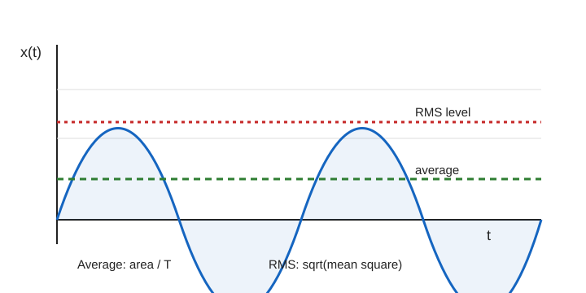
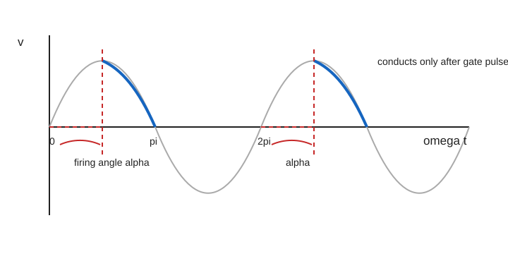
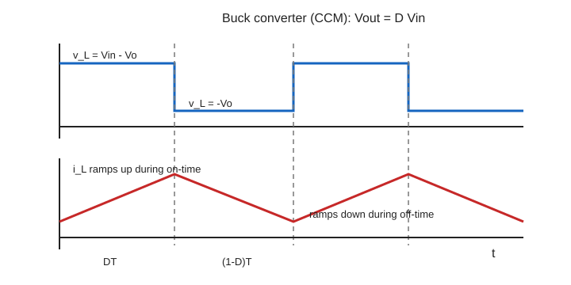
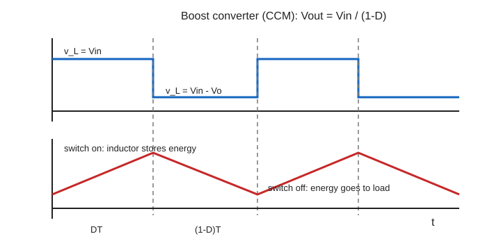
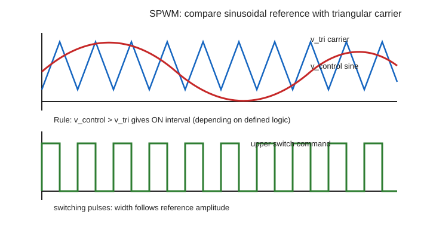
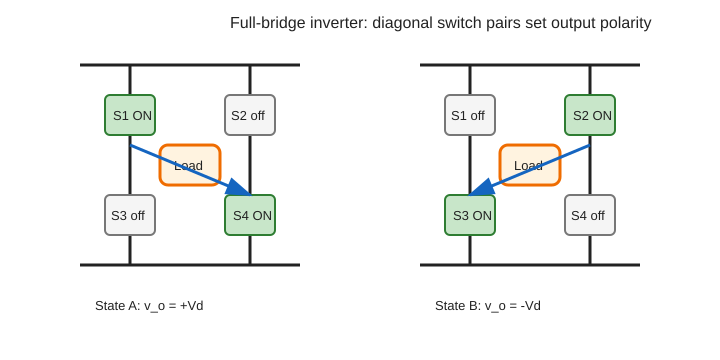

# Power Electronics 期末高分复习笔记

> 基于 `materials/` 与 `slides/` 的期末复习资料。中文为主，关键术语保留英文；所有公式采用网页端 KaTeX 兼容写法。

---

## 00 考试总览与高分策略

### 考试要会什么

期末卷的核心不是背很多背景，而是把高频 calculation套路写完整。历年题最稳定出现这些模块：

1. **Waveform calculation**：average、RMS、form factor、duty cycle、triangular / pulsed waveform 分段积分。
2. **Diode rectifier**：half-wave、full-wave、bridge rectifier 的输出波形、$V_{DC}$、$V_{\mathrm{rms}}$、PIV、capacitor smoothing 和 ripple。
3. **SCR / Thyristor phase control**：half-controllable、firing angle $\alpha$、导通区间、average / RMS / power。
4. **Power switch + loss + thermal**：MOSFET / IGBT 选择，$I_{\mathrm{avg}}$、$I_{\mathrm{rms}}$、conduction loss、switching loss、thermal chain。
5. **DC-DC converter CCM**：Buck、Boost、Buck-Boost 的 duty、$v_L$、$\Delta i_L$、$I_{L,\min}$、$I_{L,\max}$。
6. **Inverter / PWM**：carrier comparison、$m_a$、$m_f$、square-wave 与 PWM 输出。

### 一句话记忆

**先认拓扑和波形，再定周期和导通区间；所有计算题都写“公式、代入、单位、波形标注”。**

### 核心原理

考试给分通常按 working marks 分，不是只看最终答案。每道 calculation 题按下面顺序写最稳：

1. **Identify**：判断题目是 half-wave 还是 full-wave，是 diode 还是 SCR，是 pulse 还是 triangular waveform。
2. **Define period**：写清 $T$、$t_{\mathrm{on}}$、$D$、$\alpha$、$f_{\mathrm{ripple}}$。
3. **Choose interval**：average / RMS 的积分区间必须覆盖一个完整周期；SCR half-wave 用 $0$ 到 $2\pi$，导通只在 $\alpha$ 到 $\pi$。
4. **Use RMS for heating**：电阻功率、MOSFET conduction loss、load heating 用 RMS，不用 average。
5. **Sketch with labels**：画波形要标 peak、zero、time axis、delay angle、导通区间。

### 必背公式

Average 与 RMS：

$$
X_{\mathrm{avg}}=\frac{1}{T}\int_0^T x(t)\,dt
$$

$$
X_{\mathrm{rms}}=\sqrt{\frac{1}{T}\int_0^T x^2(t)\,dt}
$$

Duty cycle：

$$
D=\frac{t_{\mathrm{on}}}{T}=\frac{t_{\mathrm{on}}}{t_{\mathrm{on}}+t_{\mathrm{off}}}
$$

Resistive power：

$$
P=I_{\mathrm{rms}}^2R=\frac{V_{\mathrm{rms}}^2}{R}
$$

Rectifier peak conversion：

$$
\hat V_m=\sqrt{2}V_{AC,\mathrm{rms}}
$$

Capacitor ripple：

$$
\Delta V\approx\frac{I_{load}}{f_{\mathrm{ripple}}C}
$$

Half-wave SCR：

$$
V_{DC}=\frac{\hat V_m}{2\pi}(1+\cos\alpha)
$$

$$
V_{\mathrm{rms}}=\hat V_m\sqrt{\frac{1}{2\pi}\left(\frac{\pi-\alpha}{2}+\frac{\sin 2\alpha}{4}\right)}
$$

### 图像/波形/拓扑

考试图像题优先画简化但清晰的图，不需要艺术化。最重要的是 axes、peak、period、导通区间。

- Waveform average / RMS：看面积与平方面积。
- Rectifier smoothing：看电容峰值充电、负载放电、ripple。
- SCR firing angle：看 $\alpha$ 从自然过零点开始量。

### 做题步骤

#### 1. 波形积分题

1. 画一个周期并标 $T$。
2. 分段写 $x(t)$。
3. Average 用面积：正负面积要带符号。
4. RMS 先平方，所有负值平方后为正。
5. Form factor 用 RMS 除以 rectified average，不是普通 average。

#### 2. Rectifier / smoothing 题

1. 判断 half-wave、full-wave、bridge 或 centre-tap。
2. 把 $V_{AC,\mathrm{rms}}$ 转成 peak $\hat V_m$。
3. 写 $V_{DC}$、$V_{\mathrm{rms}}$ 或 ripple 公式。
4. Half-wave ripple frequency 是 line frequency；full-wave ripple frequency 是 $2f_{line}$。
5. PIV 必须按拓扑判断，bridge 与 centre-tap 不同。

#### 3. SCR 题

1. 写 SCR 是 half-controllable：gate 只能触发 turn-on，不能强制 turn-off。
2. 在每个正半周从 $\alpha$ 开始导通，到 $\pi$ 自然关断。
3. Average / RMS 用正确积分区间。
4. 负载为 resistor 时，power 用 $V_{\mathrm{rms}}^2/R$。

### 高频错误

- Average 可能为 $0$，不要因此说没有 RMS 或没有功率。
- Form factor 分母要用 rectified average；若普通 average 为 $0$，不能直接除。
- RMS 不是 average，也不是 peak。
- Half-wave 50 Hz 的周期是 $20\,\mathrm{ms}$；full-wave ripple 周期是 $10\,\mathrm{ms}$。
- $80\,\mathrm{V_{rms}}$ 这类输入要先乘 $\sqrt{2}$ 得 peak。
- SCR firing angle 不是关断延迟，而是每个自然导通点后的触发延迟。
- 电阻功率必须用 RMS，不要用 average voltage 或 average current。

### Past paper 连接

- **2017 Q1(d)**：inductor current waveform 的 average / RMS / voltage derivation。
- **2017 Q2**：half-wave rectifier、smoothing、diode voltage、SCR firing angle。
- **2018 Q1(e)**：$10\sin(100\pi t)+10$ 的 RMS 与 form factor。
- **2018 Q2**：full-wave rectifier、smoothing capacitance、half-wave SCR RMS / power。
- **Exam feedback**：点名错误集中在 average 为零、form factor 分母、half-wave / full-wave 周期、PIV、SCR 延迟角。

---

## 01 波形基础：Average、RMS、Form Factor、Duty Cycle

### 考试要会什么

本章解决所有波形计算题的底层方法。题目常给 sinusoid with DC offset、rectangular pulse、triangular / saw-tooth current、分段线性 waveform，要求：

- 求 average value；
- 求 RMS value；
- 求 form factor；
- 从波形读 duty cycle；
- 把分段积分结果用于 power、loss、thermal 或 converter current。

### 一句话记忆

**Average 看有符号面积；RMS 看平方后的面积；form factor 的分母看整流后的平均值。**

### 核心原理

Average value 表示一个周期内的等效 DC component。正面积和负面积会互相抵消，所以对称交流波形的 average 可能为 $0$。

RMS value 表示等效热效应。因为先平方，负半周也贡献正的热效应，所以 RMS 通常不为 $0$。只要题目问 resistor power、conduction loss、heating effect，就优先想到 RMS。

Form factor 用来描述波形形状：

$$
\mathrm{Form\ factor}=\frac{X_{\mathrm{rms}}}{X_{\mathrm{avg,rectified}}}
$$

这里 $X_{\mathrm{avg,rectified}}$ 是 $|x(t)|$ 的平均值，不是普通 average。老师反馈中特别强调：普通 average 为 $0$ 时不能直接拿来做分母。

### 必背公式

Average：

$$
X_{\mathrm{avg}}=\frac{1}{T}\int_0^T x(t)\,dt
$$

RMS：

$$
X_{\mathrm{rms}}=\sqrt{\frac{1}{T}\int_0^T x^2(t)\,dt}
$$

Duty cycle：

$$
D=\frac{t_{\mathrm{on}}}{T}=\frac{t_{\mathrm{on}}}{t_{\mathrm{on}}+t_{\mathrm{off}}}
$$

Sinusoid：

$$
V_{\mathrm{rms}}=\frac{\hat V}{\sqrt{2}}
$$

Sinusoid with DC offset：

$$
v(t)=A\sin(\omega t)+B
$$

$$
V_{\mathrm{rms}}=\sqrt{\frac{A^2}{2}+B^2}
$$

Single rectangular pulse，幅值为 $X_m$，off 区为 $0$：

$$
X_{\mathrm{avg}}=DX_m
$$

$$
X_{\mathrm{rms}}=X_m\sqrt{D}
$$

Resistive power：

$$
P=I_{\mathrm{rms}}^2R=\frac{V_{\mathrm{rms}}^2}{R}
$$

### 图像/波形/拓扑



读图时记住三件事：

1. Average level 来自一个周期的净面积。
2. RMS level 来自平方后的平均值，因此对负半周也敏感。
3. 只要波形不是标准正弦，就不要直接套 $\hat V/\sqrt{2}$。

### 做题步骤

#### A. 通用分段积分法

1. **选周期**：写明一个完整周期 $T$，不要只取半个周期，除非题目明确让你取半周期平均。
2. **分段写函数**：例如 $0<t<t_1$、$t_1<t<T$。
3. **Average**：

$$
X_{\mathrm{avg}}=\frac{1}{T}\left(\int_0^{t_1}x_1(t)\,dt+\int_{t_1}^{T}x_2(t)\,dt\right)
$$

4. **RMS**：

$$
X_{\mathrm{rms}}=\sqrt{\frac{1}{T}\left(\int_0^{t_1}x_1^2(t)\,dt+\int_{t_1}^{T}x_2^2(t)\,dt\right)}
$$

5. **写单位**：电压是 V，电流是 A，功率是 W。

#### B. Triangular / saw-tooth waveform

三角波常见于 inductor current 或开关电流。若电流在 $0$ 到 $T$ 内从 $I_1$ 线性上升到 $I_2$，可写：

$$
i(t)=I_1+\frac{I_2-I_1}{T}t
$$

Average 可用梯形面积：

$$
I_{\mathrm{avg}}=\frac{I_1+I_2}{2}
$$

RMS 要平方积分：

$$
I_{\mathrm{rms}}=\sqrt{\frac{I_1^2+I_1I_2+I_2^2}{3}}
$$

如果三角波只存在于一个 on-time，其余时间为 $0$，要再乘 duty 的影响：

$$
I_{\mathrm{rms,total}}=\sqrt{D\frac{I_1^2+I_1I_2+I_2^2}{3}}
$$

适用条件：on-time 内线性变化，off-time 为 $0$。若 off-time 不是 $0$，必须对 off-time 另积分。

#### C. Pulsed waveform

对幅值为 $X_m$、on-time 为 $t_{\mathrm{on}}$、off-time 为 $0$ 的 pulse：

1. 先算 duty：$D=t_{\mathrm{on}}/T$。
2. Average 是面积除以周期：$DX_m$。
3. RMS 是平方面积再开方：$X_m\sqrt{D}$。

注意：RMS 随 $\sqrt{D}$ 变，不是随 $D$ 变。比如 $D=0.25$ 时，RMS 是 $0.5X_m$，不是 $0.25X_m$。

#### D. Sinusoid with DC offset

例：

$$
v(t)=10\sin(100\pi t)+10
$$

这里 $A=10$，$B=10$。RMS：

$$
V_{\mathrm{rms}}=\sqrt{\frac{10^2}{2}+10^2}=\sqrt{150}=12.25\,\mathrm{V}
$$

因为该波形从 $0$ 到 $20\,\mathrm{V}$，不跨负值，所以 rectified average 与 ordinary average 都是 $10\,\mathrm{V}$。Form factor：

$$
\mathrm{FF}=\frac{12.25}{10}=1.225
$$

### 高频错误

- 把 RMS 当成 average。
- 对 pulse 写 $X_{\mathrm{rms}}=DX_m$，正确是 $X_m\sqrt{D}$。
- Form factor 分母忘记取 $|x(t)|$ 的平均值。
- 看到 sine 就套 $\hat V/\sqrt{2}$，但题目其实有 DC offset。
- 分段积分时只算导通区间，没有除以完整周期。
- Triangular waveform 的 $\Delta I$ 是 peak-to-peak；做 $I_{\max}$、$I_{\min}$ 时通常用 $\pm\Delta I/2$。
- 单位混乱：$\mathrm{ms}$、$\mathrm{\mu s}$、$\mathrm{ns}$ 在 switching loss 题里非常容易错。

### Past paper 连接

- **2017 Q1(d)**：给 inductor current waveform，要求 average、RMS，并由 $v_L=L\,di_L/dt$ 推 voltage waveform。
- **2018 Q1(e)**：$10\sin(100\pi t)+10$ 的 RMS 和 form factor。
- **Homework Q1(a)**：average / RMS / form factor 是基础送分题，但反馈显示很多人错在 form factor。
- **MOSFET loss 题**：所有 $I_{\mathrm{avg}}$、$I_{\mathrm{rms}}$ 计算都来自本章分段积分。

---

## 02 Diodes 与 Rectifiers：Half-Wave、Full-Wave、Bridge、Smoothing

### 考试要会什么

本章是历年 Q2 高频题。你需要会：

- 画 half-wave rectifier、full-wave rectifier、bridge rectifier 的 load voltage 和 diode voltage；
- 求理想整流输出的 $V_{DC}$ 和 $V_{\mathrm{rms}}$；
- 判断 PIV，即 peak inverse voltage；
- 处理 capacitor smoothing：ripple、conduction angle、所需 capacitance；
- 解释增大 smoothing capacitor 的影响。

### 一句话记忆

**Half-wave 每个 line cycle 充一次电，full-wave 每半个 line cycle 充一次电；PIV 一定按拓扑和极性画出来。**

### 核心原理

Diode 是 uncontrolled switch：正向偏置时自动导通，反向偏置时自动关断。Rectifier 的作用是把 AC 转成 pulsating DC。

- **Half-wave rectifier**：只保留正半周，负半周输出为 $0$。
- **Full-wave rectifier**：正负半周都变成同极性输出。
- **Bridge rectifier**：用四个 diode，每半周有两个 diode 导通。
- **Capacitor smoothing**：输入接近峰值时 diode 导通给 capacitor 充电；输入低于 capacitor voltage 时 diode 关断，capacitor 对 load 放电，形成 ripple。

### 必背公式

输入峰值：

$$
\hat V_m=\sqrt{2}V_{AC,\mathrm{rms}}
$$

Half-wave rectifier，理想 diode，resistive load：

$$
V_{DC}=\frac{\hat V_m}{\pi}=\frac{\sqrt{2}}{\pi}V_{AC,\mathrm{rms}}\approx0.45V_{AC,\mathrm{rms}}
$$

$$
V_{\mathrm{rms}}=\frac{\hat V_m}{2}
$$

Full-wave / bridge rectifier，理想 diode，resistive load：

$$
V_{DC}=\frac{2\hat V_m}{\pi}\approx0.90V_{AC,\mathrm{rms}}
$$

$$
V_{\mathrm{rms}}=V_{AC,\mathrm{rms}}
$$

Capacitor ripple 近似：

$$
\Delta V\approx\frac{I_{load}}{f_{\mathrm{ripple}}C}
$$

Ripple frequency：

$$
f_{\mathrm{ripple}}=f_{line}\quad\text{half-wave}
$$

$$
f_{\mathrm{ripple}}=2f_{line}\quad\text{full-wave}
$$

更通用的 charge balance 写法：

$$
\Delta V\approx\frac{I_{load}\Delta t}{C}
$$

Ripple factor：

$$
r=\frac{V_{r,\mathrm{rms}}}{V_{DC}}
$$

Diode conduction loss 近似：

$$
P_D\approx V_F I_{F,\mathrm{avg}}
$$

### 图像/波形/拓扑


这张图要看懂三个位置：

1. 输入整流波形到峰值附近时，diode 导通，capacitor 被快速充电。
2. 峰值过后，输入低于 capacitor voltage，diode 关断。
3. Load 从 capacitor 取电，capacitor voltage 缓慢下降，下降量就是 peak-to-peak ripple $\Delta V$。

#### Half-wave、full-wave、bridge 对比

| 项目 | Half-wave | Full-wave centre-tap | Bridge rectifier |
|---|---|---|---|
| 每个 line cycle 的输出脉冲 | 1 个 | 2 个 | 2 个 |
| Ripple frequency | $f_{line}$ | $2f_{line}$ | $2f_{line}$ |
| 理想 $V_{DC}$ | $\hat V_m/\pi$ | $2\hat V_m/\pi$ | $2\hat V_m/\pi$ |
| 理想 $V_{\mathrm{rms}}$ | $\hat V_m/2$ | $V_{AC,\mathrm{rms}}$ | $V_{AC,\mathrm{rms}}$ |
| Diode drops | 1 个 | 1 个 | 2 个 |
| 常见 PIV | 约 $\hat V_m$ | 约 $2\hat V_m$ | 约 $\hat V_m$ |

PIV 的表格结论只适用于常见理想拓扑。考试如果给了 capacitor、diode polarity 或 centre-tap 标注，必须按图重新判断。

### 做题步骤

#### A. 无 smoothing capacitor 的 rectifier

1. 把输入写成 $v_s(t)=\hat V_m\sin\omega t$。
2. 判断 diode 导通区间。
3. 画 load voltage：
   - half-wave：正半周跟随输入，负半周为 $0$；
   - full-wave / bridge：输出近似为 $|v_s(t)|$。
4. 若题目给 diode drop $V_F$，导通时输出约为输入减去 diode drop：
   - half-wave 或 centre-tap：减 $V_F$；
   - bridge：减 $2V_F$。
5. 用对应公式求 $V_{DC}$ 或 $V_{\mathrm{rms}}$。

#### B. 有 smoothing capacitor 的 ripple 题

1. 判断 half-wave 还是 full-wave。
2. 写 ripple period：

$$
T_{\mathrm{ripple}}=\frac{1}{f_{\mathrm{ripple}}}
$$

3. 若题目给 conduction angle $\theta_c$，先选 ripple period，再把 conduction angle 当作该 ripple period 内的充电时间比例。常用 exam approximation：

$$
\Delta t\approx T_{\mathrm{ripple}}-\frac{\theta_c}{360^\circ}T_{\mathrm{ripple}}
$$

若题图给出具体 charging / discharging 起止点，应按图直接读 $\Delta t$，不要机械套公式。

小例子：half-wave、$50\,\mathrm{Hz}$、$\theta_c=30^\circ$ 时，$T_{\mathrm{ripple}}=20\,\mathrm{ms}$，charging time 为 $(30/360)\times20=1.67\,\mathrm{ms}$，所以 discharge time 约为 $18.33\,\mathrm{ms}$。

4. 估算 load current：

$$
I_{load}\approx\frac{V_{DC}}{R_L}
$$

5. 用 charge balance：

$$
\Delta V\approx\frac{I_{load}\Delta t}{C}
$$

6. 若题目反求 capacitance：

$$
C\approx\frac{I_{load}\Delta t}{\Delta V}
$$

#### C. PIV 题

1. 先画 diode 关断时两端电压极性。
2. 找 capacitor 可能保持的最高电压，通常接近 $\hat V_m$。
3. 找 AC source 的最不利反向峰值。
4. 两者按 polarity 相加或相减。
5. 写清是“each diode PIV”还是“total secondary voltage”。

PIV 三步判断小例子：

| 拓扑 | 如何想 | 常见结论 |
|---|---|---|
| Half-wave with smoothing | capacitor 可能保持在 $+\hat V_m$，source 到负峰时 diode 反向电压按题图 polarity 可能接近 $2\hat V_m$ | 有电容时不要只背无电容 half-wave 的 PIV |
| Bridge rectifier | 每次两个 diode 导通，关断 diode 通常只承受一个 secondary peak | each diode PIV 常约为 $\hat V_m$ |
| Centre-tap full-wave | 未导通 diode 可能看到两个半绕组电压叠加 | each diode PIV 常约为 $2\hat V_m$ |

表里的 $\hat V_m$ 必须对应题目指定的 secondary voltage peak；centre-tap 中要确认 $\hat V_m$ 是整段 secondary 还是半边绕组。

#### D. Diode voltage waveform sketch checklist

- Diode 导通时，diode voltage 约为 $0$ 或题目给定的 forward drop $V_F$，符号按图上 $V_D$ 参考方向写。
- Diode 关断时，$V_D$ 是 reverse voltage；峰值位置通常给出 PIV。
- 无 capacitor 时，关断电压随输入负半周变化。
- 有 capacitor 时，关断电压还要考虑 capacitor 保持的电压。
- 画图必须标 time scale、zero line、peak / PIV、forward drop。

#### E. 增大 smoothing capacitor 的影响

答简答题可以写：

- $C$ 变大，$\Delta V$ 变小，输出更平滑。
- Diode conduction angle 变窄。
- Peak diode current 变大。
- Transformer / diode RMS current 和 VA rating 可能变大。
- 输出 DC voltage 更接近 peak，但实际受 diode drop 和 load 影响。

### 高频错误

- Half-wave 50 Hz 的 ripple period 写成 $10\,\mathrm{ms}$，正确是 $20\,\mathrm{ms}$。
- Full-wave 50 Hz 的 ripple frequency 忘记变成 $100\,\mathrm{Hz}$。
- $V_{AC,\mathrm{rms}}$ 没乘 $\sqrt{2}$ 就当 peak 用。
- Bridge rectifier 忘记每次有两个 diode drop。
- Centre-tap 和 bridge 的 PIV 混淆。
- Conduction angle 给 $30^\circ$ 时，没有换算成时间。
- 只说 capacitor reduces ripple，漏说 peak current 和 VA rating 增大。
- 用 $\Delta V=I/(fC)$ 时，$C$ 的 $\mathrm{\mu F}$ 没换算成 F。

### Past paper 连接

- **2017 Q2(a)**：half-wave rectifier with capacitor smoothing，给 $C$、$R$、conduction angle，估 ripple 和 PIV。关键是 half-wave 周期用 $20\,\mathrm{ms}$。
- **2017 Q2(b)**：无 capacitor，画 load voltage 和 diode voltage，题中 diode drop 要体现在波形峰值上。
- **2018 Q2(a)**：full-wave rectifier with smoothing，关键是 full-wave ripple frequency 为 $100\,\mathrm{Hz}$。
- **2018 Q2(b)**：full-wave output RMS，理想 full-wave rectified sine 的 RMS 等于原 sine RMS。
- **2018 Q2(e)**：限制 ripple 反求 $C$，用 $C\approx I_{load}\Delta t/\Delta V$。
- **Exam feedback**：PIV、half-wave / full-wave 周期、peak conversion 是高频扣分点。

---

## 03 SCR / Thyristor Phase Control

### 考试要会什么

SCR 题通常和 rectifier 放在一起考。你需要会：

- 解释 SCR / thyristor 为什么是 half-controllable switch；
- 说明为什么 SCR 不适合 pure DC turn-off；
- 画 firing angle $\alpha$ 后的输出波形；
- 计算 half-wave SCR 的 $V_{DC}$、$V_{\mathrm{rms}}$ 和 resistor power；
- 区分 firing angle $\alpha$ 与 duty cycle $D$。

### 一句话记忆

**SCR gate 只能决定什么时候开始导通，不能决定什么时候关断；关断靠电流自然降到 holding current 以下。**

### 核心原理

SCR 是 silicon controlled rectifier，也叫 thyristor。它有三个端子：anode、cathode、gate。

导通条件：

1. Anode 对 cathode 正向偏置。
2. Gate 给触发脉冲。
3. 导通后，即使 gate pulse 消失，SCR 仍保持导通。

关断条件：

- 电流自然下降到 holding current 以下。
- 在 AC 电路中，电流每半周过零，所以 SCR 可以自然关断。
- 在 pure DC 电路中，电流不自然过零，所以普通 SCR 一旦导通就难以靠 gate 关断。

Phase control 的核心是延迟触发。对 half-wave SCR with R load，输入为：

$$
v_s(\theta)=\hat V_m\sin\theta
$$

当 $0<\theta<\alpha$ 时，SCR 未触发，输出为 $0$。当 $\alpha<\theta<\pi$ 时，SCR 导通，输出跟随正弦。负半周 SCR 反向偏置，输出为 $0$。

### 必背公式

Half-wave SCR，R load，理想器件，$0\le\alpha\le\pi$：

$$
V_{DC}=\frac{\hat V_m}{2\pi}(1+\cos\alpha)
$$

$$
V_{\mathrm{rms}}=\hat V_m\sqrt{\frac{1}{2\pi}\left(\frac{\pi-\alpha}{2}+\frac{\sin 2\alpha}{4}\right)}
$$

等价平方形式：

$$
V_{\mathrm{rms}}^2=\frac{\hat V_m^2}{4\pi}\left(\pi-\alpha+\frac{\sin 2\alpha}{2}\right)
$$

Resistive load current：

$$
I_{DC}=\frac{V_{DC}}{R}
$$

$$
I_{\mathrm{rms}}=\frac{V_{\mathrm{rms}}}{R}
$$

Load power：

$$
P=\frac{V_{\mathrm{rms}}^2}{R}=I_{\mathrm{rms}}^2R
$$

注意：power 必须用 RMS，不用 $V_{DC}^2/R$。

Full-wave / bridge controlled rectifier 要先判断工作条件，不能乱套一个公式：

| 情况 | 平均输出公式 | 适用条件 |
|---|---|---|
| Full-wave R load，每半周从 $\alpha$ 到 $\pi$ 导通 | $V_{DC}=\dfrac{\hat V_m}{\pi}(1+\cos\alpha)$ | 两个半周整流成正脉冲，电流不连续也可用分段积分 |
| Fully controlled bridge，continuous current | $V_{DC}=\dfrac{2\hat V_m}{\pi}\cos\alpha$ | 电感足够大、电流近似连续；$\alpha>90^\circ$ 时平均值可能为负 |

若题目只给单个 SCR half-wave circuit，就用本章 half-wave 公式；若题图是 bridge 或 back-to-back SCR，一定先画每半周导通区间再选公式。

输入 RMS 转峰值：

$$
\hat V_m=\sqrt{2}V_{AC,\mathrm{rms}}
$$

### 图像/波形/拓扑



图中要记住：

1. $\alpha$ 从正半周自然过零点开始量，不是从峰值开始。
2. $0$ 到 $\alpha$：SCR forward-biased 但还没 gate trigger，输出为 $0$。
3. $\alpha$ 到 $\pi$：SCR 导通，输出为正弦片段。
4. $\pi$ 后：电流过零，SCR natural commutation，自然关断。

### 做题步骤

#### A. 解释 half-controllable

标准答法：

- SCR can be turned on by a gate pulse when it is forward biased。
- After turn-on, the gate loses control。
- It turns off only when anode current falls below holding current。
- Therefore it is half-controllable, not fully-controllable。

如果题目问 why not suitable for pure DC：

- Pure DC current does not naturally cross zero。
- Once SCR is latched on, gate cannot turn it off。
- Extra commutation circuit would be needed。

#### B. 画 half-wave SCR waveform

1. 画 $v_s=\hat V_m\sin\theta$ 的正半周。
2. 从 $\theta=0$ 到 $\theta=\alpha$ 输出为 $0$。
3. 从 $\theta=\alpha$ 到 $\theta=\pi$ 输出跟随 sine。
4. 从 $\theta=\pi$ 到 $2\pi$ 输出为 $0$。
5. 标出 $\alpha$、$\hat V_m$、$0$、$\pi$、$2\pi$ 和 time / angle axis。

#### C. 计算 average / RMS / power

1. 先把角度转弧度：

$$
\alpha_{rad}=\alpha_{deg}\frac{\pi}{180^\circ}
$$

2. 写导通区间：$\alpha$ 到 $\pi$。
3. Average：

$$
V_{DC}=\frac{1}{2\pi}\int_{\alpha}^{\pi}\hat V_m\sin\theta\,d\theta
$$

结果：

$$
V_{DC}=\frac{\hat V_m}{2\pi}(1+\cos\alpha)
$$

4. RMS：

$$
V_{\mathrm{rms}}=\sqrt{\frac{1}{2\pi}\int_{\alpha}^{\pi}\hat V_m^2\sin^2\theta\,d\theta}
$$

5. Power：

$$
P=\frac{V_{\mathrm{rms}}^2}{R}
$$

#### D. Back-to-back SCR for AC load

考试或 feedback 中常见错误是把 AC load control 画成一个 SCR 或画成 DC source。正确想法：两个 SCR anti-parallel，一个负责 positive half-cycle，另一个负责 negative half-cycle；每个半周都从该半周的自然过零点延迟 $\alpha$ 后触发。

高分句：**A back-to-back SCR pair controls an AC resistive load by delaying conduction in each half-cycle; the devices turn off naturally when the load current crosses zero.**

#### E. 快速自检

- 当 $\alpha=0$，SCR half-wave 应退化为 diode half-wave rectifier：

$$
V_{DC}=\frac{\hat V_m}{\pi}
$$

$$
V_{\mathrm{rms}}=\frac{\hat V_m}{2}
$$

- 当 $\alpha=\pi$，不导通：

$$
V_{DC}=0
$$

$$
V_{\mathrm{rms}}=0
$$

如果你的结果不满足这两个边界，大概率公式或积分区间错了。

### 高频错误

- 把 SCR 当 fully-controllable switch，说 gate 可以 turn off。
- 把 firing angle $\alpha$ 画成从峰值开始，正确是从自然过零点开始。
- Half-wave SCR 的积分分母写成 $\pi$，正确完整周期是 $2\pi$。
- 忘记把 $30^\circ$ 转成 $\pi/6$。
- 用 average voltage 计算 resistor power，正确应使用 RMS。
- 波形不标 peak voltage、$\alpha$、time axis 或角度单位。
- 把 duty cycle $D$ 和 firing angle $\alpha$ 混用；$D$ 是 on-time ratio，$\alpha$ 是触发延迟角。

### Past paper 连接

- **2017 Q2(c)**：diode 换成 SCR，$\alpha=30^\circ$，要求解释 half-controllable、说明 pure DC 问题、画 firing delay waveform、计算 average / RMS。
- **2018 Q2 SCR(a)**：输入 $10\sin(100\pi t)$，$\alpha=30^\circ$，画 half-wave SCR 输出，必须标 $10\,\mathrm{V}$ peak 和 delay angle。
- **2018 Q2 SCR(b)**：用 half-wave SCR RMS 算 load power，不能用 average voltage。
- **Homework / feedback**：back-to-back SCR 用于 AC load phase control；每个半周都要延迟触发，不能只画一个普通开关。

---

## 04 Power Switches and Losses

### 考试要会什么

- 会比较 **ideal switch** 与 **actual power semiconductor switch**。
- 会按 voltage / current / power / switching frequency / controllability 选择 MOSFET、IGBT、SCR、GTO、BJT。
- 会解释 1 MW、690 V、2 kHz wind turbine converter 为什么通常选 **IGBT**。
- 会从 MOSFET current waveform 求 $D$、$I_{\mathrm{avg}}$、$I_{\mathrm{rms}}$、load power、conduction loss、switching loss。
- 会把 losses 接到 thermal 题：$P_{\mathrm{tot}}=P_{\mathrm{cond}}+P_{\mathrm{sw}}$。

### 一句话记忆

**选开关先看 power rating 和 frequency，算损耗先用 RMS 做热损耗，再用 switching overlap 做开关损耗。**

### 核心原理

#### 1. Ideal vs actual power switches

| 项目 | Ideal switch | Actual switch |
|---|---|---|
| On-state | $V_{\mathrm{on}}=0$，无导通损耗 | 有 $V_{\mathrm{on}}$ 或 $R_{DS(on)}$，产生 conduction loss |
| Off-state | leakage current 为 0 | 有 leakage current，且 blocking voltage 有上限 |
| Rating | 无限 voltage/current/power | 受 voltage rating、current rating、SOA、thermal limit 限制 |
| Switching | instant turn-on / turn-off | 有 $t_r,t_f$，电压电流重叠产生 switching loss |
| Control | 理想控制、无 gate/base 功耗 | 需要 gate/base drive，存在 drive power 和 protection |
| Thermal | 无温升 | junction temperature 决定可靠性和 heatsink |

考试写法：不要只写“ideal no loss”。至少覆盖 **on loss、off leakage、rating、switching time/loss、thermal** 五点。

#### 2. 器件选型速记

| Device | Controllability | 适合场景 | 高频错误 |
|---|---|---|---|
| MOSFET | Fully-controllable | Low/medium voltage，high frequency，fast switching | 只因“fast”就选它做 MW 级高压大功率 |
| IGBT | Fully-controllable | Medium/high voltage，high power，medium frequency | 忘记说明 frequency 不能太高 |
| SCR / Thyristor | Half-controllable | Very high power，line-frequency rectifier，natural commutation | 把 SCR 写成 fully-controllable |
| GTO | Fully-controllable | Very high power，low/medium frequency | 忽略其关断驱动复杂、速度较慢 |
| BJT | Fully-controllable | 早期功率开关，需 base current | 忘记它是 current-driven，drive loss 较大 |

#### 3. Wind turbine 1 MW / 690 V / 2 kHz 选 IGBT 的思路

高分答题模板：

1. 题目要求 **fully-controllable switch**，所以 SCR 不合适，因为 SCR 只能 gate turn-on，不能 gate turn-off。
2. $1\,\mathrm{MW}$、$690\,\mathrm{V}$ 意味着 current 和 power rating 很高，MOSFET 虽快但通常更适合较低电压或较低功率。
3. $2\,\mathrm{kHz}$ 是 medium switching frequency，IGBT 可以承受高电压高电流，并能在 kHz 级工作。
4. 因此选择 **IGBT**；若题目强调极高频率才考虑 MOSFET，若强调极高功率低频可讨论 GTO。

一句英文可直接写：**An IGBT is preferred because it combines high voltage/current capability with full gate control at a moderate switching frequency.**

#### 4. Switching converter vs linear regulator / transformer conversion

简答题可用这个高分框：

| 方面 | Switching power electronic converter | Linear regulator / simple transformer route |
|---|---|---|
| Efficiency | 高，常可超过 90%，因为开关主要在 on/off 状态 | linear regulator 压差大时效率低，热损耗大 |
| Size / weight | 高频开关可减小 magnetic components | 工频 transformer 通常大而重 |
| Control | 可精确控制 voltage、current、frequency、power flow | 可控性较弱或需要额外级联 |
| Flexibility | 可实现 AC-DC、DC-DC、DC-AC、AC-AC | 单一 transformer 只能改变 AC voltage level |
| Disadvantages | EMI、ripple、控制复杂、需要 filtering/protection | 简单但效率或功能受限 |

### 必背公式

#### 1. Duty cycle

$$
D=\frac{t_{\mathrm{on}}}{T}=\frac{t_{\mathrm{on}}}{t_{\mathrm{on}}+t_{\mathrm{off}}}
$$

#### 2. Average and RMS current

$$
I_{\mathrm{avg}}=\frac{1}{T}\int_0^T i(t)\,dt
$$

$$
I_{\mathrm{rms}}=\sqrt{\frac{1}{T}\int_0^T i^2(t)\,dt}
$$

若是矩形脉冲，on 时电流为 $I_m$、off 时为 0：

$$
I_{\mathrm{avg}}=DI_m
$$

$$
I_{\mathrm{rms}}=I_m\sqrt{D}
$$

#### 3. Load power

若 supply voltage 近似恒定，且 current waveform 是从 source 取电：

$$
P_{\mathrm{load}}=V_{\mathrm{supply}}I_{\mathrm{avg}}
$$

若是纯电阻负载：

$$
P=I_{\mathrm{rms}}^2R=\frac{V_{\mathrm{rms}}^2}{R}
$$

#### 4. MOSFET conduction loss

$$
P_{\mathrm{cond}}=I_{D,\mathrm{rms}}^2R_{DS(on)}
$$

注意：这里必须用 $I_{D,\mathrm{rms}}$，不能用 $I_{\mathrm{avg}}$。

#### 5. MOSFET switching loss

常用线性 overlap 近似：

$$
P_{\mathrm{sw}}\approx \frac{1}{2}V_{DS}I_D(t_r+t_f)f_s
$$

这里的 $I_D$ 是 switching instant 的近似电流，不是 $I_{\mathrm{avg}}$ 或 $I_{\mathrm{rms}}$。若 turn-on 和 turn-off 时电流不同，应分别用 $I_{\mathrm{on}}$ 和 $I_{\mathrm{off}}$。

若题目把 turn-on 和 turn-off 分开给：

$$
P_{\mathrm{sw}}\approx \frac{1}{2}f_sV_{DS}\left(I_{\mathrm{on}}t_{\mathrm{on,sw}}+I_{\mathrm{off}}t_{\mathrm{off,sw}}\right)
$$

若题目直接给 switching energy：

$$
P_{\mathrm{sw}}=(E_{\mathrm{on}}+E_{\mathrm{off}})f_s
$$

#### 6. Total semiconductor loss

$$
P_{\mathrm{tot}}=P_{\mathrm{cond}}+P_{\mathrm{sw}}+P_{RR}
$$

MOSFET 主开关题通常先写：

$$
P_{\mathrm{tot}}\approx P_{\mathrm{cond}}+P_{\mathrm{sw}}
$$

### 图像/波形/拓扑

#### 1. MOSFET switching overlap 图像要点

考试画图不用复杂，关键是标出 **voltage-current overlap area**：

```text
Turn-on:                         Turn-off:

v_DS  high \                     v_DS  low  /
           \                              /
            \ low                    high/

i_D   low  /                     i_D   high\
          /                                \
     high/                              low \

p = v_DS i_D 在斜坡重叠区形成近似三角形能量。
```

#### 2. MOSFET current waveform 解题图像

```text
i_D
│        / ramp or pulse
│       /
│______/────────
│      ← t_on →  ← t_off →
└────────────────────── t
       T = t_on + t_off
```

标图必须包含：current scale、time scale、$t_{\mathrm{on}}$、$T$、peak/initial/final current、单位。

### 做题步骤

#### MOSFET waveform + loss 标准步骤

1. **读周期和 duty**：先从图上读 $t_{\mathrm{on}}$、$t_{\mathrm{off}}$、$T$，求 $D$。
2. **分段写电流**：矩形直接用公式；斜坡或三角波用积分面积。
3. **求 average current**：用于 source/load average power，常见是 $P_{\mathrm{load}}=VI_{\mathrm{avg}}$。
4. **求 RMS current**：用于热效应和 conduction loss。
5. **算 conduction loss**：$P_{\mathrm{cond}}=I_{D,\mathrm{rms}}^2R_{DS(on)}$。
6. **算 switching loss**：统一单位后代入 $V_{DS}$、$I_D$、switching time、$f_s$。
7. **合并损耗**：$P_{\mathrm{tot}}=P_{\mathrm{cond}}+P_{\mathrm{sw}}$，后续 thermal 题用这个值。

#### Which current is used where?

| 电流/功率 | 用在哪里 | 不能误用成什么 |
|---|---|---|
| $I_{\mathrm{avg}}$ | constant supply 下的 average load/source power，例如 $P=VI_{\mathrm{avg}}$ | 不用于 conduction heating |
| $I_{\mathrm{rms}}$ | resistor heating、MOSFET conduction loss、thermal source | 不等于 average current |
| $I_{\mathrm{on}}$、$I_{\mathrm{off}}$ | switching loss 的 turn-on / turn-off overlap | 不一定等于 $I_{\mathrm{avg}}$ 或 $I_{\mathrm{rms}}$ |
| $P_{\mathrm{loss}}$ | thermal ladder 的输入功率 | 不要用 load power 代替 device loss |

#### Ramp waveform 分段积分模板

若 on interval 内电流从 $I_1$ 线性变到 $I_2$，持续 $t_{\mathrm{on}}$，off interval 为 0：

$$
I_{\mathrm{avg}}=\frac{t_{\mathrm{on}}}{T}\frac{I_1+I_2}{2}
$$

$$
I_{\mathrm{rms}}^2=\frac{t_{\mathrm{on}}}{T}\frac{I_1^2+I_1I_2+I_2^2}{3}
$$

若有多个斜坡或平台，就对每一段分别求 $\int i(t)dt$ 和 $\int i^2(t)dt$ 后相加。2017/2018 Q3 的后续 loss 和 thermal 都依赖这一步。

#### 单位检查

| 量 | 常见单位 | 换算提醒 |
|---|---|---|
| $R_{DS(on)}$ | $\mathrm{m}\Omega$ | $20\,\mathrm{m}\Omega=0.020\,\Omega$ |
| switching time | $\mathrm{ns}$ | $20\,\mathrm{ns}=20\times10^{-9}\,\mathrm{s}$ |
| period | $\mathrm{ms}$ 或 $\mu\mathrm{s}$ | 不要和 switching transition time 混淆 |
| frequency | $\mathrm{kHz}$ | $2\,\mathrm{kHz}=2000\,\mathrm{Hz}$ |
| power | $\mathrm{W}$ | thermal calculation 必须用 watt |

### 高频错误

- 用 $I_{\mathrm{avg}}^2R$ 算 MOSFET conduction loss；正确是 $I_{\mathrm{rms}}^2R$。
- 把 waveform 的 on-time $t_{\mathrm{on}}$ 与 switching transition time $t_r$、$t_f$ 混淆。
- $\mathrm{ns}$、$\mu\mathrm{s}$、$\mathrm{ms}$ 没换成秒，switching loss 差 $10^3$ 到 $10^6$ 倍。
- 选型题只写器件名，没有说明 voltage/current/power/frequency/controllability。
- 把 SCR 当作 fully-controllable switch。
- 忘记 MOSFET 的 $R_{DS(on)}$ 随 temperature 上升，实际设计要留 thermal margin。

### Past paper 连接

- **2018 Q1(a)**：ideal vs actual power switches，答案必须覆盖 static rating 和 dynamic switching behavior。
- **2018 Q1(b)**：1 MW、690 V、2 kHz wind turbine converter，标准方向是 IGBT。
- **2017 Q1(a)**：画 fully-controllable switches 并比较 power rating 与 switching frequency；优先准备 MOSFET、IGBT、GTO 或 BJT。
- **2017 Q3 / 2018 Q3**：MOSFET current waveform → $I_{\mathrm{avg}}$ → $I_{\mathrm{rms}}$ → load power → conduction loss → switching loss → thermal。
- **Lecture 13 worked solution**：2017 Q3 的套路非常典型，考试换数字时保持同样 working layout。

---

## 05 Thermal Management and Heatsink

### 考试要会什么

- 会画 **junction-case-sink-ambient thermal chain**。
- 会用 thermal resistance 求 $T_S$、$T_C$、$T_J$。
- 会反推 required heatsink thermal resistance $R_{\theta SA}$。
- 会处理 **common heatsink**：sink temperature rise 用所有器件总损耗。
- 会把 MOSFET / IGBT losses 转换成 thermal calculation 的输入功率。

### 一句话记忆

**电路看电流，热路看功率；thermal resistance 串联，common heatsink 先用总功率升温，再分别加各器件自己的 case 和 junction 温升。**

### 核心原理

#### 1. Thermal circuit 类比

| Electrical circuit | Thermal circuit |
|---|---|
| Voltage $V$ | Temperature difference $\Delta T$ |
| Current $I$ | Power loss $P$ |
| Resistance $R$ | Thermal resistance $R_\theta$ |
| Ohm's law $V=IR$ | Thermal law $\Delta T=PR_\theta$ |

Power semiconductor 的损耗最终变成热，从 junction 经过 case、thermal interface、heatsink 到 ambient。

#### 2. Thermal chain 顺序

从热源到空气的顺序固定：

$$
\text{junction} \rightarrow \text{case} \rightarrow \text{sink} \rightarrow \text{ambient}
$$

对应 thermal resistance：

$$
R_{\theta JC},\quad R_{\theta CS},\quad R_{\theta SA}
$$

其中：

- $R_{\theta JC}$：junction-to-case，通常由器件封装决定。
- $R_{\theta CS}$：case-to-sink，受 thermal pad、grease、mounting pressure 影响。
- $R_{\theta SA}$：sink-to-ambient，由 heatsink 和 airflow 决定。

#### 3. Common heatsink 的核心区别

若多个器件共用同一个 heatsink：

1. heatsink 到 ambient 的温升由 **总损耗** 决定：

$$
T_S=T_A+P_{\mathrm{total,sink}}R_{\theta SA}
$$

2. 每个器件从 sink 到 case/junction 的温升用 **该器件自己的损耗**：

$$
T_{C,k}=T_S+P_kR_{\theta CS,k}
$$

$$
T_{J,k}=T_{C,k}+P_kR_{\theta JC,k}
$$

考试最容易错在：common heatsink 的 $T_S$ 不能只用某一个器件的损耗。

### 必背公式

#### 1. Basic thermal resistance law

$$
\Delta T=PR_\theta
$$

单位必须匹配：$P$ 用 $\mathrm{W}$，$R_\theta$ 用 $^\circ\mathrm{C}/\mathrm{W}$ 或 $\mathrm{K}/\mathrm{W}$，得到 $^\circ\mathrm{C}$ 或 $\mathrm{K}$ 的温升。

#### 2. Single-device thermal chain

$$
T_S=T_A+PR_{\theta SA}
$$

$$
T_C=T_S+PR_{\theta CS}
$$

$$
T_J=T_C+PR_{\theta JC}
$$

合并写法：

$$
T_J=T_A+P\left(R_{\theta JC}+R_{\theta CS}+R_{\theta SA}\right)
$$

#### 3. Required heatsink thermal resistance

若给定 $T_{J,\max}$，求 heatsink 需要多好：

$$
R_{\theta SA}\le \frac{T_{J,\max}-T_A}{P}-R_{\theta JC}-R_{\theta CS}
$$

判断：

- 结果越小，heatsink 要求越强。
- 若结果为负，说明单靠普通 heatsink 不够，需要降低损耗、并联器件、强迫风冷或重新选器件。

#### 4. 多器件 common heatsink

总 heatsink 功率：

$$
P_{\mathrm{total,sink}}=P_1+P_2+\cdots+P_n
$$

heatsink temperature：

$$
T_S=T_A+P_{\mathrm{total,sink}}R_{\theta SA}
$$

第 $k$ 个器件：

$$
T_{J,k}=T_S+P_k\left(R_{\theta CS,k}+R_{\theta JC,k}\right)
$$

### 图像/波形/拓扑


考试手画 thermal circuit 时写成：

```text
T_J ── R_θJC ── T_C ── R_θCS ── T_S ── R_θSA ── T_A
        ↑P              ↑P              ↑P
```

common heatsink 手画模板：

```text
Device 1: T_J1 ─ R_θJC1 ─ T_C1 ─ R_θCS1 ┐
                                         ├─ T_S ─ R_θSA ─ T_A
Device 2: T_J2 ─ R_θJC2 ─ T_C2 ─ R_θCS2 ┘

T_S is set by P_1 + P_2, not by one device only.
```

图中必须标：$T_J$、$T_C$、$T_S$、$T_A$、$R_{\theta JC}$、$R_{\theta CS}$、$R_{\theta SA}$、$P$。

### 做题步骤

#### 1. 给 losses 求 temperatures

1. 先确认输入功率是 device dissipated power，不是 load power。
2. 按顺序写 thermal path：$T_A \rightarrow T_S \rightarrow T_C \rightarrow T_J$。
3. 算 heatsink：$T_S=T_A+PR_{\theta SA}$。
4. 算 case：$T_C=T_S+PR_{\theta CS}$。
5. 算 junction：$T_J=T_C+PR_{\theta JC}$。
6. 与 $T_{J,\max}$ 比较，写 safe / unsafe。

#### 2. 给 temperature limit 求 heatsink

1. 写总允许温升：$T_{J,\max}-T_A$。
2. 除以 power 得总允许 thermal resistance。
3. 减去 $R_{\theta JC}$ 和 $R_{\theta CS}$，得到 $R_{\theta SA}$ 上限。
4. 选择 catalog heatsink 时要选 **smaller** $R_{\theta SA}$。

#### 3. Common heatsink 题步骤

1. 列出每个器件损耗：$P_1,P_2,\ldots$。
2. 求 $P_{\mathrm{total,sink}}$。
3. 用总功率求 $T_S$。
4. 对每个器件分别算 $T_C$ 和 $T_J$。
5. 找最高 $T_J$ 的器件作为 limiting device。

#### 4. 和 MOSFET loss 题连接

MOSFET 题常先算：

$$
P_{\mathrm{loss}}=P_{\mathrm{cond}}+P_{\mathrm{sw}}
$$

然后把 $P_{\mathrm{loss}}$ 代入 thermal chain。不要把 load power $P_{\mathrm{load}}$ 直接当作 semiconductor loss。

### 高频错误

- 把 $P_{\mathrm{load}}$ 当成器件发热功率；thermal 用的是 dissipated loss。
- thermal resistance 顺序写反，把 ambient 放在 junction 旁边。
- 漏写单位 $^\circ\mathrm{C}/\mathrm{W}$ 或 $\mathrm{K}/\mathrm{W}$。
- common heatsink 只用单个器件功率求 $T_S$。
- 求 heatsink 时选了更大的 $R_{\theta SA}$；正确是 $R_{\theta SA}$ 越小散热越好。
- 忘记检查 $T_J<T_{J,\max}$，只算温度不给结论。
- 把 $R_{\theta CS}$ 误认为可以忽略；除非题目明确忽略 thermal interface。

### Past paper 连接

- **2018 Q3 thermal(a-b)**：给 $R_{\theta JC}=0.2^\circ\mathrm{C}/\mathrm{W}$、$R_{\theta CS}=0.1^\circ\mathrm{C}/\mathrm{W}$、$P=60\,\mathrm{W}$、$R_{\theta SA}=1^\circ\mathrm{C}/\mathrm{W}$、$T_A=25^\circ\mathrm{C}$，要求画 thermal circuit 并求 $T_S$、$T_C$、$T_J$。标准顺序是 $85^\circ\mathrm{C}$、$91^\circ\mathrm{C}$、$103^\circ\mathrm{C}$。
- **2017 Q3(g)**：MOSFET losses 算完后接 thermal ladder，重点是用 $P_{\mathrm{loss}}$ 而不是 $P_{\mathrm{load}}$。
- **Exam feedback Q1**：thermal 画图和单位是常见扣分点；必须标完整 thermal path。
- **高频组合题**：waveform calculation → loss → thermal，是最值得背模板的 25 marks 大题结构。

---

## 06 Snubber Circuits and Flyback Converter

### 考试要会什么

- 会解释 snubber 的作用：限制 $dv/dt$、$di/dt$、voltage spike、current spike、ringing 和 switching stress。
- 会区分 **turn-off voltage snubber**、**turn-on current snubber**、**unpolarized RC snubber**。
- 会画简单 RC snubber across switch / diode，并说明能量路径。
- 会用 RC snubber 设计公式估算 ringing frequency、$R_{\mathrm{snub}}$、$C_{\mathrm{snub}}$ 和损耗。
- 会说明 **flyback converter** 与 inverting buck-boost 的关系，以及为什么需要 isolation 时选 flyback 而不是 buck-boost。

### 一句话记忆

**Snubber 是保护开关的缓冲网络；flyback 是带 coupled inductor / transformer isolation 的 buck-boost 思路。**

### 核心原理

#### 1. Snubber 的本质作用

Power switch 关断或开通时，电路中的 stray inductance 和 parasitic capacitance 会造成：

- high $dv/dt$：可能误触发、击穿器件、增加 EMI；
- high $di/dt$：可能产生 current spike、reverse recovery stress；
- ringing：由 stray $L$ 和 parasitic $C$ 形成振荡；
- switching trajectory 进入危险区域，增加 switching loss 和 SOA stress。

Snubber 用额外的 $R$、$C$、$L$、diode 给能量提供受控路径，让开关承受更平滑的 voltage/current transition。

#### 2. 三类常考 snubber

| 类型 | 常见名称 | 主要限制 | 典型连接 | 考试关键词 |
|---|---|---|---|---|
| Turn-off snubber | Voltage snubber / polarized RC | $dv/dt$、turn-off overvoltage | capacitor across switch，常带 diode 和 resistor | turn-off, voltage stress |
| Turn-on snubber | Current snubber / polarized LR | $di/dt$、turn-on current spike | series inductor，带 reset resistor/diode | turn-on, current stress |
| Unpolarized RC snubber | Series RC damping network | ringing、both-polarity transient | series $R$-$C$ across switch/diode | damping, oscillation |

#### 3. Turn-off voltage snubber

关断时，开关电流不能瞬间消失，stray inductance 会抬高 switch voltage。RC snubber 中 capacitor 暂时接收电流，使 switch voltage 上升变慢。

核心句：**The capacitor provides an alternative path for current during turn-off, reducing $dv/dt$ and peak device voltage; the resistor dissipates the stored energy before the next cycle.**

#### 4. Turn-on current snubber

开通时，diode reverse recovery 或 capacitor discharge 可能让 switch current 急剧上升。series inductor 限制 current slope。

核心句：**The inductor limits the rate of rise of current during turn-on, while the resistor/diode network resets the snubber energy.**

#### 5. Unpolarized RC snubber

Series RC snubber 常并在 switch、diode 或 transformer winding 上，用于抑制由 stray inductance 和 parasitic capacitance 造成的 ringing。它不是 converter 的主功率传输元件，而是 damping/protection network。

### 必背公式

#### 1. Ringing frequency

$$
f_0=\frac{1}{2\pi\sqrt{LC}}
$$

这里 $L$ 常是 stray inductance，$C$ 常是 parasitic capacitance 或等效振荡电容。

#### 2. RC snubber 经验选择

下面是 course homework / exam 中常用的 approximate design rule，只在题目给出 stray inductance、parasitic capacitance 并要求按该近似设计 damping snubber 时使用：

$$
C_{\mathrm{snub}}\approx 3C_{\mathrm{para}}
$$

$$
R_{\mathrm{snub}}=\sqrt{\frac{L_{\mathrm{stray}}}{C_{\mathrm{para}}}}
$$

如果题目指定用 total capacitance，则按题意说明：

$$
C_{\mathrm{total}}=C_{\mathrm{para}}+C_{\mathrm{snub}}
$$

#### 3. Snubber capacitor energy and loss

每次充放电能量近似：

$$
E_C=\frac{1}{2}CV^2
$$

常用保守损耗估计：

$$
P_{\mathrm{snub}}\approx f_sC_{\mathrm{snub}}V^2
$$

注意：有些推导因每周期充放电路径不同会出现 $1/2$，考试按题目给出的公式或说明使用。若未指定，写清楚假设。

#### 4. Buck-boost voltage gain

Inverting buck-boost：

$$
V_o=-\frac{D}{1-D}V_{in}
$$

Magnitude 形式：

$$
|V_o|=\frac{D}{1-D}V_{in}
$$

#### 5. Flyback voltage gain

Ideal flyback，按输出幅值：

$$
\frac{V_o}{V_{in}}=\frac{N_s}{N_p}\frac{D}{1-D}
$$

#### 6. Flyback reflected voltage

MOSFET 关断时 primary 侧看到 secondary 反射电压：

$$
V_R=\frac{N_p}{N_s}(V_o+V_D)
$$

理想 MOSFET off-state voltage 常估为：

$$
V_{DS,off}\approx V_{in}+V_R
$$

实际还要加 leakage inductance spike，所以 flyback 常需要 RCD clamp 或 snubber。

### 图像/波形/拓扑

#### 1. Unpolarized RC snubber

```text
        ┌──── Switch / Diode ────┐
        │                        │
        └──── R_snub ─ C_snub ───┘

Series RC is placed across the stressed device to damp ringing.
```

#### 2. Turn-off voltage snubber 概念图

```text
Turn-off:

inductive current → snubber capacitor charging
                 → switch voltage rises more slowly
                 → resistor dissipates stored energy
```

画图关键词：capacitor across switch、diode gives charging path、resistor discharge path、limit $dv/dt$。

#### 3. Turn-on current snubber 概念图

```text
DC link ─ L_snub ─ switch ─ load
             │
        reset R/D path

L_snub limits di/dt during switch turn-on.
```

#### 4. Buck-boost 与 flyback 的文字拓扑对比

```text
Inverting buck-boost:
Vin ─ switch ─ L ─ diode/capacitor/load
Energy storage element: inductor
Isolation: no
Output polarity: inverted

Flyback:
Vin ─ switch ─ primary coupled inductor || secondary ─ diode/capacitor/load
Energy storage element: transformer magnetising inductance
Isolation: yes
Output polarity: set by dot convention and diode direction
```

### 做题步骤

#### 1. Snubber 简答题步骤

1. 先判断题目问 turn-on 还是 turn-off。
2. 若问 turn-off / voltage stress：写 RC voltage snubber，重点 $dv/dt$ 和 overvoltage。
3. 若问 turn-on / current stress：写 LR current snubber，重点 $di/dt$ 和 current spike。
4. 若问 ringing：写 series RC unpolarized snubber，重点 damping stray $L$ 和 parasitic $C$。
5. 最后补一句 trade-off：snubber 降低 stress 和 EMI，但会增加 loss、size 和 design complexity。

#### 2. RC snubber calculation 步骤

1. 从题目读 $L_{\mathrm{stray}}$、$C_{\mathrm{para}}$、$V$、$f_s$。
2. 求 ringing frequency：$f_0=1/(2\pi\sqrt{LC})$。
3. 选 $C_{\mathrm{snub}}$，常用 $C_{\mathrm{snub}}\approx3C_{\mathrm{para}}$。
4. 算 $R_{\mathrm{snub}}=\sqrt{L_{\mathrm{stray}}/C_{\mathrm{para}}}$。
5. 算损耗：$P_{\mathrm{snub}}\approx f_sC_{\mathrm{snub}}V^2$。
6. 写 compromise：更大的 $C$ 抑制更强，但 snubber loss 更大，便携或高效率设备尤其不利。

#### 3. Flyback vs buck-boost 选择题步骤

1. 若题目要求 electrical isolation，直接优先考虑 **flyback**。
2. 写 flyback derived from buck-boost，但把 inductor 拆成 coupled inductor / transformer。
3. 写多了 turns ratio：除 duty cycle 外，$N_s/N_p$ 也决定 voltage gain。
4. 写非隔离 buck-boost 不能替代 flyback，因为 buck-boost 没有 galvanic isolation。
5. 若题目问 stress，补充 MOSFET off voltage 包含 input voltage、reflected voltage 和 leakage spike，需要 snubber/clamp。

### 高频错误

- 把 snubber 当作 converter 的主拓扑元件；它主要是 protection / damping network。
- turn-off snubber 与 turn-on snubber 混淆：turn-off 主要限 $dv/dt$，turn-on 主要限 $di/dt$。
- 只画 R/C/L，不解释能量路径和保护对象。
- $f_0=1/(2\pi\sqrt{LC})$ 忘记平方根或 $2\pi$。
- 计算 snubber loss 时漏掉 $f_s$，或 $\mathrm{nF}$、$\mathrm{pF}$ 没换成 farad。
- Flyback 与 buck-boost 混淆：flyback 有 isolation 和 turns ratio，buck-boost 没有 isolation。
- 以为 flyback transformer 是普通理想 transformer；实际核心储能在 magnetising inductance。
- 估算 MOSFET voltage stress 时只写 $V_{in}$，漏掉 reflected voltage 和 leakage spike。

### Past paper 连接

- **2017 Q1(c)**：unpolarized voltage / turn-off snubber。要画 RC snubber 并说明限制 $dv/dt$、吸收能量、降低 switch stress。
- **2018 Q1(d)**：polarized current / turn-on snubber。重点是限制 $di/dt$，不要画成 turn-off voltage snubber。
- **2017 Q4 / 2018 Q4 相关 DC-DC 思路**：buck-boost 和 boost 计算常考；flyback 作为 buck-boost 的隔离版本，是 converter choice 简答题重点。
- **Feedback Q3**：需要 isolation 时应选 flyback，不是 non-isolated buck-boost。
- **Lecture 9**：flyback 与 snubber voltage stress 常联系在一起，尤其是 leakage inductance spike 需要 snubber/clamp。

---

## 07 DC-DC Converters：Buck / Boost / Buck-Boost / Flyback

### 考试要会什么

- 用 **volt-second balance** 推导 CCM 下的 conversion ratio。
- 对 Buck、Boost、Inverting Buck-Boost 求 $D$、$v_L$、$\Delta i_L$、$I_{L,\mathrm{avg}}$、$I_{L,\min}$、$I_{L,\max}$。
- 判断 input current 是连续还是脉冲，并用 power balance 求平均输入电流。
- 画出 $v_L$ 方波、$i_L$ 三角波、必要时画 $i_{in}$。
- 需要 isolation 时选择 **Flyback converter**，不要把普通 buck-boost 当隔离型电源。

### 一句话记忆

**稳态电感平均电压为零：先写 on/off 两段 $v_L$，再令正负面积相等；所有 ripple 都从 $v_L=L\,di_L/dt$ 来。**

### 核心原理：CCM 固定五步法

以下 Buck、Boost、Buck-Boost 公式默认 **ideal converter、CCM、稳态、忽略 switch/diode voltage drop 和损耗**。若题目说明 DCM 或非理想压降，不能直接套这些 conversion ratio。

1. 写 duty cycle：$D=t_{\mathrm{on}}/T$，$f_s=1/T$。
2. 写 on/off 两段 inductor voltage。
3. 用 volt-second balance：

$$
\int_0^T v_L(t)\,dt=0
$$

4. 用斜率求 peak-to-peak ripple：

$$
\Delta i_L=\frac{v_L\Delta t}{L}
$$

5. 先求 $I_{L,\mathrm{avg}}$，再求：

$$
I_{L,\max}=I_{L,\mathrm{avg}}+\frac{\Delta i_L}{2}
$$

$$
I_{L,\min}=I_{L,\mathrm{avg}}-\frac{\Delta i_L}{2}
$$

CCM 条件常用检查：$I_{L,\min}>0$。

### 1. Buck converter（step-down, CCM）



#### 考试要会什么

- 推导 $V_o=DV_{in}$。
- 求 on/off 时 $v_L$、$di_L/dt$、$\Delta i_L$。
- 知道 Buck 的 inductor current 约等于 output current。

#### 必背公式

On state：switch on, diode off。

$$
v_L=V_{in}-V_o
$$

Off state：switch off, diode on。

$$
v_L=-V_o
$$

Volt-second balance：

$$
(V_{in}-V_o)DT+(-V_o)(1-D)T=0
$$

$$
V_o=DV_{in}
$$

Inductor ripple：

$$
\Delta i_L=\frac{(V_{in}-V_o)D}{Lf_s}
$$

Average currents：

$$
I_{L,\mathrm{avg}}\approx I_o=\frac{V_o}{R}
$$

$$
I_{in,\mathrm{avg}}\approx D I_{L,\mathrm{avg}}=\frac{V_o I_o}{V_{in}}
$$

#### 图像/波形要点

- $v_L$：on 时为 $V_{in}-V_o$，off 时为 $-V_o$。
- $i_L$：连续三角波；on 上升，off 下降。
- $i_{in}$：switch on 时近似为 $i_L$，switch off 时约为 0，所以是 pulsed input current。

#### 做题步骤模板

1. 由 $V_o=DV_{in}$ 求 $D$。
2. 写两段 $v_L$，并标在图上。
3. 用 $\Delta i_L=(V_{in}-V_o)D/(Lf_s)$。
4. 用 $I_{L,\mathrm{avg}}\approx I_o$。
5. 用 $I_{L,\max/\min}=I_{L,\mathrm{avg}}\pm\Delta i_L/2$。

#### 高频错误

- 把 $\Delta i_L$ 当成半个 ripple 加减，导致 $I_{\max}$ 和 $I_{\min}$ 错一倍。
- 只写 $V_o=DV_{in}$，没有用 volt-second balance 推导。
- 忘记 $i_{in}$ 是脉冲，不是连续电感电流。

### 2. Boost converter（step-up, CCM）



#### 考试要会什么

2018 Q4 高概率套路：给 $V_{in}$、$V_o$、$I_o$、$L$、$f_s$，求 duty、input current、$v_L$、$I_{L,\min}$、$I_{L,\max}$ 并画波形。

#### 必背公式

On state：switch on, diode off, inductor charging。

$$
v_L=V_{in}
$$

Off state：switch off, diode on, inductor delivers energy to output。

$$
v_L=V_{in}-V_o
$$

Volt-second balance：

$$
V_{in}DT+(V_{in}-V_o)(1-D)T=0
$$

$$
V_o=\frac{V_{in}}{1-D}
$$

$$
D=1-\frac{V_{in}}{V_o}
$$

Inductor ripple：

$$
\Delta i_L=\frac{V_{in}D}{Lf_s}
$$

Average currents：

$$
I_{in,\mathrm{avg}}=I_{L,\mathrm{avg}}=\frac{V_o I_o}{V_{in}}
$$

$$
I_o=(1-D)I_{L,\mathrm{avg}}
$$

#### 图像/波形要点

- $v_L$：on 时 $+V_{in}$，off 时 $V_{in}-V_o$，通常为负。
- $i_L$：输入侧连续，因此 boost input current 连续。
- 输出电容在 switch on 时给负载供电，boost output current 不是电感电流本身。

#### 做题步骤模板

1. 由 $D=1-V_{in}/V_o$ 求 duty。
2. 用 power balance 求 $I_{in}$：$I_{in}=V_oI_o/V_{in}$。
3. 令 $I_{L,\mathrm{avg}}=I_{in}$。
4. 用 $\Delta i_L=V_{in}D/(Lf_s)$。
5. 求 $I_{L,\max}$、$I_{L,\min}$ 并检查 $I_{L,\min}>0$。

#### 高频错误

- 把 boost 写成 $V_o=DV_{in}$。
- 认为 $I_{L,\mathrm{avg}}=I_o$；boost 中应为 $I_{L,\mathrm{avg}}=I_{in}$。
- off-state 的 $v_L$ 符号写反；若 $V_o>V_{in}$，$V_{in}-V_o$ 是负值。

### 3. Inverting Buck-Boost converter（CCM）


#### 考试要会什么

2017 Q4 典型：由 $5\,\mathrm{V}$ 产生 $12\,\mathrm{V}$、$0.5\,\mathrm{A}$ 输出，$f_s=50\,\mathrm{kHz}$，$L=100\,\mu\mathrm{H}$；求 $D$、$I_{in}$、$v_L$、$I_L$ 最大最小，并画 $i_L/i_{in}/v_L$。

#### 必背公式

输出极性与输入相反：

$$
V_o=-\frac{D}{1-D}V_{in}
$$

考试计算常用 magnitude：

$$
|V_o|=\frac{D}{1-D}V_{in}
$$

$$
D=\frac{|V_o|}{V_{in}+|V_o|}
$$

On state：switch on, diode off, inductor charging。

$$
v_L=V_{in}
$$

Off state：switch off, diode on, inductor discharging to output。按常用电感参考方向：

$$
v_L=-|V_o|
$$

Inductor ripple：

$$
\Delta i_L=\frac{V_{in}D}{Lf_s}
$$

Average currents：

$$
I_o=(1-D)I_{L,\mathrm{avg}}
$$

$$
I_{L,\mathrm{avg}}=\frac{I_o}{1-D}
$$

$$
I_{in,\mathrm{avg}}=D I_{L,\mathrm{avg}}=\frac{|V_o|I_o}{V_{in}}
$$

#### 图像/波形要点

- $i_L$：连续三角波，on 储能、off 放能。
- $i_{in}$：只在 switch on 时存在，是 pulsed input current。
- 输出极性反相，图和答案中要明确写 **inverting** 或负号。

#### 做题步骤模板

1. 先用 magnitude 求 $D=|V_o|/(V_{in}+|V_o|)$。
2. 用 power balance 求 $I_{in}=|V_o|I_o/V_{in}$。
3. 用 $I_{L,\mathrm{avg}}=I_o/(1-D)$。
4. 写 $v_L$：on 为 $V_{in}$，off 为 $-|V_o|$。
5. 用 $\Delta i_L=V_{in}D/(Lf_s)$。
6. 求 $I_{L,\max}$、$I_{L,\min}$，并画带数值的三角波。

#### 高频错误

- 忘记输出电压为负，或者没有说明自己在用 $|V_o|$。
- 把 $I_{L,\mathrm{avg}}$ 写成 $I_o$。
- $I_{in}$ 忘记是平均输入电流，不是电感平均电流。
- 波形只画形状，不标 on/off 电压和关键电流数值。

### 4. Flyback converter 选择提示

#### 考试要会什么

当题目问 “which converter should be selected if electrical isolation is required?”，优先答 **Flyback converter**，并说明它 derived from buck-boost but uses a transformer/coupled inductor。

#### 必背公式

理想 flyback 的幅值关系：

$$
\frac{V_o}{V_{in}}=\frac{N_s}{N_p}\frac{D}{1-D}
$$

关断时 primary reflected voltage 常用：

$$
V_R=\frac{N_p}{N_s}(V_o+V_D)
$$

#### 一句话区别

- Buck-Boost：non-isolated，输出反相。
- Flyback：isolated，可通过 turns ratio 改变增益，适合小到中功率隔离电源。

### Past paper 连接

- **2017 Q4 Buck-Boost**：重点练 $D$、$I_{in}$、$I_{L,\mathrm{avg}}$、$I_{L,\min/\max}$ 和三张波形。
- **2018 Q4 Boost**：重点练 $D=1-V_{in}/V_o$、$I_{L,\mathrm{avg}}=I_{in}$、off-state $v_L=V_{in}-V_o$。
- **Feedback Q3**：老师明确指出 buck 推导步骤不足、$\Delta i_L/2$ 用错、需要 isolation 时应选 Flyback。

---

## 08 DC-AC Inverters and PWM

### 考试要会什么

- 区分 **half-bridge inverter**、**full-bridge inverter**、**three-phase inverter** 的输出电压等级。
- 会解释 PWM / SPWM 的 comparator control mechanism。
- 会用 $m_a$、$m_f$ 计算或描述 low-frequency output component。
- 会说明 square-wave mode、overmodulation 的优缺点。
- 会根据 three-phase switching states 写 line voltage：$v_{AB}$、$v_{BC}$、$v_{CA}$。
- 会评价 inverter harmonics 对 motor drive 的影响。

### 一句话记忆

**Inverter 题先问清楚题目要的是 power circuit、control comparator，还是 output waveform；PWM 低频分量看 $m_a$，高频 harmonics 通常可忽略或只需说明。**

### 核心原理：DC link 通过开关状态变成 AC

DC-AC inverter 本质是用 fully-controllable switches 把 DC link 电压按一定 switching pattern 施加到负载上。考试中最常见的控制方式是比较 reference/control signal 与 triangular carrier。



PWM comparator rule 常写成：

$$
v_{control}>v_{tri}\Rightarrow \text{upper switch on}
$$

实际题中若给了相反逻辑，以题图开关标注为准。

### 1. Half-bridge inverter

#### 考试要会什么

- 知道输出在 $+V_d/2$ 和 $-V_d/2$ 之间切换。
- 会说明同一桥臂上下开关不能同时导通，需要 dead time / blanking time。

#### 必背公式

Square-wave total RMS：

$$
V_{o,\mathrm{rms}}=\frac{V_d}{2}
$$

若输出是理想 bipolar square wave $\pm V_d/2$，其 fundamental peak 为：

$$
\hat V_{1}=\frac{4}{\pi}\frac{V_d}{2}=\frac{2V_d}{\pi}
$$

#### 高频错误

- 把 half-bridge 输出幅值写成 $\pm V_d$。
- 忘记 split DC capacitors 或 midpoint reference。
- 只画开关状态，不说明 shoot-through 风险。

### 2. Full-bridge single-phase inverter



#### 考试要会什么

- Full bridge 输出可在 $+V_d$、$-V_d$ 之间切换，unipolar PWM 还可出现 0 电平。
- 会比较 bipolar PWM 与 unipolar PWM。
- 会计算 SPWM 线性区的 low-frequency output。

#### 必背公式

Full-bridge square-wave total RMS：

$$
V_{o,\mathrm{rms}}=V_d
$$

Full-bridge square-wave fundamental peak：

$$
\hat V_1=\frac{4V_d}{\pi}
$$

SPWM modulation indices：

$$
m_a=\frac{\hat V_{control}}{\hat V_{tri}}
$$

$$
m_f=\frac{f_s}{f_1}
$$

Full-bridge bipolar SPWM 线性区常用 low-frequency component：

$$
\hat V_{o1}\approx m_a V_d
$$

$$
V_{o1,\mathrm{rms}}\approx \frac{m_a V_d}{\sqrt{2}}
$$

这个公式用于 **full-bridge bipolar output voltage**。如果题图是 half-bridge，输出电压等级通常减半；如果题目问的是 switching waveform total RMS、fundamental peak、fundamental RMS 或 average output，要先确认目标量再代入。

#### Bipolar PWM vs Unipolar PWM

| 项目 | Bipolar PWM | Unipolar PWM |
|---|---|---|
| 输出电平 | $+V_d$ 与 $-V_d$ | $+V_d$、0、$-V_d$ |
| 控制 | 两个 diagonal switch pairs 交替 | 两个桥臂分别调制 |
| 谐波 | 输出跳变大，harmonics 较重 | 等效 switching frequency 更高，滤波更容易 |
| 易错点 | 不要把它画成 0 电平 | 不要让同一桥臂上下开关同时导通 |

### 3. PWM / SPWM / overmodulation / square-wave

#### 考试要会什么

- 给 $v_{control}=m_a\sin(2\pi f_1t)$ 和 carrier 幅值，求 $m_a$。
- 忽略 high-frequency harmonics 时，只保留 low-frequency fundamental。
- 当 $m_a>1$ 或 $m_a\gg1$，说明 overmodulation，最终趋向 square-wave operation。

#### 必背关系

Linear SPWM 区：

$$
0\le m_a\le1
$$

$$
f_s=m_f f_1
$$

Overmodulation：

$$
m_a>1
$$

此时 output fundamental 不再与 $m_a$ 线性成正比，波形逐渐接近 square wave。

#### Square-wave mode 优缺点

优点：

- 控制简单。
- DC bus 利用率高，fundamental component 较大。
- switching frequency 低，switching loss 可较低。

缺点：

- Low-order harmonics 大。
- 输出滤波更困难。
- 对 motor drive 可能增加 torque ripple、heating、noise。
- 输出幅值调节不如 SPWM 线性方便。

#### Constant control signal 模板

若题目给 constant $v_{control}=kV_{tri,peak}$，且 carrier 是对称三角波 $\pm V_{tri,peak}$、comparator 逻辑为 $v_{control}>v_{tri}$ 时，先求 duty：

$$
D=\frac{1+k}{2}
$$

Full-bridge bipolar PWM 的 average output 可写为：

$$
\overline v_o=(2D-1)V_d=kV_d
$$

若题图定义不同，按题图逻辑修正符号。

### 4. Three-phase inverter and six-step line voltage

#### 考试要会什么

- 三个桥臂互差 $120^\circ$。
- 每个桥臂上下开关互补，不能同臂直通。
- Line voltage 是两个 leg voltages 相减，不是单个 phase voltage。

#### 基本关系

若三相桥臂相对 DC negative 的 pole voltage 为 $v_A$、$v_B$、$v_C$：

$$
v_{AB}=v_A-v_B
$$

$$
v_{BC}=v_B-v_C
$$

$$
v_{CA}=v_C-v_A
$$

Six-step line voltage 只会出现：

$$
+V_d,\quad 0,\quad -V_d
$$

#### Six-step line voltage 算法

不要背不完整表格。考试若给 switching sequence，按下面算法逐行算：

1. 先按题图定义 leg voltage。常见约定是 upper switch on 时该 leg voltage 为 $V_d$，lower switch on 时为 $0$。
2. 列出该 $60^\circ$ 区间的 $v_A$、$v_B$、$v_C$。
3. 用 $v_{AB}=v_A-v_B$、$v_{BC}=v_B-v_C$、$v_{CA}=v_C-v_A$。
4. 把每个 $60^\circ$ 的结果连起来画 line-voltage waveform。

小例子：若某区间 A high、B low、C high，且采用 upper on 为 $V_d$、lower on 为 $0$ 的约定：

$$
v_A=V_d,\quad v_B=0,\quad v_C=V_d
$$

所以：

$$
v_{AB}=V_d,
\quad
v_{BC}=-V_d,
\quad
v_{CA}=0
$$

若题图采用 $+V_d/2$ 与 $-V_d/2$ 作为 leg voltage，算法不变，只是先把 $v_A$、$v_B$、$v_C$ 换成题图的定义。

#### Three-phase PWM 的 $m_f$ 选择

常见原则：

$$
m_f=\frac{f_s}{f_1}
$$

三相 SPWM 中，$m_f$ 常选为 odd multiple of 3，以帮助 line voltage 中 dominant harmonics cancellation。

### Motor harmonics：答题短句

- Low-order voltage harmonics 会产生 harmonic currents。
- Harmonic currents 会导致 copper loss、heating、torque ripple 和 acoustic noise。
- 高频 PWM harmonics 通常更容易用 motor inductance 滤掉。
- SPWM 比 square-wave 更适合要求平滑 torque 和速度控制的 motor drive。

### 做题步骤

1. 判断 topology：half bridge、full bridge、three-phase。
2. 判断 switching mode：square-wave、PWM、SPWM、overmodulation。
3. 写 $m_a$、$m_f$，确认是否在线性区。
4. 单相 full-bridge：用 $\hat V_{o1}\approx m_aV_d$ 求 low-frequency output。
5. Constant control：先求 duty，再求 average output。
6. Three-phase：先列各 leg voltage，再相减得 line voltage。
7. 最后用一句话评价 harmonics 和 filtering/motor effect。

### 高频错误

- 题目问 control mechanism，却画成不同 switch state 下的功率电路。
- 把 bipolar PWM 和 unipolar PWM 混淆。
- $m_a\gg1$ 时仍使用线性公式 $\hat V_{o1}=m_aV_d$。
- 忽略题目要求 “neglect high-frequency harmonics”，答案保留一堆 carrier harmonics。
- Three-phase 题只画 phase voltage，不画 line voltage。

### Past paper 连接

- **2017 Q5**：single-phase PWM inverter，给 $v_{control}=m_a\sin(2\pi ft)$，要求忽略高频谐波并解释 square-wave mode。
- **2018 Q4(g-i)**：$V_d=100\,\mathrm{V}$，$m_a=0.5$ 求 low-frequency output；$m_a\gg1$ 解释 overmodulation/square-wave；constant $v_{control}=0.6\,\mathrm{V}$ 求 average output。
- **Feedback Q4**：重点提醒 power circuit 与 control mechanism 不要画错，bipolar/unipolar switching 要分清。

---

## 09 Past Paper Worked Examples：高频计算套路

### 用法

本章只整理 past paper 中反复出现的计算模板。考试时不要只写最终答案，要把公式、代入、单位和波形关键数值写出来。

### 通用得分步骤

1. 读题先画简图或波形，标 $T$、$t_{on}$、峰值、单位。
2. 写出适用公式，不要直接跳答案。
3. 分清 average、RMS、peak、peak-to-peak。
4. 损耗题先算 electrical loss，再走 thermal ladder。
5. DC-DC 题先 volt-second balance，再 ripple，再 $I_{\max}/I_{\min}$。
6. Inverter 题先判断 PWM / SPWM / square-wave，再决定是否忽略 high-frequency harmonics。

---

### Example 1：2017 Buck-Boost converter（CCM）

#### 题型识别

典型数据：由 $V_{in}=5\,\mathrm{V}$ 得到 $|V_o|=12\,\mathrm{V}$、$I_o=0.5\,\mathrm{A}$，$f_s=50\,\mathrm{kHz}$，$L=100\,\mu\mathrm{H}$。Inverting buck-boost 输出极性为负，计算常用 magnitude。

#### Step 1：Duty cycle

$$
|V_o|=\frac{D}{1-D}V_{in}
$$

$$
D=\frac{|V_o|}{V_{in}+|V_o|}=\frac{12}{5+12}=0.706
$$

#### Step 2：Input current by power balance

理想 converter：

$$
P_{in}=P_o=|V_o|I_o
$$

$$
I_{in}=\frac{|V_o|I_o}{V_{in}}=\frac{12\times0.5}{5}=1.2\,\mathrm{A}
$$

#### Step 3：Inductor average current

Buck-boost 中输出只在 off interval 接收电感电流：

$$
I_o=(1-D)I_{L,\mathrm{avg}}
$$

$$
I_{L,\mathrm{avg}}=\frac{I_o}{1-D}=\frac{0.5}{1-0.706}=1.70\,\mathrm{A}
$$

#### Step 4：Inductor voltage and ripple

On state：

$$
v_L=V_{in}=5\,\mathrm{V}
$$

Off state：

$$
v_L=-|V_o|=-12\,\mathrm{V}
$$

Ripple：

$$
\Delta i_L=\frac{V_{in}D}{Lf_s}
$$

$$
\Delta i_L=\frac{5\times0.706}{100\times10^{-6}\times50\times10^3}=0.706\,\mathrm{A}
$$

#### Step 5：Maximum and minimum inductor current

$$
I_{L,\max}=1.70+\frac{0.706}{2}=2.05\,\mathrm{A}
$$

$$
I_{L,\min}=1.70-\frac{0.706}{2}=1.35\,\mathrm{A}
$$

#### Waveform checklist

- $i_L$：从约 $1.35\,\mathrm{A}$ 上升到 $2.05\,\mathrm{A}$，再下降回 $1.35\,\mathrm{A}$。
- $v_L$：on 为 $+5\,\mathrm{V}$，off 为 $-12\,\mathrm{V}$。
- $i_{in}$：on 时等于 $i_L$，off 时约为 0，平均值 $1.2\,\mathrm{A}$。

#### 易错点

- 不写负极性或不说明使用 $|V_o|$。
- 把 $I_{L,\mathrm{avg}}$ 当成 $I_o$。
- 用 $\Delta i_L$ 全量直接加减，而不是加减 $\Delta i_L/2$。

---

### Example 2：2018 Boost converter（CCM）

#### 题型识别

典型数据：$V_{in}=5\,\mathrm{V}$，$V_o=15\,\mathrm{V}$，$I_o=1\,\mathrm{A}$，$f_s=50\,\mathrm{kHz}$，$L=100\,\mu\mathrm{H}$。

#### Step 1：Duty cycle

$$
V_o=\frac{V_{in}}{1-D}
$$

$$
D=1-\frac{V_{in}}{V_o}=1-\frac{5}{15}=\frac{2}{3}=0.667
$$

#### Step 2：Input and inductor average current

$$
I_{in}=\frac{V_oI_o}{V_{in}}=\frac{15\times1}{5}=3\,\mathrm{A}
$$

Boost input current is the inductor current：

$$
I_{L,\mathrm{avg}}=I_{in}=3\,\mathrm{A}
$$

#### Step 3：Inductor voltage

On state：

$$
v_L=V_{in}=5\,\mathrm{V}
$$

Off state：

$$
v_L=V_{in}-V_o=5-15=-10\,\mathrm{V}
$$

#### Step 4：Inductor ripple

$$
\Delta i_L=\frac{V_{in}D}{Lf_s}
$$

$$
\Delta i_L=\frac{5\times(2/3)}{100\times10^{-6}\times50\times10^3}=0.667\,\mathrm{A}
$$

#### Step 5：Maximum and minimum current

$$
I_{L,\max}=3+\frac{0.667}{2}=3.33\,\mathrm{A}
$$

$$
I_{L,\min}=3-\frac{0.667}{2}=2.67\,\mathrm{A}
$$

#### Waveform checklist

- $v_L$：$+5\,\mathrm{V}$ during $DT$，$-10\,\mathrm{V}$ during $(1-D)T$。
- $i_L$：围绕 $3\,\mathrm{A}$ 的连续三角波。
- $I_{L,\min}>0$，所以 CCM 假设成立。

#### 易错点

- 把 $I_o=1\,\mathrm{A}$ 当成 $I_L$ 平均值。
- 忘记 off-state 电感电压是负值。
- 把 boost duty 写成 $D=V_o/V_{in}$。

---

### Example 3：MOSFET loss and thermal template

#### 题型识别

2017 Q3 和 2018 Q3 都是 waveform → average/RMS → load power → MOSFET loss → thermal circuit。题目通常给 load current waveform、supply voltage、$R_{DS(on)}$、switching time、thermal resistances。

#### Step 1：从波形读 duty 和周期

$$
D=\frac{t_{on}}{T}
$$

2017 worked solution 中：

$$
D=\frac{10\,\mathrm{ms}}{20\,\mathrm{ms}}=0.5
$$

#### Step 2：分段积分求 average 和 RMS

Average：

$$
I_{\mathrm{avg}}=\frac{1}{T}\int_0^T i(t)\,dt
$$

RMS：

$$
I_{\mathrm{rms}}=\sqrt{\frac{1}{T}\int_0^T i^2(t)\,dt}
$$

2017 lecture worked values：

$$
I_{\mathrm{avg}}=8.75\,\mathrm{A}
$$

$$
I_{\mathrm{rms}}\approx12.4\,\mathrm{A}
$$

#### Step 3：Load power

若题目给 supply voltage and switched current，可用：

$$
P_{load}=V_{supply}I_{\mathrm{avg}}
$$

2017 worked value：

$$
P_{load}=50\times8.75=437.5\,\mathrm{W}
$$

#### Step 4：MOSFET conduction loss

$$
P_{cond}=I_{D,\mathrm{rms}}^2R_{DS(on)}
$$

2017 worked value：

$$
P_{cond}\approx7.688\,\mathrm{W}
$$

#### Step 5：Switching loss

若题目用线性 overlap 近似：

$$
P_{sw}\approx\frac{1}{2}V_{DS}I_D(t_r+t_f)f_s
$$

有些题会分别给 turn-on / turn-off current 或 switching intervals，可按三角形面积逐项相加。2017 worked value：

$$
P_{sw}\approx1.125\,\mathrm{W}
$$

Total semiconductor loss：

$$
P_{tot}=P_{cond}+P_{sw}
$$

2017 worked value：

$$
P_{tot}\approx8.813\,\mathrm{W}
$$

#### Step 6：Thermal ladder

基本热阻链：junction → case → sink → ambient。

$$
T_j=T_a+P\left(R_{\theta JC}+R_{\theta CS}+R_{\theta SA}\right)
$$

也可逐级写：

$$
T_S=T_A+P R_{\theta SA}
$$

$$
T_C=T_S+P R_{\theta CS}
$$

$$
T_J=T_C+P R_{\theta JC}
$$

2018 thermal example 给 $P=60\,\mathrm{W}$、$R_{\theta JC}=0.2^\circ\mathrm{C/W}$、$R_{\theta CS}=0.1^\circ\mathrm{C/W}$、$R_{\theta SA}=1^\circ\mathrm{C/W}$、$T_A=25^\circ\mathrm{C}$：

$$
T_S=25+60\times1=85^\circ\mathrm{C}
$$

$$
T_C=85+60\times0.1=91^\circ\mathrm{C}
$$

$$
T_J=91+60\times0.2=103^\circ\mathrm{C}
$$

#### 易错点

- 用 average current 算 $I^2R$ loss；应使用 RMS current。
- 把 ms、$\mu\mathrm{s}$、ns 单位混用。
- 多个器件共享 heatsink 时，sink-to-ambient 温升要用总损耗。
- 热阻顺序写反，或者漏写单位 $^\circ\mathrm{C/W}$。

---

### Example 4：PWM inverter calculation template

#### 题型识别

2017 Q5 和 2018 Q4(g-i)：single-phase PWM inverter，给 $V_d$、carrier 幅值、$m_a$ 或 constant control signal，要求 low-frequency output 或 average output，并解释 square-wave / overmodulation。

#### Case A：SPWM low-frequency component

Full-bridge bipolar SPWM 线性区：

$$
\hat V_{o1}\approx m_aV_d
$$

$$
V_{o1,\mathrm{rms}}\approx\frac{m_aV_d}{\sqrt{2}}
$$

2018 模板：若 $V_d=100\,\mathrm{V}$、$m_a=0.5$：

$$
\hat V_{o1}=0.5\times100=50\,\mathrm{V}
$$

$$
V_{o1,\mathrm{rms}}=\frac{50}{\sqrt{2}}=35.4\,\mathrm{V}
$$

答题时写明：high-frequency harmonics neglected。

#### Case B：Overmodulation / square-wave

若 $m_a\gg1$：

- comparator 大部分时间饱和；
- 输出接近 square-wave；
- linear SPWM 关系失效；
- fundamental 增大但 low-order harmonics 明显增加。

Full-bridge square-wave total RMS：

$$
V_{o,\mathrm{rms}}=V_d
$$

Fundamental peak 可写：

$$
\hat V_1=\frac{4V_d}{\pi}
$$

#### Case C：Constant control signal average output

若 carrier 为对称三角波 $\pm V_{tri,peak}$，constant control 为 $v_{control}=kV_{tri,peak}$：

$$
D=\frac{1+k}{2}
$$

Full-bridge bipolar average：

$$
\overline v_o=(2D-1)V_d=kV_d
$$

2018 模板：若 $V_d=100\,\mathrm{V}$ 且 $k=0.6$：

$$
D=\frac{1+0.6}{2}=0.8
$$

$$
\overline v_o=(2\times0.8-1)100=60\,\mathrm{V}
$$

若题图 comparator 逻辑相反，答案符号相反，必须按题图说明。

#### 易错点

- $m_a>1$ 仍套 $\hat V_{o1}=m_aV_d$。
- 题目要求忽略高频谐波，却把 carrier sidebands 写成最终输出。
- Constant control 题没有先求 duty。
- 不说明 full-bridge / half-bridge，导致电压幅值差一倍。

---

### 最后 30 秒检查

- 每个 numerical answer 是否有单位。
- $\Delta i_L$ 是否是 peak-to-peak。
- $I_{\max/\min}$ 是否用了 $\pm\Delta i_L/2$。
- MOSFET conduction loss 是否用了 RMS current。
- Thermal sink 温升是否用了正确功率。
- PWM 是否在线性区；若 overmodulation，是否停止使用线性公式。

---

## 10 Common Mistakes Checklist：考前红线清单

### 用法

做完题后按本章逐项扫一遍。它来自 past paper analysis 和 feedback 中老师反复点名的问题，优先级高于补充背景知识。

### A. 波形、Average、RMS、Form Factor

| 检查项 | 正确做法 | 常见扣分点 |
|---|---|---|
| Average | $X_{\mathrm{avg}}=\dfrac{1}{T}\int_0^T x(t)\,dt$ | 对称交流波平均值可能为 0，却强行给非零值 |
| RMS | $X_{\mathrm{rms}}=\sqrt{\dfrac{1}{T}\int_0^T x^2(t)\,dt}$ | 用 average 代替 RMS |
| Form factor | $\mathrm{FF}=X_{\mathrm{rms}}/X_{\mathrm{avg,rectified}}$ | 分母忘记取 rectified / absolute average |
| Offset sine | $V_{\mathrm{rms}}=\sqrt{A^2/2+B^2}$ | 有 DC offset 仍只用 $A/\sqrt2$ |
| 单位 | ms、$\mu\mathrm{s}$、ns 分清 | switching time 和 waveform period 单位混用 |

#### 一句话提醒

**RMS 管发热，average 管 DC component；form factor 的分母不是普通平均值，而是整流平均值。**

### B. Rectifier / Capacitor / SCR

| 检查项 | 正确做法 | 常见扣分点 |
|---|---|---|
| Peak conversion | $\hat V=\sqrt2 V_{\mathrm{rms}}$ | 80 Vrms 直接当 80 V peak |
| Half-wave period | 50 Hz 时 $T=20\,\mathrm{ms}$ | 误用 full-wave 的 10 ms |
| Full-wave ripple | $f_{ripple}=2f_{line}$ | 放电时间选错 |
| Capacitor ripple | $\Delta V\approx I\Delta t/C$ | $\mu\mathrm{F}$、mF 单位换算错 |
| PIV | 按 topology 和 polarity 判定 | bridge 与 centre-tap PIV 混淆 |
| SCR firing angle | $\alpha$ 从每半周自然过零点起算 | 把 firing delay 画成关断延迟 |
| SCR RMS power | $P=V_{\mathrm{rms}}^2/R$ | 用 average voltage 算 resistor power |

#### 必背短句

- Half-wave smoothing：50 Hz mains 的放电周期接近 $20\,\mathrm{ms}$。
- Full-wave smoothing：ripple frequency 是 $100\,\mathrm{Hz}$，周期接近 $10\,\mathrm{ms}$。
- SCR 是 **half-controllable**：gate 可以 turn on，不能靠 gate turn off。

### C. Switch selection / MOSFET loss / Thermal

| 检查项 | 正确做法 | 常见扣分点 |
|---|---|---|
| Fully-controllable device | MOSFET、IGBT、GTO 等 | 把 SCR 当 fully-controllable |
| High power medium frequency | 常选 IGBT 并说明 voltage/current/frequency | 只写器件名无理由 |
| MOSFET conduction loss | $P_{cond}=I_{D,\mathrm{rms}}^2R_{DS(on)}$ | 用 $I_{avg}^2R$ |
| Switching loss | $P_{sw}\approx\dfrac12V_{DS}I_D(t_r+t_f)f_s$ | 忘记乘 switching frequency |
| Total loss | $P_{tot}=P_{cond}+P_{sw}+P_{RR}$ | 只算 conduction loss |
| Thermal ladder | $T_j=T_a+P(R_{\theta JC}+R_{\theta CS}+R_{\theta SA})$ | 热阻顺序写反 |
| Shared heatsink | $R_{\theta SA}$ 温升用总功率 | 只用单个器件功率算 sink 温升 |

#### 画图提醒

Thermal circuit 必须按：

$$
T_J\rightarrow R_{\theta JC}\rightarrow T_C\rightarrow R_{\theta CS}\rightarrow T_S\rightarrow R_{\theta SA}\rightarrow T_A
$$

不要只写公式不画 thermal resistance ladder。

### D. DC-DC Converters：Buck / Boost / Buck-Boost

| 检查项 | Buck | Boost | Buck-Boost |
|---|---|---|---|
| Voltage gain | $V_o=DV_{in}$ | $V_o=\dfrac{V_{in}}{1-D}$ | $V_o=-\dfrac{D}{1-D}V_{in}$ |
| Duty | $D=V_o/V_{in}$ | $D=1-V_{in}/V_o$ | $D=\dfrac{|V_o|}{V_{in}+|V_o|}$ |
| On-state $v_L$ | $V_{in}-V_o$ | $V_{in}$ | $V_{in}$ |
| Off-state $v_L$ | $-V_o$ | $V_{in}-V_o$ | $-|V_o|$ |
| $I_{L,\mathrm{avg}}$ | $I_o$ | $I_{in}$ | $I_o/(1-D)$ |
| Input current | Pulsed | Continuous | Pulsed |

#### DC-DC 五个必检点

1. 有没有写 volt-second balance，而不是只背 conversion ratio。
2. $\Delta i_L$ 是否来自 $v_L\Delta t/L$。
3. $\Delta i_L$ 是否是 peak-to-peak。
4. $I_{L,\max}$、$I_{L,\min}$ 是否用 $\pm\Delta i_L/2$。
5. Buck-boost 是否写明 output is inverted。

#### Flyback 选择红线

如果题目强调 **electrical isolation**：

$$
\text{choose Flyback, not ordinary Buck-Boost}
$$

理由：Flyback derived from buck-boost but uses transformer/coupled inductor and turns ratio。

### E. Inverter / PWM / SPWM

| 检查项 | 正确做法 | 常见扣分点 |
|---|---|---|
| Half-bridge | 输出 $\pm V_d/2$ | 写成 $\pm V_d$ |
| Full-bridge | 输出 $\pm V_d$ | 与 half-bridge 混淆 |
| $m_a$ | $m_a=\hat V_{control}/\hat V_{tri}$ | 用 RMS 或 peak-to-peak 乱代 |
| $m_f$ | $m_f=f_s/f_1$ | 把 fundamental frequency 和 carrier frequency 反过来 |
| Linear SPWM | $0\le m_a\le1$ | $m_a>1$ 仍套线性输出公式 |
| Overmodulation | 输出趋向 square-wave | 不说明 harmonics 增加 |
| Constant control | 先算 duty，再算 average output | 直接把 control voltage 当 output voltage |
| Control mechanism | 画 carrier/reference comparator | 误画不同 switch state 的 resultant circuit |
| Bipolar/unipolar | 分清输出电平 | 把 0 电平加入 bipolar PWM |

#### PWM 常用公式

$$
m_a=\frac{\hat V_{control}}{\hat V_{tri}}
$$

$$
m_f=\frac{f_s}{f_1}
$$

Full-bridge bipolar SPWM 线性区：

$$
\hat V_{o1}\approx m_aV_d
$$

$$
V_{o1,\mathrm{rms}}\approx\frac{m_aV_d}{\sqrt2}
$$

Constant control with symmetric carrier：

$$
D=\frac{1+k}{2}
$$

$$
\overline v_o=(2D-1)V_d=kV_d
$$

### F. Three-phase inverter / Motor harmonics

| 检查项 | 正确做法 | 常见扣分点 |
|---|---|---|
| Line voltage | $v_{AB}=v_A-v_B$ | 只画 phase voltage |
| Six-step values | $+V_d,0,-V_d$ | 写出不存在的中间值 |
| Switching sequence | 每 $60^\circ$ 逐行算 | 背错顺序仍硬套 |
| Three-phase SPWM | $m_f$ 常取 odd multiple of 3 | 不解释 harmonic cancellation |
| Motor effect | harmonics → current ripple/heating/torque ripple/noise | 只说 output not smooth |

#### Motor harmonics 答题句

**Low-order harmonics are harmful because they produce harmonic currents, extra heating, torque ripple and acoustic noise; higher-frequency PWM harmonics are easier to attenuate by motor inductance.**

### G. Past paper 最常见扣分组合

#### 2017 Buck-Boost

- 漏写 inverting polarity。
- $D$ 不用 $|V_o|/(V_{in}+|V_o|)$。
- $I_{L,\mathrm{avg}}$ 写成 $I_o$。
- $I_{\max/\min}$ 加减全量 $\Delta i_L$。

#### 2018 Boost

- 把 boost conversion ratio 写成 buck。
- 忘记 $I_{L,\mathrm{avg}}=I_{in}=V_oI_o/V_{in}$。
- off-state $v_L=V_{in}-V_o$ 写成正值。

#### MOSFET loss / Thermal

- RMS current 没有分段积分。
- switching loss 的 ns 未换算。
- heatsink 温升功率选错。
- 没有判断 $T_J$ 是否低于 limit。

#### PWM inverter

- 不先判断 linear SPWM / overmodulation。
- 高低频分量混在一起。
- 题目问 average output，却写 RMS fundamental。
- 题目问 control circuit，却画 power circuit。

### H. 交卷前 60 秒总检查

- 所有答案是否有单位。
- 所有图是否有 axes、time scale、peak value 或 voltage level。
- 所有 duty cycle 是否在 $0<D<1$。
- 所有 ripple 是否说明 peak-to-peak。
- 所有 RMS 是否由平方平均得到。
- 所有 thermal resistance 是否带 $^\circ\mathrm{C/W}$。
- 所有 inverter 输出是否注明 half-bridge 或 full-bridge。
- 所有 buck-boost / flyback 是否说明 isolation 和 polarity。
