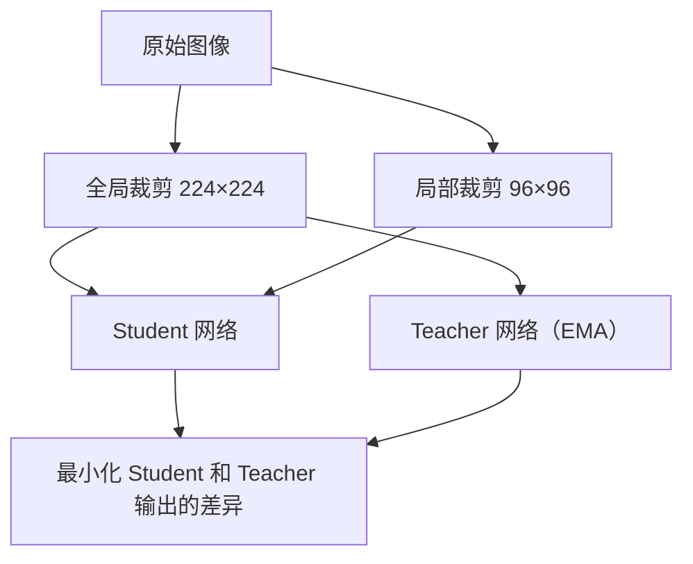

# 第 1 章：视觉表示学习

**学完本章，你将能够：**

- 理解机器人“看懂”世界的难点在哪里
- 说出 ViT、CLIP、DINOv2 三种视觉编码器各自的设计思路和适用场景
- 用 Hugging Face Transformers 调用 CLIP 和 DINOv2 做推理
- 对“具身智能该选哪个视觉编码器”这个问题给出有依据的判断

---

## 1.1 机器人“看懂”世界的难点

先说一个看起来很简单的任务：**机器人把桌上的杯子抓起来。**

对人来说，这不需要思考。你看到杯子，伸手就拿。但拆开来看，这里面至少有三个视觉问题：

1. **识别**：那是一个杯子，不是一瓶水。这意味着你要从像素中提取语义信息。
2. **定位**：杯子在桌面上的哪个位置？离你多远？朝哪个方向倾斜？这需要空间理解。
3. **状态估计**：杯子是空的还是满的？是光滑的还是有把手？这影响你怎么抓、用多大力。

传统做法是为每个问题单独训练一个模型——一个做分类，一个做检测，一个做深度估计。问题是，机器人需要在毫秒级时间内同时处理这些信息，而且真实环境的光照、背景、物体形状变化巨大。为每种变化收集标注数据，根本不现实。

所以具身智能领域的核心问题是：**能不能找到一个通用的视觉表示（visual representation），让同一个特征向量同时编码语义、空间和物理属性？**

这就是视觉表示学习要解决的事。接下来我们看三种逐步逼近这个目标的方法。

---

## 1.2 从 CNN 到 ViT：视觉 Backbone 的演进

### CNN 时代：局部特征的局限

在 ViT 出现之前，视觉模型的主力是 CNN（Convolutional Neural Network，卷积神经网络）。AlexNet（2012）、ResNet（2015）一路走来，CNN 做了一件核心的事：**用滑动窗口逐层提取局部特征，然后堆叠起来形成全局理解。**

CNN 的问题在于它天然偏向局部。一个 3x3 的卷积核只能看到 3x3 像素范围内的关系。虽然可以通过堆叠更多层来扩大感受野（receptive field），但信息传递是间接的——第 10 层才能“间接看到”第 1 层输入的远距离关系。

对于分类、检测这类“只需要关注图片中一小块区域”的任务，CNN 够用了。但对于机器人场景，物体之间的空间关系、遮挡关系、全局布局——这些信息 CNN 捕捉得并不好。

### ViT：把 Transformer 搬到视觉

Dosovitskiy 等人（2020）提出了一个大胆的想法：**直接用 Transformer 处理图像，不用卷积。**

核心思路很简单：

1. 把一张 $224 \times 224$ 的图像切成 $16 \times 16$ 的小块（patch），得到 $14 \times 14 = 196$ 个 patch
2. 每个 patch 展平成一个向量，通过线性映射变成一个 “视觉 token”
3. 在序列前面加一个特殊的 `[CLS]` token
4. 把这 197 个 token 喂进标准 Transformer Encoder


用公式表达 patch embedding 的过程：

$$
z_0 = [x_{\text{cls}}; x_1^1 E; x_2^1 E; \ldots; x_N^1 E] + E_{\text{pos}}
$$

其中 $E \in \mathbb{R}^{(P^2 \cdot C) \times D}$ 是 patch embedding 矩阵，$E_{\text{pos}}$ 是可学习的位置编码。

**ViT 真正厉害的地方**在于：Transformer 的 Self-Attention 是全局的——每个 patch 都可以直接关注其他所有 patch。这意味着第一层就能捕捉到图片左侧和右侧的关系，而 CNN 需要很多层才能间接做到。

但 ViT 有个前提条件：**它需要大量数据才能发挥优势。** 在 ImageNet（130 万张图）上从头训练，ViT 打不过 ResNet。但在 JFT-300M（3 亿张图）上预训练后，ViT 显著超越 CNN。

这引出了一个关键判断：**ViT 的瓶颈不是架构，而是数据和训练方法。** CLIP 和 DINOv2 正是在这个方向上的突破。

---

## 1.3 CLIP：视觉-语言对齐的突破

### 核心思路：用文字教机器“看”

Radford 等人（2021）在 OpenAI 提出了 CLIP（Contrastive Language-Image Pre-training，对比语言-图像预训练）。核心想法非常朴素：**互联网上有海量的“图片+文字描述”配对，用这些天然标注的数据来训练视觉模型。**

以前的做法是：找人标注“这是一只猫”、“这是一条狗”，然后训练分类器。CLIP 不需要这种人工标注——它直接从图文配对中学习。

### 训练方式：对比学习

CLIP 同时训练两个编码器：
- **图像编码器**（ViT 或 ResNet）：把图片变成一个向量
- **文本编码器**（Transformer）：把文字变成一个向量

训练目标是：**让配对的图文向量接近，不配对的远离。**

$$
\mathcal{L} = -\frac{1}{N}\sum_{i=1}^{N}\left[\log\frac{\exp(\text{sim}(v_i, t_i)/\tau)}{\sum_{j=1}^{N}\exp(\text{sim}(v_i, t_j)/\tau)}\right]
$$

其中 $\text{sim}$ 是余弦相似度，$\tau$ 是温度参数。直觉上说：给定一张图，在 $N$ 个文本里找到正确的那个。$N$ 越大，任务越难，CLIP 用了 $N=32768$ 的 batch size。

CLIP 训练了 4 亿个图文对。这带来的一个惊人结果是：**不需要任何额外微调，直接用余弦相似度就能做 zero-shot 分类。** 你想分类“猫还是狗”，只需要构造文本 “a photo of a cat” 和 “a photo of a dog”，然后看图片和哪个文本更像。

### 代码：用 CLIP 做图像分类

```python
import torch
from transformers import CLIPProcessor, CLIPModel
from PIL import Image

# 加载模型
model = CLIPModel.from_pretrained("openai/clip-vit-base-patch32")
processor = CLIPProcessor.from_pretrained("openai/clip-vit-base-patch32")

# 准备输入
image = Image.open("your_image.jpg")
labels = ["a photo of a cat", "a photo of a dog", "a photo of a car"]
inputs = processor(text=labels, images=image, return_tensors="pt", padding=True)

# 推理
with torch.no_grad():
    outputs = model(**inputs)
    logits_per_image = outputs.logits_per_image  # 图文相似度
    probs = logits_per_image.softmax(dim=-1)

for label, prob in zip(labels, probs[0]):
    print(f"{label}: {prob:.4f}")
```

### CLIP 对具身智能意味着什么

CLIP 解决了一个关键问题：**视觉特征和语言特征在同一空间对齐了。**

这对 VLA（Vision-Language-Action）模型至关重要。因为机器人需要理解人类的语言指令（“把红色的杯子拿过来”），然后在视觉中找到对应物体。CLIP 让视觉编码器“听得懂”语言，这是后续所有 VLA 模型的基础。

但 CLIP 也有明显的局限。它本质上是在做“图文匹配”，所以学到的特征偏向**语义信息**（“这是什么”），对**空间信息**（“在哪里”、“有多大”）的编码较弱。对于需要精确空间推理的机器人任务，这一点需要额外处理。

---

## 1.4 DINOv2：自监督视觉表示的 SOTA

### 从 DINO 到 DINOv2：不需要任何标签

Oquab 等人（2023）在 Meta 提出了 DINOv2。和 CLIP 最大的不同是：**DINOv2 完全不需要文字标注，是纯自监督（自蒸馏）的视觉模型。**

DINOv2 的前身 DINO（Caron et al., 2021）已经证明了一个重要发现：**自监督训练的 ViT，其 Attention Map 会自动学出物体的边界。** 没有任何标注，模型自己就知道“这是一只猫的轮廓”。

DINOv2 在此基础上做了三个关键改进：

1. **更大的训练数据**：LVD-142M，1.42 亿张精选图像
2. **更强的自蒸馏**：teacher-student 架构，teacher 是 student 的指数移动平均
3. **加入 CLIP 的知识**：用 CLIP 的视觉特征做正则化，让 DINOv2 的特征也有一定的语义对齐能力

### 训练原理：自蒸馏

DINOv2 的核心训练方式是**自蒸馏（self-distillation）**：



Teacher 网络的参数是 Student 参数的指数移动平均（Exponential Moving Average，EMA）：

$$
\theta_{\text{teacher}} \leftarrow \alpha \cdot \theta_{\text{teacher}} + (1 - \alpha) \cdot \theta_{\text{student}}
$$

Student 看到局部裁剪（只看到图片的一部分），Teacher 看到全局裁剪（看到整张图）。训练目标是：Student 对局部的理解要和 Teacher 对全局的理解一致。

这迫使模型学到**对局部遮挡和视角变化鲁棒的特征**。这对机器人来说非常重要——机器人从来不会从“完美角度”看物体，它看到的永远是部分遮挡的、不完整的世界。

### 代码：用 DINOv2 提取特征

```python
import torch
from transformers import AutoImageProcessor, AutoModel

# 加载模型
processor = AutoImageProcessor.from_pretrained("facebook/dinov2-base")
model = AutoModel.from_pretrained("facebook/dinov2-base")

# 处理图像
from PIL import Image
image = Image.open("your_image.jpg")
inputs = processor(images=image, return_tensors="pt")

# 提取特征
with torch.no_grad():
    outputs = model(**inputs)
    # CLS token：全局特征，768 维
    cls_token = outputs.last_hidden_state[:, 0, :]
    # 所有 patch token：可用于密集预测（分割、深度估计等）
    patch_tokens = outputs.last_hidden_state[:, 1:, :]

print(f"全局特征维度: {cls_token.shape}")      # [1, 768]
print(f"Patch 特征维度: {patch_tokens.shape}")  # [1, 256, 768] — DINOv2 用 14x14 patch, 224/14=16, 16x16=256 个 patch
```

### DINOv2 的优势

和 CLIP 相比，DINOv2 的特征在以下场景明显更强：

| 能力 | CLIP | DINOv2 |
|---|---|---|
| 语义分类 | 强 | 强 |
| 目标检测 | 一般 | 强 |
| 语义分割 | 一般 | 非常强 |
| 深度估计 | 弱 | 强 |
| 零样本分类 | 非常强 | 一般 |
| 与语言对齐 | 原生支持 | 需额外处理 |

DINOv2 的 patch token 保留了丰富的空间信息，可以直接用于密集预测任务。这对于机器人场景中“精确理解物体形状和位置”的需求很契合。

---

## 1.5 3D 视觉表示入门

到目前为止我们讨论的都是 2D 图像。但真实世界是三维的。机器人不仅要知道“那是一个杯子”，还要知道“杯子在前方 0.5 米处，高度 0.3 米”。

### 深度图（Depth Map）

深度图是一张和 RGB 图像同样大小的图，每个像素记录的是“这个点距离相机有多远”。获取方式有两类：

- **主动感知**：结构光（如 RealSense）、ToF（如 LiDAR）
- **被动估计**：单目深度估计模型（如 Depth Anything V2）

对于 VLA 模型来说，深度图通常作为 RGB 之外的额外输入通道。很多实验表明，加入深度信息能显著提高抓取成功率，因为模型直接知道了物体的三维位置，不用从 2D 线索中“猜”。

### 点云（Point Cloud）

点云是三维空间中一组点的集合，通常由 LiDAR 或多视角重建生成。每个点有 $(x, y, z)$ 坐标，有时还带颜色或法线。

点云的处理架构主要有：
- **PointNet / PointNet++**（Qi et al., 2017）：直接处理无序点集
- **Point Transformer**（Zhao et al., 2021）：把 Transformer 用到点云上

但在 VLA 和世界模型领域，2D 视觉编码器（ViT/CLIP/DINOv2）仍然是主流。3D 信息更多通过深度图作为额外通道融入，而不是单独的点云处理流水线。你只需要知道这些概念存在，不需要现在深入。

---

## 1.6 对于 VLA/机器人，选哪个视觉编码器？

这是最实际的问题。我的判断是：**没有万能选择，但有清晰的选择框架。**

### 选择依据

| 你的任务需要什么 | 推荐选择 | 理由 |
|---|---|---|
| 理解语言指令 + 视觉（如“拿红色的杯子”） | **CLIP** | 视觉-语言对齐是原生的，不需要额外训练 |
| 精确的空间理解（如抓取、分割） | **DINOv2** | patch 特征保留了丰富的空间信息 |
| 需要两者兼顾 | **DINOv2 + 语言投影层** | 用一个简单的 MLP 把 DINOv2 特征投影到 CLIP 空间 |
| 计算资源受限 | **CLIP ViT-B/32** | 最轻量，适合实时推理 |

### 实际 VLA 模型用的是什么

看几个代表性模型的选择：

- **RT-2**（Google, 2023）：用 PaLI-X 的 ViT，本质上是 CLIP 风格的视觉-语言联合训练
- **OpenVLA**（2024）：用 SigLIP（CLIP 的改进版）作为视觉编码器
- **π0**（Physical Intelligence, 2024）：用预训练的 ViT，结合 flow matching

**趋势很明确：当前 VLA 模型的主流选择是 CLIP 系的视觉编码器。** 原因很简单——VLA 的核心创新就是“用语言指令控制机器人”，而 CLIP 天然把视觉和语言对齐了。

但 DINOv2 的价值在于**世界模型**。世界模型需要预测“如果机器人做这个动作，下一帧会是什么样”，这需要非常精细的空间理解。下一章讨论世界模型时，DINOv2 的优势会更清楚。

### 一个实用建议

如果你刚开始做具身智能项目，**先用 SigLIP 或 CLIP ViT-L/14（224px）作为默认选择**。OpenVLA 和 π0 都用 SigLIP，社区支持好，出问题容易找到解决方案。等你对具体任务有了更深理解后，再考虑是否需要切换到 DINOv2 或混合方案。

---

## 动手练习

### 练习 1（基础）：CLIP Zero-Shot 分类实验

> 下载或拍摄 5 张不同物体的照片，用 CLIP 做 zero-shot 分类。候选标签自选（至少 10 个）。
>
> 观察：哪些类别的区分度高？哪些容易混淆？把你的发现记录下来。
>
> 提示：注意标签的写法会影响结果。试试 “a photo of a cat” vs “cat” vs “a blurry photo of a cat”，看看准确率有没有变化。

### 练习 2（进阶）：CLIP vs DINOv2 特征对比

> 对同一张图片分别提取 CLIP 和 DINOv2 的特征向量。
>
> 1. 用 t-SNE 或 PCA 把两个模型的 patch token 降维到 2D，可视化对比
> 2. 用 CLS token 做图像检索：给定一张“目标图”，在 20 张图里找最相似的 3 张
>
> 观察：两个模型的检索结果有什么差异？哪种更关注语义，哪种更关注外观？

### 练习 3（挑战）：构建简单的机器人物体识别 pipeline

> 模拟一个简化的机器人场景：
> 1. 在网上找 10 张“桌面场景”图片，每张包含 2-3 个物体
> 2. 用 CLIP 做 zero-shot 检测（对图片做滑动窗口，对每个窗口做分类）
> 3. 记录每个物体的类别和大致位置
>
> 反思：纯 CLIP 能做好这件事吗？哪里会失败？这说明了什么？
>
> 提示：滑动窗口可以用不同大小的 crop 遍历图像。你可能会发现 CLIP 对小物体的识别很弱。

---

## 常见踩坑 FAQ

### Q: CLIP 和 DINOv2 的模型太大，显存不够怎么办？

CLIP ViT-B/32 只需要约 1GB 显存。如果你连这都不够，可以用 `float16` 精度（`model.half()`）或者用 `transformers` 的 `device_map="auto"` 自动分配。DINOv2-base 也类似。只有 DINOv2-giant（1.1B 参数）才需要 4GB+ 显存。

### Q: 用 CLIP 提取的特征能直接拿来训练 VLA 吗？

可以，但通常需要**冻结（freeze）视觉编码器**。原因是 VLA 的训练数据（机器人演示）远少于 CLIP 的预训练数据，如果放开微调，视觉特征容易过拟合到训练场景。OpenVLA、RT-2 等主流做法都是冻结视觉编码器，只训练后面的 action head。

### Q: DINOv2 的 patch token 输出是 $N \times 768$ 的矩阵，怎么变成一个向量？

最简单的方式是取 CLS token（第 0 个 token），它已经被训练为全局特征的摘要。如果你的任务需要空间信息（比如分割或定位），可以保留所有 patch token，在下游任务中做 cross-attention 或者上采样。

### Q: 我看到有人用 SigLIP 替代 CLIP，它们有什么区别？

SigLIP（Zhai et al., 2023）把 CLIP 的 softmax 交叉熵损失换成了 sigmoid 损失。这让训练更稳定，batch size 的要求更低，而且在多个 benchmark 上略优于 CLIP。OpenVLA 用的就是 SigLIP。如果你做新项目，选 SigLIP 是更好的默认选择。但两者的使用方式几乎一样，迁移成本很低。

### Q: 为什么不直接用 ResNet 或 EfficientNet 作为视觉编码器？

在 VLA 领域，ViT 系列模型的优势已经被反复验证。主要原因有两个：(1) ViT 的全局注意力能更好地理解场景中的物体关系；(2) ViT 系列有 CLIP、DINOv2 这样的高质量预训练权重，而 CNN 系列的预训练模型大多只在 ImageNet 分类上训练过，特征的通用性不如 ViT。

---

下一章：[第 2 章：VLM 基础 — 让模型同时看图和读文字](/notes/tutorial/world-model-vla-agent/02-vision-language-model/)。
