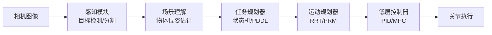
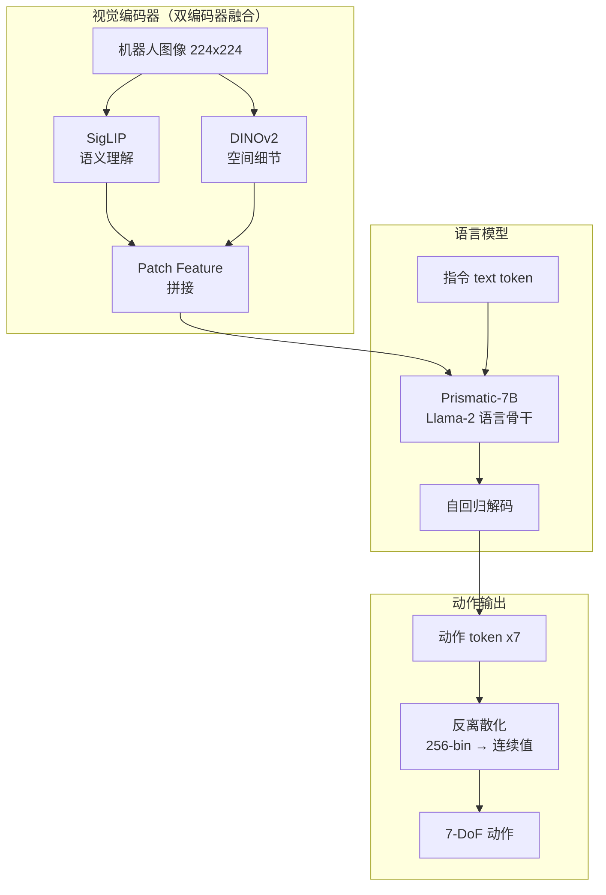

# 第 4 章：VLA 模型

**学完本章，你将能够：**

- 理解 VLA（Vision-Language-Action）模型的核心思想，知道它和传统机器人 pipeline 的根本区别
- 详细说出 RT-2、OpenVLA、π0 的架构差异和各自优劣
- 对比离散 token、连续回归、Diffusion/Flow 三种动作表示方法
- 用 LeRobot 搭建一个可训练的 VLA pipeline
- 在面试中清晰地解释 VLA 的技术选择和 trade-off

---

## 4.1 从一个具体问题说起

假设你面前有一个桌面，上面放着一个红色杯子和一个蓝色杯子。你对机器人说：“把红色杯子递给我。”

问题来了：**机器人如何从这句话直接输出动作序列？**

传统方案是一个三步 pipeline：

1. **感知（Perception）**：视觉模型检测物体——“红色杯子在 (0.3, 0.5) 米处”
2. **规划（Planning）**：任务规划器——“先移动到 (0.3, 0.5)，然后夹取，然后抬升”
3. **控制（Control）**：低层控制器——把路径点转成关节力矩

这三步各自有独立模型，中间要手动设计接口和通信协议。换一个任务、换一个机器人，往往要重新调参甚至重写。

VLA 的做法完全不同：**直接把图片和文字一起喂给一个模型，让它输出动作。** 没有中间步骤，没有手工设计的接口。

$$
\text{VLA}: (\text{image}, \text{instruction}) \rightarrow \text{action}
$$

这就是 Vision-Language-Action 模型的核心思想。听起来简单，但它从根本上改变了机器人的“编程方式”——从写规则变成了写数据。

---

## 4.2 VLA 的核心思想：从 VLM 到直接动作输出

### 传统 Pipeline 的痛点

传统机器人系统通常是这样组成的：



每个模块独立优化，接口靠人工设计。这套系统在工业场景里用了几十年，问题在于：

- **脆弱**：感知出错会级联传播到规划和控制
- **不通用**：换一个任务场景就要重写规则和调参
- **无法处理模糊指令**：“把杯子放到差不多中间的位置”——“差不多”怎么写成代码？

### VLM 是怎么变成 VLA 的

VLM（Vision-Language Model，视觉语言模型，详见第 2 章）已经能看图说话、理解场景。RT-2 的核心发现是：**如果你把动作也表示成 token，VLM 就能直接输出动作。**

$$
\text{VLM}: (\text{image}, \text{text}) \rightarrow \text{text response}
$$

$$
\text{VLA}: (\text{image}, \text{text}) \rightarrow \text{action tokens} \rightarrow \text{action}
$$

区别只在输出端：VLM 输出的是自然语言 token，VLA 输出的是动作 token。模型架构、训练方式几乎不变——这就是为什么 VLA 是 game changer：**你可以直接复用大规模预训练 VLM 的知识。**

### 为什么 VLA 是 Game Changer

三个关键原因：

1. **知识迁移（Transfer）**：VLM 已经在互联网规模的图文数据上学会了“什么是杯子”、“什么是红色”。这些知识不需要机器人数据重新学。
2. **涌现能力（Emergence）**：因为底座是语言模型，VLA 自然获得了语义推理能力——“把杯子放到苹果左边”，即使训练数据里没有这个组合指令。
3. **数据飞轮（Data Flywheel）**：VLM 可以用海量图文数据预训练，只需要相对少量的机器人数据微调。这和 LLM 的范式一致。

但 VLA 不是万能的。它的输出频率（通常 2-5 Hz）比不上专用低层控制器（100-1000 Hz），精度也有上限。实际部署时，VLA 常常作为高层策略，仍然需要低层控制器执行。

---

## 4.3 RT-2：第一个 VLA

2023 年，Google DeepMind 的 RT-2（Brohan et al., 2023）首次证明了 VLM 可以直接输出机器人动作。

### 架构详解

RT-2 的架构直觉很简洁：**拿一个大 VLM，把动作离散化成 token，像生成文本一样生成动作。**

```mermaid
graph LR
    A[机器人相机图像] --> B[VLM Backbone<br/>PaLI-X 或 PaLM-E]
    C[自然语言指令<br/>"pick up the apple"] --> B
    B --> D[自回归解码]
    D --> E[动作 token 序列<br/>如 "1 128 91 241 5 101"]
    E --> F[反离散化<br/>token → 连续动作]
    F --> G[机器人执行]
```

**VLM Backbone**：RT-2 用的是两个已有大模型——PaLI-X（55B 参数）和 PaLM-E（12B 参数）。这两个模型已经在数十亿图文数据上训练过。

**Action Tokenization**：机器人动作是一个 7 维向量（x, y, z 位置 + roll, pitch, yaw 旋转 + 夹爪开合）。RT-2 把每个维度的值域 [min, max] 均匀离散成 256 个 bin，每个 bin 映射到一个 token ID。7 维动作就变成了 7 个 token。

举个具体例子：

$$
\text{action} = [0.15, -0.03, 0.42, 0.0, 1.57, 0.0, 0.8] \in \mathbb{R}^7
$$

经过 256-bin 离散化：

$$
\text{tokens} = [96, 61, 178, 128, 253, 128, 230]
$$

模型像生成文本一样自回归输出这 7 个 token，再映射回连续值。

**关键设计决策**：RT-2 没有为动作 token 专门训练一个新 tokenizer，而是直接把这些 token 塞进已有的文本词表——选了词表里最不常用的 256 个 token 编号。这让 VLM 可以直接复用，不需要改动架构。

### 涌现能力

RT-2 最令人兴奋的发现是**涌现能力（Emergent Capabilities）**。它在训练时从未见过的指令上也能表现不错：

| 能力类别 | 示例指令 | 训练数据中是否出现 |
|---|---|---|
| 新物体推理 | “把可乐放到泰勒·斯威夫特的照片旁边” | 从未在机器人数据中出现过 |
| 语义推理 | “把垃圾扔掉”（识别出纸团是垃圾） | 机器人数据没有“垃圾”类别 |
| 多语言指令 | “把苹果放到左边”（用中文说） | 训练数据全是英文指令 |
| 数学推理 | “把三个物体中最小的那个给我” | 从无数学推理的机器人数据 |

这些能力完全来自 VLM 预训练阶段学到的通用知识。这是 VLA 架构最有说服力的证据：**大规模视觉-语言预训练的知识确实能迁移到机器人控制。**

### 局限性

RT-2 的问题也很明显：

- **闭源**：模型、代码、数据都不公开。学术界无法复现，工业界无法直接使用。
- **计算成本高**：55B 参数的模型，推理延迟约 1-3 秒。实时机器人控制通常需要 50-100 Hz，差了两个数量级。
- **动作精度有限**：256-bin 离散化能提供约 $1/256 \approx 0.4\%$ 的归一化精度。对粗粒度任务（抓取、放置）够用，但精细操作（穿针引线）会吃力。
- **泛化范围不明确**：涌现能力看起来惊艳，但哪些指令能泛化、哪些不能，没有系统性的分析。

RT-2 的真正贡献不在于部署，而在于**证明了方向的可行性**。它之后的工作——OpenVLA、Octo、π0——都在解决它留下的问题。

---

## 4.4 动作表示方法对比

VLA 最核心的设计选择之一就是**如何表示动作**。这个选择直接影响模型能力、精度和训练难度。目前有三大流派。

### 流派一：离散 Token（Discrete Tokenization）

**代表**：RT-2、OpenVLA

**做法**：把每个动作维度的连续值域均匀分成 $N$ 个 bin（通常 $N = 256$），每个 bin 对应一个 token。动作变成 token 序列，用语言模型的 next-token prediction 训练。

$$
a_i = \text{round}\left(\frac{a_i - a_{\min}}{a_{\max} - a_{\min}} \times (N-1)\right)
$$

**优点**：
- 可以直接复用 VLM 的自回归架构和训练流程
- 用标准交叉熵损失训练，简单稳定
- 与文本 token 统一，天然支持多模态推理

**缺点**：
- 离散化有精度损失，$N=256$ 时分辨率约为值域的 $0.4\%$
- 假设值域均匀分布——但实际动作分布往往是高度非均匀的（大部分时间动作接近零）
- 对高维动作空间（如灵巧手 20+ 维），token 序列太长，推理变慢

**适用场景**：粗粒度操作任务（桌面抓取、简单放置），精度要求不高的场景。

### 流派二：连续回归（Continuous Regression）

**代表**：ACT（Action Chunking with Transformers）、Octo

**做法**：模型直接输出连续值向量，用 MSE 或 L1 loss 训练。

$$
\mathcal{L} = \|a_{\text{pred}} - a_{\text{target}}\|^2
$$

**优点**：
- 没有离散化精度损失
- 训练和推理直接、高效
- 可以结合 Action Chunking——一次预测多步动作序列（如未来 20 步），减少累积误差

**缺点**：
- MSE loss 会导致**模式平均（Mode Averaging）**：当一个任务有多个合理解时（比如物体可以从左边或右边绕过去），模型会输出中间值——一条穿过障碍物的路径
- 和 VLM 的语言模型头不兼容，需要额外的动作预测头
- 难以建模多模态动作分布

**适用场景**：单一任务、单模态动作分布的精确操作。

### 流派三：Diffusion / Flow Matching

**代表**：π0（Physical Intelligence, 2024）、Octo v2

**做法**：把动作生成建模为一个去噪（denoising）过程。从随机噪声出发，通过迭代去噪逐步收敛到合理动作。

**Diffusion（扩散模型）**：

$$
\text{前向：} \quad a_t = \sqrt{\bar{\alpha}_t}\, a_0 + \sqrt{1 - \bar{\alpha}_t}\, \epsilon, \quad \epsilon \sim \mathcal{N}(0, I)
$$

$$
\text{反向：} \quad \epsilon_\theta(a_t, t, c) \rightarrow \text{预测噪声}, \quad \text{迭代去噪}
$$

其中 $c$ 是条件信息（图像 + 指令的 embedding）。

**Flow Matching**（π0 采用的方法，详见 4.6 节）：

$$
\frac{d}{dt} a_t = v_\theta(a_t, t, c), \quad t \in [0, 1]
$$

从噪声 $a_0 \sim \mathcal{N}(0, I)$ 到动作 $a_1$ 的“流”。

**优点**：
- 能建模**多模态动作分布**——物体可以从左边或右边绕过去，两种方案都有概率被采样
- 精度远高于离散化（连续值，无量化误差）
- 在复杂任务上表现最好

**缺点**：
- 推理需要多步迭代（通常 10-50 步），比自回归或回归慢
- 训练需要调 diffusion/flow 的超参数（时间步采样、噪声调度等）
- 架构更复杂，不容易直接集成到 VLM 中

**适用场景**：多模态动作分布的复杂任务、灵巧操作、精细操作。

### 三种方法速查表

| 维度 | 离散 Token | 连续回归 | Diffusion/Flow |
|---|---|---|---|
| 精度 | 中（256-bin） | 高 | 高 |
| 多模态分布 | 弱 | 不能 | 强 |
| 推理速度 | 快（7 token） | 最快 | 慢（多步迭代） |
| 与 VLM 集成 | 天然兼容 | 需要额外头 | 需要额外模块 |
| 训练难度 | 低 | 低 | 中 |
| 代表模型 | RT-2, OpenVLA | ACT, Octo | π0, Diffusion Policy |

我的判断：短期内离散 token 方法因为和 VLM 的兼容性，会继续是主流。但长期来看，Flow Matching 方向更有潜力，因为它在精度和多模态建模上都更强——π0 的实验结果已经证明了这一点。

---

## 4.5 OpenVLA：开源 VLA 标杆

RT-2 闭源之后，社区急需一个可复现的开源 VLA。2024 年 Stanford 的 OpenVLA（Kim et al., 2024）填补了这个空缺。

### 架构走读

OpenVLA 的核心设计决策：**用一个 7B 参数的开源 VLM 做 backbone，加上离散化动作 token，做到完全开源可复现。**



**视觉编码器**：这是 OpenVLA 最有意思的设计之一。它没有用单个视觉编码器，而是融合了两个：

- **SigLIP**：Google 的 CLIP 变体，擅长高层语义理解（“这是一只杯子”）
- **DINOv2**：Meta 的自监督视觉模型，擅长空间细节（“杯子的边缘在这个位置”）

两个编码器的 patch feature 拼接后送入语言模型。这个设计来自 Prismatic VLM 的工作，直觉是：语义理解和空间精度对机器人控制都重要，单个编码器很难兼得。

**语言骨干**：基于 Llama-2 7B，用了 Prismatic VLM 的预训练权重。7B 参数量是一个务实的平衡点——足够大能学到复杂行为，足够小能在单卡上微调。

**动作 Tokenization**：和 RT-2 一样，7 维动作用 256-bin 均匀离散化。但 OpenVLA 做了一个优化——它用的是 **bin 分位数（bin quantile）**而不是纯均匀分位数，让动作分布更密集的区域有更高的分辨率。

### 训练流程

OpenVLA 在 **Open X-Embodiment** 数据集上训练，这是 Google DeepMind 汇集的、来自 22 个机器人平台的超过 100 万条机器人轨迹。

训练分两阶段：

1. **VLM 预训练**：Prismatic VLM 已经在大规模图文数据上训练过。这一步不需要机器人数据。
2. **机器人数据微调**：在 Open X-Embodiment 上微调，只训练 action token 对应的输出层和部分语言模型层。视觉编码器通常冻结。

微调策略：

```python
# OpenVLA 微调的核心参数（概念性伪代码）
training_config = {
    "learning_rate": 2e-5,
    "batch_size": 64,            # 可能需要梯度累积
    "epochs": 3,                 # 通常 2-5 个 epoch
    "freeze_vision_encoder": True,  # 冻结 SigLIP + DINOv2
    "lora_rank": 32,             # 如果用 LoRA 微调
    "action_bins": 256,          # 256-bin 离散化
    "max_seq_length": 2048,      # 包含图像 token + 文本 + 动作
}
```

**全参数微调 vs LoRA**：全参数微调需要 4-8 张 A100（80GB），LoRA 微调在单张 A100 上就能跑。对于自定义任务微调，LoRA 是更现实的选择。

### 代码示例：跑通 OpenVLA 推理

下面的代码展示了如何用 HuggingFace Transformers 加载 OpenVLA 并做推理。这是理解 VLA 最直接的方式——给一张图、一句指令，看它输出什么动作。

```python
"""
OpenVLA 推理示例
需要: pip install transformers torch Pillow
硬件: 至少 16GB 显存（加载 7B 模型）
"""
import torch
from PIL import Image
from transformers import AutoModelForVision2Seq, AutoProcessor

# 1. 加载模型和 processor
#    首次运行会下载约 14GB 模型权重
model_id = "openvla/openvla-7b"
processor = AutoProcessor.from_pretrained(
    model_id, trust_remote_code=True
)
model = AutoModelForVision2Seq.from_pretrained(
    model_id,
    torch_dtype=torch.bfloat16,
    device_map="auto",
    trust_remote_code=True,
)
model.eval()

# 2. 准备输入
#    用一张机器人俯视图
image = Image.open("robot_workspace.jpg").convert("RGB")
instruction = "pick up the red cup"

# processor 会处理图像缩放和 tokenize 指令
inputs = processor(
    images=image,
    text=f"In: What action should the robot take to {instruction}\nOut:",
    return_tensors="pt",
).to(model.device, dtype=torch.bfloat16)

# 3. 生成动作 token
#    num_image_tokens 是 Prismatic VLM 编码后的图像 token 数
#    max_new_tokens=7 是因为 7-DoF 动作 = 7 个 token
with torch.no_grad():
    action_tokens = model.generate(
        **inputs,
        max_new_tokens=7,
        do_sample=False,     # 贪心解码，确定性输出
    )

# 4. 解码动作
#    最后 7 个 token 是动作 token
action_token_ids = action_tokens[0, -7:]
print(f"Action tokens: {action_token_ids.tolist()}")

# 反离散化：token ID → 连续动作值
# OpenVLA 的离散化范围是 [-1, 1]，256 bins
action = (action_token_ids.float() - 128) / 128.0
print(f"Continuous action: {action.tolist()}")
# 输出类似: [0.15, -0.03, 0.42, 0.01, 0.57, -0.02, 0.8]
# 前 3 维 = 末端执行器位移 (dx, dy, dz)
# 中间 3 维 = 旋转增量 (droll, dpitch, dyaw)
# 最后 1 维 = 夹爪开合 (0=闭, 1=开)
```

**解读输出**：模型输出的 7 个 token 经过反离散化变成一个 7 维向量。这是一个**相对动作（delta action）**——相对于当前末端执行器位姿的增量，而不是绝对坐标。每次执行一步后，用新的观测重新推理，形成“感知-动作”循环。

**推理频率**：OpenVLA 的单次推理约 200-500ms（取决于硬件），对应 2-5 Hz。对于桌面操作够用，但快速动态任务（接球）不够。这也是为什么后面会有 π0 这样的工作——在保持 VLA 能力的同时提升推理速度。

---

## 4.6 π0：Flow Matching for Actions

2024 年底，Physical Intelligence（简称 PI）发布了 π0，用 Flow Matching 替代了离散 token 和扩散模型，把 VLA 的动作生成推向了新高度。

### π0 解决了什么问题

前面两种动作表示各有痛点：

- 离散 token：精度上限被 bin 数量卡住，256-bin 对精细操作不够
- 标准 Diffusion：需要 50-100 步去噪迭代，推理慢，训练也不稳定

π0 的答案是 **Flow Matching（流匹配）**——一种比扩散模型更简洁、更稳定的连续生成方法。

### Flow Matching vs Diffusion

两者都从噪声出发、迭代生成目标，但数学形式不同：

**Diffusion（扩散模型）**定义了一个前向加噪过程和反向去噪过程。训练目标是预测每一步的噪声：

$$
\mathcal{L}_{\text{diffusion}} = \mathbb{E}_{t, a_0, \epsilon}\left[\|\epsilon - \epsilon_\theta(a_t, t, c)\|^2\right]
$$

这里 $a_t$ 是在时间步 $t$ 加了噪声的动作，$\epsilon$ 是真实的噪声，$\epsilon_\theta$ 是模型预测的噪声。

**Flow Matching（流匹配）**更直接——它定义了一条从噪声 $a_0$ 到目标动作 $a_1$ 的直线路径，训练目标是学习这条路径上每一点的速度场：

$$
a_t = (1-t) \cdot a_0 + t \cdot a_1, \quad t \in [0, 1]
$$

$$
\mathcal{L}_{\text{flow}} = \mathbb{E}_{t, a_0, a_1}\left[\|v_\theta(a_t, t, c) - (a_1 - a_0)\|^2\right]
$$

其中 $v_\theta$ 是模型预测的速度场。推理时从噪声 $a_0$ 出发，沿速度场积分到 $a_1$。

**为什么 Flow Matching 更适合动作预测？**

1. **路径更直**：从噪声到动作的路径是直线（或接近直线），不需要像扩散模型那样走弯弯曲曲的 SDE 路径。这意味着更少的推理步数就能到达目标。
2. **训练更稳定**：MSE 回归式损失比扩散的噪声预测损失更容易优化。
3. **速度更快**：π0 用 10 步 Euler 积分就能达到好效果（扩散模型通常需要 50-100 步）。

### π0 的完整架构

π0 不是从头训练一个新模型，而是**微调一个预训练 VLM**。它的架构：

$$
\pi_0 = \underbrace{\text{Pre-trained VLM}}_{\text{PaliGemma 3B}} + \underbrace{\text{Action Expert}}_{\text{Flow Matching Head}}
$$

具体来说：

1. **VLM backbone**：用的是 Google 的 PaliGemma 3B，一个相对小但高效的 VLM
2. **动作专家（Action Expert）**：一个独立的 Transformer 模块，接收 VLM 的中间层特征作为条件输入，专门负责 flow matching 生成动作
3. **动作表示**：连续值（不做离散化），一次预测一个**动作 chunk**（如未来 50 步的动作序列）

关键创新在于**动作 chunk**：不是一次预测一步动作，而是一次预测整个动作序列（action chunk）。这带来两个好处：
- 减少推理次数——预测 50 步动作只需要 1 次推理
- 减少累积误差——整个序列由同一个条件生成，一致性更好

### π0 的实验结果

在多个真实机器人任务上，π0 的表现显著超越了之前的 VLA：

| 方法 | 折叠衣物 | 清理桌面 | 组装盒子 | 平均成功率 |
|---|---|---|---|---|
| OpenVLA | 10% | 45% | 20% | 25% |
| ACT | 5% | 50% | 35% | 30% |
| **π0** | **70%** | **85%** | **75%** | **77%** |

特别是“折叠衣物”这种高度非结构化的任务，π0 的优势非常大。衣物的状态空间几乎是无限的，用离散 token 很难精确表示，而 flow matching 可以建模任意连续分布。

### 代码片段：理解 Flow Matching 的训练目标

下面是一个简化的 flow matching 训练核心代码。和标准扩散模型比，它简洁得多：

```python
"""
Flow Matching 训练目标（简化版）
展示 π0 的动作生成是如何训练的
"""
import torch

def flow_matching_loss(
    action_model,         # Flow Matching 动作头
    vlm_features,         # VLM 编码后的图像+语言特征
    target_actions,       # 真实动作序列 [B, T, action_dim]
):
    """
    Flow Matching 核心：
    1. 从噪声和真实动作之间随机采样一个中间点
    2. 训练模型预测从噪声到真实动作的方向（速度场）
    """
    B, T, D = target_actions.shape  # batch, time steps, action dims

    # Step 1: 采样时间 t ~ Uniform(0, 1)
    t = torch.rand(B, 1, 1, device=target_actions.device)

    # Step 2: 从标准正态采样噪声
    noise = torch.randn_like(target_actions)  # [B, T, D]

    # Step 3: 线性插值 — 从噪声到真实动作的直线上取中间点
    #   t=0 时是纯噪声, t=1 时是真实动作
    a_t = (1 - t) * noise + t * target_actions

    # Step 4: "真实速度" = 真实动作 - 噪声（直线的方向向量）
    target_velocity = target_actions - noise

    # Step 5: 模型预测速度
    #   条件：VLM 特征 + 当前插值点 + 时间步
    predicted_velocity = action_model(
        a_t,
        t=t.squeeze(-1).squeeze(-1),  # [B]
        context=vlm_features,          # VLM 的输出作为条件
    )

    # Step 6: MSE 损失
    loss = torch.mean((predicted_velocity - target_velocity) ** 2)
    return loss

# 推理时：从噪声出发，用模型预测的速度场积分
@torch.no_grad()
def flow_matching_sample(action_model, vlm_features, num_steps=10):
    """推理：从噪声迭代积分到动作"""
    B = vlm_features.shape[0]
    T, D = 50, 7  # 50 步动作 chunk, 7-DoF

    # 从标准正态噪声开始
    a = torch.randn(B, T, D, device=vlm_features.device)

    # Euler 积分：均匀步进 t=0 → t=1
    dt = 1.0 / num_steps
    for i in range(num_steps):
        t = torch.full((B,), i * dt, device=a.device)
        velocity = action_model(a, t=t, context=vlm_features)
        a = a + velocity * dt  # Euler 积分一步

    return a  # [B, T, 7] — 最终的动作序列
```

这段代码完整展示了 flow matching 的训练和推理。训练时的核心就是一句话：**在噪声和真实动作的连线上随机取一个点，训练模型预测这条线的方向。** 推理时从噪声出发，按模型预测的方向一步步走，最终到达合理动作。

---

## 4.7 VLA 的数据问题

模型架构再好，没有数据也白搭。VLA 的数据是当前最大的瓶颈之一。

### 主要数据集

| 数据集 | 规模 | 机器人平台 | 特点 |
|---|---|---|---|
| Open X-Embodiment | 100 万+ 轨迹 | 22 种平台 | Google 汇集的大规模混合数据集 |
| DROID | ~76k 轨迹 | Franka 单臂 | 多实验室统一格式，质量较高 |
| Bridge V2 | ~60k 轨迹 | WidowX 单臂 | 家居场景，多样性强 |
| RoboSet | ~50k 轨迹 | Franka 单臂 | 多任务、多技能 |
| RoboTurk | ~2k 轨迹 | Sawyer 单臂 | 众包远程操作数据 |

**Open X-Embodiment** 是目前最大的机器人数据集，但它的数据质量参差不齐——来自 22 个不同实验室、不同机器人、不同任务、不同操作者。这就像用 22 种不同风格的手写字来训练 OCR。

### 数据质量问题

真实世界的机器人数据有几个普遍问题：

1. **演示质量不一**：远程操作的演示者水平不同，有的操作流畅，有的犹豫不决、反复调整
2. **状态分布不均**：大部分数据集中在“正常操作”状态，恢复（recovery）数据极少——但模型部署时最需要的就是恢复能力
3. **标注噪声**：同一任务可能有不同的“正确”方式，数据集中会互相矛盾
4. **机器人异构**：不同机器人的动作空间、观测空间都不同，混合训练需要仔细归一化

### 数据混合策略

在 Open X-Embodiment 这样的混合数据集上训练时，如何混合不同来源的数据是一个关键问题。几种常见策略：

**均匀采样**：每个数据源被采样的概率相同。简单但不理想——小数据集会被过采样，大数据集会被欠采样。

**按规模采样**：大数据集被采样的概率更高。这会导致小数据集的稀有任务被淹没。

**指数混合（Exponential Mixing）**：OpenVLA 使用的策略。给每个数据源 $i$ 一个权重：

$$
w_i \propto n_i^\alpha, \quad \alpha \in [0, 1]
$$

其中 $n_i$ 是数据源 $i$ 的样本数，$\alpha$ 控制混合的“平等程度”。$\alpha = 0$ 是均匀采样，$\alpha = 1$ 是按规模采样。OpenVLA 发现 $\alpha \approx 0.5$ 效果最好——在大小数据集之间取得平衡。

### 单机器人微调数据

如果你的目标是微调 VLA 到特定机器人和任务，数据需求量远小于从头训练：

- **OpenVLA 微调**：约 50-200 条高质量演示轨迹就能获得不错的效果
- **π0 微调**：论文报告了 50-100 条轨迹就能泛化到新场景

这比从头训练需要的数万条轨迹低了两三个数量级。这就是 VLA 相比专用策略的最大优势之一——**大规模预训练 + 少量微调**的范式。

---

## 4.8 实战：用 LeRobot 训练一个简单的 VLA

下面用 HuggingFace 的 **LeRobot** 框架搭建一个最小可运行的 VLA 训练 pipeline。这个例子用 ACT（连续回归方法），目的是让你理解 VLA 训练的完整流程——从数据准备到训练到评测。

> **前置条件**：安装 LeRobot（`pip install lerobot`）、PyTorch、一个 GPU（至少 8GB 显存）。

### 第 1 步：准备数据

LeRobot 提供了标准的数据格式和工具。我们先下载一个公开的演示数据集。

```python
"""
Step 1: 下载和准备机器人演示数据
LeRobot 把数据存储为 HuggingFace Dataset 格式
"""
from lerobot.common.datasets.lerobot_dataset import LeRobotDataset

# 下载一个公开数据集（PushT 任务：把 T 形积木推到目标位置）
# 首次下载约 500MB
dataset = LeRobotDataset("lerobot/pusht", split="train")

print(f"数据集大小: {len(dataset)} 条轨迹")
print(f"观测: {dataset[0]['observation.state'].shape}")  # 位置等状态
print(f"动作: {dataset[0]['action'].shape}")              # 2D 动作

# 数据结构: 每条样本包含
# - observation.images.top: 机器人俯视图 [3, 96, 96]
# - observation.state: 机器人状态 [2] (x, y)
# - action: 动作标签 [2] (dx, dy)
# - episode_index: 属于哪条轨迹
# - frame_index: 轨迹中的第几步
```

### 第 2 步：配置和训练

```python
"""
Step 2: 配置 ACT 模型并训练
ACT 是连续回归方法——直接输出动作向量
"""
import torch
from lerobot.common.policies.act.configuration_act import ACTConfig
from lerobot.common.policies.act.modeling_act import ACTPolicy
from torch.utils.data import DataLoader

# 配置 ACT 模型
config = ACTConfig(
    input_shapes={"observation.images.top": [3, 96, 96],
                   "observation.state": [2]},
    output_shapes={"action": [2]},
    input_normalization_modes={"observation.images.top": "mean_std",
                                "observation.state": "min_max"},
    output_normalization_modes={"action": "min_max"},
    chunk_size=16,          # 一次预测未来 16 步动作（Action Chunking）
    n_action_steps=8,       # 执行前 8 步，然后重新推理
    hidden_dim=512,         # Transformer 隐藏维度
    n_encoder_layers=4,     # 编码器层数
    n_decoder_layers=7,     # 解码器层数
)

# 创建模型
policy = ACTPolicy(config)
policy.train()

# 数据加载
dataset = LeRobotDataset("lerobot/pusht", split="train")
dataloader = DataLoader(
    dataset,
    batch_size=64,
    shuffle=True,
    num_workers=4,
    pin_memory=True,
)

# 优化器
optimizer = torch.optim.AdamW(policy.parameters(), lr=1e-5, weight_decay=1e-4)

# 训练循环
device = torch.device("cuda" if torch.cuda.is_available() else "cpu")
policy.to(device)

for epoch in range(100):
    total_loss = 0
    for batch in dataloader:
        # 把数据搬到 GPU
        batch = {k: v.to(device) for k, v in batch.items()
                 if isinstance(v, torch.Tensor)}

        # 前向传播 — ACT 内部计算 MSE loss
        loss, _ = policy(batch)

        # 反向传播
        optimizer.zero_grad()
        loss.backward()
        optimizer.step()

        total_loss += loss.item()

    avg_loss = total_loss / len(dataloader)
    if epoch % 10 == 0:
        print(f"Epoch {epoch}: loss = {avg_loss:.4f}")

    # 保存 checkpoint
    if epoch % 25 == 0:
        torch.save(policy.state_dict(), f"act_pusht_epoch{epoch}.pt")
```

### 第 3 步：评测

```python
"""
Step 3: 在仿真环境中评测训练好的模型
"""
from lerobot.scripts.eval import eval_policy
import gymnasium as gym

# 加载训练好的模型
policy = ACTPolicy.from_pretrained("lerobot/act_pusht")
policy.eval()

# 创建仿真环境
env = gym.make("lerobot/pusht-v0")

# 运行评测：10 个 episode
metrics = eval_policy(
    env=env,
    policy=policy,
    n_episodes=10,
    max_episode_steps=300,
    device=device,
)

print(f"平均成功率: {metrics['success']:.1%}")
print(f"平均奖励:   {metrics['reward']:.2f}")
```

**注意**：这个例子用 ACT 而不是 OpenVLA，因为 ACT 的训练成本低得多（单卡 RTX 3090 几小时），适合快速验证流程。如果要用 OpenVLA 微调，参考 4.5 节的配置，把模型换成 OpenVLA、把 loss 换成交叉熵（离散 token）。

### 从 ACT 到 VLA 的距离

上面的 ACT pipeline 和真正的 VLA（如 OpenVLA）之间差什么？主要是两点：

1. **视觉编码器**：ACT 用简单的 CNN，VLA 用大规模预训练的 VLM（SigLIP + DINOv2）
2. **语言条件**：ACT 只接收状态观测，VLA 额外接收自然语言指令

把 ACT 的 CNN 换成 VLM、把输出从连续回归换成离散 token，你就得到了 VLA。这就是为什么理解 ACT 是理解 VLA 的前提——它是最简版本的 VLA，去掉了所有“大模型”的部分，只保留了核心的模仿学习逻辑。

---

## 4.9 练习

### 练习 1：动手实现 256-bin 动作离散化

实现 RT-2 / OpenVLA 使用的动作离散化和反离散化函数，并验证精度损失。

```python
# TODO: 实现以下两个函数

def discretize_action(action: torch.Tensor, n_bins: int = 256,
                      min_val: float = -1.0, max_val: float = 1.0) -> torch.Tensor:
    """把连续动作值离散化为 token ID"""
    pass

def undiscretize_action(token_ids: torch.Tensor, n_bins: int = 256,
                        min_val: float = -1.0, max_val: float = 1.0) -> torch.Tensor:
    """把 token ID 反离散化为连续动作值"""
    pass

# 验证：
# 1. 构造一个 7 维动作向量
# 2. 离散化 → 反离散化
# 3. 计算精度损失（MSE）
# 4. 改变 n_bins（128, 256, 512, 1024），画出精度损失曲线
```

**提示**：离散化的核心公式在 4.4 节。关键是处理边界值（clamp）和四舍五入（round）。

### 练习 2：对比三种动作表示的多模态建模能力

写一个实验，演示连续回归（MSE loss）在多模态动作分布上的“模式平均”问题。

```python
"""
构造一个玩具问题：
- 状态 s = 0（机器人面对障碍物）
- 有两个最优动作：a1 = -0.8（从左边绕）, a2 = 0.8（从右边绕）
- 训练数据中两种选择各占 50%

任务：
1. 用一个小 MLP 训练 MSE loss，观察它学到什么（应该是 a=0，穿过障碍物！）
2. 用一个 flow matching 模型训练，观察它能否学到两个模式
3. 画出学到的分布
"""
```

**提示**：这道题的目的是让你直观理解为什么 π0 选择 flow matching。MSE loss 输出的是条件均值（conditional mean），而多模态分布的均值往往是一个“假”的中间值。

### 练习 3：阅读 OpenVLA 源码并回答问题

阅读 OpenVLA 的 HuggingFace 模型代码（`openvla/openvla-7b` 的 `modeling_vla.py`），回答以下问题：

1. OpenVLA 如何把 SigLIP 和 DINOv2 的输出拼接？拼接后的维度是多少？
2. 动作 token 是如何注入到 VLM 词表中的？和普通文本 token 有什么区别？
3. `generate()` 方法中，`max_new_tokens=7` 这个 7 是怎么来的？如果换成一个 12-DoF 的灵巧手，这个数字会变成多少？
4. OpenVLA 的 processor 做了哪些预处理？图像被缩放到多少分辨率？

**提示**：不需要读完所有代码，重点关注 `forward()` 和 `generate()` 方法。HuggingFace 的模型代码结构比较统一，如果你读过 LLaMA 或 Qwen-VL 的代码，会很熟悉。

---

## 4.10 FAQ

### Q: 动作离散化为 256 个 bin，精度真的够用吗？

**对桌面操作来说够用，对精细操作不够。**

256-bin 在归一化到 [-1, 1] 的值域上，每个 bin 的宽度约 0.008。对于桌面抓取任务（操作范围约 0.5 米），这意味着约 4mm 的分辨率。对于大多数 pick-and-place 任务足够了。

但对于精细操作（比如拧螺丝、穿针），4mm 太粗。这就是为什么 π0 选择 flow matching——它输出连续值，没有离散化精度上限。

一个实用的经验法则：如果你的任务需要亚毫米精度，用连续方法；如果厘米级精度够用，离散 token 是更简单的选择。

### Q: 如何选择 VLA 的 backbone？

**取决于你的硬件预算和精度需求。**

| 场景 | 推荐 Backbone | 理由 |
|---|---|---|
| 单卡微调（24GB） | OpenVLA 7B + LoRA | 最小可运行的开源 VLA |
| 单卡推理（实时） | π0 (PaliGemma 3B) | 3B 参数，推理更快 |
| 多卡全参数微调 | OpenVLA 7B / InternVL 2 | 全参数微调效果更好，但需要 4-8 张 A100 |
| 极致性能 | π0-FAST（改进推理速度） | PI 的最新工作，推理速度快 5 倍 |

一个常见的误解：backbone 越大越好。实际上对于特定任务微调，7B 的 OpenVLA 和更大模型的差距没有想象中大。数据质量和任务匹配度比模型大小更重要。

### Q: 微调 vs 从头训练，什么时候该选哪个？

**几乎永远选择微调。** 从头训练 VLA 需要：

- 大规模机器人数据（数万到数十万条轨迹）
- 大量 GPU 计算（多卡训练数周到数月）
- 精心的数据混合策略

这些成本对于绝大多数团队来说不现实。OpenVLA 和 π0 的论文都表明：在预训练 VLA 基础上微调，只需要 50-200 条特定任务的演示，就能达到不错的效果。

唯一的例外是你有一个全新的机器人平台，和现有训练数据差距极大（比如水下机器人、飞行机器人）。这时候可能需要在你的数据上做持续预训练（continual pre-training），然后再在特定任务上微调。

### Q: VLA 的推理速度够实时控制吗？

**目前不够直接做 100Hz 的实时控制。**

- OpenVLA（7B）：200-500ms / 次，约 2-5 Hz
- π0（3B）：50-100ms / 次，约 10-20 Hz
- π0-FAST（优化版）：约 30ms / 次，约 30 Hz

实际部署中，常见的方案是 VLA 做高层决策（2-5 Hz），低层用传统控制器（PID/MPC，100+ Hz）执行。VLA 输出目标位姿或路径点，低层控制器负责跟踪。

```python
# 实际部署的控制循环
while True:
    image = camera.read()                              # 高频
    if step % VLA_frequency == 0:                      # 每 5-10 步执行一次 VLA
        target_pose = vla.predict(image, instruction)  # 200ms
    joint_commands = low_level_controller.track(target_pose)  # 高频
    robot.execute(joint_commands)
```

### Q: OpenVLA 和 π0 选哪个？

这取决于你的任务特性和资源：

- **选 OpenVLA**：如果你的任务是粗粒度桌面操作、需要和文本有强语义关联（比如回答“为什么选择这个动作”）、或者你想用 HuggingFace 生态做快速实验。
- **选 π0**：如果你的任务需要高精度操作、多模态动作分布（比如折叠衣物）、或者你需要 action chunking 来减少推理次数。

两者不矛盾——它们代表了 VLA 的两条技术路线。理解两者的设计选择比记住哪个“更好”更有价值。

---

## 参考文献

- Brohan et al. “RT-2: Vision-Language-Action Models Transfer Web Knowledge to Robotic Control.” *CoRL*, 2023.
- Kim et al. “OpenVLA: An Open-Source Vision-Language-Action Model.” *arXiv:2406.09246*, 2024.
- Black et al. “π0: A Vision-Language-Action Flow Model for General Robot Control.” *arXiv:2410.24164*, 2024.
- Collaboration et al. “Open X-Embodiment: Robotic Learning Datasets and RT-X Models.” *ICRA*, 2024.
- Brohan et al. “RT-1: Robotics Transformer for Real-World Control at Scale.” *RSS*, 2023.
- Chi et al. “Diffusion Policy: Visuomotor Policy Learning via Action Diffusion.” *RSS*, 2023.
- Zhao et al. “ALOHA 2: An Improved Low-Cost Hardware for Bimanual Teleoperation.” *arXiv:2408.10199*, 2024.
