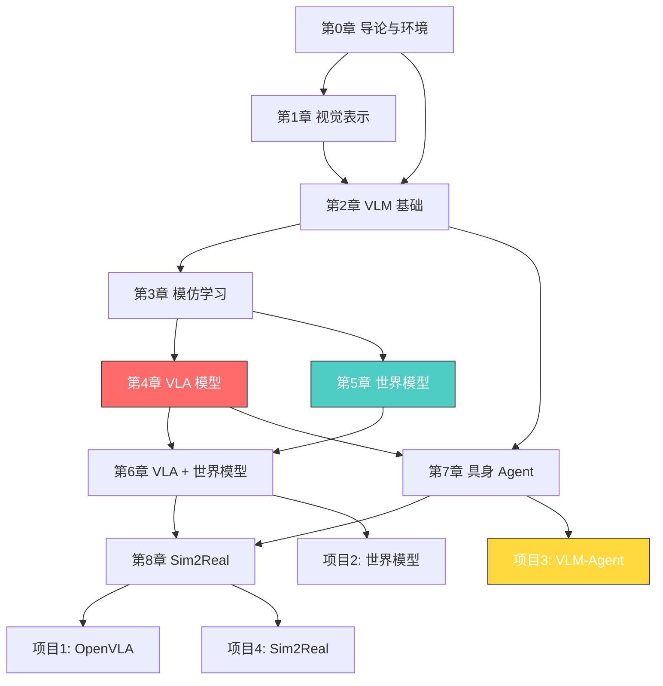

# 世界模型 + VLA + 具身智能

> 从「看论文」到「做出能写进简历的项目」—— 一份面向求职者的具身智能实战指南。

## 这个教程能让你做什么？

学完这个教程，你将能够：

- 理解 VLA（Vision-Language-Action）模型的核心原理，能读懂 RT-2、OpenVLA、π0 等关键论文
- **微调 OpenVLA 到自定义任务**，搭建完整的训练和评测 pipeline
- 理解世界模型（DreamerV3、DIAMOND、Cosmos）的原理，知道它为什么是具身智能的下一个关键
- 用 LLM/VLM 构建具身 Agent，实现任务规划 + 低层执行的层次化系统
- 掌握 Sim2Real 迁移的核心技术（域随机化、Teacher-Student）
- **独立完成 3-4 个项目**，每一个都能写进简历

## 学习路线图



**第 4 章（VLA 模型）是全教程的核心**，建议反复阅读和练习。第 5 章（世界模型）是差异化的关键。项目 3（VLM-Agent）是简历的核心亮点。

### 各章预计学习时间

| 章节 | 内容 | 预计时间 |
|---|---|---|
| 第 0 章 | 导论与环境搭建 | 2 小时 |
| 第 1 章 | 视觉表示学习 | 3 小时 |
| 第 2 章 | VLM 基础 | 4 小时 |
| 第 3 章 | 模仿学习与行为克隆 | 5 小时 |
| 第 4 章 | VLA 模型 ⭐ | 6 小时 |
| 第 5 章 | 世界模型 | 5 小时 |
| 第 6 章 | VLA + 世界模型融合 | 3 小时 |
| 第 7 章 | 具身 Agent 架构 | 5 小时 |
| 第 8 章 | Sim2Real 迁移 | 4 小时 |
| 第 9 章 | 强化学习（附录） | 3 小时 |
| 项目 1 | OpenVLA 微调实战 | 1 周 |
| 项目 2 | 世界模型训练 | 1.5 周 |
| 项目 3 | VLM-Agent 系统 🎓 | 2 周 |
| 项目 4 | Sim2Real Pipeline | 1.5 周 |
| **合计** | | **约 60+ 小时** |

建议节奏：先学完第 0-5 章 + 项目 1-2（约 4 周），再学第 6-8 章 + 项目 3-4（约 3 周）。

## 前置要求

### 你需要知道的

- **Python 基础**：会写函数、用列表和字典、理解类和对象
- **深度学习入门**：知道什么是神经网络、Transformer、训练和推理的区别
- **PyTorch 基础**：会写简单的训练循环、理解 DataLoader 和 Dataset

### 你需要准备的

1. **Python 3.10+**：推荐用 Miniconda 管理
2. **GPU**：NVIDIA RTX 3090/4090 (24GB)。没有 GPU 也能看代码，但做项目需要 GPU
3. **OpenAI API Key**（可选）：第 7 章 Agent 用到 VLM，可以用 API 或本地模型

> **硬件提示**：整个教程在 RTX 4090 (24GB) 上可完整运行。部分大规模训练（如 OpenVLA 全参数微调）标注了更高的硬件需求，但提供了 LoRA 等轻量替代方案。

## 环境搭建

### 第 1 步：创建 Python 虚拟环境

```bash
# 创建项目目录
mkdir wm-vla-tutorial && cd wm-vla-tutorial

# 创建虚拟环境
python -m venv .venv

# 激活虚拟环境
# macOS / Linux
source .venv/bin/activate
# Windows
# .venv\Scripts\activate
```

### 第 2 步：安装核心依赖

```bash
pip install torch torchvision --index-url https://download.pytorch.org/whl/cu121
pip install transformers accelerate peft
pip install mujoco robosuite
pip install lerobot
pip install wandb
```

> 你可以按章节逐步安装。第 0-2 章只需要 `torch` 和 `transformers`，不需要一次性装完。

### 第 3 步：验证环境

```python
# test_env.py
import torch
print(f"PyTorch: {torch.__version__}")
print(f"CUDA: {torch.cuda.is_available()}")
if torch.cuda.is_available():
    print(f"GPU: {torch.cuda.get_device_name(0)}")

try:
    import mujoco
    print(f"MuJoCo: {mujoco.__version__}")
except ImportError:
    print("WARNING: MuJoCo not installed")

try:
    from transformers import AutoModel
    print("Transformers: OK")
except ImportError:
    print("WARNING: transformers not installed")
```

## 这个教程和其他资源有什么不同？

| 维度 | 学术课程 | LeRobot 教程 | **本教程** |
|---|---|---|---|
| 理论深度 | 高 | 低 | 中高 |
| 代码实操 | 低 | 高 | 高 |
| 项目面向求职 | 否 | 否 | **是** |
| 中文支持 | 无 | 无 | **中文为主** |
| 硬件要求 | 不限 | 低 | **RTX 4090** |
| 覆盖范围 | 单一方向 | 算法实现 | **VLA+世界模型+Agent** |

## 章节目录

0. [导论与环境搭建](/notes/tutorial/world-model-vla-agent/00-introduction/)
1. [视觉表示学习](/notes/tutorial/world-model-vla-agent/01-visual-representation/)
2. [VLM 基础](/notes/tutorial/world-model-vla-agent/02-vision-language-model/)
3. [模仿学习与行为克隆](/notes/tutorial/world-model-vla-agent/03-imitation-learning/)
4. [VLA 模型](/notes/tutorial/world-model-vla-agent/04-vla-models/) ⭐ **核心章节**
5. [世界模型](/notes/tutorial/world-model-vla-agent/05-world-models/) ⭐
6. [VLA + 世界模型融合](/notes/tutorial/world-model-vla-agent/06-vla-world-model-fusion/)
7. [具身 Agent 架构](/notes/tutorial/world-model-vla-agent/07-embodied-agent/) ⭐
8. [Sim2Real 迁移](/notes/tutorial/world-model-vla-agent/08-sim2real/)
9. [强化学习（附录）](/notes/tutorial/world-model-vla-agent/09-rl-appendix/)

### 毕业项目

- [项目 1: OpenVLA 微调实战](/notes/tutorial/world-model-vla-agent/10-project-openvla/)
- [项目 2: 世界模型训练](/notes/tutorial/world-model-vla-agent/11-project-world-model/)
- [项目 3: VLM-Agent 系统](/notes/tutorial/world-model-vla-agent/12-project-vlm-agent/) 🎓 **简历核心**
